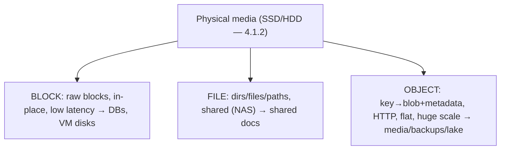
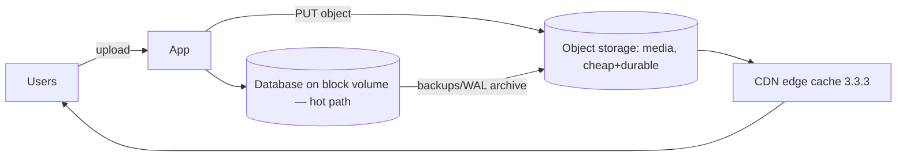

# Lesson 4.1.3 — Block vs File vs Object Storage

> Part 4: Storage Systems · Module 4.1: Storage Hardware Reality · Difficulty: 🟡
>
> **Prerequisites:** [4.1.1 Memory hierarchy], [4.1.2 Disks/page cache/fsync], [3.2.1 HTTP].
> **Unlocks:** [4.3.2 Object/blob storage internals], [Part 6 CDN/caching], [Part 13 Cloud Native], [Part 18 case studies].

---

## 1. Learning Objectives

After this lesson you will be able to:

- Distinguish the three storage **abstractions** — **block**, **file**, and **object** — by their interface, granularity, and metadata model.
- Explain what each is good and bad at, and **which workloads** map to each (databases/VMs → block; shared documents → file; media/backups/data-lake → object).
- Explain why **object storage** (S3-style) became the default substrate for the cloud: flat namespace, HTTP API, massive scalability, cheap, durable — and its tradeoffs (eventual behavior historically, latency, no in-place edit).
- Reason about **tiering and lifecycle** (hot/warm/cold/archive) and how object storage pairs with CDNs and databases.

---

## 2. Motivation — The same disk, three very different contracts

Underneath everything is the physical media of 4.1.2, but applications never touch raw flash. They consume one of **three abstractions**, each exposing a different **contract** over storage:

- **Block storage** hands you a raw array of fixed-size blocks (a "virtual disk") — the lowest-level, highest-performance abstraction, on which file systems and databases are built.
- **File storage** gives you the familiar **hierarchical file system** (directories, files, paths, permissions) — shareable across machines (NAS).
- **Object storage** gives you a **flat namespace of immutable-ish objects** (key → blob + metadata) accessed over an **HTTP API** — built for internet-scale, cheap, durable bulk storage.

Choosing wrong is a classic, expensive mistake: putting a transactional database on object storage (terrible random-update latency), or dumping petabytes of media into a block volume (no scale, no cheap durability, no HTTP access). Object storage in particular reshaped cloud architecture — it's where you put images, videos, backups, logs, data-lake files, and static assets, and it's the origin behind most CDNs (3.3.3) and the landing zone for most data pipelines (Part 9). Knowing the three contracts — and their performance/scaling/cost profiles — lets you place each kind of data on the right substrate (and is a frequent interview discriminator).

---

## 3. Theory — From first principles

### 3.1 Block storage — the raw disk abstraction

Block storage presents storage as a sequence of fixed-size **blocks** addressed by number, with **no inherent structure or metadata** — exactly the model the OS/file system or a database expects from a disk `[CS]`. You read/write blocks; *you* (via a file system or DB) impose meaning.

- **Interface:** low-level block read/write (e.g., a volume/LUN attached to one machine).
- **Granularity:** you can modify **individual blocks in place** → great for **random-access, frequently-updated** data.
- **Performance:** **lowest latency, highest IOPS** of the three — closest to the hardware.
- **Sharing:** typically attached to **one** host at a time (not natively shared).
- **Examples** `[CONV]`: cloud block volumes (EBS-style), SAN, the disk under your database/VM.
- **Use for:** **databases** (need fast random in-place updates — 4.2.x, Part 5), **VM boot/root disks**, anything needing a real file system with high-performance random I/O.

### 3.2 File storage — the shared hierarchical file system

File storage exposes the familiar **hierarchy** — directories, files, paths, metadata (permissions, timestamps), and file operations (open/read/write/seek/append) — and crucially can be **shared by many clients** over a network (**NAS**, via protocols like NFS/SMB) `[CS]`.

- **Interface:** file-system semantics (POSIX-like): paths, partial reads/writes, locking, in-place edits.
- **Granularity:** edit parts of files in place; append; seek.
- **Sharing:** **multiple machines mount the same file system** → shared documents, home directories, shared application data.
- **Performance:** good, but the hierarchy + shared-access coordination (locking, consistency) **limits scale** vs object storage; metadata operations on huge trees get expensive.
- **Examples** `[CONV]`: NFS/SMB shares, managed cloud file systems (EFS/Filestore-style).
- **Use for:** **shared file access across servers**, lift-and-shift apps expecting a file system, content shared by many users/processes with directory semantics.

### 3.3 Object storage — flat, HTTP, internet-scale

Object storage stores **objects** = **blob of bytes + rich metadata + a unique key**, in a **flat namespace** (often grouped into **buckets**), accessed over an **HTTP(S) API** (GET/PUT/DELETE) rather than a file-system mount `[CS]`. This is the S3-style model that defines cloud bulk storage.

- **Interface:** **HTTP API** (PUT object, GET object, DELETE) by **key** — no mounting, no seek/partial in-place edit in the traditional sense.
- **Namespace:** **flat** (key→object); "folders" are just key prefixes (e.g., `2024/06/img.jpg`), not real directories — this flatness is what enables massive horizontal scale.
- **Mutability:** objects are effectively **replace-whole / immutable-ish** — you typically **overwrite the entire object**, not edit bytes in place (no random in-place updates). Good for **write-once, read-many** data.
- **Metadata:** **rich, custom metadata** per object (content type, tags, user metadata) — useful for data lakes/search.
- **Scalability/durability/cost:** **virtually unlimited scale**, **very high durability** (data replicated/erasure-coded across devices/AZs — "eleven nines" class claims, representative), and **cheap per GB** — the cheapest of the three for bulk data. **Latency is higher** (HTTP round trip, not local block I/O) and there's **no in-place modification**.
- **Consistency:** modern object stores offer **strong read-after-write consistency** for new objects (historically some were eventually consistent — a classic gotcha; today S3 is strongly consistent — representative).
- **Examples** `[CONV]`: Amazon S3, Google Cloud Storage, Azure Blob Storage, MinIO (self-hosted).
- **Use for:** **media (images/video), backups, logs, data-lake/analytics files, static website assets, large file storage**, CDN origins (3.3.3), ML datasets.

### 3.4 Side-by-side

| Dimension | **Block** | **File** | **Object** |
|---|---|---|---|
| Abstraction | raw blocks (virtual disk) | hierarchical files/dirs | flat key → blob + metadata |
| Interface | block read/write | file system (POSIX-ish) | HTTP API (PUT/GET/DELETE) |
| In-place edit | yes (per block) | yes (partial/seek) | no (replace whole object) |
| Sharing | one host (usually) | many hosts (NAS) | many clients over HTTP |
| Metadata | none (you impose it) | file-system attrs | rich, custom per object |
| Scale | limited (volume size) | moderate | **virtually unlimited** |
| Durability/cost | per-volume; pricier | moderate | **very durable, cheapest/GB** |
| Latency | **lowest** (local I/O) | low–moderate | higher (HTTP) |
| Best for | DBs, VM disks | shared file access | media, backups, data lake, assets |

### 3.5 Why object storage won the cloud

The **flat namespace + HTTP API** decisions are what let object storage scale almost arbitrarily and be offered cheaply and durably `[CS]`:
- No hierarchical-directory bookkeeping to coordinate → easy to **partition/shard by key** across a massive distributed system (Part 7).
- HTTP access → reachable from anywhere, integrates with CDNs (3.3.3), web apps, and pipelines without mounts.
- Replication/erasure coding across AZs → extreme durability without the app doing anything (Part 10/11).
- Pay-per-use, tiered pricing → economical for petabytes.

The cost is giving up **low-latency random in-place updates** — which is exactly why you **don't** run a transactional database on it, but you **do** put the database's **backups, big blobs, and cold data** there.

### 3.6 Storage tiering & lifecycle

Object stores (and storage strategy generally) offer **tiers** trading latency/cost `[CONV]`:
- **Hot** (frequent access, higher cost) → **warm/infrequent** → **cold/archive** (e.g., Glacier-style: very cheap, retrieval takes minutes–hours).
- **Lifecycle policies** automatically transition objects between tiers and **expire/delete** old data (e.g., move logs to archive after 30 days, delete after a year).

This is 4.1.1's hierarchy extended to *cost-aware* tiers: keep hot data fast/expensive, push cold data cheap/slow. Pairs with **CDN** for hot read-heavy content (cache hot objects at the edge — 3.3.3) and with **databases** (block) for the transactional hot path.

### 3.7 How they compose in a real system

```
DB (block volume, fast random I/O) — system of record (Part 5)
   → backups / exports / WAL archives → object storage (cheap, durable)
media uploads (images/video) → object storage → CDN edge cache (3.3.3) → users
data-lake files / logs / events → object storage → batch/stream processing (Part 9)
shared config/working files across servers → file storage (NAS)
```

A typical architecture uses **all three**: block for the database, object for blobs/backups/lake, file for shared mounts where needed.

---

## 4. Visual Intuition

### Three contracts over the same media



### Object storage + CDN + DB composition



---

## 5. Real-World Analogy

Think of three ways to keep stuff.

- **Block storage** is a **stack of blank, numbered index cards** handed to a librarian (the file system/DB). The cards have no inherent meaning — the librarian decides how to organize them, can rewrite any single card instantly, and works extremely fast — but only **one librarian** uses that stack, and there are only so many cards.
- **File storage** is a **shared office filing cabinet** with labeled folders and a hierarchy everyone in the building can open, file into, and edit. Convenient and shareable, but as the cabinet grows to warehouse size, finding and coordinating access gets slow, and there's a practical limit to how big one shared cabinet scales.
- **Object storage** is a **planet-scale self-storage company**: you hand over a sealed box (object) with a label (key) and a packing list (metadata), and they give you a tracking URL. You can store **effectively unlimited** boxes incredibly cheaply and they **guarantee they won't lose them** (massive durability) — but you **can't reach in and edit one item inside a box**; you take the whole box out, change it, and put a new box back (replace-whole). Retrieval is a request over the counter (HTTP) rather than reaching into your own desk drawer (slightly slower), and **archive tiers** are like deep off-site vaults — dirt cheap, but it takes a while to retrieve.

You use **all three**: the librarian's fast cards for your working ledger (database on block), the shared cabinet for team documents (file), and the self-storage company for all your media, photos, and backups (object).

---

## 6. Industry Example

- **S3 as the cloud's default bulk store** `[CONV]`: Amazon S3 (and GCS/Azure Blob) store media, backups, logs, static assets, and data-lake files at internet scale; they're the **origin behind most CDNs** (3.3.3) and the landing zone for analytics/ML pipelines (Part 9, 18). *(Internals in 4.3.2; durability/consistency claims representative.)*
- **Block for databases/VMs** `[CONV]`: cloud block volumes (EBS-style) back transactional databases and VM disks, where low-latency random in-place I/O is essential (Part 5).
- **File for shared access** `[CONV]`: managed NFS/SMB (EFS/Filestore-style) for apps/teams needing a shared POSIX file system across many instances.
- **Lifecycle tiering** `[CONV]`: hot→infrequent→archive (Glacier-style) lifecycle policies cut cost for aging data (backups, logs) — retrieval latency grows as cost drops.
- **Strong read-after-write** `[CONV]`: modern S3 provides strong consistency for new objects, removing a classic eventual-consistency gotcha (representative; historically eventually consistent).

---

## 7. Implementation Details — placing data on the right substrate

- **Database / transactional hot path → block storage** (low-latency random in-place I/O); never run an OLTP DB on object storage (4.2.x, Part 5).
- **Large blobs (images, video, files), backups, logs, data-lake/analytics, static assets → object storage** (cheap, durable, HTTP, scalable); front read-heavy hot objects with a **CDN** (3.3.3).
- **Shared file access across servers (POSIX semantics) → file storage** (NAS) — but watch scale/coordination limits; prefer object storage if you don't truly need a mounted file system.
- **Store *references*, not blobs, in your database:** keep big files in object storage and store the **object key/URL** in the DB (don't stuff large blobs into relational rows) — a near-universal pattern.
- **Use lifecycle policies & tiers** to move cold data to archive and expire old data automatically (cost control).
- **Mind object-storage semantics:** no partial in-place edits (replace whole objects, or use multipart upload for large ones), higher per-request latency, eventual vs strong consistency (know your provider's guarantee).
- **Leverage object metadata** for data-lake organization/search; partition by key prefix for scale and lifecycle.

## 8. Advantages (by type)

- **Block:** lowest latency / highest IOPS, in-place random updates, runs real file systems/DBs.
- **File:** shared access across hosts with familiar POSIX/hierarchy semantics; easy lift-and-shift.
- **Object:** virtually unlimited scale, very high durability, cheapest per GB, HTTP-accessible from anywhere, rich metadata, CDN/pipeline-friendly, tiering/lifecycle.

## 9. Disadvantages (by type)

- **Block:** limited scale (volume size), usually single-host attach, pricier per GB, you manage durability/backup.
- **File:** scaling and shared-access coordination (locking/consistency) limits; metadata-heavy operations on huge trees slow.
- **Object:** higher latency (HTTP), **no in-place edits** (replace-whole), not for transactional/random-update workloads, historically eventual consistency, per-request/egress costs.

---

## 10. When NOT to use each

- **Don't use object storage** for **transactional databases**, frequently-edited small records, or anything needing low-latency random in-place writes (use block — 4.2.x).
- **Don't use block storage** for **petabyte-scale media/backups** or content that must be globally HTTP-accessible and cheaply durable (use object).
- **Don't use file storage (NAS)** when you need internet-scale, HTTP-native bulk storage (use object) or maximum DB performance (use block) — reserve it for genuine shared-file-system needs.
- **Don't store large blobs in a relational database** — store them in object storage and keep a reference (4.3.2, Part 5).

---

## 11. Common Mistakes

1. **Putting a database on object storage** (or expecting in-place edits) → terrible latency / impossible semantics.
2. **Storing big blobs in the database** → bloated rows, slow backups, expensive scaling (use object + reference).
3. **Using file storage (NAS) as a scaling crutch** for what should be object storage — hitting coordination/scale limits.
4. **Ignoring object-storage latency/consistency semantics** — assuming local-disk latency or instant overwrite visibility (know strong vs eventual).
5. **No lifecycle/tiering** → paying hot prices for cold data (logs/backups never archived/expired).
6. **Treating object "folders" as real directories** — they're key prefixes; designing as if rename/move is cheap (it's a copy+delete).
7. **Not fronting hot objects with a CDN** → high latency + egress cost for popular media (3.3.3).

---

## 12. Interview Questions

**🟢 Easy**
- What are the three storage types and how do their interfaces differ?
- Why would you store user-uploaded images in object storage rather than in your database?

**🟡 Medium**
- Why is object storage cheaper and more scalable than block storage, and what do you give up for that?
- When do you choose file storage over object storage?

**🔴 Hard**
- Design media storage and delivery for a photo/video app: where do originals, derivatives, metadata, and the transactional data live, and how do object storage + CDN + database compose?
- Explain why you can't run an OLTP database on object storage, tying it back to in-place updates, random I/O, and latency (4.1.1/4.1.2/4.2.x).

**⚫ Staff+**
- Design a data-lake/storage tiering strategy for an org generating petabytes of logs/events: ingestion, object-storage layout (key/partitioning), lifecycle to archive, and how analytics (Part 9) and CDNs (3.3.3) consume it. Justify cost/latency tradeoffs.
- Discuss the consistency model of object storage (eventual vs strong read-after-write) and how it affected (and affects) application design and pipelines (Part 10).

---

## 13. Production Pitfalls

- **Latency/cost surprise:** treating object storage like a local disk in a hot path → slow requests and high per-request/egress bills (front with CDN/cache).
- **Eventual-consistency bugs (legacy):** reading an object right after write and getting a stale/missing result on eventually-consistent stores — race conditions in pipelines (know your guarantee).
- **DB bloat from blobs:** storing large files in DB rows → giant backups, slow restores, replication strain (Part 5).
- **Runaway storage cost:** no lifecycle policies; cold logs/backups sitting in hot tier for years.
- **Expensive "renames":** scripts that "move/rename" millions of objects (actually copy+delete) → huge cost/time (flat namespace reality).
- **NAS bottleneck:** a shared file system becoming a scaling/contention chokepoint for an app that should use object storage.

---

## 14. Optimization Techniques

- **Right substrate per data type** (block=DB/VM, file=shared mounts, object=blobs/backups/lake) — the primary lever.
- **Object + CDN** for hot read-heavy media (edge caching cuts latency + origin load/egress — 3.3.3).
- **Lifecycle tiering** (hot→infrequent→archive) + expiration to minimize cost (4.1.1 hierarchy, cost-aware).
- **Store references in DB, blobs in object storage**; use multipart upload for large objects; parallelize GETs.
- **Partition object keys by prefix** (e.g., date/hash) for scale, parallelism, and lifecycle targeting (Part 7).
- **Cache/metadata index** object metadata in a fast store/DB for queryability (data-lake catalogs).
- **Use block volume types matched to IOPS/throughput needs** for databases (provisioned IOPS for hot OLTP).

---

## 15. Summary

Applications never touch raw flash (4.1.2) — they consume one of three **abstractions**, each a different **contract**. **Block storage** is a raw array of fixed-size blocks (a virtual disk): **lowest latency, highest IOPS, in-place random updates**, but usually single-host and limited in scale — the right home for **databases and VM disks** (Part 5). **File storage** adds a **hierarchical, shareable file system** (NAS, POSIX-ish, paths/permissions, partial edits) for **shared file access across servers**, at the cost of scaling/coordination limits. **Object storage** stores **key → blob + rich metadata** in a **flat namespace** over an **HTTP API**: **virtually unlimited scale, extreme durability, cheapest per GB**, reachable anywhere and CDN/pipeline-friendly — but **no in-place edits** (replace-whole), higher latency, and historically eventual consistency — making it the cloud's default for **media, backups, logs, data-lake files, and static assets** (and the origin behind most CDNs, 3.3.3). The flat-namespace + HTTP design is *why* object storage scales and is cheap, and the loss of low-latency random in-place updates is *why* you don't run a transactional DB on it but you do put its backups and blobs there. Real systems use **all three** — block for the transactional hot path, object for bulk/cold/blobs (with **lifecycle tiering** hot→archive and a CDN for hot reads), and file for genuine shared-mount needs — and the common rule is **store blobs in object storage and references in the database**.

---

## 16. Revision Notes (flashcard-ready)

- **Q:** The three abstractions? **A:** Block (raw blocks/virtual disk), File (hierarchical shared FS/NAS), Object (key→blob+metadata over HTTP).
- **Q:** Block — traits & use? **A:** Lowest latency, in-place random updates, single-host, limited scale → databases, VM disks.
- **Q:** File — traits & use? **A:** POSIX hierarchy, shared by many hosts (NFS/SMB) → shared documents/working files; scale-limited.
- **Q:** Object — traits & use? **A:** Flat namespace, HTTP API, huge scale, very durable, cheapest/GB, no in-place edit → media/backups/logs/lake/assets.
- **Q:** Why did object storage win the cloud? **A:** Flat namespace + HTTP → easy massive sharding, cheap durable replication, CDN/pipeline integration.
- **Q:** Object storage's big limitation? **A:** No low-latency random in-place updates (replace whole object) + higher latency → not for OLTP DBs.
- **Q:** Where do big blobs go vs the DB? **A:** Blob in object storage; store the key/URL reference in the DB.
- **Q:** Tiering/lifecycle? **A:** Hot→infrequent→archive (cheaper/slower) + auto-expire; cost-aware extension of the hierarchy.
- **Q:** "Folders" in object storage? **A:** Just key prefixes, not real dirs; rename/move = copy+delete (costly).

---

## 17. Further Reading + Knowledge-Graph Links

**Within this platform**
- **Previous:** [4.1.2 Disks/page cache/fsync]. **Next:** [4.2.1 Log-structured vs page-oriented engines] (Module 4.2 — storage engines).
- **Deepened by:** [4.3.2 Object/blob storage internals & lifecycle]. **Composes with:** [3.3.3 CDNs] (object as origin), [Part 5 Databases] (block), [Part 9 Messaging] (object as data-lake landing zone), [Part 13 Cloud Native] (cloud storage), [Part 18 case studies].
- **Builds on:** [4.1.1 hierarchy/latency], [4.1.2 media behavior].

**Foundational texts (synthesized)**
- Kleppmann, *Designing Data-Intensive Applications* — storage substrates and data systems (synthesized).
- Cloud provider storage documentation (object/block/file services) — representative for interfaces, durability, tiering, consistency.

**Concept tags:** `[CS]` block vs file vs object abstractions, flat namespace, in-place vs replace-whole · `[CONV]` S3-style object storage, NAS file storage, cloud block volumes, lifecycle tiering, strong read-after-write · `[BP]` blobs in object storage + reference in DB, object+CDN for hot media, lifecycle/expiration for cost.
