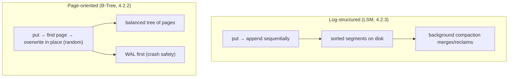
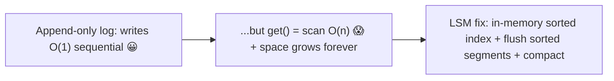

# Lesson 4.2.1 — Log-Structured vs Page-Oriented Storage Engines

> Part 4: Storage Systems · Module 4.2: Storage Engines · Difficulty: 🔴
>
> **Prerequisites:** [4.1.1 sequential vs random I/O], [4.1.2 page cache/fsync/write amplification], [2.1.x data structures].
> **Unlocks:** [4.2.2 B-Trees], [4.2.3 LSM-Trees], [4.2.4 B-Tree vs LSM], [Part 5 Databases].

---

## 1. Learning Objectives

After this lesson you will be able to:

- Define a **storage engine** and the core operations it must support (get by key, range scan, insert/update/delete) durably.
- Explain the **two foundational philosophies** — **log-structured** (append-only, sequential writes) and **page-oriented / in-place update** (mutable fixed-size pages) — and why they exist.
- Connect each philosophy to the hardware reality of 4.1.x (sequential vs random I/O, fsync, write amplification).
- Set up the deeper dives: **B-Trees** (the classic page-oriented engine, 4.2.2) and **LSM-Trees** (the classic log-structured engine, 4.2.3), and the tradeoffs between them (4.2.4).

---

## 2. Motivation — Underneath every database is a key-value store

Strip away SQL, transactions, and replication, and at the bottom of every database sits a **storage engine**: the code that actually **puts bytes on disk and gets them back**, durably and efficiently, indexed by key. How it does that — its on-disk data structure and write strategy — determines the database's fundamental performance profile: whether it's fast at writes or reads, how it uses disk space, how it behaves on SSD vs HDD, and how it handles crashes.

There are two grand traditions. The **page-oriented** approach (epitomized by the **B-Tree**, ~1970s, 4.2.2) keeps data in a tree of fixed-size pages and **updates them in place** — the foundation of essentially every traditional relational database. The **log-structured** approach (epitomized by the **LSM-Tree**, 4.2.3) **only ever appends** to sequential files and reorganizes them in the background — the foundation of many modern write-heavy NoSQL stores. They make opposite bets about the hardware truths from 4.1: page-oriented does **random in-place writes** (banking on caching and the B-tree's shallow height); log-structured turns **everything into sequential writes** (banking on 4.1.1's "sequential ≫ random" and avoiding SSD write amplification).

Understanding this split is the key that unlocks database selection (Part 5): "is this engine B-tree or LSM?" predicts its write/read/space behavior, which predicts whether it fits your workload. This lesson frames the two philosophies; 4.2.2–4.2.4 go deep.

---

## 3. Theory — From first principles

### 3.1 What a storage engine must do

At minimum, a storage engine provides a durable, indexed **key-value** interface `[CS]`:
- **`put(key, value)`** — insert or update, durably (survive a crash — 4.1.2).
- **`get(key)`** — look up a value by key (point query).
- **`delete(key)`**.
- Usually **range scans** — iterate keys in sorted order (needed for `ORDER BY`, range queries, prefix scans).

Everything above (rows, tables, SQL, secondary indexes — 4.2.5, Part 5) is built on this. The two design questions are: **how is data laid out on disk** and **how are writes applied** (in place vs append). Those answers define the engine.

### 3.2 The simplest possible engine: an append-only log

Consider the most naive durable store: a file you **only append to**. `put` = append `(key, value)` to the end; `get` = scan the file for the latest entry with that key `[CS]`.

- **Writes are blazing fast** — pure sequential appends (4.1.1's best case; minimal write amplification on SSD — 4.1.2). Append-only is also crash-friendly (you don't corrupt existing data).
- **Reads are O(n)** — scanning the whole file for a key is hopeless at scale.
- **Space grows forever** — updates/deletes just append; old versions linger.

This captures the **log-structured insight**: *writing* is trivially efficient if you only append. The entire challenge becomes **making reads fast** (add an in-memory index) and **reclaiming space** (merge/compact away old versions). That's exactly what an **LSM-tree** does (4.2.3): keep an in-memory sorted structure + an index, flush sorted segments to disk, and **compact** them in the background. The append-only log is also the foundation of the **WAL** (4.1.2, 4.2.2) and of Kafka (Part 9).

### 3.3 The page-oriented (in-place update) philosophy

The opposite approach: organize data into fixed-size **pages** (4.1.1, e.g., 4–16 KB) arranged as a **tree** (the B-Tree), and **modify pages in place** `[CS]`:
- Each key lives in a specific page; `put` finds that page and **overwrites it** (a random write).
- A **balanced tree** keeps the structure shallow (few pages to traverse), so `get` is **O(log n)** disk reads — and reads of *current* values are direct (no scanning many versions).
- **Range scans** are natural (leaf pages are linked in sorted order).

This is the **B-Tree** (4.2.2), the workhorse of relational databases for decades. Its bet: random in-place writes are acceptable because (a) the tree is shallow, (b) hot pages live in the **buffer pool / page cache** (RAM, 4.1.2), and (c) reads are excellent. Its cost: writes are **random** (worse on HDD, more write amplification on SSD), and crash safety requires a **WAL** (you must log the change before overwriting the page in place, so a crash mid-write can be recovered — 4.1.2, 4.2.2).

### 3.4 The core contrast

| | **Log-structured** (append-only) | **Page-oriented** (in-place) |
|---|---|---|
| Write pattern | **sequential appends** | **random in-place page writes** |
| Canonical engine | LSM-Tree (4.2.3) | B-Tree (4.2.2) |
| Write performance | excellent (sequential) | good but random |
| Read performance | may check multiple places (memtable + segments) | direct, O(log n) |
| Space | needs **compaction** to reclaim (old versions linger) | pages reused in place; some fragmentation |
| SSD write amplification | low for writes (but compaction adds WA — 4.2.4) | higher (random page writes) |
| Crash recovery | append-only is naturally recoverable + WAL | **WAL required** (in-place is destructive) |
| Typical users | write-heavy NoSQL (Cassandra, RocksDB-based), time-series | relational DBs (Postgres, MySQL/InnoDB), most OLTP |

### 3.5 Why both exist — it's a tradeoff, not a winner

This is 1.1.5 ("no best, only best given constraints") in its purest form `[CS]`:
- **Log-structured optimizes writes** (sequentialize everything) and is **SSD/flash-friendly**, at the cost of **read amplification** (a key might be in memory or any of several segments) and **background compaction** work (which itself consumes I/O and can cause latency spikes — 4.2.3/4.2.4).
- **Page-oriented optimizes reads** (direct, sorted, predictable) and gives **mature transactional behavior**, at the cost of **random writes** and **write amplification**.

The choice tracks the workload: **write-heavy / high-ingest** (logging, time-series, metrics, event data) leans **log-structured/LSM**; **read-heavy / transactional with complex queries** leans **page-oriented/B-tree**. Many modern systems are **pluggable** (e.g., MySQL with InnoDB (B-tree) vs MyRocks (LSM); databases on RocksDB) — the same database can use either engine (4.2.4, Part 5).

### 3.6 The common ingredient: the write-ahead log

Both worlds rely on the **append-only log** for durability `[CS]`:
- **Page-oriented:** uses a **WAL** to make in-place page updates crash-safe — log the change sequentially (+fsync) *before* mutating the page, so recovery can replay/undo (4.1.2, 4.2.2, ARIES — Part 5).
- **Log-structured:** the on-disk data *is* essentially a log; writes first go to an in-memory structure backed by a WAL for durability, then flush to sorted segments (4.2.3).

So the sequential append-only log (4.1.1/4.1.2) is the universal substrate; the engines differ in whether the **primary data structure** is also a log (LSM) or a mutable tree the log protects (B-tree).

---

## 4. Visual Intuition

### Two write philosophies

### The naive log → why LSM adds an index + compaction

---

## 5. Real-World Analogy

Think about keeping a record of changing facts (say, account balances).

- **Log-structured** is keeping a **running journal**: every time something changes, you **write a new line at the bottom** ("Alice = $100", later "Alice = $150"). Writing is effortless — always the next blank line (sequential). But to find Alice's *current* balance you'd have to read the whole journal, so you keep a **sticky-note index** of where each name's latest entry is, and periodically you **rewrite the journal cleanly**, dropping superseded lines (compaction) so it doesn't grow forever.
- **Page-oriented** is keeping a **ledger book with a page per account, sorted alphabetically**. To update Alice you **flip to her page and erase/rewrite the number in place**. Looking up any balance is fast and direct (you know exactly which page). But updating means **finding and rewriting a specific page** (random access), and if the lights go out mid-erase you could corrupt the page — so you **first jot the change in a margin journal** (the WAL) that lets you recover.

Neither is "better": the journal (LSM) is fantastic when you're **writing constantly**; the sorted ledger (B-tree) is fantastic when you're **looking things up and want clean, direct reads**. Real systems often keep a margin journal (WAL) either way for safety.

---

## 6. Industry Example

- **B-Tree relational databases** `[CS]`: Postgres, MySQL/InnoDB, SQL Server, Oracle (representative) use page-oriented B-tree engines with a WAL/redo log — the OLTP mainstream (4.2.2, Part 5).
- **LSM-based write-heavy stores** `[CS]`: Cassandra, ScyllaDB, HBase, and the huge family of **RocksDB/LevelDB**-based systems use log-structured engines for high write throughput (4.2.3) — common for time-series, metrics, event/logging data.
- **Pluggable engines** `[CONV]`: MySQL can run **InnoDB (B-tree)** or **MyRocks (LSM)**; MongoDB's WiredTiger supports B-tree and LSM-style configs (representative) — the *same* database, different engine, different write/read profile (4.2.4).
- **The append-only log everywhere** `[CS]`: WALs in relational DBs, SSTables in LSM stores, and Kafka's commit log (Part 9) all rest on the sequential-append insight (4.1.1).

---

## 7. Implementation Details — recognizing and choosing engines

- **Identify the engine to predict behavior:** B-tree/page-oriented → great reads, mature transactions, random writes; LSM/log-structured → great write throughput, SSD-friendly, read/space amplification + compaction (4.2.4).
- **Match to workload (the key decision, Part 5):** write-heavy/high-ingest/time-series → LSM; read-heavy/complex transactional queries → B-tree. When in doubt for general OLTP, a B-tree relational engine is the safe default.
- **Expect a WAL either way** — durability comes from the sequential log; tune its fsync/group-commit behavior (4.1.2).
- **For LSM, plan for compaction** — it consumes background I/O/CPU and can cause latency spikes; provision headroom and tune (4.2.3).
- **Leverage pluggability** where the database supports it (e.g., switch to an LSM engine for a write-heavy table) — but test, since semantics/perf differ (4.2.4).
- **Don't reinvent it** — use a proven engine/embedded library (RocksDB, SQLite, etc.) rather than writing your own; storage engines are subtle (crash safety, concurrency).

## 8. Advantages

- **Log-structured:** excellent (sequential) write throughput, SSD/flash-friendly (low write WA on the write path), crash-friendly append-only, good compression of sorted segments.
- **Page-oriented:** excellent and predictable reads (O(log n), direct current values), natural range scans, mature transactional/locking semantics, in-place space reuse.
- **Both (via WAL):** durable, crash-recoverable.

## 9. Disadvantages

- **Log-structured:** read amplification (check memtable + multiple segments), space amplification until compaction, **compaction overhead/latency spikes**, more complex tuning (4.2.3/4.2.4).
- **Page-oriented:** random in-place writes (worse on HDD, more SSD write amplification), WAL means each change written ~twice, fragmentation, write throughput lower than LSM under heavy ingest.

---

## 10. When NOT to use each

- **Don't force LSM** on a **read-heavy, latency-sensitive, transaction-heavy** workload where its read/compaction amplification hurts — a B-tree is usually better (4.2.4).
- **Don't force a B-tree** on an **extreme write-ingest** workload (metrics/logs/time-series) where random-write/WA cost dominates — LSM shines there.
- **Don't hand-roll a storage engine** for a normal application — use a database/embedded engine; only build your own with a very specific, justified need.
- **Don't pick based on the engine alone** — engine is one input; consistency, query model, ops, and ecosystem matter too (Part 5).

---

## 11. Common Mistakes

1. **Not knowing your DB's engine** — and thus being surprised by its write/read/space/compaction behavior in production.
2. **Putting a write-heavy ingest workload on a B-tree** and hitting random-write/WA limits (should consider LSM).
3. **Ignoring LSM compaction** — unprovisioned compaction I/O causes latency spikes and disk-full incidents (4.2.3).
4. **Assuming append-only = free reads** — forgetting LSM needs indexes + compaction to make reads/space viable.
5. **Skipping/forgetting the WAL's role** — not understanding why durability and recovery work (4.1.2).
6. **Reinventing a storage engine** — underestimating crash-safety/concurrency subtlety.
7. **One-size-fits-all** — using a single engine for wildly different workloads instead of choosing per workload/table (pluggable engines).

---

## 12. Interview Questions

**🟢 Easy**
- What does a storage engine do, and what's the minimal interface it provides?
- What's the difference between an append-only (log-structured) and an in-place (page-oriented) write strategy?

**🟡 Medium**
- Why are writes fast but reads slow in a naive append-only log, and how does an LSM-tree fix both problems?
- Why do page-oriented engines need a write-ahead log?

**🔴 Hard**
- Tie each philosophy to the hardware (4.1.x): why is log-structured SSD-friendly and great for writes, and why does page-oriented favor reads? What does each cost?
- Given a high-ingest time-series workload vs a transactional order-management system, which engine for each and why (preview 4.2.4)?

**⚫ Staff+**
- Design the storage layer for a system with both a write-heavy event stream and a read-heavy transactional core. Would you use one engine or split (pluggable/polyglot)? Justify (Part 5).
- Explain how the append-only log unifies WAL, LSM SSTables, and Kafka (Part 9), and the general principle "make writes sequential, make reads use an index, reclaim space in the background."

---

## 13. Production Pitfalls

- **Compaction-induced latency/space incidents (LSM):** background compaction saturating disk I/O → read latency spikes; or falling behind → space amplification and disk-full (4.2.3).
- **Write throughput wall (B-tree):** heavy ingest causing random-write/WA bottlenecks and WAL pressure under load (4.2.2).
- **Surprise from unknown engine:** ops tuned for a B-tree applied to an LSM store (or vice versa), making things worse.
- **Recovery surprises:** misconfigured WAL/durability changing crash-recovery behavior or data-loss window (4.1.2, Part 11).
- **Read amplification under-provisioned (LSM):** point lookups touching many SSTables without enough bloom filters/cache → slow reads (4.2.3).

---

## 14. Optimization Techniques

- **Choose the engine for the dominant access pattern** (write-heavy→LSM, read/transaction-heavy→B-tree) — the biggest lever (4.2.4, Part 5).
- **Tune the WAL** (group commit, fsync policy) to balance durability and throughput (4.1.2).
- **For LSM:** tune compaction strategy, bloom filters, and block cache to control read/space amplification and latency (4.2.3).
- **For B-tree:** size the **buffer pool** to keep hot pages in RAM, exploit locality, and reduce random disk reads (4.1.1, 4.2.2).
- **Use pluggable/polyglot engines** to match each table/workload (4.2.4, Part 5 polyglot persistence).
- **Lean on proven embedded engines** (RocksDB/SQLite) instead of bespoke code.

---

## 15. Summary

Beneath every database is a **storage engine** — the code that durably puts keyed bytes on disk and gets them back (with point lookups and range scans). Its on-disk structure and write strategy set the database's fundamental performance profile, and there are **two grand philosophies**, each a different bet on the hardware truths of 4.1. **Log-structured** engines (canonically the **LSM-Tree**, 4.2.3) **only append**, turning all writes into fast **sequential** I/O (4.1.1) and avoiding SSD write amplification on the write path — then they add in-memory indexes to make reads viable and **compact** segments in the background to reclaim space; the cost is **read/space amplification and compaction overhead**. **Page-oriented** engines (canonically the **B-Tree**, 4.2.2) lay data out in a balanced tree of fixed-size **pages** updated **in place**, giving **excellent, predictable reads** (O(log n), direct current values, natural range scans) and mature transactional semantics; the cost is **random writes** (worse on HDD, more SSD write amplification) and the need for a **WAL** to make destructive in-place updates crash-safe. Both rest on the **append-only log** (4.1.2) for durability — the difference is whether the *primary data structure* is itself a log (LSM) or a mutable tree the log protects (B-tree). Neither wins universally (1.1.5): **write-heavy/high-ingest** workloads favor log-structured/LSM; **read-heavy/transactional** workloads favor page-oriented/B-tree — and many databases are **pluggable**, so the same system can be either. Knowing which engine a database uses is one of the most predictive facts for whether it fits your workload (Part 5), and 4.2.2–4.2.4 go deep on each and their tradeoffs.

---

## 16. Revision Notes (flashcard-ready)

- **Q:** What is a storage engine? **A:** The component that durably stores/retrieves keyed bytes (get/put/delete + range scan); foundation under SQL/tables.
- **Q:** Two philosophies? **A:** Log-structured (append-only, sequential writes → LSM) vs page-oriented (in-place page updates → B-tree).
- **Q:** Naive append-only log: pros/cons? **A:** Writes O(1) sequential (great); reads O(n) + space grows forever (bad) → LSM adds index + compaction.
- **Q:** Why is log-structured SSD-friendly? **A:** Sequential appends minimize write amplification vs random in-place writes (4.1.2).
- **Q:** Why do B-trees need a WAL? **A:** In-place overwrite is destructive; log the change first so a crash mid-write is recoverable (4.1.2).
- **Q:** Log-structured tradeoff? **A:** Great writes; pays read amplification + space amplification + compaction overhead.
- **Q:** Page-oriented tradeoff? **A:** Great reads/transactions; pays random writes + write amplification + WAL double-write.
- **Q:** Workload→engine? **A:** Write-heavy/ingest/time-series → LSM; read-heavy/transactional → B-tree; many DBs are pluggable.
- **Q:** Common substrate? **A:** The append-only log (WAL / SSTables / Kafka) — sequentialize writes, index for reads, reclaim in background.

---

## 17. Further Reading + Knowledge-Graph Links

**Within this platform**
- **Builds on:** [4.1.1 sequential vs random I/O], [4.1.2 page cache/fsync/write amplification]. **Next:** [4.2.2 B-Trees] → [4.2.3 LSM-Trees] → [4.2.4 B-Tree vs LSM tradeoffs].
- **Foundation for:** [4.2.5 Indexing], [Part 5 Databases] (engine selection, durability/recovery), [Part 9 Messaging] (the log), [Part 6 Caching] (buffer pool).
- **Tradeoff lens:** [1.1.5 Tradeoffs], [reference/tradeoff-worksheet].

**Foundational texts (synthesized)**
- Kleppmann, *Designing Data-Intensive Applications* — Ch. "Storage and Retrieval": log-structured vs page-oriented, LSM vs B-tree.
- Silberschatz et al., *Database System Concepts* — file/page organization, indexing, recovery.
- RocksDB/LevelDB and relational-engine documentation — representative.

**Concept tags:** `[CS]` storage engine, append-only log, log-structured vs in-place, B-tree vs LSM, WAL durability · `[CONV]` pluggable engines (InnoDB/MyRocks), RocksDB-based stores · `[BP]` choose engine by workload, use proven engines, plan for compaction/WAL tuning.
