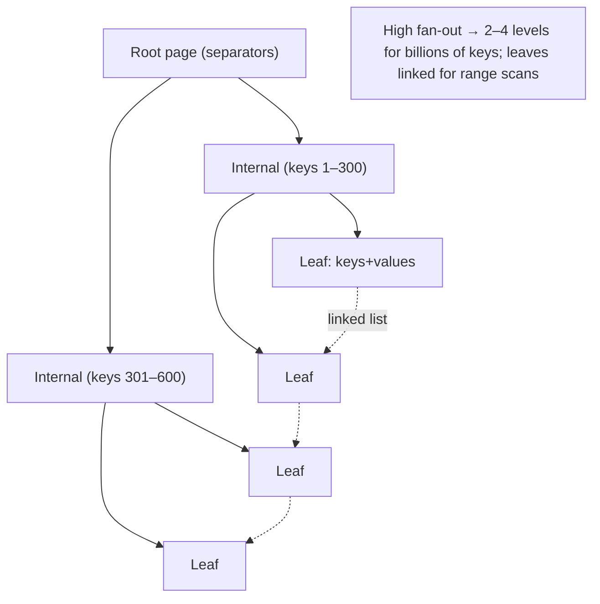
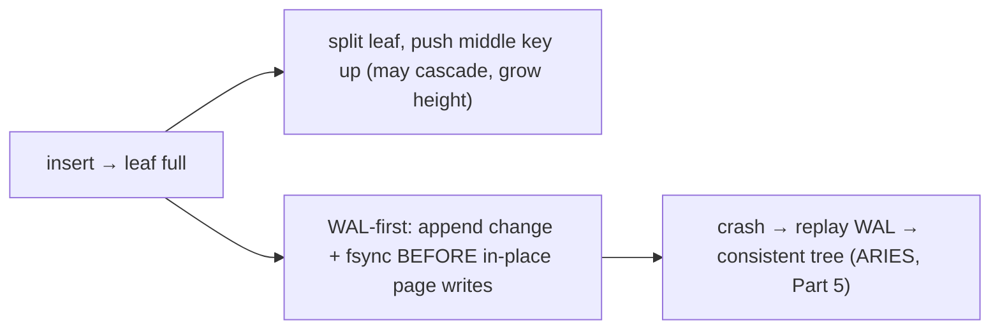

# Lesson 4.2.2 — B-Trees: Structure, Operations, Page Layout, and the WAL

> Part 4: Storage Systems · Module 4.2: Storage Engines · Difficulty: 🔴
>
> **Prerequisites:** [4.1.1 hierarchy/blocks], [4.1.2 page cache/fsync/WAL], [4.2.1 page-oriented vs log-structured].
> **Unlocks:** [4.2.3 LSM-Trees], [4.2.4 B-Tree vs LSM], [4.2.5 Indexing], [Part 5 Databases (transactions/recovery)].

---

## 1. Learning Objectives

After this lesson you will be able to:

- Describe the **B-Tree / B+Tree** structure: fixed-size pages, high fan-out, balanced height, sorted keys, linked leaves.
- Walk through **search, insert (with page splits), and delete (with merges)** and explain why operations are **O(log n)** disk accesses.
- Explain the **page layout** (the page as the unit of I/O and caching) and how high fan-out keeps the tree **shallow** (2–4 levels for huge datasets).
- Explain why B-trees need a **WAL/redo log** for crash safety (in-place updates are destructive), and how this connects to durability/recovery (4.1.2, Part 5).

---

## 2. Motivation — The data structure that has run databases for 50 years

The **B-Tree** is the most important on-disk data structure in the history of databases. Invented around 1970, it remains the default index and storage structure of nearly every relational database (Postgres, MySQL/InnoDB, SQL Server, Oracle) and many key-value/document stores. When you create an index in SQL, you almost certainly get a B-tree (specifically a **B+Tree**).

Its genius is that it's **explicitly designed for the storage hierarchy** of 4.1: it matches the **page/block** as the unit of I/O, and its **high fan-out** (hundreds of children per node) makes the tree extremely **shallow**, so even a table with billions of rows is only a handful of page reads from any value. That's the page-oriented bet from 4.2.1: pay for **random in-place writes** (mitigated by the buffer pool and a WAL) in exchange for **fast, predictable, direct reads** and natural sorted **range scans** — exactly what transactional, query-rich workloads need.

Understanding the B-tree explains how indexes work (4.2.5), why certain queries are fast or slow, why databases use a WAL (4.1.2), and what you're trading away when you instead pick an LSM-tree (4.2.3/4.2.4). It is foundational for all of Part 5.

---

## 3. Theory — From first principles

### 3.1 The structure

A **B-Tree** is a **balanced search tree** where each **node is a disk page** (4.1.1) and each node holds **many keys and many child pointers** `[CS]`:
- Keys within a node are **sorted**; child pointers sit between keys, so a node partitions the key space into ranges (a key `k` between separators `a` and `b` lives in the child for `[a,b)`).
- **High fan-out (branching factor):** because a page is large (KB) and keys/pointers are small, each node can have **hundreds** of children. Fan-out `f` means a tree of height `h` indexes ~`f^h` keys.
- **Balanced:** all leaves are at the **same depth**; the tree stays shallow as it grows (the structure self-balances on insert/delete).

**B+Tree (the variant databases actually use)** `[CS]`: **all values live in the leaf level**; internal nodes hold *only keys* (separators) to guide the search. Leaves are **linked in sorted order** (a linked list). Benefits: internal nodes pack in more keys (even higher fan-out, shallower tree), and **range scans** are trivial — find the start leaf, then walk the leaf linked list in order. When people say "B-tree index," they almost always mean a B+Tree.

### 3.2 Why it's shallow (the key performance fact)

With fan-out in the **hundreds**, the tree is astonishingly shallow `[CS]`. Illustrative: with fan-out ~500, three levels index ~500³ ≈ **125 million** keys; four levels ~**62 billion**. So a lookup in a billion-row table is **~3–4 page accesses** — and the top levels (root, maybe internal) are almost always **cached in the buffer pool** (RAM, 4.1.2), so in practice a lookup is often **one disk read or fewer**. This is why B-tree point lookups are fast and predictable: **O(log_f n)** ≈ a tiny constant number of page I/Os.

### 3.3 Search

To find key `k` `[CS]`:
1. Start at the **root** page; binary-search its sorted keys to pick the child range containing `k`.
2. Follow the child pointer to the next page; repeat down the levels.
3. Reach a **leaf**; find `k` (or determine it's absent).

Cost: **height** page reads (~2–4), minus cached pages. For a **range scan**, locate the start leaf then follow the **leaf linked list** in sorted order — efficient sequential-ish traversal (4.1.1).

### 3.4 Insert and page splits

To insert `(k, v)` `[CS]`:
1. Search to the correct **leaf** page.
2. If the leaf has **room**, insert in sorted position (an **in-place page write** — random I/O, 4.2.1).
3. If the leaf is **full**, **split** it: divide its keys into two pages and **push the middle separator key up** to the parent. If the parent is now full, it splits too — splits can **cascade up**, and if the root splits, the tree **grows one level taller** (this is how it stays balanced).

Splits are the source of some complexity and write amplification, but they're infrequent (only when pages fill) and keep the tree balanced. Databases often leave **free space in pages (fill factor)** so inserts don't constantly split.

### 3.5 Delete and merges

To delete a key, find its leaf and remove it. If a page falls below a minimum occupancy, the engine may **merge** it with a sibling or **rebalance** (borrow keys), keeping the tree balanced `[CS]`. In practice many engines defer/loosen merging (tolerate under-full pages, reclaim space lazily) for performance — leading to some fragmentation/bloat addressed by maintenance (e.g., index rebuild/`VACUUM`-style ops, Part 5).

### 3.6 Page layout — the unit of everything

A B-tree node maps to **one page** — the unit of **I/O, caching, and locking** `[CS]`:
- A page holds a header + sorted keys + pointers (internal) or keys + values/row-pointers (leaf). Keys are kept sorted within the page so search is a fast in-memory binary search once the page is loaded.
- The **buffer pool** (4.1.2) caches hot pages in RAM; the working set of upper-tree pages stays cached, so most traversal is in-memory.
- Because the page is the I/O unit, B-trees exploit **spatial locality** (4.1.1) — one read brings in many keys.
- Writes overwrite whole pages **in place** — the random-write cost of the page-oriented approach (4.2.1).

### 3.7 Crash safety: why B-trees need a WAL

In-place page updates are **destructive and dangerous on crash** `[CS]`. A single logical operation may touch multiple pages (a leaf + split into parent + maybe root). If the machine crashes **mid-update** — some pages written, others not, or a page **torn** (partially written) — the tree is left **inconsistent/corrupt**.

The fix is the **Write-Ahead Log (WAL / redo log)** from 4.1.2: **before modifying pages in place, append a record of the change to the sequential log and fsync it.** Then on crash recovery the engine **replays** the log to bring pages to a consistent state (redo committed changes; undo uncommitted) — this is **ARIES-style recovery** (Part 5). Consequences:
- **WAL-first ordering** is mandatory ("write-ahead": log before data page).
- Each change is effectively written **twice** (log + page) — write amplification, the durability tax (4.1.2).
- The WAL is **sequential + fsync'd** (with **group commit**), so durability is fast despite the random data-page writes happening later/asynchronously.
- The WAL also enables **point-in-time recovery** and is the basis for **replication** (ship the log to replicas — Part 5/10).

So the B-tree's random in-place writes are made **safe** by the sequential append-only log — the two philosophies of 4.2.1 working together.

### 3.8 Concurrency (brief)

Multiple transactions access the tree concurrently, so engines use **latching** (short-term physical locks on pages) and careful protocols (e.g., latch crabbing/coupling) to keep the structure consistent during splits/merges, plus higher-level **locking/MVCC** for transaction isolation (Part 5.2). The page-as-unit-of-locking has consequences for contention on hot pages (a production concern).

---

## 4. Visual Intuition

### B+Tree shape (shallow, linked leaves)

### Insert split + WAL

---

## 5. Real-World Analogy

A B+Tree is a **multi-level library catalog / phone book** designed so you never search linearly.

- The **top-level directory** says "names A–F → cabinet 1, G–M → cabinet 2…". Open that cabinet and a **drawer label** narrows it further ("Sm–So → drawer 3"). Open the drawer and you're at the **cards** (leaf), sorted, where you find the exact entry. Because each level fans out into **hundreds** of choices, even a phone book for the whole planet is only **three or four "open this, then that" steps** deep — that's the shallow, high-fan-out B-tree.
- The **cards are kept sorted and the drawers are in order**, so once you find a starting name you can just **read forward** through the drawers for a range ("everyone from Smith to Stone") — that's the linked-leaf range scan.
- Updating means **finding the exact card and rewriting it in place**. If a drawer gets too full to add a card, you **split it into two drawers and update the label above** (a page split, possibly cascading up).
- And because rewriting cards in place is risky — imagine a fire alarm (crash) while you're mid-rewrite — the careful librarian **first writes every intended change in a running logbook by the door** (the WAL). If chaos interrupts the work, they **replay the logbook** afterward to put every card right. The logbook is written quickly in order; the slow in-place card edits can be reconciled afterward.

---

## 6. Industry Example

- **Relational databases = B+Tree engines** `[CS]`: Postgres, MySQL/InnoDB, SQL Server, Oracle (representative) store table indexes (and often the primary data, clustered — 4.2.5) as B+Trees with a WAL/redo log and ARIES-style recovery (Part 5).
- **Default index type** `[CONV]`: `CREATE INDEX` yields a B-tree index by default in major SQL databases — the structure behind most query acceleration (4.2.5).
- **WAL as replication/PITR backbone** `[CONV]`: Postgres WAL and MySQL binlog/redo are used not only for crash recovery but for **replication** and **point-in-time recovery** (Part 5/10) — the log is reused far beyond durability.
- **Buffer pool tuning** `[CONV]`: a major lever for relational performance is sizing the **buffer pool** so hot B-tree pages stay in RAM (InnoDB buffer pool, Postgres shared_buffers + OS page cache — representative; 4.1.2).

---

## 7. Implementation Details — using B-trees well

- **Index for your queries (4.2.5):** B-trees accelerate **point lookups, equality, range, prefix, and ORDER BY** on the indexed key(s); design indexes to match query predicates and sort orders.
- **Size the buffer pool** to keep hot upper-tree pages (and ideally the working set) in RAM — the single biggest B-tree performance lever (4.1.2, Part 17).
- **Mind write cost:** inserts/updates do random page writes + WAL; very write-heavy workloads may strain B-trees (consider LSM — 4.2.3/4.2.4).
- **Leave fill-factor headroom** for insert-heavy tables to reduce page splits; rebuild/reorganize indexes periodically to fight fragmentation/bloat.
- **Tune the WAL** (group commit, fsync policy) to balance durability vs throughput (4.1.2); ensure enough WAL/redo capacity under load.
- **Watch hot-page contention** (e.g., monotonically increasing keys all inserting into the same right-most leaf → a hotspot; consider key design — also relevant to sharding, Part 7).
- **Avoid very wide/low-cardinality or random-UUID primary keys** where they hurt locality/splits (clustered-index considerations, 4.2.5).

## 8. Advantages

- **Fast, predictable reads** — O(log_f n) ≈ 2–4 page I/Os (often fewer with caching); great for point lookups.
- **Excellent range scans / ordered iteration** — sorted, linked leaves (ORDER BY, BETWEEN, prefix).
- **Shallow tree, huge capacity** — high fan-out indexes billions of rows in a few levels.
- **Mature transactional semantics** — in-place updates + WAL give robust ACID, recovery, replication, PITR (Part 5).
- **Space-efficient reads** — one current value per key (no scanning multiple versions like LSM).
- **Self-balancing** — stays efficient as data grows/shrinks.

## 9. Disadvantages

- **Random in-place writes** — worse on HDD, higher SSD write amplification than sequential/LSM (4.1.2, 4.2.4).
- **Write amplification from WAL + page writes** — each change written ~twice; splits add more.
- **Page splits/merges** — occasional restructuring cost; fragmentation/bloat over time (needs maintenance).
- **Lower write throughput under heavy ingest** than LSM (4.2.4).
- **Hot-page contention** — monotonic keys / hot rows concentrate writes on a page (latch contention).

---

## 10. When NOT to use it

- **Extreme write-ingest workloads** (metrics, logs, time-series, high-volume event capture) where random-write/WA cost dominates — prefer **LSM** (4.2.3/4.2.4).
- **Write-mostly, rarely-read** data where LSM's sequential-write advantage matters more than B-tree's read strength.
- **Pure append/streaming** logs — a log/LSM structure fits better (Part 9).
- B-trees remain the **default** for general OLTP and read/transaction-heavy workloads — don't abandon them without a write-throughput reason.

---

## 11. Common Mistakes

1. **Under-sized buffer pool** — hot pages evicted → every lookup hits disk → latency cliff (4.1.2, Part 17).
2. **Write-heavy ingest on a B-tree** then surprised by random-write/WA limits (should evaluate LSM).
3. **Monotonic/auto-increment or random-UUID key pathologies** — right-most-leaf hotspot, or poor locality/excess splits (key design matters).
4. **Ignoring index maintenance** — fragmentation/bloat degrading performance (no rebuild/VACUUM).
5. **Over-indexing** — every index is another B-tree to update on writes (write amplification) and space (4.2.5).
6. **Misunderstanding the WAL** — disabling/misconfiguring durability and widening crash-loss window (4.1.2, Part 11).
7. **Assuming reads are always 1 I/O** — ignoring cache-miss/cold-cache reality (4.1.1).

---

## 12. Interview Questions

**🟢 Easy**
- What is a B+Tree and why is it shallow even for billions of rows?
- Why are B-tree point lookups and range scans fast?

**🟡 Medium**
- Walk through an insert that causes a page split. How does the tree stay balanced?
- Why does a B-tree storage engine require a write-ahead log?

**🔴 Hard**
- Explain the full durable-write path for a B-tree update: WAL-first, fsync/group commit, in-place page write, crash recovery (ARIES). What's guaranteed after commit?
- Why do B-trees do random writes while LSM-trees do sequential writes, and what does that imply for SSD write amplification and write throughput (preview 4.2.4)?

**⚫ Staff+**
- Design indexing for a read-heavy transactional service: clustered vs secondary B-tree indexes, key design to avoid hotspots, buffer-pool sizing, and the write-amplification cost of each added index (link 4.2.5).
- A monotonically increasing primary key is causing write hotspots and latch contention on the right-most leaf at high insert rates. Diagnose and propose fixes (key design, partitioning, or engine choice).

---

## 13. Production Pitfalls

- **Cold buffer pool after restart/failover:** every read hits disk → severe latency until warmed (4.1.1, Part 13).
- **Right-most-leaf insert hotspot:** monotonic keys at high write rates cause latch contention and a throughput ceiling.
- **Index bloat/fragmentation:** updates/deletes leave under-full pages → larger indexes, slower scans (needs rebuild/VACUUM).
- **WAL/redo pressure:** under heavy writes, WAL fsync/throughput becomes the bottleneck, or WAL fills (group commit, capacity tuning — 4.1.2).
- **Write-amplification ceiling:** an ingest-heavy workload on a B-tree hitting random-write limits the LSM design would avoid (4.2.4).
- **Over-indexing slowing writes:** too many secondary indexes multiplying per-write work and space (4.2.5).

---

## 14. Optimization Techniques

- **Maximize buffer-pool/page-cache hit rate** (size to working set) — keep hot pages in RAM (4.1.2, Part 17).
- **Design keys for locality and to avoid hotspots** (clustered-index order, avoid pure monotonic at extreme write rates, or partition — Part 7).
- **Right-size indexes (4.2.5):** index for real query predicates/sort orders; avoid redundant indexes (each adds write/space cost).
- **Set fill factor / leave page headroom** for insert-heavy tables to reduce splits; rebuild/reorganize to fight bloat.
- **Tune WAL** (group commit, fsync, capacity) for durability-vs-throughput balance (4.1.2).
- **Use covering indexes** to answer queries from the index alone (avoid leaf→row fetch) (4.2.5).
- **Consider an LSM engine** for the subset of tables that are write-ingest-dominated (pluggable engines, 4.2.4).

---

## 15. Summary

The **B-Tree** (in databases, the **B+Tree**) is the page-oriented engine that has powered relational databases for ~50 years, and it's built directly around the storage hierarchy of 4.1. Each **node is a disk page**, and because pages are large while keys/pointers are small, **fan-out is in the hundreds** — making the tree **balanced and extremely shallow** (a few levels index billions of keys). So **search is O(log_f n)** ≈ 2–4 page reads (often fewer, since upper levels live in the **buffer pool** in RAM), point lookups are fast and predictable, and **range scans** are efficient because all values sit in **sorted, linked leaves**. Writes update pages **in place**: inserts find the leaf and, when full, **split** (pushing a separator up, occasionally growing the tree's height to stay balanced); deletes may **merge/rebalance**. The page is the unit of **I/O, caching, and locking**, exploiting spatial locality. The catch is that in-place updates are **random writes** (worse on HDD, more SSD write amplification, lower ingest throughput than LSM — 4.2.4) and are **destructive on crash** — so B-trees mandate a **write-ahead log**: append + fsync the change to the **sequential** WAL *before* mutating pages, enabling **ARIES-style crash recovery** (and, reused, **replication** and **point-in-time recovery**, Part 5). This is the page-oriented bet from 4.2.1 — trade random writes (tamed by the buffer pool and a sequential WAL) for **excellent, predictable reads, ordered scans, and mature transactional semantics** — which is exactly why B-trees remain the default for read- and transaction-heavy OLTP, and why you'd reach for an LSM-tree (4.2.3) instead when writes dominate.

---

## 16. Revision Notes (flashcard-ready)

- **Q:** B+Tree structure? **A:** Balanced tree; each node = a page; high fan-out; values in sorted **linked leaves**; internal nodes hold separator keys only.
- **Q:** Why shallow? **A:** Fan-out in the hundreds → a few levels index billions of keys → ~2–4 page I/Os per lookup (fewer with caching).
- **Q:** Search cost? **A:** O(log_f n) page reads; upper levels usually cached in the buffer pool.
- **Q:** Range scans? **A:** Find start leaf, walk the leaf linked list in sorted order (great for ORDER BY/BETWEEN/prefix).
- **Q:** Insert when leaf full? **A:** Split leaf, push middle key to parent; may cascade up and grow tree height (stays balanced).
- **Q:** Write pattern & cost? **A:** Random in-place page writes → worse on HDD, SSD write amplification, lower ingest throughput than LSM.
- **Q:** Why a WAL? **A:** In-place updates are destructive; log-first + fsync before page writes → ARIES crash recovery; also enables replication/PITR.
- **Q:** Biggest perf lever? **A:** Buffer-pool/page-cache hit rate — keep hot pages in RAM.
- **Q:** When prefer LSM? **A:** Write-ingest-dominated workloads (4.2.3/4.2.4).

---

## 17. Further Reading + Knowledge-Graph Links

**Within this platform**
- **Previous:** [4.2.1 Log-structured vs page-oriented]. **Builds on:** [4.1.1 blocks/locality], [4.1.2 page cache/fsync/WAL]. **Next:** [4.2.3 LSM-Trees] → [4.2.4 B-Tree vs LSM].
- **Foundation for:** [4.2.5 Indexing] (clustered/secondary/covering B-tree indexes), [Part 5 Databases] (transactions, ARIES recovery, replication, PITR), [Part 6 Caching] (buffer pool).
- **Contrast:** [4.2.3 LSM-Trees] (sequential-write alternative).

**Foundational texts (synthesized)**
- Kleppmann, *Designing Data-Intensive Applications* — B-trees, page layout, WAL, B-tree vs LSM.
- Silberschatz et al., *Database System Concepts* — B+Tree indexing, recovery/ARIES, buffer management.
- Relational-engine documentation (InnoDB, Postgres) for buffer pool / WAL specifics — representative.

**Concept tags:** `[CS]` B+Tree, fan-out/shallow height, page splits/merges, page = I/O/cache/lock unit, WAL/ARIES recovery · `[CONV]` default SQL index, buffer pool tuning, WAL for replication/PITR · `[BP]` size buffer pool, key design vs hotspots, fill factor, right-size indexes, tune WAL.
