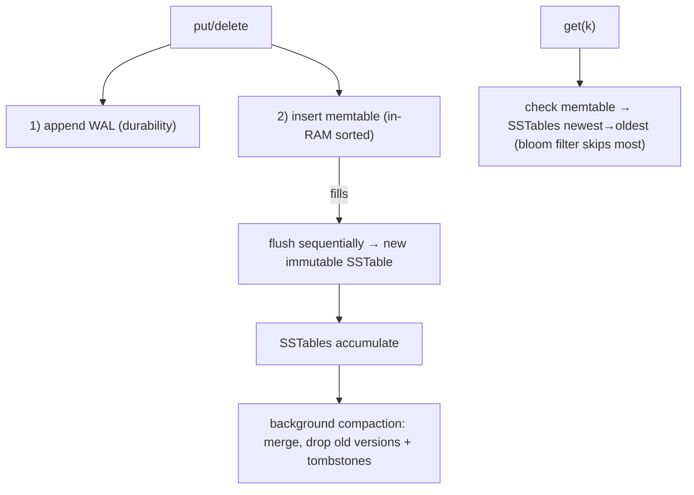
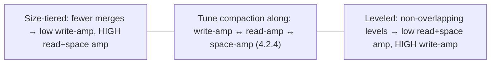

# Lesson 4.2.3 — LSM-Trees: Memtables, SSTables, Compaction, and Bloom Filters

> Part 4: Storage Systems · Module 4.2: Storage Engines · Difficulty: 🔴
>
> **Prerequisites:** [4.1.1 sequential vs random I/O], [4.1.2 page cache/fsync/write amplification], [4.2.1 log-structured], [4.2.2 B-Trees].
> **Unlocks:** [4.2.4 B-Tree vs LSM], [Part 5 Databases (NoSQL/wide-column)], [Part 9 Messaging], [Part 18 Cassandra/Bigtable].

---

## 1. Learning Objectives

After this lesson you will be able to:

- Describe the **LSM-tree** components: in-memory **memtable** (+ WAL), immutable on-disk **SSTables**, and **leveled/tiered compaction**.
- Walk the **write path** (memtable → flush → SSTable) and the **read path** (memtable → SSTables newest-to-oldest), and explain **read/space amplification**.
- Explain **compaction** (merging SSTables, reclaiming space, removing tombstones) and its cost (background I/O, latency spikes, write amplification).
- Explain the optimizations that make LSM reads viable — **bloom filters**, **sparse indexes**, **block cache** — and when LSM beats B-trees.

---

## 2. Motivation — Engineering the append-only log into a real database

4.2.1 showed the **log-structured insight**: appending is the fastest way to write (sequential I/O, low SSD write amplification — 4.1), but a naive append-only log has **O(n) reads** and **unbounded space growth**. The **LSM-tree (Log-Structured Merge-tree)** is the design that turns that insight into a production storage engine by solving both problems: keep recent writes in a **sorted in-memory structure**, flush them as **sorted immutable files**, and **merge those files in the background** to keep reads fast and reclaim space.

This is the engine behind a huge swath of modern write-heavy databases — Cassandra, ScyllaDB, HBase/Bigtable, and the enormous family of systems built on **RocksDB/LevelDB** (used inside many databases, queues, and even blockchains). It's the natural choice for **high-ingest** workloads: time-series, metrics, event/logging data, IoT, and write-heavy key-value/wide-column stores (Part 5, 18).

The price for great write throughput is **read amplification** (a key might be in memory or any of several files) and **compaction overhead** (background merging that consumes I/O and can cause latency spikes). Understanding the memtable/SSTable/compaction machinery — and the bloom-filter/sparse-index tricks that rescue read performance — lets you operate LSM systems well and choose between LSM and B-tree intelligently (4.2.4).

---

## 3. Theory — From first principles

### 3.1 The components

An LSM-tree has three core pieces `[CS]`:

1. **Memtable** — an **in-memory sorted structure** (typically a balanced tree / skip list) holding the most recent writes, sorted by key. Fast to insert and read.
2. **WAL (commit log)** — because the memtable is in volatile RAM (4.1.2), every write is **first appended to a write-ahead log on disk** for durability. If the process crashes, the memtable is rebuilt by replaying the WAL.
3. **SSTables (Sorted String Tables)** — **immutable, sorted files on disk**. When the memtable fills, it's **flushed** to a new SSTable. SSTables accumulate and are reorganized by **compaction**.

### 3.2 The write path

A write (`put`/`delete`) `[CS]`:
1. **Append to the WAL** (sequential, fsync per policy) — durability.
2. **Insert into the memtable** (in-memory sorted structure) — fast.
3. **Acknowledge** the write.
4. When the memtable reaches a size threshold, it becomes **immutable** and is **flushed sequentially to a new SSTable** (a fresh memtable takes over). The flush is a **sequential write** of already-sorted data — exactly the cheap, SSD-friendly pattern (4.1.1/4.1.2).

Crucially, **writes never do random in-place updates** — updates and deletes are just **new entries** appended to the memtable/next SSTable. A delete writes a **tombstone** (a marker "this key is deleted"); an update writes a newer version. **Newer data shadows older data.** This is why LSM **write throughput is so high** — but also why **space grows** (multiple versions/tombstones) until compaction reclaims it.

### 3.3 The read path (and read amplification)

To read a key, the engine checks locations **newest-to-oldest** and returns the first (newest) match `[CS]`:
1. **Memtable** (newest data).
2. **Immutable memtable(s)** being flushed (if any).
3. **SSTables**, newest to oldest, until the key is found (or a tombstone says it's deleted, or all are exhausted → not found).

This is **read amplification**: a single `get` may probe **multiple SSTables**. Worst case (key absent, or in the oldest SSTable) touches many files — the cost of the write-optimized design. Within each SSTable, a **sparse index** + sorted layout lets the engine binary-search to the right block, but the *number of SSTables to check* is the problem. Hence the optimizations in §3.5.

### 3.4 Compaction — the heart of LSM

**Compaction** is the background process that **merges SSTables** to keep reads fast and reclaim space `[CS]`. Because SSTables are sorted, merging is an efficient **merge-sort-style sequential** operation. Compaction:
- **Merges** multiple SSTables into fewer/larger ones.
- **Discards superseded versions** (keeps only the newest value per key) → reclaims **space amplification**.
- **Drops tombstones** once it's safe (the deleted key won't appear in any older surviving SSTable) → finalizes deletes.
- **Reduces the number of SSTables** a read must check → cuts **read amplification**.

**Compaction strategies (the key operational knob)** `[CS]`:
- **Size-tiered (STCS):** merge SSTables of similar size into bigger ones. **Write-optimized** (less frequent merging), but **higher space + read amplification** (more/larger overlapping tables; temporary 2× space during compaction).
- **Leveled (LCS):** organize SSTables into **levels** where each level holds non-overlapping key ranges and is ~10× larger than the one above. A key lives in **at most one SSTable per level**, so reads check far fewer files → **read- and space-optimized**, but **higher write amplification** (data is rewritten as it moves down levels).
- (Hybrids and time-windowed strategies exist, e.g., for time-series.)

This is the central LSM tradeoff triangle (4.2.4): **write amplification ↔ read amplification ↔ space amplification** — you tune compaction to favor whichever your workload needs. Compaction is also the source of LSM's main operational pain: it consumes background **I/O and CPU**, can cause **latency spikes** (competing with foreground traffic) and **temporary space spikes**, and if it **falls behind** under heavy write load, read amplification and disk usage grow dangerously.

### 3.5 Making reads fast: bloom filters, sparse indexes, block cache

LSM rescues read performance with several optimizations `[CS]`:

- **Bloom filters** — a **probabilistic, space-efficient** structure per SSTable that answers "is key `k` *possibly* in this SSTable?" with **no false negatives** (if it says "no," `k` is definitely absent) and a tunable small false-positive rate. Before touching an SSTable on disk, the engine checks its bloom filter; most SSTables that **don't** contain the key are **skipped without any disk I/O**. This dramatically cuts read amplification, *especially for non-existent keys* (which would otherwise touch every SSTable). Bloom filters are one of the most important reasons LSM reads are practical.
- **Sparse index / block index** — each SSTable has an in-memory index of **some** keys (e.g., one per block) so the engine can binary-search to the right block and read just that block (exploiting sorted layout + blocks, 4.1.1) rather than scanning the file.
- **Block cache** — recently-read SSTable blocks cached in RAM (like a buffer pool, 4.1.2/Part 6) — plus the OS **page cache** serving hot SSTable data.
- **Summary/min-max + partition metadata** — skip SSTables whose key range can't contain the key.

With bloom filters + sparse indexes + caching, a point read typically touches the memtable, maybe one or two SSTables, and little disk I/O — making LSM read performance acceptable for many workloads despite the multi-file design.

### 3.6 Why it's a great fit for SSDs and write-heavy workloads

Tying back to 4.1.2: LSM **never does random in-place writes** on the data path — it does **large sequential writes** (memtable flush, compaction output), which is exactly what SSDs like (low device-level write amplification per write, good throughput, less wear) and what HDDs need (no seeks). Combined with high write throughput (writes hit RAM + sequential WAL), this makes LSM the natural engine for **ingest-heavy** systems. The tradeoff is that **compaction** introduces its *own* write amplification (data rewritten during merges) — so "low write amplification" is true for the *foreground* write but compaction adds background WA (the leveled-vs-tiered choice, §3.4, 4.2.4).

---

## 4. Visual Intuition

### Write path & read path

### Compaction strategies tradeoff

---

## 5. Real-World Analogy

Imagine running a busy **shipping/receiving desk** with a sorted logbook.

- New shipments arrive constantly. You **jot each one on a notepad on your desk**, kept in alphabetical order — instant to write (the **memtable**). To be safe against a desk fire, you also **scribble each arrival in a running logbook by the door first** (the **WAL**).
- When the notepad fills, you **copy it cleanly into a bound, sorted booklet and shelve it** — and start a fresh notepad (**flush to an SSTable**). The booklets are **never edited**; corrections are just **new notes** ("item X — updated address," or "item X — removed" = a **tombstone**).
- To **find an item's current status**, you check the **notepad first** (newest), then the **most recent booklet**, then older booklets, stopping at the first mention — because the newest note wins. Checking many booklets is slow (**read amplification**), so you keep a **quick "is it possibly in this booklet?" checklist** on each booklet's cover (the **bloom filter**): if the checklist says no, you don't even open it.
- Periodically, during downtime, you **consolidate booklets**: merge several into one clean sorted volume, **throw away superseded notes and removed items** (**compaction**) — which keeps lookups fast and shelves from overflowing. But consolidating is **labor that competes with serving customers** (compaction's background I/O and latency spikes), and if you fall behind during a rush, the shelves overflow and lookups crawl.

The whole scheme is optimized for **writing fast and a lot**; the cleverness (bloom filters, sorted booklets, consolidation) is what keeps **reading** and **shelf space** under control.

---

## 6. Industry Example

- **Cassandra / ScyllaDB / HBase / Bigtable** `[CS]`: wide-column, write-optimized stores built on LSM (memtable + SSTables + compaction + bloom filters) — the canonical high-ingest databases (Part 5, 18).
- **RocksDB / LevelDB** `[CONV]`: embeddable LSM engines used *inside* countless systems (MySQL's MyRocks, many message queues, metadata stores, even blockchains) — the LSM "engine of engines" (4.2.1 pluggability).
- **Time-series & metrics** `[CONV]`: LSM (and LSM-like) designs underpin many time-series/metrics stores due to extreme write rates and time-windowed compaction (Part 16/18).
- **Bloom filters in practice** `[CS]`: a textbook example of a probabilistic structure deployed at scale — every SSTable read path leans on them to skip files (also used in caching/CDNs).
- **Tunable compaction** `[CONV]`: operators choose size-tiered vs leveled (and variants) per table based on read/write/space tradeoffs — a real production tuning decision (4.2.4).

---

## 7. Implementation Details — operating LSM well

- **Use LSM for write-heavy/high-ingest** workloads (time-series, metrics, events, logs, write-heavy KV/wide-column) — its sweet spot (4.2.4, Part 5).
- **Provision for compaction** — reserve background **I/O, CPU, and disk headroom**; compaction can spike latency and temporarily ~double space (size-tiered). Monitor **compaction backlog / pending compactions** (falling behind is a key incident signal).
- **Choose a compaction strategy to match the workload:** **leveled** for read-heavy/space-sensitive (more write amplification); **size-tiered** for write-heavy (more read/space amplification); time-windowed for time-series. (4.2.4)
- **Tune bloom filters** (bits per key / false-positive rate) and **block cache** size to control read amplification — critical for point-read and "key-not-found" heavy workloads (§3.5).
- **Mind tombstones & deletes** — deletes write tombstones that linger until compaction; **mass deletes / high-churn** can bloat space and slow reads/range scans (a classic LSM gotcha, e.g., querying across many tombstones). TTL/time-windowed strategies help.
- **Tune the WAL/commit-log** (fsync policy, group commit) for durability vs throughput (4.1.2).
- **Beware range scans** spanning many SSTables/tombstones — can be expensive; design keys/partitions accordingly (Part 7).

## 8. Advantages

- **Very high write throughput** — writes hit RAM + sequential WAL; flushes/compaction are sequential (4.1.1).
- **SSD/HDD-friendly write path** — no random in-place writes (low device-level write amplification per foreground write; less SSD wear) (4.1.2).
- **Good compression** — sorted immutable SSTables compress well (often better space than B-trees *after* compaction).
- **Efficient sequential ingest & flush** — ideal for time-series/event data.
- **Tunable** — compaction strategy + bloom filters let you trade write/read/space amplification to fit the workload.

## 9. Disadvantages

- **Read amplification** — a read may probe multiple SSTables (mitigated, not eliminated, by bloom filters/caches).
- **Compaction overhead** — background I/O/CPU, **latency spikes**, temporary space spikes; can **fall behind** under load (operational pain).
- **Space amplification** — multiple versions + tombstones until compacted; temporary 2× during compaction (size-tiered).
- **Compaction write amplification** — data rewritten during merges (especially leveled) — the WA shifts to the background (4.2.4).
- **Delete/tombstone complexity** — deletes are slow to fully reclaim; range scans over tombstones can be costly.
- **Less mature/heavier for complex multi-key transactions** than B-tree relational engines (Part 5).

---

## 10. When NOT to use it

- **Read-heavy, latency-sensitive point/range queries** where read amplification and compaction jitter hurt — a **B-tree** is usually better (4.2.4).
- **Complex multi-row ACID transactions / rich relational queries** — relational B-tree engines are more mature (Part 5).
- **Delete/update-heavy, low-write data** where tombstone churn and compaction overhead outweigh write benefits.
- **Small datasets** that fit in memory/B-tree comfortably — LSM complexity isn't worth it.
- Don't choose LSM merely because it's "modern/NoSQL" — choose it for a **write-throughput** reason (1.1.5).

---

## 11. Common Mistakes

1. **Under-provisioning compaction** — no I/O/CPU/disk headroom → latency spikes, compaction backlog, disk-full incidents.
2. **Wrong compaction strategy** — size-tiered on a read-heavy/space-sensitive table (or leveled on a write-saturated one) — amplification in the wrong dimension.
3. **Ignoring bloom-filter/block-cache tuning** — point reads (esp. not-found) touching many SSTables → slow reads.
4. **Tombstone/range-scan pitfalls** — mass deletes or scanning across many tombstones causing slow queries and space bloat (a famous Cassandra gotcha).
5. **Using LSM for read-heavy/transactional workloads** and being surprised by read latency/jitter (should be B-tree).
6. **Not monitoring amplification** — flying blind on read/write/space amplification and compaction backlog.
7. **Forgetting the WAL/commit-log durability tuning** (4.1.2).

---

## 12. Interview Questions

**🟢 Easy**
- What are the three main components of an LSM-tree, and what does each do?
- Why are LSM writes fast?

**🟡 Medium**
- Walk the LSM read path and explain read amplification. How do bloom filters help?
- What is compaction, and what problems does it solve? What does it cost?

**🔴 Hard**
- Compare size-tiered vs leveled compaction in terms of write/read/space amplification. When would you choose each?
- Explain how deletes work in an LSM-tree (tombstones) and why mass deletes / range scans over tombstones can be problematic.

**⚫ Staff+**
- Design the storage layer for a high-ingest time-series/metrics system on LSM: compaction strategy, bloom filters, TTL/time-windowing, and how you keep read latency and disk usage bounded under sustained write load.
- Explain the write/read/space amplification tradeoff triangle and how compaction tuning navigates it. Tie it to SSD behavior (4.1.2) and to the B-tree comparison (4.2.4).

---

## 13. Production Pitfalls

- **Compaction falling behind:** sustained write load outpaces compaction → SSTable count and read amplification climb, disk fills, read latency spikes — a classic LSM incident.
- **Compaction latency spikes:** background compaction competing with foreground traffic for I/O → p99 read/write spikes (needs throttling/provisioning).
- **Space amplification surprise:** temporary ~2× space during (size-tiered) compaction filling the disk; or tombstones/old versions bloating space before reclaim.
- **Tombstone slowdowns:** range queries scanning over millions of tombstones (e.g., after mass deletes) → very slow reads (Cassandra-style gotcha).
- **Cold cache / cold bloom filters after restart:** reads hit more SSTables/disk until caches warm (4.1.1).
- **Misconfigured commit-log durability:** widening crash-loss window or making the WAL a bottleneck (4.1.2).

---

## 14. Optimization Techniques

- **Match compaction strategy to workload** (leveled = read/space-optimized; size-tiered = write-optimized; time-windowed = time-series) — the primary lever (4.2.4).
- **Tune bloom filters + block cache** to slash read amplification (especially not-found-heavy point reads) (§3.5).
- **Provision/throttle compaction** (rate limits, dedicated I/O budget, disk headroom) to avoid backlog and latency spikes.
- **Use TTLs/time-windowing** for expiring data so deletes/compaction are cheap and tombstones don't accumulate.
- **Design keys/partitions** to keep related data together and bound range-scan/tombstone cost (Part 7).
- **Exploit compression** on sorted SSTables to cut space and I/O.
- **Tune the WAL/commit log** (group commit, fsync policy) for durability-vs-throughput (4.1.2).

---

## 15. Summary

The **LSM-tree** engineers 4.2.1's append-only insight into a real database. Writes hit an in-memory sorted **memtable** (durably backed by a sequential **WAL**), and when it fills it's **flushed sequentially to an immutable, sorted SSTable** — so the data path is **all sequential writes, no random in-place updates**, giving **very high write throughput** and an **SSD/HDD-friendly** profile (4.1.2). Updates and deletes are just **new entries** (deletes write **tombstones**), with **newer data shadowing older**, which is why writes are cheap but **space grows** and a read may have to check the memtable plus **many SSTables newest-to-oldest** — **read amplification**. Two mechanisms tame the downsides: **compaction** (background merge-sort of SSTables that drops superseded versions and tombstones, reclaiming space and reducing the files a read must check) and read optimizations — **bloom filters** (skip SSTables that definitely lack a key, with no false negatives — crucial for not-found reads), **sparse/block indexes**, and **block/page caching**. The defining operational reality is the **write-amp ↔ read-amp ↔ space-amp tradeoff triangle**, tuned via **compaction strategy** (**leveled** = read/space-optimized but more write amplification; **size-tiered** = write-optimized but more read/space amplification), and the fact that **compaction itself** consumes background I/O/CPU and can cause **latency spikes** or **fall behind** under load. LSM is the engine behind Cassandra, HBase/Bigtable, ScyllaDB, and the ubiquitous RocksDB/LevelDB family — the natural choice for **write-heavy, high-ingest** workloads (time-series, metrics, events, logs), and the deliberate alternative to the read-optimized **B-tree** (4.2.2) whose tradeoffs we compare head-to-head next (4.2.4).

---

## 16. Revision Notes (flashcard-ready)

- **Q:** LSM components? **A:** Memtable (in-RAM sorted) + WAL (durability) + immutable sorted SSTables on disk (+ compaction).
- **Q:** Write path? **A:** Append WAL → insert memtable → ack; when full, flush sequentially to a new SSTable. No random in-place writes.
- **Q:** How are updates/deletes done? **A:** New entries; delete = tombstone; newest version shadows older → space grows until compaction.
- **Q:** Read path & read amplification? **A:** Memtable → SSTables newest→oldest; a read may probe many SSTables (read amplification).
- **Q:** What is compaction? **A:** Background merge of sorted SSTables: drop old versions + tombstones, reclaim space, reduce SSTable count.
- **Q:** Size-tiered vs leveled? **A:** Size-tiered = write-optimized (high read+space amp); leveled = read/space-optimized (high write amp).
- **Q:** Bloom filter role? **A:** Per-SSTable "possibly contains key?" — no false negatives; skips most SSTables (esp. not-found) without disk I/O.
- **Q:** Tradeoff triangle? **A:** write-amp ↔ read-amp ↔ space-amp; tune compaction to favor your workload.
- **Q:** Main operational pain? **A:** Compaction I/O/CPU → latency spikes / falling behind / space spikes; plus tombstone/range-scan costs.
- **Q:** Best fit? **A:** Write-heavy/high-ingest (time-series, metrics, events, write-heavy KV/wide-column).

---

## 17. Further Reading + Knowledge-Graph Links

**Within this platform**
- **Previous:** [4.2.2 B-Trees]. **Builds on:** [4.1.1 sequential vs random I/O], [4.1.2 page cache/fsync/WA], [4.2.1 log-structured]. **Next:** [4.2.4 B-Tree vs LSM Tradeoffs].
- **Foundation for:** [Part 5 Databases] (NoSQL/wide-column selection), [Part 9 Messaging] (the log), [Part 18] (Cassandra/Bigtable/DynamoDB lineage).
- **Related:** [4.2.5 Indexing], [Part 6 Caching] (block cache, bloom filters), [Part 16] (time-series/metrics).

**Foundational texts (synthesized)**
- Kleppmann, *Designing Data-Intensive Applications* — LSM-trees, SSTables, compaction, bloom filters, B-tree vs LSM.
- O'Neil et al., the original Log-Structured Merge-tree concept (synthesized).
- RocksDB/LevelDB/Cassandra documentation — representative for compaction strategies, bloom filters, tuning.

**Concept tags:** `[CS]` LSM-tree, memtable/SSTable, compaction (size-tiered/leveled), tombstones, read/write/space amplification, bloom filters · `[CONV]` Cassandra/HBase/RocksDB, time-series LSM, tunable compaction · `[BP]` provision/throttle compaction, tune bloom filters/cache, TTL/time-windowing, match compaction to workload.
