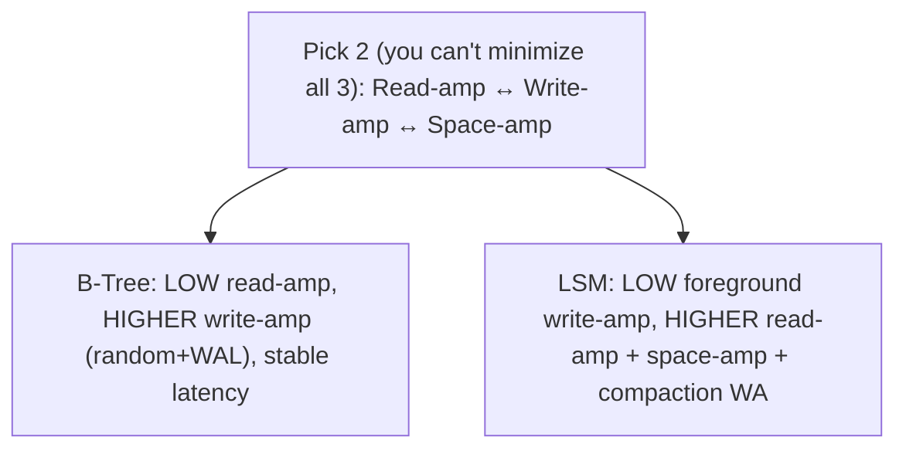
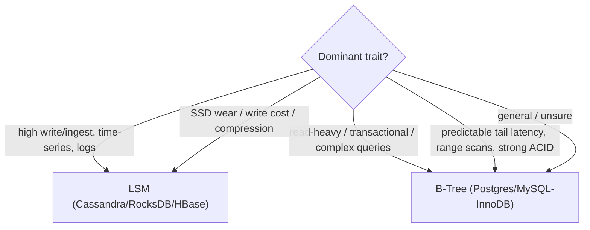

# Lesson 4.2.4 — B-Tree vs LSM: Read, Write, and Space Amplification Tradeoffs

> Part 4: Storage Systems · Module 4.2: Storage Engines · Difficulty: 🔴
>
> **Prerequisites:** [4.1.2 write amplification], [4.2.1 log-structured vs page-oriented], [4.2.2 B-Trees], [4.2.3 LSM-Trees].
> **Unlocks:** [4.2.5 Indexing], [Part 5 Databases (selection)], [Part 7 Scalability], [Part 18 case studies].

---

## 1. Learning Objectives

After this lesson you will be able to:

- Define the **three amplification factors** — **read, write, and space amplification** — and use them as a precise vocabulary for storage-engine tradeoffs.
- Compare **B-Trees** and **LSM-Trees** head-to-head across writes, reads, range scans, space, and predictability.
- Map a **workload profile** (read/write ratio, ingest rate, latency sensitivity, space/cost constraints) to the right engine.
- Reason about the nuances — caching, compaction tuning, SSD behavior, and why the choice is rarely absolute (pluggable/polyglot).

---

## 2. Motivation — One decision that sets a database's whole personality

You now know both grand traditions: the read-optimized, in-place **B-Tree** (4.2.2) and the write-optimized, append-only **LSM-Tree** (4.2.3). The practical payoff is being able to **choose between them** — or, more often, **understand what you've already chosen** when you pick a database (Part 5). That single fact ("B-tree or LSM?") predicts a database's write throughput, read latency, space usage, compaction behavior, and SSD-friendliness more reliably than almost anything else.

The clean way to reason about it is the language of **amplification**: every storage engine pays a tax in **reads**, **writes**, and **space** relative to the ideal, and the two engines distribute that tax differently. B-trees concentrate cost in **write amplification** (random in-place writes + WAL) but keep reads cheap and predictable. LSMs minimize foreground write cost but pay in **read amplification** (multiple SSTables) and **space amplification** (old versions/tombstones), plus **compaction** that converts some of that back into background write amplification. There's no free lunch (1.1.5) — only a tradeoff triangle you tune to your workload.

This lesson turns the previous two into a **decision framework** you'll use constantly in Part 5 (database selection) and in interviews. It's also the cleanest case study of "no best, only best given constraints."

---

## 3. Theory — From first principles

### 3.1 The three amplifications (the shared vocabulary)

For any storage engine, compare *actual work* to the *logical request* `[CS]`:

- **Write amplification (WA):** bytes actually **written to disk** ÷ bytes the application logically wrote. Causes: WAL + data page (B-tree), page splits (B-tree), compaction rewriting data across levels (LSM), SSD FTL/GC (4.1.2). High WA → lower write throughput, more SSD wear.
- **Read amplification (RA):** disk reads (or data scanned) ÷ data logically requested. Causes: probing multiple SSTables + bloom-filter false positives (LSM), B-tree height/page reads (B-tree, usually small). High RA → higher read latency.
- **Space amplification (SA):** bytes stored on disk ÷ bytes of logical (live) data. Causes: old versions + tombstones before compaction, temporary compaction copies (LSM), page fragmentation/fill-factor/under-full pages (B-tree). High SA → more storage cost.

The fundamental result (RUM conjecture, informally) `[CS]`: you generally **can't minimize all three at once** — optimizing one tends to worsen another. Engines (and their tuning knobs) pick a point in this **Read–Update(write)–Memory(space)** space.

### 3.2 B-Tree vs LSM, factor by factor

| Factor | **B-Tree (page-oriented, 4.2.2)** | **LSM-Tree (log-structured, 4.2.3)** |
|---|---|---|
| **Write pattern** | random in-place page writes | sequential appends (memtable→SSTable) + sequential compaction |
| **Write throughput** | good, but limited by random I/O + WAL | **high** (RAM + sequential WAL; flush/compaction sequential) |
| **Write amplification** | WAL + data page (~2×) + splits | **foreground low**, but **compaction adds background WA** (esp. leveled) |
| **Point read** | **fast, predictable** O(log n), ~1–few page I/Os (cached) | check memtable + SSTables; bloom filters skip most → usually fast but **less predictable** |
| **Read amplification** | low | **higher** (multiple SSTables; worst for not-found / many levels) |
| **Range scan** | **excellent** (sorted linked leaves) | OK but may merge across SSTables + skip tombstones (costlier) |
| **Space** | fragmentation/fill-factor; one current value per key | old versions + tombstones until compaction; temp 2× (size-tiered) → **higher/variable SA** (but sorted SSTables compress well) |
| **Latency predictability** | **stable** | **jittery** (compaction competes with foreground → p99 spikes) |
| **SSD-friendliness** | more random writes / device WA | **friendlier** (sequential writes, less wear) |
| **Transactions/maturity** | **mature** ACID, locking/MVCC, recovery (Part 5) | improving; historically simpler/weaker multi-key txns |
| **Best for** | **read-heavy / transactional / mixed OLTP** | **write-heavy / high-ingest** (time-series, metrics, events, logs) |

### 3.3 The crux: where does the write cost go?

The deepest contrast `[CS]`: **B-trees do random writes; LSMs do sequential writes.** On the *foreground* write, LSM wins big (sequential ≫ random, 4.1.1; less SSD device WA, 4.1.2). But LSM doesn't escape work — it **defers and batches** it into **compaction**, which **rewrites data** (background WA, especially leveled compaction moving data down levels). So:
- LSM trades **foreground random-write cost** for **background sequential-rewrite cost** + **read/space amplification**.
- B-tree pays **upfront, in place**, with **predictable** reads and no compaction jitter, but a **lower write ceiling** and more device-level WA.

This is why **LSM = high, sometimes jittery write throughput**; **B-tree = steady, predictable, read-friendly**.

### 3.4 Caching changes the picture

Both engines lean on RAM (4.1.2) `[CS]`:
- B-tree: the **buffer pool** keeps hot pages (and the shallow upper tree) in RAM → most reads are in-memory; if the working set fits in RAM, random-write cost is the main concern.
- LSM: **memtable + block cache + bloom filters + OS page cache** keep recent data and hot blocks in RAM and skip cold SSTables → reads can be fast despite many files.

So actual performance depends heavily on whether the **working set fits in memory** and how well caches/bloom filters are tuned — not just the abstract structure. A read-heavy workload that fits in RAM can be fine on either; the engine choice bites hardest under **memory pressure** and **high write rates**.

### 3.5 Tuning moves the point (it's not fixed)

The engine isn't a single point — **tuning relocates it** `[CS]`:
- **LSM compaction strategy** (4.2.3): **leveled** → lower read/space amplification, higher write amplification (good for read-heavy/space-sensitive); **size-tiered** → lower write amplification, higher read/space amplification (good for write-heavy). Plus bloom-filter bits and block-cache size shift read amplification.
- **B-tree:** fill factor (fewer splits vs more space), buffer-pool size (read amplification ↔ memory), index count (write amplification ↔ read speed — 4.2.5).

So "B-tree vs LSM" is really "two regions of the RUM space, each tunable within a range." You pick the engine for the **region**, then tune within it.

### 3.6 The decision framework

Pick based on the **dominant workload characteristic** `[BP]`:

1. **Write/ingest rate very high?** (time-series, metrics, logs, events, IoT, write-heavy KV) → **LSM**.
2. **Read-heavy or mixed OLTP with complex queries/transactions, latency-sensitive?** → **B-Tree** (relational default).
3. **Range scans / ordered iteration central?** → B-tree edge (clean sorted leaves), though LSM handles it with more cost.
4. **Strong multi-key ACID transactions needed?** → B-tree relational engines are more mature (Part 5).
5. **SSD wear / write cost / storage cost dominant?** → LSM's sequential writes + compression help.
6. **Predictable tail latency critical (no compaction jitter)?** → B-tree.
7. **General-purpose / unsure?** → B-tree relational engine is the safe default; reach for LSM when a **write-throughput reason** appears.

And remember **pluggability/polyglot** (4.2.1, Part 5): many systems let you choose per-table (InnoDB vs MyRocks), or you use **different databases for different workloads** (a B-tree relational store for transactions + an LSM store for the event firehose).

---

## 4. Visual Intuition

### The RUM tradeoff space

### Workload → engine

---

## 5. Real-World Analogy

Think of two ways to run a **records office**, and the "tax" each pays.

- The **B-Tree office** keeps a **sorted ledger and edits entries in place**. Looking anything up is quick and the answer is **always in one known spot** (low read tax, predictable). But every edit means **finding and rewriting a specific page** and **noting it in a safety logbook first** — so heavy editing days are slow (high write tax), and the ledger has some blank space reserved on each page (a little wasted space).
- The **LSM office** **jots everything on fresh notes and files them in sorted booklets, never editing**. Filing is effortless even on the busiest days (low write tax) — but to find the *current* truth you may check several booklets (read tax), the office accumulates **superseded notes and "removed" markers** until cleanup (space tax), and the periodic **consolidation** of booklets is real labor that **competes with serving customers** (compaction jitter) and **recopies a lot of paper** (the write tax sneaks back in during cleanup).

Neither office is "better." If you mostly **look things up** and want **steady, predictable service**, the editable ledger (B-tree) wins. If you're **drowning in new records** and need to **file fast**, the note-and-consolidate office (LSM) wins. And a big organization runs **both** — the ledger for the official accounts, the note office for the firehose of incoming events.

---

## 6. Industry Example

- **B-tree relational defaults** `[CS]`: Postgres, MySQL/InnoDB, SQL Server (representative) — read/transaction-heavy OLTP with predictable latency (4.2.2, Part 5).
- **LSM write-optimized stores** `[CS]`: Cassandra, ScyllaDB, HBase/Bigtable, RocksDB-based systems — high-ingest, time-series, event/log data (4.2.3, Part 18).
- **Same DB, choose the engine** `[CONV]`: MySQL with **InnoDB (B-tree)** vs **MyRocks (LSM)** — teams switch write-heavy tables to MyRocks for higher write throughput, better compression, and lower SSD wear, accepting read/compaction tradeoffs (4.2.1 pluggability).
- **Amplification as a tuning language** `[CONV]`: LSM operators explicitly tune **leveled vs size-tiered** compaction to trade read/write/space amplification per table — the framework applied in production (4.2.3).
- **Polyglot in big architectures** `[CONV]`: large systems pair a relational (B-tree) system of record with an LSM store for metrics/events (Part 5 polyglot persistence, Part 18).

---

## 7. Implementation Details — choosing and validating

- **Profile the workload first:** read/write ratio, sustained ingest rate, query types (point vs range), latency targets (incl. p99), data size vs RAM, space/cost constraints. The profile picks the region (B-tree vs LSM).
- **Default to a B-tree relational engine** for general OLTP / read-heavy / transactional; **switch to LSM** when ingest/write throughput or write-cost/SSD-wear is the binding constraint.
- **Check if the working set fits in RAM** — if so, both can be fast and the decision narrows to write rate + transactions + predictability.
- **Tune within the engine** (4.2.3/4.2.2): LSM compaction strategy + bloom filters + cache; B-tree buffer pool + fill factor + index count.
- **Use pluggable engines / polyglot** to place each table/workload on the right engine rather than forcing one (Part 5).
- **Measure the amplifications** in your system (write/read/space amplification, compaction backlog, buffer-pool hit rate, p99) — don't reason only from theory (Part 16, Part 17).
- **Account for operational cost:** LSM needs compaction headroom/monitoring; B-tree needs buffer-pool sizing + index maintenance.

## 8. Advantages (comparative)

- **B-Tree:** low/predictable read latency, excellent range scans, mature transactions/recovery, no compaction jitter, simpler tail-latency story.
- **LSM:** high write/ingest throughput, sequential SSD-friendly writes (less wear), good compression/space *after* compaction, tunable amplification, great for time-series/events.

## 9. Disadvantages (comparative)

- **B-Tree:** lower write ceiling under heavy ingest, random-write + WAL write amplification, page-split/fragmentation maintenance, more SSD device WA.
- **LSM:** read amplification + space amplification, **compaction overhead and latency jitter** (and risk of falling behind), tombstone/range-scan pitfalls, historically weaker multi-key transactions.

---

## 10. When the choice flips / isn't clear-cut

- **Read-heavy but write-spiky:** if reads dominate but occasional ingest bursts hurt a B-tree, consider partitioning the write-heavy slice to an LSM store rather than switching everything.
- **Working set fully in RAM:** the structural difference shrinks; pick on **write rate, transactions, and predictability**, not RA/WA alone.
- **Cost-driven:** if storage cost/SSD wear dominates, LSM's compression + sequential writes may win even for moderate write rates.
- **Don't over-index on "modern":** LSM isn't universally better; many workloads are best on a boring, predictable B-tree (1.1.5).
- **Hybrid/novel engines** (`[EMERGING]`): Bw-trees, fractal/B^ε-trees, and tiered designs blur the line — evaluate empirically, not by label.

---

## 11. Common Mistakes

1. **Choosing by buzzword** ("NoSQL/LSM is faster") instead of by workload profile — landing read-heavy/transactional data on an LSM and suffering read/compaction jitter.
2. **Ignoring compaction operational cost** when picking LSM — no I/O/disk headroom → backlog and latency incidents (4.2.3).
3. **Forcing high ingest onto a B-tree** and hitting the random-write/WAL ceiling (should be LSM).
4. **Reasoning from theory only** — not measuring actual read/write/space amplification and p99 in *your* system.
5. **Assuming "fast writes" = "fast everything"** for LSM — forgetting read/space amplification and tombstones.
6. **One engine for everything** — ignoring pluggable/polyglot options that fit each workload (Part 5).
7. **Neglecting predictability** — picking the higher-throughput engine when **tail-latency stability** was the real requirement (B-tree).

---

## 12. Interview Questions

**🟢 Easy**
- Define read, write, and space amplification.
- In one sentence each, when do you pick a B-tree vs an LSM-tree?

**🟡 Medium**
- Why do LSMs have higher write throughput but B-trees have more predictable read latency?
- Explain the RUM tradeoff (read/write/space) and how compaction strategy moves an LSM within it.

**🔴 Hard**
- Given (a) a transactional order system and (b) a metrics/time-series firehose, choose engines and justify across all three amplifications, latency predictability, transactions, and SSD wear.
- Explain why LSM's "low write amplification" is only true for the foreground write, and how compaction reintroduces write amplification (leveled vs size-tiered).

**⚫ Staff+**
- Design storage for a platform with a transactional core + a high-volume event stream + analytical range scans. Argue for one engine vs polyglot, define the data boundaries, and defend the amplification/latency tradeoffs (Part 5/9/18).
- A team moved a read-heavy, latency-SLA service from a B-tree DB to an LSM store and p99 got worse and jittery. Diagnose (read/space amplification, compaction jitter) and decide whether to tune, revert, or split the workload.

---

## 13. Production Pitfalls

- **Wrong-engine latency surprise:** read-heavy SLA service on LSM → p99 spikes from read amplification + compaction jitter.
- **Ingest ceiling on B-tree:** sustained high writes saturate random I/O + WAL → write stalls (should be LSM).
- **Compaction incidents (LSM):** backlog under load → climbing read amplification, disk-full, latency spikes (4.2.3).
- **Space-cost blowup:** unaccounted LSM space amplification (old versions/tombstones/temp compaction) filling disks; or B-tree bloat/fragmentation.
- **Theory-only sizing:** capacity/latency plans that ignore measured amplification and cache hit rates in the real system (Part 17).
- **Monolithic engine choice:** forcing all workloads onto one engine instead of splitting (polyglot) the misfit slice.

---

## 14. Optimization Techniques

- **Choose the engine for the dominant workload trait**, then **tune within it** (compaction/bloom/cache for LSM; buffer pool/fill factor/indexes for B-tree).
- **Split workloads (polyglot/pluggable):** LSM for the write firehose, B-tree relational for transactions/reads — each in its sweet spot (Part 5).
- **Fit the working set in RAM** where possible (buffer pool / block cache) to neutralize structural read costs (4.1.2, Part 6).
- **For LSM:** leveled compaction for read/space-sensitive, size-tiered for write-heavy; tune bloom filters; provision compaction headroom (4.2.3).
- **For B-tree:** size buffer pool, right-size indexes (4.2.5), manage fill factor/fragmentation; key design to avoid write hotspots (4.2.2).
- **Measure amplifications + p99 continuously** and re-tune as the workload evolves (Part 16/17).

---

## 15. Summary

The B-Tree/LSM choice is best reasoned through **three amplifications**: **write** (disk bytes written ÷ logical), **read** (disk reads ÷ requested), and **space** (bytes stored ÷ live data) — and the informal **RUM** result that you generally **can't minimize all three at once**; engines pick (and let you tune to) a point. **B-Trees** (page-oriented, in-place — 4.2.2) put the cost in **write amplification** (random writes + WAL, plus splits) and **device-level SSD wear**, in exchange for **low, predictable read latency**, **excellent range scans**, **mature transactions/recovery**, and **no compaction jitter** — the default for **read-heavy / transactional OLTP**. **LSM-Trees** (log-structured, append-only — 4.2.3) minimize **foreground write cost** with sequential, SSD-friendly writes and **high ingest throughput**, but pay in **read amplification** (multiple SSTables, mitigated by bloom filters/caches), **space amplification** (versions/tombstones), and **compaction** that reintroduces **background write amplification** and **latency jitter** — the choice for **write-heavy / high-ingest** workloads (time-series, metrics, events, logs). Caching (buffer pool / block cache / bloom filters) and whether the **working set fits in RAM** strongly shape real performance, and **tuning** (LSM leveled vs size-tiered compaction; B-tree buffer pool/fill factor/index count) relocates each engine within its region. So the decision framework is: **very high write/ingest → LSM; read-heavy/transactional/latency-predictable/range-scan/strong-ACID → B-tree; unsure → B-tree relational default, switch when a write-throughput reason appears** — and remember you can go **polyglot/pluggable**, placing each workload on the engine that fits. This is the purest embodiment of "no best, only best given constraints" (1.1.5) and the backbone of database selection in Part 5.

---

## 16. Revision Notes (flashcard-ready)

- **Q:** The three amplifications? **A:** Write (disk written ÷ logical), Read (disk read ÷ requested), Space (stored ÷ live data).
- **Q:** RUM result? **A:** You generally can't minimize read, write (update), and space (memory) all at once — pick a point.
- **Q:** B-tree cost vs benefit? **A:** Higher write amplification (random + WAL) but low/predictable reads, great range scans, mature transactions, no compaction jitter.
- **Q:** LSM cost vs benefit? **A:** Low foreground write cost + high ingest, but read + space amplification + compaction (background WA + latency jitter).
- **Q:** Deepest contrast? **A:** B-tree = random in-place writes; LSM = sequential appends (defers work to compaction).
- **Q:** Why LSM "low write-amp" is partial? **A:** Foreground write is sequential/cheap, but compaction rewrites data (esp. leveled) → background write amplification.
- **Q:** Workload → engine? **A:** High ingest/time-series → LSM; read-heavy/transactional/predictable → B-tree; unsure → B-tree default.
- **Q:** What blurs the choice? **A:** Working set in RAM (caching), and tuning (compaction strategy / buffer pool) — plus polyglot/pluggable engines.
- **Q:** Predictable tail latency → ? **A:** B-tree (LSM has compaction jitter).

---

## 17. Further Reading + Knowledge-Graph Links

**Within this platform**
- **Previous:** [4.2.3 LSM-Trees]. **Builds on:** [4.1.2 write amplification], [4.2.1 philosophies], [4.2.2 B-Trees]. **Next:** [4.2.5 Indexing].
- **Drives:** [Part 5 Databases] (selection, polyglot persistence), [Part 7 Scalability] (write scaling), [Part 18] (Cassandra/Bigtable/Spanner lineage).
- **Tradeoff lens:** [1.1.5 Tradeoffs], [reference/tradeoff-worksheet], [reference/database-selection (Part 5)].

**Foundational texts (synthesized)**
- Kleppmann, *Designing Data-Intensive Applications* — B-tree vs LSM comparison, amplification.
- The **RUM conjecture** (Athanassoulis et al.) on read/update/memory tradeoffs (synthesized).
- RocksDB tuning guides and engine documentation — representative for amplification tradeoffs.

**Concept tags:** `[CS]` read/write/space amplification, RUM tradeoff, sequential vs random writes · `[CONV]` InnoDB vs MyRocks, leveled vs size-tiered tuning, polyglot persistence · `[BP]` choose by workload profile, measure amplification + p99, split workloads, default to B-tree unless write-bound · `[EMERGING]` Bw-tree/B^ε-tree hybrids.
