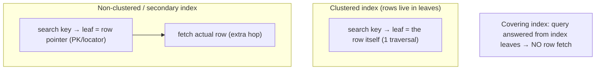
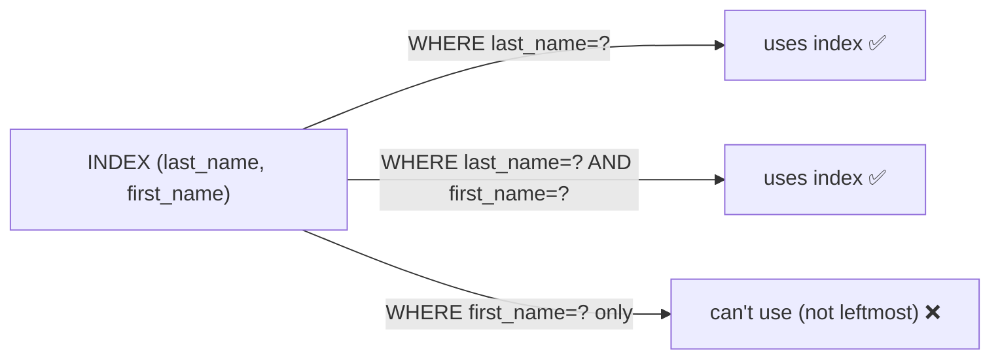

# Lesson 4.2.5 — Indexing: Primary, Secondary, Covering, Composite, Partial; Clustered vs Non-Clustered

> Part 4: Storage Systems · Module 4.2: Storage Engines · Difficulty: 🔴
>
> **Prerequisites:** [4.2.1 storage engines], [4.2.2 B-Trees], [4.2.3 LSM-Trees], [4.1.1 sequential vs random I/O].
> **Unlocks:** [Part 5 Databases (query optimization, schema design)], [Part 17 Performance (N+1, query tuning)].

---

## 1. Learning Objectives

After this lesson you will be able to:

- Explain what an **index** is (a derived, redundant data structure that trades **write cost + space** for **read speed**) and why it's the highest-leverage query-performance tool.
- Distinguish **primary vs secondary**, **clustered vs non-clustered**, **composite**, **covering**, and **partial/filtered** indexes — and when each applies.
- Reason about **index design from the query** (predicates, sort order, selectivity, leftmost-prefix) and the **cost of every index** on writes and space.
- Connect indexing to storage engines (B-tree/LSM), the database query planner, and common performance pitfalls (Part 5/17).

---

## 2. Motivation — The difference between a 1ms query and a 10-second one

A table without the right index forces the database to **scan every row** (a full table scan) to answer a query — O(n). With the right index, the same query is O(log n) or better — often the difference between **milliseconds and minutes** as data grows. Indexing is, by a wide margin, the **highest-leverage tool** for read performance in databases, and "add/fix an index" is the single most common real-world database optimization (Part 17).

But an index is not free magic. It's a **derived, redundant data structure** (built on the engines of 4.2.2/4.2.3) that the database must **keep in sync on every write** — so each index you add **slows writes and consumes space** (write/space amplification, 4.2.4). Indexing is therefore a classic tradeoff (1.1.5): **read speed vs write cost vs storage**. Worse, the *wrong* indexes are doubly harmful — they cost writes/space *and* don't help reads (or the planner ignores them).

Mastering indexing means knowing the **types** (clustered, secondary, composite, covering, partial), designing them **from the query** (which predicates, which sort order, how selective), and respecting their cost. This is foundational for database schema design, query optimization, and performance work throughout Part 5 and Part 17 — and a perennial interview topic.

---

## 3. Theory — From first principles

### 3.1 What an index is

An **index** is an **additional data structure derived from the primary data** that lets the database **find rows quickly by some key**, without scanning everything `[CS]`. It maps **index key → location of the row(s)** (or, in a clustered index, *is* the row storage). Almost always it's a **B-Tree** (4.2.2) — giving sorted order, point lookups, and range scans — or, in LSM systems, the SSTable structure itself (4.2.3); hash indexes exist for exact-match-only cases.

The fundamental tradeoff `[CS]`: an index **speeds up reads that use it** but **must be updated on every insert/update/delete** that touches its key (slowing writes) and **takes extra space**. You add indexes deliberately, for the queries that matter — not "just in case."

### 3.2 Primary vs secondary; clustered vs non-clustered

These two distinctions are often conflated but are separate `[CS]`:

- **Primary key index:** the index on the table's primary key (unique row identifier). Usually created automatically.
- **Secondary index:** any *additional* index on non-primary columns (e.g., index on `email`, `created_at`). You add these for query patterns.

- **Clustered index:** the index **whose order determines the physical storage order of the rows** — the row data **lives in the index's leaf pages**. There can be **only one** clustered index per table (the data can only be physically sorted one way). A lookup via the clustered index reaches the **actual row directly** (no extra hop). `[CS]`
- **Non-clustered (secondary) index:** a **separate** structure whose leaves contain the index key + a **pointer to the row** (the primary key, or a physical row locator). A lookup finds the pointer, then must **fetch the actual row** — a second lookup (a "**bookmark lookup**" / heap fetch). `[CS]`

**Engine specifics (representative):**
- **MySQL/InnoDB:** the table **is** a clustered index on the primary key (rows stored in PK order); **secondary indexes store the PK** as the row pointer → a secondary-index lookup does **index → PK → clustered-index lookup** (two B-tree traversals).
- **Postgres:** the table is a **heap** (unordered); *all* indexes (including PK) are **non-clustered**, pointing to physical tuple locations (you can physically reorder once via `CLUSTER`, but it's not maintained).

**Consequences of clustering** `[CS]`:
- **Clustered key choice matters hugely:** rows physically sorted by it → **range scans on the clustered key are sequential/fast** (4.1.1), and related rows are co-located. But **random/UUID clustered keys** scatter inserts (poor locality, page splits — 4.2.2), while **monotonic keys** (auto-increment) give sequential inserts but a **right-most-leaf write hotspot** (4.2.2). Pick the clustered key for both access pattern and write distribution (also relevant to sharding, Part 7).
- **Secondary-index lookups have an extra hop** (fetch the row) — which is exactly what **covering indexes** eliminate (§3.4).

### 3.3 Composite (multi-column) indexes and leftmost-prefix

A **composite index** is an index on **multiple columns in a specific order**, e.g., `(last_name, first_name)` `[CS]`. The order is critical because the index is sorted by the columns **left to right**:

- It can serve queries filtering on a **leftmost prefix** of the columns: `(last_name)`, or `(last_name, first_name)` — but **not** `(first_name)` alone (the index isn't sorted by `first_name` first). This is the **leftmost-prefix rule**.
- It supports **equality on leading columns + range on a later column** efficiently (e.g., `last_name = 'Smith' AND age > 30`), and can satisfy **ORDER BY** matching the index order (avoiding a sort).
- **Column order design:** put the most **selective** / most-frequently-filtered (especially equality) columns first; put range/sort columns appropriately. A common rule: **equality columns before range columns**.

One well-designed composite index often replaces several single-column ones (fewer indexes = less write/space cost).

### 3.4 Covering indexes (index-only scans)

A **covering index** contains **all the columns a query needs** (in the key or as included columns), so the query can be answered **entirely from the index** — **no fetch of the actual row** `[CS]`. This eliminates the secondary-index extra hop (§3.2), turning a two-step lookup into one. Example: for `SELECT email FROM users WHERE last_name = ?`, an index on `(last_name, email)` "covers" it. Covering indexes are a powerful read optimization (huge for hot queries), at the cost of a **wider index** (more space, more write cost). Many engines support **included (non-key) columns** specifically for covering without bloating the key.

### 3.5 Partial / filtered indexes

A **partial (filtered) index** indexes only the **subset of rows matching a condition**, e.g., `WHERE status = 'active'` or `WHERE deleted_at IS NULL` `[CS]`. Benefits: **smaller index** (only relevant rows), **cheaper to maintain**, and great when queries always target that subset (e.g., only active records) or when a column is mostly NULL/rarely-true. It's a targeted way to get index benefit without indexing the whole table.

### 3.6 Other index kinds (brief, for awareness)

- **Unique index:** enforces uniqueness *and* speeds lookups (PK is a unique index).
- **Hash index:** O(1) exact-match only (no ranges/ordering) — niche.
- **Full-text / inverted index:** for text search (term → documents) — the basis of search engines (Part 18); not a B-tree.
- **Geospatial indexes** (R-tree, geohash) for location queries (Part 19 proximity).
- **Bitmap indexes** for low-cardinality columns in analytics/warehouses.
*(These are specialized; the B-tree family above covers most OLTP indexing.)*

### 3.7 The planner uses indexes — but only good ones

The **query optimizer/planner** (Part 5) decides whether to *use* an index based on **estimated cost and selectivity** `[CS]`:
- **Selectivity matters:** an index on a low-cardinality column (e.g., boolean `gender`) is often **ignored** because it doesn't narrow results enough — a full scan can be cheaper than index + many row fetches. Indexes pay off most for **high-selectivity** predicates.
- **Sargability:** a predicate must be **index-usable** ("SARGable"). Wrapping the column in a **function** (`WHERE LOWER(email) = ...`), leading **wildcards** (`LIKE '%x'`), or **implicit type casts** prevent index use — a top real-world mistake (use expression/functional indexes or rewrite).
- The planner relies on **statistics** (row counts, value distributions); **stale stats** lead to bad plans (Part 5).

So an index helps only if (a) it matches the query's predicates/sort, (b) the predicate is sargable, and (c) it's selective enough for the planner to choose it.

### 3.8 The cost side (never forget)

Every index `[CS]`:
- **Slows writes:** each insert/update/delete must update **every affected index** (B-tree splits / LSM writes) — **write amplification** (4.2.4). A table with 8 indexes pays ~8× index-maintenance on writes.
- **Consumes space:** indexes can collectively exceed the table size.
- **Can fragment/bloat** (B-tree, 4.2.2) and need maintenance.

Hence: **index for the queries you actually run, drop unused/redundant indexes, and prefer fewer well-chosen (composite/covering/partial) indexes** over many narrow ones. The right number is "as few as possible to make the important queries fast."

---

## 4. Visual Intuition

### Clustered vs non-clustered lookup

### Composite index leftmost-prefix

---

## 5. Real-World Analogy

Indexes are the **index at the back of a textbook** (the name is literal).

- Without it, finding every mention of "consistency" means **reading all 800 pages** (full table scan). The back-of-book index lets you **jump straight to the right pages** (B-tree lookup). But the index had to be **built and printed** (space) and must be **redone every time the book is edited** (write cost) — which is why a book has *one* good index, not fifty.
- A **clustered index** is like a book where the **content itself is physically arranged** in the order you most search (e.g., a phone book sorted by last name — the "index" *is* the page order). You can only physically sort the pages **one way**.
- A **non-clustered index** is the separate back-of-book index that says "consistency → p412"; you then **flip to page 412** to actually read it (the extra hop). A **covering index** is when the index entry *itself* contains the answer you wanted ("consistency, defined: …") so you **never flip to the page**.
- A **composite index** `(topic, subtopic)` is an index sorted by topic then subtopic: great for "find topic X" or "topic X, subtopic Y," but useless for "find subtopic Y across all topics" (wrong sort order — leftmost-prefix rule).
- A **partial index** is an index that **only lists the chapters you actually reference** (e.g., only "active" topics), keeping it small and quick to maintain.

And the librarian (the **query planner**) won't even use an index if it barely narrows things down — if "consistency" appears on *every* page (low selectivity), flipping through the index is pointless; you might as well read straight through.

---

## 6. Industry Example

- **InnoDB clustered PK + PK-pointer secondary indexes** `[CONV]`: MySQL/InnoDB stores the table as a clustered index on the PK; secondary indexes carry the PK, so a secondary lookup does index→PK→clustered lookup (representative) — why PK choice and covering indexes matter so much (4.2.2).
- **Postgres heap + non-clustered indexes + index-only scans** `[CONV]`: all Postgres indexes point to heap tuples; **index-only scans** (covering via included columns) avoid heap fetches; **partial indexes** and **expression indexes** are first-class (representative).
- **Covering indexes for hot queries** `[BP]`: a near-universal optimization — design an index that includes the selected columns so the hottest query never touches the base table.
- **Sargability bugs in the wild** `[CONV]`: `WHERE LOWER(email)=...` or `col + 0 = ?` disabling index use is one of the most common real-world query-performance bugs (fixed via functional indexes or rewriting) (Part 17).
- **LSM secondary indexing** `[CONV]`: wide-column/LSM stores (Cassandra) handle secondary indexes differently (often discouraged / materialized views / denormalized query tables) — a reminder that indexing strategy depends on the engine and data model (Part 5).

---

## 7. Implementation Details — designing indexes

- **Design from the query, not the table:** list the important queries; for each, index to match its **WHERE predicates**, **JOIN keys**, and **ORDER BY/GROUP BY** order. Index the queries that matter, not every column.
- **Choose the clustered key deliberately** (where applicable): match the dominant **range/access pattern** and consider **write distribution** (avoid random-UUID scatter and beware monotonic-key insert hotspots — 4.2.2, Part 7).
- **Prefer composite indexes** ordered **equality-first, then range/sort**, exploiting the **leftmost-prefix rule**; one good composite index can replace several single-column ones (less write/space cost).
- **Use covering indexes / included columns** for hot read paths to get **index-only scans** (eliminate row fetches) — accept the wider index.
- **Use partial/filtered indexes** when queries always target a subset (e.g., active rows, non-null) — smaller and cheaper.
- **Ensure sargability:** avoid functions/casts/leading wildcards on indexed columns in predicates; use **expression/functional indexes** when you must transform.
- **Keep stats fresh** (ANALYZE/auto-stats) so the planner chooses indexes well (Part 5).
- **Audit and drop unused/redundant indexes** (each costs writes + space — 4.2.4); monitor index usage.
- **Mind the engine:** B-tree relational → rich index types; LSM/wide-column → often denormalize / query-specific tables / materialized views instead of many secondary indexes (Part 5).

## 8. Advantages (of good indexing)

- **Massive read speedups** — O(log n) lookups, fast range scans, avoided sorts (ORDER BY served by index).
- **Eliminates full scans** for selective queries — the primary scalability lever for reads.
- **Covering indexes** answer queries without touching base data (huge for hot paths).
- **Enforce constraints** (unique indexes) while accelerating lookups.
- **Composite/partial indexes** give targeted speed with controlled cost.

## 9. Disadvantages / costs

- **Write amplification** — every write maintains every affected index (slower inserts/updates/deletes — 4.2.4).
- **Space** — indexes can rival or exceed table size.
- **Maintenance** — B-tree fragmentation/bloat; rebuilds; stale stats → bad plans.
- **Wrong/unused indexes** — pure cost, no benefit; can even mislead the planner.
- **Clustered-key mistakes** — poor locality, insert hotspots, or expensive secondary lookups.

---

## 10. When NOT to add an index

- **Low-selectivity columns** (e.g., boolean, few distinct values) — the planner often ignores them; a scan may be cheaper.
- **Small tables** — a full scan is fine; the index overhead isn't worth it.
- **Write-heavy tables with rarely-used read patterns** — don't pay write/space cost for a query you seldom run.
- **Redundant indexes** — a prefix already covered by an existing composite index (e.g., don't add `(a)` if `(a,b)` exists).
- **When denormalization/a query-specific table fits better** (LSM/wide-column, or read-heavy precomputation — Part 5/6).

---

## 11. Common Mistakes

1. **No index on a frequent query's predicate/join key** → full table scans, latency grows with data (Part 17).
2. **Too many indexes** → write throughput and space suffer; maintenance overhead (4.2.4).
3. **Wrong composite column order** → leftmost-prefix not matched, index unused.
4. **Non-sargable predicates** → functions/casts/leading wildcards disabling otherwise-perfect indexes.
5. **Indexing low-selectivity columns** → planner ignores them; wasted cost.
6. **Bad clustered-key choice** → random scatter or monotonic insert hotspot, or costly secondary lookups (4.2.2).
7. **Stale statistics** → planner picks bad plans / ignores good indexes (Part 5).
8. **Ignoring covering opportunities** → hot queries doing needless row fetches.
9. **Leaving unused indexes** → silent write/space tax.

---

## 12. Interview Questions

**🟢 Easy**
- What is a database index and what tradeoff does it represent?
- What's the difference between a clustered and a non-clustered index?

**🟡 Medium**
- Explain the leftmost-prefix rule for composite indexes with an example. How do you order the columns?
- What is a covering index and why is it faster?

**🔴 Hard**
- Given a set of queries on a table, design the minimal set of indexes (composite/covering/partial) and justify, including the write/space cost of each.
- Why might the query planner ignore an index you created? (selectivity, sargability, stale stats) — and how do you fix each?

**⚫ Staff+**
- Design indexing + clustered-key choice for a high-write table that also serves selective reads and range scans, balancing read speed against write amplification and insert hotspots (tie to 4.2.2/4.2.4/Part 7).
- Compare indexing strategy in a B-tree relational DB vs an LSM/wide-column store (secondary indexes vs denormalized query tables / materialized views). When do you denormalize instead of index (Part 5/6)?

---

## 13. Production Pitfalls

- **Latency creep from missing index:** a query fine at 10k rows does full scans at 10M rows → timeouts (Part 17).
- **Write throughput collapse from over-indexing:** an ingest-heavy table with many secondary indexes stalling on index maintenance (4.2.4).
- **Silent index-not-used:** a non-sargable predicate (function/cast/leading wildcard) making the database ignore the index — slow queries despite "having an index."
- **Insert hotspot from clustered/monotonic key:** right-most-leaf contention at high insert rates (4.2.2).
- **Bad plans after a data shift:** stale statistics causing the planner to abandon good indexes (Part 5).
- **Disk blowup from indexes:** index space exceeding expectations; unused indexes never dropped.
- **Online index build impact:** creating an index on a huge table locking/loading the system if not done online/concurrently (operational care needed).

---

## 14. Optimization Techniques

- **Index from real query patterns**; use **EXPLAIN/EXPLAIN ANALYZE** (Part 5) to verify the planner uses your index and to find scans.
- **Consolidate with composite indexes** (equality-first ordering) and **covering/included columns** to serve hot queries index-only.
- **Partial/filtered indexes** for subset queries to cut size and write cost.
- **Make predicates sargable** (no functions/casts on indexed columns; use functional indexes when needed).
- **Choose clustered keys** for locality + write distribution; partition to avoid hotspots (Part 7).
- **Keep statistics fresh**, **drop unused/redundant indexes**, and **rebuild** to fight bloat.
- **Denormalize / materialized views / query-tables** where indexing the normalized schema can't meet read SLAs (Part 5/6), and prefer this in LSM/wide-column stores.

---

## 15. Summary

An **index** is a **derived, redundant data structure** (almost always a **B-Tree** — 4.2.2, or the SSTable structure in LSM — 4.2.3) that maps a key to row locations so the database can avoid **full table scans**, turning O(n) reads into O(log n) — the single highest-leverage read-performance tool. Its cost is real: every index must be **maintained on each write** (write amplification — 4.2.4) and **consumes space**, so you index **deliberately, for the queries that matter**. The key distinctions: a **clustered index** physically stores rows in key order (only one per table; great for range scans, but clustered-key choice drives locality and insert-hotspot behavior), while **non-clustered/secondary** indexes hold a **pointer** to the row and pay an **extra fetch hop** — which **covering indexes** (containing all needed columns → **index-only scans**) eliminate. **Composite (multi-column)** indexes are sorted left-to-right, so they serve **leftmost-prefix** predicates and `ORDER BY` matching their order — design them **equality columns first, then range/sort**, and one good composite index often replaces several. **Partial/filtered** indexes index only a row subset (smaller, cheaper) for queries that always target it. Crucially, the **query planner** only uses an index when it **matches the predicate/sort**, the predicate is **sargable** (no functions/casts/leading wildcards), and it's **selective enough** — and it relies on **fresh statistics**. So good indexing is: **design from the query**, prefer **fewer well-chosen composite/covering/partial indexes**, choose the **clustered key** for access pattern and write distribution, keep predicates sargable and stats fresh, and **drop unused indexes** — balancing **read speed against write cost and space** (1.1.5), the foundation for query optimization and schema design throughout Part 5 and performance work in Part 17.

---

## 16. Revision Notes (flashcard-ready)

- **Q:** What is an index, and the tradeoff? **A:** Derived structure (usually B-tree) for fast key lookups; trades write cost + space for read speed.
- **Q:** Clustered vs non-clustered? **A:** Clustered = rows stored in index order (one per table, direct read); non-clustered = separate index with a row pointer (extra fetch hop).
- **Q:** Primary vs secondary? **A:** Primary = index on the PK; secondary = any additional index for query patterns.
- **Q:** Covering index? **A:** Contains all columns a query needs → answered from the index alone (index-only scan, no row fetch).
- **Q:** Composite index rule? **A:** Sorted left-to-right; serves leftmost-prefix predicates; order equality columns first, then range/sort.
- **Q:** Partial/filtered index? **A:** Indexes only rows matching a condition (e.g., active) → smaller, cheaper.
- **Q:** Why might the planner ignore an index? **A:** Low selectivity, non-sargable predicate (function/cast/leading wildcard), or stale statistics.
- **Q:** Cost of each index? **A:** Write amplification (maintained on every write) + space + maintenance; drop unused/redundant.
- **Q:** Clustered-key pitfalls? **A:** Random/UUID → scatter/splits; monotonic → right-most-leaf insert hotspot.
- **Q:** When NOT to index? **A:** Low-selectivity columns, small tables, write-heavy/rarely-read, redundant prefixes.

---

## 17. Further Reading + Knowledge-Graph Links

**Within this platform**
- **Previous:** [4.2.4 B-Tree vs LSM]. **Builds on:** [4.2.2 B-Trees], [4.2.3 LSM-Trees], [4.1.1 sequential vs random I/O]. **Next:** [4.3.1 Data Encoding & Schema Evolution] (Module 4.3).
- **Drives:** [Part 5 Databases] (query optimization, EXPLAIN, schema design, normalization vs denormalization), [Part 17 Performance] (N+1, query tuning, hot partitions), [Part 6 Caching] (when indexing isn't enough → cache/denormalize).
- **Related:** [Part 7 Scalability] (clustered key vs sharding hotspots), [Part 18] (inverted/search indexes).

**Foundational texts (synthesized)**
- Silberschatz et al., *Database System Concepts* — indexing (B+Tree, clustered/secondary, composite), query processing.
- Kleppmann, *Designing Data-Intensive Applications* — secondary indexes, clustered indexes, covering indexes.
- Database documentation (Postgres, MySQL/InnoDB) on index types, partial/expression indexes, index-only scans — representative.

**Concept tags:** `[CS]` index as derived structure, clustered vs non-clustered, primary/secondary, composite/leftmost-prefix, covering, partial, selectivity/sargability · `[CONV]` InnoDB clustered PK, Postgres heap + index-only scans, functional/partial indexes · `[BP]` index from queries, equality-first composite order, covering for hot paths, drop unused indexes, keep stats fresh.
