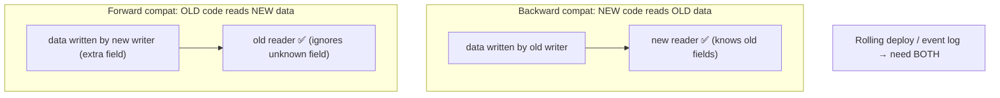
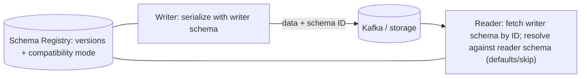

# Lesson 4.3.1 — Data Encoding Formats and Schema Evolution (Backward/Forward Compatibility)

> Part 4: Storage Systems · Module 4.3: Encoding & Evolution · Difficulty: 🟡🔴
>
> **Prerequisites:** [3.2.6 API styles & serialization], [4.1.x storage], [2.1.x coupling/versioning].
> **Unlocks:** [4.3.2 Object/blob storage], [Part 5 Schema migrations], [Part 9 Messaging (event schemas)], [Part 12 Microservices].

---

## 1. Learning Objectives

After this lesson you will be able to:

- Explain **encoding/serialization** (in-memory objects ↔ bytes) and the difference between **text** (JSON/XML) and **binary schema** formats (Protobuf/Thrift/Avro).
- Define **backward** and **forward compatibility** precisely and explain why **both** are required when producers and consumers deploy independently.
- State the concrete **evolution rules** for each format (field tags, optional/defaults, Avro reader/writer schemas + registry) that keep changes non-breaking.
- Connect schema evolution to **rolling deploys, microservices, event logs, and stored data** — where compatibility failures cause real outages (Part 5/9/12).

---

## 2. Motivation — Data outlives the code that wrote it

The moment data leaves a running program — sent over a network (3.2.6), written to disk/a database (4.1/4.2), or appended to an event log (Part 9) — it must be **encoded** into bytes, and **later decoded** by *some* code. The catch: that later code is **often a different version**, sometimes running **at the same time** as the writer. During a rolling deploy (Part 13), old and new versions run **simultaneously**; a Kafka topic (Part 9) holds events written by last month's code that this month's code must still read; a database row written years ago must still deserialize today.

This makes **schema evolution** — changing the data's shape without breaking readers or writers — one of the most important and underappreciated topics in system design. Get it right and you can deploy independently, evolve services freely, and keep historical data readable. Get it wrong and a "harmless" field change causes a **production outage**: new events that old consumers can't parse, or old data the new code chokes on. This is exactly the schema-evolution concern forward-referenced repeatedly from 3.2.6 (REST/gRPC/GraphQL + Protobuf/Avro) — here we make the rules precise.

The core requirement is **two-way compatibility** across versions deployed at overlapping times, and the choice of **encoding format** largely determines how gracefully you can achieve it. This underpins API versioning (3.2.6), database migrations (Part 5), event-driven systems (Part 9), and microservice independence (Part 12).

---

## 3. Theory — From first principles

### 3.1 Encoding (serialization) basics

Programs hold data as **in-memory objects** (pointers, structs); to store or transmit it you must **encode/serialize** it to a **self-contained byte sequence**, and later **decode/deserialize** back `[CS]`. Key properties of an encoding: **size** (bytes on the wire/disk), **speed** (encode/decode CPU), **human-readability**, **language support**, and — critically — **schema/compatibility behavior**.

Two families (from 3.2.6) `[CS]`:
- **Text, self-describing:** JSON, XML, CSV — the field names travel **with** the data; readable, ubiquitous, but **verbose** and with weak/no typing.
- **Binary with a schema:** Protocol Buffers, Thrift, Avro — a **separate schema** defines the fields; the bytes are compact (often just **numeric tags + values**, no field names). Smaller, faster, **typed**, and built for **evolution**.

(Language-native serializers — Java `Serializable`, Python `pickle` — are convenient but tie data to one language/version and are generally bad for storage/cross-service use and security. `[BP]`)

### 3.2 The compatibility problem

When the schema changes, you have **old and new code** and **old and new data** mixing `[CS]`. Two directions of compatibility must hold:

- **Backward compatibility:** **new code can read old data.** (The new reader handles data written by older writers.) Usually the easier one — new code knows about the old fields.
- **Forward compatibility:** **old code can read new data.** (The old reader handles data written by newer writers — it must **ignore** what it doesn't understand.) Trickier — old code must tolerate unknown fields.

**Why you need both** `[CS]`: during a **rolling upgrade**, both versions run at once. A new instance writes data an old instance must read (**forward**), and a new instance must read data old instances wrote (**backward**). For **stored data and event logs**, data written by *any* past version must be readable by *any* future version (backward), and old consumers must survive newer events (forward). Independent deployability (Part 12) **requires** two-way compatibility.

### 3.3 What breaks compatibility (the failure modes)

Common breaking changes `[CS]`:
- **Removing or renaming a field** a reader requires → old/new readers can't find it.
- **Changing a field's type** → decode error or silent corruption.
- **Making a new field required** → old writers don't produce it; new readers demand it (breaks backward) — *new fields must be optional or have defaults.*
- **Reusing/renumbering field identifiers** (Protobuf tag numbers) → new data interpreted as the wrong field (silent corruption).
- **Changing the meaning** of an existing field (semantic break) — no format protects you from this.

The safe pattern is **additive, optional change**: add new optional fields (with defaults), never remove/repurpose old ones in incompatible ways, and let readers **ignore unknown fields**.

### 3.4 How each format handles evolution

**JSON/XML (text, self-describing)** `[CS]`:
- Compatibility relies on **convention + a tolerant reader**: readers must **ignore unknown fields** (forward) and **tolerate missing fields** with defaults (backward).
- No enforced schema by default (JSON Schema/OpenAPI add one). Easy to *accidentally* break (a consumer that errors on unknown fields). Additive changes are usually safe **if** readers are lenient.

**Protocol Buffers / Thrift (binary, tag-based)** `[CS]`:
- Each field has a **numeric tag** in the schema; the bytes carry **tags + values**, not names.
- **Rules:** **never reuse or renumber a tag**; **add** new fields with **new tags**; new fields must be **optional / have defaults** (so old writers omitting them is fine, and old readers **skip unknown tags** → forward compatible). Don't change a field's type incompatibly. Remove a field only by **retiring its tag** (reserve it, never reuse).
- Result: following these rules gives **both** backward and forward compatibility almost for free — the design intent of these formats.

**Avro (binary, schema-resolution)** `[CS]`:
- Distinctive model: there's a **writer's schema** (used to write the data) and a **reader's schema** (what the reader expects); Avro **resolves** differences at read time by matching **field names** (and applying defaults for fields the reader has but the data lacks, and ignoring fields the data has but the reader doesn't).
- The reader needs access to the **writer's schema** — typically via a **schema registry** (store schemas centrally; data carries a small **schema ID**). This is ideal when there are **many writers/readers evolving over time** and dynamically-generated schemas (big-data, Kafka).
- **Rules:** add fields **with defaults** (for compatibility), follow the registry's **compatibility mode** (backward / forward / full / none) which it **enforces** on schema registration — rejecting incompatible changes before they ship.

### 3.5 The schema registry and compatibility modes

For binary schema formats (especially Avro on Kafka), a **schema registry** is the standard governance tool `[CONV]`:
- Stores and versions schemas; data references a **schema ID** instead of embedding the whole schema (compact).
- Enforces a **compatibility mode** on new schema versions:
  - **Backward:** new schema can read old data (consumers upgrade first).
  - **Forward:** old schema can read new data (producers upgrade first).
  - **Full:** both.
  - This makes compatibility a **checked, automated rule** — a CI/registry **fitness function** (2.3.3) that prevents breaking changes from being deployed.

### 3.6 Where this bites: deploys, services, logs, stored data

Schema evolution matters wherever encoded data crosses a version boundary `[CS]`:
- **Rolling deploys (Part 13):** old+new instances coexist → need two-way compatibility for any data they exchange or share.
- **Microservices (Part 12, 3.2.6):** services deploy independently → API/message schemas must evolve compatibly; contracts versioned; consumer-driven contract tests catch breaks.
- **Event logs / messaging (Part 9):** events are **long-lived** — a topic holds messages from many schema versions; consumers across versions must all read them (the strongest case for a registry + compatibility modes).
- **Stored data (Part 5):** rows/documents written by old code must deserialize in new code (backward), and online **schema migrations** must avoid breaking either side (expand-contract / dual-write patterns).
- **Database schema migrations:** the **expand-and-contract** pattern (add new nullable column → backfill → switch reads → later drop old) is schema evolution applied to relational schemas — never a breaking change in one step (Part 5/13).

---

## 4. Visual Intuition

### Backward vs forward compatibility

### Avro: writer + reader schema via registry

---

## 5. Real-World Analogy

Think of a **paper form** that a company keeps redesigning while old and new versions are all in circulation.

- **Backward compatibility** = the **new office staff can still read forms filled out on last year's version** (they know what the old boxes meant).
- **Forward compatibility** = **old staff handed this year's new form still cope** — there's an extra box they don't recognize, but they **just ignore it** and process the rest, rather than rejecting the whole form.

You need **both** because during the transition there's a mix: new forms reaching old desks and old forms reaching new desks. The safe way to change the form is to **only add new optional boxes** and **never reuse an old box number for something else** — if box 7 used to mean "phone" and you quietly reissue it as "fax," every old reader misreads fax numbers as phone numbers (the Protobuf tag-reuse disaster).

A **self-describing JSON form** writes the label next to every box ("Phone: …") — easy to read but bulky, and it only works if readers are trained to **skip boxes they don't recognize**. A **Protobuf/Thrift form** is terse — boxes are just **numbered** (box 1, box 2…) with a shared legend (the schema) — tiny, but you must **never renumber the legend**. An **Avro form with a registry** keeps the legends in a **central binder** (registry); each form just stamps which legend-version it used, and the office **checks any proposed new legend against the old ones before approving it** (compatibility mode) so nobody can introduce a form that breaks existing readers.

---

## 6. Industry Example

- **Avro + Schema Registry on Kafka** `[CONV]`: the canonical pattern — events carry a schema ID, the registry enforces backward/forward/full compatibility, so producers and consumers evolve independently across a long-lived log (Part 9).
- **Protobuf evolution rules in gRPC ecosystems** `[CONV]`: large polyglot backends rely on Protobuf's tag-based rules (never reuse tags, add optional fields) to evolve service contracts without coordinated big-bang deploys (3.2.6, Part 12).
- **Expand-and-contract DB migrations** `[BP]`: teams add a nullable column, backfill, migrate reads/writes, then drop the old column in a later release — never a breaking schema change in one deploy (Part 5/13).
- **JSON tolerant readers** `[BP]`: well-behaved REST/JSON clients ignore unknown fields, allowing additive API changes without breaking existing consumers (3.2.1/3.2.6).
- **CI compatibility checks** `[BP]`: schema/contract compatibility enforced in CI (registry checks, consumer-driven contract tests) as a fitness function (2.3.3) to block breaking changes pre-merge.

---

## 7. Implementation Details — evolving schemas safely

- **Make changes additive & optional:** add **new optional fields with defaults**; **never remove/rename/repurpose** required fields or change types incompatibly. Retire (reserve), don't reuse, identifiers.
- **Protobuf/Thrift:** never reuse/renumber **tags**; new fields optional with defaults; **reserve** removed tags/names; readers skip unknown tags (forward) — gives two-way compat.
- **Avro:** add fields **with defaults**; manage **writer/reader schemas via a registry**; set the right **compatibility mode** (backward/forward/full).
- **JSON/XML:** enforce **tolerant readers** (ignore unknown fields, default missing ones); document a schema (JSON Schema/OpenAPI); version the API for breaking changes (`/v2`, 3.2.6).
- **Enforce compatibility in CI** (registry checks, contract tests) — a fitness function (2.3.3) that fails the build on breaking changes.
- **Database migrations:** use **expand-and-contract** (add → backfill → switch → drop later); never break readers/writers in a single step (Part 5/13).
- **Plan deploy ordering** for one-way changes: backward-compatible → upgrade consumers first; forward-compatible → upgrade producers first; full → any order.
- **Version events/messages** and keep old consumers working until they're retired (Part 9).

## 8. Advantages (of disciplined evolution + schema formats)

- **Independent deployability** — services/instances upgrade on their own schedule (Part 12) without coordinated big-bang releases.
- **Long-lived data stays readable** — events/rows written by any version remain decodable (Part 9/5).
- **Compact, fast, typed** (binary schema formats) — smaller storage/wire + enforced types (3.2.6, 4.1).
- **Automated safety** — registry/CI compatibility checks prevent breaking changes (fitness function, 2.3.3).
- **Zero-downtime changes** — rolling deploys and expand-contract migrations avoid outages (Part 13).

## 9. Disadvantages / costs

- **Discipline + tooling overhead** — schemas, registry, compatibility modes, CI checks to maintain.
- **JSON's weak guarantees** — easy to break accidentally without enforced schema; verbose/untyped.
- **Avro needs the writer schema available** — registry is a dependency (and a potential SPOF if not HA).
- **Semantic changes aren't protected** — no format saves you if you change a field's *meaning*.
- **Migration complexity** — expand-contract and dual-write add steps and transient complexity (Part 5).

---

## 10. When NOT to worry (much)

- **Single app, single version, transient data** (e.g., an internal cache format you control end-to-end and can flush) — evolution is low-risk, though still use sane formats.
- **Truly throwaway/derived data** that can be regenerated — recompute instead of evolving.
- **Tiny internal scripts** — full registry/compatibility machinery is overkill; just be additive.
- But **any** cross-service, persisted, or event-log data → take evolution seriously (the common case at scale).

---

## 11. Common Mistakes

1. **Making a new field required** (or without a default) → breaks backward/forward compatibility.
2. **Reusing/renumbering Protobuf tags** or renaming/removing fields incompatibly → silent corruption or decode failures.
3. **Non-tolerant readers** → consumers that **error on unknown fields**, breaking forward compatibility on additive changes.
4. **Breaking DB schema in one step** → migration that breaks running old/new code (no expand-contract).
5. **No compatibility enforcement** → breaking changes shipped because nothing checked them (no registry/CI).
6. **Changing a field's meaning** while keeping its name/tag → semantic break no format catches.
7. **Ignoring deploy ordering** for one-way-compatible changes → transient failures during rollout.
8. **Language-native serialization** for stored/cross-service data → version/language lock-in, security risk.

---

## 12. Interview Questions

**🟢 Easy**
- What is serialization, and how do text formats (JSON) differ from binary schema formats (Protobuf/Avro)?
- Define backward and forward compatibility.

**🟡 Medium**
- Why do you need *both* backward and forward compatibility during a rolling deploy?
- What are the rules for evolving a Protobuf message without breaking anyone?

**🔴 Hard**
- Explain Avro's writer/reader schema resolution and the role of a schema registry and compatibility modes. Why is this well-suited to Kafka/event logs?
- Walk through an expand-and-contract database migration that adds a non-null column with zero downtime, and explain the compatibility at each step (Part 5/13).

**⚫ Staff+**
- Design schema governance for an org with hundreds of services and Kafka pipelines: format choice, registry, compatibility modes, CI fitness functions, and deploy-ordering rules. How do you prevent a breaking change from ever reaching prod?
- A new producer added a field and a fleet of old consumers started crashing. Diagnose (forward-compat / tolerant reader / required field) and design the fix + the guardrail that prevents recurrence.

---

## 13. Production Pitfalls

- **Rolling-deploy outage:** a non-backward/forward-compatible change makes old and new instances unable to read each other's data mid-rollout.
- **Old consumers crash on new events:** a new required/typed field breaks forward compatibility on a live Kafka topic (Part 9).
- **Silent data corruption:** a reused Protobuf tag makes readers misinterpret bytes — no error, wrong data.
- **Migration breakage:** dropping/renaming a column in one step while old code still reads it (no expand-contract).
- **Registry as SPOF:** an Avro setup where a down/unreachable schema registry blocks producers/consumers (make it HA).
- **Unbounded schema/version sprawl:** no governance → incompatible variants proliferate, integration breaks.

---

## 14. Optimization Techniques

- **Use binary schema formats (Protobuf/Avro)** on hot/internal/event paths for compact, fast, typed, evolvable data (3.2.6, 4.1).
- **Schema registry + compatibility modes** to enforce evolution automatically (fitness function, 2.3.3).
- **Additive-only changes + tolerant readers** as the default discipline everywhere.
- **Expand-and-contract** for DB/schema migrations to get zero-downtime changes (Part 5/13).
- **CI contract/compatibility tests** (consumer-driven contracts for services) to catch breaks pre-merge (Part 12).
- **Version events/APIs** and define **deploy-ordering** for one-way-compatible changes.
- **Reserve retired field IDs/names** to prevent accidental reuse.

---

## 15. Summary

When data leaves a program — over the network (3.2.6), to disk/a database (4.1/4.2), or onto an event log (Part 9) — it's **encoded** to bytes and later **decoded by some, often different, version** of code. Because old and new code (and old and new data) coexist — during rolling deploys, across long-lived logs, and over years of stored data — **schema evolution** demands **two-way compatibility**: **backward** (new code reads old data) **and forward** (old code reads new data, ignoring what it doesn't understand). The safe, universal discipline is **additive, optional change**: add new fields with defaults, **never remove/rename/repurpose** required fields or reuse identifiers, and ensure readers **tolerate unknown/missing fields**. The **format** shapes how easily you achieve this: **JSON/XML** (self-describing text) rely on convention + tolerant readers (easy to break accidentally, verbose); **Protobuf/Thrift** (binary, **numeric tags**) give two-way compatibility almost for free *if* you never reuse/renumber tags and keep new fields optional; **Avro** resolves a **writer schema** against a **reader schema** (matching by name, applying defaults), typically via a **schema registry** that stores versions and **enforces a compatibility mode** (backward/forward/full) — ideal for many evolving producers/consumers (Kafka). Treat compatibility as an **automated, CI-enforced fitness function** (2.3.3), apply **expand-and-contract** for database migrations (Part 5/13), and respect **deploy ordering** for one-way-compatible changes. This discipline is what enables **independent deployability** (Part 12), **resilient event pipelines** (Part 9), and **readable long-lived data** (Part 5) — and its absence is a classic, avoidable source of production outages (the concern flagged repeatedly in 3.2.6).

---

## 16. Revision Notes (flashcard-ready)

- **Q:** What is encoding/serialization? **A:** Converting in-memory objects ↔ a self-contained byte sequence for storage/transmission.
- **Q:** Text vs binary-schema formats? **A:** JSON/XML = self-describing, verbose, weak typing; Protobuf/Thrift/Avro = compact, typed, schema-based, evolvable.
- **Q:** Backward compatibility? **A:** New code can read old data.
- **Q:** Forward compatibility? **A:** Old code can read new data (must ignore unknown fields).
- **Q:** Why need both? **A:** Rolling deploys & long-lived logs mix versions both ways; independent deploy requires two-way compat.
- **Q:** Safe change pattern? **A:** Additive, optional (new fields with defaults); never remove/rename/repurpose or reuse IDs/tags.
- **Q:** Protobuf rules? **A:** Never reuse/renumber tags; new fields optional w/ defaults; reserve retired tags; readers skip unknown tags.
- **Q:** Avro's model? **A:** Writer schema + reader schema resolved at read (by name + defaults); needs writer schema via a registry.
- **Q:** Schema registry + compatibility modes? **A:** Stores/versions schemas (by ID), enforces backward/forward/full — automated fitness function.
- **Q:** Zero-downtime DB schema change? **A:** Expand-and-contract: add nullable → backfill → switch reads/writes → drop old later.

---

## 17. Further Reading + Knowledge-Graph Links

**Within this platform**
- **Previous:** [4.2.5 Indexing]. **Builds on:** [3.2.6 API styles & serialization] (formats), [2.1.x coupling/versioning], [2.3.3 fitness functions]. **Next:** [4.3.2 Object/Blob Storage Internals & Lifecycle].
- **Critical for:** [Part 5 Databases] (schema migrations, expand-contract), [Part 9 Messaging] (event schemas, registry), [Part 12 Microservices] (independent deploy, contract tests), [Part 13 Cloud Native] (rolling deploys).

**Foundational texts (synthesized)**
- Kleppmann, *Designing Data-Intensive Applications* — Ch. "Encoding and Evolution": JSON/XML, Protobuf/Thrift, Avro, backward/forward compatibility.
- Protobuf/Avro/Thrift documentation and schema-registry docs — representative for evolution rules and compatibility modes.

**Concept tags:** `[CS]` serialization, backward/forward compatibility, tag-based (Protobuf) vs schema-resolution (Avro) evolution · `[CONV]` schema registry + compatibility modes, Avro-on-Kafka, Protobuf in gRPC · `[BP]` additive/optional changes, tolerant readers, never reuse tags, expand-and-contract migrations, CI compatibility checks.
