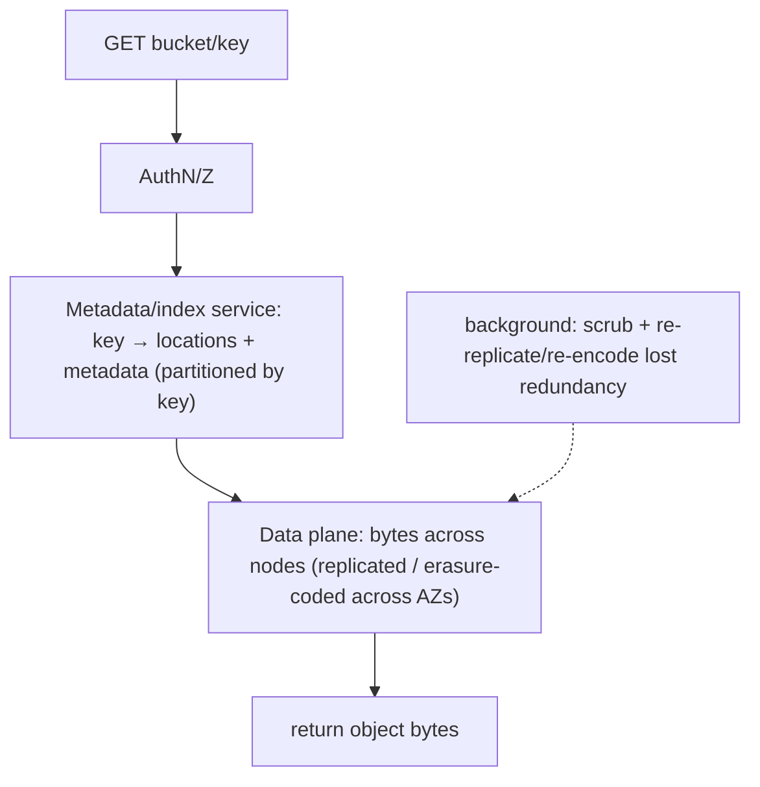
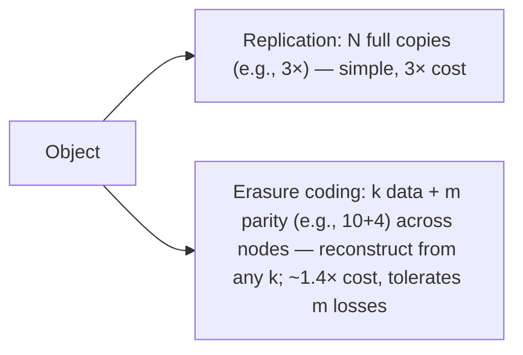

# Lesson 4.3.2 — Object/Blob Storage Internals and Lifecycle (S3-Style Systems)

> Part 4: Storage Systems · Module 4.3: Encoding & Evolution · Difficulty: 🔴
>
> **Prerequisites:** [4.1.3 block/file/object storage], [4.1.2 durability/replication intuition], [3.3.3 CDNs].
> **Unlocks:** [Part 7 partitioning], [Part 10 consistency/replication], [Part 11 durability], [Part 13 cloud], [Part 18 case studies].

---

## 1. Learning Objectives

After this lesson you will be able to:

- Explain the **internal architecture** of an S3-style object store: a **flat key → object** namespace, a separate **metadata/index service**, and a distributed **data plane** storing bytes across many nodes.
- Explain how object stores achieve **extreme durability** (replication and **erasure coding**) and **scalability** (partition by key) — and the **consistency** model (strong read-after-write today; historically eventual).
- Explain **large-object handling** (multipart upload, range reads), **versioning**, and the **consistency/availability** tradeoffs (a CAP/PACELC case study).
- Explain **lifecycle management & storage tiers** (hot → infrequent → archive), and how object storage composes with CDNs, databases, and data pipelines.

---

## 2. Motivation — Reverse-engineering the cloud's most important storage system

4.1.3 introduced object storage as an **abstraction** (flat key→blob over HTTP, cheap, durable, infinitely scalable). This lesson opens the box: **how does a system like S3 actually store exabytes durably and serve them at internet scale?** It's one of the most instructive distributed-systems case studies available, because it composes nearly every principle in this platform: **partitioning** (Part 7), **replication/erasure coding** and **durability** (Part 10/11), **consistency tradeoffs / CAP-PACELC** (Part 10), **metadata indexing** (Part 4/5), and **lifecycle/cost engineering** (4.1.1's hierarchy made economic).

Understanding the internals matters practically: it tells you **why** object storage behaves as it does (high durability but higher latency, no in-place edits, eventual-vs-strong consistency history, why "rename" is expensive, why multipart upload exists), so you can use it correctly as a **CDN origin** (3.3.3), a **data-lake landing zone** (Part 9), a **backup target** (Part 11), and the place to put blobs while keeping references in your database (4.1.3). It also previews the design discipline you'll apply when *building* large-scale storage in Part 18 and the capstone (Part 20).

---

## 3. Theory — From first principles

### 3.1 The architectural split: metadata plane vs data plane

An object store separates **where the bytes live** from **how you find them** `[CS]`:

- **Metadata / index service:** maps each **key** (`bucket/path/object`) to the **location(s)** of its data, plus metadata (size, content-type, ETag/checksum, version, custom tags, storage class). This is essentially a **massive, highly-available key-value index** (often built on a distributed database — itself using engines from 4.2). It must scale to **trillions** of objects and serve lookups fast.
- **Data plane (storage nodes):** the actual object **bytes**, stored across a huge fleet of disks/nodes, **replicated or erasure-coded** across failure domains for durability.

A request (`GET key`) → **authenticate/authorize** → **metadata lookup** (key → locations) → **read bytes** from the data plane → return. `PUT` → write bytes to multiple locations (durably) → **update metadata**. This separation lets each plane scale independently and is why the **flat namespace** (4.1.3) is so powerful — keys are just index entries to **partition** (Part 7).

### 3.2 Scaling via partitioning the keyspace

To serve trillions of objects, the metadata index and request load are **partitioned by key** (range or hash, Part 7) across many servers `[CS]`. Consequences you can observe from the outside:
- **Flat namespace + key partitioning = near-unlimited horizontal scale** (4.1.3) — add partitions/nodes to grow.
- **Key-prefix hotspots:** historically, sequential/common prefixes could concentrate load on one partition (a hot partition, Part 7); **randomizing/distributing key prefixes** (e.g., a hash prefix) spread load. Modern systems auto-partition adaptively, but **key design still matters** for throughput at extreme scale.
- **"Folders" are an illusion:** prefixes (`2024/06/`) are just key substrings; **listing** is a prefix scan over the index, and **rename/move** is a **copy + delete** (no cheap directory rename — 4.1.3).

### 3.3 Durability: replication and erasure coding

Object stores advertise extreme durability (e.g., "eleven nines" class — representative) by storing each object **redundantly across independent failure domains** (disks, nodes, availability zones) `[CS]`. Two techniques:

- **Replication:** keep **N full copies** across failure domains. Simple, fast to read (any copy), but **N× storage cost**.
- **Erasure coding (EC):** split the object into **k data fragments** + **m parity fragments** (e.g., 10+4), spread across nodes; the object can be reconstructed from **any k of the k+m** fragments. Tolerates **m failures** with far **less storage overhead** than replication (e.g., 1.4× vs 3×) — the standard for large-scale durable storage. The tradeoff: **more CPU/IO and complexity** to encode/decode and to **repair** lost fragments; reconstruction reads from multiple nodes.

Either way, the system continuously **detects and repairs** lost redundancy (background scrubbing, re-replication/re-encoding after disk/node failure) — durability is **maintained**, not just set once (Part 11). Cross-AZ/region redundancy protects against larger failures (Part 13).

### 3.4 Consistency: a CAP/PACELC case study

Object stores are a classic **consistency-model** example (Part 10) `[CS]`:
- **History:** early S3 offered **eventual consistency** for some operations (notably, a read shortly after an overwrite/delete, or list-after-write, could return **stale or not-yet-visible** results) — a famous source of pipeline bugs. Systems chose **availability + low latency** over strong consistency for those cases (a CAP/PACELC "AP / EL" lean).
- **Today:** major object stores (S3, representative) provide **strong read-after-write consistency** for new object PUTs and overwrites/deletes — a read after a successful write returns the latest data. This removed a big class of gotchas.
- **Why it was hard:** strong consistency across a massively distributed, partitioned, replicated metadata+data system requires careful coordination (Part 10) — initially traded away for scale/availability, later engineered in.

**Practical takeaway:** **know your provider's exact guarantee** (read-after-write vs list consistency vs cross-region replication lag). Cross-region replication is typically **asynchronous/eventual** even when single-region is strong.

### 3.5 Large objects, range reads, and immutability

Object semantics shape the API `[CS]`:
- **Objects are written/replaced whole (immutable-ish)** — **no in-place byte edits** (4.1.3). To "change" an object you upload a new version of the whole object.
- **Multipart upload:** large objects are uploaded in **parts** (in parallel, resumable); the store assembles them into one object on completion. This handles huge files, improves throughput (parallelism), and tolerates partial failures (retry a part).
- **Range reads (GET Range):** read a **byte range** of an object without downloading the whole thing — crucial for **video streaming** (seek), large-file partial reads, and parallel downloads.
- **Versioning:** optionally keep **previous versions** of an object (protects against accidental overwrite/delete; supports point-in-time restore) — at extra storage cost.
- **ETags/checksums** verify integrity and support conditional requests (caching, optimistic concurrency).

### 3.6 Lifecycle management and storage tiers

Storage is **cost-tiered** (4.1.1's hierarchy made economic) `[CONV]`:
- **Standard/hot** (frequent access, higher per-GB, low latency) → **infrequent-access/warm** (cheaper storage, retrieval fee) → **archive/cold** (e.g., Glacier-style: very cheap, retrieval takes **minutes to hours**) → optional deep archive.
- **Lifecycle policies** automate transitions and expiration: e.g., *"move objects to infrequent-access after 30 days, to archive after 90, delete after 365."* Also **abort incomplete multipart uploads** and **expire old versions** to control cost.
- **Intelligent tiering** auto-moves objects between tiers based on observed access (`[EMERGING]`/`[CONV]`).
This is **cost engineering**: keep hot data fast/expensive, push cold data cheap/slow, delete what you don't need — often the largest lever on a big storage bill.

### 3.7 How it composes in architecture

```
uploads/media → object store (durable, cheap) → CDN edge cache (3.3.3) → users (hot reads)
database (block, Part 5) ──stores object KEY/URL, not the blob (4.1.3)
data-lake files/logs/events → object store (landing zone) → batch/stream processing (Part 9) → analytics
backups / WAL archives / snapshots → object store (+ versioning) → DR (Part 11)
lifecycle policies tier hot→archive and expire old data (cost)
```
Object storage is the **durable, scalable substrate** under media delivery, data lakes, backups, and static hosting — composing with CDNs (read latency), databases (references), and pipelines (Part 9).

---

## 4. Visual Intuition

### Metadata plane + data plane



### Durability: replication vs erasure coding



---

## 5. Real-World Analogy

A planet-scale object store is like a **global self-storage empire run by a hyper-organized logistics company** (extending 4.1.3's analogy into the back office).

- You hand over a **sealed box** (object) with a **label** (key). At the front counter, a **giant searchable catalog** (the **metadata service**) records "box `2024/06/cat.jpg` → aisle 7, shelves in warehouses A, C, and F." That catalog is so big it's split across **many clerks by label range** (key partitioning) so no one clerk is overwhelmed.
- For safety, the company never keeps just one copy. Either it stores **three identical boxes in three different warehouses** (replication), or — cleverer and cheaper — it **shreds your box into 14 labeled strips and scatters them across 14 warehouses such that any 10 strips can rebuild the box** (erasure coding). If a warehouse burns down, **robots automatically rebuild the missing strips elsewhere** (background repair) — so the company can honestly promise it essentially **never loses a box**.
- You **can't reach in and edit one item** in a sealed box — you replace the whole box (immutability). For a **giant box**, movers bring it in **sections** and assemble it on site (multipart upload), and you can ask to inspect **just one section** without unpacking everything (range read).
- Finally, the company **moves boxes you rarely visit to cheaper, far-off vaults** automatically (lifecycle tiering) — the deep vault is dirt cheap but takes **hours to retrieve from** (archive) — and **shreds boxes past their keep-by date** (expiration). That automatic shuffling is how they keep your storage bill sane.

---

## 6. Industry Example

- **Amazon S3 / GCS / Azure Blob** `[CONV]`: exabyte-scale object stores with separated metadata + data planes, cross-AZ durability via replication/erasure coding, multipart upload, range reads, versioning, and lifecycle tiering (Standard → IA → Glacier-style archive) — representative of the model; exact internals are proprietary.
- **Strong read-after-write today; eventual historically** `[CONV]`: S3 moved from eventual (list-after-write/overwrite gotchas) to **strong read-after-write consistency** — a widely-referenced consistency-model evolution (Part 10).
- **Erasure coding at scale** `[CS]`: large storage systems (cloud object stores, HDFS EC, Ceph, Backblaze-documented designs — representative) use erasure coding to get high durability at ~1.3–1.5× overhead vs 3× replication.
- **Object store as CDN origin & data lake** `[CONV]`: object storage is the standard **CDN origin** (3.3.3) and **data-lake** foundation for analytics/ML pipelines (Part 9/18).
- **Lifecycle cost savings** `[BP]`: lifecycle policies (tier-down + expire + abort-incomplete-multipart) are a top cloud-cost optimization for log/backup-heavy workloads.

---

## 7. Implementation Details — using object storage at scale

- **Use it as the durable substrate** for blobs/media, backups, logs, data-lake files, static assets; **store object keys/URLs in your database** (block — 4.1.3), never the blobs themselves.
- **Front hot reads with a CDN** (3.3.3) to cut latency and origin/egress cost; object store latency is higher than local block I/O.
- **Use multipart upload** for large objects (parallel, resumable) and **range reads** for partial/streaming access (video seek).
- **Design keys for scale** (distribute prefixes / avoid hot prefixes at extreme request rates; date/hash partitioning) and remember **list = prefix scan**, **rename = copy+delete** (Part 7, 4.1.3).
- **Know your consistency guarantee** (read-after-write vs list vs cross-region async replication) and design pipelines accordingly (Part 10).
- **Enable versioning** where accidental overwrite/delete protection or PITR matters (cost-aware).
- **Apply lifecycle policies**: tier hot→IA→archive, expire old objects/versions, abort incomplete multipart uploads — the main cost lever.
- **Match durability/redundancy to needs**: cross-region replication for DR (async/eventual), single-region for most (Part 11/13).

## 8. Advantages

- **Extreme durability** (replication/erasure coding + background repair across failure domains) — Part 11.
- **Near-unlimited scale** (flat namespace + key partitioning) — Part 7.
- **Cheap per GB**, with **tiering** to make cold data far cheaper (cost engineering).
- **Internet-accessible** (HTTP) — CDN origin, data-lake, static hosting (3.3.3).
- **Rich features** — versioning, multipart, range reads, metadata/tags, lifecycle automation.
- **Strong read-after-write** (modern) removes a class of consistency bugs.

## 9. Disadvantages

- **Higher latency** than block storage (HTTP + distributed lookup) — not for hot transactional paths.
- **No in-place edits** (replace-whole) — wrong for mutable small records / OLTP.
- **Eventual behaviors remain** (cross-region replication lag; some list/operation semantics) — must be understood (Part 10).
- **Cost gotchas** — per-request, egress, retrieval (archive) fees; no lifecycle → paying hot prices for cold data.
- **Expensive "directory" ops** — rename/move = copy+delete; large lists are prefix scans.
- **Hot-prefix throughput limits** at extreme scale without key distribution (Part 7).

---

## 10. When NOT to use it

- **Transactional/OLTP or frequently-edited small records** → block storage + a database (4.1.3, Part 5).
- **Ultra-low-latency reads** in a hot path without a cache/CDN → too slow vs block/RAM.
- **Strong cross-region consistency requirements** → cross-region replication is async/eventual; don't assume instant global visibility.
- **Tiny shared-mount needs with POSIX semantics** → file storage (NAS) may fit better (4.1.3).
- **Data needing in-place partial updates frequently** → object immutability makes this costly.

---

## 11. Common Mistakes

1. **Treating object storage like a local disk** (hot-path reads, expecting in-place edits) → latency/semantics surprises.
2. **Storing large blobs in the database** instead of object storage + reference (4.1.3) → DB bloat.
3. **Hot key-prefix design** → throttling/hotspots at high request rates (Part 7).
4. **Assuming instant global/cross-region consistency** → reading stale data from a replica region (Part 10).
5. **No lifecycle policies** → runaway cost (cold logs/backups in hot tier; orphaned incomplete multipart uploads).
6. **Expensive mass "renames"** → scripts copying+deleting millions of objects (flat namespace reality).
7. **Not fronting hot media with a CDN** → high latency + egress bills (3.3.3).
8. **Ignoring versioning cost** (or *not* enabling it where accidental-delete protection is needed).

---

## 12. Interview Questions

**🟢 Easy**
- At a high level, how does an S3-style object store find and return an object? (metadata plane vs data plane)
- Why is object storage so durable and so scalable?

**🟡 Medium**
- Compare replication vs erasure coding for durability. Why do large stores prefer erasure coding?
- What consistency does object storage provide, and why was eventual consistency historically a source of bugs?

**🔴 Hard**
- Design a highly-durable, scalable object store: metadata indexing/partitioning, data placement, durability scheme, repair, and the consistency model. Where are the CAP/PACELC tradeoffs (Part 10)?
- Explain multipart upload, range reads, and why "rename" and large "list" operations are expensive — tying back to the flat namespace and key partitioning.

**⚫ Staff+**
- Design media storage + delivery + lifecycle for a video platform at scale: object layout/keys, multipart/range, CDN integration, durability/redundancy across regions, and lifecycle tiering for cost (Part 18).
- Analyze object storage as a distributed-systems case study against this platform's principles: partitioning (Part 7), replication/erasure coding & durability (Part 10/11), consistency evolution (eventual→strong, Part 10), and cost-tiering (4.1.1). Defend the tradeoffs.

---

## 13. Production Pitfalls

- **Cost blowup:** no lifecycle policies → petabytes of cold logs/backups in the hot tier; orphaned incomplete multipart uploads silently billed.
- **Cross-region staleness:** an app reads a replica region expecting the latest write but gets stale data (async replication — Part 10).
- **Hot-prefix throttling:** extreme request rates against a narrow key prefix get rate-limited (Part 7) — needs key distribution.
- **Latency surprise in hot path:** object GETs in a user-facing request without a CDN/cache → slow responses + egress cost.
- **Accidental deletion without versioning:** no version history/PITR → permanent data loss (enable versioning + MFA-delete for critical buckets).
- **Mass-rename storms:** copy+delete of millions of objects causing huge time/cost (flat namespace).

---

## 14. Optimization Techniques

- **CDN in front of hot objects** (3.3.3) — cut latency + origin/egress cost.
- **Lifecycle tiering + expiration** (hot→IA→archive, expire old versions, abort incomplete multiparts) — the biggest cost lever.
- **Erasure coding** for durable bulk storage at low overhead (vs 3× replication).
- **Multipart upload (parallel/resumable)** + **range reads** for large objects/streaming throughput.
- **Distribute key prefixes** (hash/date) to avoid hot partitions at extreme scale (Part 7).
- **Compression + appropriate object sizing** (avoid millions of tiny objects — per-request overhead; or huge monoliths — partial-access cost).
- **Right redundancy per data class** (cross-region for DR vs single-region) to balance durability and cost (Part 11/13).

---

## 15. Summary

An S3-style **object store** achieves "infinitely scalable, dirt-cheap, nearly-indestructible" storage by composing the platform's distributed-systems principles. Internally it splits a **metadata/index plane** (a massive, highly-available key→location index, **partitioned by key** for scale — Part 7) from a **data plane** (object bytes spread across a huge node fleet). **Durability** comes from storing each object redundantly across failure domains via **replication** (N full copies, simple but N× cost) or, at scale, **erasure coding** (k data + m parity fragments; reconstruct from any k; high durability at ~1.3–1.5× overhead), with continuous **background scrubbing and repair** maintaining redundancy after failures (Part 11). **Consistency** is a textbook CAP/PACELC case study (Part 10): historically **eventual** for some operations (list/overwrite gotchas), it now offers **strong read-after-write** for objects in major stores — though **cross-region replication remains asynchronous**. Object **semantics** flow from the design: objects are **written/replaced whole** (no in-place edits), large objects use **multipart upload** (parallel/resumable) and **range reads** (partial/streaming), **versioning** guards against accidental loss, and the **flat namespace** means **list = prefix scan** and **rename = copy+delete**. Economically, **lifecycle policies and storage tiers** (hot → infrequent → archive, plus expiration) turn 4.1.1's hierarchy into automated **cost engineering**. In architecture, object storage is the durable substrate behind **CDN-fronted media** (3.3.3), **data lakes/pipelines** (Part 9), **backups/DR** (Part 11), and static hosting — used with the rule **blobs in object storage, references in the database** (4.1.3) — and it stands as one of the best end-to-end case studies for partitioning, durability, consistency, and cost that the rest of the platform formalizes.

---

## 16. Revision Notes (flashcard-ready)

- **Q:** Two internal planes? **A:** Metadata/index service (key→locations + metadata, partitioned by key) + data plane (bytes across nodes, redundant).
- **Q:** How is scale achieved? **A:** Flat namespace + partition the keyspace (range/hash) across many servers (Part 7).
- **Q:** Replication vs erasure coding? **A:** Replication = N full copies (simple, N× cost); EC = k data + m parity, rebuild from any k (~1.4× cost, tolerates m losses).
- **Q:** Is durability "set once"? **A:** No — background scrubbing + re-replication/re-encoding continuously repair lost redundancy (Part 11).
- **Q:** Consistency model? **A:** Strong read-after-write today (historically eventual; cross-region replication still async) — a CAP/PACELC case study.
- **Q:** Why multipart upload / range reads? **A:** Large objects in parallel/resumable parts; read a byte range without the whole object (streaming/seek).
- **Q:** Object mutability? **A:** Write/replace whole object (immutable-ish); no in-place byte edits.
- **Q:** Namespace gotchas? **A:** "Folders" = key prefixes; list = prefix scan; rename/move = copy+delete; watch hot prefixes.
- **Q:** Lifecycle/tiers? **A:** Hot→infrequent→archive (cheaper/slower) + expiration + abort incomplete multiparts → cost engineering.
- **Q:** Architectural rule? **A:** Blobs in object storage (+ CDN for hot reads); references/keys in the database.

---

## 17. Further Reading + Knowledge-Graph Links

**Within this platform**
- **Previous:** [4.3.1 Data Encoding & Schema Evolution]. **Builds on:** [4.1.3 block/file/object], [4.1.2 durability]. **Concludes Part 4.** **Next:** [Part 5 Databases].
- **Case study of:** [Part 7 Partitioning] (key partitioning, hot prefixes), [Part 10 Consistency/Replication] (replication, erasure coding, eventual→strong), [Part 11 Fault Tolerance] (durability, repair, DR), [Part 13 Cloud Native] (cloud storage, multi-region).
- **Composes with:** [3.3.3 CDNs] (origin), [Part 9 Messaging] (data lake), [Part 18] (storage/CDN case studies), [Part 20 Capstone] (object storage + CDN).

**Foundational texts (synthesized)**
- Kleppmann, *Designing Data-Intensive Applications* — partitioning, replication, consistency models (applied to object storage).
- Cloud provider object-storage documentation (S3/GCS/Azure Blob: consistency, multipart, lifecycle, storage classes) — representative.
- Erasure-coding literature and documented large-scale storage designs (representative) — durability vs cost.

**Concept tags:** `[CS]` metadata vs data plane, key partitioning, replication vs erasure coding, durability repair, eventual vs strong consistency · `[CONV]` S3/GCS/Azure, storage tiers/lifecycle, multipart/range/versioning, strong read-after-write · `[BP]` blobs+reference pattern, CDN for hot reads, lifecycle tiering for cost, key-prefix distribution, versioning for protection.
