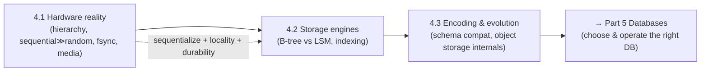

# Part 4 — Storage Systems ✅ COMPLETE

How bytes are actually stored, indexed, and retrieved — from the physics of disks to storage engines to encoding — unified by one idea: **storage design is the art of reconciling fast-but-volatile with slow-but-durable, by sequentializing access, exploiting locality, and choosing where to pay the read/write/space tax.**

---

## Lessons

### Module 4.1 — Storage Hardware Reality
| # | Lesson | Core idea |
|---|--------|-----------|
| 4.1.1 | [Memory Hierarchy & Sequential vs Random I/O](4.1.1-memory-hierarchy-sequential-vs-random-io.md) | Orders-of-magnitude tiers; sequential ≫ random; locality; the latency numbers |
| 4.1.2 | [Disks, Page Cache, fsync, Write Amplification](4.1.2-disks-page-cache-fsync-write-amplification.md) | `write()` ≠ durable; fsync forces it; WAL sequentializes durability; SSD write amplification |
| 4.1.3 | [Block vs File vs Object Storage](4.1.3-block-file-object-storage.md) | Three contracts: block (DB/VM), file (shared NAS), object (media/backups/lake) |

### Module 4.2 — Storage Engines
| # | Lesson | Core idea |
|---|--------|-----------|
| 4.2.1 | [Log-Structured vs Page-Oriented](4.2.1-log-structured-vs-page-oriented.md) | Two philosophies: append-only (LSM) vs in-place (B-tree); the append-only log unifies both |
| 4.2.2 | [B-Trees](4.2.2-b-trees.md) | Shallow high-fan-out page tree; fast/predictable reads + range scans; needs a WAL |
| 4.2.3 | [LSM-Trees](4.2.3-lsm-trees.md) | Memtable→SSTable→compaction; high write throughput; bloom filters rescue reads |
| 4.2.4 | [B-Tree vs LSM Tradeoffs](4.2.4-btree-vs-lsm-tradeoffs.md) | Read/write/space amplification (RUM); workload → engine; no best, only best-given-constraints |
| 4.2.5 | [Indexing](4.2.5-indexing.md) | Clustered/secondary/composite/covering/partial; index from the query; every index taxes writes |

### Module 4.3 — Encoding & Evolution
| # | Lesson | Core idea |
|---|--------|-----------|
| 4.3.1 | [Data Encoding & Schema Evolution](4.3.1-data-encoding-schema-evolution.md) | Backward + forward compatibility; additive/optional changes; Protobuf tags / Avro registry |
| 4.3.2 | [Object/Blob Storage Internals](4.3.2-object-blob-storage-internals.md) | Metadata+data planes, erasure coding, consistency (eventual→strong), lifecycle tiering |

---

## The through-line of Part 4

**One sentence:** Storage starts from hardware physics — orders-of-magnitude tiers where sequential beats random and `write()` isn't durable until fsync — which is why engines either update pages in place (B-trees: read-optimized, WAL for safety) or append-only and compact (LSM-trees: write-optimized), a choice you make via read/write/space amplification and refine with indexing; and once data leaves the program it must evolve compatibly (backward + forward) and, at internet scale, lives in object stores that compose partitioning, erasure-coded durability, and lifecycle tiering.

---

## The key decisions Part 4 equips you to make

- **Where does this data belong?** Block (transactional DB/VM) · File (shared mount) · Object (blobs/backups/lake + CDN). (4.1.3, 4.3.2)
- **Which storage engine?** B-tree (read-heavy/transactional/predictable) vs LSM (write-heavy/high-ingest) — by read/write/space amplification. (4.2.1–4.2.4)
- **How do I make queries fast without wrecking writes?** Index from the query: clustered key choice, composite (leftmost-prefix), covering, partial — and drop unused indexes. (4.2.5)
- **How do I guarantee durability?** fsync to stable media; WAL + group commit; tune durability vs throughput. (4.1.2)
- **How do I change data shape without outages?** Additive/optional changes; backward+forward compat; Protobuf tag rules / Avro registry; expand-and-contract migrations. (4.3.1)

---

## Self-check before Part 5

Without notes, can you:
1. Sketch the memory hierarchy with order-of-magnitude latencies and explain sequential vs random I/O?
2. Explain why `write()` isn't durable, what fsync does, and why databases use a WAL + group commit?
3. Choose block vs file vs object storage for given data, and explain why you don't run an OLTP DB on object storage?
4. Explain the two storage-engine philosophies and why both rest on the append-only log?
5. Describe a B+Tree (fan-out, shallow height, linked leaves, splits) and why it needs a WAL?
6. Describe an LSM-tree (memtable/SSTable/compaction/bloom filters) and read/space amplification?
7. Compare B-tree vs LSM via read/write/space amplification and map a workload to an engine?
8. Design indexes from queries (clustered, composite/leftmost-prefix, covering, partial) and state each index's cost?
9. Define backward/forward compatibility and the evolution rules for Protobuf and Avro?
10. Explain how an S3-style object store achieves durability (erasure coding), scale (key partitioning), and its consistency model + lifecycle tiers?

If any are shaky, revisit that lesson's Revision Notes. Part 5 (Databases) builds directly on storage engines and indexing to choose and operate the right database.

---

*Reference assets for this part: `../../reference/latency-and-estimation-cheatsheet.md`, `../../reference/storage-engine-comparison.md`.*
