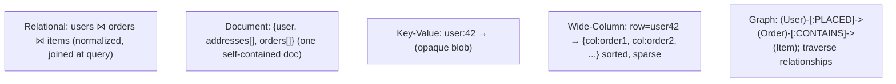
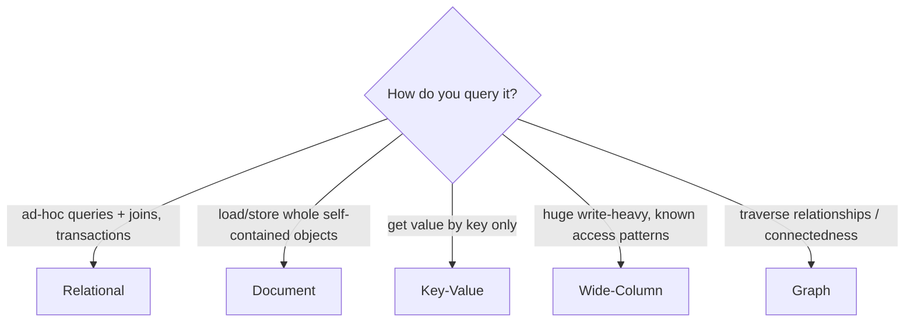

# Lesson 5.1.1 — Data Models: Relational, Document, Key-Value, Wide-Column, Graph — When Each Fits

> Part 5: Databases · Module 5.1: Data Models · Difficulty: 🟡🔴
>
> **Prerequisites:** [4.2.x storage engines & indexing], [2.1.3 DDD/aggregates], [1.1.2 requirements].
> **Unlocks:** [5.1.2 normalization], [5.1.3 polyglot persistence], [5.4.1 SQL/NoSQL/NewSQL], [Part 7 sharding], [Part 10 consistency].

---

## 1. Learning Objectives

After this lesson you will be able to:

- Distinguish the five mainstream **data models** — **relational, document, key-value, wide-column, graph** — by their structure, query style, and access patterns.
- Explain the **access-pattern-driven** logic for choosing a model (the data model should fit how you *query*, not just how you *think about* the data).
- Articulate the strengths, weaknesses, and canonical use cases of each model, and where the boundaries blur (multi-model databases).
- Separate the **data model** (this lesson) from the **storage engine** (4.2) and the **distribution/consistency** properties (5.4, Part 10) — three independent choices.

---

## 2. Motivation — The model decides what's easy and what's painful

Choosing a data model is one of the earliest and most consequential design decisions, because it determines which queries are **natural and fast** and which are **awkward and slow** — and that's expensive to change later (data migrations are hard). For decades the answer was "use a relational database," and that's still the right default for most applications. But the **NoSQL** movement arose because the relational model's rigidity and its difficulty scaling writes horizontally (Part 7) were genuine pain points for certain workloads — huge scale, flexible/evolving schemas, simple access patterns, or highly-connected data.

The key insight is that there is **no universally best model** (1.1.5) — each optimizes for a different **shape of data and access pattern**. Relational excels at **flexible ad-hoc queries and joins** over normalized data; document fits **self-contained, hierarchical objects**; key-value is a **dumb-but-fast** lookup by key; wide-column handles **massive write/read throughput over huge sparse datasets**; graph makes **relationship-traversal queries** trivial. Picking the wrong model means fighting your database forever; picking the right one (or several — **polyglot persistence**, 5.1.3) makes whole classes of problems disappear.

Crucially, the data model is **independent** of the storage engine (a relational DB might use a B-tree (4.2.2) or LSM (4.2.3) engine) and of distribution/consistency (5.4). This lesson focuses on the *logical model* and how to match it to your **access patterns** — the foundation for everything in Part 5.

---

## 3. Theory — From first principles

### 3.1 What a "data model" is

A data model defines **how data is structured, related, and queried** at the logical level `[CS]`. It shapes the mental model developers use *and* the operations the database makes efficient. The model is distinct from:
- the **storage engine** (how bytes are laid out on disk — B-tree vs LSM, 4.2), and
- the **distribution/consistency** model (single-node vs sharded/replicated, ACID vs eventual — 5.4, Part 7/10).

You can mix these: e.g., a document model on an LSM engine with eventual consistency, or a relational model on a B-tree engine with strong ACID.

### 3.2 Relational (tables, rows, SQL)

The relational model organizes data into **tables (relations)** of **rows and typed columns**, with **keys** and **foreign keys** expressing relationships, queried with **SQL** `[CS]`. Its defining strengths:
- **Flexible ad-hoc queries:** SQL + joins let you answer questions you didn't anticipate at design time — you **normalize** (5.1.2) once and query many ways.
- **Joins** combine data across tables, so you avoid duplicating data (normalization) and the DB assembles it at query time.
- **ACID transactions** (5.2) across rows/tables — strong correctness guarantees.
- **Schema enforcement** — types, constraints, referential integrity catch bad data.
- Mature **query optimizer** (5.3.2), indexing (4.2.5), and ecosystem.

Costs: the **rigid schema** requires migrations to change (4.3.1), **joins get expensive** at very large scale, and **horizontal write scaling (sharding)** is harder than for some NoSQL models (Part 7) — joins across shards are painful. **Object-relational impedance mismatch:** application objects (nested) don't map cleanly to flat tables, requiring ORMs/translation.

**Best for:** the **default** for most applications — transactional systems, anything with complex relationships and ad-hoc querying, where correctness and flexible queries matter (orders, finance, inventory, most business apps).

### 3.3 Document (JSON-like nested documents)

The document model stores data as **self-contained, hierarchical documents** (typically JSON/BSON), grouped into collections, each document keyed by an ID `[CS]`. There's usually **no enforced schema** (schema-on-read / flexible schema).
- **Locality:** a document holds a whole object (e.g., a user with embedded addresses and orders) — one read fetches it all, no joins; great when you load/store **whole objects** matching the access pattern (the aggregate, 2.1.3).
- **Flexible schema:** documents in a collection can differ; easy to evolve (add fields) without migrations — good for heterogeneous/evolving data.
- Maps naturally to **application objects** (less impedance mismatch).

Costs: **weak at joins / cross-document relationships** (you denormalize or do app-side joins); **flexible schema pushes validation into the app** (and risks inconsistency); querying across documents or by embedded fields can be limited/needs indexes; **denormalized duplication** creates update anomalies (5.1.2).

**Best for:** content/catalogs, user profiles, CMS, event/document storage, configs — **self-contained objects** loaded as a unit, with few cross-entity joins. (MongoDB, Couchbase — representative.)

### 3.4 Key-value (the simplest model)

A key-value store is a **distributed hash map**: `put(key, value)` / `get(key)` where the **value is opaque** to the DB `[CS]`. No queries on value contents, no joins — just **lookup by key**.
- **Extremely fast and simple**, trivially **partitionable** (hash the key — consistent hashing, Part 7), highly scalable/available.
- Often used as **caches** (Redis, Memcached — Part 6) and for session stores, feature flags, simple lookups.

Costs: you can **only access by key** (no querying by value, no ranges unless the store adds ordering, no joins); the application must structure all access around keys. (Some KV stores — Redis — add **rich value types** (lists, sets, sorted sets, hashes) and ordering, blurring into more capability.)

**Best for:** caching, sessions, user preferences, real-time lookups, any **"get the blob for this key"** pattern where you never query by value. (Redis, Memcached, DynamoDB in KV mode — representative.)

### 3.5 Wide-column (column-family / "Bigtable" model)

The wide-column model stores data in **rows identified by a key**, where each row has a flexible, potentially huge set of **columns grouped into column families**; rows can have **different columns** (sparse) `[CS]`. It's *not* a relational column store — think of it as a **sorted, distributed, multi-dimensional map**: `(row key, column key) → value`.
- Designed for **massive scale and high write throughput** (built on **LSM** engines — 4.2.3), with data **partitioned by row key** and **sorted within partitions** → efficient writes and range scans on the row/clustering key.
- **Query-driven schema:** you design tables **per query** (often denormalized, one table per access pattern) because there are **no joins** and querying is limited to the partition/clustering-key structure (Part 7).

Costs: **no joins, limited ad-hoc querying** (you must know your queries up front and model for them); secondary indexes are limited/discouraged (4.2.5); denormalization + duplication is the norm (managing consistency is on you); **eventual consistency** is common (5.4, Part 10).

**Best for:** time-series, metrics, event logging, IoT, messaging, very large write-heavy datasets with known access patterns. (Cassandra, ScyllaDB, HBase, Bigtable — representative; Part 18.)

### 3.6 Graph (nodes and edges)

The graph model represents data as **nodes (entities)** and **edges (relationships)**, both of which can have properties, queried with graph languages (Cypher, Gremlin) `[CS]`. The relationships are **first-class** and stored as direct pointers.
- **Traversals are cheap:** "friends of friends," "shortest path," "what's connected to X N hops away" are **natural and fast** — in a relational DB these are painful recursive multi-join queries that blow up with depth.
- Great for **highly-connected data** where the *relationships* are the point.

Costs: **specialized** — overkill for non-relationship-centric data; **scaling/partitioning a graph is hard** (relationships cross partitions — Part 7); smaller ecosystem; can be slower for bulk/aggregate queries that relational handles well.

**Best for:** social networks, recommendation engines, fraud detection, knowledge graphs, network/dependency analysis, identity/access graphs. (Neo4j, Neptune, JanusGraph — representative.)

### 3.7 The decision: follow the access patterns

The governing principle `[BP]`: **model the data to fit how you will query it**, not just how you conceptualize it. Ask:
- **What are the read/write access patterns?** (point lookups? ad-hoc queries? traversals? range scans? whole-object loads?)
- **How connected is the data?** (many relationships/joins → relational or graph; self-contained → document; none → key-value.)
- **What scale/throughput?** (massive write-heavy at scale → wide-column/KV; moderate with rich queries → relational.)
- **How flexible/evolving is the schema?** (rigid+validated → relational; flexible → document.)
- **What consistency/transaction needs?** (strong multi-entity ACID → relational/NewSQL; eventual OK → many NoSQL.)

Default to **relational** unless a specific driver (scale, connectedness, flexibility, access pattern) clearly points elsewhere — and consider **polyglot persistence** (5.1.3): use multiple models for different parts of the system. Many databases are now **multi-model** (support several models), blurring the lines.

### 3.8 Comparison table

| Model | Structure | Query style | Joins | Scale-out | Best for |
|---|---|---|---|---|---|
| **Relational** | tables/rows/columns | SQL, ad-hoc + joins | **yes** | harder (sharding) | default; transactional, complex queries |
| **Document** | nested JSON docs | by key + doc fields | weak | good | self-contained objects, flexible schema |
| **Key-Value** | key → opaque value | get/put by key only | no | **excellent** | caching, sessions, simple lookups |
| **Wide-Column** | (row key, column) → value, families | partition/clustering-key, query-driven | no | **excellent** | time-series, high-write at scale |
| **Graph** | nodes + edges (properties) | traversals (Cypher/Gremlin) | traversal-native | hard | connected data, traversals |

---

## 4. Visual Intuition

### Same data, five shapes

### Choosing by access pattern

---

## 5. Real-World Analogy

Think of ways to organize information about a company's people and their work.

- **Relational** is a set of **cross-referenced spreadsheets**: one sheet of employees, one of projects, one linking who's on what — kept tidy with no duplication, and you can **ask any question** by joining sheets ("which employees in Berlin worked on projects over $1M?"). Flexible, but you must maintain the links and big joins get slow.
- **Document** is a **folder per employee** containing everything about them — contact info, their projects, their reviews — all in one place. Grab one folder and you have the whole picture instantly (no cross-referencing). But asking "who worked on Project X?" means **opening every folder**, and the same project info is **copied** into many folders (update them all if it changes).
- **Key-Value** is a **coat check**: hand over a ticket number (key), get your exact item (value) back instantly. Lightning fast — but you can *only* ask by ticket number; you can't ask "which coats are blue?"
- **Wide-Column** is a **giant warehouse of shelves keyed by ID**, where each row can hold wildly different, sparse items, and it's built to accept **millions of new entries per second** and read them back by shelf/row — but you can't "join" shelves; you arrange each shelf exactly for the questions you'll ask.
- **Graph** is a **detective's cork-board** of photos (nodes) connected by string (edges): "who knows whom, who paid whom." Tracing a chain of connections ("find everyone within 3 hops of this suspect") is **just following the strings** — trivial here, nightmarish in spreadsheets.

You'd reasonably use **several at once**: spreadsheets for the official records, coat-check for fast lookups/caching, the cork-board for the relationship analysis — that's polyglot persistence (5.1.3).

---

## 6. Industry Example

- **Relational as the default** `[CONV]`: Postgres, MySQL, SQL Server, Oracle run the majority of transactional business systems — orders, payments, inventory, users — where ad-hoc queries, joins, and ACID matter (5.2).
- **Document for flexible objects** `[CONV]`: MongoDB/Couchbase for catalogs, content, profiles, and rapidly-evolving schemas; many start here for developer velocity.
- **Key-value for speed** `[CONV]`: Redis/Memcached as caches/session stores (Part 6); DynamoDB (KV/document) for high-scale simple-access workloads.
- **Wide-column for scale** `[CS]`: Cassandra/ScyllaDB/HBase/Bigtable for time-series, metrics, messaging, and write-heavy planet-scale data (Part 18) — query-driven, denormalized table-per-query design.
- **Graph for connectedness** `[CONV]`: Neo4j/Neptune for social graphs, recommendations, fraud detection, and knowledge graphs.
- **Multi-model & polyglot** `[CONV]`: many systems combine models (e.g., Postgres with JSONB for document-style fields; a relational system of record + Redis cache + a graph/search store) — and databases increasingly support multiple models natively (5.1.3, 5.4).

---

## 7. Implementation Details — choosing a model

- **Enumerate access patterns first** (the most important step): list the queries/writes, their frequency, latency needs, and consistency needs — then pick the model that makes the dominant patterns natural (5.1.2 query-driven design; especially mandatory for wide-column).
- **Default to relational** unless a clear driver points elsewhere — it's the most flexible for unknown future queries and gives ACID + joins (5.2). "Boring" is often correct (1.1.5).
- **Pick document** when you load/store **self-contained aggregates** (2.1.3) and want schema flexibility, with few cross-entity joins.
- **Pick key-value** for pure **by-key** access (cache/session/lookup) at high speed/scale (Part 6).
- **Pick wide-column** for **massive write-heavy** workloads with **known** access patterns (time-series/events) — design **table-per-query**, denormalized (Part 7/18).
- **Pick graph** when **relationship traversals** dominate and depth/connectedness makes relational joins explode.
- **Consider polyglot/multi-model** (5.1.3) — different stores for different subsystems — but weigh the operational cost of more systems.
- **Separate concerns:** decide model, then engine (4.2), then distribution/consistency (5.4) — don't conflate them.

## 8. Advantages (by model)

- **Relational:** ad-hoc queries + joins, ACID, schema integrity, mature tooling/optimizer — maximum query flexibility.
- **Document:** locality (whole object in one read), flexible/evolving schema, maps to app objects.
- **Key-value:** fastest + simplest, trivially scalable/partitionable, great cache.
- **Wide-column:** massive write throughput + scale, sparse flexible columns, efficient partition/range access.
- **Graph:** cheap relationship traversals, expressive for connected data.

## 9. Disadvantages (by model)

- **Relational:** rigid schema (migrations), joins costly at scale, harder horizontal write scaling (sharding), impedance mismatch.
- **Document:** weak joins/cross-doc queries, schema validation shifts to app, denormalization → update anomalies.
- **Key-value:** access by key only — no value queries/joins/ranges (unless extended).
- **Wide-column:** no joins, limited ad-hoc/secondary indexes, must know queries up front, eventual consistency common, denormalization burden.
- **Graph:** specialized, hard to scale/partition, smaller ecosystem, weaker at bulk aggregates.

---

## 10. When NOT to use each

- **Don't force relational** when data is purely by-key (use KV) or write-throughput at planet scale dominates (wide-column) or it's traversal-heavy (graph).
- **Don't use document** for highly-relational data needing many joins/transactions across entities (use relational) — you'll reinvent joins in the app.
- **Don't use key-value** when you need to query by value, ranges, or relationships.
- **Don't use wide-column** for low-scale apps with ad-hoc queries — its rigidity (query-driven, no joins) is overhead you don't need; relational is simpler.
- **Don't use graph** for data that isn't relationship-centric — the specialization and scaling cost aren't justified.
- **Don't go polyglot** prematurely — each extra datastore is operational burden (5.1.3).

---

## 11. Common Mistakes

1. **Choosing by hype** ("we need NoSQL") instead of by access pattern — landing relational-shaped, query-rich data on a model that can't join (4.2.4 analog).
2. **Modeling wide-column/document like relational** — expecting joins/ad-hoc queries; not designing table-per-query (wide-column) → painful workarounds.
3. **Over-denormalizing without managing duplication** (document/wide-column) → update anomalies and inconsistency (5.1.2).
4. **Using a document DB then doing app-side joins everywhere** — a sign relational was the right model.
5. **Ignoring future query flexibility** — committing to a model that makes new, unanticipated queries impossible (relational hedges this).
6. **Conflating model with engine/consistency** — assuming "NoSQL = eventually consistent/fast" or "SQL = can't scale" (5.4 nuance).
7. **Premature polyglot** — too many datastores too early (ops cost).

---

## 12. Interview Questions

**🟢 Easy**
- Name the five data models and give a one-line use case for each.
- What's the difference between a key-value store and a document store?

**🟡 Medium**
- Why is the relational model good for ad-hoc queries but harder to scale horizontally than key-value/wide-column?
- When would you choose a graph database over a relational one, and why?

**🔴 Hard**
- You're designing storage for an e-commerce platform (product catalog, user carts, orders/payments, recommendations, activity logs). Pick a data model for each and justify by access pattern (preview polyglot, 5.1.3).
- Explain query-driven schema design in a wide-column store: why you model table-per-query and denormalize, and what you give up (joins, ad-hoc queries).

**⚫ Staff+**
- Critically separate data model, storage engine (4.2), and consistency/distribution (5.4/Part 10). Give an example where the same data model is paired with different engines/consistency and why.
- Design the data layer for a social platform: profiles, posts/feed, the social graph, messaging, and analytics. Defend a polyglot choice across relational/document/wide-column/graph/KV, including the operational cost (5.1.3, Part 18).

---

## 13. Production Pitfalls

- **Wrong-model lock-in:** choosing a model that can't serve emerging queries → expensive re-platforming/migration later.
- **App-side joins at scale:** a document/KV/wide-column store forcing N+1 app-side joins → latency and complexity (should've been relational, Part 17).
- **Denormalization drift:** duplicated data in document/wide-column getting out of sync (no disciplined update path) → inconsistency (5.1.2).
- **Hot partitions (wide-column/KV):** poor key design concentrating load on one partition (Part 7).
- **Schema-on-read surprises (document):** inconsistent/garbage data because validation was never enforced anywhere.
- **Graph scaling wall:** a graph workload outgrowing single-node, with painful partitioning of cross-cutting relationships (Part 7).

---

## 14. Optimization Techniques

- **Model from access patterns** (the primary lever) — make dominant queries natural; table-per-query for wide-column (5.1.2).
- **Use the right model per subsystem (polyglot)** — relational system-of-record + KV cache + search/graph as needed (5.1.3, Part 6).
- **Exploit multi-model features** (e.g., Postgres JSONB for occasional document needs) to avoid adding a datastore.
- **Index for the model** (4.2.5) — relational indexes; document field indexes; careful partition/clustering keys (wide-column).
- **Denormalize deliberately** where read performance demands it, with a clear consistency-maintenance plan (5.1.2, Part 6).
- **Match engine + consistency to the model** (4.2/5.4) — e.g., LSM engine + eventual consistency for write-heavy wide-column.

---

## 15. Summary

A **data model** defines how data is logically structured, related, and queried — independent of the **storage engine** (B-tree vs LSM, 4.2) and the **distribution/consistency** model (5.4, Part 10). The five mainstream models each optimize for a different **shape of data and access pattern**, so there's no universal best (1.1.5). **Relational** (tables/rows/SQL, joins, ACID) is the **default** — unmatched for **flexible ad-hoc queries** over normalized data with strong correctness — at the cost of rigid schemas, costly joins at scale, and harder horizontal write-scaling (sharding). **Document** (nested JSON) gives **locality** (load a whole self-contained object/aggregate in one read) and **schema flexibility**, but is weak at cross-document joins and risks denormalization anomalies. **Key-value** is a fast, trivially-scalable **lookup by key** (caches, sessions) with no querying by value. **Wide-column** (`(row, column)→value`, LSM-backed) delivers **massive write-heavy scale** with **query-driven, table-per-query, denormalized** design — no joins, limited ad-hoc queries. **Graph** (nodes + edges) makes **relationship traversals** trivial for highly-connected data, but is specialized and hard to scale. The governing rule is to **model for how you query** (enumerate access patterns first), **default to relational** unless a clear driver — scale, connectedness, flexibility, or a specific access pattern — points elsewhere, and consider **polyglot persistence** (5.1.3) to use the right model per subsystem, mindful that each extra datastore adds operational cost. This model choice is the foundation for normalization (5.1.2), database selection (5.4), sharding (Part 7), and consistency (Part 10).

---

## 16. Revision Notes (flashcard-ready)

- **Q:** The five data models? **A:** Relational, Document, Key-Value, Wide-Column, Graph.
- **Q:** Relational sweet spot / cost? **A:** Ad-hoc queries + joins + ACID (flexible); rigid schema, costly joins at scale, harder sharding.
- **Q:** Document sweet spot / cost? **A:** Self-contained objects (locality) + flexible schema; weak joins, denormalization anomalies.
- **Q:** Key-value sweet spot / cost? **A:** Fast lookup by key, trivially scalable; can't query by value/ranges/joins.
- **Q:** Wide-column sweet spot / cost? **A:** Massive write-heavy scale, query-driven/table-per-query; no joins, limited ad-hoc, eventual consistency common.
- **Q:** Graph sweet spot / cost? **A:** Cheap relationship traversals on connected data; specialized, hard to scale/partition.
- **Q:** Governing principle? **A:** Model for how you query (access patterns first), not just how you conceptualize the data.
- **Q:** Default model? **A:** Relational — unless scale/connectedness/flexibility/access-pattern clearly points elsewhere.
- **Q:** Three independent choices? **A:** Data model (this) vs storage engine (4.2) vs distribution/consistency (5.4).
- **Q:** Using multiple models? **A:** Polyglot persistence (5.1.3) — right model per subsystem; cost = more systems to operate.

---

## 17. Further Reading + Knowledge-Graph Links

**Within this platform**
- **Builds on:** [4.2.x storage engines & indexing], [2.1.3 DDD/aggregates]. **Next:** [5.1.2 Normalization vs Denormalization] → [5.1.3 Polyglot Persistence].
- **Drives:** [5.4.1 SQL vs NoSQL vs NewSQL], [Part 7 Sharding] (partition/clustering keys), [Part 10 Consistency], [Part 18 case studies] (Cassandra/Bigtable/graph/search).
- **Related:** [4.2.4 B-tree vs LSM] (engine pairing), [Part 6 Caching] (KV stores).

**Foundational texts (synthesized)**
- Kleppmann, *Designing Data-Intensive Applications* — relational vs document vs graph models, query-driven design, multi-model.
- Silberschatz et al., *Database System Concepts* — relational model fundamentals.
- Cassandra/MongoDB/Neo4j documentation — representative for wide-column/document/graph modeling.

**Concept tags:** `[CS]` relational/document/key-value/wide-column/graph models, access-pattern-driven design · `[CONV]` Postgres/MySQL, MongoDB, Redis/DynamoDB, Cassandra/Bigtable, Neo4j, multi-model · `[BP]` model from access patterns, default to relational, table-per-query for wide-column, polyglot where justified.
