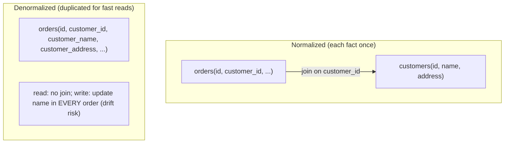
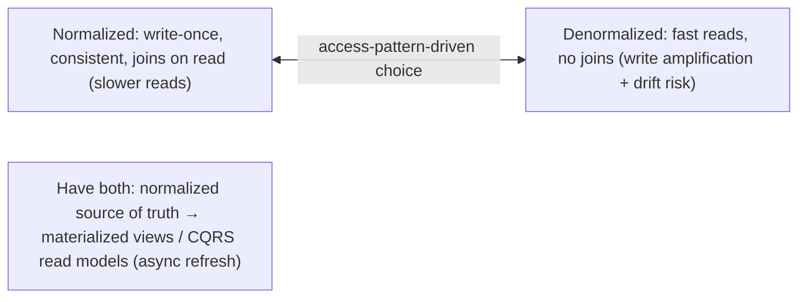

# Lesson 5.1.2 — Normalization vs Denormalization; Query-Driven Schema Design

> Part 5: Databases · Module 5.1: Data Models · Difficulty: 🟡🔴
>
> **Prerequisites:** [5.1.1 data models], [4.2.5 indexing], [4.1.1 sequential vs random I/O].
> **Unlocks:** [5.1.3 polyglot persistence], [Part 6 Caching], [Part 7 Scalability], [Part 9 materialized views/CDC].

---

## 1. Learning Objectives

After this lesson you will be able to:

- Explain **normalization** (organizing data to eliminate redundancy; each fact stored once) and the practical intent of normal forms (1NF→3NF) without memorizing formal definitions.
- Explain **denormalization** (deliberately duplicating/precomputing data to make reads faster) and the **read-speed vs write-cost/consistency** tradeoff it represents.
- Apply **query-driven schema design** — modeling the schema around the queries you must serve — especially in NoSQL/wide-column where it's mandatory.
- Reason about when to normalize, when to denormalize, and how to manage the **consistency burden** of duplicated data (update anomalies, materialized views, CDC).

---

## 2. Motivation — The same data, organized for writes or organized for reads

Once you've picked a data model (5.1.1), you must decide **how to structure the schema** — and the central tension is **normalization vs denormalization**. Normalization stores **each fact exactly once**, eliminating redundancy: clean, consistent, write-friendly, and the relational tradition's default. But answering a query may then require **joining many tables**, which gets expensive at scale (4.1.1, 4.2.5). Denormalization does the opposite — **duplicate or precompute** data so a read needs **no joins** — trading write cost, space, and consistency risk for **read speed**.

This is a direct instance of the read/write tradeoff that runs through storage (4.2.4's RUM) and caching (Part 6): you can optimize for clean writes or fast reads, rarely both. The right answer depends on your **access patterns** — which is why **query-driven schema design** (model the schema around the queries) is the unifying discipline. In relational systems you typically **normalize first, then denormalize selectively** where reads demand it. In NoSQL (document, wide-column — 5.1.1), denormalization and query-driven design are **the default**, because there are no joins to fall back on.

Getting this right determines whether your reads are fast and your data stays consistent; getting it wrong gives you either slow join-heavy queries or a tangle of duplicated data drifting out of sync (update anomalies). It's foundational for performance (Part 17), caching (Part 6), and scaling (Part 7).

---

## 3. Theory — From first principles

### 3.1 Normalization — store each fact once

**Normalization** is organizing relational data to **minimize redundancy and dependency** by splitting data into related tables, so each piece of information is stored **exactly once** `[CS]`. The **normal forms** (1NF, 2NF, 3NF, BCNF…) are progressively stricter rules; the practical essence you need:
- **1NF:** atomic values, no repeating groups (no comma-lists in a cell).
- **2NF/3NF (the practical target):** every non-key column depends on **the key, the whole key, and nothing but the key** — i.e., **don't store data that depends on something other than the primary key** (move it to its own table, reference by foreign key).

Example: instead of storing the customer's name and address in **every order row** (duplicated, drifts on change), store customers in a `customers` table and reference `customer_id` in `orders`. The name lives **once**.

**Why normalize** `[CS]`:
- **No update anomalies:** change a fact in **one place** (update the customer's address once, not in every order).
- **Consistency/integrity:** no contradictory duplicates; referential integrity enforced.
- **Less space**, and **write-efficient** (write a fact once).
- **Flexibility:** you didn't bake in any particular query shape.

**Cost:** reads that need data from multiple tables require **joins** — more work at query time, and **expensive at large scale / across shards** (Part 7) where joins may be impossible.

### 3.2 Denormalization — duplicate/precompute for read speed

**Denormalization** deliberately introduces **redundancy** — duplicating data across tables/documents or **precomputing** aggregates — so common reads can be served **without joins or expensive computation** `[CS]`. Examples:
- Embedding the customer name **inside** each order (so displaying an order needs no join).
- Storing a **precomputed count** (e.g., `post.like_count`) instead of `COUNT(*)`-ing a likes table every read.
- A **document** holding a user with all their orders embedded (5.1.1) — one read, no join.
- A **wide-column table per query** with all needed fields duplicated (5.1.1, §3.4).

**Why denormalize** `[CS]`:
- **Fast reads** — no joins, no aggregation at read time (great for read-heavy workloads).
- **Scales reads** and works where joins don't (sharded/NoSQL — Part 7).

**Cost (the tradeoff)** `[CS]`:
- **Write amplification & complexity:** one logical change must update **many copies** (update the customer name in every order, recompute counts) — more write work and application logic.
- **Consistency risk / update anomalies:** if any copy isn't updated, data **drifts out of sync** (the classic denormalization danger). You're trading the database's automatic consistency for **manual** consistency management.
- **More space.**

So: **normalization optimizes writes & consistency; denormalization optimizes reads** — the same read/write tension as 4.2.4 and caching (Part 6). Denormalized data is essentially a **cache of a join/computation** that you must keep fresh.

### 3.3 The relational discipline: normalize first, denormalize selectively

The mainstream `[BP]`: **normalize to 3NF as the default** (clean, correct, flexible), then **denormalize only where a specific read path demands it** and you've measured the join/aggregation cost as a real bottleneck (Part 17). When you denormalize, do it **deliberately and locally**, with a **clear plan to keep copies consistent** (triggers, application logic, materialized views, async updates). Premature denormalization is a classic mistake — it sacrifices integrity for performance you may not need (1.1.5).

### 3.4 Query-driven schema design (the unifying principle)

**Query-driven design** means: **start from the queries** you must serve (their patterns, frequency, latency), and design the schema so those queries are **efficient** `[CS]`. This contrasts with **entity-driven** design (model the "things" first, query later — the relational instinct).
- In **relational**, you can get away with entity-driven + normalization because **joins + indexes** (4.2.5) let you query flexibly afterward.
- In **NoSQL (document, wide-column)** there are **no joins**, so query-driven design is **mandatory**: you model **one table/collection per access pattern**, **denormalizing** the data each query needs into it. Cassandra's guidance is explicit: *"model around your queries."* You may store the **same data multiple times** in different shapes for different queries (5.1.1).

This flips the relational habit: in NoSQL, **duplication is expected**, and you maintain it via application logic, batch updates, or change-data-capture (CDC, Part 9).

### 3.5 Materialized views and precomputation

A **materialized view** is a **precomputed, stored result** of a query (a join or aggregation) that's **refreshed** periodically or incrementally — a managed form of denormalization `[CS]`. Instead of computing an expensive join/aggregate on every read, you compute it once and read the stored result.
- **Relational materialized views** (Postgres, etc.) refresh on demand/schedule.
- **Streaming/CDC-driven views** (Part 9): keep a denormalized read model updated as source data changes (the **CQRS** read-model pattern — 2.2.4, Part 12) — write to a normalized store, derive denormalized read views asynchronously.
- This is the principled way to "have both": **normalized source of truth + denormalized derived views** for fast reads, with the system (not ad-hoc code) maintaining consistency.

### 3.6 The connection to caching and CQRS

Denormalization, materialized views, and **caching** (Part 6) are points on a spectrum of **trading freshness/consistency for read speed by storing a derived copy** `[CS]`. **CQRS** (Command Query Responsibility Segregation — Part 12) formalizes it: separate the **write model** (normalized, consistent) from **read models** (denormalized, query-optimized), kept in sync asynchronously (eventual consistency, Part 10). All share the same core tradeoff: a derived copy is faster to read but must be **invalidated/refreshed** ("cache invalidation," one of the two hard things).

---

## 4. Visual Intuition

### Normalized vs denormalized

### The tradeoff + the 'have both' pattern

---

## 5. Real-World Analogy

Imagine maintaining records for a membership club.

- **Normalized** is keeping **one master sheet of members** (name, address) and, on every event signup, just writing the member's **ID number**. If a member moves, you update **one** address on the master sheet and every past and future signup is automatically correct. Clean and safe — but to print a signup list with names and addresses, you must **cross-reference** every ID against the master sheet (a join).
- **Denormalized** is writing the member's **full name and address directly on each signup form**. Printing the list is instant — everything's right there (fast read, no cross-referencing). But if a member moves, you now have to **find and correct their address on every form they ever signed** — miss one and your records **disagree with each other** (update anomaly).
- The **"have both" approach** (materialized view / CQRS) is keeping the clean master sheet as the **source of truth**, and having an assistant **periodically print an up-to-date denormalized roster** for fast reference — you get clean writes *and* fast reads, as long as you accept the roster might be **slightly stale** until the next refresh.

And **query-driven design** is the realization that *how you'll use the records* should decide the layout: if you print rosters constantly, the denormalized roster earns its keep; if records change often and you rarely print, the clean master sheet wins.

---

## 6. Industry Example

- **Normalize-then-denormalize in relational** `[BP]`: standard practice — design to 3NF, then add a denormalized column / summary table / materialized view for a proven hot read path (e.g., a cached `like_count`) (Part 17).
- **Query-driven, denormalized NoSQL** `[CS]`: Cassandra's official guidance is **"model around your queries"** — one table per query, data duplicated across tables; DynamoDB single-table design denormalizes aggressively for access patterns (5.1.1, Part 18).
- **Materialized views / CQRS read models** `[CONV]`: systems write to a normalized store and derive denormalized read models via materialized views or **CDC streaming** (Part 9), powering fast feeds/search/dashboards (2.2.4, Part 12).
- **Precomputed counters/aggregates** `[CONV]`: social platforms store precomputed like/follower counts (denormalized) rather than counting rows per read — at the cost of keeping them in sync (Part 18).
- **JSONB embedded fields in Postgres** `[CONV]`: relational + selective document-style denormalization in one store (5.1.1) for fields loaded together.

---

## 7. Implementation Details — designing the schema

- **Start from access patterns** (5.1.1): list queries/writes, frequency, latency/consistency needs — they drive the structure (mandatory for NoSQL).
- **Relational: normalize to 3NF first** for a clean, consistent, flexible base; rely on **indexes + joins** (4.2.5) for queries.
- **Denormalize selectively & deliberately** where a **measured** read bottleneck justifies it (Part 17) — and **document the consistency plan** for every duplicate (who updates the copies, and how).
- **Prefer managed denormalization:** **materialized views** (refresh policy) or **CDC-driven read models / CQRS** (Part 9/12) over scattered ad-hoc duplication, so the system maintains consistency.
- **NoSQL (document/wide-column): design query-first, table/collection-per-query**, duplicate data as needed, and keep copies in sync via app logic/batch/CDC (5.1.1).
- **Accept and bound staleness** where you denormalize/cache (eventual consistency, Part 10) — make freshness requirements explicit.
- **Use the cache layer (Part 6)** as another form of denormalization for read-heavy paths instead of permanently denormalizing the schema, when appropriate.

## 8. Advantages

- **Normalization:** no update anomalies, strong consistency/integrity, write-efficient (fact stored once), space-efficient, query-flexible (no baked-in shape).
- **Denormalization:** fast reads (no joins/aggregation), scales reads, works without joins (sharded/NoSQL), predictable read latency.
- **Materialized views/CQRS:** "best of both" — normalized source of truth + fast denormalized reads, with managed refresh.

## 9. Disadvantages

- **Normalization:** read-time joins (costly at scale / impossible across shards), more complex queries.
- **Denormalization:** write amplification, **consistency risk / update anomalies** (copies drift), more space, more application logic.
- **Materialized views/CQRS:** added complexity, **staleness** (eventual consistency), refresh/maintenance overhead.

---

## 10. When NOT to (each)

- **Don't denormalize prematurely** — if joins aren't a measured bottleneck, keep it normalized (avoid the consistency burden for unneeded speed) (1.1.5, Part 17).
- **Don't over-normalize for performance-critical read paths** at scale where joins are too costly — denormalize or use a materialized view/cache.
- **Don't rely on relational normalization in NoSQL** (no joins) — you'll do slow app-side joins; design query-driven instead.
- **Don't denormalize without a consistency plan** — duplicated data with no defined update path **will** drift.
- **Don't use materialized views/CQRS** when simple normalized queries are fast enough — added complexity isn't free.

---

## 11. Common Mistakes

1. **Premature/over-denormalization** — duplicating everywhere "for speed," creating a consistency nightmare before measuring need.
2. **No consistency plan for duplicates** — denormalized copies drift out of sync (update anomalies) — the classic failure.
3. **Entity-driven design in NoSQL** — modeling "things" then discovering you can't query them without joins (should be query-driven).
4. **Over-normalization at scale** — join-heavy hot paths that don't scale (should denormalize/materialize) (Part 17).
5. **Ad-hoc denormalization** instead of managed (materialized views/CDC) — scattered update logic that's easy to get wrong.
6. **Ignoring staleness implications** — treating denormalized/cached read models as always-fresh (they're eventually consistent — Part 10).
7. **Counting on every read** — re-aggregating expensive counts per request instead of maintaining a precomputed value (Part 17).

---

## 12. Interview Questions

**🟢 Easy**
- What is normalization, and what problem (anomaly) does it prevent?
- What is denormalization, and what tradeoff does it represent?

**🟡 Medium**
- Why is query-driven schema design mandatory in Cassandra/DynamoDB but optional in a relational database?
- How do you keep denormalized data consistent? What are the options and their tradeoffs?

**🔴 Hard**
- Design the schema for a social feed: normalized source of truth + denormalized read models. How do you keep them in sync, and what consistency do users see (link CQRS/CDC, Part 9/12)?
- A read-heavy relational app has slow join-heavy queries at scale. Walk through how you'd decide what to denormalize (or materialize/cache) and how you'd manage consistency (Part 17/6).

**⚫ Staff+**
- Discuss normalization, denormalization, materialized views, caching, and CQRS as one spectrum of "store a derived copy for read speed." When do you use each, and how do you reason about freshness/consistency (Part 6/10/12)?
- Design a wide-column (Cassandra-style) schema for a messaging system query-first (by conversation, by user, by time), accepting denormalization/duplication. Explain the table-per-query model and the write-side burden (Part 18).

---

## 13. Production Pitfalls

- **Data drift from denormalization:** duplicated fields (e.g., customer name copied into orders) updated in some places but not others → contradictory data (the signature failure).
- **Slow join queries at scale:** an over-normalized hot path doing big joins → latency/timeouts under load (Part 17); fix via denormalization/materialized view/cache.
- **Stale read models:** CQRS/materialized-view lag surprising users (showing old counts/data) — unmanaged eventual consistency (Part 10).
- **Hot recompute:** counting/aggregating on every read (e.g., `COUNT(*)` likes) crushing the DB under traffic (precompute instead).
- **NoSQL modeled relationally:** discovering mid-project that the access pattern needs a join the store can't do → painful re-modeling (5.1.1).
- **Refresh storms:** materialized-view full refreshes that are too expensive/frequent, impacting the source DB.

---

## 14. Optimization Techniques

- **Normalize for the source of truth; denormalize derived read models** via materialized views / CDC / CQRS (Part 9/12) — managed consistency, fast reads.
- **Precompute hot aggregates** (counts, summaries) and maintain incrementally instead of computing per read (Part 17).
- **Cache read-heavy denormalized results** (Part 6) instead of permanently changing the schema, where appropriate.
- **Query-driven, table-per-query** modeling in NoSQL; duplicate data per access pattern (5.1.1).
- **Index to support the chosen shape** (4.2.5) — covering indexes can avoid some denormalization by serving reads from the index.
- **Bound and surface staleness** (refresh intervals, freshness SLAs) so eventual consistency is intentional (Part 10).
- **Measure first** (Part 17) — denormalize only proven bottlenecks; keep the rest normalized.

---

## 15. Summary

After choosing a data model (5.1.1), schema design hinges on **normalization vs denormalization** — the same **read/write tradeoff** that runs through storage engines (4.2.4 RUM) and caching (Part 6). **Normalization** stores **each fact exactly once** (split into related tables, reference by key), giving **no update anomalies, strong consistency/integrity, write-efficiency, and query flexibility** — at the cost of **read-time joins** that get expensive at scale or impossible across shards (Part 7). **Denormalization** deliberately **duplicates or precomputes** data so reads need **no joins/aggregation** — fast, read-scalable, and necessary where joins don't exist — at the cost of **write amplification** and **consistency risk** (copies **drift** if not all updated: the classic update anomaly), plus more space and application logic; denormalized data is essentially a **cache of a join/computation you must keep fresh**. The unifying discipline is **query-driven schema design**: model around the queries you must serve. In **relational** systems, the rule is **normalize to 3NF first, then denormalize selectively** where a **measured** read bottleneck justifies it — with a clear consistency plan. In **NoSQL (document/wide-column)**, query-driven design and denormalization are **mandatory** (no joins): one **table/collection per access pattern**, data duplicated and kept in sync via app logic/batch/**CDC**. The principled way to "have both" is a **normalized source of truth + denormalized derived read models** (**materialized views / CQRS**, Part 9/12), refreshed asynchronously — explicitly trading a little **staleness** (eventual consistency, Part 10) for fast reads. This connects normalization, denormalization, materialized views, caching, and CQRS as one spectrum of **storing a derived copy for read speed**, and underpins performance (Part 17), caching (Part 6), and scaling (Part 7).

---

## 16. Revision Notes (flashcard-ready)

- **Q:** Normalization? **A:** Organize so each fact is stored once (split tables, reference by key) → no anomalies, consistent, write-efficient; reads need joins.
- **Q:** Practical 3NF rule? **A:** Every non-key column depends on the key, the whole key, and nothing but the key.
- **Q:** Denormalization? **A:** Deliberately duplicate/precompute data so reads need no joins → fast reads; write amplification + drift risk.
- **Q:** The core tradeoff? **A:** Normalize = optimize writes/consistency; denormalize = optimize reads (at consistency/write cost).
- **Q:** Update anomaly? **A:** A duplicated fact updated in some copies but not others → contradictory data (denormalization's main danger).
- **Q:** Relational discipline? **A:** Normalize to 3NF first; denormalize selectively for measured read bottlenecks, with a consistency plan.
- **Q:** Query-driven design? **A:** Model the schema around the queries; mandatory in NoSQL (no joins → table-per-query, duplicate data).
- **Q:** Materialized view? **A:** Precomputed, stored, refreshed query result — managed denormalization.
- **Q:** "Have both" pattern? **A:** Normalized source of truth + denormalized derived read models (CQRS/CDC), async refresh (eventual consistency).
- **Q:** The spectrum? **A:** Normalization → denormalization → materialized views → caching → CQRS = trading freshness for read speed via derived copies.

---

## 17. Further Reading + Knowledge-Graph Links

**Within this platform**
- **Previous:** [5.1.1 Data Models]. **Builds on:** [4.2.5 Indexing], [4.1.1 sequential vs random I/O]. **Next:** [5.1.3 Polyglot Persistence].
- **Connects to:** [Part 6 Caching] (derived copies, invalidation), [Part 9 Messaging] (CDC, materialized views), [Part 12 Microservices] (CQRS, API composition), [Part 10 Consistency] (staleness/eventual), [Part 7 Scalability] (joins across shards), [Part 17 Performance] (denormalize bottlenecks).

**Foundational texts (synthesized)**
- Silberschatz et al., *Database System Concepts* — normalization, functional dependencies, normal forms.
- Kleppmann, *Designing Data-Intensive Applications* — normalization vs denormalization, materialized views, derived data, CQRS.
- Cassandra/DynamoDB data-modeling guides ("model around queries") — representative.

**Concept tags:** `[CS]` normalization/normal forms, denormalization, update anomalies, query-driven design, materialized views · `[CONV]` normalize-then-denormalize, Cassandra/DynamoDB query-first modeling, CQRS/CDC read models · `[BP]` measure before denormalizing, managed denormalization (materialized views/CDC), explicit consistency/freshness plan.
