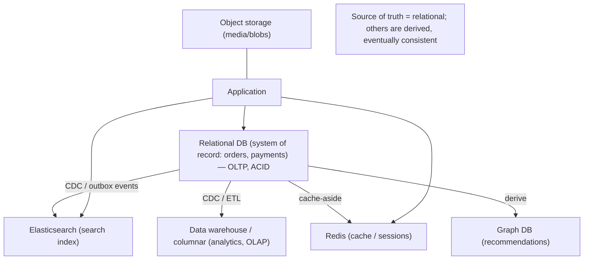
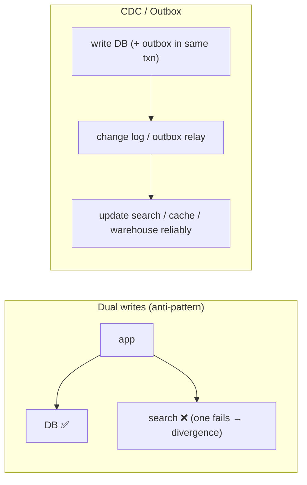

# Lesson 5.1.3 — Polyglot Persistence

> Part 5: Databases · Module 5.1: Data Models · Difficulty: 🟡🔴
>
> **Prerequisites:** [5.1.1 data models], [5.1.2 normalization/denormalization], [2.1.3 bounded contexts], [2.2.3 microservices].
> **Unlocks:** [5.4.1 SQL/NoSQL/NewSQL], [Part 9 CDC/streaming], [Part 12 database-per-service], [Part 18/20 architectures].

---

## 1. Learning Objectives

After this lesson you will be able to:

- Define **polyglot persistence** — using **multiple data stores**, each chosen for the part of the system it best fits — and explain why it arises naturally at scale.
- Identify common **per-subsystem store choices** (relational system-of-record + cache + search + analytics + graph + blob) and the access patterns that justify each.
- Explain the **operational and consistency costs** of multiple stores (more systems to run, keeping them in sync, no cross-store transactions/joins) and how to mitigate them (CDC, the outbox pattern, a clear source of truth).
- Decide **when polyglot is worth it** vs the simplicity of a single (often multi-model) database.

---

## 2. Motivation — One database rarely fits a whole system

5.1.1 established that each data model optimizes for a different access pattern, and 5.1.2 showed that even within one store you trade read vs write. **Polyglot persistence** is the natural conclusion: a non-trivial system has **several different access patterns** — transactional writes, fast key lookups, full-text search, analytics/aggregation, relationship traversal, large-blob storage — and **no single database is best at all of them**. So you use **the right store for each job**: a relational DB for the transactional core, Redis for caching/sessions, Elasticsearch for search, a columnar/warehouse store for analytics, object storage for blobs, maybe a graph DB for recommendations.

The term (coined by Scott Leberknight, popularized by Fowler/Sadalage) captures a practice that became near-universal at scale. It pairs naturally with **microservices** (Part 12): **database-per-service** lets each service pick the store fitting its needs. The payoff is each workload running on a store where it's **easy and fast** instead of contorting one database to do everything.

But polyglot is **not free** (1.1.5): every additional store is **operational burden** (deploy, monitor, back up, secure, staff expertise), and — critically — data spread across stores must be **kept consistent without cross-store transactions or joins**, which introduces eventual consistency and synchronization complexity (Part 9/10). The skill is knowing **when the access-pattern diversity justifies the cost**, and how to keep the stores in sync (CDC, outbox, a clear system of record). This is foundational for real-world architectures (Part 18) and the capstone (Part 20).

---

## 3. Theory — From first principles

### 3.1 What polyglot persistence is

**Polyglot persistence** = using **multiple, different storage technologies within one system/application**, each selected because it's the best fit for a **specific subset of the data or access pattern** `[CS]`. (By analogy to "polyglot programming" — using different languages for different jobs.) Instead of forcing all data into one database, you **decompose by access pattern** and match each to an appropriate store (5.1.1).

### 3.2 Why it arises: diverse access patterns in one system

A typical product has many distinct needs `[CS]`:
- **Transactional core** (orders, payments, inventory) → **relational** (ACID, joins, integrity — 5.1.1/5.2).
- **Caching / sessions / hot lookups** → **key-value** (Redis/Memcached — Part 6).
- **Full-text search / faceted search** → **search engine** (Elasticsearch/OpenSearch — inverted index, Part 18).
- **Analytics / reporting / aggregations** → **columnar / data warehouse** (BigQuery/Redshift/Snowflake — representative) or OLAP store.
- **Time-series / metrics / events** → **wide-column / time-series** (Cassandra, time-series DBs — 5.1.1, Part 16).
- **Relationships / recommendations / fraud** → **graph** (Neo4j — 5.1.1).
- **Large blobs (media, files, backups)** → **object storage** (4.1.3/4.3.2).

No single store is best at all of these; polyglot uses each where it shines.

### 3.3 OLTP vs OLAP — the most common split

The most fundamental polyglot split is **transactional (OLTP) vs analytical (OLAP)** `[CS]`:
- **OLTP** (Online Transaction Processing): many small, fast reads/writes of individual records (the app's operational database — relational/B-tree, 4.2.2).
- **OLAP** (Online Analytical Processing): few large queries scanning/aggregating huge amounts of data (reporting, dashboards, BI) — best served by **columnar** storage (read only needed columns, great compression, sequential scans — 4.1.1) in a **data warehouse**.

Running heavy analytics on the OLTP database **competes with and degrades** the operational workload, so you **separate** them: data flows from OLTP → warehouse via **ETL/ELT** or **CDC streaming** (Part 9). This OLTP/OLAP separation is itself polyglot persistence and is nearly universal.

### 3.4 The big cost: keeping stores in sync

The central challenge of polyglot is that **the same data lives in multiple stores** (e.g., a product is in the relational DB, indexed in Elasticsearch, cached in Redis, replicated to the warehouse), and there are **no cross-store transactions or joins** `[CS]`. So you must:

- **Designate a clear source of truth** (system of record) per piece of data — usually the transactional store. Other stores hold **derived copies** (5.1.2 — denormalized read models, indexes, caches).
- **Propagate changes** from the source of truth to the derived stores. Options:
  - **Dual writes (anti-pattern):** the app writes to two stores directly — **fragile**: if one write succeeds and the other fails, they diverge (no atomicity across stores). Avoid.
  - **Change Data Capture (CDC):** stream the source DB's change log (the WAL — 4.1.2) to update other stores reliably (Part 9). The robust approach.
  - **Outbox pattern:** atomically write the change **and** an event to an "outbox" table in the **same** transaction, then a relay publishes the event to update other stores — guarantees the event iff the data was committed (Part 9/12).
- **Accept eventual consistency** across stores: the search index/cache/warehouse lag the source of truth slightly (Part 10) — bound and surface this.

This is the same "derived copy / keep it fresh" problem as denormalization (5.1.2) and caching (Part 6), now **across databases**.

### 3.5 Polyglot and microservices (database-per-service)

Polyglot persistence is a natural fit for **microservices** (Part 12) `[CONV]`: each service **owns its data** in a **private database** (database-per-service), free to pick the store matching its needs — the order service uses relational, the search service uses Elasticsearch, the session service uses Redis. This enforces **loose coupling** (services interact via APIs, not shared databases — 2.2.3) but **inherits all polyglot costs** plus distributed-data challenges: cross-service queries need **API composition or CQRS**, and cross-service consistency needs **sagas** (Part 11/12). (Conversely, a **shared database** across services is an anti-pattern — re-coupling, 2.2.3.)

### 3.6 The cost side: when one store is better

Polyglot's costs are real `[CS]`:
- **Operational burden:** each store must be deployed, monitored, backed up, secured, upgraded, capacity-planned — and the team needs **expertise** in each.
- **Consistency complexity:** synchronization (CDC/outbox), eventual consistency, and no cross-store transactions/joins.
- **More failure modes:** more systems = more things that can break (Part 11).
- **Cognitive/operational overhead** often **outweighs** the benefit for **small/simple systems**.

So the alternative is a **single, possibly multi-model, database** (5.1.1) — many modern databases support several models (Postgres with JSONB + full-text + arrays; MongoDB with search; databases adding vector/graph capabilities). Using **fewer stores** (or one flexible one) is often the right call early on; introduce polyglot **when a specific access pattern clearly outgrows** the current store (1.1.5).

### 3.7 The decision

Go polyglot when `[BP]`:
- You have **genuinely diverse access patterns** where one store forces painful workarounds (slow search in SQL, analytics degrading OLTP, traversals in relational).
- The **benefit (each workload fast & simple) outweighs the operational cost** of running another store.
- You can **define a clear source of truth** and a **reliable sync mechanism** (CDC/outbox).

Stay single-store when:
- The system is **small/simple**, access patterns are **homogeneous**, or a **multi-model** store covers your needs.
- The team lacks bandwidth/expertise to operate multiple stores reliably.

---

## 4. Visual Intuition

### Right store per job, one source of truth

### Dual writes (bad) vs CDC/outbox (good)

---

## 5. Real-World Analogy

Think of how a serious **professional kitchen** stores ingredients and tools — not everything in one fridge.

- The **walk-in refrigerator** holds the core perishables that must be kept perfectly (the **relational system of record** — accurate, transactional). The **counter mise-en-place** keeps the few things needed *right now* within arm's reach for speed (the **cache**). A **labeled, indexed spice rack** lets you find any seasoning instantly by name (the **search index**). The **dry-goods warehouse** stores bulk in cheap long-term shelving (**object storage / archive**). And the **prep ledger** tallies what's used for the weekly cost report (**analytics warehouse**), kept separate so running reports doesn't tie up the line cooks.
- Using the **right storage for each ingredient** makes the kitchen fast and sane — nobody rummages the walk-in for a pinch of salt mid-service. But it comes with overhead: **more places to stock, clean, and keep in sync**, and a rule that the **walk-in is the truth** — the spice rack and mise-en-place are **copies** restocked *from* it. If a cook "dual-writes" (puts new stock only on the counter and forgets the walk-in), the records diverge. So a runner **continuously restocks the prep stations from the walk-in** (CDC) rather than each cook independently updating two places.
- A **tiny home kitchen** (small system), by contrast, just uses **one fridge and one cabinet** — adding a walk-in, a warehouse, and a spice-indexing system would be absurd overhead. Polyglot earns its keep only when the operation is big and varied enough.

---

## 6. Industry Example

- **OLTP + OLAP separation** `[CS]`: virtually every data-driven company runs operational relational/NoSQL stores **plus** a separate analytics warehouse (BigQuery/Redshift/Snowflake — representative), fed by ETL/ELT or CDC (Part 9) — the most common polyglot split.
- **Search alongside the system of record** `[CONV]`: products/content live in a relational/document store **and** are indexed in **Elasticsearch/OpenSearch** for full-text/faceted search, synced via CDC (Part 18).
- **Cache + DB** `[CONV]`: relational/NoSQL system of record fronted by **Redis/Memcached** for hot reads/sessions (cache-aside — Part 6) — near-universal.
- **Database-per-service in microservices** `[CONV]`: each service owns its store (relational, document, KV, search) and stays decoupled; cross-service data via API composition/CQRS and consistency via sagas (Part 12).
- **CDC / outbox for sync** `[BP]`: Debezium-style CDC and the transactional outbox pattern propagate changes from the source of truth to derived stores reliably (Part 9/12), avoiding fragile dual writes.
- **Big architectures are polyglot** `[CONV]`: large platforms (Part 18) combine relational + wide-column + search + graph + cache + object storage + warehouse — each for its access pattern.

---

## 7. Implementation Details — doing polyglot well

- **Decompose by access pattern** (5.1.1): map each workload (transactional, cache, search, analytics, traversal, blobs) to the store that fits, and justify each store against its operational cost.
- **Define a single source of truth** per datum (usually the transactional store); treat other stores as **derived** (indexes/caches/read models — 5.1.2).
- **Sync via CDC or the outbox pattern, not dual writes** (Part 9/12) — reliable propagation with atomicity at the source; **avoid dual writes** (divergence risk).
- **Separate OLTP from OLAP** — don't run heavy analytics on the operational DB; pipe to a warehouse (ETL/ELT/CDC).
- **Accept and bound eventual consistency** across stores (search/cache/warehouse lag) — make freshness explicit (Part 10).
- **In microservices, use database-per-service** (Part 12); never share a database across services (re-coupling, 2.2.3); handle cross-service queries via composition/CQRS and consistency via sagas (Part 11/12).
- **Weigh multi-model / fewer stores first** — Postgres (JSONB, full-text, arrays) or another flexible store may cover several needs without adding systems (1.1.5).
- **Invest in ops** — monitoring, backups, security, and expertise for **each** store you adopt (Part 14/16).

## 8. Advantages

- **Best-fit performance** — each workload runs on a store optimized for it (fast, simple, natural).
- **Right scaling per workload** — scale search, cache, analytics, and transactional independently (Part 7).
- **Avoids contorting one DB** — no painful workarounds (search in SQL, analytics on OLTP, traversals in relational).
- **Microservice autonomy** — database-per-service decoupling (Part 12).
- **Isolation** — analytics load doesn't degrade the transactional path (OLTP/OLAP split).

## 9. Disadvantages

- **Operational complexity** — many systems to deploy, monitor, back up, secure, upgrade; multiple skill sets needed.
- **Consistency complexity** — no cross-store transactions/joins; sync via CDC/outbox; eventual consistency (Part 9/10).
- **More failure modes** — more moving parts (Part 11).
- **Data duplication** — same data in several shapes (5.1.2) — drift risk if sync is wrong.
- **Higher cost & cognitive load** — often not worth it for small/simple systems.

---

## 10. When NOT to use it

- **Small/simple systems** with homogeneous access patterns — a single (multi-model) database is simpler and sufficient (1.1.5).
- **When a multi-model store covers your needs** (e.g., Postgres for relational + JSON + full-text) — don't add systems you don't need.
- **When the team can't operate multiple stores reliably** — operational burden/expertise gap outweighs benefits.
- **Premature polyglot** — adding stores "for the future" before a real access-pattern need exists.
- **When you can't define a clean source of truth / reliable sync** — you'll get divergence; fix that before going polyglot.

---

## 11. Common Mistakes

1. **Dual writes** — writing to two stores from the app without atomicity → divergence on partial failure (use CDC/outbox).
2. **No clear source of truth** — multiple stores each "authoritative" → contradictory data, impossible reconciliation.
3. **Premature polyglot** — too many stores too early; operational burden with little benefit.
4. **Running analytics on the OLTP DB** — heavy queries degrading the operational workload (separate OLTP/OLAP).
5. **Shared database across microservices** — re-coupling services (anti-pattern, 2.2.3); not true database-per-service.
6. **Ignoring eventual consistency** — treating derived stores (search/cache) as instantly consistent with the source (Part 10).
7. **Underestimating ops** — adopting stores without monitoring/backup/expertise → reliability incidents (Part 14).

---

## 12. Interview Questions

**🟢 Easy**
- What is polyglot persistence, and why do large systems use it?
- Why do companies separate their transactional database from their analytics database (OLTP vs OLAP)?

**🟡 Medium**
- How do you keep data consistent across multiple stores (e.g., a relational DB + Elasticsearch + Redis)? Why are dual writes a bad idea?
- What are the costs of polyglot persistence, and when would you prefer a single multi-model database?

**🔴 Hard**
- Design the data layer for an e-commerce platform with transactional orders, product search, recommendations, session caching, media, and analytics. Choose stores per workload, define the source of truth, and design the sync (CDC/outbox) and consistency (Part 9/10).
- Explain database-per-service in microservices: benefits, and how you handle cross-service queries and consistency without cross-store joins/transactions (API composition, CQRS, sagas — Part 12).

**⚫ Staff+**
- Critique a proposed polyglot architecture: where are the consistency risks, the operational hotspots, and the failure modes? How would you decide whether to consolidate stores?
- Design the change-propagation backbone for a polyglot system at scale (CDC from the system-of-record WAL → search/cache/warehouse/read models), addressing ordering, idempotency, backpressure, and eventual consistency (Part 9/10/11).

---

## 13. Production Pitfalls

- **Store divergence from dual writes:** search index/cache disagreeing with the database after a partial-failure write — stale/incorrect results (use CDC/outbox).
- **Analytics crushing OLTP:** a big reporting query on the operational DB causing latency/locking for users (separate OLAP).
- **Sync lag surprises:** users seeing stale search results or cached data long after an update (unbounded eventual consistency — Part 10).
- **Operational overload:** a small team unable to reliably run/monitor/back up five datastores → outages, data loss (Part 14/11).
- **Shared-DB coupling:** "microservices" sharing one database, so a schema change breaks multiple services (2.2.3).
- **Orphaned/inconsistent derived data:** a CDC pipeline failure silently leaving the search index/warehouse stale (needs monitoring/replay — Part 9).

---

## 14. Optimization Techniques

- **Right store per access pattern** (the core lever) — transactional/relational, cache/KV, search, analytics/columnar, graph, blobs/object (5.1.1).
- **CDC / outbox** for reliable, ordered, idempotent propagation from the source of truth (Part 9/12) — never dual writes.
- **OLTP/OLAP separation** — pipe to a warehouse so analytics scale independently without hurting operations.
- **Cache hot reads** (Part 6) and **materialized read models / CQRS** (5.1.2, Part 12) for fast queries across the polyglot set.
- **Prefer multi-model / fewer stores** until an access pattern clearly justifies a new store (reduce ops cost).
- **Invest in observability** per store (golden signals, sync-lag metrics) and **bound staleness** with freshness SLAs (Part 16/10).

---

## 15. Summary

**Polyglot persistence** is using **multiple data stores, each chosen for the part of the system it best fits** — the natural conclusion of the fact (5.1.1) that no single database is best at every access pattern. A real system has diverse needs — **transactional** writes (relational/ACID), **caching/sessions** (key-value/Redis), **full-text search** (Elasticsearch), **analytics** (columnar warehouse), **time-series/events** (wide-column), **relationship traversal** (graph), and **large blobs** (object storage) — and polyglot uses the **right tool for each job** instead of contorting one database. The most fundamental split is **OLTP vs OLAP** (operational store vs analytics warehouse, fed by ETL/CDC), since heavy analytics would otherwise degrade the transactional path. Polyglot pairs naturally with **microservices** via **database-per-service** (Part 12), enforcing loose coupling. But it is **not free** (1.1.5): each store adds **operational burden** (deploy, monitor, back up, secure, staff expertise) and — critically — the **same data spread across stores must be kept consistent without cross-store transactions or joins**. The discipline that makes it work: designate a **single source of truth** (usually the transactional store), treat other stores as **derived** copies/indexes/read models (5.1.2), and **propagate changes via CDC or the outbox pattern — never fragile dual writes** — accepting bounded **eventual consistency** (Part 10). Go polyglot when **diverse access patterns** genuinely justify the cost and you can define a clean source of truth + reliable sync; otherwise prefer a single, often **multi-model**, database for simplicity. This is the backbone of real-world architectures (Part 18) and the capstone (Part 20), and it closes Module 5.1's logical-modeling arc before we turn to transactions and concurrency (5.2).

---

## 16. Revision Notes (flashcard-ready)

- **Q:** Polyglot persistence? **A:** Using multiple data stores, each chosen for the access pattern/data it best fits.
- **Q:** Why? **A:** No single DB is best at all access patterns (transactional, cache, search, analytics, traversal, blobs).
- **Q:** Most common split? **A:** OLTP (operational) vs OLAP (analytics warehouse), fed by ETL/CDC — keep analytics off the operational DB.
- **Q:** Biggest cost? **A:** Operational burden (many systems) + keeping stores consistent without cross-store transactions/joins.
- **Q:** Source of truth? **A:** One authoritative store per datum; others are derived (indexes/caches/read models).
- **Q:** How to sync stores? **A:** CDC or the outbox pattern (reliable, atomic-at-source) — NOT dual writes (divergence risk).
- **Q:** Polyglot + microservices? **A:** Database-per-service: each service owns its store; never share a DB (re-coupling).
- **Q:** Consistency across stores? **A:** Eventual (derived stores lag the source); bound and surface staleness (Part 10).
- **Q:** When NOT to? **A:** Small/simple/homogeneous systems, multi-model store suffices, or team can't operate many stores.
- **Q:** Alternative to adding a store? **A:** Multi-model database (e.g., Postgres JSONB + full-text) — fewer systems.

---

## 17. Further Reading + Knowledge-Graph Links

**Within this platform**
- **Previous:** [5.1.2 Normalization vs Denormalization]. **Builds on:** [5.1.1 Data Models], [2.1.3 bounded contexts], [2.2.3 microservices]. **Concludes Module 5.1.** **Next:** [5.2.1 ACID] (Module 5.2 — Transactions & Concurrency).
- **Central to:** [Part 12 Microservices] (database-per-service, CQRS, sagas), [Part 9 Messaging] (CDC, outbox, ETL), [Part 18 Real-World Architectures], [Part 20 Capstone].
- **Connects to:** [Part 6 Caching] (cache as derived store), [Part 10 Consistency] (cross-store eventual consistency), [5.4.1 SQL/NoSQL/NewSQL].

**Foundational texts (synthesized)**
- Sadalage & Fowler, *NoSQL Distilled* — polyglot persistence concept and tradeoffs (synthesized).
- Kleppmann, *Designing Data-Intensive Applications* — derived data, CDC, OLTP vs OLAP, keeping systems in sync.
- Richardson, *Microservices Patterns* — database-per-service, outbox, CQRS, sagas (synthesized).

**Concept tags:** `[CS]` polyglot persistence, OLTP vs OLAP, derived data, source of truth · `[CONV]` database-per-service, Elasticsearch+RDBMS, Redis cache, warehouse + CDC, multi-model DBs · `[BP]` CDC/outbox over dual writes, single source of truth, separate OLTP/OLAP, prefer fewer stores until justified.
