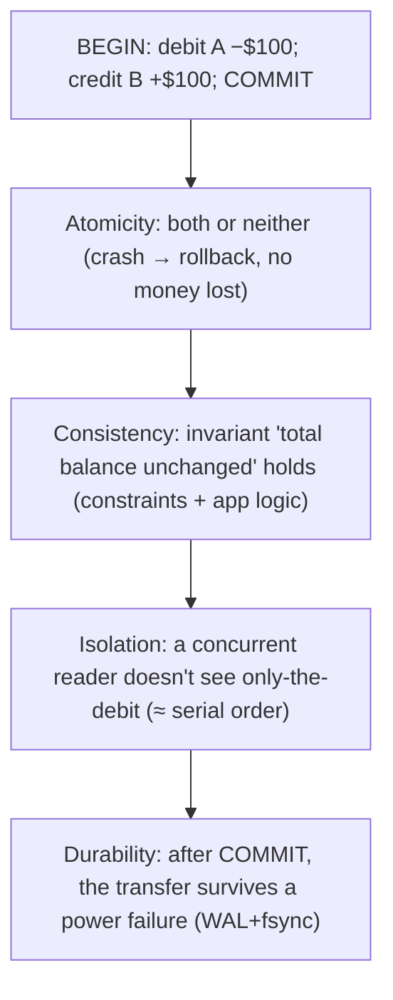
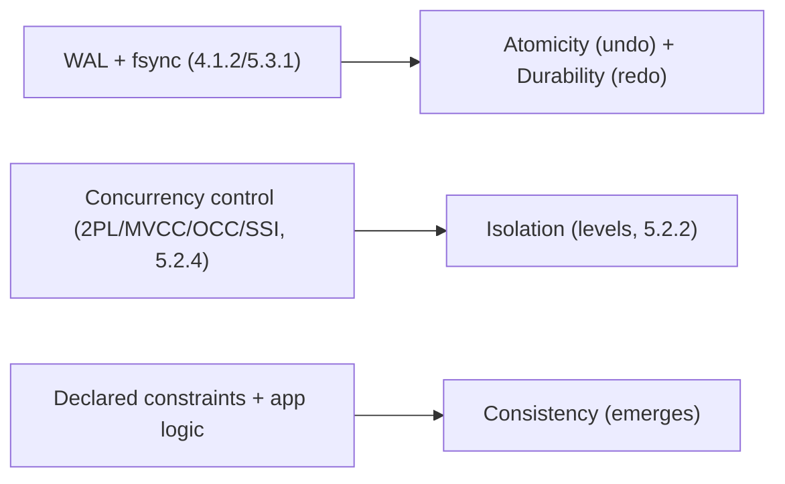

# Lesson 5.2.1 — ACID Precisely Defined

> Part 5: Databases · Module 5.2: Transactions & Concurrency · Difficulty: 🔴
>
> **Prerequisites:** [4.1.2 fsync/WAL durability], [4.2.2 B-trees/WAL], [5.1.1 data models].
> **Unlocks:** [5.2.2 isolation levels], [5.2.3 anomalies], [5.2.4 concurrency control], [5.3.1 recovery], [Part 10 consistency], [Part 11 sagas].

---

## 1. Learning Objectives

After this lesson you will be able to:

- Define a **transaction** and each ACID property — **Atomicity, Consistency, Isolation, Durability** — precisely, and what each does (and does *not*) guarantee.
- Explain that **Isolation is the slippery one** (it's a spectrum of levels, not all-or-nothing — 5.2.2) and that **Consistency** in ACID is partly the application's job.
- Connect ACID to its **implementation mechanisms**: WAL/logging (Atomicity+Durability — 4.1.2/5.3.1), concurrency control (Isolation — 5.2.4), constraints (Consistency).
- Distinguish ACID **transactional consistency** from **distributed-systems consistency** (CAP/replication — Part 10) — same word, different meanings.

---

## 2. Motivation — The guarantee that lets you reason about correctness

Real operations touch multiple pieces of data that must change **together**: transfer money (debit one account, credit another), place an order (decrement inventory, create order, charge payment), book a seat (mark it taken, record the booking). If the system **crashes or interleaves** these steps wrongly, you get corruption — money vanishing, double-booked seats, oversold inventory. **Transactions** with **ACID** properties are the database's promise that groups of operations behave **correctly despite failures and concurrency**, so the application developer can reason about a transaction as a **single, all-or-nothing, isolated, durable unit** instead of worrying about every crash and race.

ACID (coined by Härder and Reuter, building on Gray's work) is one of the most important — and most **misunderstood/abused** — acronyms in computing. "ACID compliant" is a marketing checkbox, but the properties have **precise meanings**, and two of them are subtle: **Isolation** is really a **spectrum** of levels (5.2.2) that most databases *don't* fully enforce by default (for performance), and **Consistency** is partly the *application's* responsibility, not purely the database's. Confusing ACID's transactional **C** with the **C** in CAP (Part 10) is a classic error.

Understanding ACID precisely is the foundation for everything in Module 5.2 (isolation levels, anomalies, concurrency control) and for reasoning about correctness vs performance tradeoffs (weaker isolation = faster but riskier), distributed transactions (Part 11), and the consistency spectrum (Part 10).

---

## 3. Theory — From first principles

### 3.1 What a transaction is

A **transaction** is a **group of one or more operations executed as a single logical unit of work**, with a clear **begin**, and a **commit** (make all effects permanent) or **abort/rollback** (discard all effects) `[CS]`. The point is to bundle reads/writes so the system can give **all-or-nothing** and **isolation** guarantees over the whole group rather than per-operation. ACID describes the four guarantees a transaction provides.

### 3.2 A — Atomicity ("all or nothing")

**Atomicity:** a transaction's operations either **all take effect or none do** `[CS]`. If a transaction is interrupted (crash, error, explicit abort) partway, the database **rolls back** any partial changes — it's as if the transaction never happened. (Note: "atomic" here means **abortability/indivisibility on failure**, *not* "concurrent atomicity" — that's Isolation. The terminology is unfortunately overloaded.)

- **Why it matters:** the money transfer can't debit one account without crediting the other; a partial order can't leave inventory decremented with no order recorded.
- **How it's implemented:** the **write-ahead log** (4.1.2, 5.3.1) — log changes before applying; on crash/abort, **undo** uncommitted changes (and **redo** committed ones). Atomicity lets the application **safely retry** a failed transaction (it knows a failure left no partial mess).

### 3.3 C — Consistency ("preserves invariants")

**Consistency (in ACID):** a transaction takes the database from one **valid state to another valid state**, preserving all defined **invariants/constraints** `[CS]`. Examples of invariants: foreign-key integrity, uniqueness, `balance >= 0`, "credits == debits in a ledger."

The crucial subtlety `[CS]`: ACID's **C is largely the application's responsibility**, not a pure database guarantee. The **database enforces the constraints you declare** (foreign keys, unique, check constraints, not-null) and rolls back violations — but the *meaning* of "valid" (e.g., "every order must have a payment") is defined by the application's logic and the constraints it sets. The database can't know your business invariants unless you express them. So C is the "odd one out" — partly a property that **emerges** from A+I+D plus correctly-written application logic and declared constraints. (Kleppmann notes C arguably doesn't belong with the others.)

This is **not** the same as **CAP/replication consistency** (Part 10), which is about *what value replicas/readers see* in a distributed system — a completely different concept that happens to share the word.

### 3.4 I — Isolation ("concurrent transactions don't interfere")

**Isolation:** concurrently-executing transactions don't **interfere** with each other; the result is **as if** they ran one-at-a-time (**serially**) in some order `[CS]`. The strongest form, **serializability**, guarantees the outcome equals *some* serial execution — so the developer can reason about each transaction **in isolation**, ignoring concurrency.

The catch — and the most important practical point `[CS]`: **full isolation (serializability) is expensive** (it limits concurrency), so most databases offer **weaker isolation levels by default** (read committed, snapshot/repeatable read — 5.2.2) that permit certain **anomalies** (5.2.3) in exchange for performance. So "ACID" in practice usually means **less-than-perfect isolation**, and you must **choose the isolation level** consciously. Isolation is therefore a **spectrum, not a binary** — the entire subject of 5.2.2–5.2.4. It's implemented via **concurrency control**: locking (2PL), MVCC, optimistic concurrency, SSI (5.2.4).

### 3.5 D — Durability ("survives crashes")

**Durability:** once a transaction **commits**, its effects **survive permanently**, even through power loss or crash `[CS]`. A committed transaction's data has reached **stable storage** (4.1.2).

- **How it's implemented:** the **WAL** — write the commit record durably (**fsync** to stable media, often with **group commit**) *before* acknowledging the commit (4.1.2, 5.3.1). On recovery, the log is replayed to restore committed effects. In distributed systems, durability often also means **replication** to other nodes (Part 10/11), since a single disk can fail.
- **The tie to 4.1.2:** durability is exactly the fsync/WAL discipline — and its **cost** (fsync is slow) is why durability has tunable levels (sync vs group commit vs async, with crash-loss windows — RPO, Part 11).

### 3.6 How the four are implemented (summary)

| Property | Guarantee | Mechanism |
|---|---|---|
| **Atomicity** | all-or-nothing; rollback on failure | WAL + undo/redo (5.3.1); enables safe retry |
| **Consistency** | invariants preserved (valid→valid) | declared constraints + app logic (emerges from A+I+D) |
| **Isolation** | concurrent txns don't interfere (≈ serial) | concurrency control: locking/2PL, MVCC, OCC, SSI (5.2.4); **levels** (5.2.2) |
| **Durability** | committed effects survive crashes | WAL + fsync (+ group commit); replication (4.1.2, Part 10/11) |

**A & D are tightly coupled to the log** (4.1.2/5.3.1); **I is the concurrency story** (5.2.2–5.2.4); **C emerges** from the rest + the application.

### 3.7 ACID vs BASE (and the cost of ACID)

The counterpoint `[CONV]`: **BASE** (Basically Available, Soft state, Eventually consistent) describes many NoSQL/distributed stores that **relax ACID** (especially isolation/strong consistency) for **availability and scale** (Part 10). ACID guarantees are **easiest on a single node**; providing them across a distributed/sharded/replicated system is **hard and costly** (distributed transactions, 2PC — Part 11; consensus — Part 8), which is why many large systems chose BASE/eventual consistency (Part 10) — and why **NewSQL** (5.4.1) aims to bring ACID *back* at scale (Spanner/Cockroach — representative). The takeaway: **ACID is a powerful guarantee with a real cost**, strongest where data is co-located, and a key axis of database selection (5.4) and the consistency tradeoffs of Part 10/11.

---

## 4. Visual Intuition

### The four properties on a money transfer

### What implements what

---

## 5. Real-World Analogy

Think of a **bank teller processing a transfer**, governed by strict rules.

- **Atomicity** = the transfer is recorded as **one slip that's either fully processed or torn up**. If the teller is interrupted halfway (fire alarm), they **don't** leave your account debited and the other un-credited — they **void the whole slip** and start over. Money never half-moves.
- **Consistency** = the bank's **rulebook of invariants** ("an account can't go below zero," "every debit has a matching credit") is never violated by a completed transfer. But note: the *rulebook* is written by the bank (the application/constraints) — the teller mechanically enforces the rules they're given; they can't enforce a rule nobody wrote down.
- **Isolation** = if **two tellers** touch your account at the same instant, the result looks **as if they took turns** — you never get a corrupted in-between state from their steps interleaving. (In practice, busy banks use *cheaper* rules that allow some odd-but-tolerable interleavings — the isolation levels of 5.2.2.)
- **Durability** = once you get your **stamped receipt** (commit), the transfer is **permanent** — even if the bank's computers lose power that night, the record was already written into the **ledger in ink** (WAL/fsync), and reconstructed on reopening.

The subtlety mirrors reality: **A and D** are about the **ledger and the all-or-nothing slip**; **I** is about **multiple tellers not stepping on each other**; and **C** is really "the bank's rules stay satisfied," which depends on someone having **written the right rules**.

---

## 6. Industry Example

- **Relational databases are ACID** `[CS]`: Postgres, MySQL/InnoDB, SQL Server, Oracle (representative) provide ACID transactions — A/D via WAL/redo (4.1.2/5.3.1), I via MVCC/locking (5.2.4), C via constraints; the bedrock of financial/transactional systems.
- **Default isolation is usually weaker than serializable** `[CONV]`: most databases default to **Read Committed** (Postgres/Oracle) or **Repeatable Read** (MySQL/InnoDB), *not* serializable — so "ACID" in practice allows some anomalies unless you raise the level (5.2.2/5.2.3).
- **NoSQL/BASE relaxes ACID** `[CONV]`: early Dynamo-lineage and many NoSQL stores chose availability/scale over strong ACID (eventual consistency — Part 10); some have since added transactions (e.g., MongoDB multi-document transactions).
- **NewSQL brings ACID to scale** `[CONV]`: Google Spanner, CockroachDB, YugabyteDB (representative) provide distributed ACID transactions using consensus + clever clocks (5.4.1, Part 8/10) — at real coordination cost.
- **Durability tuning in the wild** `[BP]`: databases expose durability knobs (synchronous commit on/off, group commit) trading the crash-loss window (RPO) for throughput (4.1.2, Part 11).

---

## 7. Implementation Details — using ACID correctly

- **Use transactions to bundle operations that must succeed/fail together** (transfers, multi-row writes, order placement) — get atomicity + isolation over the whole unit.
- **Declare your invariants as constraints** (foreign keys, unique, check, not-null) so the database enforces **Consistency** — don't rely solely on app code (defense in depth).
- **Choose the isolation level consciously** (5.2.2): know your database's **default** (often Read Committed/Repeatable Read, not serializable) and raise it where correctness needs it (e.g., serializable for critical invariants), accepting the performance cost.
- **Design for safe retries:** atomicity means a failed transaction left no partial state, so transient failures can be retried — make operations **idempotent** where retries cross system boundaries (Part 11).
- **Tune durability to data value** (4.1.2): synchronous commit for systems of record; relaxed/async only for low-value/derivable data (with a known crash-loss window — RPO).
- **Keep transactions short** — long transactions hold locks/MVCC versions, hurting concurrency and causing bloat/deadlocks (5.2.4/5.2.5).
- **Don't assume ACID across services/stores** — cross-service consistency needs **sagas / distributed transactions** (Part 11/12), not local ACID.

## 8. Advantages (of ACID transactions)

- **Reason about correctness simply** — treat a transaction as one all-or-nothing, isolated, durable unit; the DB handles crashes/concurrency.
- **Safe failure handling + retries** (atomicity) — no partial-update corruption.
- **Enforced data integrity** (consistency via constraints).
- **Concurrency correctness** (isolation) without hand-rolled locking.
- **Crash/power-loss safety** (durability) — committed data persists.

## 9. Disadvantages / costs

- **Performance cost** — isolation (locking/MVCC) limits concurrency; durability (fsync) adds latency; strong guarantees reduce throughput.
- **Hard to scale across nodes** — distributed ACID needs 2PC/consensus (coordination latency, blocking — Part 11/8); easiest on a single node.
- **Isolation is subtle** — defaults are weaker than serializable, allowing anomalies many developers don't realize (5.2.3).
- **C is partly on you** — undeclared invariants aren't enforced.
- **Long transactions hurt** — lock contention, deadlocks, version bloat (5.2.4/5.2.5).

---

## 10. When NOT to rely on (full) ACID

- **Massive-scale / high-availability distributed workloads** where the coordination cost of strong ACID is prohibitive → **BASE/eventual consistency** (Part 10) may be the right tradeoff (e.g., write-heavy wide-column — 5.1.1).
- **Cross-service operations in microservices** — there's no local ACID across services; use **sagas** (eventual, compensating — Part 11/12).
- **Analytics/append-only/derivable data** — weaker durability/isolation may be fine; don't pay full ACID cost.
- **When weaker isolation suffices** — don't default to serializable everywhere (performance); use the **lowest level that preserves your invariants** (5.2.2).
- ACID remains the right default for **systems of record / financial / transactional correctness**.

---

## 11. Common Mistakes

1. **Treating "ACID" as binary/marketing** — not realizing the **default isolation is weaker than serializable**, so anomalies are still possible (5.2.2/5.2.3).
2. **Confusing ACID's C with CAP's C** — different concepts (invariants vs replica visibility — Part 10).
3. **Relying on app code for invariants** instead of declaring constraints — bugs let invalid data in (Consistency is partly yours).
4. **Assuming local ACID extends across services/stores** — it doesn't; need sagas/distributed transactions (Part 11/12).
5. **Long-running transactions** — holding locks/versions → contention, deadlocks, bloat (5.2.4/5.2.5).
6. **Ignoring the durability knob** — silently running async/relaxed durability and being surprised by crash data loss (4.1.2, RPO).
7. **Not making cross-boundary retries idempotent** — atomicity enables retry, but external effects (emails, payments) can duplicate (Part 11).

---

## 12. Interview Questions

**🟢 Easy**
- What does each letter of ACID mean?
- What's the difference between atomicity and durability?

**🟡 Medium**
- Why is Consistency (the C in ACID) considered partly the application's responsibility?
- Why don't most databases run at serializable isolation by default? What's the tradeoff?

**🔴 Hard**
- Explain how a database implements atomicity and durability with a write-ahead log, including crash recovery (link 4.1.2/5.3.1).
- Distinguish ACID's "Consistency" from CAP's "Consistency." Why is conflating them a problem (Part 10)?

**⚫ Staff+**
- Discuss the cost of providing ACID in a single node vs a distributed/sharded system, and how NewSQL (Spanner/Cockroach) achieves distributed ACID. What are the tradeoffs vs BASE (Part 8/10/11)?
- Design transaction boundaries and isolation choices for a financial ledger: which invariants are constraints, which isolation level, how durability is tuned, and how cross-service operations stay correct (sagas) — defend every choice (Part 11/20).

---

## 13. Production Pitfalls

- **Anomalies under default isolation:** assuming "ACID" prevents all races, then hitting lost updates / write skew at Read Committed/Repeatable Read (5.2.3).
- **Crash data loss from relaxed durability:** async commit set "for performance" widening the RPO window unknowingly (4.1.2, Part 11).
- **Invariant violations from missing constraints:** invalid data because the rule lived only in (buggy) app code, not as a DB constraint.
- **Deadlocks / lock contention from long transactions:** throughput collapse and aborted transactions under load (5.2.5).
- **Cross-service "transaction" assumptions:** expecting atomicity across microservices and getting partial failures/inconsistency (no saga — Part 12).
- **Scaling wall:** distributed ACID (2PC) latency/blocking degrading availability at scale (Part 11).

---

## 14. Optimization Techniques

- **Pick the lowest isolation level that preserves your invariants** (5.2.2) — don't pay for serializable everywhere; raise it only where needed.
- **Declare constraints** for integrity (let the DB enforce C) and keep transactions **short** to reduce contention/deadlocks (5.2.4/5.2.5).
- **Tune durability to data value** (sync vs group commit vs async; RPO) — group commit amortizes fsync (4.1.2).
- **Use idempotency + safe retries** leveraging atomicity for transient failures (Part 11).
- **Choose ACID vs BASE per workload** (5.4/Part 10) — strong ACID for systems of record, eventual consistency where scale/availability dominate.
- **For cross-service correctness, use sagas/outbox** (Part 11/12) rather than forcing distributed ACID where it's too costly.

---

## 15. Summary

A **transaction** groups operations into a single logical unit with a **commit** or **rollback**, and **ACID** is the database's promise about how that unit behaves under failure and concurrency — letting developers reason about correctness simply. **Atomicity** = all-or-nothing (partial work is rolled back; implemented via the **WAL** undo/redo, and it enables **safe retries**). **Consistency** = invariants are preserved (valid state → valid state), but it's **partly the application's job**: the database enforces the **constraints you declare** (foreign keys, unique, check) plus correct app logic, and C largely **emerges** from A+I+D — and it is **not** the same as CAP's consistency (Part 10). **Isolation** = concurrent transactions don't interfere, ideally as if run **serially** (serializability) — but full isolation is **expensive**, so databases default to **weaker levels** (read committed, repeatable read) that permit certain **anomalies** (5.2.3) for performance, making isolation a **spectrum you must choose** (5.2.2), implemented by **concurrency control** (2PL/MVCC/OCC/SSI — 5.2.4). **Durability** = committed effects survive crashes, implemented by the **WAL + fsync** (4.1.2, with group commit and tunable strictness/RPO) and, in distributed systems, **replication** (Part 10/11). A and D are the **logging** story; I is the **concurrency** story; C **emerges** from the rest plus declared invariants. ACID is a powerful guarantee with a **real cost** — easiest on a single node, hard and expensive across distributed/sharded systems (hence **BASE/eventual consistency** in many NoSQL stores, and **NewSQL** efforts to restore ACID at scale — 5.4.1, Part 8/10/11). Mastering ACID precisely — especially that **isolation is weaker-than-serializable by default** and **C is partly yours** — is the foundation for isolation levels, anomalies, and concurrency control in the rest of Module 5.2, and for the consistency/correctness tradeoffs throughout Parts 10–11.

---

## 16. Revision Notes (flashcard-ready)

- **Q:** What is a transaction? **A:** A group of operations executed as one all-or-nothing logical unit (commit or rollback).
- **Q:** Atomicity? **A:** All operations take effect or none do; partial work rolled back (WAL undo) — enables safe retry.
- **Q:** Consistency (ACID)? **A:** Invariants preserved (valid→valid); **partly the app's job** (declared constraints + logic); NOT CAP's consistency.
- **Q:** Isolation? **A:** Concurrent transactions don't interfere; ideal = serializable (as if serial); a **spectrum of levels** (5.2.2), usually weaker by default.
- **Q:** Durability? **A:** Committed effects survive crashes; via WAL + fsync (+ replication in distributed).
- **Q:** Which letters does the WAL implement? **A:** Atomicity (undo) + Durability (redo) — the log (4.1.2/5.3.1).
- **Q:** Which is implemented by concurrency control? **A:** Isolation (2PL/MVCC/OCC/SSI — 5.2.4).
- **Q:** Why is C "the odd one out"? **A:** It largely emerges from A+I+D + correct app logic/constraints; the DB only enforces declared invariants.
- **Q:** ACID vs BASE? **A:** ACID = strong guarantees (costly, easiest single-node); BASE = relax consistency/isolation for availability/scale (Part 10).
- **Q:** Default isolation reality? **A:** Most DBs default below serializable (Read Committed / Repeatable Read) → some anomalies possible (5.2.3).

---

## 17. Further Reading + Knowledge-Graph Links

**Within this platform**
- **Builds on:** [4.1.2 fsync/WAL], [4.2.2 B-trees/WAL], [5.1.1 data models]. **Next:** [5.2.2 Isolation Levels] → [5.2.3 Anomalies] → [5.2.4 Concurrency Control] → [5.2.5 Locking/Deadlocks].
- **Implemented by:** [5.3.1 WAL/recovery (ARIES)]. **Contrasts with:** [Part 10 Consistency/CAP] (different "consistency"). **Scaled by:** [5.4.1 NewSQL], [Part 11 distributed transactions/sagas], [Part 8 consensus].

**Foundational texts (synthesized)**
- Härder & Reuter (ACID), Gray & Reuter, *Transaction Processing* — transaction concepts (synthesized).
- Kleppmann, *Designing Data-Intensive Applications* — ACID precisely, the weakness of "consistency," isolation as a spectrum.
- Silberschatz et al., *Database System Concepts* — transactions, recovery, concurrency control.

**Concept tags:** `[CS]` transaction, atomicity/consistency/isolation/durability, serializability, WAL-implemented A+D · `[CONV]` default isolation < serializable, ACID vs BASE, NewSQL distributed ACID · `[BP]` declare constraints for C, choose isolation consciously, tune durability to data value, keep transactions short.
