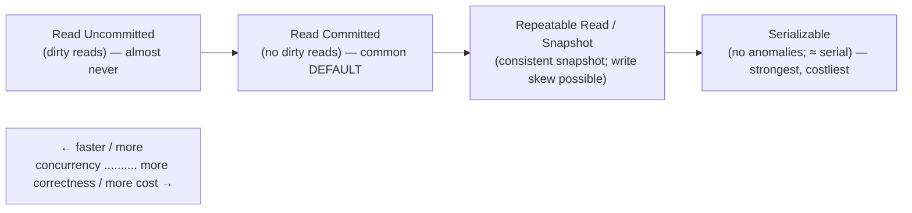
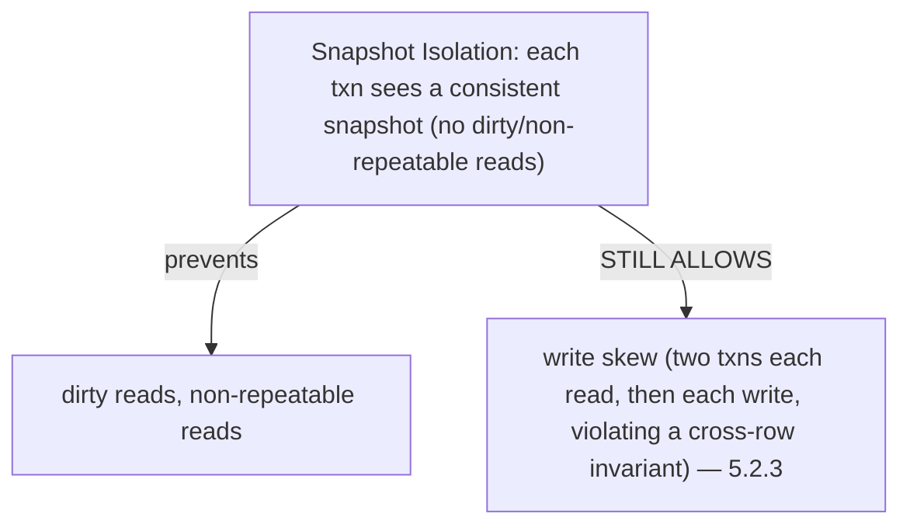

# Lesson 5.2.2 — Isolation Levels: Read Committed, Snapshot/Repeatable Read, Serializable

> Part 5: Databases · Module 5.2: Transactions & Concurrency · Difficulty: 🔴
>
> **Prerequisites:** [5.2.1 ACID], [5.1.1 data models].
> **Unlocks:** [5.2.3 anomalies], [5.2.4 concurrency control], [Part 10 consistency], [Part 17 performance].

---

## 1. Learning Objectives

After this lesson you will be able to:

- Explain why **isolation is a spectrum** (a tradeoff between correctness and concurrency/performance) rather than all-or-nothing.
- Define the standard isolation levels — **Read Uncommitted, Read Committed, Repeatable Read / Snapshot Isolation, Serializable** — and which anomalies each prevents.
- Know the **defaults** of common databases and why they're usually **weaker than serializable**.
- Choose the **right isolation level** for a given operation: the weakest level that still preserves your invariants.

---

## 2. Motivation — "ACID" doesn't mean "fully isolated"

5.2.1 revealed the trap: the **I** in ACID is a **spectrum**, and almost every database runs **below** full serializability **by default** — because serializable isolation is expensive (it limits how many transactions can run concurrently). The result is that real "ACID" databases permit certain **concurrency anomalies** (5.2.3) unless you explicitly raise the isolation level. Developers who assume "we use a transactional database, so concurrency is handled" ship subtle, intermittent, hard-to-reproduce bugs: lost updates, double-spends, inconsistent reads — exactly the failures that surface only under load.

The **isolation level** is the knob that trades **correctness for concurrency/performance**: stronger levels prevent more anomalies but allow less concurrency (more locking/aborts/overhead); weaker levels are faster but expose you to races. The skill is choosing, *per transaction*, the **weakest level that still preserves your invariants** — and knowing what your database's default actually guarantees (the SQL-standard names are notoriously inconsistent across vendors).

This lesson defines the levels precisely; 5.2.3 enumerates the anomalies they prevent/allow; 5.2.4 explains the mechanisms (locking/MVCC) that implement them. Together they let you reason about concurrency correctness — central to financial systems, inventory, bookings, and anything with contended writes (Part 17, Part 10).

---

## 3. Theory — From first principles

### 3.1 Why levels exist: the correctness/concurrency tradeoff

Perfect isolation (**serializability** — transactions behave as if run one-at-a-time) is the easiest to reason about but **limits concurrency**: enforcing it requires extensive locking or abort-and-retry, reducing throughput `[CS]`. Since many applications can tolerate *some* anomalies, the SQL standard defines **weaker isolation levels** that allow more concurrency by permitting specific anomalies. So isolation is a **dial**: turn it up for correctness, down for performance (1.1.5). The levels are traditionally defined by **which anomalies they prevent** (5.2.3).

### 3.2 The standard levels (weakest → strongest)

The four ANSI SQL isolation levels, defined by the anomalies they forbid `[CS]`:

**1. Read Uncommitted (weakest)**
- Allows **dirty reads** — a transaction can read **uncommitted** changes from another transaction that might still roll back.
- Almost never useful (you can read data that never officially existed); rarely used in practice.

**2. Read Committed**
- **Prevents dirty reads** — you only read **committed** data.
- But allows **non-repeatable reads** (read the same row twice in one transaction, get different values because another committed in between) and **phantoms** and **lost updates**.
- The **most common default** (Postgres, Oracle, SQL Server default). A good balance for many workloads.

**3. Repeatable Read / Snapshot Isolation**
- **Prevents dirty reads and non-repeatable reads** — within a transaction, you see a **consistent snapshot**; rows you read don't change under you.
- **Snapshot Isolation (SI)** (the common MVCC implementation — 5.2.4) gives each transaction a consistent snapshot of the database **as of its start**. Strong and performant (readers don't block writers).
- Classically still allows **phantoms** (new rows matching a range query appearing) and, importantly, **write skew** (a subtle anomaly SI does *not* prevent — 5.2.3). *(Note: MySQL/InnoDB's "Repeatable Read" is its default and uses MVCC snapshots; SQL-standard naming vs real implementations differ.)*

**4. Serializable (strongest)**
- **Prevents all anomalies** — the result is equivalent to **some serial execution** of the transactions. The only level that lets you ignore concurrency entirely.
- Implemented via **strict two-phase locking (S2PL)**, **Serializable Snapshot Isolation (SSI)** (Postgres — optimistic, detects conflicts and aborts), or actual serial execution (5.2.4). Costs: reduced concurrency, more aborts/retries, or more locking.

### 3.3 Levels vs anomalies (the standard table)

| Level | Dirty read | Non-repeatable read | Phantom | (Lost update / Write skew*) |
|---|---|---|---|---|
| **Read Uncommitted** | possible | possible | possible | possible |
| **Read Committed** | prevented | possible | possible | possible |
| **Repeatable Read / Snapshot** | prevented | prevented | possible** | write skew possible* |
| **Serializable** | prevented | prevented | prevented | prevented |

\* The ANSI table predates a full understanding; **lost update** and **write skew** (5.2.3) are key anomalies the simple table omits, and **Snapshot Isolation specifically allows write skew** — a famous gap. \** Some implementations of repeatable read/SI also prevent phantoms in practice. Vendor behavior varies — **always check your database's actual semantics**.

### 3.4 The naming/implementation mess (a critical caveat)

The SQL standard defined levels by anomalies, but `[CS]`:
- **Vendors implement them differently** and use the same names for different guarantees. MySQL/InnoDB **Repeatable Read** ≠ Postgres **Repeatable Read** (which is actually Snapshot Isolation) ≠ the SQL standard.
- "**Repeatable Read**" in many systems means **Snapshot Isolation**, which has the **write-skew** gap.
- Some databases' "Serializable" historically wasn't truly serializable.

**Practical rule:** don't trust the **name** — **read your specific database's documentation** for what each level actually prevents, and test critical concurrency paths. (This vendor inconsistency is itself an important thing to know.)

### 3.5 Defaults are weaker than serializable — and why

Most databases default to **Read Committed** or **Repeatable Read/Snapshot**, **not Serializable** `[CONV]`, because:
- Serializable reduces concurrency (locking/aborts) → lower throughput, more contention/retries (Part 17).
- Many workloads' invariants survive weaker isolation, so the performance gain is "free" for them.

The consequence (the key takeaway): **by default, your transactions are NOT fully isolated**, and anomalies like **lost updates** and **write skew** (5.2.3) are possible. You must **opt in** to stronger isolation (or use explicit locking / atomic operations — 5.2.4) where your invariants require it.

### 3.6 Choosing a level (the decision)

The rule `[BP]`: **use the weakest isolation level that still preserves your invariants** — strongest where correctness demands it, weaker where performance matters and anomalies are tolerable. Practically:
- **Read Committed** (default) is fine for many read-mostly or independent-write workloads.
- **Snapshot/Repeatable Read** for transactions needing a **stable view** (reports, multi-read consistency) — but beware **write skew** on invariants spanning multiple rows.
- **Serializable** for **critical invariants** under concurrent writes (financial correctness, "exactly one winner," constraint across rows) where you can't tolerate any anomaly — accept the performance cost (and design for retries, since SSI aborts conflicting transactions).
- Alternatively, **handle specific races explicitly** at a lower level: `SELECT ... FOR UPDATE` (pessimistic lock), atomic operations (`UPDATE ... SET x = x + 1`), or optimistic version checks (5.2.4) — often cheaper than blanket serializable.

---

## 4. Visual Intuition

### The isolation dial

### Snapshot isolation's gap

---

## 5. Real-World Analogy

Think of **multiple editors working on a shared document**, with different "track changes" policies.

- **Read Uncommitted** = you can see another editor's **half-typed, unsaved sentence** — which they might delete a second later. You might act on text that never really existed (dirty read). Reckless.
- **Read Committed** = you only see **saved** edits — but if you read a paragraph, look away, and read it again, it might have **changed** because someone saved in between (non-repeatable read). No phantom protection either.
- **Repeatable Read / Snapshot** = when you start working, you get a **frozen photocopy** of the document as it was at that moment; nothing you've read changes under you for your whole session. Consistent and pleasant — but two editors working off **separate frozen copies** can each make individually-valid edits that **together break a rule** (e.g., both remove the "last remaining" on-call doctor because each copy still showed the other present — that's **write skew**).
- **Serializable** = the system **forces a true order** — it's as if editors took strict turns; no combination of their edits can ever break a rule. Safest, but they **wait for each other** (or get told "someone else changed this, redo your edit") — slower and more conflict-handling.

The lesson mirrors databases: most teams run on the **"only see saved edits"** or **"frozen photocopy"** policy by default (fast, usually fine), and only escalate to **strict turns** (serializable) for the rules they truly cannot let slip.

---

## 6. Industry Example

- **Default levels** `[CONV]`: Postgres/Oracle/SQL Server default to **Read Committed**; MySQL/InnoDB defaults to **Repeatable Read** (MVCC snapshot). None default to serializable — confirming "ACID ≠ fully isolated by default" (5.2.1).
- **Snapshot Isolation via MVCC** `[CS]`: Postgres, Oracle, SQL Server (snapshot mode), MySQL/InnoDB use **MVCC** (5.2.4) so readers see a consistent snapshot without blocking writers — the dominant modern implementation of repeatable-read-class isolation.
- **Serializable Snapshot Isolation (SSI)** `[CS]`: Postgres's `SERIALIZABLE` uses **SSI** — optimistic, tracks read/write dependencies and **aborts** transactions that would break serializability (so apps must **retry**), giving true serializability with better concurrency than strict locking.
- **Write-skew gap is real** `[CONV]`: the SI write-skew anomaly (5.2.3) has caused real bugs (e.g., double-booking, on-call constraint violations) in systems running at snapshot isolation — a classic interview/postmortem topic.
- **Vendor naming differences** `[CONV]`: MySQL "Repeatable Read" vs Postgres "Repeatable Read" behave differently — a well-known footgun (§3.4).

---

## 7. Implementation Details — choosing & setting isolation

- **Know your database's default and actual semantics** (§3.4) — read the docs; the SQL-standard name doesn't tell you what's prevented. Test critical concurrency paths.
- **Use the weakest level that preserves your invariants** (§3.6): Read Committed for many workloads; Snapshot/Repeatable Read for consistent multi-read views; **Serializable for critical invariants** under concurrent writes.
- **For specific races, prefer targeted tools over blanket serializable** (5.2.4): `SELECT ... FOR UPDATE` (lock the row), **atomic updates** (`SET balance = balance - 100 WHERE balance >= 100`), or **optimistic version/CAS** checks — often cheaper and clearer.
- **If using Serializable/SSI, implement retry logic** — conflicting transactions are **aborted** and must be retried (with backoff); design for it (Part 11).
- **Beware write skew at Snapshot/Repeatable Read** (5.2.3) — invariants spanning multiple rows (e.g., "at least one X") are *not* protected; use serializable or explicit locking/materializing the conflict.
- **Keep transactions short** to limit lock/snapshot duration and conflict/abort rates (5.2.4/5.2.5, Part 17).
- **Set isolation per transaction** where supported (not just globally) — raise it only for the transactions that need it.

## 8. Advantages (of the level system)

- **Tunable correctness vs performance** — pick concurrency vs safety per workload (1.1.5).
- **Higher concurrency at weaker levels** — better throughput for workloads that tolerate some anomalies (Part 17).
- **Strong guarantees available when needed** — serializable lets you ignore concurrency for critical paths.
- **MVCC snapshot levels** — consistent reads without blocking writers (great for read-heavy + reporting).

## 9. Disadvantages / costs

- **Weaker defaults expose anomalies** — lost updates, write skew, etc. that surprise developers (5.2.3).
- **Serializable is expensive** — reduced concurrency, more locking or aborts/retries (Part 17).
- **Vendor naming/behavior inconsistency** — same level name, different guarantees (§3.4) → portability and reasoning hazards.
- **Snapshot isolation's write-skew gap** — a subtle, dangerous hole many don't anticipate.
- **Cognitive load** — choosing correctly requires understanding anomalies (5.2.3) and your DB's semantics.

---

## 10. When NOT to use each

- **Don't use Read Uncommitted** in practice (dirty reads are almost always wrong).
- **Don't default everything to Serializable** — the performance/abort cost is unnecessary where invariants survive weaker levels; use it surgically.
- **Don't rely on Snapshot/Repeatable Read for cross-row invariants** vulnerable to write skew (use serializable or explicit locks — 5.2.3).
- **Don't assume the default protects you** — Read Committed allows lost updates/non-repeatable reads; add explicit handling for contended writes (5.2.4).
- **Don't trust the level name across databases** — verify actual semantics.

---

## 11. Common Mistakes

1. **Assuming the database default = full isolation** → lost updates / write skew in production under concurrency (5.2.3).
2. **Trusting the level's name** instead of the database's real behavior (MySQL vs Postgres "Repeatable Read") (§3.4).
3. **Running everything at Serializable** "to be safe" → contention, aborts, throughput collapse (over-correction).
4. **Snapshot isolation + cross-row invariant** → write skew (e.g., both doctors go off-call) — not preventing it (5.2.3).
5. **No retry logic with SSI/Serializable** → unhandled serialization-failure aborts surfacing as errors.
6. **Read-modify-write without protection** at Read Committed → lost update (use atomic update / `FOR UPDATE` / optimistic check — 5.2.4).
7. **Long transactions at high isolation** → lock/snapshot contention, deadlocks, bloat (5.2.5, Part 17).

---

## 12. Interview Questions

**🟢 Easy**
- List the four standard isolation levels from weakest to strongest.
- What does Read Committed prevent and allow?

**🟡 Medium**
- Why don't databases run at Serializable by default? What's the tradeoff?
- What is Snapshot Isolation, and what well-known anomaly does it *not* prevent?

**🔴 Hard**
- Walk through choosing isolation levels for a banking transfer, an inventory decrement, and a report. Justify each and mention alternatives (FOR UPDATE, atomic updates, optimistic checks).
- Explain why isolation-level names are unreliable across databases, with a concrete example, and how you'd verify behavior.

**⚫ Staff+**
- Explain Serializable Snapshot Isolation (SSI): how it gives true serializability optimistically, why transactions get aborted, and how applications must adapt (retries). Compare with strict 2PL (5.2.4).
- Design the concurrency-correctness strategy for a booking system (no double-booking) at scale: isolation level vs explicit locking vs uniqueness constraints vs optimistic concurrency — defend the tradeoffs (Part 17, write skew).

---

## 13. Production Pitfalls

- **Lost-update bug:** read-modify-write at Read Committed under concurrency (e.g., two requests incrementing the same counter/balance) silently losing updates (5.2.3) — fix with atomic update / locking / optimistic check.
- **Write-skew incident:** snapshot isolation allowing two transactions to jointly violate an invariant (double-booking, both-go-off-call) — needs serializable or explicit conflict materialization.
- **Throughput collapse from over-isolation:** blanket Serializable causing lock contention or abort storms under load (Part 17).
- **Unhandled serialization failures:** SSI aborts not retried → user-facing errors during contention.
- **Portability surprise:** moving between MySQL and Postgres and getting different concurrency behavior at the "same" level (§3.4).
- **Deadlocks from long high-isolation transactions** (5.2.5).

---

## 14. Optimization Techniques

- **Right level per transaction** — weakest that preserves invariants; reserve Serializable for critical paths (1.1.5, Part 17).
- **Targeted concurrency control** instead of blanket high isolation: **atomic updates**, `SELECT ... FOR UPDATE`, **optimistic version/CAS** (5.2.4) — cheaper and precise.
- **MVCC snapshot reads** for read-heavy/reporting consistency without blocking writers.
- **Short transactions** + retry-on-abort (backoff) for SSI/serializable to cut contention (5.2.5, Part 11).
- **Uniqueness/constraints** to enforce invariants the DB can check cheaply (e.g., unique index to prevent double-booking) — often better than high isolation.
- **Verify and test** actual isolation semantics under concurrency (don't assume from the name).

---

## 15. Summary

The **I** in ACID (5.2.1) is a **spectrum**: stronger isolation prevents more concurrency **anomalies** (5.2.3) but allows less concurrency (more locking/aborts), so it's a **correctness-vs-performance dial**. The standard levels, weakest→strongest: **Read Uncommitted** (allows **dirty reads** — almost never used); **Read Committed** (no dirty reads, but allows non-repeatable reads, phantoms, lost updates — the **common default**); **Repeatable Read / Snapshot Isolation** (a consistent **snapshot**: no dirty or non-repeatable reads, typically via MVCC, but classically allows **phantoms** and notably **write skew**); and **Serializable** (prevents **all** anomalies — equivalent to some serial order — via strict 2PL, **SSI**, or serial execution, at the cost of concurrency/aborts). Two practical truths dominate: (1) **databases default below serializable** (Read Committed or Repeatable Read/Snapshot), so **your transactions are NOT fully isolated by default** and anomalies like lost updates and write skew are possible unless you opt up or handle them explicitly; and (2) **the level names are unreliable across vendors** (MySQL ≠ Postgres "Repeatable Read"; "Repeatable Read" often means Snapshot Isolation with its write-skew gap) — so **read your database's actual semantics and test**. The decision rule is to use the **weakest level that still preserves your invariants**, escalating to **Serializable for critical invariants** under concurrent writes (with retry logic for SSI aborts) or, often more cheaply, handling specific races with **targeted tools** — atomic updates, `SELECT ... FOR UPDATE`, optimistic version checks, or uniqueness constraints (5.2.4). This sets up the precise catalog of anomalies (5.2.3) and the concurrency-control mechanisms (5.2.4) that implement these guarantees.

---

## 16. Revision Notes (flashcard-ready)

- **Q:** Why do isolation levels exist? **A:** Serializability limits concurrency; weaker levels trade some anomalies for performance (a dial).
- **Q:** Four levels weakest→strongest? **A:** Read Uncommitted → Read Committed → Repeatable Read/Snapshot → Serializable.
- **Q:** Read Committed guarantees? **A:** No dirty reads; allows non-repeatable reads, phantoms, lost updates. Common default.
- **Q:** Snapshot Isolation? **A:** Consistent snapshot as of txn start (MVCC); no dirty/non-repeatable reads; **allows write skew**.
- **Q:** Serializable? **A:** Prevents all anomalies; equivalent to some serial order (S2PL / SSI / serial execution); costliest.
- **Q:** Default reality? **A:** Most DBs default to Read Committed or Repeatable Read — NOT serializable; you're not fully isolated by default.
- **Q:** Naming caveat? **A:** Level names differ across vendors (MySQL vs Postgres "Repeatable Read"); read actual semantics.
- **Q:** SI's famous gap? **A:** Write skew (cross-row invariant violated by two snapshot transactions).
- **Q:** Choosing rule? **A:** Weakest level that preserves invariants; serializable only for critical paths.
- **Q:** Cheaper alternatives to high isolation? **A:** Atomic updates, SELECT...FOR UPDATE, optimistic version/CAS, uniqueness constraints.

---

## 17. Further Reading + Knowledge-Graph Links

**Within this platform**
- **Previous:** [5.2.1 ACID]. **Next:** [5.2.3 Anomalies] (the anomalies these levels prevent/allow) → [5.2.4 Concurrency Control] (how levels are implemented) → [5.2.5 Locking/Deadlocks].
- **Connects to:** [Part 10 Consistency] (isolation vs distributed consistency — linearizability vs serializability, 10.6), [Part 17 Performance] (contention, aborts), [Part 11] (retry on abort).

**Foundational texts (synthesized)**
- Kleppmann, *Designing Data-Intensive Applications* — isolation levels, snapshot isolation, write skew, SSI, serializability.
- Berenson et al., "A Critique of ANSI SQL Isolation Levels" (synthesized) — why the ANSI table is incomplete.
- Database documentation (Postgres, MySQL/InnoDB) for actual level semantics — representative.

**Concept tags:** `[CS]` isolation levels (RU/RC/RR-SI/Serializable), snapshot isolation, serializability, SSI · `[CONV]` default Read Committed/Repeatable Read, vendor naming differences, MVCC snapshots · `[BP]` weakest level preserving invariants, targeted concurrency control, verify actual semantics, retry on serialization failure.
