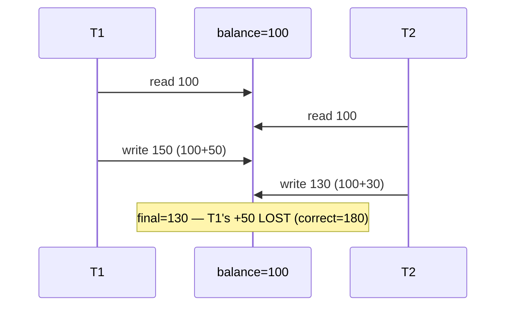
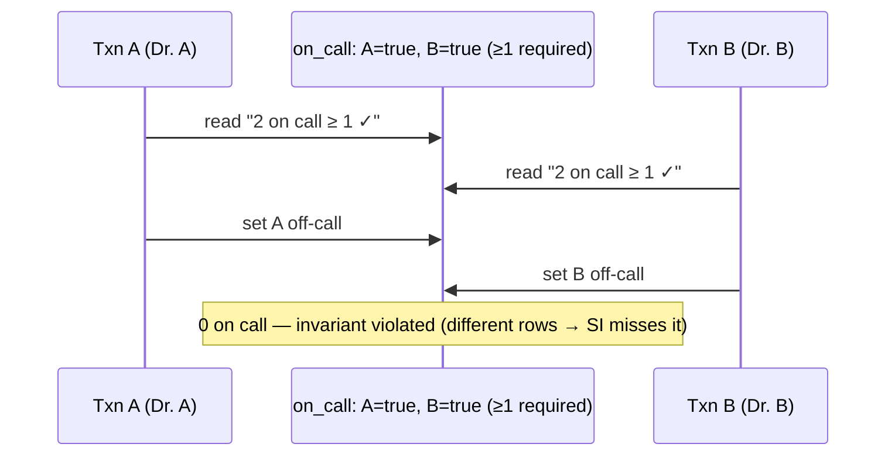

# Lesson 5.2.3 — Concurrency Anomalies: Dirty/Non-Repeatable Reads, Phantoms, Lost Updates, Write Skew

> Part 5: Databases · Module 5.2: Transactions & Concurrency · Difficulty: 🔴
>
> **Prerequisites:** [5.2.1 ACID], [5.2.2 isolation levels].
> **Unlocks:** [5.2.4 concurrency control], [5.2.5 locking/deadlocks], [Part 11 idempotency], [Part 17 contention].

---

## 1. Learning Objectives

After this lesson you will be able to:

- Define each concurrency **anomaly** — dirty read, dirty write, non-repeatable read, phantom, **lost update**, and **write skew** — with a concrete scenario.
- Map each anomaly to the **isolation level** that prevents it (5.2.2) and recognize which anomalies the *defaults* leave open.
- Identify the **two most dangerous, commonly-missed** anomalies in real systems: **lost updates** (read-modify-write races) and **write skew** (cross-row invariant violations under snapshot isolation).
- Choose the right **fix** for each anomaly: raise isolation, atomic operations, explicit locks, or optimistic concurrency (preview 5.2.4).

---

## 2. Motivation — The bugs that only appear under load

When two transactions touch the same data concurrently, specific things can go wrong. These **anomalies** are the *reason* isolation levels exist (5.2.2) — each level is literally defined by **which anomalies it forbids**. They're also the source of some of the nastiest production bugs: **intermittent, load-dependent, hard to reproduce**, and often invisible in testing (which rarely exercises true concurrency). A user double-clicks "redeem" and the coupon applies twice; two requests increment a balance and one update vanishes; two people book the last seat; a withdrawal slips a balance negative — these are concurrency anomalies, not "random glitches."

The critical, repeatedly-missed insight (from 5.2.2): your database's **default isolation does not prevent all anomalies**. In particular, **lost updates** and **write skew** survive the common defaults (Read Committed, and even Snapshot/Repeatable Read for write skew), so "we use transactions" is **not** automatic protection. Engineers who can **name the anomaly**, know **which level allows it**, and pick the **right fix** write correct concurrent systems; those who can't ship silent data corruption.

This lesson catalogs the anomalies precisely (completing 5.2.2's table), so 5.2.4 (concurrency control) and 5.2.5 (locking) give you the mechanisms to prevent them. It's essential for financial correctness, inventory/bookings, idempotency (Part 11), and any contended-write workload.

---

## 3. Theory — From first principles

A concurrency anomaly is an outcome that **couldn't happen in a serial (one-at-a-time) execution** but *can* happen when transactions interleave `[CS]`. The standard catalog:

### 3.1 Dirty write

Two transactions overwrite the **same data**, and one overwrites a value the other wrote **before it committed** `[CS]`. Leaves data in a corrupt mix of two transactions' writes. Prevented at essentially **all** practical isolation levels (Read Committed and up) — databases block writing over an uncommitted write.

### 3.2 Dirty read

A transaction reads data that another transaction has **written but not yet committed** `[CS]`. If the writer **rolls back**, the reader acted on data that **never officially existed**. 
- **Example:** T1 sets a balance to $500 (uncommitted); T2 reads $500 and emails a receipt; T1 rolls back → the $500 never happened.
- **Prevented by:** **Read Committed** and above. Only **Read Uncommitted** allows it.

### 3.3 Non-repeatable read (read skew)

A transaction reads the **same row twice** and gets **different values**, because another transaction **committed a change** in between `[CS]`. The transaction sees an **inconsistent view** within its own lifetime.
- **Example:** T1 reads `balance = 100`; T2 commits `balance = 50`; T1 reads again → `50`. If T1 was summing across rows, it sees a state that's part-old, part-new.
- **Prevented by:** **Repeatable Read / Snapshot Isolation** and above (a consistent snapshot makes reads stable). Allowed at **Read Committed**.

### 3.4 Phantom read

A transaction re-runs a **query with a search condition (range)** and gets a **different set of rows**, because another transaction **inserted/deleted** rows matching the condition `[CS]`. Unlike non-repeatable read (a changed *existing* row), phantoms are **new/disappeared rows** in a result set.
- **Example:** T1 counts orders `WHERE amount > 1000` → 5; T2 inserts a matching order and commits; T1 re-counts → 6.
- **Prevented by:** **Serializable** (and, in practice, some Repeatable Read/SI implementations via range/predicate locks or snapshots). Classically allowed at Repeatable Read.

### 3.5 Lost update (the most common real-world anomaly)

Two transactions perform a **read-modify-write** on the **same item concurrently**, and one update **silently overwrites** the other `[CS]`. Both read the old value, both compute a new value from it, both write — the second write **clobbers** the first; one update is **lost**.
- **Example (the classic):** balance = $100. T1 reads 100, adds 50 → writes 150. T2 (concurrent) reads 100, adds 30 → writes 130. Final = 130 (or 150) — **one increment is lost**; correct is 180.
- **Where it bites:** counters, balances, inventory, "increment likes," any `value = value + delta` done as read-then-write in app code.
- **Allowed at:** **Read Committed** *and* (for the read-modify-write pattern) often at Snapshot/Repeatable Read too, depending on implementation. **This is the #1 anomaly developers accidentally hit.**
- **Fixes (5.2.4):** **atomic update** (`UPDATE ... SET balance = balance + 50` — let the DB do it atomically), **explicit lock** (`SELECT ... FOR UPDATE`), **optimistic concurrency** (version/CAS check), or **serializable** isolation. Many databases **automatically detect** lost updates at Snapshot Isolation and abort one (Postgres) — but **not** at Read Committed.

### 3.6 Write skew (the subtle, dangerous one)

Two transactions each read an **overlapping set of rows**, make decisions based on what they read, and **each update different rows** — such that **together they violate an invariant** that each transaction *individually* preserved `[CS]`. It's a generalization of lost update where the transactions write to **different** objects.
- **Classic example (on-call):** invariant = "at least one doctor on call." Dr. A and Dr. B are both on call; both simultaneously request to go off-call. Each transaction reads "2 doctors on call ≥ 1, OK" and sets **itself** off-call. Result: **zero** doctors on call — invariant violated, though each transaction was individually valid.
- **Other examples:** double-booking a meeting room/seat (each checks "free," each books), withdrawing from a joint account past a shared limit, allocating the last unit twice.
- **Critically: Snapshot Isolation does NOT prevent write skew** (each sees a consistent snapshot but they write different rows, so there's no write-write conflict to catch). This is SI's famous gap (5.2.2).
- **Prevented by:** **Serializable** (SSI detects the read-write dependency cycle and aborts one). 
- **Fixes (5.2.4):** **Serializable** isolation; or **materialize the conflict** (lock the rows that represent the invariant, e.g., `SELECT ... FOR UPDATE` on the relevant set); or a **constraint** that makes the invariant explicit where possible.

### 3.7 The full mapping (completing 5.2.2's table)

| Anomaly | What happens | Prevented by (minimum) |
|---|---|---|
| **Dirty write** | overwrite uncommitted write | Read Committed |
| **Dirty read** | read uncommitted data | Read Committed |
| **Non-repeatable read** | same row, different value on reread | Repeatable Read / Snapshot |
| **Phantom** | range query returns different rows | Serializable (sometimes RR/SI) |
| **Lost update** | concurrent read-modify-write clobbers one | Snapshot (auto-detect, varies) / Serializable / explicit handling |
| **Write skew** | disjoint writes jointly break a cross-row invariant | **Serializable** (or explicit locks) |

**Key takeaways:** **lost update** and **write skew** are the ones the common defaults miss and developers most often hit; **write skew specifically defeats Snapshot Isolation**.

---

## 4. Visual Intuition

### Lost update (read-modify-write race)

### Write skew (snapshot isolation can't stop it)

---

## 5. Real-World Analogy

Picture a **shared whiteboard tally** that two people update.

- **Dirty read:** you read a number your coworker **penciled in but is about to erase** — you act on a figure that won't survive.
- **Non-repeatable read:** you read "5 tickets left," glance away, read again and it says "3" — the number **changed under you** mid-task.
- **Phantom:** you count "5 orders over $1000," then recount and there are **6** because someone **added a new one** matching your criteria.
- **Lost update:** the tally says **10 cookies eaten**. You and a coworker each, at the same time, read "10," each add your own **2**, and each write **12**. The board says 12 — but **4** were eaten; one person's update **vanished**. (The fix: don't read-then-write; just walk up and **"+2" atomically**, or **lock the marker** while you update.)
- **Write skew:** the rule is "**at least one of us must stay to lock up**." You both look around, **each sees the other still here**, and you **each decide to leave** — now **nobody** locks up. Individually each decision was fine ("someone else is here"); **together** they broke the rule — and a "frozen photocopy" of the room (snapshot isolation) wouldn't catch it because you each updated **your own** status, not a shared cell.

The two that sting most are the **cookie tally** (lost update — everywhere counters/balances live) and the **lock-up rule** (write skew — everywhere a shared invariant spans rows), and they're exactly the ones the easy "policies" don't stop.

---

## 6. Industry Example

- **Lost updates in counters/balances** `[CS]`: the canonical bug behind double-charges, miscounted likes/inventory, and balance corruption — fixed via atomic `UPDATE ... SET x = x + ?`, `SELECT ... FOR UPDATE`, or optimistic versioning (5.2.4); a staple of postmortems and interviews.
- **Write skew at Snapshot Isolation** `[CONV]`: documented real-world class of bugs (on-call/scheduling, double-booking, overdraft on shared limits) where SI's gap allowed invariant violations — requiring serializable or explicit conflict materialization.
- **Postgres auto-detects lost updates at Repeatable Read/SI** `[CONV]`: it aborts a transaction that would lose an update (serialization failure → retry), but **not** at Read Committed — illustrating how the *fix depends on level* (5.2.2).
- **SSI prevents write skew** `[CS]`: Postgres `SERIALIZABLE` (SSI) tracks read-write dependencies and aborts a transaction in a write-skew cycle — the principled prevention (5.2.4).
- **Uniqueness constraints as anomaly guards** `[BP]`: a unique index (e.g., on `seat_id` for bookings) lets the DB reject the second conflicting write cheaply — often simpler than serializable for "no duplicates" invariants.

---

## 7. Implementation Details — preventing each anomaly

- **Identify your invariants and contended writes first**, then pick prevention:
- **Dirty/non-repeatable reads, phantoms:** raise the **isolation level** (Read Committed → Repeatable Read/Snapshot → Serializable as needed — 5.2.2).
- **Lost updates** (read-modify-write): prefer an **atomic DB operation** (`UPDATE ... SET v = v + ?`), or **`SELECT ... FOR UPDATE`** (pessimistic lock), or **optimistic version/CAS** (`UPDATE ... WHERE version = ?`), or rely on **SI auto-detection** (varies) / **Serializable** (5.2.4). Don't do read-then-write in app code on contended data at Read Committed.
- **Write skew:** use **Serializable** (SSI), or **materialize the conflict** by locking the rows representing the invariant (`SELECT ... FOR UPDATE` on the relevant set), or add a **constraint** that captures the invariant where possible.
- **"No duplicates" invariants:** use a **unique constraint/index** — cheap, reliable (e.g., prevent double-booking, double-redeem).
- **Make external effects idempotent** (Part 11) — atomicity + retries can re-execute; dedupe payments/emails.
- **Test under real concurrency** (not just unit tests) — load/concurrency tests surface these (Part 17).

## 8. Advantages (of understanding anomalies)

- **Diagnose intermittent bugs precisely** — name the anomaly, find the level/race, apply the right fix.
- **Choose the minimal correct isolation** (5.2.2) — avoid over-isolating (perf) and under-isolating (corruption).
- **Pick cheap targeted fixes** (atomic ops, locks, constraints) instead of blanket serializable.
- **Build correct financial/inventory/booking systems** — the domains where anomalies are catastrophic.

## 9. Disadvantages / costs (of prevention)

- **Stronger prevention costs concurrency/throughput** (serializable, locks — Part 17).
- **Locks risk deadlocks/contention** (5.2.5); optimistic concurrency risks **abort/retry storms** under high contention.
- **Subtlety** — write skew especially is easy to miss and hard to test for.
- **Vendor-dependent behavior** — what auto-detection/level prevents varies (5.2.2).

---

## 10. When NOT to worry (much)

- **No concurrent writes to the same data** (e.g., per-user data only that user writes, append-only) — many anomalies can't occur.
- **Tolerable approximations** — if a slightly-off count (e.g., a non-critical view counter) is acceptable, a lost update may be fine (be explicit — 1.1.5).
- **Single-writer designs** (partition so one writer owns a key — Part 7/9) avoid contention-based anomalies by construction.
- But **never** ignore anomalies for **money, inventory, bookings, or any hard invariant**.

---

## 11. Common Mistakes

1. **Read-modify-write in app code on contended data** → lost update (use atomic update/lock/optimistic check) — the #1 mistake.
2. **Assuming Snapshot/Repeatable Read prevents write skew** → cross-row invariant violations (need serializable or explicit locks).
3. **"We have transactions, so we're safe"** → ignoring that defaults allow lost updates/write skew (5.2.2).
4. **Over-isolating everything** to Serializable instead of targeted fixes → performance/contention problems (Part 17).
5. **No idempotency on external effects** → atomicity-enabled retries double-charging/double-sending (Part 11).
6. **Not using a unique constraint** for "no duplicates" invariants → reinventing it with fragile app logic.
7. **Testing without concurrency** → anomalies never appear until production load.

---

## 12. Interview Questions

**🟢 Easy**
- What's the difference between a dirty read and a non-repeatable read?
- What is a lost update? Give an example.

**🟡 Medium**
- What is write skew, and why doesn't snapshot isolation prevent it? Give a concrete scenario.
- For each anomaly, name the minimum isolation level (or other mechanism) that prevents it.

**🔴 Hard**
- Two requests increment the same balance and one update is lost. Walk through three different fixes (atomic update, pessimistic lock, optimistic concurrency) and their tradeoffs (5.2.4).
- Design a booking system that can't double-book a seat under high concurrency. Compare serializable isolation, `SELECT ... FOR UPDATE`, and a unique constraint.

**⚫ Staff+**
- Audit a system at Read Committed for concurrency anomalies across its critical write paths (balances, inventory, bookings, scheduling). Identify which anomalies are possible and prescribe minimal fixes per path.
- Explain how SSI detects and prevents write skew via read-write dependency tracking, and the abort/retry implications for the application (5.2.4, Part 11).

---

## 13. Production Pitfalls

- **Silent lost updates:** concurrent increments/decrements losing writes (miscounted inventory, lost balance changes) — invisible until reconciliation finds discrepancies.
- **Write-skew invariant breach:** double-booking, overdraft on shared limits, "everyone went off-call" — rare, load-triggered, severe (snapshot isolation didn't catch it).
- **Double-execution from retries:** atomicity + retry re-running a non-idempotent external effect (duplicate charge/email) (Part 11).
- **Abort/retry storms:** high contention under optimistic concurrency or SSI causing repeated aborts → throughput collapse (Part 17).
- **Deadlocks:** pessimistic locking to prevent anomalies introducing deadlocks under load (5.2.5).
- **Heisenbugs:** anomalies passing all tests (no concurrency) then appearing only at production scale.

---

## 14. Optimization Techniques

- **Atomic DB operations** for counters/balances (`SET v = v + ?`) — prevent lost updates cheaply, no app-side read-modify-write.
- **Optimistic concurrency (version/CAS)** for low-contention contended writes — no locks, retry on conflict (5.2.4).
- **Pessimistic locks (`FOR UPDATE`)** for high-contention or write-skew-prone paths — lock the invariant's rows (5.2.4/5.2.5).
- **Unique/check constraints** to let the DB enforce "no duplicates"/range invariants cheaply.
- **Serializable (SSI)** for hard cross-row invariants where targeted fixes are impractical — with retry logic.
- **Single-writer partitioning** (Part 7/9) to design contention away.
- **Idempotency keys** for external effects to make retries safe (Part 11).

---

## 15. Summary

A **concurrency anomaly** is an outcome impossible under serial execution but possible when transactions interleave — and isolation levels (5.2.2) are defined precisely by **which anomalies they forbid**. The catalog: **dirty write** (overwrite an uncommitted write — blocked nearly everywhere); **dirty read** (read uncommitted data — blocked at Read Committed+); **non-repeatable read** (same row, different value on reread — blocked at Repeatable Read/Snapshot+); **phantom** (a range query returns different rows due to inserts/deletes — blocked at Serializable, sometimes RR/SI); **lost update** (concurrent **read-modify-write** clobbers one update — the **#1 real-world anomaly**, common at Read Committed and often at SI for the RMW pattern); and **write skew** (two transactions each read an overlapping set and write **different** rows, jointly violating a **cross-row invariant** — the subtle, dangerous one that **Snapshot Isolation does *not* prevent**). The crucial, repeatedly-missed point: **default isolation does not stop lost updates or write skew**, so "we use transactions" is not automatic safety. Fixes are anomaly-specific and should be **minimal**: raise isolation for read anomalies; for **lost updates** use **atomic updates**, **`SELECT ... FOR UPDATE`**, **optimistic version/CAS**, or SI auto-detection/Serializable; for **write skew** use **Serializable (SSI)** or **materialize the conflict** by locking the invariant's rows (or a constraint); and for "no duplicates," a **unique constraint** is cheap and reliable — plus **idempotency** for external effects (Part 11). These anomalies are the *why* behind concurrency control (5.2.4) and locking (5.2.5), and mastering them is essential for correct financial, inventory, booking, and any contended-write systems (Part 17).

---

## 16. Revision Notes (flashcard-ready)

- **Q:** Dirty read? **A:** Reading another transaction's uncommitted data (lost if it rolls back). Blocked at Read Committed.
- **Q:** Non-repeatable read? **A:** Same row read twice gives different values (a committed change between). Blocked at Repeatable Read/Snapshot.
- **Q:** Phantom? **A:** A range query returns a different set of rows (inserts/deletes). Blocked at Serializable (sometimes RR/SI).
- **Q:** Lost update? **A:** Concurrent read-modify-write; one write clobbers the other (counter/balance bug). The #1 real-world anomaly.
- **Q:** Lost-update fixes? **A:** Atomic update (`SET v=v+?`), SELECT...FOR UPDATE, optimistic version/CAS, SI auto-detect, or Serializable.
- **Q:** Write skew? **A:** Two txns read overlapping rows, write different rows, jointly breaking a cross-row invariant.
- **Q:** Why doesn't SI prevent write skew? **A:** Each sees a consistent snapshot and writes different rows → no write-write conflict to detect.
- **Q:** Write-skew fix? **A:** Serializable (SSI), or lock the invariant's rows (FOR UPDATE), or a constraint.
- **Q:** Which anomalies do defaults miss? **A:** Lost update (Read Committed) and write skew (even Snapshot/Repeatable Read).
- **Q:** "No duplicates" invariant best guard? **A:** A unique constraint/index (cheap, DB-enforced).

---

## 17. Further Reading + Knowledge-Graph Links

**Within this platform**
- **Previous:** [5.2.2 Isolation Levels]. **Builds on:** [5.2.1 ACID]. **Next:** [5.2.4 Concurrency Control] (mechanisms to prevent these) → [5.2.5 Locking/Deadlocks].
- **Connects to:** [Part 11 Idempotency/Resilience] (safe retries, dedupe), [Part 17 Performance] (contention, abort storms), [Part 7 Scalability] (single-writer partitioning), [Part 10 Consistency] (serializability).

**Foundational texts (synthesized)**
- Kleppmann, *Designing Data-Intensive Applications* — anomalies catalog, lost update, write skew, phantoms, SSI.
- Berenson et al., "A Critique of ANSI SQL Isolation Levels" (synthesized).
- Database documentation (Postgres serialization-failure handling, FOR UPDATE) — representative.

**Concept tags:** `[CS]` dirty/non-repeatable read, phantom, lost update, write skew, snapshot-isolation gap · `[CONV]` lost-update auto-detection, SSI write-skew prevention, unique-constraint guards · `[BP]` atomic updates, optimistic/pessimistic concurrency per contention, materialize conflicts, idempotency for external effects.
