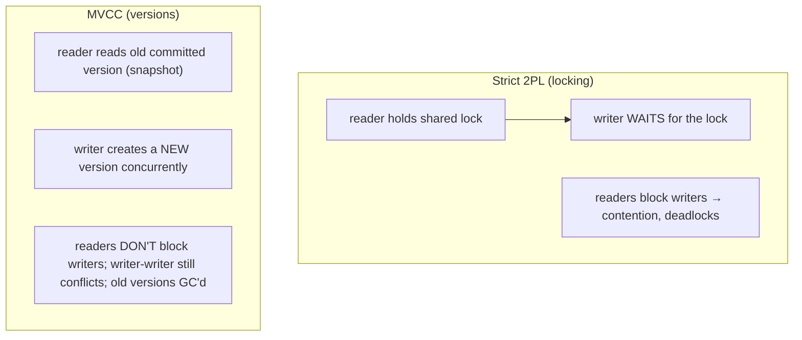
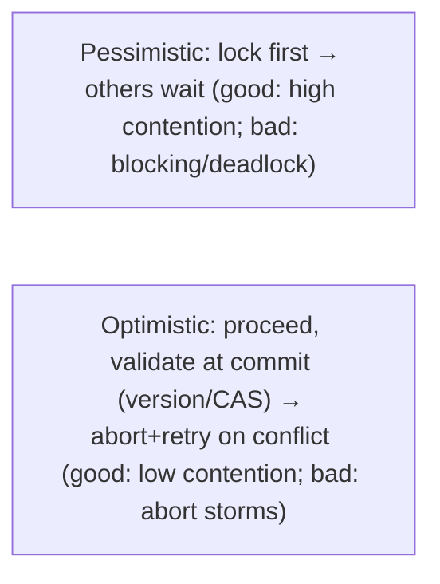

# Lesson 5.2.4 — Concurrency Control: 2PL, MVCC, Optimistic vs Pessimistic, SSI

> Part 5: Databases · Module 5.2: Transactions & Concurrency · Difficulty: 🔴⚫
>
> **Prerequisites:** [5.2.1 ACID], [5.2.2 isolation levels], [5.2.3 anomalies], [4.2.2 B-trees].
> **Unlocks:** [5.2.5 locking/deadlocks], [5.3.x recovery], [Part 10 consistency], [Part 11 optimistic patterns].

---

## 1. Learning Objectives

After this lesson you will be able to:

- Explain the **mechanisms** databases use to implement isolation (5.2.2) and prevent anomalies (5.2.3): **two-phase locking (2PL)**, **multi-version concurrency control (MVCC)**, **optimistic** vs **pessimistic** concurrency, and **Serializable Snapshot Isolation (SSI)**.
- Explain why **MVCC** (readers don't block writers) became the dominant approach and how snapshot isolation is built on it.
- Distinguish **pessimistic** (lock first, assume conflict) from **optimistic** (proceed, detect conflict at commit) control and when each wins.
- Map mechanism → isolation level → anomaly prevention, and choose the right concurrency-control approach for a workload.

---

## 2. Motivation — How the guarantees actually get enforced

5.2.1–5.2.3 told you **what** isolation guarantees and **which anomalies** matter. This lesson is the **how**: the algorithms that let many transactions run concurrently while preserving the chosen isolation level. The choice of mechanism is one of the deepest determinants of a database's concurrency behavior — whether **readers block writers**, how **contention** manifests (waiting vs aborting), how **deadlocks** arise (5.2.5), and how it performs under load (Part 17).

Two big ideas dominate. **Locking** (pessimistic) assumes conflicts are likely, so transactions **acquire locks before touching data** and others **wait** — correct but contention-prone (blocking, deadlocks). **MVCC** keeps **multiple versions** of each row so **readers see a consistent snapshot without locking**, letting reads and writes proceed concurrently — the reason modern databases feel fast under mixed read/write load, and the foundation of **snapshot isolation**. Layered on these are the **optimistic vs pessimistic** philosophies and modern hybrids like **SSI** (true serializability with MVCC's concurrency).

Understanding these mechanisms lets you predict and tune concurrency behavior, choose between optimistic and pessimistic strategies (also a key application-level pattern — Part 11), reason about deadlocks (5.2.5), and connect database internals to the distributed concurrency control you'll meet in Parts 8/10. It's where ACID's "I" becomes real code.

---

## 3. Theory — From first principles

### 3.1 The job of concurrency control

**Concurrency control** ensures that concurrent transactions produce a **correct** result (per the chosen isolation level) despite interleaving `[CS]`. The gold standard is **serializability** (5.2.2): the outcome equals *some* serial order. Mechanisms achieve correctness by either **preventing** problematic interleavings (locking) or **detecting and resolving** them (validation/abort). The fundamental tension: **more correctness/safety ↔ less concurrency** (1.1.5).

### 3.2 Two-Phase Locking (2PL) — pessimistic locking

**2PL** is the classic mechanism for serializability via **locking** `[CS]`. Transactions acquire **shared (read) locks** and **exclusive (write) locks** on data, following the **two-phase rule**:
- **Growing phase:** the transaction **acquires** locks (and never releases).
- **Shrinking phase:** the transaction **releases** locks (and never acquires).
In practice databases use **strict 2PL (S2PL):** hold **all** locks until **commit/abort**, then release — which guarantees serializability and recoverability.

Properties `[CS]`:
- **Shared locks** allow concurrent readers; an **exclusive lock** blocks everyone else on that item.
- **Readers block writers and writers block readers** (a write lock waits for read locks to clear, and vice versa) — the defining cost of lock-based isolation: **contention and waiting**.
- **Deadlocks** are possible (T1 holds A waits for B; T2 holds B waits for A) — the DB detects (wait-for graph) and aborts a victim, or uses timeouts (5.2.5).
- Implements **Serializable** (and lower levels via shorter-held/fewer locks). Historically the dominant approach; still used (e.g., SQL Server default locking, MySQL in some modes).

The big drawback: **lock contention** kills concurrency under load, especially **readers blocking writers** — which motivated MVCC.

### 3.3 Multi-Version Concurrency Control (MVCC) — readers don't block writers

**MVCC** keeps **multiple versions of each row** rather than overwriting in place `[CS]`. Each transaction sees a **consistent snapshot** of the database (the versions valid as of its start/statement), so:
- **Readers never block writers, and writers never block readers** — a reader reads an **older committed version** while a writer creates a **new version**. This is MVCC's killer advantage and why it dominates modern databases.
- **Writers still conflict with writers** (two transactions writing the same row — one waits or aborts).
- Implements **Snapshot Isolation** naturally (each transaction's snapshot = consistent view as of start — 5.2.2), and lower levels (Read Committed = snapshot as of each *statement*).

How it works (representative) `[CS]`:
- Each row version carries **transaction-id/timestamp** metadata (when created, when deleted/superseded). A transaction reads the version **visible** to its snapshot (committed before it started, not yet superseded).
- **Old versions** must be **garbage-collected** once no transaction can see them (Postgres **VACUUM**; Oracle **undo/rollback segments**; InnoDB **undo logs**). Failing to clean up causes **bloat** (a real operational issue — long-running transactions hold old versions alive, Part 17).
- Ties to storage: MVCC is why deletes/updates create new versions (like LSM tombstones — 4.2.3) and why old data lingers (the version chain).

**MVCC alone gives snapshot isolation, which allows write skew (5.2.3)** — so true serializability needs more (SSI, §3.6) or explicit locks.

### 3.4 Pessimistic vs optimistic concurrency control

Two philosophies, applicable at both DB and application levels `[CS]`:

**Pessimistic (assume conflicts happen → lock first):**
- Acquire locks **before** accessing data (2PL; or `SELECT ... FOR UPDATE` for a specific row). Others **wait**.
- **Best when contention is high** (conflicts likely) — avoids wasted work, but causes **blocking and deadlocks** (5.2.5).

**Optimistic (assume conflicts are rare → proceed, check at commit):**
- Don't lock; read and compute freely; at **commit**, **validate** that no conflicting change occurred; if it did, **abort and retry** `[CS]`.
- Implemented via **version numbers / timestamps / CAS** (Compare-And-Swap): `UPDATE ... SET v = new, version = version+1 WHERE version = old` — if 0 rows updated, someone else changed it → retry (prevents lost updates — 5.2.3).
- **Best when contention is low** — no locking overhead, high concurrency; but **wasteful under high contention** (repeated aborts/retries — abort storms, Part 17).

This optimistic/pessimistic choice is also a key **application-level** pattern (e.g., optimistic locking via a `version` column in ORMs — Part 11) and reappears in distributed systems (Part 10).

### 3.5 Mechanism → isolation level

| Mechanism | Readers block writers? | Implements | Conflict handling |
|---|---|---|---|
| **Strict 2PL** | **yes** (locks) | up to Serializable | wait; deadlock → abort victim |
| **MVCC (snapshot)** | **no** | Snapshot/Repeatable Read, Read Committed | writer-writer conflict; allows write skew |
| **Optimistic (OCC)** | no (no locks) | various; great for low contention | validate at commit → abort/retry |
| **SSI** | no (MVCC + tracking) | **true Serializable** | detect read-write dependency cycle → abort |

### 3.6 Serializable Snapshot Isolation (SSI) — the modern best-of-both

**SSI** gives **true serializability** on top of **MVCC** without 2PL's locking cost `[CS]` (Cahill et al.; used by Postgres `SERIALIZABLE`). It runs transactions at snapshot isolation (so readers don't block writers) but **tracks read-write dependencies** between concurrent transactions and **detects dangerous structures** (read-write dependency cycles) that could violate serializability — then **aborts** one transaction to break the cycle. 
- **Optimistic in spirit:** let transactions run, detect conflicts, abort offenders → applications must **retry** (Part 11).
- **Prevents write skew** (5.2.3) — the gap plain snapshot isolation leaves — while keeping MVCC's concurrency. 
- **Cost:** tracking overhead + aborts under contention; but far better concurrency than strict 2PL serializable for read-heavy workloads.

### 3.7 Choosing an approach

The decision `[BP]`:
- **MVCC/snapshot** is the modern default for general workloads (great read/write concurrency); accept write-skew risk or use serializable/explicit locks for affected invariants.
- **Pessimistic locks (`FOR UPDATE` / 2PL)** for **high-contention** hotspots or when you must serialize access to specific rows — accept blocking/deadlock risk (5.2.5).
- **Optimistic (version/CAS)** for **low-contention** contended writes (most web app updates) — cheap, no locks, retry on conflict; prevents lost updates.
- **Serializable (SSI)** for **hard cross-row invariants** where targeted fixes are impractical — with retry logic.
- Match to **contention level**: high contention → pessimistic; low contention → optimistic (the central rule).

---

## 4. Visual Intuition

### 2PL vs MVCC on a read+write

### Optimistic vs pessimistic

---

## 5. Real-World Analogy

Think of multiple people needing to edit the **same shared document**.

- **Two-phase locking (pessimistic)** is **checking out the document with a physical key**: before you read or edit, you grab the lock; everyone else **waits** until you're completely done (commit) and return all your keys. Correct and orderly, but people **queue up**, and if you hold the key to chapter A while waiting for chapter B's key, and your colleague holds B waiting for A, you're **deadlocked** until a referee kicks one of you out (5.2.5).
- **MVCC** is giving each editor an **instant photocopy (snapshot)** the moment they start: readers work from their own consistent copy and **never wait** for a writer, while a writer prepares a **new version**. Brilliant for letting lots of people read while someone writes — but two people trying to change the **same** line still conflict, and the office accumulates **stacks of old photocopies** that a janitor must periodically recycle (garbage collection / VACUUM) — and if someone keeps a copy open for hours, the janitor can't recycle (bloat).
- **Optimistic concurrency** is the **wiki "edit and submit"** model: everyone edits freely without locking, and **at save time** the system checks "did this section change since you loaded it?" If not, you're in; if so, it **rejects your save and asks you to redo it** (version check / retry). Wonderful when edit collisions are **rare**; maddening if everyone's fighting over the same paragraph (constant rejections — abort storm).
- **SSI** is the wiki model **plus a smart referee** who watches the *pattern* of who-read-what-and-who-wrote-what and, if a combination would corrupt the shared rules (write skew), **cancels one save** before it commits — giving the safety of strict turns with the freedom of free editing, at the cost of occasional "please redo."

---

## 6. Industry Example

- **MVCC is the modern norm** `[CS]`: Postgres, Oracle, MySQL/InnoDB, SQL Server (snapshot mode) implement MVCC so readers don't block writers — the dominant reason these databases handle mixed read/write load well (5.2.2).
- **VACUUM / undo and version GC** `[CONV]`: Postgres **VACUUM** reclaims dead row versions; InnoDB/Oracle use **undo logs/segments** — and **long-running transactions causing bloat** is a classic operational issue (Part 17).
- **Strict 2PL** `[CS]`: SQL Server's default locking and DB2 historically use lock-based isolation; still relevant for serializable-by-locking.
- **SSI in Postgres** `[CS]`: `SERIALIZABLE` uses Serializable Snapshot Isolation — true serializability with MVCC concurrency, aborting transactions in read-write dependency cycles (prevents write skew — 5.2.3).
- **Optimistic locking in apps/ORMs** `[CONV]`: a `version` column with compare-and-update (Hibernate/JPA `@Version`, etc.) is the standard application-level optimistic concurrency control preventing lost updates — and `SELECT ... FOR UPDATE` is the pessimistic counterpart.

---

## 7. Implementation Details — choosing & using mechanisms

- **Default to MVCC/snapshot** (your DB likely already does) for good read/write concurrency; remember it gives **snapshot isolation** (write skew possible — 5.2.3).
- **Match optimistic vs pessimistic to contention** (the core rule): **low contention → optimistic** (version/CAS, retry); **high contention → pessimistic** (`SELECT ... FOR UPDATE` / 2PL).
- **Prevent lost updates** with **atomic updates** or **optimistic version checks** rather than app-side read-modify-write (5.2.3).
- **For true serializability**, use the DB's **Serializable (SSI)** and **implement retry-on-serialization-failure** (with backoff) — transactions *will* be aborted (Part 11).
- **Keep transactions short** — long transactions hold locks (2PL) or keep old versions alive (MVCC bloat) → contention/deadlocks/bloat (5.2.5, Part 17).
- **Manage MVCC version GC** — monitor/configure VACUUM/undo; watch for long-running transactions blocking cleanup (operational, Part 14/17).
- **Be deadlock-aware** with pessimistic locking — consistent lock ordering, short transactions, deadlock-retry (5.2.5).

## 8. Advantages (by mechanism)

- **2PL:** straightforward serializability; well-understood; strong guarantees.
- **MVCC:** **readers don't block writers** (high concurrency for mixed loads), consistent snapshot reads, great for read-heavy/reporting.
- **Optimistic:** no locking overhead, high concurrency under **low** contention, no deadlocks; simple version/CAS pattern.
- **SSI:** **true serializability with MVCC concurrency** — prevents write skew without 2PL's blocking.

## 9. Disadvantages (by mechanism)

- **2PL:** lock contention, **readers block writers**, **deadlocks**, lower throughput under load (5.2.5).
- **MVCC:** **version GC/bloat** overhead (VACUUM), writer-writer conflicts remain, snapshot isolation **allows write skew** (5.2.3).
- **Optimistic:** **abort/retry storms** under high contention (wasted work); requires retry logic.
- **SSI:** dependency-tracking overhead + aborts under contention; requires application retries.

---

## 10. When NOT to use each

- **Don't use blanket 2PL/serializable** for read-heavy workloads where MVCC snapshot suffices — needless contention.
- **Don't use optimistic concurrency under high contention** — constant aborts/retries waste work; use pessimistic locks instead.
- **Don't use pessimistic locking under low contention** — needless blocking/deadlock risk; optimistic is cheaper.
- **Don't rely on MVCC snapshot alone for cross-row invariants** (write skew) — use SSI or explicit locks (5.2.3).
- **Don't ignore version GC** with MVCC — long transactions + no VACUUM tuning → bloat (Part 17).

---

## 11. Common Mistakes

1. **App-side read-modify-write** instead of atomic/optimistic updates → lost updates (5.2.3).
2. **Optimistic concurrency on a hot row** → abort storm; should be pessimistic (`FOR UPDATE`).
3. **Pessimistic locks everywhere** → contention/deadlocks where optimistic would do (5.2.5).
4. **No retry logic with SSI/optimistic** → serialization-failure/version-conflict errors surfacing to users.
5. **Long transactions** → lock contention (2PL) or version bloat (MVCC) → degraded performance (Part 17).
6. **Ignoring write skew** assuming MVCC/snapshot prevents it (it doesn't — need SSI/locks).
7. **Inconsistent lock ordering** with pessimistic locks → deadlocks (5.2.5).
8. **Neglecting VACUUM/version cleanup** → table/index bloat, slow reads.

---

## 12. Interview Questions

**🟢 Easy**
- What is two-phase locking, and why can it cause deadlocks?
- What's the key advantage of MVCC over lock-based concurrency control?

**🟡 Medium**
- Explain optimistic vs pessimistic concurrency control and when to use each.
- How does MVCC implement snapshot isolation, and why must old versions be garbage-collected?

**🔴 Hard**
- Prevent a lost update three ways (atomic update, pessimistic `FOR UPDATE`, optimistic version/CAS) and compare under low vs high contention (5.2.3, Part 17).
- Explain Serializable Snapshot Isolation: how it achieves true serializability on MVCC, why it aborts transactions, and how it prevents write skew that plain snapshot isolation allows.

**⚫ Staff+**
- Design the concurrency-control strategy for a high-contention hotspot (e.g., a popular item's inventory counter) vs a low-contention update (user profile edit). Justify mechanism choice, retry behavior, and tail-latency implications (Part 17).
- Discuss MVCC's operational costs at scale (version bloat, VACUUM, long-transaction impact) and how you'd monitor/mitigate them (Part 14/17).

---

## 13. Production Pitfalls

- **MVCC bloat from long transactions:** old versions can't be GC'd while a long-running transaction holds a snapshot → table/index bloat, slow reads, VACUUM struggles (Part 17).
- **Deadlocks under pessimistic locking:** inconsistent lock order / long transactions → deadlock victims aborted under load (5.2.5).
- **Abort storms under optimistic/SSI:** high contention causing repeated conflict aborts/retries → throughput collapse and latency spikes (Part 17).
- **Unhandled conflict errors:** version-conflict/serialization-failure not retried → user-facing failures.
- **Reader-writer blocking (2PL):** lock-based isolation stalling reads behind writes (and vice versa) under load.
- **Hot-row contention:** all transactions serializing on one row regardless of mechanism (needs design change — Part 7 single-writer/partition).

---

## 14. Optimization Techniques

- **Use MVCC snapshot reads** for read-heavy/reporting concurrency (no reader-writer blocking).
- **Optimistic (version/CAS)** for low-contention updates; **pessimistic (`FOR UPDATE`)** for high-contention hotspots — match to contention (the core lever).
- **Atomic DB operations** for counters/balances to avoid read-modify-write lost updates (5.2.3).
- **Short transactions + retry-on-conflict (backoff)** to reduce contention, deadlocks, and bloat (5.2.5, Part 11).
- **Serializable (SSI) only where needed**, with retries, for cross-row invariants (5.2.3).
- **Tune version GC/VACUUM** and avoid long-running transactions to prevent bloat (Part 14/17).
- **Reduce contention by design** — partition hot data / single-writer ownership (Part 7/9) so concurrency control has less to fight over.

---

## 15. Summary

Concurrency control is **how** databases enforce isolation (5.2.2) and prevent anomalies (5.2.3) while running transactions concurrently. **Two-Phase Locking (2PL)** — acquire locks in a growing phase, release in a shrinking phase, with **strict 2PL** holding all locks until commit — provides serializability via **locking**, but its defining cost is **contention**: **readers block writers and writers block readers**, and **deadlocks** arise (resolved by victim abort — 5.2.5). **MVCC (Multi-Version Concurrency Control)** keeps **multiple row versions** so each transaction reads a **consistent snapshot** and **readers never block writers** (writers create new versions) — the killer advantage behind modern databases' mixed-load performance and the basis of **snapshot isolation**; its costs are **writer-writer conflicts**, the need to **garbage-collect old versions** (VACUUM/undo — and **bloat** from long transactions), and the fact that **plain snapshot isolation allows write skew** (5.2.3). Cross-cutting both is the **pessimistic vs optimistic** philosophy: **pessimistic** locks first (best under **high** contention; risks blocking/deadlock), while **optimistic** proceeds and **validates at commit** via version/CAS, aborting and retrying on conflict (best under **low** contention; risks abort storms) — also a key application-level pattern (Part 11). **Serializable Snapshot Isolation (SSI)** is the modern best-of-both: true serializability layered on MVCC by **tracking read-write dependencies** and **aborting** transactions in dangerous cycles (preventing write skew without 2PL's blocking) — at the cost of tracking overhead and required **retries**. The decision is driven by **contention and invariant needs**: MVCC/snapshot as the general default, **optimistic** for low-contention contended writes, **pessimistic locks** for hot rows, and **Serializable (SSI)** for hard cross-row invariants — always with **short transactions**, **retry logic**, and attention to **version GC/deadlocks** (5.2.5, Part 17). This is ACID's "I" turned into running algorithms, and it underpins locking/deadlocks (5.2.5), recovery (5.3), and distributed concurrency (Parts 8/10).

---

## 16. Revision Notes (flashcard-ready)

- **Q:** What does concurrency control do? **A:** Enforces the chosen isolation level (correctness) while allowing concurrent transactions.
- **Q:** Two-phase locking? **A:** Growing phase acquires locks, shrinking releases; strict 2PL holds all until commit → serializability via locking.
- **Q:** 2PL's defining cost? **A:** Readers block writers (and vice versa) → contention + deadlocks.
- **Q:** MVCC core idea / advantage? **A:** Keep multiple row versions; readers read a consistent snapshot → readers don't block writers.
- **Q:** MVCC costs? **A:** Version GC/bloat (VACUUM/undo), writer-writer conflicts, snapshot isolation allows write skew.
- **Q:** Pessimistic vs optimistic? **A:** Pessimistic = lock first (high contention); optimistic = proceed + validate at commit via version/CAS (low contention).
- **Q:** Optimistic lost-update prevention? **A:** `UPDATE ... WHERE version = old`; 0 rows → conflict → retry.
- **Q:** SSI? **A:** True serializability on MVCC by tracking read-write dependencies and aborting cycles — prevents write skew; needs retries.
- **Q:** Choose by? **A:** Contention level (high→pessimistic, low→optimistic) + invariant needs (cross-row → serializable/locks).
- **Q:** MVCC operational risk? **A:** Long transactions block version GC → bloat (tune VACUUM, keep txns short).

---

## 17. Further Reading + Knowledge-Graph Links

**Within this platform**
- **Previous:** [5.2.3 Anomalies]. **Builds on:** [5.2.1 ACID], [5.2.2 Isolation Levels], [4.2.2 B-trees]. **Next:** [5.2.5 Locking, Deadlocks, Detection].
- **Connects to:** [5.3.1 Recovery] (logging interacts with concurrency), [Part 11 Resilience] (optimistic patterns, retries), [Part 10 Consistency] (linearizability vs serializability, distributed concurrency), [Part 17 Performance] (contention, bloat, abort storms), [Part 7] (reduce contention by partitioning).

**Foundational texts (synthesized)**
- Kleppmann, *Designing Data-Intensive Applications* — 2PL, snapshot isolation/MVCC, SSI, optimistic vs pessimistic.
- Bernstein et al., *Concurrency Control and Recovery in Database Systems* (synthesized).
- Cahill, Röhm, Fekete, "Serializable Isolation for Snapshot Databases" (SSI) — synthesized.
- Postgres MVCC/VACUUM and SSI documentation — representative.

**Concept tags:** `[CS]` 2PL/strict 2PL, MVCC, snapshot isolation, optimistic vs pessimistic (OCC), SSI, version GC · `[CONV]` MVCC default in major DBs, VACUUM/undo, ORM optimistic `@Version`, FOR UPDATE · `[BP]` match optimistic/pessimistic to contention, short transactions, retry on conflict, manage version GC, reduce contention by design.
