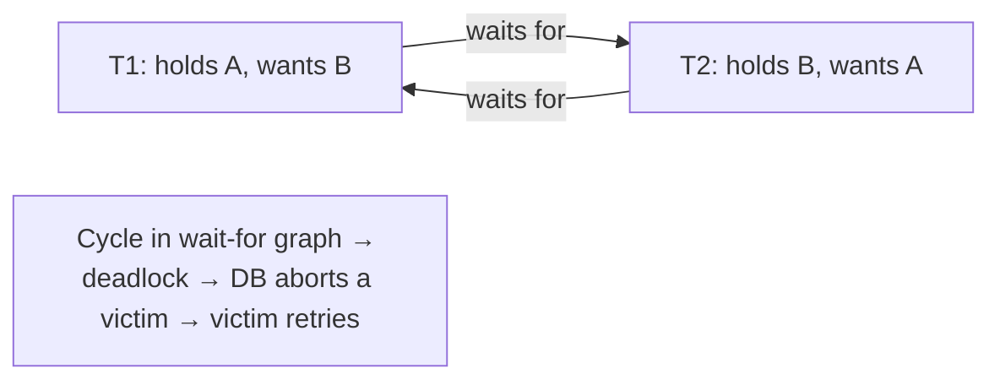
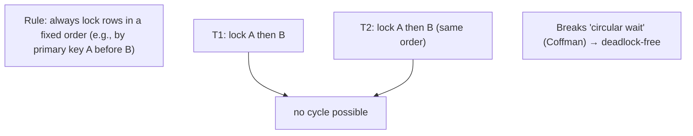

# Lesson 5.2.5 — Locking, Deadlocks, and Detection

> Part 5: Databases · Module 5.2: Transactions & Concurrency · Difficulty: 🔴
>
> **Prerequisites:** [5.2.4 concurrency control (2PL/MVCC)], [5.2.3 anomalies], [2.4.3 concurrency patterns].
> **Unlocks:** [5.3.1 recovery], [Part 8 distributed locks], [Part 11 resilience], [Part 17 contention].

---

## 1. Learning Objectives

After this lesson you will be able to:

- Describe **lock types and granularity** (shared/exclusive; row/page/table; intent locks) and their concurrency/overhead tradeoffs.
- Explain how **deadlocks** arise (the four Coffman conditions) and the difference between deadlock, **livelock**, and **lock contention/starvation**.
- Explain how databases **handle deadlocks** — **detection** (wait-for graph + victim abort) vs **prevention** (ordering, timeouts) — and what the application must do (retry).
- Apply practical techniques to **avoid and mitigate** deadlocks and lock contention (lock ordering, short transactions, right granularity, lower isolation, optimistic concurrency).

---

## 2. Motivation — When locks, the tool for correctness, become the problem

Locking (5.2.4) is how pessimistic concurrency control enforces isolation: acquire a lock, others wait. But the very mechanism that prevents anomalies introduces its own failure modes — **deadlocks** (two transactions waiting on each other forever), **lock contention** (transactions queuing on hot data, killing throughput), and **starvation** (a transaction perpetually denied a lock). These are among the most common, frustrating, and **load-dependent** database problems: a system that's fine in testing throws deadlock errors and stalls under production concurrency (Part 17).

Deadlocks in particular are a fundamental concurrency phenomenon (the same theory as OS deadlocks — 2.4.3), and every transactional database must **detect or prevent** them. Understanding *how* (wait-for graphs, victim selection, lock timeouts) tells you why you sometimes get "deadlock detected, transaction aborted" errors — and why the correct application response is to **retry**. More importantly, understanding lock granularity, lock ordering, and transaction length lets you **avoid** most deadlocks and contention in the first place.

This lesson completes Module 5.2's concurrency arc: ACID's isolation (5.2.1), the levels (5.2.2), the anomalies they prevent (5.2.3), the mechanisms (5.2.4), and now the **operational reality of locks** — essential for building systems that stay fast and correct under concurrent load (Part 17), and the conceptual bridge to **distributed locks** (Part 8) and their dangers.

---

## 3. Theory — From first principles

### 3.1 Lock types

Databases use **lock modes** to control compatible access `[CS]`:
- **Shared (S) lock (read lock):** multiple transactions can hold S locks on the same item simultaneously (concurrent reads are fine).
- **Exclusive (X) lock (write lock):** only **one** holder; blocks all other S and X locks (a writer needs exclusive access).
- **Compatibility:** S+S compatible; S+X and X+X **incompatible** (must wait).

(Under MVCC — 5.2.4 — reads typically **don't** take shared locks at all, reading a snapshot instead; locks then mainly matter for writes and explicit locking like `SELECT ... FOR UPDATE`.)

### 3.2 Lock granularity

Locks can be taken at different **granularities**, a classic tradeoff `[CS]`:
- **Row-level:** lock individual rows → **maximum concurrency** (different transactions touch different rows freely), but **more locks** to track (overhead/memory).
- **Page-level:** lock a whole page (multiple rows) → fewer locks, but **false contention** (transactions touching *different* rows on the same page block each other).
- **Table-level:** lock the whole table → minimal overhead, but **terrible concurrency** (one writer blocks the whole table).
- **Lock escalation:** databases may **escalate** many row locks into a coarser (page/table) lock to save memory — which can suddenly **increase contention** (a surprise under bulk operations).
- **Intent locks** (IS/IX): coarse-grained markers at the table level indicating intent to lock rows beneath, so the DB can check table-level lock compatibility without scanning every row lock (multi-granularity locking).

**Finer granularity = more concurrency but more overhead;** coarser = less overhead but more contention. Row-level is the common default for OLTP.

### 3.3 Deadlock — the core phenomenon

A **deadlock** is a cycle of transactions each **waiting for a lock held by another**, so none can proceed `[CS]`. The classic: T1 holds lock on A and wants B; T2 holds lock on B and wants A → both wait forever.

Deadlock requires **all four Coffman conditions** simultaneously `[CS]`:
1. **Mutual exclusion** — locks are exclusive (can't share).
2. **Hold and wait** — a transaction holds locks while waiting for more.
3. **No preemption** — locks aren't forcibly taken away.
4. **Circular wait** — a cycle in the "who-waits-for-whom" graph.

Break **any one** condition and deadlock is impossible — which is the basis of prevention (§3.5).

### 3.4 Deadlock vs livelock vs starvation vs contention

Don't conflate these `[CS]`:
- **Deadlock:** transactions **stuck forever** in a wait cycle (nothing progresses) — resolved by aborting a victim.
- **Livelock:** transactions **keep retrying and conflicting**, actively doing work but making no progress (e.g., two transactions repeatedly aborting and retrying in lockstep) — mitigated by **randomized backoff** (Part 11).
- **Starvation:** a particular transaction is **perpetually denied** a lock (others keep jumping ahead) — mitigated by fairness/queuing.
- **Lock contention:** transactions **waiting** (not deadlocked) for hot locks → high latency, low throughput. Not a deadlock, but the more common performance problem at scale (Part 17).

### 3.5 Handling deadlocks: detection vs prevention vs timeout

Databases use one or more strategies `[CS]`:

**Detection (the common DB approach):**
- The DB maintains a **wait-for graph** (edges = "T1 waits for T2") and periodically checks for **cycles**. On finding one, it picks a **victim** (often the transaction with the least work done / fewest locks / lowest cost to roll back), **aborts** it (releasing its locks), letting others proceed.
- The victim transaction gets a **deadlock error** and **must retry** — this is why "deadlock detected" errors exist and why the application must handle them (retry with backoff).

**Timeout:**
- Simpler: if a transaction waits for a lock longer than a **timeout**, abort it (assume deadlock). Easy but can abort transactions that were merely slow (false positives) and is sensitive to timeout tuning. Common in distributed settings where global cycle detection is hard (Part 8).

**Prevention (break a Coffman condition up front):**
- **Lock ordering** (break circular wait): always acquire locks in a **consistent global order** (e.g., by primary key) → no cycle can form. The **most practical application-level prevention**.
- **No hold-and-wait:** acquire all locks at once at the start (hard in practice).
- **Wait-die / wound-wait** (timestamp-based schemes): use transaction age to decide who waits vs aborts, guaranteeing no cycle.

**Most databases detect-and-abort; the application's job is to retry deadlock-aborted transactions.** Prevention via **consistent lock ordering** + **short transactions** avoids most deadlocks before detection is needed.

### 3.6 Practical causes and avoidance

Common deadlock/contention causes `[BP]`:
- **Inconsistent lock ordering** — different code paths lock rows A→B vs B→A. **Fix:** acquire in a consistent order.
- **Long transactions** holding locks while doing slow work (or waiting on user/network) → more overlap, more deadlocks/contention. **Fix:** keep transactions **short**; don't do I/O or user interaction inside a transaction.
- **Lock escalation** turning row locks into table locks under bulk ops → sudden contention. **Fix:** batch sizes, avoid huge transactions.
- **Hot rows** (everyone updates the same counter/row) → severe contention. **Fix:** reduce contention by design (sharded counters, single-writer partitioning — Part 7/9), or atomic ops.
- **Indexes/foreign keys** causing extra locks (e.g., FK checks locking parent rows) → unexpected deadlocks. **Fix:** be aware of implicit locking; index appropriately (4.2.5).
- **High isolation / unnecessary explicit locks** → more locking than needed. **Fix:** use the lowest correct isolation (5.2.2), prefer MVCC reads/optimistic concurrency where contention is low (5.2.4).

### 3.7 Connection to distributed locks (forward link)

The same mutual-exclusion problem appears across machines as **distributed locks** (Part 8), but it's far more dangerous there: a node holding a distributed lock can **pause/crash/partition**, so distributed locks need **leases (timeouts)** and **fencing tokens** to stay safe (a held lock can't block forever, and a stale lock-holder can't corrupt data). Single-node DB locking is the foundation; distributed locking adds failure and time problems (Part 8) — a key reason "just use a lock" is harder in distributed systems.

---

## 4. Visual Intuition

### Deadlock cycle (wait-for graph)

### Lock ordering prevents the cycle

---

## 5. Real-World Analogy

Picture two cooks sharing a kitchen with single-copy tools.

- **Locks** are **grabbing a tool before using it**: a **shared lock** is like a recipe card several cooks can read at once; an **exclusive lock** is the one chef's knife only one person can hold.
- **Deadlock** is the classic standoff: Cook 1 grabs the **knife** and reaches for the **cutting board**; Cook 2 has grabbed the **cutting board** and reaches for the **knife**. Each refuses to let go of what they hold while waiting for the other — **frozen forever**. A **head chef (the database's deadlock detector)** notices the standoff, **kicks one cook out of the kitchen** (aborts the victim), who must **start their dish over** (retry).
- **The prevention** is a kitchen rule: **always pick up the knife before the cutting board** (consistent lock ordering) — now the standoff can't happen.
- **Lock contention** (not deadlock) is just a **long line for the one blender** during the dinner rush — everyone eventually gets it, but service is slow.
- **Livelock** is two overly-polite cooks who **keep stepping aside for each other in the doorway** and never actually pass — busy, but no progress (fixed by one of them just waiting a random moment — backoff).
- And keeping each task quick (**short transactions**) means cooks **grab and release tools fast**, so standoffs and lines are rare. The distributed version (Part 8) is scarier: a cook could grab the knife and **walk out of the building** (a crashed node holding a lock) — so you give tools a **return-by timer (lease)** and a way to ignore a returnee with a stale claim (**fencing**).

---

## 6. Industry Example

- **Deadlock detection + victim abort** `[CS]`: Postgres, MySQL/InnoDB, SQL Server, Oracle detect deadlocks via wait-for graphs and abort a victim, returning a deadlock error the app must retry — standard behavior (5.2.4).
- **Lock timeouts in distributed/managed settings** `[CONV]`: many systems use lock-wait timeouts (e.g., InnoDB `lock_wait_timeout`) as a simpler safeguard; distributed locks (Part 8) rely on **leases**.
- **Row vs table locking & escalation** `[CONV]`: SQL Server's lock escalation (row→page→table) is a documented source of surprise contention under bulk operations; InnoDB does row-level locking by default for OLTP concurrency.
- **Consistent lock ordering as the fix** `[BP]`: a near-universal recommendation — access rows/resources in a deterministic order (e.g., sorted by key) to eliminate deadlocks; combined with short transactions.
- **Fencing tokens for distributed locks** `[CS]`: the well-known safe-distributed-locking pattern (a monotonically increasing token rejecting stale lock holders) — Part 8 (the dangers of distributed locks).

---

## 7. Implementation Details — avoiding & handling locks

- **Always retry deadlock-aborted transactions** (with **exponential backoff + jitter** to avoid livelock) — deadlock errors are expected under concurrency, not exceptional (Part 11).
- **Prevent deadlocks with consistent lock ordering** — acquire rows/resources in a deterministic global order (e.g., by primary key) across all code paths (breaks circular wait).
- **Keep transactions short** — minimize lock hold time; **never** wait on user input, external API calls, or slow I/O **inside** a transaction (a top cause of contention/deadlocks).
- **Use the right granularity / isolation** — row-level locking + the lowest correct isolation level (5.2.2); avoid unnecessary explicit locks; prefer **MVCC reads / optimistic concurrency** where contention is low (5.2.4).
- **Reduce hot-row contention by design** — sharded/approximate counters, single-writer partitioning (Part 7/9), or atomic updates instead of lock+modify.
- **Be aware of implicit locks** — foreign keys, unique checks, and index updates take locks that can deadlock; design/index accordingly (4.2.5).
- **Monitor** deadlock rate, lock-wait time, and lock contention (Part 16/17); investigate hotspots and lock-ordering bugs.
- **For distributed locks (Part 8):** use **leases (TTL)** + **fencing tokens**; never assume a held lock means the holder is alive.

## 8. Advantages (of locking, used well)

- **Correctness** — enforces isolation/serializability for contended writes (5.2.1/5.2.4).
- **Pessimistic safety** — guarantees access (no lost work) under high contention, unlike optimistic retries.
- **Explicit control** — `SELECT ... FOR UPDATE` lets you serialize access to specific rows precisely (prevent lost update/write skew — 5.2.3).
- **Fine granularity → high concurrency** — row-level locking lets disjoint work proceed in parallel.

## 9. Disadvantages / costs

- **Deadlocks** — cycles requiring detection + abort + retry.
- **Lock contention** — hot locks serialize transactions → latency/throughput collapse (Part 17).
- **Starvation/livelock** — unfair waiting or lockstep retries without backoff.
- **Overhead** — tracking many fine-grained locks (memory/CPU); escalation surprises.
- **Reduced concurrency** — readers/writers blocking (lock-based isolation) vs MVCC (5.2.4).
- **Distributed locking is dangerous** — needs leases + fencing; far harder than single-node (Part 8).

---

## 10. When NOT to use (heavy) locking

- **Low-contention updates** — use **optimistic concurrency** (version/CAS) instead of pessimistic locks (5.2.4) — no deadlocks, less overhead.
- **Read-heavy workloads** — rely on **MVCC snapshot** reads (no read locks) rather than shared locks (5.2.4).
- **Hot single-row counters** — use **atomic operations** or **sharded counters** rather than lock+modify (contention — Part 7).
- **Across services/machines** — avoid distributed locks where possible (use single-writer ownership, idempotency, or coordination services with leases/fencing — Part 8/11); they're a last resort.
- **Inside a transaction across slow operations** — never hold locks during external calls/user think-time.

---

## 11. Common Mistakes

1. **No deadlock retry logic** → deadlock errors surface to users instead of being retried (with backoff) (Part 11).
2. **Inconsistent lock ordering** across code paths (A→B vs B→A) → avoidable deadlocks (fix: deterministic order).
3. **Long transactions** holding locks during slow I/O / external calls / user interaction → contention and deadlocks.
4. **Locking hot rows** (shared counter) under high concurrency → contention collapse (use atomic/sharded/optimistic).
5. **Over-locking / too-high isolation** when MVCC reads or optimistic concurrency would suffice (5.2.2/5.2.4).
6. **Ignoring lock escalation** → bulk operations escalating to table locks and blocking everyone.
7. **Naive distributed locks** (no lease/fencing) → a crashed/paused holder blocks forever or a stale holder corrupts data (Part 8).
8. **Retry without backoff/jitter** → livelock (lockstep aborts).

---

## 12. Interview Questions

**🟢 Easy**
- What's the difference between a shared and an exclusive lock?
- What is a deadlock? Give a simple two-transaction example.

**🟡 Medium**
- What are the four conditions for deadlock, and how does breaking one (e.g., lock ordering) prevent it?
- How do databases handle deadlocks, and what should the application do when it gets a deadlock error?

**🔴 Hard**
- Distinguish deadlock, livelock, starvation, and lock contention, and give a mitigation for each.
- A service throws frequent deadlock errors under load. Walk through diagnosing and fixing it (lock ordering, transaction length, granularity, isolation, hot rows).

**⚫ Staff+**
- Discuss lock granularity (row/page/table), intent locks, and escalation, and how granularity choices trade concurrency vs overhead at scale (Part 17).
- Compare single-node DB locking with distributed locks (Part 8): why distributed locks need leases and fencing tokens, and why "just use a lock" is dangerous across machines.

---

## 13. Production Pitfalls

- **Deadlock storms under load:** a code path with inconsistent lock ordering producing frequent deadlocks at high concurrency — errors and retries spike (Part 17).
- **Lock contention collapse:** a hot row/table serializing all transactions → latency cliff, throughput floor (needs design change — Part 7).
- **Lock held during external call:** a transaction making an HTTP/payment call while holding locks → long lock hold → cascading contention/deadlocks.
- **Escalation surprise:** a bulk update escalating to a table lock and blocking the whole application.
- **Livelock from no-backoff retries:** transactions repeatedly deadlocking/aborting in lockstep, never progressing.
- **Distributed-lock disaster:** a node holding a distributed lock pauses (GC) or partitions, blocking the system or (without fencing) two nodes acting as lock holder → data corruption (Part 8).

---

## 14. Optimization Techniques

- **Consistent lock ordering + short transactions** — the two highest-impact deadlock/contention reducers.
- **Retry with exponential backoff + jitter** on deadlock/serialization failures (avoids livelock — Part 11).
- **Optimistic concurrency / MVCC reads** for low-contention and read-heavy paths to avoid locking entirely (5.2.4).
- **Reduce hot-spot contention** — sharded/atomic counters, single-writer partitioning (Part 7/9).
- **Right granularity / lowest correct isolation** — row-level locks, minimal explicit locking (5.2.2).
- **Avoid I/O inside transactions** — never hold locks across slow/external operations.
- **Monitor & tune** deadlock rate, lock-wait time, escalation events (Part 16/17).
- **For distributed mutual exclusion:** prefer designs that avoid locks; if needed, use **leases + fencing tokens** (Part 8).

---

## 15. Summary

Locking (the engine of pessimistic concurrency control — 5.2.4) enforces isolation but brings its own failure modes. Databases use **shared (read)** and **exclusive (write)** locks at a chosen **granularity** — **row-level** (max concurrency, more overhead) vs **page/table** (less overhead, more contention), with **intent locks** for multi-granularity checks and **lock escalation** that can surprise you under bulk ops. The signature hazard is **deadlock**: a **cycle** of transactions each waiting on a lock the other holds, requiring all four **Coffman conditions** (mutual exclusion, hold-and-wait, no preemption, circular wait) — break any one and deadlock is impossible. Most databases use **detection** (a **wait-for graph**; on a cycle, **abort a victim**, which the application must **retry**), sometimes **timeouts** (simpler, false-positive-prone), or **prevention** (notably **consistent lock ordering** to break circular wait). Distinguish deadlock (stuck forever) from **livelock** (busy but no progress — fix with backoff), **starvation** (perpetually denied — fix with fairness), and ordinary **lock contention** (waiting on hot locks — the more common performance killer at scale). The practical playbook is to **prevent** most problems — **consistent lock ordering**, **short transactions** (never hold locks across slow I/O or user think-time), **right granularity and lowest correct isolation** (5.2.2), **MVCC reads / optimistic concurrency** where contention is low (5.2.4), and **reducing hot-row contention by design** (sharded/atomic counters, single-writer partitioning — Part 7) — and to **always retry** deadlock-aborted transactions with **backoff + jitter** (Part 11). This single-node locking foundation extends to **distributed locks** (Part 8), which are far more dangerous (a holder can pause/crash/partition) and require **leases and fencing tokens** to stay safe. With this, Module 5.2 is complete: ACID's isolation realized end-to-end from guarantee (5.2.1) through levels (5.2.2), anomalies (5.2.3), mechanisms (5.2.4), to the operational reality of locks — all essential for correct, fast systems under concurrent load (Part 17).

---

## 16. Revision Notes (flashcard-ready)

- **Q:** Shared vs exclusive lock? **A:** Shared = many concurrent readers; exclusive = one writer, blocks all others. (MVCC reads usually take no shared lock.)
- **Q:** Lock granularity tradeoff? **A:** Row = max concurrency/more overhead; table = low overhead/low concurrency; escalation can surprise.
- **Q:** Deadlock? **A:** A cycle of transactions each waiting for a lock the other holds → none progress.
- **Q:** Four Coffman conditions? **A:** Mutual exclusion, hold-and-wait, no preemption, circular wait (break one → no deadlock).
- **Q:** How do DBs handle deadlock? **A:** Detect (wait-for graph) → abort a victim → app retries; or timeouts; prevention via lock ordering.
- **Q:** Deadlock vs livelock vs contention? **A:** Deadlock = stuck forever; livelock = busy, no progress (backoff); contention = waiting on hot locks (slow, not stuck).
- **Q:** #1 prevention technique? **A:** Consistent lock ordering (break circular wait) + short transactions.
- **Q:** App's job on deadlock error? **A:** Retry with exponential backoff + jitter.
- **Q:** Avoid locks when? **A:** Low contention → optimistic; read-heavy → MVCC; hot counters → atomic/sharded.
- **Q:** Distributed locks need? **A:** Leases (TTL) + fencing tokens (holder can pause/crash/partition) — Part 8.

---

## 17. Further Reading + Knowledge-Graph Links

**Within this platform**
- **Previous:** [5.2.4 Concurrency Control]. **Builds on:** [5.2.3 Anomalies], [2.4.3 Concurrency Patterns]. **Concludes Module 5.2.** **Next:** [5.3.1 WAL/Checkpoints/Crash Recovery] (Module 5.3).
- **Extends to:** [Part 8 Distributed Locks] (leases, fencing tokens, the dangers), [Part 11 Resilience] (retry with backoff/jitter), [Part 17 Performance] (contention, hot rows), [Part 7 Scalability] (reduce contention by partitioning).

**Foundational texts (synthesized)**
- Silberschatz et al., *Database System Concepts* — locking, granularity, deadlock detection/prevention.
- Coffman et al. (deadlock conditions), Bernstein et al., *Concurrency Control and Recovery* (synthesized).
- Database documentation (InnoDB/Postgres/SQL Server deadlock handling, lock escalation) — representative.

**Concept tags:** `[CS]` shared/exclusive locks, granularity, intent locks, deadlock + Coffman conditions, wait-for graph detection, livelock/starvation · `[CONV]` deadlock victim abort, lock-wait timeouts, lock escalation, fencing tokens · `[BP]` consistent lock ordering, short transactions, retry+backoff, optimistic/MVCC where low contention, reduce hot-row contention.
