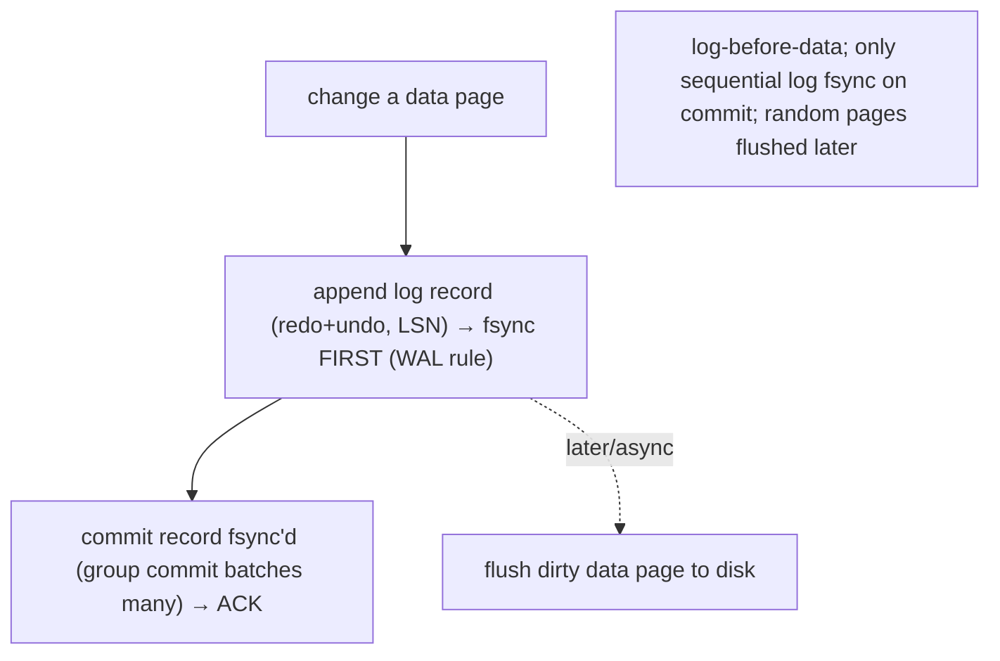
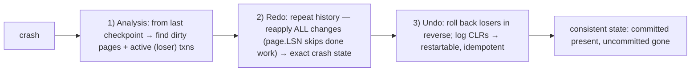

# Lesson 5.3.1 — Write-Ahead Logging, Checkpoints, and Crash Recovery (ARIES-Style Concepts)

> Part 5: Databases · Module 5.3: Durability & Recovery · Difficulty: 🔴⚫
>
> **Prerequisites:** [4.1.2 fsync/WAL/page cache], [4.2.2 B-trees/WAL], [5.2.1 ACID (A & D)].
> **Unlocks:** [5.4.2 replication/failover], [Part 10 replication/log shipping], [Part 11 RPO/DR], [Part 9 CDC].

---

## 1. Learning Objectives

After this lesson you will be able to:

- Explain how the **write-ahead log (WAL)** provides **Atomicity and Durability** (5.2.1) — the WAL rule, why log-before-data, and group commit.
- Explain **checkpoints** (bounding recovery time by periodically flushing dirty pages) and the recovery-time vs runtime-overhead tradeoff.
- Walk the **ARIES-style crash recovery** phases — **analysis → redo → undo** — and the principles **WAL, repeating history, and logging undos (CLRs)**.
- Connect the WAL to **replication, point-in-time recovery, and CDC** (the log is reused far beyond crash safety).

---

## 2. Motivation — How a database survives being killed mid-write

A database can be **killed at any instant** — power loss, OS crash, `kill -9` — possibly **in the middle** of writing a transaction's changes across multiple pages (4.2.2). When it restarts, it must restore a **consistent state**: every **committed** transaction's effects present (Durability), and every **uncommitted** transaction's partial effects erased (Atomicity). Doing this correctly and quickly, despite the page cache (4.1.2) holding un-flushed changes and the disk possibly containing a half-applied mess, is the **crash recovery** problem — one of the deepest and most elegant in databases.

The answer, foreshadowed in 4.1.2 and 4.2.2, is the **write-ahead log (WAL)**: append every change to a **sequential log and make it durable (fsync) *before* modifying data pages**, so recovery can **replay** the log to redo committed work and **undo** uncommitted work. **ARIES** (Algorithms for Recovery and Isolation Exploiting Semantics, Mohan et al., IBM) is the canonical recovery method that virtually every relational database's recovery is based on, built on three principles: **write-ahead logging**, **repeating history during redo**, and **logging changes during undo**.

This isn't academic: it's *why* committed data survives crashes, *why* recovery is fast (checkpoints), and the **same log** powers **replication** (ship the WAL to replicas — 5.4.2, Part 10), **point-in-time recovery**, and **change data capture** (Part 9). Understanding it ties together durability (4.1.2), B-tree updates (4.2.2), and ACID's A+D (5.2.1), and it's foundational for replication, DR/RPO (Part 11), and the log-centric architectures of Part 9.

---

## 3. Theory — From first principles

### 3.1 The problem: in-place updates + volatile cache + crashes

Recall (4.1.2/4.2.2): databases update data **pages in place**, but writes first land in the **volatile page cache/buffer pool** and are flushed to disk **asynchronously**. So at a crash, disk may have `[CS]`:
- **Committed changes not yet flushed** (in cache, lost) → must be **redone** (Durability).
- **Uncommitted changes already flushed** (eagerly written, e.g., under memory pressure) → must be **undone** (Atomicity).

Recovery must reconstruct a consistent state from whatever's on disk + the log. The WAL is the durable record that makes this possible.

### 3.2 The write-ahead log and the WAL rule

The **WAL** is an **append-only, sequential log** of every change, written to durable storage `[CS]`. Each **log record** describes a change (typically both **redo** info — how to reapply — and **undo** info — how to reverse), tagged with a **LSN (Log Sequence Number)** — a monotonically increasing id giving a total order to log records.

**The WAL rule (write-ahead):** a log record describing a change must be **durable (fsync'd) *before*** the corresponding **data page** is written to disk `[CS]`. And a transaction's **commit record** must be durable **before** the commit is acknowledged. Why:
- If the data page is written but we crash before logging, recovery wouldn't know how to undo it → corruption.
- Logging first means the log always contains enough info to **redo or undo** whatever state the data pages are in.

Because the WAL is **sequential** (4.1.1) and only the **log** needs fsync on commit (not the scattered random data pages), durability is **fast**, and **group commit** batches many transactions' commit records into **one fsync** to amortize the cost (4.1.2). The slow random data-page writes happen **later/asynchronously** — this is the core efficiency of WAL-based durability.

### 3.3 Checkpoints — bounding recovery time

If recovery had to replay the **entire** log from the beginning of time, restart would take forever. **Checkpoints** bound it `[CS]`: periodically, the database records a **checkpoint** in the log and ensures dirty pages up to some point are flushed to disk, so recovery only needs to consider log records **after the last checkpoint** (plus tracking of what was still dirty/active).
- **Tradeoff:** frequent checkpoints → **faster recovery** but **more runtime I/O** (flushing dirty pages often); infrequent → less overhead but **longer recovery**. A tunable knob (recovery-time objective vs throughput — Part 17).
- Modern (ARIES-style) **fuzzy checkpoints** don't stop the world — they record a checkpoint while transactions continue, noting the set of **dirty pages** and **active transactions** so recovery knows where to start.

### 3.4 ARIES recovery: analysis → redo → undo

After a crash, ARIES recovers in **three phases** `[CS]`:

1. **Analysis** — scan forward from the **last checkpoint** to the end of the log to determine the **state at crash**: which transactions were **active/uncommitted** (must be undone), and which **dirty pages** might need redo (the **Dirty Page Table** and **Transaction Table** are reconstructed). This identifies the **starting point** for redo and the set of **losers** (uncommitted transactions) to undo.

2. **Redo (repeat history)** — replay log records from the appropriate start point, **reapplying *all* changes** — *both* committed **and** uncommitted — to bring the database to the **exact state it was in at the moment of the crash**. (Using the **LSN stored on each page** to skip changes already on disk: if `page.LSN ≥ log record's LSN`, the change is already applied — skip it. This makes redo **idempotent**.) The principle is **"repeating history"**: reconstruct the precise crash-time state first, *then* clean up.

3. **Undo (rollback losers)** — roll back all **uncommitted** ("loser") transactions by applying their **undo** info in reverse LSN order, removing their effects → restoring atomicity. Crucially, ARIES **logs the undo operations themselves** as **Compensation Log Records (CLRs)**, so that if the system **crashes *during* recovery**, recovery is **restartable** and won't redo already-undone work (CLRs are redo-only and point past the work they compensate). This makes recovery itself crash-safe.

**Result:** committed transactions are present (redo), uncommitted ones are gone (undo) — a consistent state — and the process tolerates crashes during recovery.

### 3.5 The three ARIES principles (the takeaways)

ARIES rests on three ideas worth remembering `[CS]`:
1. **Write-Ahead Logging:** log a change durably before writing its data page (§3.2).
2. **Repeating history during redo:** on restart, **redo everything** (even uncommitted) to reconstruct the exact crash-time state, *then* undo losers — simpler and more robust than trying to be selective.
3. **Logging changes during undo (CLRs):** record undo actions in the log so recovery is **idempotent and restartable** (crash-during-recovery safe).

These give correct, efficient, restartable recovery — why ARIES (and its descendants) underpin essentially all major relational databases.

### 3.6 The log is reused far beyond recovery

The WAL turns out to be a **central asset**, not just a crash-safety mechanism `[CS]`:
- **Replication:** stream the WAL to replicas, which **replay** it to stay in sync (physical/logical log shipping) — the basis of leader-follower replication (5.4.2, Part 10).
- **Point-in-time recovery (PITR):** restore a backup + replay the WAL up to a chosen time → recover to any moment (Part 11 DR).
- **Change Data Capture (CDC):** read the log to stream **row-level changes** to other systems (search indexes, caches, warehouses, event pipelines) — the robust polyglot-sync mechanism (5.1.3, Part 9).
- **The log as source of truth** — this "the log is the database" idea is central to log-structured engines (4.2), Kafka (Part 9), and event sourcing (Part 12).

So mastering the WAL pays off across replication, DR, and streaming — not just recovery.

### 3.7 Durability tuning and its limits

Durability has knobs (4.1.2) `[CS]`:
- **Synchronous commit** (fsync the WAL before ack) = maximum safety, slower; **group commit** amortizes; **asynchronous/relaxed** = faster but a **crash-loss window** (recent commits in cache lost) — your **RPO** (Recovery Point Objective, Part 11).
- A **single node's** WAL doesn't protect against **disk/node loss** — true durability at scale requires **replication** to other nodes/regions (Part 10/11). WAL = node-local durability; replication = system durability.

---

## 4. Visual Intuition

### WAL rule + group commit

### ARIES three phases

---

## 5. Real-World Analogy

Imagine a **meticulous accountant** keeping ledgers, who might be interrupted at any second.

- Before changing any figure in the **bound ledgers** (data pages), the accountant **first writes the intended change in a running journal by the door** (the WAL): "set account 7 to $500 (was $300)" — recording both the **new** value (redo) and the **old** one (undo). They only write in the ledgers *after* the journal entry is safely inked. That's the **write-ahead rule**.
- A customer's transfer isn't considered **done** until the **journal entry for it is fully inked** (commit record durable) — and to save trips, the accountant inks several customers' entries **in one batch** (group commit).
- Periodically, the accountant **reconciles the ledgers up to date and marks a bookmark in the journal** ("everything before here is fully posted") — a **checkpoint** — so that after any disaster they need only re-read the journal **from the bookmark**, not from the dawn of time.
- After a **fire alarm mid-work** (crash), the accountant recovers in three passes: **(1) Analysis** — read from the bookmark to figure out which transfers were in progress; **(2) Redo "repeat history"** — re-apply **every** journaled change (even half-finished ones) to make the ledgers exactly match the moment of the alarm (skipping entries the ledger already shows); **(3) Undo** — then reverse the **unfinished** transfers using the recorded old values — *and they journal these reversals too* (CLRs), so if a **second** alarm hits mid-cleanup, they don't undo things twice.
- Finally, that same journal is so valuable that the accountant **mails copies to branch offices** (replication), can **reconstruct the books to any past date** (point-in-time recovery), and lets the **reporting team tail it** for live updates (CDC). The journal, it turns out, is the heart of the whole operation.

---

## 6. Industry Example

- **ARIES-based recovery everywhere** `[CS]`: Postgres, MySQL/InnoDB, SQL Server, Oracle (representative) implement WAL/redo logging + analysis/redo/undo recovery descended from ARIES — the bedrock of relational durability.
- **WAL drives replication** `[CONV]`: Postgres streaming replication ships the WAL to replicas; MySQL uses the binlog (+ redo) for replication and PITR — the same log reused (5.4.2, Part 10).
- **Group commit + durability knobs** `[CONV]`: databases batch commits into one fsync and expose synchronous/async commit settings trading RPO for throughput (4.1.2, Part 11/17).
- **CDC from the log** `[CONV]`: Debezium and similar read the database's WAL/binlog to stream changes to Kafka/search/caches (polyglot sync — 5.1.3, Part 9).
- **Checkpoint tuning** `[BP]`: DBAs tune checkpoint frequency (e.g., Postgres `checkpoint_timeout`/`max_wal_size`) to balance recovery time vs write I/O spikes (Part 17).

---

## 7. Implementation Details — durability & recovery in practice

- **Trust the WAL for node-local durability**, but configure it deliberately: **synchronous commit** for systems of record; **group commit** is usually on; relaxed/async only for low-value data (know the **RPO** crash-loss window — Part 11).
- **Tune checkpoints** to balance recovery time vs runtime I/O — and watch for **checkpoint I/O spikes** (a common latency cause; spread them out — Part 17).
- **For real durability against disk/node loss, replicate** — WAL alone doesn't survive a dead disk; use synchronous/semisync replication or multi-region per your RPO/RTO (5.4.2, Part 10/11).
- **Use the WAL for replication, PITR, and CDC** — don't reinvent change capture; tail the log (CDC) for polyglot sync (5.1.3, Part 9).
- **Keep transactions short** — long transactions delay checkpoints/log truncation and hold undo info (interacts with MVCC bloat — 5.2.4); watch **WAL growth** if a replica or long transaction prevents truncation.
- **Test recovery/DR** — verify backups + WAL replay restore correctly (don't discover broken backups during an incident, Part 11/14).
- **Monitor** WAL size/lag, checkpoint frequency, replication lag, recovery time (Part 16).

## 8. Advantages

- **Atomicity + Durability** correctly and efficiently — committed survives, uncommitted erased, despite crashes (5.2.1).
- **Fast durable commits** — sequential WAL + group commit (random data writes deferred — 4.1.2).
- **Bounded, restartable recovery** — checkpoints limit replay; CLRs make recovery crash-safe (idempotent).
- **The log as a multi-purpose asset** — replication, PITR, CDC, audit (Part 9/10/11).
- **Tunable** — durability and checkpoint knobs trade safety/recovery-time vs performance.

## 9. Disadvantages / costs

- **Write amplification** — each change written to log *and* data page (4.1.2).
- **fsync latency** — durability tax on commit (mitigated by group commit) (4.1.2).
- **Checkpoint I/O spikes** — flushing dirty pages can cause latency bursts (Part 17).
- **Recovery time** — after a crash, redo/undo takes time (bounded by checkpoint frequency) → affects failover RTO (Part 11).
- **Single-node limit** — WAL doesn't protect against disk/node loss (need replication — Part 10/11).
- **Operational complexity** — WAL growth, truncation, replication lag, long-transaction interactions.

---

## 10. When NOT to (or limits)

- **Purely in-memory/ephemeral or derivable data** — full WAL durability may be unnecessary; accept loss for speed (be explicit, 1.1.5).
- **Don't rely on single-node WAL for disaster durability** — disk/node/region loss needs replication/backups (Part 11) — WAL is necessary, not sufficient.
- **Don't over-checkpoint** for marginal recovery-time gains at the cost of throughput (or under-checkpoint and suffer long recovery) — tune to RTO needs.
- **Managed databases** handle WAL/recovery for you — you tune durability/replication settings and **must understand the guarantees**, not implement recovery.

---

## 11. Common Mistakes

1. **Assuming single-node durability = disaster-proof** — a dead disk loses the WAL too; need replication/backups (Part 11).
2. **Misconfigured async/relaxed durability** — silently widening the crash-loss window (RPO) (4.1.2).
3. **Ignoring checkpoint tuning** — I/O spikes hurting latency, or rare checkpoints making recovery (and failover RTO) slow (Part 17).
4. **Long-running transactions** — blocking WAL truncation / delaying recovery / MVCC bloat (5.2.4).
5. **Untested backups/recovery** — discovering broken PITR during a real incident (Part 14).
6. **Reinventing CDC** instead of tailing the WAL (5.1.3, Part 9).
7. **Letting WAL fill the disk** — replica down or archiving stuck preventing truncation → outage.

---

## 12. Interview Questions

**🟢 Easy**
- What is a write-ahead log, and which ACID properties does it provide?
- Why must the log record be durable before the data page is written (the WAL rule)?

**🟡 Medium**
- What problem do checkpoints solve, and what's the tradeoff in checkpoint frequency?
- Walk through the three ARIES recovery phases at a high level.

**🔴 Hard**
- Why does ARIES "repeat history" (redo even uncommitted changes) before undoing? What do Compensation Log Records achieve?
- Explain how the same WAL powers crash recovery, replication, and point-in-time recovery (5.4.2, Part 10/11).

**⚫ Staff+**
- Design durability + recovery for a financial system with strict RPO/RTO: synchronous commit vs group commit, checkpoint tuning, synchronous replication, and DR — defend each tradeoff (Part 11).
- Discuss the WAL as "the log is the system" idea connecting recovery, CDC, replication, log-structured storage (4.2), and event sourcing (Part 9/12). Where does this unification break down or add complexity?

---

## 13. Production Pitfalls

- **Data loss from relaxed durability:** async commit set "for performance" loses recent commits on crash (unexpected RPO) (4.1.2).
- **Slow failover (RTO):** infrequent checkpoints → long crash-recovery replay → extended downtime after a crash/failover (Part 11).
- **Checkpoint latency spikes:** bursty dirty-page flushes causing p99 spikes (Part 17) — spread/tune checkpoints.
- **WAL fills the disk:** a down replica or stuck archiver prevents WAL truncation → disk full → database stops (a classic incident).
- **MVCC bloat + recovery drag from long transactions:** old undo/versions retained, slow truncation (5.2.4).
- **Broken backups discovered too late:** PITR/restore never tested, fails during a real disaster (Part 14).

---

## 14. Optimization Techniques

- **Group commit** to amortize fsync; tune **synchronous vs async** durability to data value/RPO (4.1.2, Part 11).
- **Tune checkpoint frequency/spreading** to balance recovery time (RTO) vs write-I/O smoothness (Part 17).
- **Replicate the WAL** (streaming/semisync) for durability + read scaling + fast failover (5.4.2, Part 10).
- **Use WAL-based CDC** for efficient, reliable change propagation (5.1.3, Part 9) instead of polling/dual writes.
- **Keep transactions short** to enable timely WAL truncation, faster recovery, and less MVCC bloat (5.2.4).
- **Monitor & alert** on WAL size/growth, replication lag, checkpoint timing, and recovery duration (Part 16).
- **Regularly test restore/PITR/failover** (game days) so RTO/RPO are real, not theoretical (Part 11/14).

---

## 15. Summary

Crash recovery answers: after the database is killed mid-write, how do we restore a state where **every committed transaction's effects are present (Durability)** and **every uncommitted transaction's effects are gone (Atomicity)**? The mechanism is the **write-ahead log (WAL)** — an append-only, **sequential**, LSN-ordered log of changes (with **redo** and **undo** info) governed by the **WAL rule**: a change's **log record must be durable (fsync) before its data page is written**, and a **commit record must be durable before acking commit**. Because only the **sequential log** needs fsync on commit (with **group commit** amortizing it) while scattered data pages flush **later**, WAL-based durability is **fast** (4.1.2). **Checkpoints** bound recovery time by periodically flushing dirty pages and marking a log position, trading runtime I/O against recovery speed (RTO). **ARIES** recovers in three phases — **Analysis** (find dirty pages + uncommitted "loser" transactions from the last checkpoint), **Redo** (**"repeat history"**: reapply *all* logged changes, using per-page LSNs to skip already-applied work, reconstructing the exact crash-time state), and **Undo** (roll back losers, **logging Compensation Log Records** so recovery is **idempotent and restartable** if it crashes again) — resting on three principles: **write-ahead logging, repeating history, and logging undos**. Crucially, the **same WAL** is reused far beyond crash safety: **replication** (ship/replay the log — 5.4.2, Part 10), **point-in-time recovery** (Part 11), and **change data capture** (stream row changes — 5.1.3, Part 9) — the "log is the system" idea unifying storage engines (4.2), Kafka (Part 9), and event sourcing (Part 12). The practical caveats: **single-node WAL gives node-local durability only** (disk/node loss needs **replication** — Part 10/11), durability/checkpoint **knobs trade safety/recovery-time for throughput** (mind your **RPO/RTO**), and operational issues (WAL growth, checkpoint spikes, long-transaction drag, untested backups) cause real incidents. This completes the durability story begun in 4.1.2 and realizes ACID's **A + D** (5.2.1), feeding directly into replication and DR (5.4.2, Part 10/11).

---

## 16. Revision Notes (flashcard-ready)

- **Q:** What does the WAL provide? **A:** Atomicity + Durability — a durable, sequential, LSN-ordered record of changes (redo+undo).
- **Q:** The WAL rule? **A:** Log record durable (fsync) **before** writing the data page; commit record durable before acking commit.
- **Q:** Why is WAL durability fast? **A:** Only the sequential log is fsync'd on commit (group commit); random data pages flushed later/async.
- **Q:** What do checkpoints do? **A:** Periodically flush dirty pages + mark a log position → recovery starts from last checkpoint (bounds RTO).
- **Q:** ARIES three phases? **A:** Analysis (find dirty pages + loser txns) → Redo (repeat history: reapply ALL) → Undo (roll back losers, log CLRs).
- **Q:** Why "repeat history" (redo uncommitted too)? **A:** Reconstruct exact crash-time state first (using page LSN to skip done work), then undo losers — simpler/robust.
- **Q:** What are CLRs? **A:** Compensation Log Records — log the undo actions so recovery is idempotent + restartable (crash-during-recovery safe).
- **Q:** Three ARIES principles? **A:** Write-ahead logging; repeating history during redo; logging changes during undo.
- **Q:** Other uses of the WAL? **A:** Replication (ship/replay), point-in-time recovery, CDC — "the log is the system."
- **Q:** WAL durability limit? **A:** Node-local only; disk/node/region loss needs replication/backups (Part 10/11) — and tune sync vs async (RPO).

---

## 17. Further Reading + Knowledge-Graph Links

**Within this platform**
- **Builds on:** [4.1.2 fsync/WAL/page cache], [4.2.2 B-trees/WAL], [5.2.1 ACID A+D]. **Next:** [5.3.2 Query Execution & Optimization].
- **Reused by:** [5.4.2 Replication/Failover] (log shipping), [Part 10 Replication] (leader-follower, log replay), [Part 11 Fault Tolerance] (RPO/RTO, DR, PITR), [Part 9 Messaging] (CDC, the log).
- **Relates to:** [4.2.x storage engines] (LSM also log-based), [5.2.4 MVCC] (undo/versions), [Part 12] (event sourcing).

**Foundational texts (synthesized)**
- Mohan et al., *ARIES* (synthesized) — WAL, repeating history, CLRs, analysis/redo/undo.
- Silberschatz et al., *Database System Concepts* — recovery, logging, checkpoints.
- Kleppmann, *Designing Data-Intensive Applications* — WAL, replication via log, CDC.

**Concept tags:** `[CS]` write-ahead logging, WAL rule, LSN, checkpoints, ARIES (analysis/redo/undo), repeating history, CLRs · `[CONV]` group commit, WAL-driven replication/PITR/CDC, checkpoint tuning · `[BP]` replicate for real durability, tune durability to RPO, tune checkpoints to RTO, test restore/failover.
