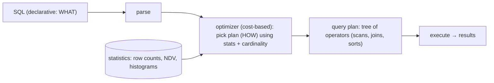
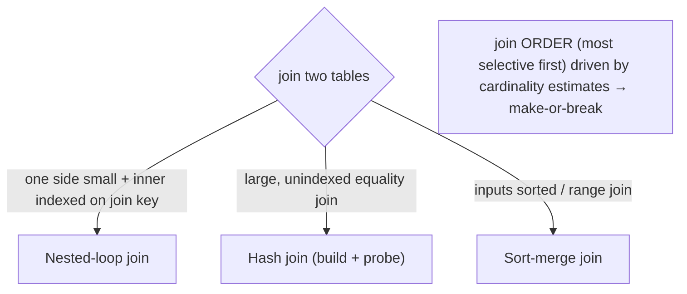

# Lesson 5.3.2 — Query Execution & Optimization Basics (Planning, Joins, Cardinality)

> Part 5: Databases · Module 5.3: Durability & Recovery · Difficulty: 🔴
>
> **Prerequisites:** [4.2.5 indexing], [4.2.2 B-trees], [4.1.1 sequential vs random I/O], [5.1.2 schema design].
> **Unlocks:** [5.4.x operation], [Part 17 performance/N+1], [Part 18 search], [Part 6 caching].

---

## 1. Learning Objectives

After this lesson you will be able to:

- Describe the **query processing pipeline**: parse → plan/optimize → execute, and what a **query plan** is.
- Explain how a **cost-based optimizer** chooses a plan using **statistics** and **cardinality estimates**, and why estimates can go wrong.
- Recognize the core **physical operators** — scans (seq/index), **join algorithms** (nested-loop, hash, merge), sorts, aggregations — and their costs.
- Read an **`EXPLAIN`** plan and diagnose common problems (full scans, bad join order, cardinality misestimates, the N+1 problem) (Part 17).

---

## 2. Motivation — Why the same query can be 1ms or 10s

SQL is **declarative**: you state *what* data you want, not *how* to get it. The database's **query optimizer** decides the *how* — which indexes to use (4.2.5), in what **order to join** tables, which **join algorithm** to apply, whether to scan or seek. That decision can change a query's cost by **orders of magnitude**: the right plan reads a few index pages; the wrong one scans millions of rows or joins in a catastrophic order. The optimizer is one of the most sophisticated parts of a database, and understanding how it thinks — and where it goes wrong — is the core skill of **query performance tuning** (Part 17).

The optimizer is **cost-based**: it estimates the cost of candidate plans using **statistics** about the data (row counts, value distributions) and **cardinality estimates** (how many rows each step produces), then picks the cheapest. When statistics are **stale** or estimates are **wrong** (correlated columns, skew), it picks a **bad plan** — the root cause of many "the query suddenly got slow" incidents. Knowing how to read `EXPLAIN`, keep statistics fresh, index appropriately (4.2.5), and avoid anti-patterns like **N+1 queries** turns mysterious slowness into a solvable problem.

This lesson connects indexing (4.2.5), storage access (4.1.1), and schema design (5.1.2) into the runtime behavior of queries — essential for performance engineering (Part 17) and for understanding why your database does what it does.

---

## 3. Theory — From first principles

### 3.1 The query processing pipeline

A query goes through stages `[CS]`:
1. **Parse** — check syntax, resolve table/column names → an abstract syntax tree / logical representation.
2. **Rewrite/optimize (planning)** — transform into an efficient **query plan**: choose access methods (index vs scan), join order, join algorithms, etc. This is the **optimizer's** job.
3. **Execute** — run the chosen physical plan (a tree of **operators**) to produce results, reading pages via the buffer pool (4.1.2).

The **query plan** is a tree of physical operators (scans, joins, sorts, aggregations) describing exactly *how* the query will run. `EXPLAIN` shows it; `EXPLAIN ANALYZE` runs it and shows actual vs estimated rows/timings.

### 3.2 Cost-based optimization, statistics, and cardinality

Modern optimizers are **cost-based (CBO)** `[CS]`: they enumerate candidate plans and estimate each plan's **cost** (an abstract measure of I/O + CPU), choosing the cheapest. Cost depends on **how many rows** flow through each operator — the **cardinality estimate**.

- **Statistics:** the database maintains stats about each table/column — **row counts**, **number of distinct values (NDV)**, **histograms** of value distributions, null fractions — gathered by `ANALYZE`/auto-stats `[CS]`.
- **Cardinality estimation:** using stats, the optimizer estimates how many rows each predicate/join produces (e.g., "`WHERE status='active'` selects ~10% → 10k rows"). These estimates drive **index choice** (selectivity — 4.2.5), **join order**, and **join algorithm**.
- **Selectivity:** the fraction of rows a predicate passes; high selectivity (few rows) favors index use; low selectivity (most rows) favors a scan (4.2.5).

**The fragility:** estimates assume **uniformity and independence**. They break on `[CS]`:
- **Stale statistics** (data changed since last `ANALYZE`) → wrong row counts → bad plans.
- **Correlated columns** (e.g., `city` and `zip`) — the optimizer multiplies selectivities assuming independence, drastically misestimating.
- **Skew** (a few values dominate) — uniform assumption fails.
- **Complex predicates / functions** the optimizer can't estimate well.

A cardinality misestimate **early** in a plan (e.g., underestimating a join's output) **cascades**, producing a catastrophically wrong plan (e.g., choosing nested-loop join expecting 10 rows but getting 10M). This is the **#1 cause of optimizer-driven slowness** (Part 17).

### 3.3 Access methods (scan vs seek)

How a single table is read `[CS]`:
- **Sequential / full table scan:** read every row. Efficient for **low-selectivity** queries (need most rows) and exploits **sequential I/O** (4.1.1). Bad when you need few rows from a huge table.
- **Index scan / seek:** use an index (4.2.5) to find matching rows — great for **high-selectivity** predicates; an **index-only (covering)** scan avoids fetching the row entirely (4.2.5). Index scans do **random I/O** to fetch rows (unless covering), so fetching *many* rows via an index can be **slower** than a sequential scan (the optimizer weighs this).
- The optimizer chooses scan vs index based on **estimated selectivity** — which is why a missing/ignored index or a bad estimate causes full scans (4.2.5).

### 3.4 Join algorithms

Joining two tables can be done several ways; the optimizer picks based on sizes, indexes, and sort order `[CS]`:

- **Nested-loop join:** for each row in the outer table, look up matching rows in the inner (ideally via an index). **Great when one side is small** and the inner has an index on the join key; **catastrophic** when both are large and unindexed (O(n·m)). The N+1 problem (§3.6) is essentially a nested-loop done badly at the application layer.
- **Hash join:** build a **hash table** on the (smaller) side's join key, then **probe** it with the other side. **Great for large, unindexed equality joins**; needs memory for the hash table (spills to disk if too big). Equality joins only.
- **Sort-merge join:** **sort** both sides by the join key, then **merge** them in order. Good when inputs are **already sorted** (e.g., from index order) or for large joins / range/inequality conditions; sorting is the cost if not pre-sorted.

**Join order matters enormously:** joining the most **selective** (smallest-output) tables first keeps intermediate results small; a bad order explodes intermediate row counts (the optimizer's hardest job, driven by cardinality estimates — §3.2).

### 3.5 Other operators

- **Sort** — for `ORDER BY`, merge joins, distinct, grouping; expensive (CPU + possibly disk spill) unless an index provides order (4.2.5).
- **Aggregation** (`GROUP BY`, `COUNT`, `SUM`) — hash-based or sorted; can be expensive over many rows (precompute/materialize for hot aggregates — 5.1.2).
- **Filter, projection, limit** — applied as early as possible to reduce rows flowing upward.

### 3.6 The N+1 query problem (the classic application anti-pattern)

A pervasive performance bug, often from ORMs `[CS]`: to load N parent objects and their children, the code issues **1 query for the parents + N queries (one per parent) for children** = **N+1 round trips** — instead of **1 join** or **1 batched query**. With N in the hundreds/thousands, this is a latency disaster (each query is a round trip — 3.3.4, 4.1.1).
- **Fix:** a **single join**, an `IN (...)` batched query, or ORM **eager loading / batching** (DataLoader — also the GraphQL fix, 3.2.6).
- It's so common it deserves its own name; recognizing it is core to performance work (Part 17).

### 3.7 Reading EXPLAIN and tuning

`EXPLAIN [ANALYZE]` reveals the plan and (with ANALYZE) actual vs estimated rows/time `[BP]`. Diagnose:
- **Seq Scan on a big table** where you expected an index → missing/unusable index or non-sargable predicate (4.2.5).
- **Estimated rows ≫/≪ actual rows** → cardinality misestimate → stale stats / correlation / skew (§3.2).
- **Nested loop with a large inner** → bad join choice from a misestimate.
- **Sort/hash spilling to disk** → insufficient work memory or missing index for order.

**Tuning levers (Part 17):** keep **statistics fresh** (ANALYZE), add/fix **indexes** (4.2.5) and make predicates **sargable**, **rewrite** queries (avoid functions on columns, reduce returned columns/rows), fix **N+1** with joins/batching, increase work memory for sorts/hashes, and as a last resort use **optimizer hints / plan guides** (vendor-specific) to force a plan.

### 3.8 OLTP vs OLAP execution (brief)

Execution patterns differ by workload (5.1.3) `[CS]`: **OLTP** queries are small, selective, index-driven (point/short-range lookups → nested-loop/index seeks); **OLAP** queries scan/aggregate huge data (→ sequential scans, hash joins, parallel execution, **columnar** storage — 4.1.1/5.1.3). The optimizer and execution engine are tuned differently; this is part of why you separate OLTP and OLAP stores (5.1.3).

---

## 4. Visual Intuition

### Pipeline + cost-based planning

### Join algorithm choice

---

## 5. Real-World Analogy

Think of asking a **librarian** (the optimizer) to fetch "all books by authors from Berlin published after 2010."

- You state **what** you want (declarative SQL); the librarian figures out **how**. They could **walk every shelf** (full scan) — fine if most books qualify, terrible if few do — or use the **author-location card catalog** (index seek) to jump straight to Berlin authors — great if that's a small set.
- To combine two lists ("Berlin authors" and "post-2010 books"), they choose a method: if the **Berlin-authors list is tiny**, they take each author and look up their books (**nested-loop** with an index) — fast. If **both lists are huge**, they instead **build a quick lookup pile** of one list and run the other against it (**hash join**), or **sort both and zip them together** (**merge join**). And they're smart to **start from the smallest list** (join order) so they never haul around a giant pile.
- Their decisions rely on a **mental estimate of how many books match** (cardinality), based on their **sense of the collection** (statistics). If the catalog is **out of date** (stale stats) or their hunch is wrong ("I assumed Berlin authors are rare, but actually half the library is Berlin authors"), they pick a **terrible strategy** and the search drags — exactly how a database picks a bad plan.
- The **N+1 problem** is the rookie clerk who, asked for 100 authors and their books, **makes 100 separate trips** to the catalog (one per author) instead of one well-planned sweep — technically correct, absurdly slow.

`EXPLAIN` is asking the librarian to **describe their plan before fetching**, so you can catch "you're about to walk every shelf" and hand them the right catalog (index) instead.

---

## 6. Industry Example

- **Cost-based optimizers** `[CS]`: Postgres, MySQL, SQL Server, Oracle (representative) all use cost-based optimization with table/column statistics and cardinality estimation to choose plans.
- **`EXPLAIN ANALYZE` as the tuning tool** `[BP]`: the universal first step in query tuning — compare **estimated vs actual** rows to spot cardinality misestimates and bad plans (Part 17).
- **Stale-stats incidents** `[CONV]`: a classic "query suddenly slow" cause is outdated statistics after a big data change → the optimizer picks a bad plan until `ANALYZE` runs (auto-vacuum/auto-analyze tuning).
- **N+1 from ORMs** `[CONV]`: a ubiquitous real-world performance bug; fixed via eager loading / `JOIN` / batch loading (DataLoader) — the same batching idea as GraphQL resolvers (3.2.6, Part 17).
- **Columnar OLAP engines** `[CS]`: analytics databases (BigQuery/Redshift/Snowflake, columnar — 5.1.3) use sequential scans, hash joins, and massive parallelism — different execution from OLTP index seeks.

---

## 7. Implementation Details — getting good plans

- **Keep statistics fresh** — ensure `ANALYZE`/auto-stats run after significant data changes; stale stats are a top cause of bad plans (§3.2, Part 17).
- **Index for the query** (4.2.5) — provide indexes matching predicates/join keys/sort orders; ensure predicates are **sargable** (no functions/casts on indexed columns) so the optimizer can use them.
- **Use `EXPLAIN ANALYZE`** to verify plans: look for unexpected **seq scans**, **estimate vs actual** divergence, **nested loops with large inners**, **disk spills**.
- **Fix N+1** with joins or batched (`IN`) queries / ORM eager loading (the single most common app-level fix — Part 17).
- **Help the optimizer with correlated columns/skew** — extended/multi-column statistics where supported; or restructure queries.
- **Tune work memory** for sorts/hash joins to avoid disk spills (Part 17), within limits.
- **Precompute/materialize** hot aggregates/joins (5.1.2 materialized views) when query-time computation is too expensive.
- **Separate OLTP and OLAP** (5.1.3) — don't run heavy analytical scans on the operational DB.
- **Use hints/plan guides sparingly** (vendor-specific) only when the optimizer is reliably wrong — they're brittle.

## 8. Advantages (of the optimizer model)

- **Declarative SQL** — you state intent; the optimizer finds an efficient plan (huge productivity win).
- **Adapts to data** — uses statistics to pick good plans as data changes/grows.
- **Reuses indexes/access methods automatically** — no manual access-path coding.
- **`EXPLAIN` transparency** — you can inspect and tune plans.

## 9. Disadvantages / costs

- **Estimate fragility** — stale stats, correlation, skew → bad plans, sudden slowness (§3.2).
- **Plan instability** — the same query can flip to a worse plan after data/stats changes (surprising regressions).
- **Complexity** — understanding plans/operators requires expertise.
- **Optimizer limits** — complex queries, functions, and correlated predicates defeat estimation.
- **N+1 and app-side joins** — the optimizer can't help if the application issues many small queries (Part 17).

---

## 10. When NOT to (or limits)

- **Don't micro-optimize cold/rare queries** — focus tuning on hot, frequent, or slow-at-scale queries (measure first, Part 17).
- **Don't force plans with hints prematurely** — fix stats/indexes/queries first; hints are brittle and a last resort.
- **Don't run analytics on the OLTP optimizer/engine** — use a columnar OLAP store for big scans/aggregations (5.1.3).
- **Don't assume the optimizer is always right** — but also don't assume it's wrong; verify with `EXPLAIN ANALYZE` before overriding.

---

## 11. Common Mistakes

1. **Stale statistics** → bad plans / sudden slowness (ensure ANALYZE runs) (§3.2).
2. **Missing/unusable indexes or non-sargable predicates** → unexpected full scans (4.2.5).
3. **N+1 queries** (often ORM) → hundreds of round trips instead of one join/batch (Part 17).
4. **Ignoring estimate-vs-actual** in `EXPLAIN ANALYZE` → missing the cardinality misestimate root cause.
5. **`SELECT *` / returning huge result sets** → unnecessary I/O, no covering-index benefit (4.2.5).
6. **Functions on indexed columns** in predicates → optimizer can't use the index (use functional indexes/rewrite).
7. **Running heavy analytics on OLTP** → bad plans + resource contention (separate, 5.1.3).
8. **Over-using hints** → brittle plans that break as data evolves.

---

## 12. Interview Questions

**🟢 Easy**
- What does a query optimizer do, and what is a query plan?
- Why can the same SQL query be fast or slow depending on the plan?

**🟡 Medium**
- What are statistics and cardinality estimates, and why do bad estimates cause bad plans?
- Compare nested-loop, hash, and merge joins. When is each chosen?

**🔴 Hard**
- Walk through diagnosing a slow query with `EXPLAIN ANALYZE`: what signals indicate a missing index, a stale-stats misestimate, or a bad join order, and how do you fix each?
- Explain the N+1 query problem, why it happens (ORMs), and three ways to fix it (join, batch/IN, eager loading) (Part 17, 3.2.6).

**⚫ Staff+**
- Why is cardinality estimation hard (correlation, skew, independence assumption), and how do misestimates cascade into catastrophic plans? What can you do (extended stats, query restructuring, hints)?
- Contrast OLTP vs OLAP query execution and why they need different storage/engines (index seeks + nested loops vs columnar scans + hash joins + parallelism) — tie to 5.1.3/4.1.1.

---

## 13. Production Pitfalls

- **"Query suddenly slow":** stale stats or a data-distribution shift flips the optimizer to a bad plan → latency spike/timeout (refresh stats; investigate plan) (Part 17).
- **N+1 latency disaster:** an endpoint issuing hundreds of queries per request (ORM lazy loading) → slow under load (fix with join/batch).
- **Full-scan under load:** a missing/ignored index (or non-sargable predicate) scanning a huge table → CPU/I-O saturation (4.2.5).
- **Hash/sort disk spills:** under-provisioned work memory causing big joins/sorts to spill to disk → slow queries (Part 17).
- **Plan regression after deploy/data growth:** a query that scaled fine flips to a bad join order at higher cardinality.
- **Analytics on OLTP:** a heavy reporting query degrading the operational database (5.1.3).

---

## 14. Optimization Techniques

- **Fresh statistics** (ANALYZE/auto-stats) — the cheapest, highest-impact fix for bad plans (§3.2).
- **Right indexes + sargable predicates** (4.2.5) — enable seeks, covering/index-only scans; avoid full scans.
- **Read `EXPLAIN ANALYZE`** and fix the root cause (estimate vs actual, scan vs seek, join order) (Part 17).
- **Eliminate N+1** with joins/batched queries/eager loading (the top app-side win).
- **Reduce data movement** — select only needed columns (covering indexes), filter/limit early, avoid `SELECT *`.
- **Extended/multi-column statistics** for correlated columns; **restructure queries** the optimizer mishandles.
- **Materialize/precompute** hot aggregates/joins (5.1.2); **cache** hot read results (Part 6).
- **Separate OLTP/OLAP** and use columnar engines for analytics (5.1.3); tune work memory for sorts/hashes.

---

## 15. Summary

SQL is **declarative** (state *what*), so the database's **query optimizer** decides *how* — the access methods (scan vs index — 4.2.5), **join order**, and **join algorithms** — and that choice swings query cost by **orders of magnitude**. The pipeline is **parse → plan/optimize → execute**, producing a **query plan** (a tree of physical operators). Modern optimizers are **cost-based**: they estimate each candidate plan's cost from **statistics** (row counts, distinct values, histograms) and **cardinality estimates** (rows produced per step), then pick the cheapest. This estimation is **fragile** — **stale statistics, correlated columns, and skew** break its uniformity/independence assumptions, and an early misestimate **cascades** into a catastrophic plan (the #1 cause of optimizer-driven slowness). The key physical operators: **scans** (sequential full scan for low-selectivity/most-rows vs index seek for high-selectivity, with covering/index-only scans avoiding row fetches — 4.2.5/4.1.1) and **joins** — **nested-loop** (small outer + indexed inner; disastrous for large unindexed both), **hash join** (large unindexed equality joins, needs memory), and **sort-merge** (pre-sorted inputs / range joins) — with **join order** (most selective first) being make-or-break. A pervasive application anti-pattern is the **N+1 query** (1 + N round trips instead of one join/batch — often from ORMs), fixed with joins, batched `IN`, or eager loading/batching (the same idea as GraphQL DataLoader — 3.2.6). The practical craft is reading **`EXPLAIN ANALYZE`** (estimated vs actual rows, unexpected seq scans, bad join order, disk spills) and applying the levers — **fresh statistics**, **right indexes + sargable predicates**, **fixing N+1**, **reducing returned data**, **materializing hot aggregates**, **tuning work memory**, and **separating OLTP from OLAP** (5.1.3) — making this the runtime culmination of indexing (4.2.5), storage access (4.1.1), and schema design (5.1.2), and the heart of database performance tuning (Part 17).

---

## 16. Revision Notes (flashcard-ready)

- **Q:** Pipeline stages? **A:** Parse → plan/optimize (choose plan) → execute (operator tree).
- **Q:** What is a cost-based optimizer? **A:** Estimates each candidate plan's cost from statistics + cardinality, picks the cheapest.
- **Q:** What drives plan choice? **A:** Cardinality estimates (rows per step) from statistics (row counts, NDV, histograms) → selectivity.
- **Q:** Why do estimates go wrong? **A:** Stale stats, correlated columns, skew (uniformity/independence assumptions break) → cascading bad plans.
- **Q:** Scan vs index seek? **A:** Seq scan for low-selectivity (most rows); index seek for high-selectivity (few rows); covering index avoids row fetch.
- **Q:** Three join algorithms? **A:** Nested-loop (small outer + indexed inner), hash join (large unindexed equality), sort-merge (sorted/range).
- **Q:** Why does join order matter? **A:** Joining most-selective first keeps intermediate results small; bad order explodes row counts.
- **Q:** N+1 problem? **A:** 1 query for parents + N for children (N round trips) instead of one join/batch — fix with join/IN/eager loading.
- **Q:** First tuning tool? **A:** `EXPLAIN ANALYZE` — compare estimated vs actual rows; spot scans/bad joins/spills.
- **Q:** Top fixes? **A:** Fresh stats, right indexes + sargable predicates, fix N+1, reduce returned data, materialize/cache, separate OLTP/OLAP.

---

## 17. Further Reading + Knowledge-Graph Links

**Within this platform**
- **Previous:** [5.3.1 WAL/Recovery]. **Builds on:** [4.2.5 Indexing], [4.2.2 B-trees], [4.1.1 sequential vs random I/O], [5.1.2 schema design]. **Concludes Module 5.3.** **Next:** [5.4.1 SQL vs NoSQL vs NewSQL] (Module 5.4 — Selection & Operation).
- **Central to:** [Part 17 Performance] (query tuning, N+1, tail latency), [5.1.3 OLTP vs OLAP], [Part 6 Caching] (when queries are too slow), [Part 18 Search] (inverted index execution).

**Foundational texts (synthesized)**
- Silberschatz et al., *Database System Concepts* — query processing, optimization, join algorithms, cost estimation.
- Kleppmann, *Designing Data-Intensive Applications* — query execution, OLTP vs OLAP, column-oriented execution.
- Database documentation (Postgres `EXPLAIN`, optimizer/statistics) — representative.

**Concept tags:** `[CS]` query plan, cost-based optimization, statistics/cardinality/selectivity, scan vs seek, nested-loop/hash/merge joins, join order · `[CONV]` EXPLAIN ANALYZE tuning, stale-stats incidents, ORM N+1 · `[BP]` keep stats fresh, index + sargable predicates, fix N+1, reduce returned data, materialize/cache, separate OLTP/OLAP.
