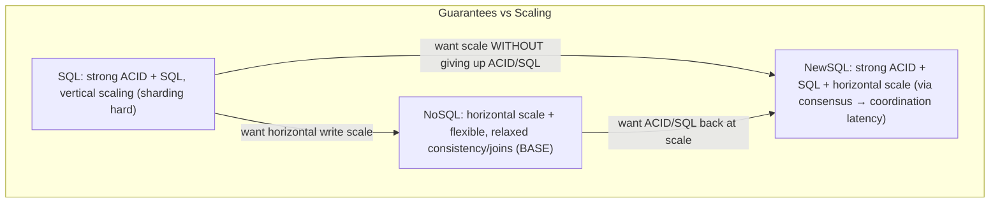
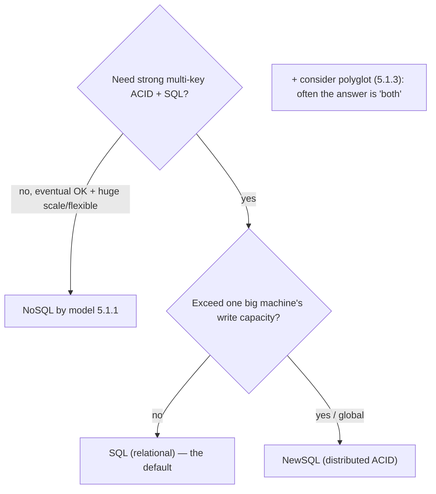

# Lesson 5.4.1 — SQL vs NoSQL vs NewSQL

> Part 5: Databases · Module 5.4: Database Selection & Operation · Difficulty: 🔴
>
> **Prerequisites:** [5.1.1 data models], [5.2.1 ACID], [4.2.4 B-tree vs LSM], [1.2.4 prioritizing characteristics].
> **Unlocks:** [5.4.2 replication/failover], [Part 7 sharding], [Part 8 consensus], [Part 10 CAP/consistency], [Part 18 case studies].

---

## 1. Learning Objectives

After this lesson you will be able to:

- Define **SQL (relational)**, **NoSQL**, and **NewSQL** databases by their guarantees, scaling model, and tradeoffs — not by hype.
- Explain *why* NoSQL arose (relational scaling/flexibility pain) and *why* NewSQL arose (wanting ACID + SQL **at horizontal scale**).
- Apply a **selection framework**: choose based on data model (5.1.1), consistency/transaction needs (5.2/Part 10), scale, and operational reality — not labels.
- Avoid the common myths ("SQL can't scale," "NoSQL is always faster/schemaless," "NewSQL is free lunch").

---

## 2. Motivation — Cutting through the biggest buzzword war in databases

"SQL vs NoSQL" is one of the most debated — and most **misunderstood** — choices in system design, and "NewSQL" added a third contender. The labels hide what actually matters: **data model** (5.1.1), **consistency/transaction guarantees** (5.2, Part 10), **scaling model** (vertical vs horizontal — Part 7), and **operational maturity**. Choosing by buzzword ("we need NoSQL to scale," "SQL is old") leads to expensive mistakes; choosing by **requirements** leads to the right tool.

The history clarifies it. **Relational/SQL** databases dominated for decades with ACID, joins, and flexible queries (5.1.1/5.2.1) — but scaling **writes horizontally** (sharding) is hard, and rigid schemas chafed. **NoSQL** arose in the 2000s (web-scale, Dynamo/Bigtable lineage) to scale out and offer flexible schemas — by **relaxing** guarantees (often dropping joins, multi-key transactions, and strong consistency for **eventual consistency** — Part 10, "BASE" — 5.2.1). That worked, but giving up ACID/SQL was painful for many apps. So **NewSQL** emerged (Spanner, CockroachDB, etc.) to provide **ACID transactions and SQL at horizontal scale**, using distributed consensus (Part 8) and clever clocks — at the cost of coordination latency.

The key truth (1.1.5): each category trades differently, and "best" depends on your **requirements**. This lesson gives the precise distinctions and a selection framework, building on data models (5.1.1), ACID/consistency (5.2), and storage engines (4.2.4), and setting up sharding (Part 7), consensus (Part 8), and CAP (Part 10).

---

## 3. Theory — From first principles

### 3.1 SQL (relational) databases

**SQL/relational** databases (Postgres, MySQL, SQL Server, Oracle) use the **relational model** (tables/SQL — 5.1.1), provide **ACID transactions** (5.2.1), **joins**, **schema enforcement**, and a mature **query optimizer** (5.3.2) `[CS]`.
- **Scaling:** primarily **vertical** (bigger machine) + **read replicas** (5.4.2); **horizontal write scaling (sharding)** is possible but **hard** (cross-shard joins/transactions are painful — Part 7).
- **Strengths:** strong consistency + transactions, flexible ad-hoc queries/joins, integrity, decades of tooling/expertise.
- **Best for:** transactional systems, complex relationships, anything needing ACID + ad-hoc queries — **the default** for most applications (5.1.1).

### 3.2 NoSQL databases

**NoSQL** ("Not Only SQL") is an umbrella for **non-relational** databases that arose to address relational **scaling and schema-flexibility** limits `[CS]`. They span the non-relational data models (5.1.1):
- **Key-value** (Redis, DynamoDB-KV), **document** (MongoDB), **wide-column** (Cassandra, HBase), **graph** (Neo4j).
- **Common (not universal) traits:** **horizontal scaling** built-in (partition/shard by key — Part 7), **flexible/no schema**, **high availability**, and often **relaxed consistency** (eventual — Part 10) and **limited/no joins and multi-key transactions** — the **BASE** philosophy (Basically Available, Soft state, Eventually consistent) trading ACID for availability/scale (5.2.1).
- **Strengths:** massive horizontal scale, high write throughput (often LSM-backed — 4.2.3), schema flexibility, availability.
- **Costs:** weaker consistency/transactions (must handle in app), no joins (denormalize/query-driven — 5.1.2), eventual-consistency complexity (Part 10).
- **Best for:** huge scale, simple/known access patterns, write-heavy/time-series, flexible schemas — when relational scaling/rigidity is the binding constraint (5.1.1).

**Important nuance:** "NoSQL" is **not** monolithic — a graph DB and a key-value store share almost nothing. And many NoSQL stores have **added** features (e.g., MongoDB multi-document transactions, secondary indexes) — the lines blur. Don't reason about "NoSQL" as one thing; reason about the **specific store and its guarantees**.

### 3.3 NewSQL databases

**NewSQL** databases aim to provide **the ACID guarantees and SQL of relational databases *with* the horizontal scalability of NoSQL** `[CS]`. Examples: **Google Spanner**, **CockroachDB**, **YugabyteDB**, **TiDB**, VoltDB (representative).
- **How:** they **shard data automatically** across nodes and use **distributed consensus** (Raft/Paxos — Part 8) for replication + **distributed transactions** (2PC + consensus), with clever techniques for consistency (Spanner's **TrueTime** uses synchronized clocks + uncertainty bounds to order transactions globally — Part 8/10).
- **Strengths:** **distributed ACID + SQL at scale**, strong consistency, horizontal scaling, often global distribution — "have your cake and eat it."
- **Costs:** **coordination latency** (consensus/cross-shard transactions add round trips — especially cross-region), operational complexity, younger ecosystems, and physics limits (you can't beat the speed of light for global strong consistency — cross-region writes are slower). NewSQL **reduces** but doesn't **eliminate** distributed-systems tradeoffs (Part 10 CAP/PACELC still applies).
- **Best for:** systems needing **both** strong transactional guarantees **and** horizontal/global scale (financial, global SaaS) — where you'd otherwise be forced to choose.

### 3.4 The three-way comparison

| | **SQL (Relational)** | **NoSQL** | **NewSQL** |
|---|---|---|---|
| Data model | relational (tables) | KV/document/wide-column/graph | relational (tables) |
| Transactions | **full ACID** | often limited / eventual (BASE) | **distributed ACID** |
| Consistency | strong | often eventual (Part 10) | strong (at coordination cost) |
| Joins/SQL | yes | usually no | yes |
| Scaling | vertical + replicas; sharding hard | **horizontal (built-in)** | **horizontal (built-in)** |
| Schema | rigid (enforced) | flexible/none | rigid (enforced) |
| Maturity/ecosystem | very mature | varies | newer |
| Cost | — | weaker guarantees | coordination latency, complexity |
| Best for | transactional, complex queries (default) | huge scale, flexible/simple access | ACID + SQL **at scale** |

### 3.5 Myths to discard

Common misconceptions `[OPINION]`/`[CONV]`:
- **"SQL can't scale."** False — relational databases scale enormously with vertical scaling, read replicas, caching (Part 6), and careful sharding; most apps **never** outgrow a well-run relational DB. The hard part is **horizontal write scaling**, not "scale."
- **"NoSQL is faster."** Only for **its** access patterns; it's faster because it **does less** (no joins, weaker consistency). For relational workloads it's often slower (app-side joins).
- **"NoSQL is schemaless = no schema needed."** There's still a schema — it's just **enforced in the application** (schema-on-read), which can cause inconsistency (5.1.1/5.1.2).
- **"NewSQL is a free lunch."** It pays in **coordination latency** and complexity; CAP/PACELC (Part 10) still applies — global strong consistency has real cost.
- **"It's SQL *vs* NoSQL."** Most real systems are **polyglot** (5.1.3) — use both for different parts.

### 3.6 The selection framework

Choose by **requirements**, in roughly this order `[BP]`:
1. **Data model / access patterns** (5.1.1): relational/complex queries → SQL/NewSQL; key/document/wide-column/graph access → matching NoSQL.
2. **Transactions & consistency** (5.2, Part 10): need strong multi-key ACID? → SQL (single-node) or **NewSQL** (at scale). Can tolerate eventual consistency? → NoSQL is an option.
3. **Scale** (Part 7): will you exceed a single (large) machine's write capacity? Most won't — if you will, horizontal scaling (NoSQL or NewSQL) matters; otherwise SQL is simpler.
4. **Operational reality:** team expertise, maturity, managed-service availability, cost — a young/complex store you can't operate is a liability (Part 14).
5. **Default to a mature relational database** unless a specific driver (scale, access pattern, flexibility, global distribution) clearly points elsewhere — and consider **polyglot** (5.1.3): the answer is often "**both**," not "either."

---

## 4. Visual Intuition

### The two-axis map

### Selection flow

---

## 5. Real-World Analogy

Think of choosing **transportation for a business**.

- **SQL (relational)** is a **reliable, full-featured car**: it does almost everything well, you know how to drive it, mechanics are everywhere, and it has every safety feature (ACID). For one family or a small fleet it's perfect. To carry *much* more, you get a **bigger car** (vertical scaling) or **more cars with copies of the cargo for reading** (read replicas) — but coordinating one shipment **split across many cars** (sharding writes) is genuinely awkward.
- **NoSQL** is a **fleet of specialized vehicles** — a fast motorbike (key-value) for quick solo deliveries, a flatbed (wide-column) for huge bulk loads, a delivery network optimized for one route. They carry **enormous volume** by adding vehicles (horizontal scale), but each is **specialized** (no general-purpose comfort), and to go that fast/big they **drop features** (no air-con, no trunk for other cargo — no joins, weaker guarantees). Great if your job matches the vehicle; clumsy if you try to use a motorbike for a family road trip.
- **NewSQL** is a **fleet of self-coordinating autonomous vehicles** that *together* behave like one giant, fully-featured car — you get the comfort and safety (ACID + SQL) **and** massive capacity (horizontal scale). The magic is the **coordination system** (consensus/synchronized clocks). The catch: all that **coordinating between vehicles takes time** (latency), especially when they're spread **across the country** (cross-region) — you can't beat the laws of physics for them to agree instantly.

And most real businesses run a **mix** — the trusty car for daily operations, specialized vehicles for bulk routes (polyglot) — rather than betting everything on one.

---

## 6. Industry Example

- **SQL still runs the world** `[CONV]`: Postgres/MySQL back the majority of transactional applications; "boring relational" is the right default for most (5.1.1/5.2.1).
- **NoSQL at web scale** `[CS]`: DynamoDB (Dynamo lineage), Cassandra/HBase (Bigtable lineage), MongoDB, Redis — built for horizontal scale, high write throughput, flexible schemas, with eventual-consistency options (Part 10/18).
- **NewSQL for ACID-at-scale** `[CS]`: Google **Spanner** (TrueTime + Paxos — global distributed SQL ACID), **CockroachDB**/**YugabyteDB** (Raft-based, Postgres-compatible), **TiDB** — used where strong transactions + horizontal/global scale are both required (Part 8/10/18).
- **NoSQL adding ACID; SQL adding scale** `[CONV]`: MongoDB added multi-document transactions; Postgres added JSONB/sharding extensions — the categories **converge**, reinforcing "judge the specific store, not the label."
- **Polyglot in practice** `[CONV]`: large systems combine relational + NoSQL + sometimes NewSQL per workload (5.1.3, Part 18).

---

## 7. Implementation Details — selecting a database

- **Start from data model + access patterns** (5.1.1) and **transaction/consistency needs** (5.2/Part 10) — these narrow the field far more than the SQL/NoSQL label.
- **Default to a mature relational database** unless a concrete driver (write-scale beyond one machine, a non-relational access pattern, schema flexibility, global strong-consistency-at-scale) points elsewhere (1.1.5).
- **Reach for NoSQL** when the **specific model** (KV/document/wide-column/graph) fits and you need horizontal scale / flexible schema / high write throughput, **and** you can tolerate its consistency/transaction limits (handle in app — Part 10).
- **Reach for NewSQL** when you need **both** strong ACID/SQL **and** horizontal/global scale — accepting **coordination latency** (benchmark cross-region writes) and a younger ecosystem.
- **Don't over-engineer for scale you don't have** — most systems run fine on relational + replicas + caching (Part 6) for a long time; sharding/NoSQL/NewSQL add complexity (Part 7).
- **Consider polyglot** (5.1.3) — often the right answer is multiple stores; weigh operational cost.
- **Evaluate operational reality** — managed service availability, team expertise, maturity, cost, failure modes (Part 14) — not just features.
- **Prototype and benchmark** with realistic data/access patterns before committing (migration is expensive).

## 8. Advantages (by category)

- **SQL:** strong ACID, joins, ad-hoc queries, integrity, mature tooling/expertise; simplest correct default.
- **NoSQL:** built-in horizontal scale, high write throughput, flexible schema, high availability; great for huge/simple/flexible workloads.
- **NewSQL:** distributed ACID + SQL at scale, strong consistency, horizontal/global scaling — avoids the "give up ACID to scale" dilemma.

## 9. Disadvantages (by category)

- **SQL:** hard horizontal write scaling (sharding), rigid schema, vertical-scaling ceiling/cost.
- **NoSQL:** weak/eventual consistency + limited transactions/joins (app burden), denormalization complexity, schema-on-read inconsistency risk, varied maturity.
- **NewSQL:** coordination latency (consensus/cross-shard/cross-region), operational complexity, younger ecosystems; still bound by CAP/PACELC (Part 10).

---

## 10. When NOT to use each

- **Don't choose NoSQL "to scale"** when a relational DB + replicas + caching would comfortably handle your load (most cases) — you'd lose ACID/joins for nothing (Part 6/7).
- **Don't force relational** onto a workload that's clearly KV/wide-column/graph at huge scale (5.1.1) — you'll fight it.
- **Don't adopt NewSQL** for single-region, moderate-scale apps where a relational DB is simpler and faster (coordination latency for nothing).
- **Don't pick a young/complex store** your team can't operate reliably — operational risk outweighs feature wins (Part 14).
- **Don't treat it as either/or** — polyglot (5.1.3) is often correct.

---

## 11. Common Mistakes

1. **Choosing by hype/label** instead of requirements (data model, consistency, scale) — the cardinal mistake.
2. **"SQL can't scale" myth** → prematurely abandoning relational for NoSQL and inheriting eventual-consistency/no-join complexity unnecessarily.
3. **"Schemaless = no schema"** → undisciplined data, app-side inconsistency (5.1.1/5.1.2).
4. **Underestimating NoSQL consistency burden** → building app-side what ACID would've given for free (lost updates, etc. — 5.2.3).
5. **Adopting NewSQL without measuring coordination latency** → surprised by cross-region write latency.
6. **Over-engineering for imaginary scale** → distributed complexity before it's needed (Part 7).
7. **Ignoring operational maturity/expertise** → a powerful DB the team can't run safely (Part 14).
8. **Treating "NoSQL" as one thing** → ignoring huge differences between KV, document, wide-column, graph (5.1.1).

---

## 12. Interview Questions

**🟢 Easy**
- What's the difference between SQL and NoSQL databases? Give one strength and one weakness of each.
- What problem does NewSQL try to solve?

**🟡 Medium**
- Why is horizontal write scaling hard for traditional relational databases, and how do NoSQL and NewSQL each address it?
- Debunk "SQL can't scale" and "NoSQL is always faster." What do these claims get wrong?

**🔴 Hard**
- Walk through choosing a database for: (a) a banking ledger, (b) a global social feed at massive scale, (c) a product catalog with search, (d) IoT time-series. Justify SQL/NoSQL/NewSQL (and polyglot) per case.
- Explain how NewSQL (e.g., Spanner/Cockroach) provides distributed ACID at scale and what it costs (consensus, clocks, latency) — tie to Part 8/10.

**⚫ Staff+**
- Critique a proposal to migrate a transactional relational system to a NoSQL store "for scale." What questions do you ask, what risks do you raise, and what alternatives (replicas, caching, sharding, NewSQL, polyglot) do you weigh?
- Discuss how the SQL/NoSQL/NewSQL categories are converging and why judging the **specific store's guarantees** (consistency, transactions, scaling) matters more than the label — with examples (Part 10/18).

---

## 13. Production Pitfalls

- **Premature NoSQL migration:** abandoning relational for "scale," then rebuilding joins/transactions/consistency in the app — slower delivery and consistency bugs (5.2.3).
- **Eventual-consistency surprises:** a NoSQL choice exposing stale reads/anomalies the app wasn't designed for (Part 10).
- **NewSQL latency shock:** cross-region distributed transactions far slower than a single-region relational DB — unmet latency SLAs.
- **Schemaless drift:** flexible-schema data degrading into inconsistent shapes with no enforcement (5.1.2).
- **Operational overload:** adopting a complex distributed store the team can't run (backups, upgrades, failure handling) → incidents (Part 14).
- **Outgrowing a single relational node unexpectedly:** no sharding/scale plan when write load finally exceeds vertical limits (Part 7) — should have planned the scaling path.

---

## 14. Optimization Techniques

- **Right category per workload + polyglot** (5.1.3) — the primary lever; don't force one DB to do everything.
- **Scale relational the easy ways first** — vertical, **read replicas** (5.4.2), **caching** (Part 6) — before sharding/NoSQL (most workloads fit).
- **Use NoSQL for its sweet spot** (huge scale, flexible/simple access, write-heavy) with query-driven, denormalized modeling (5.1.2).
- **Use NewSQL for genuine ACID-at-scale needs**; keep latency-sensitive transactions single-region where possible (locality, Part 10/13).
- **Benchmark with realistic workloads** before committing; prototype the access patterns.
- **Plan the scaling path** (replicas → caching → sharding → NewSQL) so growth doesn't force a panicked rewrite (Part 7).

---

## 15. Summary

"SQL vs NoSQL vs NewSQL" is best understood not by labels but by **guarantees, scaling model, and tradeoffs**. **SQL/relational** databases offer **full ACID, joins, ad-hoc queries, schema enforcement, and mature tooling** (5.1.1/5.2.1) — the **default** for most applications — but scale primarily **vertically + read replicas**, with **horizontal write scaling (sharding) being hard** (Part 7). **NoSQL** arose to overcome relational scaling/flexibility limits: an umbrella over **key-value, document, wide-column, and graph** models (5.1.1) that typically offer **built-in horizontal scale, flexible schemas, and high availability** by **relaxing** guarantees — often dropping **joins, multi-key transactions, and strong consistency** in favor of **eventual consistency (BASE)** (Part 10) — making it ideal for **huge scale, write-heavy, or flexible/simple-access** workloads, at the cost of an **application-side consistency burden**. **NewSQL** (Spanner, CockroachDB, YugabyteDB, TiDB) aims to deliver **ACID + SQL at horizontal/global scale** via **distributed consensus** (Part 8) and clever clocks (TrueTime), resolving the "give up ACID to scale" dilemma — but pays in **coordination latency** (cross-shard/cross-region round trips), complexity, and youth, and **CAP/PACELC still applies** (Part 10). Discard the myths ("SQL can't scale," "NoSQL is always faster/schemaless," "NewSQL is free"): each trades differently, the categories are **converging** (NoSQL adding transactions, SQL adding scale), and you should **judge the specific store's guarantees**, not the label. The selection framework: pick by **data model/access patterns** (5.1.1), then **transaction/consistency needs** (5.2/Part 10), then **scale** (Part 7), then **operational reality** (Part 14) — **defaulting to a mature relational database** unless a concrete driver points elsewhere, scaling it the easy ways first (replicas, caching), and embracing **polyglot persistence** (5.1.3) because the answer is frequently "**both**." This feeds directly into replication/failover (5.4.2), sharding (Part 7), consensus (Part 8), and CAP/PACELC (Part 10).

---

## 16. Revision Notes (flashcard-ready)

- **Q:** SQL/relational in one line? **A:** Tables + ACID + joins + SQL + schema; scales vertically + replicas; sharding hard. The default.
- **Q:** NoSQL in one line? **A:** Non-relational (KV/document/wide-column/graph); horizontal scale + flexible schema + HA; often eventual consistency, no joins/limited transactions (BASE).
- **Q:** NewSQL in one line? **A:** ACID + SQL at horizontal/global scale via consensus + clocks; cost = coordination latency + complexity.
- **Q:** Why did NoSQL arise? **A:** Relational horizontal write-scaling and schema rigidity were painful at web scale → relax guarantees to scale out.
- **Q:** Why did NewSQL arise? **A:** To get ACID/SQL back **at scale** without choosing between consistency and scalability.
- **Q:** "SQL can't scale" — true? **A:** No — scales hugely via vertical + replicas + caching; only **horizontal write scaling (sharding)** is hard.
- **Q:** NewSQL's main cost? **A:** Coordination latency (consensus, cross-shard/cross-region); CAP/PACELC still applies.
- **Q:** Selection order? **A:** Data model/access patterns → transactions/consistency → scale → operational reality; default relational; consider polyglot.
- **Q:** "NoSQL is faster" — why misleading? **A:** Faster for its access patterns because it does less (no joins, weaker consistency).
- **Q:** Is it either/or? **A:** No — most real systems are polyglot (5.1.3); judge the specific store, not the label.

---

## 17. Further Reading + Knowledge-Graph Links

**Within this platform**
- **Builds on:** [5.1.1 Data Models], [5.2.1 ACID], [4.2.4 B-tree vs LSM], [1.2.4 prioritizing characteristics]. **Next:** [5.4.2 Connection Pooling, Read Replicas, Failover].
- **Drives:** [Part 7 Scalability] (sharding, the hard part SQL struggles with), [Part 8 Consensus] (how NewSQL works), [Part 10 Consistency/CAP/PACELC] (the guarantees axis), [5.1.3 Polyglot], [Part 18 case studies] (Dynamo/Bigtable/Spanner lineage).

**Foundational texts (synthesized)**
- Kleppmann, *Designing Data-Intensive Applications* — relational vs NoSQL, distributed databases, consistency tradeoffs.
- Sadalage & Fowler, *NoSQL Distilled* — NoSQL categories, polyglot persistence (synthesized).
- Spanner/CockroachDB/Dynamo papers and docs (synthesized; representative) for NewSQL/NoSQL design.

**Concept tags:** `[CS]` relational vs NoSQL vs NewSQL, ACID vs BASE, horizontal vs vertical scaling, distributed ACID via consensus · `[CONV]` Postgres/MySQL, DynamoDB/Cassandra/MongoDB, Spanner/CockroachDB, category convergence · `[BP]` choose by requirements not labels, default relational, scale easy ways first, polyglot, benchmark before committing · `[OPINION]` "SQL can't scale"/"NoSQL faster"/"NewSQL free lunch" are myths.
