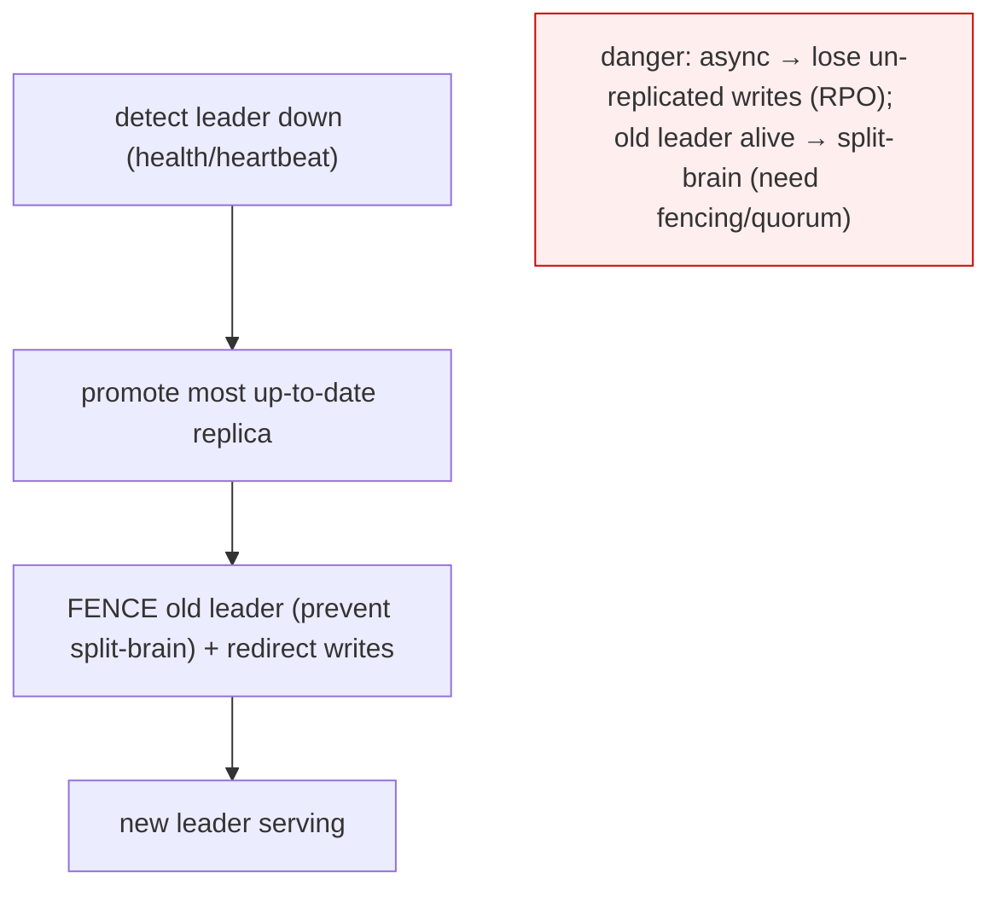

# Lesson 5.4.2 — Connection Pooling, Read Replicas, and Failover

> Part 5: Databases · Module 5.4: Database Selection & Operation · Difficulty: 🔴
>
> **Prerequisites:** [3.3.4 connection pooling/backpressure], [5.3.1 WAL/log shipping], [5.2.1 durability], [1.2.1 availability].
> **Unlocks:** [Part 7 read scaling], [Part 10 replication/consistency], [Part 11 failover/DR], [Part 13 multi-region].

---

## 1. Learning Objectives

After this lesson you will be able to:

- Explain why databases need **connection pooling** (and a **pooler**) and how connection limits become a bottleneck (tying to 3.3.4).
- Explain **read replicas** (leader-follower replication via the WAL — 5.3.1) for **read scaling** and the **replication lag / stale-read** tradeoff (Part 10).
- Explain **failover** (promoting a replica when the leader fails) and the availability vs consistency/data-loss tradeoffs (RPO/RTO — Part 11).
- Apply these as the **first, practical scaling and HA techniques** for a relational database before sharding (Part 7).

---

## 2. Motivation — Scaling and surviving with the database you have

Before exotic scaling (sharding — Part 7, NewSQL — 5.4.1), three operational techniques do enormous work for a relational database: **connection pooling** (don't exhaust the DB's limited connections), **read replicas** (scale **reads** by copying data to follower nodes), and **failover** (stay available when the primary dies). Together they take a single-node database a long way — often far enough that you never need to shard — and they're the **default availability and read-scaling story** for most systems.

Each carries a crucial tradeoff. **Connection pooling** is forced by the fact that databases support a **limited number of connections** (each costs memory/threads — 3.3.4), so too many app instances can **exhaust** the DB and take it down. **Read replicas** scale reads beautifully but introduce **replication lag** — a follower is slightly behind the leader, so reads can be **stale** (an eventual-consistency tradeoff — Part 10) — and they **don't scale writes** (all writes still go to one leader). **Failover** keeps you available when the leader fails, but promoting a replica risks **data loss** (un-replicated writes — RPO) and **split-brain** if done carelessly (Part 11).

These are the bread-and-butter of running databases in production. Understanding them — and their lag/consistency/data-loss tradeoffs — lets you scale reads and achieve HA correctly, and sets up replication (Part 10), fault tolerance (Part 11), and multi-region (Part 13).

---

## 3. Theory — From first principles

### 3.1 Connection pooling and the connection-limit bottleneck

Databases support a **bounded number of concurrent connections** — each connection costs **memory, a process/thread, and state** on the server `[CS]` (recall 3.3.4). Opening a connection is also **expensive** (TCP + auth + setup). So:
- Apps use a **connection pool** (bounded, reused connections) to **amortize setup** and **bound** how many connections they open (3.3.4).
- **The exhaustion trap:** with many app instances (autoscaling!) each holding a pool, total connections = `instances × pool_size`, which can **exceed the database's connection limit** → the DB **rejects connections** → outage. This is a classic incident (3.3.4, 5.x).
- **Solution — a connection pooler/proxy** (e.g., PgBouncer-style, representative) sits between apps and the DB and **multiplexes many client connections onto few database connections** (transaction-level pooling) — so thousands of app connections map to a small, safe number of DB connections.
- **Sizing:** counterintuitively, a **small pool often outperforms a large one** for databases (limited parallelism — 3.3.4); size to the DB's real concurrency, and ensure `total app connections ≤ DB max` (use a pooler to guarantee it).

### 3.2 Replication: leader-follower (primary-replica)

**Replication** keeps **copies of the data on multiple nodes** `[CS]`. The most common model is **leader-follower (primary-replica / master-slave)**:
- One node is the **leader (primary)**: it handles **all writes**.
- Writes are **streamed to followers (replicas)** — typically by **shipping the WAL** (5.3.1) — which **replay** the log to stay in sync.
- **Followers serve reads** (and stand by for failover).

This is built directly on the WAL (5.3.1): the same log that provides durability/recovery is **streamed to replicas**, which apply it — "the log is the replication mechanism" (Part 10).

**Replication can be:**
- **Synchronous:** the leader waits for (one or more) followers to confirm before acking the write → **no data loss on failover** (the replica has it) but **higher write latency** and reduced availability (a slow/down replica blocks writes).
- **Asynchronous:** the leader acks immediately and replicates in the background → **fast writes**, but a replica may be **behind**, so a leader crash can **lose** un-replicated writes (data-loss window — RPO, Part 11). Most setups use async (or **semi-synchronous**: wait for at least one replica) — a tradeoff (Part 10/11).

### 3.3 Read replicas and read scaling

**Read replicas** scale **read throughput** by directing read queries to followers while writes go to the leader `[CS]`. This is the **#1 read-scaling technique** for relational databases (Part 7):
- Add replicas to handle more read load (great for **read-heavy** workloads — most web apps).
- The application (or a proxy) **routes writes to the leader, reads to replicas** (read/write splitting).

**The catch — replication lag and stale reads** `[CS]`: with **asynchronous** replication, a replica is **slightly behind** the leader. So a read from a replica may be **stale** (miss a just-written value). This breaks **read-your-writes** consistency: a user updates their profile (write → leader) then reloads (read → replica) and sees the **old** value — a confusing, classic bug (Part 10). Mitigations:
- **Read-your-writes:** route a user's reads to the **leader** for a short window after they write, or **pin** reads that must see recent writes to the leader.
- **Monitor and bound lag**; route latency/consistency-sensitive reads to the leader.
- Accept eventual consistency for reads that can tolerate slight staleness (the common case — Part 10).

**Crucial limit:** read replicas **scale reads, NOT writes** — all writes still funnel through the **single leader** (the write bottleneck). To scale **writes**, you need **sharding/partitioning** (Part 7) or a different model (NoSQL/NewSQL — 5.4.1).

### 3.4 Failover: surviving leader failure

If the **leader fails**, the system must **promote a follower** to become the new leader to stay available — **failover** `[CS]`. Steps (representative):
1. **Detect** the leader is down (health checks / heartbeats — careful: "is it dead or just slow?" is hard — Part 8).
2. **Choose** a new leader (often the most up-to-date replica).
3. **Promote** it; **redirect** writes to it (update the connection routing / virtual IP / service discovery).
4. **Reconfigure** other replicas to follow the new leader.

**Failover tradeoffs and dangers** `[CS]`:
- **Data loss (RPO):** with **async** replication, writes the old leader had but **hadn't replicated** are **lost** on promotion → a data-loss window. Synchronous replication avoids this (at write-latency cost). Tune to your **RPO** (Part 11).
- **Split-brain:** if the old leader **wasn't really dead** (just network-partitioned/slow) and keeps accepting writes while a new leader is promoted → **two leaders**, divergent data, corruption. Prevented by **fencing** (STONITH / fencing the old leader), **quorum**-based promotion, or leases (Part 8/11). This is *the* danger of naive failover.
- **RTO (downtime):** detection + promotion + redirection takes time → a brief outage. **Automated failover** (orchestrators) reduces RTO vs manual.
- **Failover is not free** — it's a delicate, dangerous operation; many real outages are **botched failovers** (false-positive detection, split-brain, lost writes).

**Automatic failover** (managed databases, orchestrators like Patroni/managed RDS multi-AZ — representative) handles detection/promotion/fencing, dramatically improving availability — the **HA** story for relational databases (1.2.1, Part 11).

### 3.5 Multi-leader and leaderless (brief, forward link)

Leader-follower is the default, but there are others (deep-dived in Part 10) `[CS]`:
- **Multi-leader:** multiple nodes accept writes (e.g., multi-region) → better write availability/locality but **write conflicts** to resolve (Part 10).
- **Leaderless** (Dynamo-style — quorum reads/writes): no single leader; clients/coordinators write to multiple replicas, read from a quorum (Part 10).
These trade more write availability for **conflict/consistency complexity** — covered in Part 10. For most relational setups, **leader-follower + read replicas + failover** is the practical model.

### 3.6 How they fit together (the practical HA + read-scaling stack)

```
App instances → connection pooler (bound DB connections)
   → write/read split: writes → leader; reads → replicas (accept lag / pin RYW to leader)
   → leader streams WAL → replicas (sync/async/semisync per RPO)
   → leader fails → automated failover (detect → promote → fence old leader → redirect)
```
This stack gives **read scaling** (replicas), **high availability** (failover), and **safe connection usage** (pooler) — taking a single-node database a long way before sharding (Part 7).

---

## 4. Visual Intuition

### Leader-follower with read replicas

```mermaid
flowchart TB
    APP["App (via connection pooler)"] -->|writes| LEADER["Leader (primary): all writes"]
    APP -->|reads| R1["Replica 1 (reads)"]
    APP -->|reads| R2["Replica 2 (reads)"]
    LEADER -->|stream WAL (async/sync)| R1
    LEADER -->|stream WAL| R2
    note["replicas scale READS; writes bottleneck on the single leader; replicas may lag (stale reads)"]
```

### Failover (and split-brain danger)



---

## 5. Real-World Analogy

Think of a **head chef (leader) running a kitchen with sous-chefs (replicas)**.

- **Connection pooling:** the kitchen has a **limited number of order tickets** it can handle at once. If every waiter (app instance) tries to hand orders directly and there are hundreds of waiters, the pass gets **swamped and jams** (connection exhaustion). So you put a **maître d' (connection pooler)** at the pass who funnels all the waiters' orders through a **small, manageable set of tickets** — the kitchen stays sane.
- **Read replicas:** only the **head chef writes the official recipes/changes** (all writes → leader), but the **sous-chefs each keep an up-to-date copy** and can **answer "what's in this dish?" questions** (reads). Hire more sous-chefs → answer more questions in parallel (read scaling). The catch: a sous-chef's copy is **a moment behind** the head chef's latest tweak (**replication lag**) — so a diner who *just* asked the head chef to change their order and then asks a sous-chef might hear the **old** version (**stale read / no read-your-writes**) — fix by sending that diner's immediate follow-ups **back to the head chef**.
- **Writes don't scale by adding sous-chefs:** no matter how many sous-chefs you hire, there's still **one head chef** making all the changes (single-leader write bottleneck) — to truly scale changes you'd need to **split the menu across multiple kitchens** (sharding — Part 7).
- **Failover:** if the **head chef collapses**, a sous-chef must be **promoted** to head chef to keep service going. Two dangers: any recipe tweak the old chef made but **hadn't shared yet is lost** (data loss / RPO), and — worse — if the old chef **wasn't actually down** (just stepped out) and **comes back still acting as head chef**, now **two chefs** are giving conflicting orders (**split-brain**) — so you must firmly **bar the old chef from the kitchen** (fencing) before the new one takes over.

---

## 6. Industry Example

- **Read replicas as default read scaling** `[CONV]`: managed databases (RDS/Aurora read replicas, Cloud SQL replicas — representative) and Postgres/MySQL streaming replication scale reads by adding followers fed by the WAL/binlog (5.3.1, Part 7).
- **Connection poolers** `[CONV]`: PgBouncer (Postgres), ProxySQL (MySQL), and managed proxies multiplex app connections onto few DB connections — standard practice to avoid connection exhaustion (3.3.4).
- **Automated failover / HA** `[CONV]`: Patroni, managed multi-AZ RDS, Aurora, and orchestrators handle detection → promotion → fencing for HA; cloud DBs offer near-automatic failover (Part 11).
- **Replication-lag / read-your-writes bugs** `[CONV]`: a well-known class of issues where users don't see their own just-written data because the read hit a lagging replica — fixed by routing recent writers to the leader (Part 10).
- **Split-brain incidents** `[CONV]`: documented outages from failovers without proper fencing/quorum producing two leaders and divergent data — motivating fencing/consensus-based promotion (Part 8/11).

---

## 7. Implementation Details — operating for scale & HA

- **Always use a connection pool**, and put a **connection pooler/proxy** in front of the DB when many app instances exist — size pools small, ensure `total connections ≤ DB max` (3.3.4) to avoid exhaustion.
- **Add read replicas for read scaling** (read-heavy workloads) with **read/write splitting** (writes→leader, reads→replicas) via app logic or a proxy.
- **Handle replication lag / read-your-writes:** route a user's reads to the **leader** for a short window after their write (or pin consistency-sensitive reads to the leader); **monitor lag** and bound it (Part 10).
- **Remember replicas don't scale writes** — for write scaling, plan **sharding** (Part 7) or NoSQL/NewSQL (5.4.1).
- **Choose replication mode by RPO:** **synchronous/semisync** for no/low data-loss (at write-latency cost); **async** for performance (with a data-loss window) — tie to durability (5.3.1, Part 11).
- **Use automated, fenced failover** (orchestrator/managed) for HA — ensure **fencing/quorum** to prevent **split-brain** (Part 8/11); test failover regularly (game days).
- **Define and test RPO/RTO** (Part 11) — know your data-loss window and downtime target; don't discover them during an incident.
- **Monitor** connection counts, pool saturation, replication lag, replica health, failover events (Part 16).

## 8. Advantages

- **Connection pooling/pooler:** prevents connection exhaustion, amortizes setup, bounds load on the DB (3.3.4).
- **Read replicas:** scale read throughput (the #1 read-scaling lever), offload the leader, provide standby nodes for failover.
- **Failover:** high availability — survive leader/node failure with minimal downtime (1.2.1, Part 11).
- **WAL-based replication:** reuses the durability log (5.3.1) — efficient, well-understood.
- **Takes a single-node DB far** — often avoids the complexity of sharding (Part 7).

## 9. Disadvantages / costs

- **Replication lag / stale reads** — async replicas are behind; breaks read-your-writes unless handled (Part 10).
- **Replicas don't scale writes** — single-leader write bottleneck remains (need sharding — Part 7).
- **Failover risks** — data loss (async, RPO), **split-brain** (without fencing), brief downtime (RTO) — dangerous if naive (Part 11).
- **Operational complexity** — poolers, replicas, failover orchestration, monitoring to run.
- **Sync replication latency** — strong durability/no-loss costs write latency/availability (Part 10/11).

---

## 10. When NOT to / limits

- **Don't rely on read replicas to scale writes** — they don't; use sharding/NoSQL/NewSQL (Part 7, 5.4.1).
- **Don't serve read-your-writes-sensitive reads from lagging replicas** — pin to leader or use sync where needed (Part 10).
- **Don't do naive (unfenced) automatic failover** — split-brain risk; ensure fencing/quorum (Part 8/11).
- **Don't skip the connection pooler** at scale with many app instances — you *will* exhaust connections (3.3.4).
- **Don't use synchronous replication everywhere** — its latency cost isn't needed for all data; reserve for low-RPO needs (Part 11).

---

## 11. Common Mistakes

1. **DB connection exhaustion** — `instances × pool_size` > DB max; no pooler → outage (3.3.4).
2. **Oversized pools** — more connections than the DB can use, adding contention (3.3.4).
3. **Read-your-writes bug** — serving a user's reads from a lagging replica right after their write (Part 10).
4. **Assuming replicas scale writes** — surprised when the single leader is the bottleneck (Part 7).
5. **Unfenced failover → split-brain** — two leaders, divergent data, corruption (Part 8/11).
6. **Async replication + low RPO expectation** — losing un-replicated writes on failover unexpectedly (Part 11).
7. **Never testing failover** — discovering it's broken (or causes data loss) during a real incident (Part 14).
8. **Ignoring replication lag monitoring** — stale-read bugs and failover data-loss surprises.

---

## 12. Interview Questions

**🟢 Easy**
- Why do databases need connection pooling? What happens without it at scale?
- What is a read replica, and what does it scale (and not scale)?

**🟡 Medium**
- Explain replication lag and the read-your-writes problem. How do you mitigate it?
- Walk through database failover. What can go wrong (data loss, split-brain)?

**🔴 Hard**
- Design read scaling + HA for a read-heavy relational application: pooler, replicas, read/write splitting, replication mode, and automated failover. Where are the consistency and data-loss tradeoffs?
- Explain split-brain in failover and how fencing / quorum-based promotion prevents it (Part 8/11).

**⚫ Staff+**
- Your app autoscaled and the database started rejecting connections under load. Diagnose and design the fix (pooler, pool sizing, connection budget) (3.3.4).
- Design the replication + failover strategy for a system with strict RPO/RTO across regions: synchronous vs async vs semisync, fencing, automated failover, and the latency/availability/data-loss tradeoffs (Part 10/11/13).

---

## 13. Production Pitfalls

- **Connection exhaustion outage:** autoscaling app fleet × per-instance pools exceeding DB max → DB rejects connections, total outage (no pooler) (3.3.4).
- **Read-your-writes confusion:** users not seeing their own just-saved data (read hit a lagging replica) — a common, baffling bug (Part 10).
- **Split-brain corruption:** failover without fencing while the old leader is still alive → two leaders, divergent writes, data corruption (Part 8/11).
- **Failover data loss:** async replication losing recent writes on promotion — unexpected RPO breach (Part 11).
- **Botched/slow failover:** false-positive detection flapping, or manual failover taking too long → extended downtime (RTO) — many real outages are bad failovers.
- **Write bottleneck:** adding replicas but still saturating the single leader's write capacity (needs sharding — Part 7).

---

## 14. Optimization Techniques

- **Connection pooler + small pools + connection budget** (`total ≤ DB max`) — prevent exhaustion, maximize effective throughput (3.3.4).
- **Read replicas + read/write splitting** for read scaling; **route read-your-writes to the leader** for correctness (Part 10).
- **Tune replication mode to RPO** — async (fast), semisync (balance), sync (no loss) — per data criticality (5.3.1, Part 11).
- **Automated, fenced failover** (orchestrator/managed, quorum-based) for low RTO without split-brain (Part 8/11).
- **Monitor** pool saturation, connection counts, replication lag, replica health; **alert** and auto-route around lagging replicas (Part 16).
- **Cache reads** (Part 6) to offload replicas/leader; **plan the sharding path** for when writes outgrow one leader (Part 7).
- **Regularly test failover/DR** (game days) so RPO/RTO are real (Part 11/14).

---

## 15. Summary

Before exotic scaling, three operational techniques take a relational database a long way. **Connection pooling** is mandatory because databases support a **bounded number of expensive connections** (3.3.4); with many (autoscaled) app instances, `instances × pool_size` can **exhaust** the DB and cause an outage — so apps use **small pools** and a **connection pooler/proxy** multiplexes many client connections onto **few** DB connections (ensuring `total ≤ DB max`). **Read replicas** implement **leader-follower replication** — one **leader takes all writes**, streams its **WAL** (5.3.1) to **followers** that **replay** it and **serve reads** — the **#1 read-scaling lever** for read-heavy workloads; the catch is **replication lag**: **asynchronous** replicas are slightly behind, so reads can be **stale**, breaking **read-your-writes** (route recent writers' reads to the leader), and crucially **replicas scale reads, not writes** (the single leader remains the write bottleneck → sharding needed for write scale — Part 7). **Failover** promotes a follower when the leader dies to stay **available**, but it's delicate: **async replication risks losing un-replicated writes** (data-loss window — **RPO**), and a leader that **isn't truly dead** can cause **split-brain** (two leaders, divergent data) unless prevented by **fencing / quorum-based promotion** (Part 8/11); **automated, fenced failover** minimizes downtime (**RTO**) and is the HA backbone. Replication mode is an **RPO tradeoff** — sync (no loss, slower writes), semisync (balance), async (fast, loss window). Together — **pooler + read replicas + read/write splitting + automated fenced failover** — these provide **read scaling and high availability** for a single-leader relational database (the practical default), with the explicit limits that **writes don't scale this way** (Part 7) and **lag/failover impose consistency and data-loss tradeoffs** (Part 10/11) — feeding directly into replication (Part 10), fault tolerance/DR (Part 11), and multi-region (Part 13).

---

## 16. Revision Notes (flashcard-ready)

- **Q:** Why connection pooling? **A:** DBs have a limited number of expensive connections; pooling amortizes setup and bounds connections (avoid exhaustion).
- **Q:** Connection exhaustion cause/fix? **A:** instances × pool_size > DB max → outage; fix with a pooler (multiplex many→few) + small pools + budget.
- **Q:** Read replica model? **A:** Leader takes all writes, streams WAL to followers that replay it and serve reads (leader-follower).
- **Q:** What do replicas scale? **A:** Reads, NOT writes (single-leader write bottleneck → shard for write scale, Part 7).
- **Q:** Replication lag problem? **A:** Async replicas are behind → stale reads → breaks read-your-writes (route recent writers to leader).
- **Q:** Sync vs async replication? **A:** Sync = no data loss, slower writes; async = fast, data-loss window on failover (RPO); semisync = balance.
- **Q:** What is failover? **A:** Promote a follower to leader when the leader fails; detect → promote → fence old leader → redirect.
- **Q:** Failover dangers? **A:** Data loss (async/RPO) and split-brain (old leader alive) — prevent split-brain with fencing/quorum.
- **Q:** Split-brain? **A:** Two leaders accepting writes → divergent/corrupt data; prevented by fencing/STONITH/quorum promotion.
- **Q:** The practical stack? **A:** Pooler + read replicas (read/write split) + WAL replication (RPO-tuned) + automated fenced failover.

---

## 17. Further Reading + Knowledge-Graph Links

**Within this platform**
- **Previous:** [5.4.1 SQL/NoSQL/NewSQL]. **Builds on:** [3.3.4 Connection Pooling/Backpressure], [5.3.1 WAL/log shipping], [5.2.1 durability]. **Next:** [5.4.3 Schema Migrations Without Downtime].
- **Deepened by:** [Part 10 Replication & Consistency] (leader-follower/multi-leader/leaderless, read-your-writes, lag), [Part 11 Fault Tolerance] (failover, RPO/RTO, split-brain, fencing), [Part 8 Consensus] (leader election, quorum). **Read scaling:** [Part 7], [Part 6 Caching]. **Multi-region:** [Part 13].

**Foundational texts (synthesized)**
- Kleppmann, *Designing Data-Intensive Applications* — leader-follower replication, replication lag, read-your-writes, failover, split-brain.
- Database/HA documentation (Postgres streaming replication, PgBouncer, Patroni, managed DB multi-AZ) — representative.

**Concept tags:** `[CS]` connection limits/pooling, leader-follower replication via WAL, replication lag/read-your-writes, failover, split-brain · `[CONV]` connection poolers (PgBouncer/ProxySQL), read replicas, automated/managed failover, sync/async/semisync · `[BP]` pooler + small pools + connection budget, pin RYW to leader, fenced/quorum failover, tune replication to RPO, test failover.
