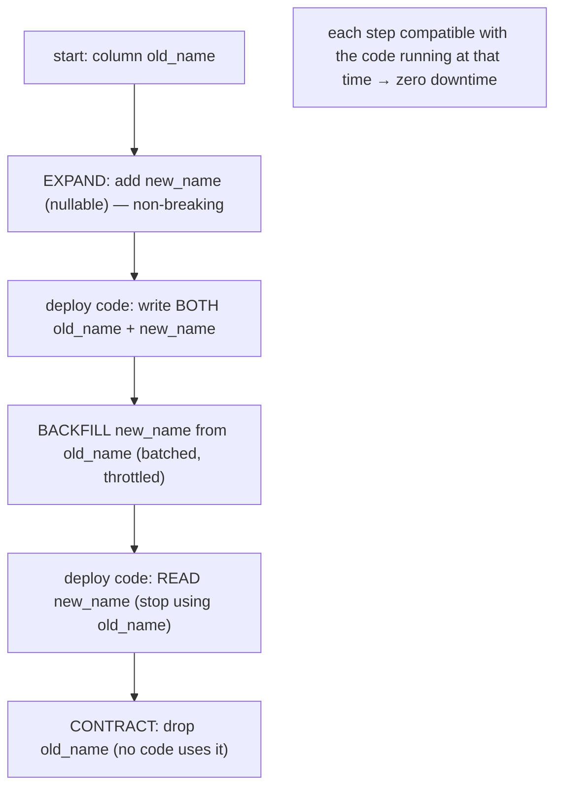
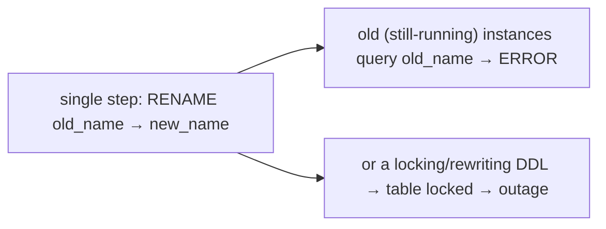

# Lesson 5.4.3 — Schema Migrations Without Downtime

> Part 5: Databases · Module 5.4: Database Selection & Operation · Difficulty: 🔴
>
> **Prerequisites:** [4.3.1 schema evolution / backward-forward compat], [5.4.2 replication], [2.3.3 evolutionary architecture], [Part 13 deploys (forward)].
> **Unlocks:** [Part 12 microservices evolution], [Part 13 blue-green/canary], [Part 11 safe operations].

---

## 1. Learning Objectives

After this lesson you will be able to:

- Explain why schema changes are dangerous in production (locking, breaking running code during rolling deploys) and why "just run the ALTER" causes outages.
- Apply the **expand-and-contract (parallel change)** pattern to make **any** schema change in **backward/forward-compatible** steps with zero downtime (tying to 4.3.1).
- Handle the hard cases — adding columns, renaming, changing types, adding constraints/indexes, backfilling large tables — safely.
- Coordinate **migrations with application deploys** (old + new code running together) and use online/concurrent DDL tooling.

---

## 2. Motivation — Changing the database under a running system

Applications evolve, so their database schemas must change — add a column, rename a field, change a type, add an index or constraint, split a table. But the database is **live**, serving production traffic, and during a **rolling deploy** (Part 13) **old and new application versions run simultaneously** against the **same** schema. A careless change causes outages two ways: **(1) locking** — some DDL operations **lock the table** (or rewrite it), blocking all queries for the duration (catastrophic on a large, busy table); and **(2) incompatibility** — a change that breaks the **currently-running** code (old version querying a column you just dropped, or new version needing a column the old version doesn't write).

This is **schema evolution** (4.3.1) applied to live relational databases, and the universal solution is the **expand-and-contract (parallel change)** pattern: never make a **breaking** change in one step; instead make a sequence of **individually backward/forward-compatible** changes, deploying schema and code in a coordinated order so that **at every moment, the running code and the current schema are compatible**. This is how teams ship continuous schema changes to systems serving millions of requests without a maintenance window — a core skill for evolutionary architecture (2.3.3), CI/CD (Part 13), and microservices (Part 12).

Get it right and schema change is routine and safe; get it wrong and you take a table-locking outage or break production with a deploy. This lesson makes the patterns precise.

---

## 3. Theory — From first principles

### 3.1 Why naive schema changes break production

Two distinct dangers `[CS]`:

**1. Locking / table rewrites (the operational danger):**
- Some DDL operations acquire **locks** or **rewrite the whole table**, blocking reads/writes for the operation's duration. On a **large table** under load, a multi-minute exclusive lock = **outage**.
- Which operations lock/rewrite is **database- and version-specific** (e.g., adding a column with a non-constant default historically rewrote the table in some engines; adding an index can lock writes unless done "concurrently/online"). **You must know your database's behavior.**

**2. Breaking running code (the compatibility danger):**
- During a **rolling deploy** (Part 13), **both** old and new app code run against the schema. A schema change must not break **either**:
  - Dropping/renaming a column the **old** code still uses → old instances error.
  - Adding a **required** (NOT NULL, no default) column the **old** code doesn't populate → old inserts fail.
- This is exactly **backward + forward compatibility** (4.3.1): the schema must be compatible with **both** code versions during the transition.

### 3.2 The expand-and-contract (parallel change) pattern

The universal solution: never do a breaking change atomically; do it as **expand → migrate → contract**, each step **compatible** with the code running at that time `[CS]`/`[BP]`:

1. **Expand:** **additively** change the schema to support **both** old and new code (e.g., **add** the new column/table — nullable / with default, non-breaking). Old code ignores it; new code can use it.
2. **Migrate (code + data):**
   - Deploy code that **writes to both** old and new structures (dual-write) or uses the new one, while still **reading** compatibly.
   - **Backfill** existing data into the new structure (carefully, in batches — §3.4).
   - Shift **reads** to the new structure once it's populated.
3. **Contract:** once **no code** uses the old structure (all instances upgraded), **remove** it (drop the old column/table) — now safe because nothing references it.

Each step is **individually safe** (backward/forward-compatible) and deployed in an order where **running code always matches the schema**. The breaking change is decomposed into a sequence of non-breaking ones — the same **expand-and-contract** idea from 4.3.1, applied operationally.

### 3.3 Concrete recipes

**Adding a column** `[BP]`:
- Add it **nullable** (or with a safe default) — non-breaking (old code ignores it). Adding a non-constant default historically caused a table rewrite in some engines (check your DB/version); modern engines often make this instant for metadata-only changes.
- Deploy new code that writes/reads it. Done.

**Renaming a column (a breaking change — never rename in place)** `[BP]`:
1. **Expand:** add the **new** column (nullable).
2. Deploy code that **writes both** old and new columns.
3. **Backfill** old rows into the new column.
4. Deploy code that **reads** the new column (stops using old).
5. **Contract:** drop the old column.
(Five safe steps instead of one breaking `RENAME`.)

**Changing a column's type** `[BP]`: same as rename — add a new column of the new type, dual-write, backfill, switch reads, drop old. (Don't `ALTER TYPE` in place if it locks/rewrites or breaks code.)

**Adding a NOT NULL constraint** `[BP]`:
1. Add the column **nullable** (or add the constraint as **NOT VALID** where supported).
2. **Backfill** to populate/fix values; deploy code that always sets it.
3. **Validate**/enforce the constraint (often a cheaper, non-blocking validation step).

**Adding an index** `[BP]`: use **online/concurrent** index creation (e.g., Postgres `CREATE INDEX CONCURRENTLY`, MySQL online DDL) so it **doesn't lock writes** — at the cost of being slower/needing care. Never build a large index with a blocking DDL on a busy table.

**Dropping a column/table** `[BP]`: only in the **contract** step, after confirming **no running code** references it (and consider a "soft" period where it's unused before the drop — easy rollback).

### 3.4 Backfilling large tables safely

Populating/migrating data for millions of rows needs care `[CS]`:
- **Batch it** — update in **small chunks** (e.g., by primary-key range) with pauses, not one giant `UPDATE` (which locks rows, bloats the WAL/undo — 5.3.1/5.2.4, and replicates as a huge transaction → replication lag — 5.4.2).
- **Throttle** to avoid overwhelming the DB/replicas (watch replication lag, 5.4.2).
- **Idempotent + resumable** — backfill jobs should be safe to re-run and resume after interruption.
- Run backfill **between** the expand and contract steps, while both old and new code paths are compatible.

### 3.5 Coordinating migrations with deploys

The ordering of **schema change** vs **code deploy** is the crux `[CS]`:
- **Backward-compatible schema change first** (e.g., add nullable column), **then** deploy code that uses it — old code keeps working during the rollout.
- **Remove (contract) only after** all code that used the old structure is gone.
- This mirrors deploy-ordering for one-way-compatible changes (4.3.1): **expand before deploy that needs it; contract after deploy that stops using it.**
- Works hand-in-hand with **rolling / blue-green / canary** deploys (Part 13) where versions overlap — the schema must support all live versions.
- **Migrations should be in version control, automated, ordered, and idempotent** (migration tools: Flyway, Liquibase, Rails/Django migrations, etc. — representative), runnable as part of the deploy pipeline.

### 3.6 The principle

Zero-downtime migration = **decompose every breaking change into a sequence of backward/forward-compatible steps**, use **non-locking (online/concurrent) DDL**, **backfill in throttled batches**, and **order schema changes and code deploys so running code always matches the schema** `[BP]`. It's evolutionary architecture (2.3.3) and schema evolution (4.3.1) realized for live databases — and the reason mature teams change schemas constantly without maintenance windows.

---

## 4. Visual Intuition

### Expand-and-contract for a rename

### Why one-step breaks

---

## 5. Real-World Analogy

Think of **replacing a busy bridge that traffic is still crossing** — you can't just close it.

- The wrong way (**one-step breaking change**) is to **demolish the old bridge to build the new one** — everyone mid-crossing falls (running code breaks), or you **shut the whole road for hours** (table-locking DDL = outage).
- The right way (**expand-and-contract**) is to **build the new bridge alongside the old one first** (expand: add the new column — both exist), then **open both and route some traffic over the new one while keeping the old open** (dual-write / migrate), **gradually move all traffic to the new bridge** (switch reads), and only **once nobody is using the old bridge, demolish it** (contract: drop the old column). At **every moment** there's a working bridge for the cars currently on the road — nobody falls, the road never fully closes.
- **Backfilling** is like **repainting the lane lines on the new bridge a section at a time during light traffic** (batched, throttled) rather than closing the whole bridge to repaint at once.
- And building the new bridge with **a method that doesn't block existing traffic** (online/concurrent DDL like `CREATE INDEX CONCURRENTLY`) is what keeps the old road open the entire time.

The whole art is **never having a moment where the road is closed or a driver is stranded** — exactly zero-downtime migration: the schema always supports whatever code is currently running.

---

## 6. Industry Example

- **Expand-and-contract / parallel change** `[BP]`: the standard zero-downtime migration pattern (a.k.a. "parallel change," popularized in continuous-delivery practice) used across the industry for renames, type changes, and table splits.
- **Online/concurrent DDL** `[CONV]`: Postgres `CREATE INDEX CONCURRENTLY` / `ADD CONSTRAINT ... NOT VALID` then `VALIDATE`; MySQL online DDL (`ALGORITHM=INPLACE`); tools like **gh-ost** and **pt-online-schema-change** perform non-blocking table changes by building a shadow table + copying + swapping (representative).
- **Migration tooling** `[CONV]`: Flyway, Liquibase, Rails/Django/Alembic migrations version and automate ordered, idempotent schema changes in the deploy pipeline.
- **Batched backfills** `[BP]`: large-table backfills run in throttled chunks to avoid locks, WAL/undo bloat (5.3.1/5.2.4), and replication lag (5.4.2) — standard operational practice.
- **Deploy coordination** `[BP]`: schema expand before the deploy that uses it; contract after the deploy that stops using it — integrated with rolling/blue-green/canary releases (Part 13).

---

## 7. Implementation Details — migrating safely

- **Never make a breaking change in one step** — decompose into **expand → migrate → contract**, each backward/forward-compatible (4.3.1).
- **Know your DB's DDL locking behavior** (version-specific): use **online/concurrent** DDL (`CREATE INDEX CONCURRENTLY`, online `ALTER`, gh-ost/pt-osc) to avoid table locks on large/busy tables.
- **Add columns nullable / with safe defaults**; **never** add a NOT-NULL-no-default column in one step; for constraints, add **NOT VALID** then **VALIDATE**.
- **For renames/type changes:** add new → dual-write → **backfill (batched/throttled/idempotent)** → switch reads → drop old.
- **Backfill in small batches** by key range, throttled, resumable — watch **replication lag** (5.4.2) and WAL/undo bloat (5.3.1/5.2.4).
- **Coordinate with deploys:** expand **before** the code that needs it; contract **after** all old code is gone; assume **old + new run together** (Part 13).
- **Automate, version, and order migrations** (Flyway/Liquibase/etc.); make them **idempotent**; test on production-like data/volume.
- **Keep a rollback path** — additive steps are easy to roll back; delay destructive (contract) steps until clearly safe.

## 8. Advantages

- **Zero downtime** — no maintenance window; schema evolves while serving traffic.
- **Safe with rolling/canary deploys** — compatible with old + new code running together (Part 13).
- **Reversible** — additive steps roll back easily; destructive steps deferred until safe.
- **Continuous evolution** — supports frequent, incremental schema change (evolutionary architecture — 2.3.3).
- **No table-lock outages** — online/concurrent DDL + batched backfills avoid blocking.

## 9. Disadvantages / costs

- **More steps / slower** — a "rename" becomes 5 coordinated steps over multiple deploys (more work, more time).
- **Transient duplication / dual-write complexity** — both structures exist during migration; code must maintain both.
- **Backfill effort** — large-table backfills need careful batching/throttling/monitoring.
- **Coordination discipline** — schema/deploy ordering must be correct; mistakes still break things.
- **Tooling dependency** — online DDL/migration tools add operational surface.

---

## 10. When NOT to / limits

- **Truly empty/new tables or pre-launch systems** — you can make direct changes (no live traffic / no old code) — full expand-contract is overkill.
- **Tiny tables where the locking DDL is instant** — a quick `ALTER` may be fine (know the cost; verify it won't lock meaningfully).
- **Genuine maintenance-window-acceptable systems** — if downtime is truly acceptable (rare), a simpler offline migration may suffice (but most production systems can't).
- Don't **skip** expand-contract on large/busy tables or during rolling deploys — that's where outages happen.

---

## 11. Common Mistakes

1. **Breaking change in one step** (rename/drop/type change/`NOT NULL`) → breaks running old/new code (no expand-contract).
2. **Blocking DDL on a large busy table** → table lock → outage (didn't use online/concurrent DDL).
3. **Adding a NOT NULL column without default** → old code's inserts fail; or a full table rewrite locks the table.
4. **Giant single-transaction backfill** → row locks, WAL/undo bloat (5.3.1/5.2.4), replication lag spike (5.4.2).
5. **Dropping the old structure too early** → old (still-running) instances break (contract before all code upgraded).
6. **Wrong schema/deploy ordering** → deploying code that needs a column before the column exists (or vice versa).
7. **Unversioned/manual migrations** → drift, non-reproducible, no rollback (use migration tooling).
8. **Not testing on production-scale data** → a migration that's instant in dev locks for minutes in prod.

---

## 12. Interview Questions

**🟢 Easy**
- Why can't you just run `ALTER TABLE ... RENAME COLUMN` on a live production system?
- What is the expand-and-contract migration pattern?

**🟡 Medium**
- Walk through renaming a column with zero downtime, step by step. Why is each step safe?
- How do you safely backfill a column on a table with hundreds of millions of rows?

**🔴 Hard**
- During a rolling deploy, old and new code run together. Design a migration (add a NOT NULL column / change a type) that never breaks either version, and explain the schema/deploy ordering.
- What DDL operations lock or rewrite tables, and how do online/concurrent DDL tools (CREATE INDEX CONCURRENTLY, gh-ost/pt-osc) avoid blocking?

**⚫ Staff+**
- Design a zero-downtime process to split one table into two (or shard a table) on a high-traffic system: expand-contract steps, dual-writes, backfill, read cutover, rollback plan, and deploy coordination (Part 13).
- Tie schema migrations to schema evolution (4.3.1) and evolutionary architecture (2.3.3): how do you make continuous, safe schema change a first-class, automated, CI-enforced capability across many services (Part 12)?

---

## 13. Production Pitfalls

- **Table-lock outage:** a blocking `ALTER`/index build on a large busy table freezing all queries for minutes (use online/concurrent DDL).
- **Rolling-deploy breakage:** dropping/renaming a column while old instances still query it → errors during the deploy window.
- **Failed inserts from new NOT NULL column:** old code (or a one-step add) failing because it doesn't populate the new required column.
- **Replication lag / WAL bloat from a giant backfill:** one massive `UPDATE` overwhelming replicas and the WAL (5.3.1/5.4.2) → lag, disk pressure.
- **Premature drop:** contracting (dropping old structure) before all code stopped using it → production errors.
- **Migration drift:** manual, unversioned changes diverging across environments → "works in staging, breaks in prod."

---

## 14. Optimization Techniques

- **Expand-and-contract everything breaking** — decompose into compatible steps; the core technique.
- **Online/concurrent DDL** (`CREATE INDEX CONCURRENTLY`, online ALTER, gh-ost/pt-osc) to avoid locks on large tables.
- **Batched, throttled, resumable backfills** by key range — monitor replication lag and WAL/undo (5.3.1/5.4.2/5.2.4).
- **Coordinate schema + deploy ordering** (expand before, contract after) integrated with rolling/blue-green/canary (Part 13).
- **Automated, versioned, idempotent migrations** in the pipeline (Flyway/Liquibase/etc.) with rollback paths.
- **Test on production-scale data** to catch operations that lock/rewrite at scale.
- **Feature-flag the read cutover** so switching to the new structure (and rolling back) is controlled (Part 13).

---

## 15. Summary

Schema must change, but the database is **live** and — during rolling deploys (Part 13) — **old and new application code run simultaneously** against it, so naive changes cause outages two ways: **locking/table-rewriting DDL** that blocks queries (catastrophic on large busy tables) and **incompatible changes** that break running code (dropping a column old code uses, or adding a required column old code doesn't populate). The universal solution is **expand-and-contract (parallel change)** — never make a breaking change in one step; instead **expand** (additively, non-breaking: add the new nullable column/table), **migrate** (dual-write, **backfill existing data in throttled, resumable batches**, switch reads), then **contract** (drop the old structure only after **no running code** uses it) — with each step **backward/forward-compatible** (4.3.1) and **schema/deploy ordering** arranged so the **running code always matches the schema** (expand before the deploy that needs it; contract after the deploy that stops using it). Concrete recipes follow this shape: renames and type changes become add-new → dual-write → backfill → switch-reads → drop-old; `NOT NULL` becomes nullable → backfill → validate; indexes use **online/concurrent** creation (`CREATE INDEX CONCURRENTLY`, gh-ost/pt-osc) to avoid locks. Backfills must be **batched and throttled** to avoid row locks, WAL/undo bloat (5.3.1/5.2.4), and replication lag (5.4.2). Migrations should be **automated, versioned, ordered, idempotent**, and **tested at production scale**. The cost is **more steps and transient dual-write complexity**, but the payoff is **continuous, zero-downtime schema evolution** — the operational realization of schema evolution (4.3.1) and evolutionary architecture (2.3.3), and the reason mature teams change schemas constantly without maintenance windows. This closes Part 5: from data models (5.1) through transactions/concurrency (5.2) and durability/recovery (5.3) to **selecting and operating** databases (5.4) — choosing the right store, scaling it with replicas, keeping it available with failover, and evolving it safely under live traffic.

---

## 16. Revision Notes (flashcard-ready)

- **Q:** Two dangers of naive schema changes? **A:** Locking/table-rewriting DDL (blocks queries) and breaking running code (old+new run together).
- **Q:** Expand-and-contract pattern? **A:** Expand (add new, non-breaking) → migrate (dual-write + backfill + switch reads) → contract (drop old when unused).
- **Q:** Why does it work? **A:** Each step is backward/forward-compatible; running code always matches the current schema.
- **Q:** How to rename a column safely? **A:** Add new (nullable) → write both → backfill → read new → drop old (5 steps, not 1).
- **Q:** Adding NOT NULL safely? **A:** Add nullable (or NOT VALID) → backfill + always-set in code → validate/enforce.
- **Q:** Adding an index safely? **A:** Online/concurrent creation (CREATE INDEX CONCURRENTLY / online DDL) to avoid locking writes.
- **Q:** Backfill large tables how? **A:** Small batches by key range, throttled, idempotent/resumable — watch replication lag + WAL bloat.
- **Q:** Schema/deploy ordering? **A:** Expand before the code that needs it; contract after all code stops using the old structure.
- **Q:** When can you skip expand-contract? **A:** New/empty tables, pre-launch, or tiny tables where DDL is instant (and no old code).
- **Q:** Tooling? **A:** Versioned, automated, idempotent migrations (Flyway/Liquibase/etc.); online DDL tools (gh-ost/pt-osc).

---

## 17. Further Reading + Knowledge-Graph Links

**Within this platform**
- **Previous:** [5.4.2 Connection Pooling/Replicas/Failover]. **Builds on:** [4.3.1 Schema Evolution] (backward/forward compat), [5.4.2 replication] (backfill + lag), [5.3.1 WAL] (bloat), [2.3.3 evolutionary architecture]. **Concludes Part 5.** **Next:** [Part 6 Caching].
- **Central to:** [Part 13 Cloud Native] (rolling/blue-green/canary deploys), [Part 12 Microservices] (independent schema evolution per service), [Part 11 Resilience] (safe operations, rollback).

**Foundational texts (synthesized)**
- Continuous-delivery literature on "parallel change"/expand-contract (synthesized).
- Kleppmann, *Designing Data-Intensive Applications* — schema evolution, online migrations.
- Database/online-DDL documentation (Postgres concurrent index, gh-ost, pt-online-schema-change) — representative.

**Concept tags:** `[CS]` schema migration dangers (locking, breaking running code), expand-and-contract, backward/forward compatibility · `[CONV]` online/concurrent DDL (CREATE INDEX CONCURRENTLY, gh-ost/pt-osc), migration tooling (Flyway/Liquibase) · `[BP]` decompose breaking changes, nullable-then-backfill-then-validate, batched/throttled backfills, coordinate schema+deploy ordering, automate/version migrations.
