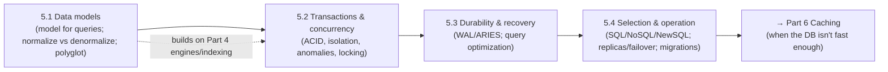

# Part 5 — Databases ✅ COMPLETE

Choosing and operating the right database, understanding internals — unified by one idea: **a database is a set of deliberate tradeoffs (data model, consistency, durability, scaling), and mastery is matching those tradeoffs to your requirements rather than to labels.**

---

## Lessons

### Module 5.1 — Data Models
| # | Lesson | Core idea |
|---|--------|-----------|
| 5.1.1 | [Data Models](5.1.1-data-models.md) | Relational/document/KV/wide-column/graph — model for how you query; default relational |
| 5.1.2 | [Normalization vs Denormalization](5.1.2-normalization-vs-denormalization.md) | Each fact once (writes/consistency) vs duplicate for read speed; query-driven design; materialized views/CQRS |
| 5.1.3 | [Polyglot Persistence](5.1.3-polyglot-persistence.md) | Right store per access pattern; one source of truth; sync via CDC/outbox (not dual writes) |

### Module 5.2 — Transactions & Concurrency
| # | Lesson | Core idea |
|---|--------|-----------|
| 5.2.1 | [ACID Precisely Defined](5.2.1-acid.md) | A+D via WAL, I via concurrency control, C partly the app's job; ACID ≠ fully isolated by default |
| 5.2.2 | [Isolation Levels](5.2.2-isolation-levels.md) | RU→RC→RR/Snapshot→Serializable; defaults are weaker than serializable; names differ across vendors |
| 5.2.3 | [Anomalies](5.2.3-anomalies.md) | Dirty/non-repeatable/phantom + **lost update** & **write skew** (the commonly-missed ones) |
| 5.2.4 | [Concurrency Control](5.2.4-concurrency-control.md) | 2PL (readers block writers) vs MVCC (snapshots); optimistic vs pessimistic; SSI prevents write skew |
| 5.2.5 | [Locking, Deadlocks, Detection](5.2.5-locking-deadlocks.md) | Lock types/granularity; Coffman conditions; detect+abort+retry; consistent ordering + short txns |

### Module 5.3 — Durability & Recovery
| # | Lesson | Core idea |
|---|--------|-----------|
| 5.3.1 | [WAL, Checkpoints, Crash Recovery (ARIES)](5.3.1-wal-checkpoints-crash-recovery.md) | WAL rule, checkpoints, analysis→redo→undo, CLRs; the log also powers replication/PITR/CDC |
| 5.3.2 | [Query Execution & Optimization](5.3.2-query-execution-optimization.md) | Cost-based optimizer, statistics/cardinality, join algorithms, EXPLAIN, the N+1 problem |

### Module 5.4 — Database Selection & Operation
| # | Lesson | Core idea |
|---|--------|-----------|
| 5.4.1 | [SQL vs NoSQL vs NewSQL](5.4.1-sql-nosql-newsql.md) | Guarantees vs scaling; NoSQL relaxes ACID for scale; NewSQL = ACID+SQL at scale (coordination cost) |
| 5.4.2 | [Connection Pooling, Read Replicas, Failover](5.4.2-connection-pooling-replicas-failover.md) | Pooler avoids exhaustion; replicas scale reads not writes (lag); failover risks data loss + split-brain |
| 5.4.3 | [Schema Migrations Without Downtime](5.4.3-schema-migrations-without-downtime.md) | Expand-and-contract; online/concurrent DDL; batched backfills; coordinate schema + deploy ordering |

---

## The through-line of Part 5

**One sentence:** Pick a data model for how you query (and how normalized/polyglot to be), get correctness from ACID — precisely understanding that isolation is a tunable spectrum hiding anomalies like lost update and write skew, enforced by locking/MVCC — rely on the WAL for durability/recovery and the optimizer for fast queries, then select SQL/NoSQL/NewSQL by requirements not labels and operate it with pooling, replicas, failover, and zero-downtime migrations.

---

## The key decisions Part 5 equips you to make

- **Which data model / database?** By access pattern, consistency/transaction needs, scale, and operational reality — default relational; go polyglot when justified. (5.1.1, 5.1.3, 5.4.1)
- **Normalize or denormalize?** Normalize the source of truth; denormalize derived read models (materialized views/CQRS) for measured read bottlenecks. (5.1.2)
- **What isolation level / concurrency control?** Weakest level preserving invariants; atomic ops / optimistic / pessimistic / SSI per contention; prevent lost update & write skew. (5.2.2–5.2.5)
- **How durable / recoverable?** WAL + group commit, checkpoints; tune sync vs async to RPO; replicate for real durability. (5.3.1)
- **How to scale & stay available?** Pooler + read replicas (reads) + automated fenced failover (HA); shard for writes (Part 7). (5.4.2)
- **How to change the schema safely?** Expand-and-contract, online DDL, batched backfills, coordinated deploys. (5.4.3)

---

## Self-check before Part 6

Without notes, can you:
1. Pick a data model from access patterns and explain why relational is the default?
2. Explain normalization vs denormalization and the "have both" pattern (materialized views/CQRS)?
3. Explain polyglot persistence, one source of truth, and CDC/outbox vs dual writes?
4. Define each ACID property precisely, including why C is partly the app's job and that A+D come from the WAL?
5. List the isolation levels and which anomalies each allows — and why defaults aren't serializable?
6. Define lost update and write skew and give the right fix for each?
7. Compare 2PL vs MVCC and optimistic vs pessimistic concurrency, and explain SSI?
8. Explain deadlocks (Coffman conditions), detection vs prevention, and the role of lock ordering + retry?
9. Walk the WAL rule, checkpoints, and ARIES analysis→redo→undo (and how the log powers replication/PITR/CDC)?
10. Read an EXPLAIN plan and diagnose missing indexes / bad estimates / N+1?
11. Distinguish SQL/NoSQL/NewSQL by guarantees and scaling, and debunk the common myths?
12. Explain connection pooling/exhaustion, read replicas (and lag/read-your-writes), and failover (data loss + split-brain)?
13. Perform a zero-downtime schema change with expand-and-contract?

If any are shaky, revisit that lesson's Revision Notes. Part 6 (Caching) covers the highest-leverage performance tool for when the database alone isn't fast enough.

---

*Reference assets for this part: `../../reference/database-selection-decision-tree.md`, `../../reference/isolation-levels-and-anomalies.md`, `../../reference/storage-engine-comparison.md`.*
