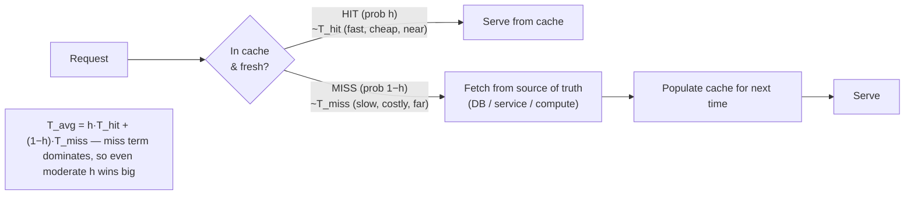
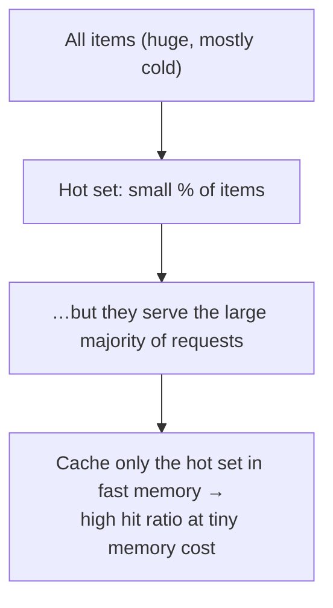

# Lesson 6.1 — Why Caching Works: Locality and the Cache as a Probabilistic Shortcut

> Part 6: Caching · Difficulty: 🟡
>
> **Prerequisites:** [1.1.3 Vocabulary of Scale], [1.1.4 Capacity Estimation], [4.1.1 Memory Hierarchy & Locality], [3.3.3 CDNs], [5.4.2 Read Replicas].
> **Unlocks:** [6.2 Cache Topologies], [6.3 Caching Patterns], [6.4 Eviction], [Part 7 Scalability], [Part 17 Performance].

---

## 1. Learning Objectives

After this lesson you will be able to:

- State precisely **why** caching works — the **principle of locality** (temporal and spatial) and **skewed access distributions** (4.1.1) — and why these are empirical facts about real workloads, not assumptions.
- Define a cache as a **probabilistic shortcut**: a small, fast store that *bets* a request can be answered without going to the slow, authoritative source, and quantify the bet with **hit ratio**, **hit/miss latency**, and the **average-latency formula**.
- Derive the **economics of caching** — why a modest hit ratio produces an outsized latency and load reduction — and compute it with back-of-the-envelope math (1.1.4).
- Explain the two costs every cache imposes: **staleness** (a cached copy can diverge from the source) and **memory/operational cost**, framing the rest of Part 6 as managing those two costs.

---

## 2. Motivation — The cheapest request is the one you never make

Every layer of a system has a speed and a cost. Reading from a local CPU cache is ~nanoseconds; from RAM ~100ns; from a local SSD ~tens of microseconds; from another machine over the network ~hundreds of microseconds to milliseconds; from a database doing real query work ~milliseconds to seconds; from a disk-bound or contended database under load, far worse (4.1.1's latency ladder). Each step *down* that ladder is **orders of magnitude slower** and usually **more expensive and more contended** (5.3.2, 5.4.2).

A **cache** is the single highest-leverage tool for fighting that gradient `[CONV]`. It stores the **result** of expensive work — a database query, a rendered page, a remote API call, a computation — in a **fast, nearby store** so that the *next* request for the same thing skips the expensive work entirely. The slogan that captures the entire field: **the cheapest, fastest, most reliable request is the one you never have to make.**

You've already met caching repeatedly in this platform without it being the headline: the **CPU caches and page cache** (4.1.1, 4.1.2), the database's **buffer pool / block cache** (4.2.2, 4.2.3), **read replicas** as a way to offload reads (5.4.2), and the **CDN** caching at the network edge (3.3.3). Part 6 pulls these into one coherent discipline. But before topologies and patterns, you need the *why*: caching is not magic, and it is not free. It works because of a deep, repeatable property of real workloads — **locality** — and it works *probabilistically*, trading a small risk of staleness and a memory cost for a large latency-and-load win. This lesson makes that bet precise so every later decision (where to cache, which pattern, which eviction policy, how to invalidate) is grounded in *why caching pays off at all*.

---

## 3. Theory — From first principles

### 3.1 The principle of locality (why caching is even possible)

Caching would be useless if every request asked for something brand new. It works because **real access patterns are not uniform** — they exhibit **locality of reference** `[CS]`, the same property that makes CPU caches and the page cache work (4.1.1):

- **Temporal locality:** if an item was accessed recently, it is *likely to be accessed again soon*. A trending tweet, a hot product page, a logged-in user's own profile, today's exchange rate — all get hit repeatedly in a short window. Caching exploits this directly: keep recently-used items close.
- **Spatial locality:** if an item was accessed, *nearby* items are likely to be accessed soon (the next rows of a result set, the next video segment, adjacent keys). This justifies **prefetching** and caching in **blocks/pages** rather than single bytes (4.1.1, 4.2.x).

Locality is an **empirical regularity**, not a theorem — but it holds so reliably across web, database, and storage workloads that entire hardware and software stacks are built around it `[CS]`.

### 3.2 Skewed popularity distributions (why a *small* cache wins big)

Locality has a powerful statistical cousin: **access frequency is heavily skewed**. In most real systems a **small fraction of items receives a large fraction of requests** — often described (loosely) by a **Zipf-like / power-law / "long-tail" distribution** `[CS]`. The classic shorthand is the **80/20 rule**: ~20% of items serve ~80% of traffic (the exact split varies; *illustrative*).

This is the key to the economics. You **do not** need to cache everything to get most of the benefit. If you cache just the **hot set** — the small population of frequently-requested items — you can serve the large majority of requests from cache while holding only a tiny fraction of the data in fast memory. **A small cache captures a disproportionate share of traffic.** That is why caching is cost-effective: fast memory is expensive, but you only need a little of it to cover the hot set.

```
Requests by item popularity (Zipf-like, illustrative):

 hits │█
      │█
      │██
      │███
      │██████
      │█████████████
      │██████████████████████████████████  ← long tail of rarely-used items
      └──────────────────────────────────────► items ranked by popularity
       ↑ the "hot set": few items, most of the traffic → cache THESE
```

### 3.3 A cache, defined precisely

A **cache** is a **small, fast, secondary store** holding copies of data whose **authoritative copy** ("the source of truth," the **origin** or **backing store**) lives somewhere slower `[CS]`. Two non-negotiable properties define it:

1. **It is redundant.** The cache holds *copies*. If the cache is wiped, **no data is lost** — it can be repopulated from the source. (This is what distinguishes a cache from a primary store. A "cache" you can't safely lose is not a cache; it's a database.) `[BP]`
2. **It is a hint, not the truth.** A cached value can be **stale** (out of date relative to the source) or **absent**. Correctness must never *depend* on the cache being present or fresh — only *performance* should. (This is why losing a cache should degrade speed, not correctness.)

Because the cache is smaller than the source, it cannot hold everything — so it must **evict** (6.4) and decide **what to keep**. Because it holds copies of mutable data, those copies can diverge from the source — so it must handle **invalidation/staleness** (6.5). Those two problems — *what to keep* and *how to stay correct enough* — are the entire substance of caching, and the reason for the famous quip that **cache invalidation is one of the two hard things in computer science** (6.5).

### 3.4 Hits, misses, and the average-latency model

The behavior of a cache is captured by a few quantities `[CS]`:

- **Hit:** the requested item is in the cache (and fresh enough to use) → served fast.
- **Miss:** the item is absent (or expired) → fetch from the source (slow), and typically **populate** the cache for next time.
- **Hit ratio** `h` (or hit rate): fraction of requests that are hits, `h = hits / (hits + misses)`, `0 ≤ h ≤ 1`. **The single most important cache metric.** **Miss ratio** is `1 − h`.

Let:
- `T_hit` = latency to serve from cache (small),
- `T_miss` = latency to serve on a miss (fetch from source, ~ `T_source`, often plus the cost of populating the cache).

Then the **average request latency** is:

```
T_avg = h · T_hit + (1 − h) · T_miss
```

This one formula explains *everything* about why caching pays. Because `T_miss` (database/network/compute) is typically **orders of magnitude** larger than `T_hit` (memory), the miss term dominates — so **even a moderate hit ratio slashes average latency**, and pushing the hit ratio higher has steeply diminishing-but-real returns on the *tail* and on origin load.

> **Subtle but critical:** on a miss you often pay **more** than just `T_source` — you pay to *populate* the cache too, and a flood of simultaneous misses can **overload the source** (the **stampede/thundering-herd** problem, 6.7). So a cache doesn't only lower average latency; managed badly, its *miss path* can become a new failure mode. Hold that thought for 6.7.

### 3.5 The economics — a worked back-of-the-envelope (illustrative)

Suppose a request served from the database takes `T_miss = 50 ms`, and from an in-memory cache `T_hit = 1 ms`. (Numbers *illustrative*; method is what matters — 1.1.4.)

- **No cache:** `T_avg = 50 ms`. The database also handles **100%** of the request load.
- **Hit ratio 80%:** `T_avg = 0.8·1 + 0.2·50 = 0.8 + 10 = 10.8 ms` → **~4.6× faster on average**, and the **database now sees only 20%** of the traffic — a 5× load reduction (5.4.2, Part 7).
- **Hit ratio 95%:** `T_avg = 0.95·1 + 0.05·50 = 0.95 + 2.5 = 3.45 ms` → **~14× faster**, and the **database sees only 5%** of traffic — a **20×** load reduction.
- **Hit ratio 99%:** `T_avg ≈ 0.99·1 + 0.01·50 = 1.49 ms`; database sees **1%** — a **100×** load reduction.

Two lessons jump out:
1. **The load-reduction (origin-offload) effect is even more dramatic than the latency effect.** Going from 95% → 99% hit ratio barely changes average latency (3.45 → 1.49 ms) but **cuts origin load 5×** (5% → 1%). For a database that is the system bottleneck (5.4.2, Part 7), that offload is often the *real* prize.
2. **Hit ratio is the lever**, and it is set by **locality + cache size + eviction policy (6.4) + how you populate and invalidate (6.3, 6.5)**. Everything else in Part 6 is, ultimately, about **maximizing the hit ratio while keeping staleness acceptable and cost bounded.**

### 3.6 "Probabilistic shortcut" — what the bet actually is

Calling a cache a **probabilistic shortcut** is literal `[OPINION]`/`[CS]`. For each request the system *bets* that the answer is already in a fast store. The bet's payoff is the latency/load gap (`T_miss − T_hit`); its probability of paying off is the hit ratio `h`; and its **downside** is two-fold:
- **Staleness risk:** the cached copy might be wrong relative to the source (managed by TTLs and invalidation, 6.5).
- **Cost:** memory for the cache and the operational complexity of running it.

Good caching is **expected-value engineering**: invest a little fast memory and accept a bounded, well-understood staleness window to win a large latency-and-load reduction — and design the **miss path** so it stays cheap and safe even under load (6.7). The rest of Part 6 is the toolkit for tuning every term in that bet.

---

## 4. Visual Intuition

### The cache as a shortcut across the latency ladder



### Why a small cache covers most traffic (skew)



---

## 5. Real-World Analogy

A cache is the **stuff you keep on your desk** instead of walking to the file room.

- The **file room** (or central archive) is the **source of truth**: it has *everything*, but every trip is slow. Your **desk** is the **cache**: tiny, but everything on it is instantly at hand.
- You don't put every document on your desk — there's no room (limited cache size). You keep the **handful you're using this week** (the **hot set** — temporal locality). Most documents you touch are ones you touched recently, so a small desk covers most of your reaches — that's the **skewed distribution** working for you, and a **high hit ratio**.
- When you need something *not* on the desk (**a miss**), you walk to the file room (**`T_miss`**) and bring a copy back to the desk (**populate**) so the next look-up is instant.
- The desk has two costs, exactly like a cache: it can hold only so much, so you must **clear off** old documents to make room (**eviction**, 6.4); and a desk copy can be **out of date** if someone updated the master in the file room (**staleness/invalidation**, 6.5). If your desk burns down, you've **lost nothing** — every document still exists in the file room (a cache holds only redundant copies).
- And if *everyone* in the office runs to the file room for the same just-removed document at the same instant, the file room gets mobbed (**stampede**, 6.7) — a hint that the *miss path* needs its own care.

---

## 6. Industry Example

- **CPU caches & OS page cache** `[CS]`: hardware (L1/L2/L3) and the OS page cache (4.1.1, 4.1.2) are caches built directly on locality — the canonical proof that the principle holds in practice.
- **Database buffer pool / block cache** `[CONV]`: every serious database keeps hot pages/blocks in memory (4.2.2 B-tree buffer pool, 4.2.3 LSM block cache) so hot reads never touch disk — caching *inside* the database.
- **CDNs** `[CONV]` (3.3.3): cache content at the network edge near users; their headline metric is **cache hit ratio** and **origin offload** — the §3.5 economics applied globally.
- **Read replicas** `[CONV]` (5.4.2): a coarse form of read offload that, like caching, trades freshness (replication lag) for read-scaling — same staleness-vs-speed bet.
- **Web-scale object caches** `[CONV]`: large sites front their databases with in-memory caches (Redis/Memcached, 6.6) precisely to exploit the skew in §3.2 — a small hot set absorbs the majority of reads, protecting the database (5.4.2, Part 7). *(Internals representative.)*

---

## 7. Implementation Details — measuring and reasoning about the bet

- **Instrument the four numbers first** (Part 16): **hit ratio**, **hit latency**, **miss latency**, and **request volume**. Without these you cannot tell whether a cache helps, and you cannot do the §3.5 math on *your* system.
- **Compute expected value before adding a cache.** Estimate `T_hit`, `T_miss`, and a *plausible* `h` (from access-pattern skew). If `T_miss ≈ T_hit` (the source is already fast) or `h` will be low (little locality, e.g., unique per-request data), a cache may not pay — and might *hurt* (extra hop, extra failure mode).
- **Right-size to the hot set, not the whole dataset** (§3.2). The cost-effective target is "hold the hot set," found empirically by plotting hit ratio vs cache size (the curve usually has a **knee** — the point of diminishing returns; 6.4).
- **Decide what "fresh enough" means** *per data type* up front (6.5): exchange-rate ticks tolerate seconds; a bank balance may tolerate none. This bounds the staleness side of the bet.
- **Design the miss path as a first-class path** (6.7): assume occasional simultaneous misses on hot keys and plan coalescing/locks/jitter *before* they cause an outage — a cache changes, not removes, the load on the source.
- **Treat the cache as losable** (§3.3): the system must remain *correct* (if slower) with a cold or down cache. Never store the only copy of anything in a cache.

---

## 8. Advantages

- **Dramatic latency reduction** — serve hot data from memory/near the user instead of slow/far sources (§3.5; 1.1.3, Part 17).
- **Origin offload / scalability** — the bigger structural win: a high hit ratio shields the bottleneck (DB/service) from most traffic, often the cheapest way to scale reads (5.4.2, Part 7).
- **Cost efficiency** — exploiting skew means a *small* amount of fast memory captures *most* requests (§3.2).
- **Spike absorption & resilience** — a warm cache buffers the source against read surges; `stale-if-error` can even serve during source outages (3.3.3, Part 11).
- **Reuse of expensive work** — caches a *computed result* (render, aggregation, API call), not just stored data — amortizing CPU, not only I/O.

---

## 9. Disadvantages

- **Staleness** — a cached copy can diverge from the source; correctness now depends on **invalidation/TTL discipline** (6.5). This is the dominant hazard.
- **Added complexity & a new failure mode** — another component to run, monitor, and reason about; the **miss path** can stampede the source (6.7).
- **Memory cost** — fast memory is expensive; caches consume RAM that competes with other uses.
- **Cold-start / cache-warming** — a fresh/empty cache offers no protection until populated; restarts and deploys can expose the source (6.7).
- **Debuggability** — "works for me / not for them" bugs from stale or per-node-divergent cache state are notoriously hard to reproduce (6.2, 6.5).
- **Correctness traps** — caching personalized/sensitive data in a shared/public cache can leak one user's data to another (3.3.3, 6.2).

---

## 10. When NOT to use it / limits

- **Low locality / mostly-unique requests** — if almost every request is for distinct data (e.g., a random-UUID lookup with no repeats), the hit ratio is near zero and the cache is pure overhead.
- **The source is already fast enough** — if `T_miss ≈ T_hit`, the bet has no payoff; don't add a hop and a failure mode for nothing (measure first — §7).
- **Strong-freshness, zero-staleness requirements** done naively — if *no* staleness is tolerable, you need careful write-through/invalidation (6.3, 6.5) or to skip caching that datum; never bolt a TTL cache onto data that must never be stale.
- **Write-dominant workloads** with little re-reading — caching reads helps little when the access pattern is write-heavy and read-light (though *write* caching/buffering is a different tool, 6.3 write-back).
- **Tiny datasets that already fit in the source's own memory** — the database's buffer pool may already be your cache; adding another layer can be redundant.

---

## 11. Common Mistakes

1. **Adding a cache without measuring** — no baseline `T_miss`, no hit-ratio target, no idea whether locality even exists; "we added Redis" as cargo-cult `[OPINION]`.
2. **Treating the cache as a source of truth** — storing the only copy of data in a cache, so a cache flush/restart loses data or breaks correctness (it must be *losable*, §3.3).
3. **Ignoring staleness** — caching mutable data with no invalidation/TTL plan, then being surprised by stale reads (6.5).
4. **Chasing 100% hit ratio** — over-investing memory past the knee of the curve for diminishing returns, instead of accepting the long tail goes to the source (§3.5, 6.4).
5. **Forgetting the miss path** — designing only the hit path, then getting stampeded when a hot key expires (6.7).
6. **Caching per-request-unique data** — near-zero hit ratio, pure overhead (§10).
7. **Caching sensitive/personalized data in a shared cache** without scoping → cross-user data leaks (6.2, 3.3.3).
8. **Confusing "fast" with "correct"** — a cache improves performance, never correctness; if the system isn't correct with the cache cold, the design is broken.

---

## 12. Interview Questions

**🟢 Easy**
- Why does caching work? Name the two kinds of locality and the skew property that make a small cache effective.
- Define hit ratio, hit, and miss. Why is hit ratio the most important cache metric?

**🟡 Medium**
- Given `T_hit = 1 ms`, `T_miss = 40 ms`, and a 90% hit ratio, compute the average latency and the load reduction on the source. How do both change at 99%?
- Explain why the **origin-offload** benefit can matter more than the latency benefit, and tie it to read scaling (5.4.2, Part 7).

**🔴 Hard**
- A teammate proposes caching every database read "to make things fast." How do you decide, quantitatively, whether a cache will help — and when it would *hurt*? What workloads make caching pointless?
- Explain why a cache is a *probabilistic shortcut* and enumerate the two costs of the bet. How does each later Part-6 topic (patterns, eviction, invalidation, stampede) tune a term in `T_avg = h·T_hit + (1−h)·T_miss`?

**⚫ Staff+**
- Your read traffic is Zipf-distributed and growing; the primary database is the bottleneck. Reason from access-pattern skew to a target hit ratio and cache size, then to the expected origin load — and identify the new failure modes (cold start, stampede, staleness) you've introduced and how you'll bound each.
- Define a principled policy for *what* to cache and *what freshness* to allow across a system with mixed data (immutable assets, slowly-changing reference data, per-user data, money). Defend the staleness budget for each class.

---

## 13. Production Pitfalls

- **Cold-cache thundering herd after a deploy/restart:** the cache comes up empty and 100% of traffic hits the source at once, which falls over (6.7) — the cache that was protecting the DB becomes the cause of the outage when it's cold.
- **Silent staleness:** mutable data cached with a too-long TTL and no invalidation; users see old values for hours, and it's intermittent/per-node so it's hard to reproduce (6.5).
- **Cache as accidental database:** someone stores the only copy of a value in the cache; a routine cache restart causes real data loss.
- **Cross-user leak:** personalized responses cached in a shared cache without per-user keys → user A sees user B's data (6.2, 3.3.3).
- **Hit ratio looks great, p99 is terrible:** the average hides the tail — the long tail of misses still pays `T_miss`, and a stampede on a hot miss spikes p99 (Part 17, 6.7).
- **Cache bigger than the working set but hit ratio still low:** the access pattern has *no* locality (unique requests) — the cache was the wrong tool (§10).

---

## 14. Optimization Techniques

- **Maximize hit ratio at the knee of the size curve** — measure hit ratio vs memory; stop where returns flatten (§3.5, 6.4).
- **Cache the most expensive *and* most repeated work** — prioritize items with high `T_miss × frequency`, not just frequency.
- **Cache computed results, not just rows** — amortize CPU-heavy renders/aggregations, not only I/O.
- **Right TTL per data class** — longest TTL the staleness budget allows, to lift hit ratio (6.5); pair with `stale-while-revalidate` for freshness + speed (3.3.3, 6.5).
- **Warm the cache** before exposing traffic (preload the hot set on deploy) to avoid cold-start herds (6.7).
- **Layer caches** (client → CDN → app → distributed → DB buffer pool) so each tier absorbs what it can (6.2) — every layer is the §3.4 formula again.
- **Protect the miss path** with request coalescing / locks / jitter from day one (6.7).

---

## 15. Summary

Caching works because real workloads have **locality** (recently/nearby-accessed items are accessed again) and **skew** (a small **hot set** serves most requests) `[CS]` — so a **small, fast, redundant** store placed in front of a **slow source of truth** can answer most requests without doing the expensive work. A cache is a **probabilistic shortcut**: per request it *bets* the answer is already cached, with payoff = the latency/load gap, probability = the **hit ratio** `h`, and downside = **staleness** + **memory/operational cost**. The master equation `T_avg = h·T_hit + (1 − h)·T_miss` shows why even a moderate hit ratio slashes latency — and, even more importantly, **offloads the origin** (95%→99% barely changes latency but cuts origin load 5×), which is often the real prize when the database is the bottleneck (5.4.2, Part 7). A cache must always hold only **redundant copies** (losing it costs speed, never correctness) and must **evict** (it's small → 6.4) and manage **staleness** (copies diverge → 6.5) — the two hard problems that the rest of Part 6 addresses. Adding a cache is **expected-value engineering**: measure `T_hit`, `T_miss`, and the achievable `h` first; size to the hot set; bound the staleness budget per data class; and design the **miss path** (6.7) before it stampedes your source. Everything that follows — topologies (6.2), patterns (6.3), eviction (6.4), invalidation (6.5), distributed caches (6.6), and stampede defenses (6.7) — is tuning one term of that bet.

---

## 16. Revision Notes (flashcard-ready)

- **Q:** Why does caching work at all? **A:** Locality (temporal + spatial) + skewed/Zipf-like popularity → a small hot set serves most requests.
- **Q:** Define a cache. **A:** Small, fast store of **redundant copies** of data whose authoritative copy lives in a slower source; a hint, never the truth.
- **Q:** Two properties that define a cache? **A:** It's losable (only copies — losing it costs speed not correctness) and it's a hint (can be stale/absent; correctness must not depend on it).
- **Q:** Hit ratio? **A:** `h = hits/(hits+misses)` — the most important cache metric.
- **Q:** Average-latency formula? **A:** `T_avg = h·T_hit + (1−h)·T_miss`; the miss term dominates, so moderate `h` wins big.
- **Q:** Which benefit is often bigger than latency? **A:** Origin offload — 95%→99% hit ratio barely changes latency but cuts origin load 5×.
- **Q:** A cache as a bet — payoff, probability, downside? **A:** Payoff = `T_miss − T_hit`; probability = `h`; downside = staleness + memory/ops cost.
- **Q:** The two hard problems a cache creates? **A:** What to keep (eviction, 6.4) and how to stay correct enough (invalidation/staleness, 6.5).
- **Q:** When does caching NOT pay? **A:** Low locality/unique requests, source already fast (`T_miss≈T_hit`), or zero-staleness data done naively.
- **Q:** First thing before adding a cache? **A:** Measure `T_hit`, `T_miss`, request volume, and plausible `h`; do the EV math.

---

## 17. Further Reading + Knowledge-Graph Links

**Within this platform**
- **Builds on:** [4.1.1 Memory Hierarchy & Locality] (the same principle in hardware), [1.1.3 Vocabulary of Scale] (latency/throughput), [1.1.4 Capacity Estimation] (the EV math), [3.3.3 CDNs] (edge caching/hit ratio), [5.4.2 Read Replicas] (read offload).
- **Next:** [6.2 Cache Topologies] (where caches live). **Then:** [6.3 Patterns], [6.4 Eviction], [6.5 Invalidation], [6.6 Distributed Caching], [6.7 Stampede].
- **Enables:** [Part 7 Scalability] (caching as a read-scaling tool), [Part 17 Performance] (latency/tail).

**Foundational texts (synthesized)**
- Kleppmann, *Designing Data-Intensive Applications* — derived data, caching, and staleness concepts (synthesized).
- Silberschatz/Korth/Sudarshan, *Database System Concepts* — buffer management and locality (synthesized).
- Hennessy & Patterson lineage / OS texts — the principle of locality and memory hierarchy (synthesized).

**Concept tags:** `[CS]` locality (temporal/spatial), Zipf/long-tail skew, hit ratio, average-latency model, cache = redundant copies · `[CONV]` CDN/buffer-pool/replica caching, web-scale object caches · `[BP]` measure-before-caching, size-to-hot-set, treat-cache-as-losable, freshness budget per data class · `[OPINION]` cargo-cult caching critique.
