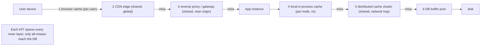
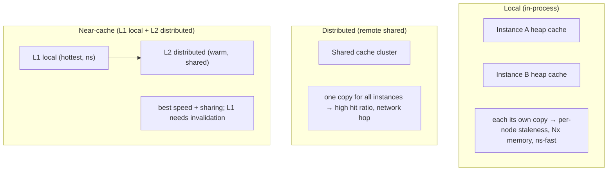

# Lesson 6.2 — Cache Topologies: Client, CDN, Reverse-Proxy, Application, Distributed

> Part 6: Caching · Difficulty: 🟡
>
> **Prerequisites:** [6.1 Why Caching Works], [3.2.1 HTTP Caching Headers], [3.3.2 Reverse Proxies/Gateways], [3.3.3 CDNs], [5.4.2 Read Replicas].
> **Unlocks:** [6.3 Patterns], [6.6 Distributed Caching], [Part 7 Scalability], [Part 13 Multi-region].

---

## 1. Learning Objectives

After this lesson you will be able to:

- Map the **full caching hierarchy** of a modern system — **client/browser → CDN/edge → reverse-proxy/gateway → application (local in-process) → distributed (remote) cache → database buffer pool** — and explain what each layer caches, where it sits, and what it protects.
- Distinguish **local (in-process / near) caches** from **distributed (remote / shared) caches** and reason about the central tradeoff between them: **speed and simplicity vs. consistency, capacity, and hit-ratio sharing**.
- Explain why a **layered ("tiered") cache** is the norm — each layer absorbs the requests it can and forwards the rest inward — and how the §6.1 average-latency formula applies *at every layer*.
- Identify the **failure and correctness modes specific to each topology**: per-node divergence in local caches, cross-user leaks in shared caches, cold-start, and the consistency problems of replicated/distributed caches (6.5, 6.6).

---

## 2. Motivation — Caching is not a place, it's a chain of places

In 6.1 we treated "the cache" as a single fast store. Real systems have **caches everywhere**, stacked from the user's device all the way to the database's own memory. A single page load might be served — at different layers — by the **browser's cache**, a **CDN edge** (3.3.3), a **reverse proxy** (3.3.2), an **in-process application cache**, a **shared Redis cluster** (6.6), and finally the **database buffer pool** (4.2.x) — and each layer that *hits* spares every layer behind it.

This matters for two reasons. First, **placement determines the tradeoffs**: a cache *close to the user* (browser, CDN) gives the biggest latency win and the most origin offload, but you have the least control over it and the hardest time invalidating it (3.3.3, 6.5); a cache *close to the data* (DB buffer pool, distributed cache) is easy to control and keep fresh but does less for latency and offloads less. Second, **the layers interact**: a too-aggressive browser/CDN TTL can mask a backend fix; a stale entry in one of five layers produces "it works on my machine" bugs that are brutal to debug. To design caching well you must think of it as a **request path through a chain of caches**, decide *what belongs at each layer*, and understand each layer's distinct failure modes.

This lesson lays out that chain. 6.3 then covers the *patterns* for reading/writing through a cache layer, and 6.6 drills into the **distributed** layer specifically.

---

## 3. Theory — From first principles

### 3.1 The full caching hierarchy (outside-in)

Ordered from **closest to the user** (outermost) to **closest to the data** (innermost) `[CONV]`:

| Layer | Where it lives | Caches | Scope | Controlled by |
|---|---|---|---|---|
| **1. Client / browser** | user's device | HTTP responses, assets, app state | per-user, per-device | HTTP headers (3.2.1) + app code |
| **2. CDN / edge** | global PoPs (3.3.3) | static + some dynamic responses | global, shared across users | HTTP headers + CDN config |
| **3. Reverse proxy / gateway** | in front of your services (3.3.2) | HTTP responses, fragments | shared across users in a region/DC | proxy config (e.g., Nginx/Varnish) |
| **4. Application — local (in-process)** | inside each service instance's heap | objects, query results, computed values | **per-process** (not shared) | app code (in-memory map/LRU lib) |
| **5. Application — distributed (remote)** | a separate cache cluster (6.6) | objects, query results, sessions | **shared across all instances** | app code + cache server (Redis/Memcached) |
| **6. Database buffer pool / block cache** | inside the DB (4.2.2/4.2.3) | hot pages/blocks | per-DB-node | the database itself |

Every layer is an instance of the **same §6.1 bet**: a hit serves fast and spares the inner layers; a miss forwards inward. The **effective hit ratio of the whole system** is the *composition* of the layers — a request only reaches the database if it missed *every* cache above it.

```
User ─▶ [1 browser] ─▶ [2 CDN] ─▶ [3 reverse proxy] ─▶ app instance
                                                          │
                                          [4 local in-process cache]
                                                          │ (miss)
                                          [5 distributed cache cluster]
                                                          │ (miss)
                                          [6 DB buffer pool] ─▶ disk
```

### 3.2 The two big families: local vs distributed

Layers 4 and 5 — the **application caches you build** — come in two fundamentally different shapes, and choosing between (or combining) them is the core topology decision an application engineer makes `[CS]`:

**Local / in-process / "near" cache** — a data structure (hash map, LRU) living **inside each service instance's own memory**:
- **Pros:** *fastest possible* (`T_hit` ≈ a memory read, ~nanoseconds — no network hop, no serialization); dead simple; no extra infrastructure; survives a cache-server outage.
- **Cons:** **Not shared** — each of *N* instances has its *own* copy, so:
  - **Lower aggregate hit ratio** — the hot set must be cached *N* times; a miss on instance A doesn't benefit from instance B already having it.
  - **N× memory** for the same coverage, bounded by each process's heap.
  - **Inconsistency across nodes** — instance A may hold a fresh value while instance B holds a stale one; **invalidation must reach every node** (hard — 6.5).
  - **Cold on every restart/deploy/scale-out** — a new instance starts empty.

**Distributed / remote / shared cache** — a **separate cache tier** (a Redis/Memcached cluster, 6.6) that *all* instances talk to over the network:
- **Pros:** **Single shared view** — one copy of each item serves all instances → **higher aggregate hit ratio**, **far larger capacity** (not bounded by one heap), **one place to invalidate** (6.5), and survives app-instance restarts (the cache outlives them).
- **Cons:** **A network hop + serialization** on every access (`T_hit` ~ hundreds of µs to ~ms, not ns — much slower than local); a **new distributed component** to run, scale, and make HA (6.6); a **new failure mode** (cache cluster down/partitioned); and it can become a **hotspot** itself (6.7, Part 7).

**The defining tradeoff:** local trades **sharing/consistency/capacity** for **raw speed and simplicity**; distributed trades **speed and simplicity** for **a shared, larger, more-consistent, longer-lived cache**.

### 3.3 The near-cache (multi-tier app cache) hybrid

You don't have to choose: a very common pattern `[BP]` is a **near-cache / two-tier app cache** — a small **local** cache (L1) in front of a **distributed** cache (L2):

- Read: check L1 (local, ns) → on miss check L2 (distributed, network) → on miss hit the source, then populate both.
- **Best of both:** the hottest items are served at memory speed locally, while the larger shared L2 gives high aggregate hit ratio and a single source for the warm-but-not-hottest set.
- **The catch:** L1 reintroduces the **per-node consistency problem** — L1 entries can be stale relative to L2/source, so you need short L1 TTLs or an **invalidation/notification channel** (e.g., pub/sub) to evict L1 across nodes (6.5, 6.6). This is exactly the local-cache downside in §3.2, now scoped to a small hot set.

### 3.4 Where to cache *what* (placement principles)

Each layer suits different data `[BP]`:

- **Client/browser (layer 1):** immutable/versioned static assets (long TTL — 3.3.3), the user's *own* data they just fetched, app shell. **Per-user by nature** — never a place for other users' data, and you *cannot* force-invalidate it (it's on someone else's device) — rely on versioned URLs/short TTLs.
- **CDN/edge (layer 2):** globally-shared, cacheable responses — static assets, public pages, video segments, and (carefully) some dynamic content (3.3.3). **Never** cache personalized/private responses here in a shared key (cross-user leak).
- **Reverse proxy/gateway (layer 3):** shared HTTP responses or fragments near your origin — microcache (very short TTL) for hot endpoints, fragment caching (ESI) (3.3.2).
- **Application local (layer 4):** tiny, ultra-hot, **read-mostly, tolerate-slight-staleness** data — config/feature flags, reference data, computed lookups — where ns latency matters and per-node staleness is acceptable.
- **Application distributed (layer 5):** the workhorse — query results, objects, **sessions** (shared so any instance can serve any user — 7.2 statelessness), rate-limit counters, anything that must be **shared and consistent across instances** (6.6).
- **DB buffer pool (layer 6):** not yours to manage directly — but *sizing it correctly* is itself a caching decision (give the DB enough RAM to hold its hot pages, 4.2.x, 5.4.2).

### 3.5 Why "shared" raises hit ratio (and why "private" is sometimes required)

A **shared** cache (CDN, reverse proxy, distributed) lets *one* cached copy serve *many* users/instances → it exploits the §6.1 skew across the *whole population* → **higher hit ratio per byte of memory**. A **private/per-user** cache (browser, or per-user keys) can only ever reuse *one user's* own repeats → lower hit ratio, but it's **mandatory** for personalized/sensitive data: the moment you share a personalized response under a shared key, you risk **serving one user's data to another** — a severe correctness/security bug (3.3.3, 6.5). The cache **key** is what enforces this: shared data → shared key; per-user data → key scoped by user/identity, or don't cache it in a shared tier at all.

### 3.6 Composition: how the layers add up

Because a request reaches the DB only if it missed *all* caches above, the layers compose **multiplicatively** on the miss path. If layer-2 (CDN) hit ratio is 0.9 and the distributed cache (layer 5) hit ratio *on what reaches it* is 0.8, then the fraction reaching the DB is `(1−0.9)·(1−0.8) = 0.1·0.2 = 0.02` — **2%** (illustrative). This is why **defense-in-depth caching** is so effective at protecting the innermost bottleneck (the database, 5.4.2, Part 7): each layer strips away a slice of traffic, and the survivors are few. It's also why a **single misconfigured layer** (e.g., browser/CDN caching something it shouldn't) can be so damaging — it's the outermost layers that have the most leverage and the least controllability.

---

## 4. Visual Intuition

### The cache chain and what each layer protects



### Local vs distributed vs near-cache



---

## 5. Real-World Analogy

Think of getting a document in a large company.

- **Your desk drawer (local in-process cache):** instant, but it's *yours* — the person at the next desk has their own drawer with possibly a different (older) copy. Ten people = ten drawers = ten copies, and if HQ updates the master, every drawer is now potentially stale until each person is told (per-node invalidation).
- **The floor's shared filing cabinet (distributed cache):** one copy everyone on the floor uses — walking to it takes a few seconds (network hop), but everyone sees the *same* copy, it holds far more than a drawer, and you update it in *one* place.
- **The building's mailroom/front desk (reverse proxy):** intercepts common requests before they go to HQ.
- **The regional branch office near customers (CDN):** customers get documents from a nearby branch instead of crossing the country.
- **What you keep at home (browser cache):** *your* documents on *your* device — fast and private, but the company can't reach into your house to update or recall them (can't force-invalidate the browser).
- **Defense in depth:** by the time a request has missed your drawer, the floor cabinet, the mailroom, and the branch, very few ever reach HQ (the database) — which is exactly the point.

---

## 6. Industry Example

- **Browser + CDN + versioned assets** `[BP]`: standard web frontend — long-TTL immutable assets cached in the browser and at the CDN edge (3.3.3), so most asset requests never reach origin.
- **Varnish / Nginx reverse-proxy caching** `[CONV]`: shared HTTP/microcaching in front of application servers (3.3.2) to absorb hot, briefly-cacheable responses.
- **Memcached/Redis distributed tier** `[CONV]`: the canonical web-scale pattern — a shared in-memory cache cluster fronting the database for objects, query results, and **sessions** (6.6, 7.2). Large social platforms famously run massive shared cache tiers precisely to share hot data across thousands of app servers. *(Internals representative.)*
- **Near-cache / two-tier** `[CONV]`: client libraries and grids (e.g., Hibernate L1/L2, Ehcache+Redis, Caffeine in front of Redis) combine a local L1 with a distributed L2 (§3.3).
- **DB buffer-pool sizing** `[BP]`: provisioning DB memory so the hot working set stays resident (4.2.x, 5.4.2) — the innermost cache, tuned via configuration.

---

## 7. Implementation Details — choosing and wiring the layers

- **Start from the data, not the tool.** For each data class ask: *who shares it?* (one user → browser/per-user key; everyone → shared tier), *how fresh must it be?* (6.5), *how hot/large?* — and place it at the layer that fits (§3.4).
- **Default the application cache to distributed (layer 5)** for anything that must be **shared and consistent across instances** (sessions, counters, query results) — it's the workhorse and keeps services **stateless** (7.2). Add a **local L1** (near-cache) only for the ultra-hot, staleness-tolerant subset, with short TTL or an invalidation channel (§3.3).
- **Set HTTP caching headers deliberately** (3.2.1) so the browser/CDN/proxy layers cache the right things for the right duration — `public` + long TTL for versioned assets, `private`/`no-store` for per-user/sensitive data (§3.5, 3.3.3).
- **Enforce per-user scoping with cache keys** — never let a shared layer cache a personalized response under a shared key (§3.5).
- **Plan invalidation per layer** (6.5): you can purge your own proxy/distributed cache, but browser/CDN entries you can only expire (versioned URLs / short TTL). Outer layers are powerful but hard to recall.
- **Make every layer losable** (6.1): the system must work (slower) with any cache layer cold or down — especially the distributed tier (have a path straight to the source).
- **Monitor hit ratio *per layer*** (Part 16) — you need to see where requests are actually served to tune placement and spot a layer that's silently missing.

---

## 8. Advantages

- **Defense-in-depth offload** — layers compose multiplicatively (§3.6); each strips traffic, so the database (the bottleneck, 5.4.2) sees a tiny fraction.
- **Latency wins where they matter most** — outer layers (browser/CDN) kill round trips near the user (3.3.3, Part 17).
- **Flexibility of placement** — put each datum where its sharing/freshness/speed needs are best met (§3.4).
- **Local caches: unbeatable speed** — ns access, no hop, no dependency; great for ultra-hot reference data.
- **Distributed caches: shared, large, consistent** — high aggregate hit ratio, one place to invalidate, survives app restarts, enables **stateless services** (7.2).
- **Near-cache: speed + sharing** — combine L1 speed with L2 sharing (§3.3).

---

## 9. Disadvantages

- **More layers = more places to be stale/wrong** — multi-layer staleness is a top source of "works for me" bugs (6.5).
- **Local caches diverge across nodes** — per-node staleness and N× memory; invalidation must fan out to every node (§3.2, 6.5).
- **Distributed caches add a hop, infra, and a failure mode** — slower than local, must be made HA, can become a hotspot (6.6, 6.7).
- **Outer layers are powerful but uncontrollable** — you can't force-invalidate a browser; CDN purges are slow (3.3.3).
- **Correctness/security traps** — shared caching of private data leaks across users (§3.5).
- **Cold start at every layer** — restarts/deploys/scale-out expose inner layers until warm (6.7).

---

## 10. When NOT to use a given layer

- **Don't cache per-user/sensitive data in a shared layer** (CDN/proxy/shared key) — leak risk (§3.5, 3.3.3).
- **Don't use a local in-process cache for data that must be consistent across instances** (e.g., a global rate-limit counter, a balance) — nodes will diverge; use a distributed/shared cache (§3.2).
- **Don't add a distributed cache when a local one suffices** — for tiny, read-mostly, staleness-tolerant data, a local cache avoids a whole tier of infrastructure and a network hop.
- **Don't cache in the browser/CDN what changes in place without versioning** — you can't recall it (3.3.3).
- **Don't stack layers you won't monitor or invalidate** — an unmanaged layer is a future stale-data incident.

---

## 11. Common Mistakes

1. **Using a local cache for shared state** — per-node counters/balances diverge; the classic "rate limiter that allows N× the limit because each node counts separately" bug (§3.2, Part 7).
2. **Caching personalized responses under a shared key** — cross-user data leak at the CDN/proxy/distributed layer (§3.5).
3. **No per-layer invalidation plan** — fixing data in the DB but leaving stale copies in 3 other layers (6.5).
4. **Over-caching at the browser/CDN** — long TTL on mutable content you then can't recall (3.3.3).
5. **Forgetting local caches are cold on every deploy** — a rolling deploy repeatedly cold-starts L1 caches, hammering L2/DB (6.7).
6. **One giant local cache instead of a shared tier** — wasting N× memory and getting low aggregate hit ratio (§3.2).
7. **Not monitoring per-layer hit ratio** — flying blind on where requests are actually served.
8. **Treating the distributed cache as a database** — storing the only copy of data in it (6.1).

---

## 12. Interview Questions

**🟢 Easy**
- List the cache layers from the user's device to the database. What does each cache?
- What's the difference between a local in-process cache and a distributed cache?

**🟡 Medium**
- Why does a shared (distributed/CDN) cache achieve a higher aggregate hit ratio than per-node local caches for the same memory? When is a local cache still the right choice?
- Where would you cache: (a) versioned JS assets, (b) a user's session, (c) a global feature flag, (d) a per-user account page? Justify each by sharing and freshness.

**🔴 Hard**
- Design a two-tier (near-cache) application cache. What goes in L1 vs L2, and how do you keep L1 from serving stale data across nodes?
- Explain how cache layers compose on the miss path and why that makes the database well-protected — and why a single misconfigured outer layer is so dangerous.

**⚫ Staff+**
- Architect the end-to-end caching topology for a global, multi-instance web app with mixed data (static assets, public pages, sessions, per-user dashboards, money). Specify what's cached at each layer, the key scoping, the freshness budget, and the invalidation mechanism per layer — and the failure behavior when the distributed tier is down.
- Your services keep per-node local caches for low latency, but users report seeing stale values intermittently after updates. Diagnose the topology problem and design a fix (invalidation channel vs TTL vs moving to shared) with its tradeoffs.

---

## 13. Production Pitfalls

- **Per-node stale reads:** a local cache on each instance serves different (some stale) values after an update; the bug appears intermittently depending on which instance served the request (§3.2, 6.5).
- **Rolling-deploy cold L1 storm:** each newly-deployed instance starts with an empty local cache and stampedes L2/DB; multiply across a fleet and the inner layers buckle (6.7).
- **CDN/browser caching private data:** a misconfigured `Cache-Control: public` leaks a logged-in user's page to others (§3.5, 3.3.3) — a security incident.
- **Distributed-cache outage = DB overload:** the shared tier goes down and 100% of reads fall through to the database, which can't take it (no losable-with-graceful-degradation plan, 6.1, 6.7).
- **Stale across five layers:** a content fix is deployed but old copies persist in browser, CDN, proxy, L1, and L2 — different users see different versions for hours (6.5).
- **Hot key on the distributed tier:** one key (a celebrity, a global config) overwhelms a single cache node/shard (6.7, Part 7).

---

## 14. Optimization Techniques

- **Push caching outward where safe** — the closer to the user a hit happens, the more layers (and round trips) it saves; cache versioned assets at browser/CDN (3.3.3).
- **Use a near-cache (L1+L2)** for the hottest shared data — memory-speed for the top items, shared L2 for the rest (§3.3).
- **Right-size the DB buffer pool** so the working set stays resident (the innermost, cheapest-to-tune cache, 4.2.x).
- **Scope keys tightly** — shared keys for shared data (max hit ratio), per-user keys for private data (correctness) (§3.5).
- **Warm caches on deploy / stagger restarts** to avoid cold-start storms across the fleet (6.7).
- **Add a short-TTL microcache at the reverse proxy** for hot, briefly-cacheable endpoints — huge offload for tiny staleness (3.3.2).
- **Monitor and tune per-layer hit ratio** — move data to the layer where it gets the best ratio for its freshness budget (Part 16).

---

## 15. Summary

Caching is a **chain of caches**, not a single store. From the user inward: **browser (per-user) → CDN/edge (shared, global) → reverse proxy/gateway (shared, near origin) → application local in-process cache (per-node, ns-fast) → application distributed cache (shared, network hop) → database buffer pool (innermost)**. Each layer is the §6.1 bet again, and because a request reaches the database only after missing *every* layer, the layers **compose multiplicatively** to protect the innermost bottleneck (5.4.2, Part 7) — defense-in-depth caching. The pivotal application-level choice is **local vs distributed**: a **local** cache is the fastest possible (memory read, no hop) and simplest, but it's **per-node** — N× memory, lower aggregate hit ratio, per-node staleness, cold on every restart; a **distributed** cache is a shared tier that gives **one consistent view, high aggregate hit ratio, large capacity, a single invalidation point, and survives app restarts**, at the cost of a **network hop, new infrastructure, and a new failure mode** (6.6). The common compromise is the **near-cache** (small local L1 in front of a shared L2) — best speed + sharing, but L1 reintroduces per-node staleness that needs short TTLs or an invalidation channel. Place each datum by **who shares it** (per-user → browser/per-user key; everyone → shared tier — enforced by the **cache key** to avoid cross-user leaks) and **how fresh it must be** (6.5). Every layer must be **losable** (the system stays correct, if slower, when a cache is cold or down), and you must **monitor hit ratio per layer** and **plan invalidation per layer** — outer layers have the most leverage but are the hardest to recall.

---

## 16. Revision Notes (flashcard-ready)

- **Q:** Name the cache layers user→data. **A:** Browser → CDN/edge → reverse proxy → app local (in-process) → app distributed (remote) → DB buffer pool.
- **Q:** Local vs distributed cache — one line each? **A:** Local = fastest, per-node, not shared (N× memory, per-node staleness, cold on restart); distributed = shared/consistent/large, network hop + new infra/failure mode.
- **Q:** Why does a shared cache get a higher hit ratio? **A:** One cached copy serves all users/instances → exploits skew across the whole population per byte of memory.
- **Q:** What's a near-cache? **A:** Local L1 in front of distributed L2 — memory-speed for hottest items + shared L2; L1 needs short TTL/invalidation to avoid per-node staleness.
- **Q:** How do layers compose on the miss path? **A:** Multiplicatively — DB sees `∏(1 − h_layer)`; defense-in-depth, but one bad outer layer is very damaging.
- **Q:** What enforces per-user vs shared caching? **A:** The cache key — shared key for shared data, per-user-scoped key for private data (else cross-user leak).
- **Q:** Where for sessions? **A:** Distributed/shared cache — so any instance serves any user (stateless services, 7.2).
- **Q:** Where for a global rate-limit counter? **A:** Distributed/shared — a local cache would let each node count separately (allow N× the limit).
- **Q:** Why can't you "invalidate" a browser cache? **A:** It's on the user's device — you can only expire it (versioned URLs / short TTL).
- **Q:** Must every layer be losable? **A:** Yes — correct (if slower) with any layer cold/down; never store the only copy in a cache.

---

## 17. Further Reading + Knowledge-Graph Links

**Within this platform**
- **Previous:** [6.1 Why Caching Works]. **Builds on:** [3.2.1 HTTP Caching Headers], [3.3.2 Reverse Proxies/Gateways], [3.3.3 CDNs], [4.2.x DB buffer pool/block cache], [5.4.2 Read Replicas].
- **Next:** [6.3 Caching Patterns] (how to read/write through a layer). **Deep-dive:** [6.6 Distributed Caching] (the layer-5 internals). **Related:** [6.5 Invalidation] (per-layer), [6.7 Stampede] (cold-start/hot keys).
- **Enables:** [7.2 Stateless Services] (sessions in a shared cache), [Part 13 Multi-region] (caching across regions).

**Foundational texts (synthesized)**
- Kleppmann, *Designing Data-Intensive Applications* — derived/cached data and consistency of copies (synthesized).
- Kurose & Ross, *Computer Networking* — web caching hierarchy, proxy caches, CDNs (synthesized).
- Distributed-cache and reverse-proxy product documentation — representative.

**Concept tags:** `[CS]` caching hierarchy, local vs distributed, multiplicative composition, key-scoping for sharing · `[CONV]` browser/CDN/proxy/distributed/buffer-pool layers, near-cache, web-scale shared cache tiers · `[BP]` place data by sharing+freshness, default app cache to shared, losable layers, per-layer monitoring/invalidation.
