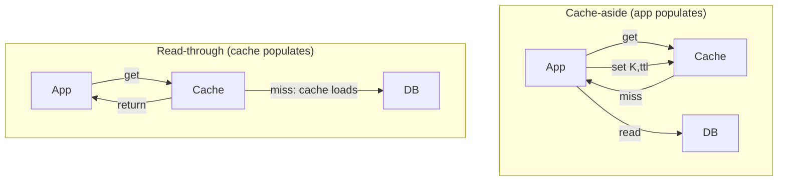
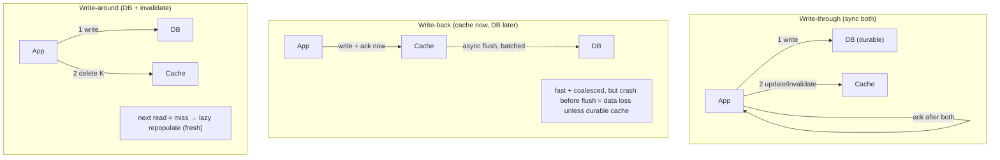

# Lesson 6.3 — Caching Patterns: Cache-Aside, Read-Through, Write-Through, Write-Back, Write-Around

> Part 6: Caching · Difficulty: 🟡🔴
>
> **Prerequisites:** [6.1 Why Caching Works], [6.2 Cache Topologies], [5.2.1 ACID], [5.3.1 WAL], [4.1.2 fsync/Write-Back].
> **Unlocks:** [6.5 Invalidation], [6.7 Stampede], [Part 9 Outbox/CDC], [Part 11 Idempotency].

---

## 1. Learning Objectives

After this lesson you will be able to:

- Distinguish the **read** patterns — **cache-aside (lazy loading)** and **read-through** — and explain who is responsible for populating the cache in each.
- Distinguish the **write** patterns — **write-through**, **write-back (write-behind)**, and **write-around** — and reason precisely about their **consistency, durability, latency, and complexity** tradeoffs.
- Explain the **canonical concurrency bug of cache-aside** (the stale-set / read-write race) and the standard mitigations, and why **"invalidate, don't update"** is the safer default.
- Choose a read+write pattern combination for a given workload (read-heavy vs write-heavy, freshness needs, durability needs), and connect write-back to the WAL/page-cache ideas you already know (5.3.1, 4.1.2).

---

## 2. Motivation — A cache only helps if you read and write it correctly

6.1 said *why* to cache and 6.2 said *where*. This lesson is the **how**: the precise protocols for **reading through** a cache and **writing through** it. These aren't academic — the choice of pattern determines whether your cache is **fast and correct**, or a generator of **stale reads, lost writes, and 3am incidents**.

The patterns answer two questions. On a **read**: who fetches from the source on a miss and populates the cache — *your application code* (cache-aside) or *the cache itself* (read-through)? On a **write**: when you change data, what happens to the cache and the source, and **in what order** — do you write both synchronously (write-through), write the cache now and the source later (write-back), or write the source and skip/evict the cache (write-around)? Each choice trades **consistency, durability, latency, and complexity** differently. Getting it wrong produces the two failure modes that haunt caching: **stale data** (the cache and source disagree) and, with write-back, **lost data** (the cache acknowledged a write that never reached durable storage). This lesson makes each pattern, its data flow, and its failure modes explicit — and gives you the decision rules to combine them.

---

## 3. Theory — From first principles

We have three actors: the **application**, the **cache**, and the **source of truth** (database/store). A pattern defines the **data flow** between them for reads and writes.

### 3.2 Read pattern 1 — Cache-aside (lazy loading)

The application is **in charge**; the cache is a dumb store it consults `[CONV]`. Read flow:
1. App asks the **cache** for key `K`.
2. **Hit** → return it.
3. **Miss** → app reads `K` from the **source**, **writes it into the cache** (usually with a TTL), and returns it.

```
read(K):
  v = cache.get(K)
  if v == MISS:
      v = db.read(K)        # app fetches
      cache.set(K, v, ttl)  # app populates
  return v
```

- **Lazy:** only requested data is ever cached → the cache holds just the working set; great when access is skewed (6.1).
- **The cache is decoupled from the source** — it doesn't know how to load data; the app does. This is the **most common application caching pattern** and what most people mean by "we put Redis in front of the DB."
- **Resilient to cache outage:** if the cache is down, reads still work (straight to the source, slower) — the app already owns the fallback.
- **Cold-start cost:** every key's *first* read is a miss → a cold cache offers no protection (6.7); the data model and code carry the population logic.

### 3.3 Read pattern 2 — Read-through

The **cache itself** (a library or a cache that fronts the DB) knows how to load from the source `[CONV]`. The app **only talks to the cache**:
1. App asks the **cache** for `K`.
2. **Hit** → return it.
3. **Miss** → the **cache** fetches from the source, stores it, and returns it — transparently to the app.

```
read(K):
  return cache.get(K)   # cache loads from source on miss internally
```

- **The cache abstracts the source.** Application code is simpler (no population logic scattered around); loading logic lives in one place (the cache provider / a "loader" function).
- **Functionally equivalent population to cache-aside** — the difference is *who owns the load*: the app (cache-aside) vs the cache layer (read-through). Read-through centralizes it (DRY, fewer race-window mistakes) but couples you to a cache that supports loaders and can reach the DB.
- Both cache-aside and read-through are **lazy** (populate on miss) and share the same **cold-start** and **stampede** exposure (6.7).

### 3.4 Write pattern 1 — Write-through

On a write, the app (or cache) writes to **both the cache and the source synchronously**, before acknowledging `[CONV]`:
1. Write to the **source** (durable).
2. Write to (or update) the **cache**.
3. Acknowledge only after both succeed.

- **Cache is always fresh** for written keys (no stale window from *this* write) → strong read-after-write for cached items.
- **Durability is preserved** — the source is written synchronously, so an ack means it's durable (5.2.1, 5.3.1).
- **Higher write latency** — every write pays for two stores.
- **Writes data that may never be read** — write-through populates the cache on *write*, so rarely-read written data wastes cache space (often paired with a TTL, or you prefer write-around for write-heavy/rarely-read data, §3.6).
- **Ordering matters:** write the **source first, then the cache** (or invalidate) — if you write the cache first and the source write fails, the cache holds a value never persisted (a phantom). See §3.7 for the race even with correct ordering.

### 3.5 Write pattern 2 — Write-back (write-behind)

The app writes **only to the cache**, which **acknowledges immediately**, and the cache **asynchronously flushes** to the source later (batched/coalesced) `[CONV]`:
1. Write to the **cache** → **ack now** (fast).
2. Cache **later** (after a delay, on eviction, or in batches) writes accumulated changes to the **source**.

- **Lowest write latency and highest write throughput** — writes hit memory and return; multiple writes to the same key coalesce into one source write; bursts are absorbed and smoothed (write **coalescing/batching**).
- **This is exactly the OS page cache / DB buffer-pool strategy you already know** (4.1.2, 5.3.1): buffer writes in fast memory, flush to durable storage in the background. The database does write-back internally and protects it with a **WAL** (5.3.1).
- **The danger: durability.** If the cache node crashes **before flushing**, acknowledged writes are **lost** — unless the cache is itself durable (persistence/replication, 6.6) or fronted by its own log. **Plain write-back to a volatile cache can lose data**, which is unacceptable for, e.g., money (5.2.1).
- **Consistency:** the source lags the cache (the source is *stale*, not the cache) until flush; other readers that bypass the cache see old data.
- **Use it for** high-write, loss-tolerant, or aggregatable data (metrics counters, view counts, telemetry, leaderboards) — or with a durable/replicated cache. **Avoid it** for data where an acknowledged write must be durable, unless you add a WAL/replication.

### 3.6 Write pattern 3 — Write-around

The app writes **only to the source** and **does not populate the cache** on write; instead it **invalidates** (evicts) any existing cache entry for the key `[CONV]`:
1. Write to the **source**.
2. **Evict/invalidate** `K` in the cache (don't set it).
3. The next **read** of `K` is a miss → lazily repopulated from the source (cache-aside/read-through).

- **Avoids caching write-only data** — data that's written but rarely/never read doesn't pollute the cache (the opposite concern from write-through).
- **Freshness via invalidation, not update** — the cache is made *empty* for `K`, so the next reader pulls the current value from the source. This is the **"invalidate, don't update"** philosophy (§3.7) and pairs naturally with cache-aside reads.
- **First read after a write is a miss** (slightly higher latency for that read) — the tradeoff for not caching cold-written data and for avoiding the update-race.
- **Common production default:** **cache-aside reads + write-around (invalidate on write)** is the workhorse combination for read-heavy app data `[BP]`.

### 3.7 The cache-aside concurrency hazard (and why to invalidate, not update)

The most infamous caching bug is a **read-modify race in cache-aside** that produces a **permanently stale entry** `[CS]`:

```
Initial: K = 1 in DB and cache empty.
T1 (reader):  cache miss → reads DB (gets old value 1) ............... (slow)
T2 (writer):  writes DB K = 2, then invalidates/sets cache
T1 (reader):  ...now writes its stale read (1) into the cache  ← STALE SET
Result: DB = 2, cache = 1  (stale until TTL/next invalidation)
```

A reader that fetched the **old** value before a concurrent write can **populate the cache *after* the writer's invalidation**, leaving a stale entry that persists until TTL. Mitigations `[BP]`:

- **TTLs as a backstop** — bound how long any stale entry can live (the simplest, most important safety net — 6.5).
- **Invalidate (delete) on write, don't update** — deleting is idempotent and the next read repopulates from the source; *updating* the cache from the writer races with concurrent reads and is harder to order. "**Delete, don't set**" on writes is the common rule `[BP]`.
- **Versioning / CAS** — store a version with the value and only set if newer (some caches support compare-and-set), rejecting stale sets.
- **Delayed double-delete / read-after-write delete** — invalidate, write, then invalidate again after a short delay to catch racing late sets (a pragmatic mitigation).
- **Single-writer / serialize via the source** — let the source-of-truth change-stream (CDC/outbox, Part 9) drive cache invalidation, avoiding app-side races entirely (the most robust at scale).

The deep lesson: **the cache and the source are two stores without a shared transaction** (no distributed atomicity by default, 5.2.1). You cannot make "write DB + write cache" atomic cheaply, so you design to make the *worst case* a **bounded-staleness miss** (safe, self-healing via TTL) rather than a **lost or permanently-stale write** (unsafe). **Invalidate + TTL** achieves exactly that.

### 3.8 How the patterns combine

Reads and writes are chosen **independently** and combined:

| Read pattern | Common write partner | Typical use |
|---|---|---|
| Cache-aside | **Write-around (invalidate)** | **The default** for read-heavy app data `[BP]` |
| Cache-aside / Read-through | Write-through | When written items are read immediately and freshness matters |
| Read-through | Write-back | High-throughput, loss-tolerant or durable-cache scenarios |
| Cache-aside | Write-through + TTL | Read-after-write freshness with a staleness backstop |

---

## 4. Visual Intuition

### Read patterns



### Write patterns



---

## 5. Real-World Analogy

A chef (app), a **prep station** (cache), and the **walk-in pantry** (source of truth).

- **Cache-aside:** the chef checks the prep station; if an ingredient isn't there, *the chef* walks to the pantry, grabs it, and **stocks the prep station** before cooking. The chef owns the fetching.
- **Read-through:** the chef just asks the **prep station attendant** for the ingredient; if it's missing, *the attendant* fetches it from the pantry and restocks — the chef never goes to the pantry.
- **Write-through:** when a new shipment arrives, the chef stocks **both the pantry and the prep station** before saying "received" — everything's consistent, but it takes longer.
- **Write-back:** the chef tosses new stock onto the prep station and keeps cooking, and **someone restocks the pantry later in a batch** — fast, but if the prep station is knocked over before the pantry is updated, that stock is **lost**.
- **Write-around:** new stock goes straight to the **pantry**, and the chef just **throws away** the matching item on the prep station (it's now outdated) — the next time it's needed, it's freshly grabbed from the pantry.
- **The race:** a line cook reads "we have 1 onion" from the pantry, then a manager updates the pantry to "2 onions" and clears the prep-station note — and the slow line cook *then* writes the now-wrong "1 onion" note on the prep station. The fix: **clear the note (invalidate), don't rewrite it**, and **let notes expire** (TTL).

---

## 6. Industry Example

- **Cache-aside + invalidate-on-write** `[BP]`: the dominant web-app pattern — app reads via cache-aside against Redis/Memcached (6.6), and on writes updates the DB and **deletes** the cache key. *(Representative.)*
- **Write-back inside databases & OSes** `[CS]`: the DB **buffer pool** and OS **page cache** are write-back caches flushed on checkpoint/fsync (4.1.2, 5.3.1) — protected by a **WAL** so crashes don't lose acknowledged writes. The canonical proof write-back is safe *with* a log.
- **Write-back for counters/metrics** `[CONV]`: high-frequency counters (views, likes) buffered/coalesced in cache and flushed periodically — loss-tolerant by design.
- **Read-through caching libraries** `[CONV]`: caching libraries/grids (e.g., Caffeine `LoadingCache`, Ehcache, Guava) take a **loader** function so the cache transparently loads on miss (§3.3).
- **CDC/outbox-driven invalidation** `[BP]`: at scale, the database change stream (Part 9) drives cache invalidation to avoid app-side stale-set races (§3.7).

---

## 7. Implementation Details — choosing and implementing

- **Default to cache-aside reads + write-around (invalidate-on-write) + TTL** for read-heavy application data — simplest, resilient to cache outage, self-healing staleness (§3.8) `[BP]`.
- **Always set a TTL**, even with active invalidation — it's the backstop that bounds *any* missed/raced invalidation to a known max staleness (§3.7, 6.5).
- **On writes, delete the key (don't set it)** to avoid the stale-set race; let the next read repopulate (§3.7).
- **Order writes source-first** — write the durable source, *then* invalidate the cache; never ack a write before the source is durable (unless you've deliberately chosen write-back with a durable cache) (§3.4).
- **Use write-through** when written items are read again immediately and you want read-after-write freshness — pair with a TTL so unread writes don't bloat the cache.
- **Use write-back only with a durability story** (a persistent/replicated cache, 6.6, or an upstream WAL) — and only for loss-tolerant or properly-logged data; never naive write-back for money/orders (5.2.1).
- **For multi-instance correctness**, drive invalidation from the **source's change stream (CDC/outbox)** rather than per-app deletes when you need robustness at scale (Part 9).
- **Make the miss path safe** — cache-aside/read-through misses can stampede; add coalescing/locks (6.7).

---

## 8. Advantages

**By pattern:**
- **Cache-aside:** simple, only caches what's used, resilient to cache outage, ubiquitous.
- **Read-through:** centralizes load logic (DRY), simpler app code, one place to fix races.
- **Write-through:** cache always fresh for writes, durability preserved, strong read-after-write.
- **Write-back:** lowest write latency, highest write throughput, write coalescing/batching, absorbs bursts.
- **Write-around:** doesn't pollute cache with write-only data; clean "invalidate-don't-update" freshness.

---

## 9. Disadvantages

- **Cache-aside:** population logic spread through app code; cold-start misses; the stale-set race (§3.7).
- **Read-through:** couples you to a cache that supports loaders + can reach the DB; same lazy cold-start/stampede.
- **Write-through:** higher write latency (two stores); caches possibly-unread data; still races on concurrent reads without TTL.
- **Write-back:** **data-loss risk on crash** (the big one); source lags (readers bypassing cache see stale); added complexity (flush, ordering, durability).
- **Write-around:** first read after write is a miss (extra latency); requires reliable invalidation.

---

## 10. When NOT to use each

- **Write-back:** when an acknowledged write must be durable (financial transactions, orders) and the cache isn't durable/replicated — you'll lose data (5.2.1).
- **Write-through:** for write-heavy, rarely-read data — you cache writes nobody reads (use write-around).
- **Cache-aside (naive):** without TTLs and delete-on-write — you'll accumulate permanently-stale entries from races (§3.7).
- **Read-through:** when you need the cache to stay simple/dumb and decoupled, or your cache can't run loaders/reach the source.
- **Any update-the-cache-on-write scheme** for highly concurrent keys — prefer invalidate-on-write to dodge the race.

---

## 11. Common Mistakes

1. **Updating the cache on write instead of deleting it** — opens the stale-set race; "delete, don't set" is safer (§3.7).
2. **No TTL with cache-aside** — a single missed/raced invalidation becomes a *permanently* stale entry (§3.7, 6.5).
3. **Writing the cache before the source** — if the source write fails, the cache holds a phantom never persisted (§3.4).
4. **Naive write-back for durable data** — acking writes from volatile memory, then losing them on crash (§3.5, 5.2.1).
5. **Acking a write before the source is durable** (outside an intentional write-back design) — silent durability loss.
6. **Ignoring the cold-start/stampede on lazy patterns** — first reads of hot keys hammer the source (6.7).
7. **Per-app invalidation across many instances** with no shared mechanism — some instances miss the invalidation (use CDC/outbox or a shared distributed cache, 6.2, 6.5).
8. **Caching write-only data via write-through** — wasting cache memory on never-read items.

---

## 12. Interview Questions

**🟢 Easy**
- Describe cache-aside reads. Who populates the cache on a miss?
- What's the difference between write-through and write-back? Which risks data loss and why?

**🟡 Medium**
- Compare cache-aside vs read-through — what's actually different, and what's the same?
- Why is "invalidate on write" safer than "update the cache on write"? Walk through the race it avoids.

**🔴 Hard**
- Walk through the cache-aside stale-set race step by step and list three mitigations and their tradeoffs (TTL, delete-don't-set, versioning/CAS, CDC-driven invalidation).
- When is write-back appropriate despite its data-loss risk? How do real systems (DB buffer pool, OS page cache) make write-back safe? (Tie to WAL, 5.3.1.)

**⚫ Staff+**
- Design the read/write caching strategy for (a) a read-heavy product catalog, (b) a high-frequency view-counter, and (c) an account balance. Pick read+write patterns, durability, freshness, and invalidation for each and defend the choices.
- You must keep a distributed cache consistent with the database across many app instances under high write concurrency. Design an invalidation pipeline (delete-on-write + TTL vs CDC/outbox-driven) that avoids stale-set races, and analyze its failure modes and the staleness bound it guarantees.

---

## 13. Production Pitfalls

- **Permanently stale key from a race + no TTL:** a reader's late set overwrites a writer's invalidation; with no TTL it never self-heals (§3.7) — users see old data indefinitely.
- **Write-back data loss:** a cache node crashes before flushing buffered writes; acknowledged updates vanish (catastrophic for anything money-like, 5.2.1).
- **Source-fail-after-cache-write phantom:** cache updated first, DB write fails → cache serves a value that was never persisted (§3.4).
- **Invalidation missed on some instances:** per-app local-cache deletes don't reach every node → intermittent stale reads depending on which instance answers (6.2, 6.5).
- **Cold-cache stampede on lazy patterns:** after a flush/deploy, the first reads of hot keys all miss and pile onto the DB (6.7).
- **Double-write inconsistency:** trying to write cache and DB "atomically" without a shared transaction leaves them disagreeing on partial failure (§3.7) — the reason to invalidate + TTL instead.

---

## 14. Optimization Techniques

- **Cache-aside + write-around + TTL** as the default — simple, resilient, self-healing (§3.8).
- **Delete-don't-set on writes** — sidesteps the update race; next read repopulates fresh (§3.7).
- **Write-back with coalescing** for hot counters/metrics — collapse many writes into one source write (huge write-throughput win) — *with a durability plan* (§3.5).
- **Source-first ordering + ack-after-durable** — never expose unpersisted state (§3.4).
- **CDC/outbox-driven invalidation** for robust multi-instance freshness without app-side races (Part 9) `[BP]`.
- **`stale-while-revalidate`-style refresh** — serve current cached value while asynchronously refreshing, hiding miss latency (3.3.3, 6.5).
- **Combine with stampede defenses** (locks/coalescing/jitter) on the lazy miss path (6.7).

---

## 15. Summary

Caching patterns define the **data flow** between the application, the cache, and the source. **Reads:** in **cache-aside (lazy loading)** the *application* checks the cache and, on a miss, reads the source and populates the cache itself — simple, ubiquitous, resilient to a cache outage; in **read-through** the *cache* loads from the source on a miss transparently, centralizing the load logic. Both are lazy (populate on miss) and share cold-start/stampede exposure (6.7). **Writes:** **write-through** writes the source and cache synchronously (always-fresh, durable, but higher latency and caches possibly-unread data); **write-back (write-behind)** writes only the cache and flushes to the source asynchronously (fastest, coalesces writes — exactly the buffer-pool/page-cache strategy, 4.1.2/5.3.1 — but **risks losing acknowledged writes on crash unless the cache is durable/logged**); **write-around** writes the source and **invalidates** the cache, repopulating lazily on the next read (avoids caching write-only data; pairs with cache-aside). The infamous hazard is the **cache-aside stale-set race**: a slow reader writes a pre-update value into the cache *after* a writer's invalidation, leaving a stale entry — mitigated by **TTLs (a backstop), deleting (not updating) the cache on writes, versioning/CAS, and CDC/outbox-driven invalidation**. Because the cache and source are **two stores with no shared transaction**, you design so the worst case is a **bounded-staleness miss** (self-healing via TTL), never a **lost or permanently-stale write**. The production default for read-heavy data is **cache-aside reads + write-around (delete-on-write) + TTL**; reserve **write-through** for read-after-write freshness and **write-back** for loss-tolerant or durably-logged high-throughput writes.

---

## 16. Revision Notes (flashcard-ready)

- **Q:** Cache-aside vs read-through? **A:** Who populates on miss — the app (cache-aside) vs the cache itself (read-through). Both lazy.
- **Q:** Write-through? **A:** Write source + cache synchronously before ack — fresh + durable, higher latency.
- **Q:** Write-back? **A:** Write cache, ack now, flush to source async/batched — fastest, coalesces writes, but loses acked writes on crash unless cache is durable/logged.
- **Q:** Write-around? **A:** Write source, invalidate (delete) cache; next read repopulates — avoids caching write-only data.
- **Q:** The cache-aside stale-set race? **A:** Slow reader sets an old value into the cache *after* a writer invalidated → permanently stale until TTL.
- **Q:** Main mitigations for the race? **A:** TTL backstop, delete-don't-set on write, versioning/CAS, CDC/outbox-driven invalidation.
- **Q:** Why delete instead of update the cache on write? **A:** Delete is idempotent and lets the next read repopulate fresh; updating races with concurrent reads.
- **Q:** Why is write-back safe inside a DB/OS but risky in a plain cache? **A:** DB/OS protect buffered writes with a WAL (5.3.1); a volatile cache without a log loses them on crash.
- **Q:** Default pattern for read-heavy app data? **A:** Cache-aside reads + write-around (delete-on-write) + TTL.
- **Q:** Write ordering rule? **A:** Source-first, then invalidate cache; ack only after the source is durable.

---

## 17. Further Reading + Knowledge-Graph Links

**Within this platform**
- **Previous:** [6.2 Cache Topologies]. **Builds on:** [6.1 Why Caching Works], [5.2.1 ACID] (no cross-store atomicity), [5.3.1 WAL] (how write-back is made safe), [4.1.2 fsync/write-back] (OS/DB write-back).
- **Next:** [6.4 Eviction Policies] (what to drop when full). **Tightly linked:** [6.5 Invalidation] (TTL/delete/versioning, the race in depth), [6.7 Stampede] (the lazy miss path).
- **Enables:** [Part 9 Outbox/CDC] (change-stream-driven invalidation), [Part 11 Idempotency] (safe retries of writes).

**Foundational texts (synthesized)**
- Kleppmann, *Designing Data-Intensive Applications* — derived data, dual-write hazards, change capture (synthesized).
- Silberschatz/Korth/Sudarshan, *Database System Concepts* — buffer management, write-back, recovery (synthesized).
- Distributed-cache provider documentation (cache-aside/read-through/write-through/write-behind) — representative.

**Concept tags:** `[CS]` cache-aside stale-set race, no cross-store atomicity, write-back+WAL durability · `[CONV]` cache-aside/read-through/write-through/write-back/write-around definitions · `[BP]` cache-aside+write-around+TTL default, delete-don't-set, source-first ordering, CDC/outbox-driven invalidation.
