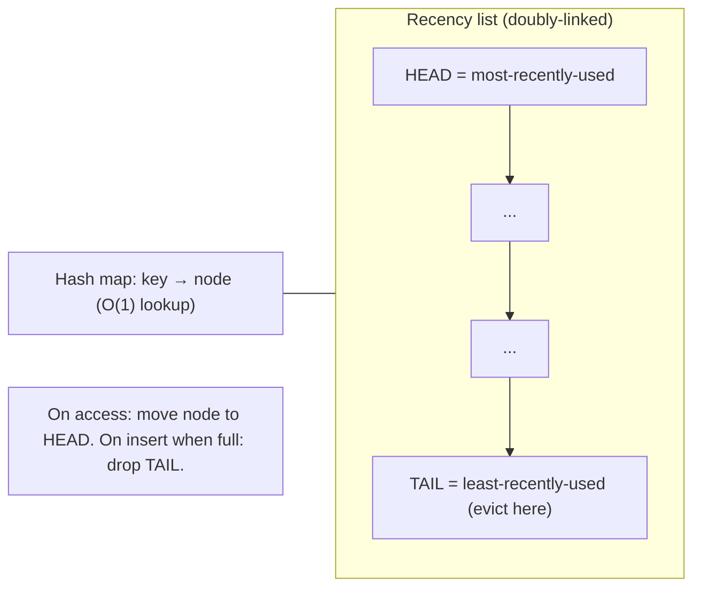

# Lesson 6.4 — Eviction Policies: LRU, LFU, ARC, TTL, and Their Internals

> Part 6: Caching · Difficulty: 🟡🔴
>
> **Prerequisites:** [6.1 Why Caching Works], [6.2 Cache Topologies], [4.1.1 Memory Hierarchy & Locality].
> **Unlocks:** [6.5 Invalidation], [6.6 Distributed Caching], [Part 17 Performance].

---

## 1. Learning Objectives

After this lesson you will be able to:

- Explain why **eviction is mandatory** (a cache is bounded — 6.1) and the goal of an eviction policy: **maximize hit ratio** by keeping the items most likely to be reused, approximating the unattainable optimal (Bélády) policy.
- Describe the internals, complexity, and failure modes of the core policies — **LRU**, **LFU**, **FIFO**, **Random**, **ARC**, and the segmented/approximate variants (**SLRU, 2Q, TinyLFU/W-TinyLFU, CLOCK**) — and the practical approximations real systems use (Redis's sampled LRU/LFU).
- Distinguish **TTL (time-based expiration)** from **capacity-based eviction**, explain how they compose, and reason about active vs lazy expiration.
- Choose an eviction policy from the workload (recency- vs frequency-skewed, scan-heavy, churny) and explain the classic pathologies (**LRU scan/sequential-flooding**, **LFU cache pollution / aging**).

---

## 2. Motivation — A cache is full almost immediately; what do you throw away?

A cache is, by definition, **smaller than the data it fronts** (6.1) — so it fills up fast, and from then on **every insert requires an eviction**: to add one item you must remove another. The policy that picks the victim is the single biggest lever on **hit ratio** after cache size itself, and hit ratio (via `T_avg = h·T_hit + (1−h)·T_miss`, 6.1) is what the whole cache exists to maximize. Evict the wrong item and you'll re-fetch it moments later (a self-inflicted miss); evict well and a small cache punches far above its weight.

There is a theoretical best — **Bélády's optimal algorithm (MIN)**: evict the item whose *next* use is furthest in the future. It's provably optimal but **requires knowing the future**, so it's unimplementable online; it exists only as the *yardstick* every real policy is measured against `[CS]`. Real policies are **heuristics that predict future reuse from past behavior** — and the two great predictors are **recency** (recently used → likely used again = temporal locality, 4.1.1) and **frequency** (often used → likely used again). LRU bets on recency, LFU on frequency, and the sophisticated policies (ARC, TinyLFU) **blend both** and **adapt**. Layer on **TTL** — eviction by *age* for freshness rather than space — and you have the full toolkit. This lesson covers how each works, what it costs, where it fails, and how to choose.

---

## 3. Theory — From first principles

### 3.1 The goal and the optimal yardstick

An eviction policy chooses, when the cache is full, **which item to remove** to make room. The objective is to **maximize hit ratio** = keep items that *will* be reused, drop items that *won't*. **Bélády/MIN** is optimal (evict the item used furthest in the future) but clairvoyant — unusable online `[CS]`. Every practical policy approximates it by **predicting reuse from history**. The two histories that predict well:
- **Recency:** "used recently → likely soon" (temporal locality).
- **Frequency:** "used often → likely again."

### 3.2 LRU — Least Recently Used

Evict the item **unused for the longest time** `[CS]`. Bets purely on **recency**.

- **Internals:** a **hash map** (key → node) for O(1) lookup + a **doubly-linked list** ordered by recency. On access, move the node to the **head** (most-recently-used); evict from the **tail** (least-recently-used). All operations **O(1)**.
- **Strengths:** simple, cheap, matches temporal locality extremely well; the **default** in most caches; handles changing hot sets (a newly-hot item rises, an old one ages out).
- **Pathology — scan / sequential flooding:** a large **one-time scan** (a batch job, a full-table read, an analytics sweep) touches many items *once*, marking them all "recently used" and **evicting the genuinely hot set** — even though the scanned items will never be reused. LRU has **no notion of frequency**, so a single pass of cold data poisons it. (Fixes: scan-resistant variants — §3.6.)
- **Cost:** the linked-list pointer updates and per-item metadata; in a concurrent cache the list head is a contention point (mitigated by sampling/approximation — §3.7).

### 3.3 LFU — Least Frequently Used

Evict the item with the **lowest access count** `[CS]`. Bets purely on **frequency**.

- **Internals:** a counter per item; evict the minimum. Efficient versions use a **frequency list / min-heap** or O(1) structures (e.g., buckets of equal frequency).
- **Strengths:** keeps **persistently popular** items even if not touched *just* now; better than LRU when popularity is **stable** and skewed (a perennial hot key that has brief quiet spells survives, where LRU might drop it).
- **Pathology 1 — cache pollution / no aging:** items that were popular **long ago** accumulate high counts and **never leave**, even after they go cold, crowding out newly-popular items. Pure LFU **doesn't forget**.
- **Pathology 2 — slow to admit new hot items:** a brand-new item starts at count 1 and is the first evicted, so a rising trend struggles to get established (the "**new-item problem**").
- **Fixes:** **aging/decay** (periodically decay counts so old popularity fades), **windowed/approximate frequency** (TinyLFU — §3.6), and **admission control** (decide *whether to admit* a new item by comparing its estimated frequency to the victim's — W-TinyLFU).

### 3.4 FIFO and Random — the simple baselines

- **FIFO (First-In-First-Out):** evict the **oldest-inserted** item regardless of use — a queue. Simple, but ignores reuse entirely; an item used constantly is still evicted when its turn comes (worse than LRU in general). Rarely the right choice for a data cache, but cheap.
- **Random:** evict a **random** item. Surprisingly **not terrible** — it's O(1), lock-friendly, needs **no per-item bookkeeping**, and avoids LRU's scan pathology (a scan can't systematically evict the hot set). Used as a cheap approximation when metadata cost/contention matters (and as a building block in sampled policies — §3.7).
- **CLOCK / Second-Chance:** an **approximation of LRU** using a circular buffer and a **reference bit** per item: a hand sweeps; if the bit is set, clear it and skip (give a "second chance"); if clear, evict. Near-LRU quality at **much lower cost** (no list reordering on every access) — heavily used in **OS page replacement** and DB buffer pools (4.1.2). Variants: **CLOCK-Pro**, **GCLOCK**.

### 3.5 ARC — Adaptive Replacement Cache

**ARC** blends recency *and* frequency and **self-tunes** the balance `[CS]`/`[EMERGING]`. It maintains **four lists**:
- **T1** — items seen **once recently** (recency).
- **T2** — items seen **at least twice** (frequency).
- **B1, B2** — **ghost lists**: keys *recently evicted* from T1 and T2 (metadata only, no data).

The cache holds T1+T2 up to capacity. A **target size `p`** splits capacity between recency (T1) and frequency (T2). The trick: a hit in **ghost B1** (a key we just evicted from the recency side) signals "we're under-weighting recency" → **grow `p`** (favor T1); a hit in **ghost B2** signals "under-weighting frequency" → **shrink `p`** (favor T2). ARC thus **continuously adapts** to the workload's recency/frequency mix and is **scan-resistant** (a one-time scan lands in T1 and is evicted without polluting the frequency side T2).

- **Strengths:** often beats LRU and LFU across diverse workloads with no manual tuning; scan-resistant; constant-time.
- **Costs/notes:** more bookkeeping (four lists + ghosts); historically encumbered by patents (one reason some systems chose other adaptive policies like TinyLFU). Used in storage systems (e.g., ZFS) `[CONV]`.

### 3.6 Segmented and modern frequency-aware policies

- **SLRU (Segmented LRU):** two LRU segments — **probationary** (new items enter here) and **protected** (items promoted on a *second* hit). A scan's one-time items stay in probation and get evicted without displacing the protected hot set → **scan-resistant LRU**.
- **2Q:** similar idea — a short FIFO "in" queue for first-seen items and a main LRU for items seen again; cheap scan resistance.
- **TinyLFU / W-TinyLFU** `[EMERGING]`: a modern, highly-regarded design. It estimates item **frequency cheaply and approximately** using a **Count-Min Sketch** (a probabilistic counter, sub-linear memory) with **aging** (periodic halving so old popularity decays), and uses it for **admission control**: when the cache is full, a new candidate is admitted only if its estimated frequency **exceeds** that of the eviction victim — otherwise the incumbent stays. **W-TinyLFU** adds a small **window LRU** in front to capture recency bursts. This combines LFU's quality (frequency-aware, with aging to avoid pollution) with LRU-like recency and tiny metadata — it powers **Caffeine** (a leading JVM cache) and achieves near-optimal hit ratios on many traces.

### 3.7 Approximation in practice (why "real LRU" is often sampled)

Exact LRU/LFU require per-access metadata updates (move-to-head, increment counter), which are **memory- and contention-heavy** at scale. So production caches **approximate** `[CONV]`:
- **Redis** doesn't keep a true global LRU/LFU list. Its `maxmemory-policy` (e.g., `allkeys-lru`, `allkeys-lfu`, `volatile-lru`, `volatile-ttl`, `allkeys-random`) uses **sampling**: on eviction it samples a few random keys (configurable, default ~5) and evicts the best victim among the sample. This is **approximate LRU/LFU** — near-optimal quality at O(1) cost and no global list. Redis's **LFU** mode uses a small **logarithmic counter with decay** (Morris-counter-style) to bound metadata and provide aging.
- **OS/DB** use **CLOCK** (§3.4) — approximate LRU via reference bits — to avoid list reordering on every page touch (4.1.2).
The lesson: **exact policy quality rarely justifies its cost; sampled/approximate policies get ~the same hit ratio far cheaper** `[BP]`.

### 3.8 TTL — eviction by *age*, for *freshness* (a different axis)

**TTL (time-to-live)** removes an item after a fixed **age**, regardless of space or use `[CONV]`. It's **orthogonal** to capacity eviction:
- **Capacity eviction (LRU/LFU/…)** answers *"we're out of room — what do we drop?"* (goal: **hit ratio**).
- **TTL** answers *"this copy may be stale — when do we stop trusting it?"* (goal: **freshness/bounded staleness**, 6.5).

They **compose**: an item can be removed because it **expired** (TTL) *or* because it was **evicted for space** (LRU). Implementation of expiration:
- **Lazy (passive) expiration:** check the timestamp **on access**; if expired, treat as a miss and drop it. Cheap, but expired-but-untouched items keep occupying memory until accessed.
- **Active expiration:** a **background sweeper** periodically samples/scans and removes expired keys, reclaiming memory proactively. Redis uses a **hybrid**: lazy on access **plus** a background sampling job (it samples keys with TTLs and expires the expired fraction, repeating if many were expired). Pure active scanning of all keys is too expensive at scale, hence sampling.
- **TTL jitter:** adding randomness to TTLs so many keys don't expire at the *same instant* — critical to avoid a synchronized **mass expiry → stampede** (6.7).

TTL is also the **safety backstop** for invalidation (6.3, 6.5): even if an explicit invalidation is missed or raced, a TTL bounds how long any entry can be stale.

### 3.9 Choosing a policy

| Workload | Good fit | Why |
|---|---|---|
| General-purpose, changing hot set | **LRU** (or sampled LRU) | recency tracks shifting popularity; simple default |
| Stable, strongly-skewed popularity | **LFU / TinyLFU** | keeps perennial hot keys; resists brief quiet spells |
| Scan/batch mixed with hot OLTP | **ARC, SLRU, 2Q, W-TinyLFU** | scan-resistant — one-time reads don't evict the hot set |
| Best general hit ratio, low metadata | **W-TinyLFU** (e.g., Caffeine) | frequency+recency+aging+admission, tiny memory `[EMERGING]` |
| OS/DB page replacement | **CLOCK / variants** | near-LRU at very low per-access cost |
| Metadata/contention-sensitive | **Random / sampled** | O(1), lock-friendly, scan-immune |
| Freshness requirement | **TTL** (composed with any of the above) | bounds staleness; orthogonal to space |

---

## 4. Visual Intuition

### LRU internals (hash map + doubly-linked list)



### ARC's four lists and adaptation

```mermaid
flowchart TB
    subgraph Cache["Cached data (size = capacity)"]
      T1["T1: seen once recently (recency)"]
      T2["T2: seen ≥2 times (frequency)"]
    end
    subgraph Ghosts["Ghost lists (keys only, recently evicted)"]
      B1["B1: ghosts of T1"]
      B2["B2: ghosts of T2"]
    end
    B1 -->|hit here → grow p (favor recency)| T1
    B2 -->|hit here → shrink p (favor frequency)| T2
    note["p self-tunes the recency/frequency split; scans land in T1 and leave without polluting T2"]
```

---

## 5. Real-World Analogy

Your **kitchen counter** holds only so many ingredients; the **pantry** holds the rest. Each time you cook, you must clear something off the counter to add something new — that's eviction.

- **LRU:** clear off whatever you **haven't touched in the longest time**. Usually right — if you used the olive oil this morning you'll likely use it again. But if you do a **one-time big bake** (a scan) and pull out a dozen specialty ingredients you'll never use again, they shove your everyday salt and pepper off the counter (scan pollution).
- **LFU:** keep whatever you **use most often** over time — salt stays forever. But a spice you used heavily *last year* and never since still hogs space (no aging), and a **new** favorite struggles to earn its spot (starts at count 1).
- **ARC / W-TinyLFU:** a smart assistant who watches both *what you used recently* and *what you use often*, **and adjusts** the balance as your cooking changes — and notices that the one-time bake ingredients should go straight back to the pantry without displacing your staples.
- **CLOCK:** instead of perfectly tracking order, you give each item one "still useful?" sticky note; you sweep around the counter, and anything whose note you haven't refreshed since last sweep gets put away — cheap and good enough.
- **TTL:** the **expiry date** — milk gets tossed after a week **whether or not the counter is full**, because it's no longer trustworthy (freshness), a completely different reason than running out of space.

---

## 6. Industry Example

- **Redis `maxmemory-policy`** `[CONV]`: configurable **sampled** approximate LRU/LFU/random/`volatile-ttl` — production proof that sampling beats exact-LRU on cost at ~equal quality (§3.7). LFU mode uses a decaying log-counter.
- **Memcached** `[CONV]`: slab allocator + **segmented LRU**-style eviction within slab classes; per-slab LRU avoids one global list (6.6).
- **Caffeine (JVM)** `[EMERGING]`: implements **W-TinyLFU**, widely cited for near-optimal hit ratios with tiny metadata (§3.6).
- **ZFS ARC** `[CONV]`: the filesystem cache uses **ARC** (its origin story) — adaptive, scan-resistant (§3.5).
- **OS page cache / DB buffer pools** `[CS]`: use **CLOCK / second-chance** and variants for page replacement (4.1.2) — approximate LRU at low cost.
- **CDN edges** `[CONV]`: combine **LRU-ish capacity eviction** with **TTL** freshness (3.3.3) — the two axes composed.

---

## 7. Implementation Details — picking and tuning

- **Default to (sampled) LRU** unless you have a reason not to — it's simple, matches locality, and is what most caches give you (§3.2, 3.7).
- **Switch to LFU/TinyLFU** when popularity is **stable and skewed** and you observe LRU dropping perennial hot keys during quiet spells (§3.3, 3.6).
- **Choose a scan-resistant policy (ARC/SLRU/2Q/W-TinyLFU)** when **batch/analytics scans** share the cache with hot OLTP traffic — the single most common reason LRU underperforms (§3.2, 3.6).
- **Trust approximation** — sampled LRU/LFU (Redis) and CLOCK (OS/DB) give near-exact hit ratios far cheaper; don't build exact-LRU at scale (§3.7) `[BP]`.
- **Set TTLs per data class** for freshness (longest the staleness budget allows — 6.5), and **always add jitter** to avoid synchronized mass expiry (§3.8, 6.7).
- **Size to the knee of the hit-ratio-vs-size curve** (6.1) — measure hit ratio as you vary capacity; stop where it flattens. Eviction quality matters most *near* the right size.
- **Set a `maxmemory` and an eviction policy explicitly** on distributed caches — never let the cache OOM or, worse, start rejecting writes unexpectedly (6.6). Decide `allkeys-*` vs `volatile-*` (evict only keys with TTLs) deliberately.
- **Monitor eviction rate + hit ratio together** (Part 16) — a spiking eviction rate with falling hit ratio means the cache is too small or the policy is mismatched (or a scan is polluting it).

---

## 8. Advantages (by policy)

- **LRU:** simple, O(1), tracks shifting hot sets, great general default.
- **LFU/TinyLFU:** keeps persistently-popular items; resists brief quiet periods; TinyLFU adds aging + tiny metadata + admission control.
- **ARC:** adaptive recency/frequency, scan-resistant, no tuning, constant-time.
- **CLOCK:** near-LRU quality at very low per-access cost — ideal for OS/DB pages.
- **Random/sampled:** O(1), lock-friendly, no per-item bookkeeping, scan-immune; near-LRU when sampled.
- **TTL:** bounds staleness (freshness), reclaims memory by age, backstops invalidation — orthogonal and composable.

---

## 9. Disadvantages (by policy)

- **LRU:** **scan/sequential flooding** evicts the hot set; no frequency awareness; list contention at scale (mitigated by sampling).
- **LFU:** **cache pollution** (no aging) and **new-item problem** unless decay + admission are added.
- **FIFO:** ignores reuse — evicts hot items on schedule; generally worse than LRU.
- **ARC:** more bookkeeping (four lists + ghosts); historical patent friction.
- **CLOCK:** only approximate; reference-bit behavior can lag true recency.
- **TTL:** picking the value is a freshness-vs-hit-ratio tradeoff; **synchronized expiry causes stampedes** without jitter (6.7); expired-untouched items waste memory under purely-lazy expiration.

---

## 10. When NOT to use each

- **Plain LRU:** when scans/batch jobs share the cache (use scan-resistant) or when popularity is stable and you keep dropping perennial hot keys (use LFU/TinyLFU).
- **Plain LFU:** when popularity **shifts** over time without decay — old winners never leave (add aging or use W-TinyLFU).
- **FIFO:** as a data-cache policy generally — it ignores reuse.
- **Exact LRU/LFU with global structures:** at high concurrency/scale — prefer sampled/CLOCK approximations.
- **TTL alone for correctness:** TTL bounds staleness but doesn't *guarantee* freshness within the window — pair with explicit invalidation when updates must reflect quickly (6.5).
- **No eviction policy / unbounded cache:** never — an unbounded cache is a memory leak / OOM waiting to happen.

---

## 11. Common Mistakes

1. **Using LRU with a scan-heavy workload** — a nightly batch flushes the hot set; hit ratio craters at the worst time (§3.2).
2. **Pure LFU without aging** — yesterday's hot keys squat forever; today's trends can't get in (§3.3).
3. **No TTL jitter** — thousands of keys set together expire together → synchronized stampede (§3.8, 6.7).
4. **No `maxmemory`/eviction policy on the distributed cache** — it OOMs or starts erroring on writes (6.6).
5. **Building exact LRU at scale** — paying for global-list contention/metadata when sampling would do (§3.7).
6. **Confusing TTL with capacity eviction** — assuming a TTL controls memory (it controls *age*; you still need a capacity policy) (§3.8).
7. **Cache far smaller than the hot set** — high eviction rate, low hit ratio; no policy can fix an undersized cache (6.1).
8. **Relying on TTL alone for freshness-critical data** — within the TTL window the value can be stale; add invalidation (6.5).

---

## 12. Interview Questions

**🟢 Easy**
- Why must a cache evict? What is Bélády's optimal algorithm and why can't we use it?
- How does LRU work, and what data structures give it O(1) operations?

**🟡 Medium**
- Compare LRU vs LFU. Give a workload where each beats the other, and name each one's pathology.
- What is TTL and how does it differ from (and compose with) capacity-based eviction? Why add jitter?

**🔴 Hard**
- Explain LRU's scan/sequential-flooding pathology and three scan-resistant fixes (ARC, SLRU/2Q, W-TinyLFU).
- How does ARC adapt between recency and frequency? What are the ghost lists for? Why is it scan-resistant?
- Why do Redis and OS buffer pools use *approximate* (sampled / CLOCK) eviction instead of exact LRU?

**⚫ Staff+**
- Design the eviction strategy for a shared cache that serves both latency-critical OLTP reads and periodic large analytical scans, while some entries also require bounded staleness. Pick capacity policy + TTL strategy and justify (scan resistance, hit ratio, freshness, stampede avoidance).
- W-TinyLFU uses a Count-Min Sketch with aging for admission control. Explain how this gives LFU-quality decisions with sub-linear memory, how aging prevents pollution, and the tradeoff of approximate (probabilistic) frequency counts.

---

## 13. Production Pitfalls

- **Nightly batch evicts the hot set:** an analytics scan over an LRU cache marks cold rows "recent," dropping the OLTP hot set; morning traffic then stampedes the DB (§3.2, 6.7) — fixed by a scan-resistant policy.
- **Synchronized TTL expiry storm:** a deploy warms thousands of keys at once with identical TTLs; they all expire simultaneously → mass misses → DB overload (§3.8, 6.7) — fixed by TTL jitter.
- **LFU squatting:** a launch-day viral item keeps a huge frequency count for weeks and won't evict, starving newer content (no aging) (§3.3).
- **Cache OOM / write errors:** no `maxmemory`/eviction policy set → the cache fills and either crashes or starts rejecting writes, taking down dependent features (6.6).
- **Undersized cache thrash:** cache much smaller than the hot set → sky-high eviction rate, low hit ratio; symptoms look like a "slow cache" but it's a sizing problem (6.1).
- **Expired-untouched memory bloat:** purely lazy expiration leaves dead keys occupying memory until accessed; without active sweeping, memory usage misleads capacity planning (§3.8).

---

## 14. Optimization Techniques

- **Pick the policy to match the access pattern** (§3.9) — recency→LRU, stable-skew→LFU/TinyLFU, scan-mixed→ARC/SLRU/W-TinyLFU.
- **Use approximate eviction** (sampled LRU/LFU, CLOCK) for near-optimal quality at O(1) cost (§3.7) `[BP]`.
- **W-TinyLFU with admission control** for the best general hit ratio at tiny metadata cost (Caffeine) (§3.6) `[EMERGING]`.
- **TTL = longest the staleness budget allows + jitter** — lift hit ratio while bounding staleness and avoiding expiry storms (§3.8, 6.5, 6.7).
- **Hybrid active+lazy expiration** (Redis-style sampling sweeper) to reclaim memory from expired-untouched keys without scanning everything (§3.8).
- **Size to the knee** of the hit-ratio-vs-capacity curve; add memory only while the curve is still climbing (6.1).
- **Segment the cache** (probationary vs protected, or per-class) so scans/cold data can't evict the protected hot set (§3.6).
- **Monitor hit ratio + eviction rate + expiry rate** to detect undersizing, policy mismatch, and scan pollution early (Part 16).

---

## 15. Summary

A cache is bounded, so once full **every insert forces an eviction**, and the eviction policy is the biggest hit-ratio lever after size itself. The unattainable ideal is **Bélády/MIN** (evict the item used furthest in the future) — every real policy approximates it by predicting reuse from **recency** or **frequency**. **LRU** (evict least-recently-used; O(1) via hash map + doubly-linked list) bets on recency and is the simple default, but suffers **scan/sequential flooding** — a one-time batch read evicts the genuine hot set. **LFU** (evict least-frequently-used) keeps persistently-popular items but suffers **pollution** (no aging) and the **new-item problem** unless you add **decay** and **admission control**. **FIFO** ignores reuse; **Random** and **CLOCK/second-chance** are cheap approximations (CLOCK powers OS/DB page replacement). **ARC** maintains four lists (T1/T2 + ghost B1/B2) to **self-tune** the recency/frequency split and is **scan-resistant**; **SLRU/2Q** give cheap scan resistance via probationary/protected segments; **W-TinyLFU** (Caffeine) blends frequency (Count-Min Sketch + aging), recency (window), and **admission control** for near-optimal hit ratios at tiny memory `[EMERGING]`. In practice, exact policies are too costly, so production caches **approximate** — **Redis samples** a few keys per eviction (`allkeys-lru`/`allkeys-lfu`/…) and OSes use **CLOCK**. **TTL** is a *different axis*: eviction by **age for freshness** (bounded staleness, 6.5), orthogonal to and composed with capacity eviction, implemented via lazy + active(sampling) expiration — and it **must use jitter** to avoid synchronized mass-expiry stampedes (6.7). Choose by workload: LRU general, LFU/TinyLFU for stable skew, ARC/SLRU/W-TinyLFU when scans share the cache — and always set `maxmemory`, a policy, and sensible jittered TTLs.

---

## 16. Revision Notes (flashcard-ready)

- **Q:** Why eviction? **A:** Cache is smaller than the data → once full, every insert evicts something.
- **Q:** Optimal policy? **A:** Bélády/MIN — evict the item used furthest in the future; clairvoyant, so unimplementable (the yardstick).
- **Q:** LRU bets on? Internals? **A:** Recency; hash map + doubly-linked list, O(1); move-to-head on access, evict tail.
- **Q:** LRU's pathology? **A:** Scan/sequential flooding — a one-time scan evicts the hot set (no frequency awareness).
- **Q:** LFU bets on? Pathologies? **A:** Frequency; cache pollution (no aging) + new-item problem — fix with decay + admission control.
- **Q:** ARC? **A:** Adaptive recency+frequency via T1/T2 + ghost B1/B2; ghost hits re-tune the split; scan-resistant.
- **Q:** W-TinyLFU? **A:** Count-Min Sketch frequency + aging + admission control + recency window — near-optimal, tiny metadata (Caffeine).
- **Q:** CLOCK? **A:** Approximate LRU via reference bits + sweeping hand; used in OS/DB page replacement (cheap).
- **Q:** Why do Redis/OS approximate? **A:** Exact LRU/LFU is too metadata/contention-heavy; sampling/CLOCK gives ~same hit ratio far cheaper.
- **Q:** TTL vs capacity eviction? **A:** TTL = evict by age for **freshness**; capacity eviction = evict for **space** (hit ratio). Orthogonal; compose.
- **Q:** Why TTL jitter? **A:** Avoid synchronized mass expiry → stampede (6.7).

---

## 17. Further Reading + Knowledge-Graph Links

**Within this platform**
- **Previous:** [6.3 Caching Patterns]. **Builds on:** [6.1 Why Caching Works] (hit ratio, hot set, size curve), [4.1.1 Locality] (recency/spatial), [4.1.2 CLOCK in buffer pools].
- **Next:** [6.5 Invalidation] (TTL as freshness/backstop, in depth). **Related:** [6.6 Distributed Caching] (Redis/Memcached eviction config), [6.7 Stampede] (mass-expiry/jitter).
- **Enables:** [Part 17 Performance] (hit ratio → latency/tail).

**Foundational texts (synthesized)**
- Silberschatz/Korth/Sudarshan & OS texts — page replacement, LRU/CLOCK/Bélády (synthesized).
- Megiddo & Modha, ARC — adaptive replacement (concept, synthesized).
- Einziger et al., TinyLFU/W-TinyLFU — frequency sketch + admission (concept, synthesized).
- Redis/Memcached/Caffeine documentation — eviction policies, sampling — representative.

**Concept tags:** `[CS]` Bélády optimal, LRU/LFU/FIFO/CLOCK, recency vs frequency · `[CONV]` Redis sampled LRU/LFU, Memcached slab LRU, ZFS ARC, CLOCK in OS/DB · `[BP]` approximate over exact, scan-resistant for scan-mixed, TTL+jitter, size-to-knee, set maxmemory+policy · `[EMERGING]` ARC adaptivity, W-TinyLFU admission control.
