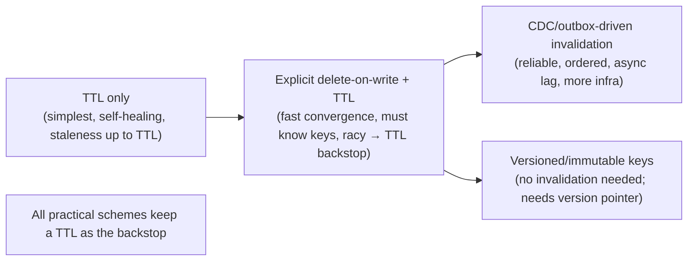
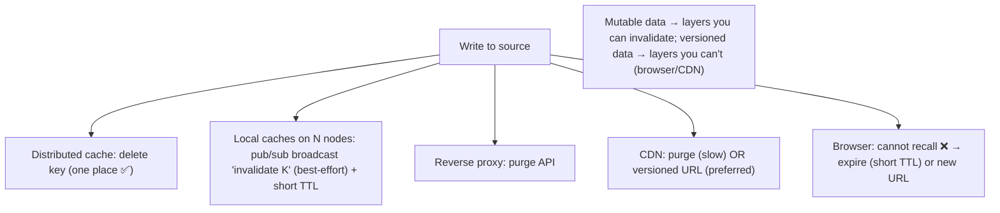

# Lesson 6.5 — Invalidation Strategies and Why It's "One of the Two Hard Things"

> Part 6: Caching · Difficulty: 🔴
>
> **Prerequisites:** [6.1 Why Caching Works], [6.2 Cache Topologies], [6.3 Caching Patterns], [6.4 TTL/Eviction], [3.3.3 CDN Invalidation], [5.4.2 Replication Lag].
> **Unlocks:** [6.6 Distributed Caching], [6.7 Stampede], [Part 9 CDC/Outbox], [Part 10 Consistency].

---

## 1. Learning Objectives

After this lesson you will be able to:

- Explain **why cache invalidation is hard** — the cache and source are **two stores with no shared transaction**, copies live in **many places (multi-layer, multi-node)**, and "when did the data change?" is hard to know precisely — and why it earned its place among "the two hard things in computer science."
- Compare the core strategies — **TTL/expiration**, **explicit invalidation (purge/delete)**, **write-through update**, **versioned keys / immutable data**, **key-based & tag/group invalidation**, and **change-data-capture (CDC)-driven invalidation** — with their consistency, latency, and complexity tradeoffs.
- Reason about the **staleness budget** per data class and pick a strategy that bounds it, and explain **`stale-while-revalidate`** and write-time races (6.3) in invalidation terms.
- Design **multi-layer and distributed invalidation** (browser/CDN/proxy/local/distributed) including fan-out via pub/sub and the limits of each layer.

---

## 2. Motivation — Keeping copies honest is the real cost of caching

A cache wins by holding **copies** of data (6.1). The moment the **authoritative** data changes, every copy is potentially **wrong** — stale. **Invalidation** is the discipline of making stale copies stop being served: deleting them, refreshing them, expiring them, or routing around them. It is *the* recurring source of caching bugs, and the reason for Phil Karlton's famous line: **"There are only two hard things in computer science: cache invalidation and naming things."**

Why is it genuinely hard, not just folklore? Three structural reasons. **(1) No shared transaction:** the cache and the database are separate systems; you can't atomically "update the DB and the cache" the way you update two rows in one transaction (5.2.1) — so any update has a window where they disagree, and concurrent operations race (the stale-set race of 6.3). **(2) Copies are everywhere:** the same datum may be cached in a browser, a CDN edge, a reverse proxy, *N* app instances' local caches, and a distributed cache (6.2) — and some of those (the browser, the CDN) you can't reach to recall. **(3) Knowing *what* changed and *which keys* to invalidate** is itself hard: one database write might invalidate many derived/cached views (a denormalized feed, an aggregate, a rendered page), and tracking that dependency graph is error-prone. The result: invalidation is a **distributed cache-coherence problem without hardware support** — and the engineering art is choosing strategies that make the **worst case a bounded, self-healing staleness** rather than silent permanent wrongness. This lesson is the strategy toolkit and the decision rules.

---

## 3. Theory — From first principles

### 3.1 The core difficulty, stated precisely

Caching introduces a **coherence problem**: multiple copies of a datum (source + cache copies) must be kept "consistent enough." Unlike CPU cache coherence (hardware protocols like MESI), application caches have **no automatic coherence** — *you* must implement it `[CS]`. And you must do it across:
- **The cache↔source gap** (no shared transaction → an update window + races, 6.3 §3.7).
- **Many layers** (6.2) and **many nodes** (per-instance local caches, 6.2 §3.2).
- **A dependency graph** (one write may stale many cached views).

So the realistic goal is **bounded staleness**, not perfect coherence: define, per data class, *how stale is acceptable* (the **staleness budget**), and choose mechanisms that keep staleness within it and **self-heal** if a signal is missed.

### 3.2 Strategy 1 — TTL / expiration (time-based)

Attach a **time-to-live**; after it elapses the entry is treated as stale and re-fetched (6.4 §3.8) `[CONV]`.
- **Pros:** dead simple; **no coordination**; **self-healing** (staleness is automatically bounded by the TTL — the single most important property); works at every layer including ones you can't reach (browser/CDN).
- **Cons:** **always some staleness** (up to the TTL); a tradeoff knob — long TTL = higher hit ratio but staler; short TTL = fresher but more misses/origin load; **synchronized expiry → stampede** without jitter (6.7).
- **Role:** TTL is the **universal backstop**. Even with active invalidation, a TTL guarantees that *any* missed/raced invalidation can only cause staleness for a bounded time. **Always have a TTL** `[BP]`.

### 3.3 Strategy 2 — Explicit invalidation (purge / delete on write)

On a write, **actively remove** the affected key(s) from the cache so the next read repopulates fresh (write-around, 6.3) `[CONV]`.
- **Pros:** **fast convergence** — fresh almost immediately after a write (not waiting for TTL); precise (only affected keys).
- **Cons:** you must **know which keys to invalidate** (the dependency-tracking problem); the delete can be **missed/lost** (best-effort) or **raced** (the stale-set race, 6.3 §3.7) — hence still pair with a TTL backstop; in multi-node/multi-layer settings the delete must **fan out** to every copy (§3.8).
- **"Delete, don't update"** `[BP]`: invalidate (remove) rather than overwrite — deletes are idempotent and let the next read pull the authoritative value, avoiding the write-time race of pushing a possibly-stale value into the cache (6.3).

### 3.4 Strategy 3 — Write-through update (refresh on write)

Update the cache **with the new value** at write time (write-through, 6.3) `[CONV]`.
- **Pros:** no post-write miss; cache is immediately fresh for that key; good when the written item is read again right away.
- **Cons:** the **stale-set race** is sharper here (concurrent writes/reads can interleave to leave the cache holding an older value than the DB); caches possibly-unread data; harder to order correctly than a delete. Prefer **delete** unless read-after-write latency demands an in-place update — and even then, guard with **versioning/CAS** (§3.7).

### 3.5 Strategy 4 — Versioned keys / immutable data (invalidation-by-design)

Make data **immutable** and encode a **version/content hash in the key** so a change produces a **new key** rather than mutating an existing one `[BP]`:
- New data → new key (`user:42:v7`, `app.3f9a2c.js`) → old key is simply **never requested again** and ages out by eviction (6.4); **no invalidation event needed at all**.
- **Pros:** **eliminates the hard problem** — there's nothing to invalidate; safe **very long / immutable TTLs**; no races; works across all layers including the uncontrollable browser/CDN (3.3.3).
- **Cons:** requires a way to **discover the current version** (a pointer/manifest that itself must be kept fresh — but that's one small, easily-managed key); old versions linger until evicted (memory cost). This is the **gold standard for static assets** (3.3.3) and very powerful for any data you can version.

### 3.6 Strategy 5 — Key-based, tag/group, and dependency invalidation

Real writes often stale **many** cached entries (a product edit invalidates the product page, the category listing, the search result, the home feed). Techniques `[CONV]`:
- **Direct key invalidation:** delete the exact key(s) — precise, but you must enumerate them.
- **Tag/group invalidation:** tag cached entries (e.g., `product:42`, `category:books`) and invalidate **by tag** — one call evicts all entries carrying that tag. Common in CDNs (cache tags / surrogate keys) and app caches.
- **Generation/namespace versioning:** prefix keys with a **generation counter** stored in the cache (`gen:catalog=7` → keys `catalog:7:...`); bump the counter to **logically invalidate an entire namespace at once** (old-generation keys are orphaned and evicted) — O(1) mass invalidation without enumerating keys.
- **Dependency tracking:** maintain a map from source entities to the cached views that derive from them, so a write can invalidate the whole dependency set. Powerful but complex/error-prone — often the trigger to move to CDC-driven invalidation (§3.7).

### 3.7 Strategy 6 — CDC / change-data-capture-driven invalidation (the robust-at-scale approach)

Instead of the application code remembering to invalidate on every write, **derive invalidations from the database's change stream** `[BP]`/`[EMERGING]`:
- The database's **replication log / WAL** (5.3.1) is tapped via **CDC** (Part 9) or the **outbox pattern** (Part 9), producing a reliable, **ordered** stream of "row X changed" events.
- A consumer turns each change into the corresponding **cache invalidation(s)** (delete keys / bump generations / invalidate tags).
- **Pros:** **single source of truth for "what changed"** — no scattered, forgettable invalidation calls; **ordered and reliable** (won't silently miss writes the way best-effort deletes can); decoupled from app code; naturally handles the dependency fan-out in one place; the basis for keeping **derived data** (search indexes, materialized views, 5.1.2) fresh too.
- **Cons:** more infrastructure (a pipeline, Part 9); invalidation is **asynchronous** (a small lag — bounded staleness, like replication lag, 5.4.2); requires mapping changes→keys. This is how large systems keep caches coherent without per-write fragility, and it dovetails with **versioning** (§3.5) and **`stale-while-revalidate`** (§3.9).

### 3.8 Multi-layer and distributed invalidation (the fan-out problem)

A datum cached in many places must be invalidated in **all** of them (6.2), and the layers differ in reachability `[CS]`:
- **Distributed (shared) cache:** **one place to invalidate** — the big advantage of a shared tier over per-node local caches (6.2 §3.2). Delete the key once.
- **Per-node local caches (L1 / near-cache):** the **hard case** — each instance has its own copy. Options: **short TTLs** (accept bounded staleness, no coordination) or an **invalidation broadcast** — publish "invalidate key K" on a **pub/sub channel** that every instance subscribes to and evicts its local copy. Pub/sub invalidation is best-effort (a node that missed the message stays stale until TTL → keep the TTL backstop). (Redis client-side caching with key-invalidation tracking is a productized version of this.)
- **Reverse proxy:** purge via the proxy's API/config — reachable but per-instance.
- **CDN:** **purge API** (slow to propagate globally) or, better, **versioned URLs** (3.3.3) — partially controllable.
- **Browser:** **not reachable** — you can only **expire** (short TTL) or change the URL (versioning). Never assume you can recall a browser-cached response (3.3.3).
**Implication:** push **mutable** data to layers you can invalidate (distributed/proxy), and use **versioning + long TTL** for data cached in layers you can't (browser/CDN).

### 3.9 Staleness budget and `stale-while-revalidate`

The unifying design tool is the **staleness budget**: for each data class, decide the **maximum acceptable staleness**, then pick mechanisms that bound it `[BP]`:
- **Zero/near-zero** (account balance, inventory at checkout): write-through or explicit-invalidate **+ short TTL**, or don't cache; consider read-from-source for the critical read (and beware replication lag if reading a replica, 5.4.2).
- **Seconds** (prices, dashboards): short TTL and/or CDC-driven invalidation.
- **Minutes–hours** (catalog descriptions, profiles): longer TTL + invalidate-on-edit.
- **Effectively immutable** (versioned assets, historical records): versioned keys + very long TTL (§3.5).

**`stale-while-revalidate`** (3.3.3) is a freshness-vs-latency sweet spot: on access to an *expired* entry, **serve the stale value immediately** *and* **refresh it in the background** — readers never wait on the miss, and the entry becomes fresh shortly after. **`stale-if-error`** serves stale data when the source is down (resilience, Part 11). Both **trade a tiny, bounded staleness for latency and resilience** and also **dampen stampedes** (only one refresh runs while others serve stale — 6.7).

### 3.10 The consistency framing

Invalidation is a **consistency-of-copies** problem (Part 10). With caching you almost always accept **eventual consistency** of the cache relative to the source, bounded by your TTL/invalidation latency — readers may briefly see stale data (analogous to **replication lag**, 5.4.2). Where you need **read-your-writes** (a user must see their own just-made change), you must either invalidate synchronously on that path, write-through, **read from the source for that user/session**, or version the key — the cache equivalent of the read-your-writes guarantee in Part 10. Naming the consistency you actually need (and don't need) per data class is what turns invalidation from guesswork into design.

---

## 4. Visual Intuition

### The strategy spectrum (convergence speed vs simplicity/cost)

### Multi-layer reachability

---

## 5. Real-World Analogy

Imagine a **printed price list** posted in many places — the **headquarters master** (source of truth), a **board in each store** (distributed cache), **sticky notes at each cashier** (per-node local caches), **flyers mailed to homes** (browser), and **billboards across the country** (CDN).

- When HQ changes a price, every copy is now **wrong** until updated — that's the invalidation problem.
- **TTL:** print "valid until Friday" on each copy — they auto-expire even if nobody updates them (self-healing, but stale until Friday).
- **Explicit purge:** call each store and say "take down the old board" (fast, but you must know which boards, and a store that misses the call stays wrong until Friday — the TTL backstop).
- **Versioned/immutable:** give the new price a **new product code** so the old code is simply never quoted again — nothing to recall.
- **Reachability differs:** you can update the **store boards** (distributed) easily; the **cashier sticky notes** (local caches) need an announcement over the PA (pub/sub broadcast); the **mailed flyers and billboards** (browser/CDN) you can't recall at all — you just wait for them to expire or issue a new version.
- **`stale-while-revalidate`:** keep showing the old price to the customer in front of you *right now* (no waiting) while a clerk fetches the new one in the back — the next customer sees the update.
- And the deep reason it's hard: there's **no single switch** that updates HQ and every copy at the same instant (no shared transaction) — so there's always a window where they disagree, and people racing to update can leave a stale copy behind.

---

## 6. Industry Example

- **Versioned static assets** `[BP]`: `app.<hash>.js` + immutable long TTL — the universal frontend answer to browser/CDN invalidation (3.3.3, §3.5).
- **CDN cache tags / surrogate keys + purge** `[CONV]`: CDNs let you tag responses and purge by tag, plus `stale-while-revalidate`/`stale-if-error` (3.3.3, §3.6/§3.9).
- **CDC/outbox-driven cache & index invalidation** `[BP]`: tapping the DB change log (Debezium-style CDC, the outbox pattern — Part 9) to invalidate caches and update search indexes/materialized views reliably and in order (§3.7, 5.1.2).
- **Redis pub/sub + client-side caching (tracking)** `[CONV]`: Redis can track which keys a client cached and **push invalidation messages** when they change — a productized local-cache invalidation channel (§3.8).
- **Generation/namespace key versioning** `[CONV]`: bumping a version prefix to invalidate a whole namespace in O(1) without enumerating keys (§3.6).
- **TTL-with-jitter everywhere** `[BP]`: bounding staleness and avoiding synchronized expiry (§3.2, 6.7).

---

## 7. Implementation Details — designing invalidation

- **Define a staleness budget per data class first** (§3.9) — it dictates every other choice. "How stale is OK here?" is the design question.
- **Always set a TTL** as the self-healing backstop, *even with* active invalidation, and **add jitter** (§3.2, 6.7) `[BP]`.
- **Prefer delete-on-write over update-on-write** to dodge the stale-set race (§3.3, 6.3); pair with a TTL so a missed delete still heals.
- **Version anything you can** (§3.5) — versioned/immutable keys turn "invalidate" into "nothing to do" and are the only robust answer for browser/CDN-cached data.
- **Use tags/generations for fan-out** when one write stales many entries (§3.6) — avoid hand-enumerating keys you'll inevitably forget.
- **Graduate to CDC/outbox-driven invalidation** when app-side invalidation becomes fragile (many writers, many derived views, multi-service) — one ordered, reliable pipeline drives all invalidations (§3.7, Part 9) `[BP]`.
- **Choose a local-cache invalidation mechanism explicitly** — short TTL (no coordination) or pub/sub broadcast (faster, best-effort + TTL backstop) (§3.8).
- **Use `stale-while-revalidate` / `stale-if-error`** to hide miss latency, add resilience, and dampen stampedes (§3.9, 6.7).
- **Name the consistency you need** — full eventual is fine for most reads; identify the **read-your-writes** paths and handle them specially (§3.10).
- **Monitor staleness & invalidation health** (Part 16): invalidation lag, missed-invalidation rate (stale-served), and hit ratio (over-aggressive invalidation tanks it).

---

## 8. Advantages (of getting invalidation right)

- **Correctness with speed** — users see fresh-enough data while still hitting cache most of the time.
- **Bounded, self-healing staleness** — TTL guarantees any miss/race heals within a known window.
- **Eliminated problem via versioning** — immutable keys remove invalidation entirely for versionable data.
- **Reliable freshness at scale** — CDC/outbox drives ordered, complete invalidation without per-write fragility.
- **Resilience** — `stale-if-error` keeps serving during source outages (Part 11).
- **Efficient fan-out** — tags/generations invalidate many entries in one operation.

---

## 9. Disadvantages / costs

- **Always some staleness** — caching = accepting bounded eventual consistency of copies (§3.10).
- **Hard dependency tracking** — knowing *which* keys a write stales is genuinely error-prone (§3.6).
- **Multi-layer/multi-node fan-out** — invalidation must reach every copy; some layers (browser/CDN) are unreachable (§3.8).
- **Races** — explicit invalidation is best-effort and can be raced or lost (the stale-set race) — needs TTL backstop (§3.3, 6.3).
- **CDC complexity** — a pipeline to build, run, and monitor; asynchronous lag (§3.7).
- **Over-invalidation hurts hit ratio** — too-aggressive purging defeats the cache (§7).

---

## 10. When NOT to (over-)invalidate / limits

- **Immutable data:** don't build invalidation machinery — version it and use long TTLs (§3.5).
- **Staleness-tolerant data:** don't add explicit invalidation + pub/sub complexity when a short TTL meets the budget (§3.2) — simplest that works.
- **Zero-staleness-critical reads:** don't rely on TTL/eventual invalidation — read from source (mind replica lag, 5.4.2), write-through, or version (§3.9).
- **Don't try to make cache+source atomic** — there's no cheap distributed transaction (5.2.1); design for bounded staleness instead (§3.1).
- **Don't update-the-cache when delete-and-repopulate suffices** — avoid the race (§3.3/3.4).

---

## 11. Common Mistakes

1. **No TTL backstop** — relying purely on explicit invalidation; one missed/raced delete = permanent staleness (§3.2, 6.3).
2. **Update-on-write instead of delete-on-write** — opens the stale-set race (§3.4, 6.3).
3. **Forgetting a layer/node** — invalidating the distributed cache but not per-node local caches (or vice versa) → intermittent stale reads (§3.8, 6.2).
4. **Trying to recall browser/CDN content** without versioning — you can't; users run stale for hours (§3.8, 3.3.3).
5. **Under-tracking dependencies** — invalidating the product key but not the listing/search/feed views that embed it (§3.6).
6. **Synchronized TTLs** — mass expiry stampede (no jitter) (§3.2, 6.7).
7. **Over-invalidation** — purging too broadly/often, collapsing hit ratio (§7).
8. **Ignoring read-your-writes** — a user doesn't see their own just-saved change because the cache is stale on their next read (§3.10).

---

## 12. Interview Questions

**🟢 Easy**
- Why is cache invalidation considered hard? Give two structural reasons.
- What is a TTL and why is it called a "self-healing backstop"?

**🟡 Medium**
- Compare TTL vs explicit invalidation vs versioned keys. When is each the right default?
- Why "delete, don't update" the cache on a write? What race does it avoid (6.3)?

**🔴 Hard**
- One database write should invalidate a product page, a category listing, a search result, and a home feed. Design the invalidation (direct keys vs tags vs generations vs CDC) and justify.
- Design invalidation across browser, CDN, reverse proxy, per-node local caches, and a distributed cache for a piece of mutable data. Which layers can you actively invalidate and which can't, and what do you do about it?

**⚫ Staff+**
- Define staleness budgets for: an account balance, a product price, a user profile, and a versioned JS bundle — and design the end-to-end invalidation/freshness strategy for each, including read-your-writes paths and replica-lag interactions (5.4.2, Part 10).
- Your team's scattered per-write `cache.delete()` calls keep missing cases, causing stale-data incidents. Design a CDC/outbox-driven invalidation pipeline (Part 9) that makes invalidation reliable and ordered, and analyze its lag, failure modes, and the staleness bound it guarantees.

---

## 13. Production Pitfalls

- **Permanent staleness from a missed/raced delete with no TTL:** the canonical incident — a value is updated in the DB but the cache keeps serving the old one indefinitely (§3.2/3.3, 6.3).
- **Stale on some nodes only:** per-node local caches not all invalidated → the bug reproduces only when a particular instance answers (§3.8, 6.2) — maddening to debug.
- **Browser/CDN serving old content for hours:** mutable content cached without versioning; purge propagates slowly or not at all (§3.8, 3.3.3).
- **Forgot the derived view:** the primary key was invalidated but a denormalized feed/aggregate/search index embedding it wasn't (§3.6, 5.1.2).
- **Read-your-writes failure:** a user saves a setting and immediately sees the old value because their next read hit a stale cache (§3.10).
- **Invalidation stampede:** a broad purge (or synchronized TTL expiry) empties many hot keys at once → mass misses overwhelm the source (§3.2, 6.7).
- **CDC lag surprise:** invalidation pipeline backs up, so cache staleness silently exceeds the assumed budget (§3.7) — monitor the lag.

---

## 14. Optimization Techniques

- **Staleness budget → mechanism** mapping per data class (§3.9) — the master technique; don't over- or under-invalidate.
- **Longest TTL the budget allows + jitter** — maximize hit ratio while bounding staleness and avoiding expiry storms (§3.2, 6.7).
- **Versioned/immutable keys** wherever possible — turns invalidation into a non-problem and enables long TTLs across uncontrollable layers (§3.5).
- **Tags/generation versioning** for O(1) fan-out invalidation (§3.6).
- **CDC/outbox-driven invalidation** for reliable, ordered, fan-out-aware freshness at scale (§3.7, Part 9) `[BP]`.
- **`stale-while-revalidate` + `stale-if-error`** for latency, resilience, and stampede dampening (§3.9, 6.7).
- **Pub/sub local-cache invalidation** (with TTL backstop) when per-node L1 staleness must converge fast (§3.8).
- **Monitor invalidation lag + stale-served + hit ratio** to catch missed/over invalidation early (Part 16).

---

## 15. Summary

Cache invalidation is "one of the two hard things" for **structural** reasons: the cache and source are **two stores with no shared transaction** (so every update has a disagreement window and concurrent ops race — the stale-set race, 6.3), **copies live in many layers and on many nodes** (6.2 — some, like the browser/CDN, you can't even reach to recall), and **knowing which keys a write stales** (the dependency graph) is error-prone. So the realistic goal is **bounded, self-healing staleness**, governed per data class by a **staleness budget**. The toolkit: **TTL** (simplest, coordination-free, the universal self-healing **backstop** — always have one, with **jitter**); **explicit invalidation** (delete-on-write — fast convergence, but best-effort/racy → keep the TTL; **"delete, don't update"** to avoid the race); **write-through update** (fresh read-after-write, but sharper race — guard with versioning/CAS); **versioned/immutable keys** (the gold standard — a change makes a *new* key, so there is **nothing to invalidate**, enabling long TTLs even in uncontrollable layers); **tags/generations** for O(1) fan-out across many entries; and **CDC/outbox-driven invalidation** (the robust-at-scale approach — derive ordered, reliable invalidations from the DB change log instead of scattered, forgettable `delete()` calls, also keeping derived data like search indexes/materialized views fresh). Across **layers**, invalidate where you can (distributed cache = one place; local caches via short TTL or **pub/sub broadcast**; proxy via purge) and **version** what's cached where you can't (browser/CDN). **`stale-while-revalidate`/`stale-if-error`** trade tiny bounded staleness for latency and resilience and dampen stampedes (6.7). Ultimately invalidation is a **consistency-of-copies** problem (Part 10): accept bounded eventual consistency for most reads, and explicitly handle **read-your-writes** paths.

---

## 16. Revision Notes (flashcard-ready)

- **Q:** Why is invalidation hard (3 reasons)? **A:** No shared transaction (update window + races), copies in many layers/nodes (some unreachable), and hard to know which keys a write stales.
- **Q:** Realistic goal? **A:** Bounded, self-healing staleness within a per-class **staleness budget** — not perfect coherence.
- **Q:** TTL's key property? **A:** Self-healing backstop — bounds staleness from any missed/raced invalidation; always have one (+ jitter).
- **Q:** Delete vs update the cache on write? **A:** Delete (idempotent, repopulate fresh) avoids the stale-set race; prefer it.
- **Q:** Versioned/immutable keys? **A:** Change → new key → old key never requested → nothing to invalidate; enables long TTL even for browser/CDN.
- **Q:** Tag/generation invalidation? **A:** Invalidate many entries in one op (by tag, or by bumping a namespace generation counter) without enumerating keys.
- **Q:** CDC/outbox-driven invalidation? **A:** Derive ordered, reliable invalidations from the DB change log (Part 9) — no scattered delete() calls; async lag.
- **Q:** Layer reachability? **A:** Distributed = one place; local caches = short TTL or pub/sub; proxy = purge; CDN = purge/version; browser = can't recall (expire/version).
- **Q:** stale-while-revalidate? **A:** Serve stale immediately + refresh in background → no miss wait, freshens shortly, dampens stampede; stale-if-error adds resilience.
- **Q:** Read-your-writes in caching? **A:** User must see own change → invalidate synchronously / write-through / read source / version the key for that path.

---

## 17. Further Reading + Knowledge-Graph Links

**Within this platform**
- **Previous:** [6.4 Eviction Policies] (TTL/eviction internals). **Builds on:** [6.1], [6.2 Topologies/layers], [6.3 Patterns] (the stale-set race, delete-don't-set), [3.3.3 CDN purge/versioning], [5.4.2 Replication lag].
- **Next:** [6.6 Distributed Caching] (invalidation across a cache cluster), [6.7 Stampede] (mass-expiry/SWR).
- **Enables:** [Part 9 CDC/Outbox] (change-stream-driven invalidation), [Part 10 Consistency] (read-your-writes, eventual consistency of copies).

**Foundational texts (synthesized)**
- Kleppmann, *Designing Data-Intensive Applications* — derived data, change capture, consistency of copies (synthesized).
- Kurose & Ross, *Computer Networking* — web cache consistency, conditional GETs, freshness (synthesized).
- CDN & distributed-cache documentation (cache tags, purge, SWR, key tracking) — representative.

**Concept tags:** `[CS]` no shared transaction, cache coherence without hardware, bounded staleness, consistency-of-copies · `[CONV]` TTL, explicit purge/delete, write-through, tags/generations, pub/sub invalidation, CDN purge · `[BP]` always-TTL+jitter, delete-don't-update, version immutable data, staleness budget per class, CDC/outbox-driven, stale-while-revalidate · `[EMERGING]` CDC-driven cache coherence at scale.
