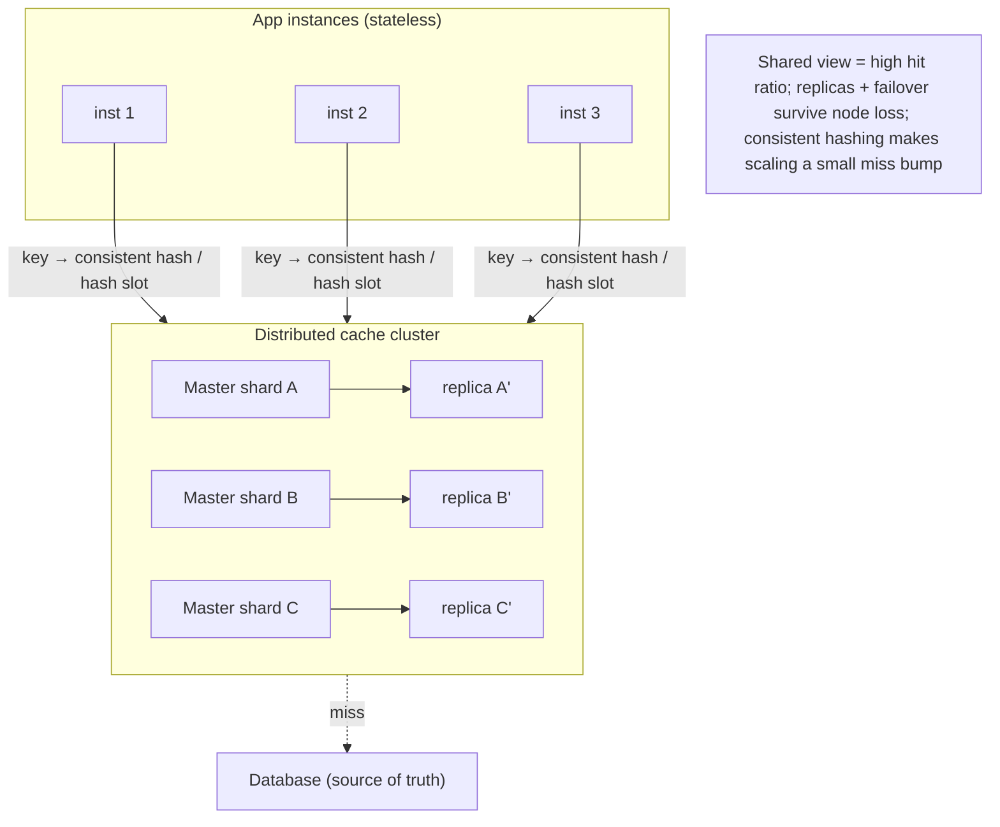
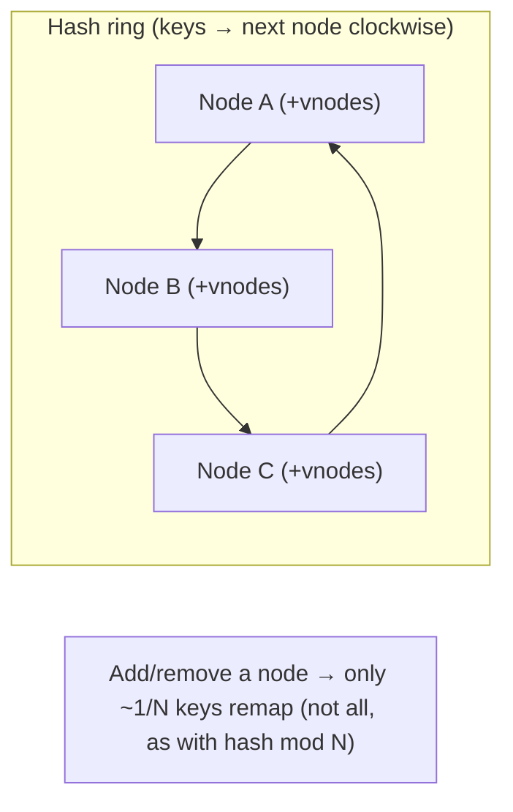

# Lesson 6.6 — Distributed Caching with Redis/Memcached: Data Structures, Persistence, Clustering

> Part 6: Caching · Difficulty: 🔴
>
> **Prerequisites:** [6.2 Cache Topologies], [6.3 Caching Patterns], [6.4 Eviction], [6.5 Invalidation], [5.3.1 WAL], [5.4.2 Replication/Failover].
> **Unlocks:** [6.7 Stampede], [7.2 Stateless Services], [7.3 Sharding/Consistent Hashing], [Part 8 Coordination].

---

## 1. Learning Objectives

After this lesson you will be able to:

- Contrast **Memcached** (simple, multithreaded, volatile key→blob cache) and **Redis** (single-threaded-core, rich data-structure server with optional persistence, replication, and clustering) — *representative* — and choose between them.
- Explain Redis's **data structures** (strings, hashes, lists, sets, sorted sets, bitmaps, HyperLogLog, streams) and how they enable patterns beyond plain caching (counters, leaderboards, rate limiters, sessions, queues).
- Explain **persistence** options (Redis RDB snapshots vs AOF append-only log) and why a cache that is "sometimes durable" still must be treated as **losable** (6.1).
- Reason about **scaling and clustering**: client-side sharding, **consistent hashing** (and why it beats modulo), Redis Cluster hash slots, replication + automatic failover (Sentinel/Cluster), and the consistency/availability tradeoffs (CAP/PACELC preview, Part 10).

---

## 2. Motivation — The shared cache tier, in practice

6.2 established the **distributed (shared) cache** as the application-layer workhorse: one tier all instances talk to, giving a single high-hit-ratio view, large capacity, one place to invalidate, and survival across app restarts — enabling **stateless services** (7.2). This lesson is the concrete engineering of that tier, anchored on the two dominant systems: **Memcached** and **Redis** (*both representative*; internals summarized from public docs).

This matters because the shared cache is **infrastructure you operate**, not just a library call. The choices here have system-wide consequences: a **wrong eviction/maxmemory config** can OOM or start rejecting writes (6.4); **persistence settings** change restart and durability behavior; and above all, once your data outgrows one node you must **shard** it — which drags in **consistent hashing** (also the foundation of database partitioning, 7.3) and turns the cache into a **distributed system** with replication, **failover**, and the same **availability-vs-consistency** tradeoffs as any other (Part 10). A cache node failing or a shard rebalancing can, if mishandled, trigger a mass-miss **stampede** onto the database (6.7) — i.e., the cache tier's own failures can take down the system it was protecting. Understanding Redis/Memcached internals — data structures, persistence, and clustering — is what lets you build a shared cache that is fast *and* operationally safe.

---

## 3. Theory — From first principles

### 3.1 What a distributed cache server is

A **distributed cache** is a standalone in-memory data store, accessed over the network by many clients, holding key→value data in RAM for microsecond-to-millisecond access `[CONV]`. It is **shared** (6.2) — one logical store for the whole fleet. The two canonical systems:

- **Memcached** — a deliberately **simple, multithreaded** key→**opaque-blob** cache. Values are just bytes; no data structures, no persistence, minimal features. Scales vertically across cores (multithreaded) and horizontally via **client-side sharding**. Philosophy: *do one thing — volatile caching — extremely well and simply.*
- **Redis (REmote DIctionary Server)** — an **in-memory data-structure server**. A (historically) **single-threaded** command-execution core (so each command is atomic and there are no data races) backed by rich **data types**, optional **persistence**, **replication**, **pub/sub**, **transactions/Lua scripting**, and **clustering**. Philosophy: *a versatile in-memory data platform*, of which caching is one use. (Modern Redis offloads some I/O to threads, but command execution on a shard is effectively single-threaded — the mental model that explains its atomicity.) `[CONV]`

### 3.2 Memcached vs Redis — the choice

| Dimension | Memcached | Redis |
|---|---|---|
| Data model | opaque blobs (key→bytes) | rich structures (strings, hashes, lists, sets, zsets, bitmaps, HLL, streams) |
| Threading | multithreaded (scales on cores) | single-threaded command core (atomic ops; modern I/O threads) |
| Persistence | none (purely volatile) | optional (RDB snapshots / AOF) |
| Replication/HA | none built-in | replicas + Sentinel/Cluster failover |
| Clustering | client-side sharding | client sharding **or** Redis Cluster (hash slots) |
| Eviction | slab LRU (6.4) | configurable `maxmemory-policy` (sampled LRU/LFU/…, 6.4) |
| Best for | pure, simple, high-throughput volatile cache | caching **plus** counters/leaderboards/sessions/queues/rate-limiters; when you need structures, persistence, or HA |

**Rule of thumb** `[BP]`: choose **Memcached** when you want a *simple, pure* cache of blobs and value its multithreaded simplicity; choose **Redis** when you need **data structures**, **atomic operations**, **persistence**, or **built-in HA/clustering** — which is most non-trivial use cases today.

### 3.3 Redis data structures (why "more than a cache")

Each value type comes with **atomic operations**, which is what makes Redis a coordination/primitive toolkit, not just a cache `[CONV]`:
- **Strings** — bytes/numbers; `GET/SET`, `INCR/DECR` (atomic counters — page views, rate-limit counters), `SETEX` (with TTL), `SETNX` (set-if-not-exists → **locks**, 6.7/Part 8).
- **Hashes** — field→value maps; store an object's fields without serializing the whole thing (e.g., a user/session record); update one field atomically.
- **Lists** — ordered, push/pop at both ends; **queues/stacks**, recent-activity feeds (`LPUSH`/`RPOP`, blocking `BRPOP`).
- **Sets** — unordered unique members; membership, tags, unique-visitor sets; set algebra (intersect/union).
- **Sorted sets (zsets)** — members ordered by a **score**; the classic **leaderboard** (`ZADD`/`ZRANGE`/`ZRANK`), and the backbone of **rate limiters** (sliding-window by timestamp score), priority queues, and time-ordered data.
- **Bitmaps / bitfields** — bit-level ops on strings; compact boolean state (e.g., daily active flags per user id).
- **HyperLogLog** — probabilistic **cardinality** estimation (unique counts) in tiny fixed memory (a few KB) with bounded error — count uniques over huge sets cheaply.
- **Streams** — append-only log with consumer groups; lightweight **event/messaging** (Part 9 territory).
These structures + atomic ops + TTLs let Redis serve **sessions** (7.2), **rate limiting** (Part 15), **leaderboards**, **queues**, **pub/sub invalidation** (6.5), and **distributed locks** (Part 8) — all in addition to caching.

### 3.4 Persistence — and why a "durable cache" is still losable

Memcached has **no** persistence (restart = empty). Redis offers two mechanisms `[CONV]`:
- **RDB (snapshotting):** periodically fork and dump the whole dataset to a compact binary file. **Pros:** compact, fast restart-load, low runtime overhead. **Cons:** you can **lose all writes since the last snapshot** on a crash (snapshot interval = your RPO).
- **AOF (Append-Only File):** log **every write command** to a file (think WAL, 5.3.1), replayed on restart. `fsync` policy tunes durability vs speed: `always` (durable, slow), `everysec` (lose ≤1s on crash — the common choice), `no` (OS decides). **Pros:** much smaller data-loss window; more durable. **Cons:** larger files (periodically rewritten/compacted), slightly higher overhead.
- You can run **both** (AOF for durability + RDB for fast restarts).

**Crucial framing** `[BP]`: persistence makes Redis *recover faster* and *lose less*, but a cache must **still be treated as losable** (6.1). Persistence is for **warm restarts** (avoid a cold-cache stampede, 6.7) and for Redis used as a *primary* store — not a license to store the only copy of critical data in a volatile-by-design tier and skip the source of truth. If you need true durability for, say, money, that's a database (ACID, 5.2.1), not a cache.

### 3.5 Scaling out — sharding and consistent hashing

One node's RAM/throughput is finite; beyond it you **partition (shard)** keys across nodes `[CS]`. How to map key→node?

- **Naive modulo:** `node = hash(key) mod N`. **Fatal flaw:** changing `N` (add/remove a node) remaps **almost every key** → a near-total cache miss storm → the database gets stampeded (6.7). Modulo sharding makes scaling the cache an outage.
- **Consistent hashing** `[CS]` (7.3): map both **nodes** and **keys** onto a hash **ring**; a key belongs to the **next node clockwise**. Adding/removing a node remaps **only ~1/N of keys** (those between the changed node and its predecessor), not all of them. **Virtual nodes** (many ring points per physical node) smooth out load imbalance and make rebalancing even. This is *the* technique for elastic cache (and DB) clusters — covered in depth in 7.3. The payoff: you can scale the cache tier up/down with **minimal cache disruption** (small miss bump, not a storm).

### 3.6 Redis Cluster, replication, and failover

Redis offers two HA/scale models `[CONV]`:
- **Client-side sharding (like Memcached):** the client library hashes keys (ideally consistent-hashing) across independent Redis nodes. Simple, but the client owns topology and there's no built-in failover.
- **Redis Cluster:** Redis partitions the keyspace into **16384 hash slots**; each node owns a range of slots; clients are redirected (`MOVED`/`ASK`) to the right node. Slots can be migrated to **rebalance**. Each master has **replicas**, and the cluster does **automatic failover** (promote a replica if a master dies) via gossip among nodes (Part 8). Multi-key operations are constrained to a single slot (use **hash tags** `{...}` to co-locate related keys).
- **Sentinel** (for non-cluster setups): a separate monitoring system that watches a master+replicas, detects failure by quorum, and **promotes a replica** + reconfigures clients — automatic failover without sharding.

**Replication** is **asynchronous** by default (5.4.2): a master acks a write, then streams it to replicas. This is fast but means a **failover can lose the last unreplicated writes** — fine for a cache (losable, 6.1), but a reason never to treat async-replicated Redis as a durable source of truth.

### 3.7 Consistency, availability, and the CAP/PACELC preview

A distributed, replicated cache is a distributed system, so it inherits the **CAP/PACELC** tradeoffs (Part 10) `[CS]`:
- **Async replication → eventual consistency:** a replica may serve a slightly stale value; reading from replicas trades freshness for read scaling (5.4.2). Reading from the master avoids that but doesn't scale reads.
- **Failover → possible small data loss + a window of unavailability** while a new master is elected (Part 8 leader election) — and the **split-brain** risk if two nodes both think they're master during a partition (mitigated by quorum/fencing, Part 8/11).
- **For a cache, availability usually wins:** since the cache is losable and the source is authoritative, you generally prefer to **stay available and accept staleness/loss** rather than block. (A database makes the opposite call for critical data.) This is exactly the PACELC framing you'll formalize in Part 10.

### 3.8 Operating the tier safely (the cache-as-a-dependency reality)

Because the shared cache fronts the database, **its failures are the database's surge** `[BP]`:
- **Set `maxmemory` + an eviction policy** (6.4) — never let it OOM or start erroring on writes.
- **Plan for node loss:** replication + failover (Sentinel/Cluster) so a single node death doesn't dump all its keys' traffic onto the DB; and design the app to **degrade gracefully** to the source if the whole tier is unavailable (6.1, 6.7) — *with stampede protection*, or the DB dies anyway.
- **Use consistent hashing** so scaling/rebalancing causes a small miss bump, not a storm (§3.5, 6.7).
- **Beware hot keys/shards** — one celebrity key can overload a single node regardless of cluster size (6.7, 7.4); replicate or split hot keys.
- **Warm the cache** (persistence-based fast restart, or preloading) to avoid cold-start stampedes after restarts/deploys (6.7).
- **Watch the right metrics** (Part 16): hit ratio, evictions, memory, ops/sec, **replication lag**, connected clients, slow commands, and per-shard balance.
- **Mind single-threaded pitfalls (Redis):** one slow command (e.g., `KEYS *`, a huge `ZRANGE`, a big Lua script) **blocks the whole node** — use `SCAN` not `KEYS`, avoid O(N) commands on big structures, keep commands cheap.

---

## 4. Visual Intuition

### Shared tier with sharding + replication

### Consistent hashing ring (why modulo is bad)

---

## 5. Real-World Analogy

Think of a **shared reference library** for a big office (the distributed cache), versus everyone keeping their own desk copies (local caches, 6.2).

- **Memcached** is a **plain shelf of photocopies**: fast, simple, no labels, no backup — if the building loses power, the shelf is empty in the morning (volatile), and you just refill it from the archive (source of truth).
- **Redis** is a **well-organized reference room**: not just photocopies but **card catalogs, ranked top-10 lists (sorted sets), tally counters (INCR), sign-in sheets (sets), and a logbook (streams)** — and it can keep a **logbook of every change (AOF)** or take a **nightly photo of the whole room (RDB)** so that after a power cut it can be rebuilt quickly instead of starting empty.
- **Sharding with consistent hashing** is splitting the collection across **several reference rooms** by a rule that means **adding a new room only moves a small slice** of the books — not reshuffling the entire library (which is what naive modulo would do, and why it causes chaos).
- **Replicas + failover** are **backup rooms** that take over instantly if one room floods — readers barely notice, though the very latest additions that hadn't been copied yet might be lost (async replication).
- And the operational truth: this reference room **protects the archive (database) from being mobbed**. If the reference room suddenly closes (cache outage) and everyone rushes the archive at once, the archive collapses — so you keep backups, scale gently, and never let everyone stampede the archive at once (6.7).

---

## 6. Industry Example

- **Memcached at web scale** `[CONV]`: large sites historically ran huge Memcached fleets (client-sharded) as a simple volatile object cache in front of databases — the archetypal shared cache tier (6.2). *(Representative.)*
- **Redis for sessions, rate limiting, leaderboards, queues** `[CONV]`: `INCR`-based counters/rate limiters, sorted-set leaderboards, list-based queues, and hash-based sessions are standard production uses beyond plain caching (§3.3).
- **Redis Cluster / Sentinel HA** `[CONV]`: hash-slot sharding with replica failover (Cluster), or Sentinel-managed master/replica failover, for HA caches (§3.6).
- **AOF `everysec` durability** `[BP]`: the common Redis durability setting — bounded ≤1s loss window — used when fast warm restarts matter (§3.4).
- **Consistent hashing origins** `[CS]`: introduced for distributed web caching and popularized by Dynamo-style systems; now standard for cache and DB partitioning (§3.5, 7.3). *(Representative.)*
- **HyperLogLog for unique counts** `[CONV]`: counting unique visitors/events in fixed tiny memory with bounded error (§3.3).

---

## 7. Implementation Details — building and running the tier

- **Pick Memcached vs Redis by needs** (§3.2): pure simple blob cache → Memcached; need structures/atomic ops/persistence/HA → Redis (usually the default today) `[BP]`.
- **Use the right data structure** (Redis): hashes for objects, sorted sets for leaderboards/sliding-window rate limits, `INCR` for counters, sets for membership, `SETNX`+TTL for locks (§3.3) — don't serialize whole blobs when a structure fits.
- **Set `maxmemory` + eviction policy explicitly** (6.4) and decide `allkeys-*` vs `volatile-*`; never run unbounded.
- **Choose persistence by purpose** (§3.4): RDB for fast warm restarts; AOF `everysec` for low-loss durability; both for both — but still treat the tier as losable.
- **Shard with consistent hashing / Redis Cluster**, not `hash mod N`, so scaling doesn't trigger a miss storm (§3.5) `[BP]`.
- **Run replicas + automatic failover** (Sentinel/Cluster) so node loss doesn't dump a shard's traffic on the DB; understand async replication can lose the last writes (§3.6).
- **Always have a graceful-degradation path to the source** for a full-tier outage — *with stampede protection* (6.7), or the DB falls over.
- **Avoid O(N)/blocking commands on Redis** (`KEYS`, huge ranges, big scripts) — they block the single-threaded core; use `SCAN`, keep commands cheap (§3.8).
- **Co-locate related keys with hash tags `{...}`** when you need multi-key ops in Redis Cluster (§3.6).
- **Monitor** hit ratio, evictions, memory, replication lag, hot-key/shard balance, slow commands (§3.8, Part 16).

---

## 8. Advantages

- **Shared, high-hit-ratio, large-capacity cache** for the whole fleet; enables **stateless services** (6.2, 7.2).
- **Microsecond–millisecond access** to in-memory data over the network.
- **Redis: rich atomic structures** → counters, leaderboards, sessions, queues, rate limiters, locks, pub/sub — a coordination/primitive toolkit, not just a cache (§3.3).
- **Optional persistence** → fast warm restarts (avoid cold-start stampedes) and low-loss recovery (§3.4).
- **Horizontal scale via sharding** (consistent hashing) and **HA via replication + failover** (§3.5/3.6).
- **Memcached: simplicity + multithreaded throughput** for pure caching.

---

## 9. Disadvantages

- **It's a distributed system** — sharding, replication, failover, rebalancing, split-brain risk; real operational weight (§3.6/3.7).
- **A new critical dependency & failure mode** — tier outage = DB surge/stampede (§3.8, 6.7).
- **Async replication = possible data loss on failover + replica staleness** (§3.6, 5.4.2).
- **Hot keys/shards** can overload a single node regardless of cluster size (§3.8, 7.4).
- **Redis single-threaded pitfalls** — one slow/O(N) command blocks the node (§3.8).
- **Persistence overhead/limits** — RDB loss window, AOF size/rewrite cost; still not a true durable database (§3.4).
- **Memory cost** — RAM is expensive; sizing and eviction must be managed (6.4).

---

## 10. When NOT to use it / limits

- **As a system of record for critical/durable data** — a volatile-by-design, async-replicated cache is not an ACID database; use a database for money/orders (§3.4, 5.2.1).
- **When a local in-process cache suffices** — for tiny, read-mostly, staleness-tolerant data, the network hop + infra of a distributed tier isn't worth it (6.2).
- **For complex queries/relationships** — it's key-access (and structures), not a relational/query engine.
- **Modulo sharding at any nontrivial scale** — you'll get miss storms on scaling; use consistent hashing (§3.5).
- **Strong cross-key transactions across shards** — distributed cache transactions are limited; don't rely on them for correctness (use the database, 5.2).

---

## 11. Common Mistakes

1. **Storing the only copy of critical data in the cache** — treating a losable tier as durable; persistence ≠ a database (§3.4, 6.1).
2. **`hash mod N` sharding** — adding/removing a node remaps nearly all keys → DB stampede (§3.5, 6.7).
3. **No `maxmemory`/eviction policy** — OOM or write-rejection outage (6.4, §3.8).
4. **Running `KEYS *` / big O(N) commands in prod (Redis)** — blocks the single-threaded core, stalling everyone (§3.8).
5. **No replicas/failover** — one node death dumps its shard's traffic on the DB (§3.6, 6.7).
6. **No graceful degradation for a tier outage** — the app errors out or stampedes the DB when the cache is down (§3.8, 6.7).
7. **Assuming sync replication** — surprised by lost writes / stale replica reads after failover (§3.6).
8. **Serializing whole blobs when a structure fits** — losing atomic field updates and wasting bandwidth (use hashes/zsets) (§3.3).
9. **Ignoring hot keys** — a celebrity key overloads one shard while the cluster looks under-utilized (§3.8, 7.4).

---

## 12. Interview Questions

**🟢 Easy**
- What's the core difference between Memcached and Redis? When would you pick each?
- Name three Redis data structures and a use for each beyond plain caching.

**🟡 Medium**
- Compare Redis RDB vs AOF persistence. Why is a "persistent" cache still treated as losable?
- Why is `hash mod N` a bad way to shard a cache, and how does consistent hashing fix it?

**🔴 Hard**
- Design a highly-available, horizontally-scaled Redis tier: sharding, replication, failover (Sentinel vs Cluster), and what happens to in-flight/last writes during a failover.
- Redis is single-threaded at the command core. What does that buy you (atomicity), and what pitfalls does it create? How do you avoid blocking the node?

**⚫ Staff+**
- Architect the shared cache tier for a read-heavy service: choose Memcached vs Redis, data structures, eviction + persistence, sharding (consistent hashing / hash slots), HA/failover, hot-key handling, and the **degradation + stampede-protection** plan for a full-tier outage. Defend the consistency/availability stance (PACELC, Part 10).
- You must add cache nodes to handle growth without a miss storm, and survive node failures without stampeding the database. Detail the consistent-hashing/rebalancing scheme, replica/failover behavior, async-replication loss window, and how you keep the DB protected throughout.

---

## 13. Production Pitfalls

- **Cache-tier outage = DB meltdown:** no degradation/stampede protection, so when Redis goes down 100% of reads hit the DB at once and it falls over (§3.8, 6.7) — the protector becomes the killer.
- **Rebalance miss storm:** `hash mod N` (or careless slot migration) remaps most keys on a scale event → mass misses → DB surge (§3.5).
- **Blocking command stall:** a `KEYS *` or huge sorted-set range on a single-threaded Redis freezes all clients for seconds (§3.8).
- **Failover data loss / stale reads:** async replication means a promoted replica is missing the last writes, and replica reads serve stale data (§3.6).
- **Split-brain during partition:** two masters accept writes; on heal, conflicting state (mitigate with quorum/fencing, Part 8/11).
- **OOM / write rejection:** no `maxmemory` policy → memory fills, evictions thrash or writes error (§3.8, 6.4).
- **Hot-key shard overload:** one viral key saturates a single node's CPU/network while the rest of the cluster is idle (§3.8, 7.4, 6.7).
- **Cold restart stampede:** a node without persistence (or with stale RDB) restarts empty and its keys' traffic stampedes the DB (§3.4, 6.7).

---

## 14. Optimization Techniques

- **Right data structure + atomic ops** (Redis) — hashes/zsets/INCR instead of read-modify-write blobs (§3.3).
- **Consistent hashing + virtual nodes** for even load and minimal-disruption scaling (§3.5, 7.3).
- **Replicas for read scaling + failover** (accepting replica staleness) (§3.6, 5.4.2).
- **Persistence for warm restarts** (RDB fast-load and/or AOF) to dodge cold-start stampedes (§3.4, 6.7).
- **Pipelining / multi-get** to batch round trips; **client-side (near) caching** (6.2) for the hottest keys to cut network hops.
- **Hot-key mitigation** — replicate hot keys across nodes, add a local L1 for them, or split/shard the hot key (§3.8, 6.7, 7.4).
- **Cheap, non-blocking commands** — `SCAN` over `KEYS`, bounded ranges, small scripts (§3.8).
- **Graceful degradation + stampede protection** (locks/coalescing/jitter, 6.7) so cache failures never cascade to the DB (§3.8).
- **Monitor hit ratio, evictions, memory, replication lag, per-shard balance, slow commands** (Part 16).

---

## 15. Summary

The shared cache tier (6.2) is, in practice, **Memcached** or **Redis** (*representative*). **Memcached** is a simple, multithreaded, purely-volatile key→blob cache — great when you want a pure, fast cache and nothing more. **Redis** is an in-memory **data-structure server** with a (logically) single-threaded, atomic command core and rich types — **strings/INCR** (counters, rate limiters, `SETNX` locks), **hashes** (objects/sessions), **lists** (queues), **sets** (membership), **sorted sets** (leaderboards, sliding-window rate limits), **bitmaps**, **HyperLogLog** (cheap unique counts), and **streams** (lightweight messaging) — making it a caching *and* coordination toolkit (sessions for 7.2, pub/sub invalidation for 6.5, locks for Part 8). **Persistence** — **RDB** snapshots (compact, fast restart, loses since last snapshot) and/or **AOF** (write log à la WAL, `everysec` ≈ ≤1s loss) — enables **warm restarts** (avoiding cold-cache stampedes, 6.7) and lower-loss recovery, but a cache stays **losable** (6.1): persistence is not a license to treat it as an ACID database (5.2.1). To scale beyond one node you **shard**, and you must use **consistent hashing** (only ~1/N keys remap on a topology change, with virtual nodes for balance) — **never `hash mod N`**, which causes a full miss storm (7.3). **HA** comes from **replicas + automatic failover** (Sentinel, or **Redis Cluster**'s 16384 hash slots + gossip failover), with **async replication** trading a small failover loss window and replica staleness for speed (5.4.2) — inheriting **CAP/PACELC** tradeoffs (Part 10), where a cache usually favors **availability** since the source is authoritative. Operationally, the tier is a **critical dependency**: set `maxmemory`+eviction (6.4), run replicas/failover, use consistent hashing, handle **hot keys** (7.4), avoid blocking commands, warm on restart, and **always** have a graceful-degradation-with-stampede-protection path so a cache failure never melts the database it was protecting (6.7).

---

## 16. Revision Notes (flashcard-ready)

- **Q:** Memcached vs Redis in one line? **A:** Memcached = simple, multithreaded, volatile blob cache; Redis = single-threaded-core data-structure server with persistence, replication, clustering.
- **Q:** Why is Redis "more than a cache"? **A:** Rich atomic structures (zsets/hashes/INCR/sets/streams) → leaderboards, counters, rate limiters, sessions, queues, locks, pub/sub.
- **Q:** Redis sorted set use? **A:** Leaderboards and sliding-window rate limiting (members scored by value/timestamp).
- **Q:** RDB vs AOF? **A:** RDB = periodic snapshot (compact, fast restart, loses since last snapshot); AOF = write-command log (≤1s loss with everysec, more durable, bigger).
- **Q:** Is a persistent cache durable enough to be a system of record? **A:** No — still losable; persistence is for warm restarts/low-loss, not ACID. Use a DB for critical data.
- **Q:** Why not `hash mod N` sharding? **A:** Changing N remaps almost all keys → mass miss storm → DB stampede.
- **Q:** Consistent hashing benefit? **A:** Only ~1/N keys remap on add/remove; virtual nodes balance load (7.3).
- **Q:** Redis Cluster sharding unit? **A:** 16384 hash slots split across masters; clients redirected (MOVED/ASK); hash tags `{}` co-locate keys.
- **Q:** HA options? **A:** Sentinel (monitor + promote replica) or Redis Cluster (slots + replicas + gossip failover); async replication → small failover loss window.
- **Q:** Biggest operational risk of the tier? **A:** Its outage/rebalance becomes the DB's stampede — need replicas, consistent hashing, degradation + stampede protection (6.7).
- **Q:** Single-threaded pitfall? **A:** One O(N)/blocking command (KEYS *, huge range) blocks the whole node — use SCAN, keep commands cheap.

---

## 17. Further Reading + Knowledge-Graph Links

**Within this platform**
- **Previous:** [6.5 Invalidation]. **Builds on:** [6.2 Topologies] (the shared tier), [6.3 Patterns], [6.4 Eviction/maxmemory], [5.3.1 WAL] (AOF analogy), [5.4.2 Replication/Failover].
- **Next:** [6.7 Stampede] (hot keys, cold start, tier-failure surge). **Deep-dive:** [7.3 Sharding & Consistent Hashing], [7.4 Hotspots/Skew], [Part 8 Failover/Leader Election/Locks], [Part 10 CAP/PACELC consistency].
- **Enables:** [7.2 Stateless Services] (sessions in the shared cache).

**Foundational texts (synthesized)**
- Kleppmann, *Designing Data-Intensive Applications* — partitioning, replication, consistent hashing, async replication tradeoffs (synthesized).
- Redis & Memcached documentation — data types, persistence (RDB/AOF), Cluster/Sentinel — representative.
- Karger et al., consistent hashing (concept, synthesized).

**Concept tags:** `[CS]` consistent hashing vs modulo, single-threaded atomicity, async replication tradeoffs · `[CONV]` Memcached vs Redis, RDB/AOF, Redis Cluster hash slots, Sentinel failover, data structures · `[BP]` choose by needs, set maxmemory+policy, consistent hashing not modulo, treat cache as losable, graceful degradation + stampede protection, avoid blocking commands.
