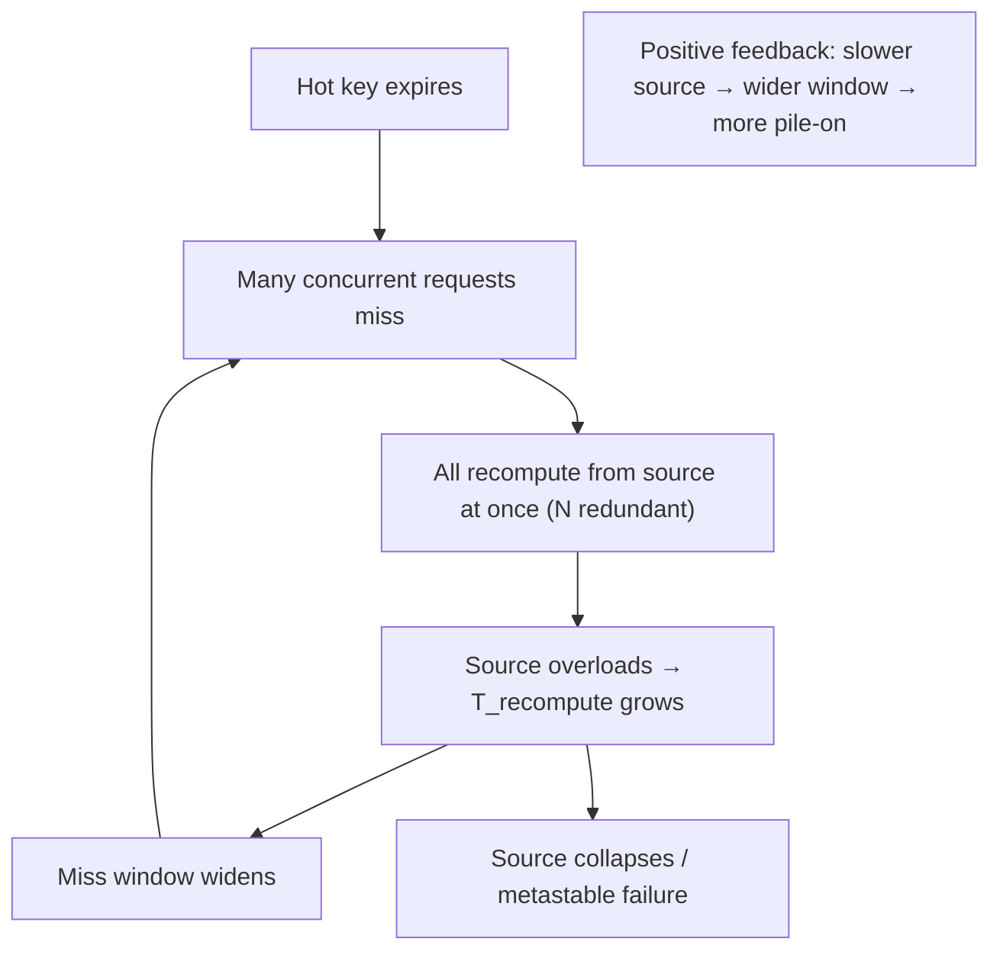
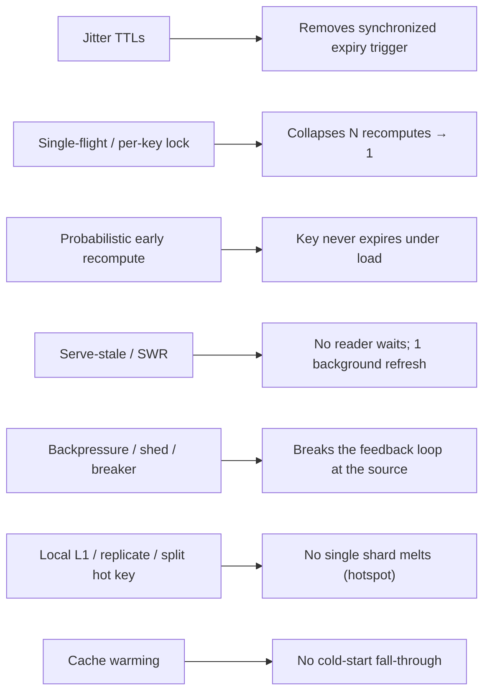

# Lesson 6.7 — Cache Stampede, Hotspots, and Thundering Herd: Mitigations (Locks, Coalescing, Jitter)

> Part 6: Caching · Difficulty: 🔴
>
> **Prerequisites:** [6.1 Why Caching Works], [6.3 Patterns], [6.4 TTL/Eviction], [6.5 Invalidation], [6.6 Distributed Caching], [3.3.4 Backpressure].
> **Unlocks:** [7.4 Hotspots & Skew], [Part 11 Resilience: timeout/retry/circuit breaker], [Part 17 Tail Latency].

---

## 1. Learning Objectives

After this lesson you will be able to:

- Define and distinguish the related failure modes — **cache stampede** (a.k.a. **dog-piling**), **thundering herd**, **cold-start**, and **hot keys/hotspots** — and explain why the **miss path**, not the hit path, is where caches cause outages.
- Explain **why a stampede is self-amplifying**: many concurrent misses on a hot key all hit the source, which slows down, which lengthens the miss window, which lets *more* requests pile on — a positive-feedback collapse.
- Apply the standard **mitigations**: **request coalescing / single-flight**, **per-key locks (mutex) + early recomputation**, **probabilistic early expiration (XFetch)**, **TTL jitter**, **`stale-while-revalidate` / serve-stale**, **cache warming**, and **hot-key handling** (replication, local L1, splitting).
- Connect cache failure modes to general resilience (timeouts, backpressure, load shedding, circuit breakers — Part 11) and explain how the cache, mismanaged, becomes the cause of the outage it was meant to prevent.

---

## 2. Motivation — The cache's miss path is a loaded gun pointed at your database

Every prior Part-6 lesson optimized the **hit** path. This one is about the **miss** path — and it's where caches *cause* outages. The whole point of a cache is to keep most traffic off the slow source (6.1); the corollary is that the source is **provisioned assuming the cache is doing its job**. So the moment a chunk of traffic *misses simultaneously* — because a hot key expired, the cache restarted cold, a node failed, or an invalidation emptied many keys at once — that traffic lands on a source that was **never sized to take it**. The cache that was protecting the database becomes the **mechanism that overloads it**.

These events have names. A **cache stampede** (dog-piling): many concurrent requests miss the *same* hot key (e.g., it just expired) and **all** recompute/refetch it at once, hammering the source with redundant work. A **thundering herd**: a flood of clients/threads all wake and act simultaneously (the general phenomenon; cache stampede is a special case). **Cold-start**: a freshly-started/flushed cache offers no protection, so 100% of traffic falls through. **Hot key / hotspot**: a single key (a celebrity, a viral item, a global config) gets so much traffic that one cache node/shard can't keep up regardless of cluster size (7.4). What makes these dangerous is **positive feedback** — the overloaded source slows down, which *widens* the window during which requests miss, which lets *even more* requests pile on, a runaway collapse (closely related to the **metastable failures** and **retry storms** of Part 11). This lesson is the catalog of these failure modes and the battle-tested mitigations, and it's the capstone of Part 6 because it's where caching design meets **resilience engineering** (Part 11) and **tail latency** (Part 17).

---

## 3. Theory — From first principles

### 3.1 The miss-path failure family

| Failure | Trigger | Effect on source |
|---|---|---|
| **Cache stampede / dog-pile** | one **hot key expires/invalidated**; many concurrent requests miss it | N redundant recomputes of the *same* value hit the source at once |
| **Thundering herd** | many waiters released simultaneously (timer, reconnect, expiry) | synchronized burst of work |
| **Cold-start** | cache restart/deploy/flush → empty cache | ~100% of traffic falls through to the source until warm |
| **Hot key / hotspot** | one key vastly more popular than others | a single shard/node saturates regardless of total cluster capacity (7.4) |
| **Mass/synchronized expiry** | many keys given the **same TTL** expire together | a wave of misses across many keys at once |

All five share one root: **a lot of traffic reaches the source in a short window** because the cache isn't absorbing it — and the source isn't provisioned for it.

### 3.2 Why a stampede is self-amplifying (the feedback loop)

Consider a hot key with `R` requests/second and a recompute cost of `T_recompute` against the source `[CS]`:
1. The key **expires**. The first request misses and starts recomputing (takes `T_recompute`).
2. **During that `T_recompute` window**, *every other request* for the key also misses (the value isn't back yet) and **also starts recomputing** → up to `R · T_recompute` concurrent redundant recomputes.
3. Those redundant recomputes **overload the source**, so `T_recompute` **grows**.
4. A larger `T_recompute` means an even **wider miss window**, so **even more** requests pile in (step 2 worsens) → **positive feedback** → the source collapses; even after the value would normally be cached, the source is too overloaded to serve it, so it **stays down** (a **metastable** state, Part 11).

The key insight: the damage is **N redundant copies of the same work** plus a **feedback loop**. The mitigations attack exactly these: **collapse the N copies into 1** (coalescing/locks), **prevent the synchronized trigger** (jitter, early recompute), and **break the feedback** (serve-stale, backpressure, load shedding).

### 3.3 Mitigation 1 — Request coalescing / single-flight

**Idea:** if many requests for the same key miss at once, **only one** should fetch from the source; the rest **wait for that single result** `[BP]`.
- **Single-flight (in-process):** a per-key structure ensures that for a given key, one in-flight fetch is shared — concurrent callers attach to the same pending future and all receive its result (e.g., Go's `singleflight`, or a per-key promise map). Collapses N recomputes → 1 **within a process**.
- **Distributed coalescing:** across many instances, a per-key **lock** in the shared cache (§3.4) plays the same role so only one *instance* fetches.
- **Effect:** turns `R · T_recompute` redundant work into **one** recompute regardless of concurrency — the most direct fix for the "N copies" half of §3.2.

### 3.4 Mitigation 2 — Per-key lock (mutex) + recompute, with graceful behavior

On a miss, a request tries to acquire a **per-key lock** (e.g., Redis `SETNX`/`SET NX PX` with a TTL, 6.6) before recomputing `[CONV]`:
- **Winner** recomputes from the source and repopulates the cache, then releases the lock.
- **Losers** (couldn't get the lock) **wait briefly and retry the cache** (the winner will have populated it), or **serve stale** (§3.6) if a stale value is available — *don't* all queue on the source.
- **Caveats:** the lock needs a **TTL/expiry** so a crashed winner doesn't deadlock the key; losers need a **bounded wait + fallback** (not infinite blocking); and a distributed lock has the usual dangers (fencing, clock skew — Part 8). This is the distributed sibling of single-flight.

### 3.5 Mitigation 3 — Probabilistic early expiration (XFetch / early recompute)

Instead of letting a key expire and *then* stampeding, **recompute it slightly *before* it expires**, in the background, by *one* request `[EMERGING]`:
- As the key approaches its TTL, each reader independently decides — with a **probability that rises as expiry nears** (and scales with the recompute cost) — to **proactively refresh** it while still serving the current (still-valid) value.
- The well-known formula (**XFetch / probabilistic early recomputation**): refresh early when `now − delta·beta·ln(rand()) ≥ expiry`, where `delta` is the recompute time and `beta` a tuning knob. The net effect: **exactly one** request (statistically) refreshes the key *ahead* of expiry, so the key **never actually expires under load** → no synchronized miss → no stampede.
- **Strength:** elegant, avoids both locks and hard expiry cliffs; the value stays continuously warm. Pairs naturally with serve-stale.

### 3.6 Mitigation 4 — Serve-stale / `stale-while-revalidate`

Decouple "this entry is stale" from "block the reader" `[BP]` (6.5, 3.3.3):
- Keep the value **past its TTL** (a separate "stale but usable" window). On access to an expired-but-present entry, **serve the stale value immediately** and **trigger a single background refresh** (combine with coalescing/lock so only one refresh runs).
- **No reader ever waits on the miss**, and only one refresh hits the source → the stampede is **structurally impossible** for that key (there's always a value to serve).
- **`stale-if-error`** extends this to source outages: serve stale rather than fail (resilience, Part 11). The cost is bounded extra staleness (acceptable for most data — 6.5).

### 3.7 Mitigation 5 — TTL jitter (defeating *synchronized* expiry)

When many keys are created together (a deploy that warms a batch, a bulk load), giving them the **same TTL** makes them **all expire at the same instant** → a wave of simultaneous misses (§3.1) `[BP]`:
- **Fix:** add **randomness (jitter)** to each TTL — e.g., `base_ttl ± random(0, spread)` — so expirations **spread out over time** instead of cliff-edging together. Cheap, essential, and applies to *every* cache (6.4 §3.8).
- Same principle as **jittered retry backoff** (Part 11): never let many independent actors synchronize on the same moment.

### 3.8 Mitigation 6 — Cache warming (defeating cold-start)

A cold cache (restart/deploy/flush/scale-out) provides no protection → 100% fall-through (§3.1) `[BP]`:
- **Pre-warm** the hot set before serving traffic: load known-hot keys at startup, or replay recent access logs.
- **Persistence-based warm restart** (Redis RDB/AOF, 6.6) — restart with data already present instead of empty.
- **Gradual traffic ramp** (don't send a cold instance full traffic immediately — connection-draining/slow-start at the LB, 3.3.1).
- **Stagger deploys/restarts** so the whole fleet doesn't go cold simultaneously (6.2's rolling-deploy cold-L1 storm).

### 3.9 Mitigation 7 — Hot-key / hotspot handling

A single key too popular for one shard (§3.1, 7.4) can't be fixed by adding cache nodes (consistent hashing still maps that key to *one* node) `[CS]`:
- **Local L1 / near-cache** (6.2): cache the hot key **in-process** on every app instance so the vast majority of reads never even reach the shared tier — extremely effective for a few ultra-hot keys (with short TTL/invalidation for freshness).
- **Replicate the hot key** across multiple cache nodes and read from a random replica → spread the load (6.6 replicas).
- **Key splitting / sharding the value**: split a hot aggregate into N sub-keys (`counter:0..N`) read/written at random and summed — spreads a hot *write* key across nodes (also a counter pattern).
- **Detect hot keys** (sampling, per-key metrics) so you can react before they melt a node.

### 3.10 Breaking the feedback loop with resilience controls (Part 11 link)

Caching mitigations reduce the load; **resilience controls** keep the *source* alive when load still spikes `[BP]` (Part 11, 3.3.4):
- **Concurrency limits / backpressure** at the source — cap concurrent recomputes; excess requests wait or shed (3.3.4) — directly bounds the `R · T_recompute` blowup.
- **Load shedding** — under overload, **reject/queue** excess requests fast (return a degraded response) rather than letting everything slow to a crawl (the feedback driver).
- **Circuit breaker** — if the source is failing, **stop hammering it**; serve stale/error fast and let it recover (breaks the metastable loop, Part 11).
- **Timeouts + jittered backoff retries** — never retry in lockstep (a retry storm *is* a thundering herd); bound waits (Part 11).
These are the safety net: even if a stampede starts, backpressure + shedding + breaker prevent the **runaway collapse** and let the system **self-heal**.

### 3.11 Putting it together — a layered defense

No single mechanism is enough; production systems **stack** them `[BP]`:
1. **Jitter** all TTLs (cheap, always) → no synchronized expiry.
2. **Serve-stale + single-flight/lock** on hot keys → no reader waits, only one refresh.
3. **Probabilistic early recompute** for the hottest keys → they never expire under load.
4. **Local L1 / replication / splitting** for hot keys → one shard isn't melted.
5. **Warm the cache** on restart/deploy → no cold-start fall-through.
6. **Backpressure + load shedding + circuit breaker** at the source → the feedback loop can't run away even in the worst case.
Together these make the **miss path** as carefully engineered as the hit path — which is the whole lesson.

---

## 4. Visual Intuition

### The stampede feedback loop

### Mitigations mapped to the loop

---

## 5. Real-World Analogy

Picture a **popular ramen shop** with one chef (the source) and a **"today's special" board** out front (the cache).

- Normally customers read the board and order — the chef barely sees the crowd (high hit ratio). But the board only lasts an hour, and the instant it goes blank (**expiry**), **every** waiting customer rushes the chef to ask "what's the special?" at once (**stampede**) — and now the chef, mobbed, cooks slower, so the board stays blank longer, so even **more** people pile up (the **feedback loop**).
- **Request coalescing / single-flight:** when the board goes blank, **one** person is designated to go ask the chef while everyone else waits for *them* to come back and rewrite the board — the chef is asked **once**, not 200 times.
- **Per-key lock:** whoever grabs the "I'll go ask" badge gets to ask; the rest wait a beat and re-check the board (and there's a rule that if the badge-holder vanishes, the badge frees up — lock TTL).
- **Probabilistic early recompute:** a few minutes *before* the board expires, one customer quietly refreshes it, so it **never actually goes blank** during the rush.
- **Serve-stale:** even if the board is a little out of date, customers just **order from the slightly-old board** while one person refreshes it — nobody waits, the chef isn't mobbed.
- **TTL jitter:** instead of *every* board in the food court expiring at noon (and mobbing every chef simultaneously), each board expires at a slightly random time — the crowds spread out.
- **Cache warming:** when the shop opens, the chef **writes the board before unlocking the door**, so the first customers don't all rush the kitchen.
- **Hot key (the one viral dish):** if *one* dish is so popular it overwhelms a single chef, you **post that dish's price on every table** (local L1) or **assign several chefs** to it (replication) so no single chef is buried.
- **Backpressure/shedding:** if the line is impossibly long, the host **caps how many can crowd the counter** and tells the rest to wait or come back — so the chef never seizes up entirely.

---

## 6. Industry Example

- **Single-flight / request coalescing** `[BP]`: Go's `golang.org/x/sync/singleflight` and equivalent per-key promise-dedup patterns are standard for collapsing concurrent misses (§3.3). *(Representative.)*
- **`stale-while-revalidate` / `stale-if-error`** `[BP]`: HTTP/CDN cache-control extensions (3.3.3) and app caches serve stale while refreshing — the dominant low-effort stampede defense (§3.6).
- **Probabilistic early expiration (XFetch)** `[EMERGING]`: the Vattani–Chierichetti–Lowenstein "optimal probabilistic cache stampede prevention" approach, implemented in various cache libraries (§3.5). *(Concept, synthesized.)*
- **TTL jitter** `[BP]`: universally recommended for bulk-loaded/warmed keys to avoid synchronized expiry (§3.7).
- **Hot-key mitigation via local caching/replication** `[CONV]`: large systems front ultra-hot keys (trending items, global config) with in-process caches and/or replicate them across nodes (§3.9, 7.4). *(Representative.)*
- **Load shedding / circuit breakers / concurrency limits** `[BP]`: resilience libraries and proxies (e.g., adaptive concurrency limits, breaker patterns) protect overloaded sources (§3.10, Part 11, 3.3.4).

---

## 7. Implementation Details — building a safe miss path

- **Always jitter TTLs** (§3.7) — the cheapest, most universal protection against synchronized expiry; never give a batch of keys identical TTLs `[BP]`.
- **Add serve-stale (`stale-while-revalidate`) + single-flight** for hot keys (§3.6/3.3) — combined, a reader never waits and only one refresh hits the source; the default modern stampede defense.
- **Use a per-key distributed lock with a TTL** (Redis `SET NX PX`, 6.6) for distributed coalescing; give **losers a bounded wait + serve-stale fallback**, and the lock an **expiry** so a crashed winner can't deadlock the key (§3.4, Part 8 fencing).
- **Apply probabilistic early recompute** to the hottest, most expensive keys so they never expire under load (§3.5).
- **Warm caches** on startup/deploy (preload hot set, persistence-based restart, gradual LB ramp, staggered restarts) (§3.8, 6.6, 3.3.1).
- **Handle hot keys explicitly** — local L1, replicate, or split — and **detect** them via per-key metrics/sampling before they melt a shard (§3.9, 7.4).
- **Protect the source** with concurrency limits/backpressure, load shedding, and circuit breakers so even an unanticipated herd can't cause runaway collapse (§3.10, Part 11, 3.3.4) `[BP]`.
- **Ensure graceful degradation** for a full cache-tier outage (6.6): a path to the source that is *itself* stampede-protected (limited concurrency + serve-stale), or the DB dies when the cache does.
- **Test it** — load-test the cold-start and hot-key-expiry scenarios; chaos-test cache node loss (Part 11/14). The miss path must be *exercised*, not assumed.

---

## 8. Advantages (of engineering the miss path)

- **Prevents cache-induced outages** — the cache protects the source even during expiry/restart/failover, not just steady state.
- **Eliminates redundant work** — coalescing/single-flight turns N recomputes into 1 (huge source-load reduction during misses).
- **Low/zero added latency** — serve-stale and early-recompute mean readers rarely wait on a miss.
- **Resilience to source trouble** — `stale-if-error` + breakers keep serving during partial outages (Part 11).
- **Tail-latency improvement** — fewer mass-miss spikes → tighter p99/p999 (Part 17).
- **Smooth scaling/restarts** — warming + jitter make deploys and scale events non-events.

---

## 9. Disadvantages / costs

- **Added complexity** — locks, single-flight, early-recompute, warming, and resilience controls are more moving parts (and their own bugs — e.g., lock deadlocks without TTLs).
- **Bounded extra staleness** — serve-stale and early recompute trade a little freshness for stability (usually fine — 6.5).
- **Distributed-lock hazards** — fencing, clock skew, lock expiry vs long recompute (Part 8).
- **Tuning burden** — jitter spread, early-recompute beta, lock wait/retry, shed thresholds all need tuning per workload.
- **False sense of safety** — mitigations that aren't load-tested may not actually hold under real herds (must be exercised).

---

## 10. When NOT to over-engineer / limits

- **Low-traffic or non-hot keys** — a simple TTL (with jitter) is enough; don't add locks/single-flight everywhere (overkill and complexity).
- **Cheap recomputes** — if `T_recompute` is tiny and the source can take the herd, a stampede is harmless; mitigate only what actually threatens the source.
- **Strictly fresh data** — serve-stale may be unacceptable for a few data classes (use coalescing/lock instead of stale, 6.5).
- **Don't rely on caching mitigations alone** — they reduce load but the source still needs backpressure/shedding/breakers as the ultimate safety net (§3.10).
- **Don't add distributed locks without TTL + fallback** — a buggy lock can be *worse* than the stampede (deadlocked hot key).

---

## 11. Common Mistakes

1. **Identical TTLs on bulk-loaded keys** → synchronized mass expiry stampede (no jitter) (§3.7).
2. **No coalescing on hot keys** → every concurrent miss recomputes; N redundant hits melt the source (§3.3).
3. **Cold deploys/restarts** → empty cache, 100% fall-through; the cache that protected the DB takes it down on restart (§3.8, 6.2).
4. **Ignoring hot keys** → adding cache nodes doesn't help; one shard saturates (§3.9, 7.4).
5. **Distributed lock without a TTL/expiry** → a crashed winner deadlocks the key forever (§3.4).
6. **Losers queue on the source instead of waiting/serving-stale** → the lock didn't actually reduce source load (§3.4).
7. **No backpressure/shedding/breaker at the source** → a herd becomes a runaway metastable collapse (§3.10, Part 11).
8. **Cache-tier outage with no stampede-protected degradation** → full fall-through stampede kills the DB (§3.10, 6.6).
9. **Assuming mitigations work without load-testing** the cold-start/expiry/node-loss paths (§7).

---

## 12. Interview Questions

**🟢 Easy**
- What is a cache stampede (dog-pile)? What triggers it?
- What is TTL jitter and what problem does it solve?

**🟡 Medium**
- Explain why a stampede is self-amplifying. Walk through the feedback loop.
- Compare request coalescing/single-flight vs a per-key lock. What do "loser" requests do, and why must the lock have a TTL?

**🔴 Hard**
- A single hot key expires and 10,000 concurrent requests hit your database, which falls over. Design a layered fix (jitter, coalescing/lock, serve-stale, early recompute) and explain what each addresses.
- Explain probabilistic early expiration (XFetch). How does it prevent a key from ever expiring under load, and how does it compare to locking?
- How do you handle a hot key that's too popular for a single cache shard, given consistent hashing maps it to one node? (Local L1, replication, splitting.)

**⚫ Staff+**
- Design end-to-end protection for a read-heavy service so that **no cache event** — hot-key expiry, cold-start after deploy, cache-node failure, mass invalidation — can overload the database. Combine caching mitigations (jitter, serve-stale, coalescing, early recompute, warming, hot-key handling) with source-side resilience (concurrency limits, load shedding, circuit breakers) and justify the layering. Tie it to metastable-failure theory (Part 11).
- Your cache cluster failover caused a database meltdown: the failover emptied a shard, its hot keys all missed at once, recompute slowed the DB, and retries piled on until everything was down. Diagnose each contributing factor and design the fixes (warm failover, coalescing, serve-stale, backpressure, jittered retries) and how you'd load/chaos-test them.

---

## 13. Production Pitfalls

- **Hot-key expiry meltdown:** a single popular key's TTL lapses; thousands of concurrent recomputes overload the DB; it slows, widening the miss window, until collapse (§3.2) — the textbook stampede.
- **Synchronized-expiry wave:** a deploy warmed 50k keys with the same TTL; an hour later they all expire together → a miss wave swamps the source (§3.7).
- **Cold-restart stampede:** a cache node (no persistence) restarts empty; its share of traffic falls straight through to the DB (§3.8, 6.6).
- **Failover stampede:** a shard fails over to a cold replica or its keys remap; mass misses + retry storm cascade into a DB outage (§3.10, 6.6) — exactly the Staff+ scenario.
- **Deadlocked hot key:** a per-key lock without a TTL; the winner crashed mid-recompute, so the key is permanently locked and every reader fails (§3.4).
- **Retry storm (thundering herd of retries):** clients retry a failing source in lockstep with no jitter/backoff, amplifying the overload (§3.10, Part 11).
- **Hotspot a bigger cluster didn't fix:** scaling out the cache did nothing because one celebrity key still maps to one node (§3.9, 7.4).
- **Metastable failure:** even after load drops, the source stays overloaded because retries/redundant work keep it pinned — it can't self-recover without shedding/breaker (Part 11).

---

## 14. Optimization Techniques

- **Jitter every TTL** — eliminate synchronized expiry for free (§3.7).
- **Serve-stale + single-flight/lock** on hot keys — no reader waits, one refresh per key (§3.6/3.3/3.4).
- **Probabilistic early recompute** for the hottest expensive keys — keep them perpetually warm (§3.5).
- **Local L1 / replicate / split** hot keys, and **detect** them proactively (§3.9, 7.4, 6.2).
- **Warm + gradually ramp** caches on restart/deploy; **stagger** fleet restarts; **persistence-based warm restart** (§3.8, 6.6).
- **Source-side backpressure, load shedding, circuit breakers, jittered-backoff retries** — the ultimate safety net against runaway loops (§3.10, Part 11, 3.3.4).
- **Stampede-protected degradation path** for full-tier outages (§3.10, 6.6).
- **Load- and chaos-test the miss path** (cold start, hot-key expiry, node loss) so mitigations are proven, not assumed (§7, Part 11/14).

---

## 15. Summary

Caches cause outages on the **miss path**, because the source is sized assuming the cache absorbs most traffic — so any event that produces **simultaneous misses** dumps unanticipated load on it. The family: **cache stampede / dog-pile** (many concurrent requests miss the *same* hot key and all recompute at once), **thundering herd** (synchronized wake-ups generally), **cold-start** (empty cache → ~100% fall-through after restart/deploy/flush), **hot key / hotspot** (one key saturates a single shard regardless of cluster size, 7.4), and **synchronized mass expiry** (identical TTLs). A stampede is **self-amplifying**: the overloaded source slows, *widening* the miss window, which lets *more* requests pile on — a positive-feedback, potentially **metastable** collapse (Part 11). The mitigations attack the loop's parts: **TTL jitter** removes the synchronized trigger; **request coalescing / single-flight** and **per-key locks (with TTLs + bounded-wait/serve-stale fallback)** collapse N redundant recomputes into one; **probabilistic early recompute (XFetch)** keeps hot keys from *ever* expiring under load; **`stale-while-revalidate` / serve-stale (+ `stale-if-error`)** ensures no reader waits and only one background refresh runs; **cache warming** (preload, persistence-based restart, gradual ramp, staggered deploys) defeats cold-start; and **hot-key handling** (local L1, replication, key-splitting, detection) prevents single-shard meltdown. None suffices alone — production stacks them, and crucially adds **source-side resilience** (concurrency limits/backpressure, load shedding, circuit breakers, jittered-backoff retries — Part 11, 3.3.4) as the safety net that breaks the feedback loop even in the worst case. The lesson — and the capstone of Part 6 — is that the **miss path must be engineered as carefully as the hit path**, or the cache becomes the cause of the very outage it was meant to prevent.

---

## 16. Revision Notes (flashcard-ready)

- **Q:** Cache stampede / dog-pile? **A:** Many concurrent requests miss the same hot key (just expired) and all recompute at once → redundant load hammers the source.
- **Q:** Why self-amplifying? **A:** Overloaded source slows → miss window widens → more requests pile on → runaway (metastable) collapse.
- **Q:** Thundering herd vs cold-start vs hot key? **A:** Herd = synchronized wake-ups; cold-start = empty cache 100% fall-through; hot key = one key saturates one shard regardless of cluster size.
- **Q:** Request coalescing / single-flight? **A:** Only one fetch per key; concurrent callers share its result → N recomputes → 1.
- **Q:** Per-key lock essentials? **A:** Winner recomputes; losers wait+retry or serve stale; lock needs a TTL (no deadlock) and bounded waits.
- **Q:** Probabilistic early recompute (XFetch)? **A:** Refresh a key with rising probability *before* expiry so it never expires under load; ~one refresher.
- **Q:** stale-while-revalidate for stampedes? **A:** Serve stale immediately + one background refresh → no reader waits, stampede structurally impossible.
- **Q:** TTL jitter? **A:** Randomize TTLs so bulk-loaded keys don't all expire at once (no synchronized miss wave).
- **Q:** Cold-start fixes? **A:** Pre-warm hot set, persistence-based warm restart, gradual LB ramp, staggered restarts.
- **Q:** Hot-key fixes (one shard)? **A:** Local L1 on every instance, replicate the key, split it into sub-keys; detect via per-key metrics.
- **Q:** Source-side safety net? **A:** Concurrency limits/backpressure, load shedding, circuit breaker, jittered-backoff retries (Part 11) — break the feedback loop.
- **Q:** One-line lesson? **A:** Engineer the miss path as carefully as the hit path, or the cache becomes the outage.

---

## 17. Further Reading + Knowledge-Graph Links

**Within this platform**
- **Previous:** [6.6 Distributed Caching]. **Builds on:** [6.1] (why misses are dangerous), [6.3 Patterns] (lazy miss path), [6.4 TTL/jitter], [6.5 Invalidation/SWR], [3.3.4 Backpressure].
- **Closes:** Part 6 (then the Part 6 README). **Next deep-dives:** [7.4 Hotspots & Skew], [Part 11 Resilience] (timeout/retry/circuit breaker/load shedding, metastable failures), [Part 17 Tail Latency].
- **Coordination:** [Part 8] (distributed locks, fencing) for the lock-based mitigation.

**Foundational texts (synthesized)**
- Vattani, Chierichetti & Lowenstein — optimal probabilistic cache stampede prevention (XFetch) (concept, synthesized).
- Nygard, *Release It!* — stability patterns: circuit breaker, bulkhead, backpressure (synthesized, Part 11).
- Kleppmann, *Designing Data-Intensive Applications* — derived data, load, and failure modes (synthesized).
- Engineering writeups on metastable failures and retry storms — representative.

**Concept tags:** `[CS]` stampede feedback loop, thundering herd, hotspot-on-one-shard, metastable failure · `[CONV]` per-key lock (SETNX+TTL), hot-key replication/local-cache · `[BP]` TTL jitter, single-flight/coalescing, serve-stale/SWR, cache warming, source-side backpressure/shedding/breaker, jittered-backoff retries, load/chaos-test the miss path · `[EMERGING]` probabilistic early recompute (XFetch).
