# Part 6 — Caching ✅ COMPLETE

The highest-leverage performance tool — and its traps — unified by one idea: **a cache is a probabilistic bet that trades a little fast memory and bounded staleness for a large latency-and-load win; mastery is tuning every term of that bet (hit ratio, freshness, miss-path safety) rather than just "adding Redis."**

---

## Lessons

| # | Lesson | Core idea |
|---|--------|-----------|
| 6.1 | [Why Caching Works](6.1-why-caching-works.md) | Locality + skew → a small hot set serves most traffic; `T_avg = h·T_hit + (1−h)·T_miss`; origin offload often beats the latency win; a cache is **losable** copies, never the truth |
| 6.2 | [Cache Topologies](6.2-cache-topologies.md) | Browser → CDN → reverse proxy → app **local** → app **distributed** → DB buffer pool; layers compose multiplicatively; **local (ns, per-node, stale-prone) vs distributed (shared, network hop)**; near-cache hybrid; key scoping for sharing vs leaks |
| 6.3 | [Caching Patterns](6.3-caching-patterns.md) | Reads: **cache-aside** (app populates) vs **read-through** (cache populates). Writes: **write-through / write-back / write-around**. The **stale-set race**; **delete-don't-update**; source-first ordering |
| 6.4 | [Eviction Policies](6.4-eviction-policies.md) | Bélády optimal (unattainable); **LRU** (recency, scan-pathology) vs **LFU** (frequency, pollution/aging); **ARC / SLRU / W-TinyLFU** (adaptive, scan-resistant); CLOCK; **sampled** approximation; **TTL = freshness axis** (orthogonal) + jitter |
| 6.5 | [Invalidation Strategies](6.5-invalidation-strategies.md) | Hard because: no shared transaction, copies everywhere, dependency graph. TTL backstop · explicit purge · **versioned/immutable keys** · tags/generations · **CDC/outbox-driven**; bounded staleness budget; read-your-writes |
| 6.6 | [Distributed Caching (Redis/Memcached)](6.6-distributed-caching-redis-memcached.md) | Memcached (simple/volatile) vs Redis (structures/persistence/HA); RDB vs AOF (still losable); **consistent hashing not `mod N`**; Redis Cluster slots + replicas + failover; async replication tradeoffs |
| 6.7 | [Stampede, Hotspots, Thundering Herd](6.7-stampede-hotspots-thundering-herd.md) | The **miss path** causes outages; self-amplifying feedback loop; **jitter · single-flight/coalescing · per-key lock · probabilistic early recompute · serve-stale · warming · hot-key handling · source-side backpressure/shedding/breaker** |

---

## The through-line of Part 6

```mermaid
flowchart LR
    A["6.1 Why caching works\n(locality, skew, hit ratio, the bet)"] --> B["6.2 Topologies\n(layers; local vs distributed)"]
    B --> C["6.3 Patterns\n(read/write flows; stale-set race)"]
    C --> D["6.4 Eviction\n(what to keep: LRU/LFU/ARC + TTL)"]
    D --> E["6.5 Invalidation\n(stay correct enough: TTL/version/CDC)"]
    E --> F["6.6 Distributed caching\n(Redis/Memcached; shard/replicate)"]
    F --> G["6.7 Stampede & hotspots\n(engineer the miss path)"]
    G --> H["→ Part 7 Scalability\n(caching as read-scaling; consistent hashing; hotspots)"]
    A -.->|builds on 4.1.1 locality, 5.4.2 read offload, 3.3.3 CDN| B
```

**One sentence:** Cache because locality and skew let a small fast store serve most traffic (6.1); place caches in layers, choosing local vs distributed by sharing and freshness (6.2); read/write them with the right pattern while dodging the stale-set race (6.3); keep the right items via eviction and bound staleness with TTL (6.4); stay correct with invalidation — versioning and CDC where possible (6.5); operate the shared tier (Redis/Memcached) with consistent hashing, replication, and failover (6.6); and engineer the **miss path** — stampede, cold-start, and hot keys — so the cache never becomes the outage it was meant to prevent (6.7).

---

## The key decisions Part 6 equips you to make

- **Should I cache this at all?** Measure `T_hit`, `T_miss`, achievable hit ratio; skip if low locality or the source is already fast. (6.1)
- **Where does it live?** Per-user → browser/per-user key; shared → CDN/proxy/distributed; ultra-hot+staleness-tolerant → local L1; sessions/counters → distributed. (6.2)
- **Which read/write pattern?** Default cache-aside + write-around (delete-on-write) + TTL; write-through for read-after-write; write-back only with durability. (6.3)
- **Which eviction + TTL?** LRU default, LFU/TinyLFU for stable skew, scan-resistant when scans share the cache; longest TTL the staleness budget allows + jitter. (6.4)
- **How do I keep it fresh?** Staleness budget per data class; TTL backstop; version immutable data; CDC/outbox for reliable fan-out; handle read-your-writes. (6.5)
- **How do I run the shared tier?** Memcached vs Redis by needs; maxmemory+policy; persistence for warm restarts; consistent hashing; replicas+failover; hot-key handling. (6.6)
- **How do I keep the miss path from melting the DB?** Jitter, coalescing/locks, early recompute, serve-stale, warming, hot-key handling, plus source-side backpressure/shedding/breakers. (6.7)

---

## Self-check before Part 7

Without notes, can you:
1. State why caching works (locality + skew) and write/use `T_avg = h·T_hit + (1−h)·T_miss` — and explain why origin offload can matter more than latency?
2. List the cache layers user→data and explain local vs distributed (and the near-cache hybrid), including why a shared cache gets a higher hit ratio?
3. Distinguish cache-aside vs read-through and write-through/back/around, and walk through the stale-set race and its fixes (delete-don't-update, TTL, versioning, CDC)?
4. Compare LRU/LFU/ARC/W-TinyLFU (and their pathologies), explain CLOCK/sampling, and distinguish TTL from capacity eviction (with jitter)?
5. Explain why invalidation is hard (3 structural reasons) and pick among TTL / explicit purge / versioned keys / tags-generations / CDC by staleness budget — and handle read-your-writes?
6. Contrast Memcached vs Redis, explain RDB vs AOF (and why a cache is still losable), and explain consistent hashing vs `mod N`, Redis Cluster slots, replication, and failover?
7. Define cache stampede / thundering herd / cold-start / hot key, explain the self-amplifying loop, and design a layered defense (jitter, coalescing/lock, early recompute, serve-stale, warming, hot-key handling, source-side backpressure/shedding/breakers)?

If any are shaky, revisit that lesson's Revision Notes. Part 7 (Scalability) builds directly on caching as a read-scaling tool and reuses **consistent hashing** (6.6) and **hotspots/skew** (6.7) for sharding and partitioning.

---

*Reference asset for this part: `../../reference/caching-patterns-decision-table.md`.*
