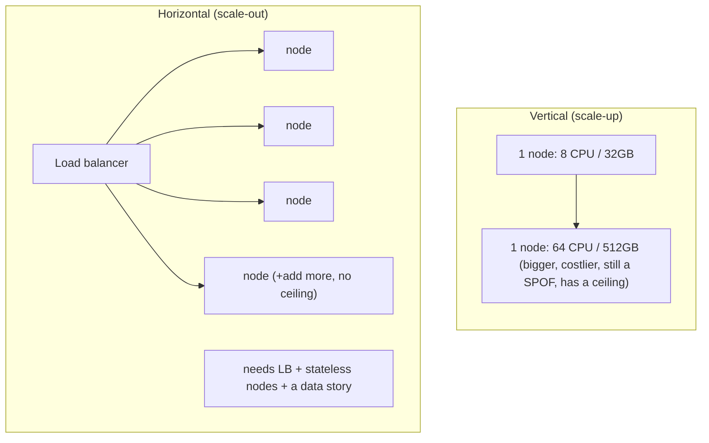
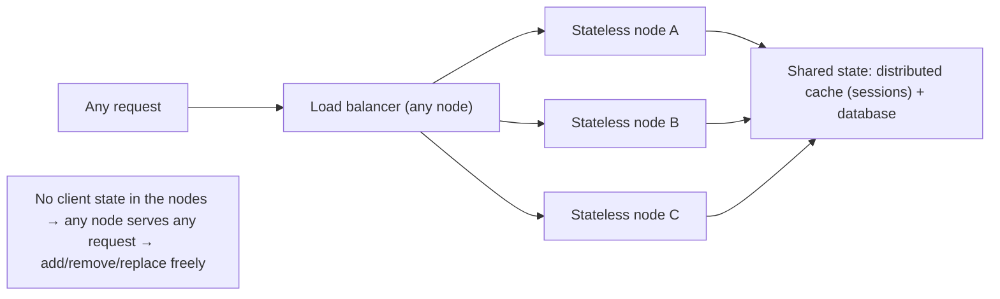

# Lesson 7.1 — Vertical vs Horizontal Scaling; Statelessness as the Enabler

> Part 7: Scalability · Difficulty: 🟡
>
> **Prerequisites:** [1.1.3 Vocabulary of Scale], [1.2.1 Scalability/Availability], [1.1.4 Capacity Estimation], [6.1 Why Caching Works], [5.4.2 Read Replicas].
> **Unlocks:** [7.2 Stateless Services], [7.3 Sharding], [7.5 Read vs Write Scaling], [Part 13 Autoscaling].

---

## 1. Learning Objectives

After this lesson you will be able to:

- Define **scale-up (vertical)** and **scale-out (horizontal)** precisely, and articulate the tradeoffs — cost curve, ceiling, availability, and operational complexity — between them.
- Explain why **horizontal scaling is the foundation of planet-scale systems** but demands **statelessness, a load balancer, and a way to handle data**, while **vertical scaling is simpler but bounded and a single point of failure**.
- State the relationship between scaling and the quality attributes (1.2.1): horizontal scale is what makes **high availability** and **elasticity** possible, and why **statelessness is the enabler** of both.
- Reason about **Amdahl's and the Universal Scalability Law (USL)** at an intuitive level — why adding machines yields **diminishing and eventually negative** returns due to serialization and coordination/contention.

---

## 2. Motivation — One machine always runs out

Every system starts on one machine, and for a long time the right answer to "it's slow / it's full" is **buy a bigger machine** — more CPU, more RAM, faster disk. This is **vertical scaling (scale-up)**, and it's wonderfully simple: no code changes, no distribution, the program just has more resources. But there is always a **ceiling** — the biggest machine money can buy — and a **cost curve** that bends sharply upward (top-end hardware costs far more than 2× a mid-range box for 2× the power). Worse, that one big machine is a **single point of failure**: when it dies, everything dies (1.2.1 availability).

So at scale you must eventually **scale out (horizontal scaling)**: add **more machines** and spread the work across them. This is how every large system runs — it has no hard ceiling (add more nodes), it improves **availability** (one node failing doesn't take down the service), and it enables **elasticity** (add/remove nodes to match load, the basis of cloud autoscaling, Part 13). But it is **fundamentally harder**: you now need a **load balancer** to distribute requests (3.3.1), the nodes must be **stateless** (or you must externalize state) so any node can serve any request, and your **data** — which can't be trivially replicated like compute — becomes the hard problem (the rest of Part 7). This lesson frames the central scaling decision and the single most important enabler of horizontal scale: **statelessness**. Get statelessness right and scaling out becomes "add more identical boxes"; get it wrong and you've built a distributed system that can't actually distribute.

---

## 3. Theory — From first principles

### 3.1 The two axes of scaling

To handle more load you can grow in one of two directions `[CS]`:

- **Vertical scaling (scale-up):** make a **single node more powerful** — more CPU cores, more RAM, faster/bigger disk (SSD/NVMe, 4.1.2), better network. The system stays a single machine; you just give it more resources.
- **Horizontal scaling (scale-out):** add **more nodes** and distribute the workload across them. The system becomes a **fleet** of machines behind a distributor (load balancer, 3.3.1).

These are not mutually exclusive — real systems do **both**: scale each node up to a sensible sweet spot (price/performance), then scale out by adding more such nodes.

### 3.2 Vertical scaling — strengths and hard limits

**Strengths** `[CONV]`:
- **Simplicity** — no distribution, no load balancer, no statelessness requirement; the app is unchanged. A single machine is far easier to reason about, debug, and operate (no network between components, no partial failure).
- **No data-distribution problem** — all data is local; transactions, joins, and strong consistency are trivial (one database, 5.2).
- **Often the right first move** — for many workloads, a bigger box buys years of headroom with near-zero engineering cost.

**Hard limits** `[CS]`:
- **A ceiling** — there is a largest machine available; you cannot scale up past it.
- **Non-linear cost** — top-tier hardware costs disproportionately more; the price/performance curve bends up steeply at the high end.
- **Single point of failure (SPOF)** — one machine, one failure domain; when it goes down, the whole service is down (1.2.1). Maintenance/upgrades often mean downtime.
- **Disruptive upgrades** — scaling up usually means migrating to/rebooting a bigger machine (downtime or careful failover).

### 3.3 Horizontal scaling — strengths and the costs it imposes

**Strengths** `[CS]`:
- **No hard ceiling** — need more capacity? Add more nodes. This is why all planet-scale systems are horizontally scaled.
- **High availability** — many nodes across failure domains; losing one degrades capacity, not the service (redundancy, 1.2.1, Part 11). No single SPOF (if designed well).
- **Elasticity** — add nodes for peak, remove them off-peak → match capacity to demand, pay for what you use (cloud autoscaling, Part 13).
- **Commodity hardware** — many cheap machines instead of one exotic one; better price/performance at the node level.

**Costs it imposes** `[CS]`:
- **You need a load balancer** to distribute requests across nodes (3.3.1) — itself made redundant.
- **The nodes must be stateless** (or externalize state — §3.4) so any node can serve any request; this is the crux (§3.4).
- **Data is the hard part** — compute is easy to replicate (run the same code on more boxes), but **data** can't be trivially copied to N machines and kept consistent. Distributing data brings **replication** (copies → consistency problems, Part 10) and **partitioning/sharding** (split the data → routing, hotspots, cross-shard queries — 7.3/7.4). This is where most of Part 7 (and Parts 8/10) lives.
- **Distributed-systems complexity** — partial failure, network unreliability, coordination (Part 8), harder debugging and operations.

### 3.4 Statelessness — the enabler of horizontal scale

The single property that makes scaling out work is **statelessness** `[BP]`:

A **stateless service** keeps **no client-specific state in its own memory/disk between requests**. Everything it needs to handle a request comes from (a) the request itself, and (b) **shared external stores** (database, distributed cache/session store — 6.2/6.6). Each request is **self-contained**.

Why this is the enabler:
- **Any node can serve any request.** If a node holds no session/state, the load balancer can send request 1 to node A and request 2 (same user) to node B — both work identically. This is what makes "just add more nodes" actually work.
- **Nodes are interchangeable and disposable.** You can add nodes (they immediately take traffic), remove nodes (no state lost), and replace crashed nodes (no recovery of in-memory state) freely → **elasticity** and **availability** fall out naturally.
- **No sticky routing needed.** Requests can be balanced by any algorithm (round-robin/least-connections, 3.3.1) without pinning a user to a node.

A **stateful** node (holds the user's session, an in-memory shopping cart, a local file the next request needs) **breaks all of this**: requests must be **routed back to the same node** (sticky sessions — fragile), losing a node **loses state**, and you **can't freely add/remove** nodes. The fix — covered in depth in 7.2 — is to **externalize state**: push session/state into a **shared store** (distributed cache like Redis — 6.6, or a database) so the service nodes themselves become stateless. **Statelessness doesn't eliminate state; it relocates it** to a layer designed to be shared and scaled.

> **The deep point:** horizontal scaling of **compute** is easy *because* you can make compute stateless. The reason **data** is the hard part of scaling (§3.3) is precisely that data is **inherently stateful** — you can't make the source of truth "stateless," so you must replicate and partition it, with all the consistency consequences (Part 10). Part 7 is largely the story of scaling the stateful parts.

### 3.5 Scaling isn't linear — Amdahl and the USL

A naive hope is "2× the machines = 2× the throughput." Reality bends below that for two reasons `[CS]`:

- **Amdahl's Law (serialization):** if a fraction `s` of the work is inherently **serial** (can't be parallelized), then no matter how many nodes you add, speedup is capped at `1/s`. A 5% serial portion caps you at 20× — forever. Some part of almost every system is serial (a shared lock, a single coordinator, a sequential step).
- **Universal Scalability Law (USL) — Gunther** `[EMERGING]`: extends Amdahl by adding a **coherency/coordination penalty** — the cost of nodes **communicating to stay consistent** (locks, cache coherence, cross-node coordination) grows **quadratically** with node count. So throughput not only plateaus, it can **decline** past an optimal point: adding nodes makes things *slower* because they spend more time coordinating than working.

**Practical takeaway:** the goal is to **minimize the serial fraction and the coordination between nodes** — which is exactly why **statelessness** (no shared mutable state in the service tier), **partitioning** (nodes work on independent data slices — 7.3), and **avoiding cross-node coordination** are the master techniques of scalability. Shared-nothing designs scale; coordination-heavy designs hit the USL wall (Part 8 explains why coordination is so costly).

### 3.6 The pragmatic scaling ladder

In practice you climb a ladder, cheapest/simplest first `[BP]` (and this is the throughline of Part 7):
1. **Scale up** the single node to a sane price/performance sweet spot (simple, buys time).
2. **Make the service tier stateless** + put it behind a **load balancer** → scale out the **compute** (easy once stateless). (7.2, 3.3.1)
3. **Offload reads** with **caching** (Part 6) and **read replicas** (5.4.2) → the database serves far less. (7.5)
4. **Scale writes/data** with **partitioning/sharding** (7.3) when one node can't hold the data or take the write rate — the genuinely hard step.
5. **Handle the consequences** — hotspots/skew (7.4), the DB-as-bottleneck (7.6), and plan capacity/load-test (7.7).

The art is doing the **cheapest thing that meets the requirement** (1.1.5) — most systems never need step 4, and reaching for sharding/NoSQL prematurely is a classic mistake (5.4.1).

---

## 4. Visual Intuition

### Up vs out

### Statelessness enables scale-out

---

## 5. Real-World Analogy

A busy restaurant kitchen handling more orders.

- **Scale up:** replace your one cook with a **superhuman cook** — faster hands, more burners. Simple (the workflow is unchanged), but there's a limit to how fast one human can go, they cost a fortune at the top end, and if that one cook calls in sick, **dinner service is cancelled** (SPOF).
- **Scale out:** hire **many ordinary cooks**. No ceiling (hire more for the holiday rush, send some home after — elasticity), and if one is out, the others carry on (availability). But now you need an **expediter** to hand each order to a free cook (load balancer), and a rule that **any cook can make any dish**.
- **Statelessness:** that rule only works if a cook doesn't keep half-finished dishes and private notes that only *they* understand. If every cook works only from the **printed ticket** (the request) and the **shared pantry and recipe book** (external stores), then any free cook can pick up any ticket — that's a stateless service. If instead a cook keeps "table 7's special sauce" simmering only at *their* station (in-memory session), every dish for table 7 must go back to *that* cook (sticky sessions), and if they leave, the sauce is lost.
- **Amdahl/USL:** if every dish must wait for the **one** garnish station (a serial step), hiring more cooks won't speed those dishes up beyond that bottleneck — and past some point, too many cooks just **bump into each other** (coordination cost), and the kitchen gets *slower*.

---

## 6. Industry Example

- **Stateless web/app tiers behind a load balancer** `[CONV]`: the universal pattern — a fleet of identical stateless app servers behind an LB (3.3.1), sessions in a shared store (Redis, 6.6); add/remove instances freely (the basis of cloud autoscaling, Part 13). *(Representative.)*
- **Cloud autoscaling groups** `[CONV]`: AWS Auto Scaling / Kubernetes HPA add and remove identical stateless replicas based on load — elasticity in action, only possible because the replicas are stateless (Part 13).
- **Vertical-first for databases** `[BP]`: relational DBs are commonly scaled **up** (and with read replicas, 5.4.2) far before sharding, because distributing the stateful DB is the hard part (§3.3, 7.3).
- **Shared-nothing data systems** `[CS]`: wide-column/NoSQL and NewSQL systems (5.4.1) scale out by **partitioning** so each node owns an independent data slice with minimal coordination — the USL-aware design (§3.5, 7.3). *(Representative.)*
- **The USL in practice** `[EMERGING]`: benchmarks routinely show throughput plateauing or regressing as nodes/threads increase past an optimum due to lock/coordination contention (§3.5).

---

## 7. Implementation Details — scaling decisions in practice

- **Scale up first to a price/performance sweet spot** — it's the cheapest engineering and buys real time; don't distribute before you must (1.1.5) `[BP]`.
- **Make the service tier stateless early** (7.2) — externalize sessions/state to a shared store (Redis/DB) so you're *ready* to scale out and to autoscale (Part 13). Statelessness is cheap to adopt early, expensive to retrofit.
- **Put compute behind a redundant load balancer** (3.3.1) and use a stateless-friendly algorithm (round-robin/least-connections) — avoid sticky sessions unless forced.
- **Offload the database before sharding it** — caching (Part 6) + read replicas (5.4.2) handle read growth cheaply (7.5); only shard when write/data volume truly exceeds one node (7.3).
- **Design for shared-nothing** — minimize cross-node coordination and shared mutable state to stay off the USL wall (§3.5); partition work so nodes are independent (7.3).
- **Measure the serial fraction** — find the steps that *don't* parallelize (a global lock, a single sequence generator, a coordinator) and attack them; they cap your scale (Amdahl, §3.5, Part 17).
- **Plan capacity and load-test** (7.7, 1.1.4) — know your per-node capacity and where the next bottleneck is *before* you hit it.

---

## 8. Advantages

**Vertical:** simplicity (no distribution/LB/statelessness), no data-distribution problem (local data, easy transactions), great first move with near-zero engineering cost.

**Horizontal:** no hard ceiling, high availability/redundancy (no SPOF), elasticity (match capacity to demand → cost efficiency), commodity hardware, the only path to planet scale.

**Statelessness:** interchangeable/disposable nodes → free add/remove/replace → elasticity + availability + simple load balancing; the foundation everything else rests on.

---

## 9. Disadvantages

**Vertical:** hard ceiling, non-linear cost at the top end, **single point of failure**, disruptive upgrades (downtime).

**Horizontal:** requires a load balancer + stateless design + a data-distribution strategy; **data** is genuinely hard (replication/partitioning → consistency, Part 10); distributed-systems complexity (partial failure, coordination — Part 8); diminishing/negative returns from serialization and coordination (Amdahl/USL).

**Statelessness:** doesn't remove state — **relocates** it to a shared store that must itself be scaled and made HA (6.6); some workloads (stateful streaming, in-memory grids — 2.2.5) genuinely need node-local state and require more care.

---

## 10. When NOT to use each

- **Don't scale out prematurely** — if a bigger box (and caching/replicas) meets the requirement, the simplicity of vertical is worth a lot; premature distribution adds complexity for no benefit (1.1.5, 5.4.1).
- **Don't rely on vertical scaling for availability** — one machine is a SPOF; if you need HA, you need redundancy (horizontal), even at modest load (1.2.1, Part 11).
- **Don't scale out a stateful service** without externalizing state first — you'll get sticky-session fragility and lost-state-on-failure (7.2).
- **Don't add nodes to a coordination-bound system** expecting linear gains — past the USL optimum it gets slower; fix the coordination/serial bottleneck first (§3.5).
- **Don't shard the database** before exhausting vertical + caching + replicas — sharding is the expensive, hard-to-reverse step (7.3, 5.4.1).

---

## 11. Common Mistakes

1. **Keeping session/state in the service node** (in-memory session, local file) → can't scale out, sticky-session fragility, state lost on node failure (7.2).
2. **Sharding/NoSQL prematurely** "to scale" when vertical + caching + replicas would do → lost ACID/joins for no real need (5.4.1, §3.6).
3. **Assuming linear scaling** — ignoring the serial fraction (Amdahl) and coordination cost (USL); adding nodes and being surprised it didn't help (§3.5).
4. **No load balancer redundancy** — the LB becomes the new SPOF (3.3.1).
5. **Scaling compute but ignoring the database** — the stateless tier scales fine, then the (un-scaled) DB becomes the bottleneck (7.6).
6. **Treating statelessness as "no state anywhere"** — it's *relocated* state; forgetting to scale/HA the shared store (Redis/DB) (6.6).
7. **Vertical-only for an HA requirement** — a single big machine can't meet an availability SLO no matter how big (1.2.1).

---

## 12. Interview Questions

**🟢 Easy**
- Define vertical vs horizontal scaling. Give one advantage and one disadvantage of each.
- What does it mean for a service to be "stateless," and why does that enable horizontal scaling?

**🟡 Medium**
- Why is *data* the hard part of horizontal scaling, while compute is comparatively easy?
- You have an in-memory shopping cart in your app server and need to scale out. What breaks, and how do you fix it? (Externalize state — 7.2.)

**🔴 Hard**
- Explain Amdahl's Law and the Universal Scalability Law. Why can adding more nodes eventually *reduce* throughput, and what design choices keep you off that wall?
- Walk through a scaling ladder from one machine to a horizontally-scaled, highly-available system. At each step, what problem are you solving and what new problem appears?

**⚫ Staff+**
- A monolithic app on one big database is hitting limits. Design the path to scale (statelessness, LB, caching, replicas, then partitioning), justify the *order*, and identify where consistency (Part 10) and coordination (Part 8) costs enter.
- Your stateless tier scales linearly to 50 nodes, then throughput flattens and p99 climbs as you add more. Diagnose (serial fraction? a shared lock? the DB? cache hot key? USL coordination?) and lay out how you'd find and remove the bottleneck.

---

## 13. Production Pitfalls

- **Sticky-session lock-in:** sessions kept in-node force sticky routing; a node restart logs everyone on it out, and load can't rebalance → uneven load + outages on deploy (7.2).
- **DB bottleneck after scaling compute:** the app tier autoscaled beautifully, but every request still hits one primary database, which is now the wall (7.6) — the classic "we scaled the easy part."
- **Premature sharding regret:** a team sharded early; now every cross-shard query and transaction is painful, and they gave up joins/ACID they didn't need to (7.3, 5.4.1).
- **USL regression:** adding worker threads/nodes past an optimum increases lock contention and *lowers* throughput while raising latency (§3.5) — counterintuitive without the USL model.
- **LB as SPOF:** a single load balancer instance fails and takes down the whole "highly available" fleet (3.3.1).
- **Shared store not scaled:** state was externalized to a single Redis node that's now the bottleneck/SPOF for the whole stateless fleet (6.6).

---

## 14. Optimization Techniques

- **Stateless service tier + externalized state** (7.2) → free elasticity, availability, simple balancing — the highest-leverage scalability move `[BP]`.
- **Vertical sweet spot + horizontal beyond it** — combine: right-size each node, then add nodes (best price/performance).
- **Cache + read replicas before sharding** (Part 6, 5.4.2) — cheap read scaling that delays the hard step (7.5).
- **Shared-nothing partitioning** (7.3) — independent data slices minimize coordination (stay off the USL wall, §3.5).
- **Attack the serial fraction** — remove global locks/single coordinators/sequential steps that cap Amdahl speedup (Part 17, Part 8).
- **Autoscale on the right signal** (Part 13) — scale the stateless tier elastically to demand; ensure the shared stores can keep up.
- **Make the LB and shared stores redundant** — no new SPOFs (3.3.1, 6.6, Part 11).

---

## 15. Summary

There are two axes of scaling. **Vertical (scale-up)** — a bigger single machine — is **simple** (no distribution, no load balancer, no statelessness requirement, local data with easy transactions) and is usually the right *first* move, but it has a **hard ceiling**, a **non-linear cost curve**, and is a **single point of failure**. **Horizontal (scale-out)** — more machines behind a load balancer — has **no ceiling**, provides **high availability** (redundancy across failure domains) and **elasticity** (match capacity to demand, the basis of autoscaling), but **imposes costs**: you need a load balancer (3.3.1), the nodes must be **stateless**, and **data** becomes the hard problem (replication → consistency, Part 10; partitioning → routing/hotspots, 7.3/7.4). The single enabler of scale-out is **statelessness**: a service that keeps **no client state in its own memory** (everything comes from the request + shared external stores) makes nodes **interchangeable and disposable**, so any node serves any request and you can add/remove/replace nodes freely — which is what makes elasticity and availability fall out. Statelessness doesn't remove state; it **relocates** it to a shared store (distributed cache/DB) designed to be shared and scaled (7.2, 6.6) — and the reason **data** is hard to scale is precisely that it's inherently stateful. Scaling is **not linear**: **Amdahl's Law** caps speedup at `1/s` for a serial fraction `s`, and the **Universal Scalability Law** shows that **coordination/coherence cost** can make throughput *decline* past an optimum — so the master techniques are **statelessness, partitioning (shared-nothing), and minimizing cross-node coordination**. The pragmatic ladder: scale up to a sweet spot → make the tier stateless behind an LB → offload reads with caching + replicas → only then partition/shard the data — always doing the cheapest thing that meets the requirement.

---

## 16. Revision Notes (flashcard-ready)

- **Q:** Vertical vs horizontal scaling? **A:** Vertical = bigger single machine (simple, ceiling, SPOF, non-linear cost); horizontal = more machines (no ceiling, HA, elastic, but needs LB + statelessness + data story).
- **Q:** Why is data the hard part of scaling out? **A:** Compute is stateless/replicable; data is inherently stateful → must replicate (consistency, Part 10) and partition (7.3).
- **Q:** Stateless service? **A:** Keeps no client state in its own memory; everything from the request + shared external stores → any node serves any request.
- **Q:** Why is statelessness the enabler? **A:** Interchangeable/disposable nodes → add/remove/replace freely → elasticity + availability + simple load balancing.
- **Q:** Does statelessness remove state? **A:** No — it relocates it to a shared store (Redis/DB) that must itself be scaled/HA (7.2, 6.6).
- **Q:** Amdahl's Law? **A:** Serial fraction `s` caps speedup at `1/s` regardless of node count.
- **Q:** Universal Scalability Law adds? **A:** A coordination/coherence penalty (∝ N²) → throughput can *decline* past an optimal node count.
- **Q:** Master techniques for scalability? **A:** Statelessness, shared-nothing partitioning, and minimizing cross-node coordination/serial steps.
- **Q:** The scaling ladder? **A:** Scale up → stateless+LB (scale compute) → cache+replicas (scale reads) → partition/shard (scale writes/data) — cheapest first.
- **Q:** Biggest scale-out mistake? **A:** Stateful service nodes (sticky sessions, lost state) and/or premature sharding.

---

## 17. Further Reading + Knowledge-Graph Links

**Within this platform**
- **Builds on:** [1.1.3 Vocabulary of Scale], [1.2.1 Scalability/Availability], [1.1.4 Capacity Estimation], [6.1 Caching], [5.4.2 Read Replicas], [3.3.1 Load Balancing].
- **Next:** [7.2 Stateless Services & Externalized State] (the enabler in depth). **Then:** [7.3 Sharding], [7.5 Read vs Write Scaling], [7.6 DB Bottleneck], [7.7 Capacity Planning].
- **Enables:** [Part 13 Autoscaling] (elasticity), [Part 8 Coordination] (why coordination is costly — the USL), [Part 17 Performance] (serial-fraction/bottleneck analysis).

**Foundational texts (synthesized)**
- Kleppmann, *Designing Data-Intensive Applications* — scaling up vs out, shared-nothing, the data-distribution problem (synthesized).
- Gunther, *Guerrilla Capacity Planning* — Universal Scalability Law (concept, synthesized).
- Amdahl (1967) — the serial-fraction limit (concept, synthesized).

**Concept tags:** `[CS]` scale-up vs scale-out, statelessness enables scale-out, data as the hard part, Amdahl's Law · `[CONV]` stateless tier + LB + Redis sessions, vertical-first for DBs · `[BP]` scale up to sweet spot then out, externalize state early, cache+replicas before sharding, shared-nothing · `[EMERGING]` Universal Scalability Law / coordination cost.
