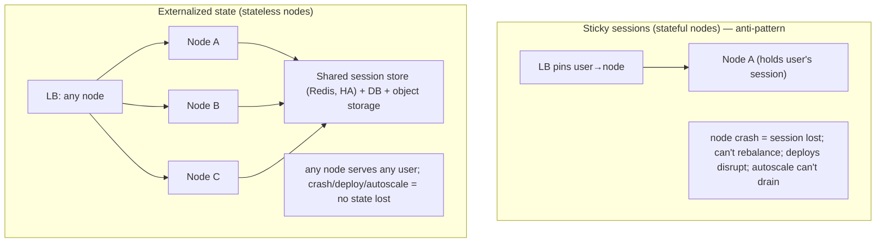
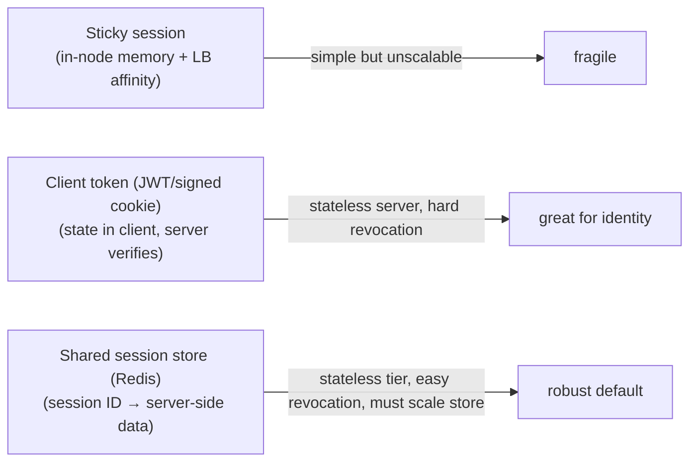

# Lesson 7.2 — Stateless Services + Externalized Session/State

> Part 7: Scalability · Difficulty: 🟡
>
> **Prerequisites:** [7.1 Vertical vs Horizontal Scaling], [6.2 Cache Topologies], [6.6 Distributed Caching], [3.3.1 Load Balancing], [5.4.2 Replicas].
> **Unlocks:** [7.3 Sharding], [Part 11 Failover], [Part 13 Autoscaling], [Part 12 Microservices].

---

## 1. Learning Objectives

After this lesson you will be able to:

- Define a **stateless service** precisely (no client/session state retained in-process between requests) and explain why it's the **prerequisite for horizontal scaling, elasticity, and rolling deploys** (7.1).
- Distinguish kinds of state — **session state, application/conversational state, in-memory caches, file uploads, connection state** — and know **where each should live** when you externalize.
- Compare approaches to **session management** — **sticky sessions (session affinity)**, **client-side state (signed cookies/JWT)**, and **server-side externalized sessions (shared store)** — with their tradeoffs.
- Identify the **legitimately stateful** systems (databases, caches, stateful stream processors, in-memory grids — 2.2.5) and the techniques that scale them (sharding, partitioned state, sticky-by-key), so you know when statelessness does *not* apply.

---

## 2. Motivation — "Just add more nodes" only works if the nodes are interchangeable

7.1 established statelessness as *the* enabler of horizontal scale. This lesson is the **how**: how to actually build a stateless service, where to put the state you can't eliminate, and how to manage the most common offender — the **user session**.

The motivation is concrete. The instant a service keeps something in its own memory that a *later* request depends on — a logged-in user's session, a multi-step wizard's progress, an in-memory cart, an uploaded file staged on local disk — that node becomes **special**. The load balancer must now route that user **back to the same node** (sticky sessions), which means: load can't rebalance freely, a node crash **loses** that state (the user is logged out, the cart is gone), you **can't deploy** without disrupting users pinned to the node being replaced, and **autoscaling** can't freely remove nodes. Every benefit of horizontal scale — elasticity, availability, painless rolling deploys (Part 13) — depends on nodes being **interchangeable and disposable**, and that depends on them being **stateless**.

The good news: statelessness doesn't mean "no state" — almost every useful system has state. It means **the service tier holds none of it locally**; state is **externalized** to stores *designed* to be shared and scaled (a distributed cache like Redis — 6.6, or a database — 5.4.2). This lesson covers exactly what to externalize and how, the session-management options and their tradeoffs, and the honest exceptions — the systems that are *supposed* to be stateful and how they scale differently.

---

## 3. Theory — From first principles

### 3.1 Stateless, defined

A service instance is **stateless** if **handling a request does not depend on any client-specific state stored in that instance from a previous request** `[CS]`. Everything needed to process a request comes from:
- **(a) the request itself** (its parameters, headers, body, auth token), and
- **(b) shared external stores** (database, distributed cache/session store, object storage) reachable by *any* instance.

After a stateless instance finishes a request, it retains **nothing client-specific** — the next request (from the same or a different client) could go to *any* instance with identical results. (Instances may still hold **non-client** state that's fine: config, connection pools, a *local cache* that's just an optimization and is losable — 6.1/6.2. The test is: *does correctness depend on this instance having handled a prior request from this client?* If no, it's stateless.)

### 3.2 The kinds of state and where they belong

"Make it stateless" means **relocating** each kind of state to the right home `[BP]`:

| State | Example | Where it should live (externalized) |
|---|---|---|
| **Session state** | logged-in identity, auth, preferences for this session | shared session store (Redis, 6.6) **or** client-side token (JWT/signed cookie) — §3.3 |
| **Conversational / workflow state** | multi-step wizard, shopping cart, checkout progress | shared store (cache/DB) keyed by user/session |
| **Application data (source of truth)** | orders, accounts, posts | the **database** (5.x) — already external |
| **Cached/derived data** | query results, rendered fragments | distributed cache (6.6) or *local cache as a losable optimization* (6.2) |
| **Uploaded files / large blobs** | profile images, documents, media | **object storage** (S3-style, 4.1.3/4.3.2) — never local disk |
| **Connection / protocol state** | TCP/TLS/WebSocket connection, in-flight stream | inherently node-local — needs sticky-by-connection handling (§3.5) |

The pattern is consistent: **push state out of the service tier** into a layer that is **shared** (any instance can reach it) and **independently scalable/HA** (6.6, 5.4.2). The service nodes become a stateless, elastic **compute** tier; the stores hold the state.

### 3.3 Session management — the three approaches

The user **session** is the most common state to deal with. Three strategies `[CONV]`:

**1. Sticky sessions (session affinity)** — keep the session in the node's memory and have the **load balancer pin each user to the same node** (by cookie or source IP — 3.3.1).
- **Pros:** trivial to implement; no external store; fast (local memory).
- **Cons:** the **anti-pattern for scale** — load can't rebalance (a "hot" node stays hot), a node crash **loses all its sessions** (users logged out), **rolling deploys disrupt** pinned users, and **autoscaling can't drain/remove** nodes cleanly. Acceptable as a stopgap or for connection-bound protocols (§3.5), but not how you build scalable stateless services.

**2. Client-side state (signed token / JWT)** — store session data **in the client** (a signed/encrypted cookie or a **JWT** the client sends on each request); the server **verifies the signature** and reads the claims — **no server-side session storage** at all.
- **Pros:** **truly stateless server** (no session store to scale/HA); scales effortlessly; works across services (the token is self-contained).
- **Cons:** **revocation is hard** — a stateless token is valid until it expires; you can't easily "log out" or invalidate it server-side without re-introducing state (a denylist/short expiry + refresh tokens). **Size limits** (cookies/headers are small). **Can't store much** or anything secret the client shouldn't see (it's on the client — encrypt sensitive claims). **Token theft** = full access until expiry (security, Part 15). Great for **auth identity**; poor for large/mutable session data.

**3. Server-side externalized session (shared session store)** — keep session data **server-side** but in a **shared distributed store** (Redis, 6.6) keyed by a **session ID** carried in a cookie. Any instance looks up the session by ID.
- **Pros:** server controls the session (easy **revocation/logout**, can store arbitrary/large/sensitive data); the service tier stays **stateless** (any node reads the session from the shared store); the standard, robust approach.
- **Cons:** a **lookup per request** (mitigated by the store being fast/in-memory — Redis; or a small local cache of the session); the **session store must be scaled and made HA** (it's now shared infrastructure — 6.6); a session-store outage affects everyone (mitigate with replication/failover).

**Common production choice** `[BP]`: a **short-lived signed token (JWT) for identity/auth** + a **shared store for revocation and richer session/server-side state** — combining the scalability of client tokens with server-side control. Pick per requirement (revocation needs, data size, security).

### 3.4 Why statelessness unlocks the operational wins

With a stateless tier + externalized state `[CS]`:
- **Horizontal scaling / autoscaling (7.1, Part 13):** add/remove instances at will — new ones immediately serve any user; removed ones lose nothing.
- **High availability (Part 11):** an instance crash loses **no session/state** (it's external); the LB just routes around it; users don't notice.
- **Rolling / blue-green / canary deploys (Part 13):** replace instances freely — no user is "stuck" on an old instance; drain and swap without disruption.
- **Simple load balancing (3.3.1):** any algorithm works (round-robin/least-connections) without affinity; load distributes evenly.
- **No special nodes:** every instance is identical and replaceable — the operational dream.

These are precisely the wins 7.1 promised, and they **all** hinge on the nodes holding no client state.

### 3.5 The honest exceptions — legitimately stateful systems

Not everything can or should be stateless `[BP]`. Some systems **are** the state, and they scale differently:
- **Databases (5.x):** the source of truth — inherently stateful. They scale via **replication** (5.4.2) and **partitioning/sharding** (7.3), not by being made stateless. (Statelessness pushes state *into* them.)
- **Distributed caches (6.6):** hold state (cached data, sessions); scaled by **sharding (consistent hashing)** and **replication** — they're the externalization target, not stateless themselves.
- **Stateful stream processors (Part 9):** operators that maintain windows/aggregations keep **local state** for throughput; they scale by **partitioning the state by key** (each instance owns a key range) and use **sticky-by-key routing** + **checkpointing** to a durable store for recovery. State is local *for performance* but **partitioned and recoverable**.
- **In-memory data grids / space-based architecture (2.2.5):** deliberately keep data in the processing tier's memory for speed; they scale by **partitioning** data across the grid and replicating for HA.
- **Connection-bound protocols (WebSockets/long-lived streams — 3.2.5):** a connection lives on one node, so that node is "sticky" for that connection's lifetime; scale by distributing *connections* across nodes (a connection router) and externalizing the *durable* state, keeping only the transient connection node-local.

The principle for stateful systems: **partition the state by key so each node owns an independent slice** (shared-nothing — 7.1/7.3), make it **recoverable** (replication/checkpointing), and route by key (sticky-by-key, not sticky-by-arbitrary). This is "statelessness's" stateful cousin — the same goal (independent, scalable nodes) achieved by **partitioning** rather than **externalizing**.

### 3.6 The cost you must not forget: the externalization target

Statelessness **moves** the scaling problem; it doesn't delete it `[BP]`. If 100 stateless app nodes all read sessions from **one** Redis node, that Redis is now the **bottleneck and SPOF** for the whole fleet (7.1 §13). So externalized state requires:
- A **scalable, HA shared store** (replicated/sharded Redis — 6.6; replicated DB — 5.4.2).
- Awareness that the store has its **own** consistency and failure behavior (Part 10/11) — e.g., a session-store failover may lose recent sessions (async replication, 6.6).
- Often a **local cache of session data** (near-cache, 6.2) to cut the per-request lookup — accepting bounded staleness (6.5).
The net: you've traded "stateful service nodes" for "stateless service nodes + a scaled, HA state tier" — a much better tradeoff, but the state tier is now critical infrastructure.

---

## 4. Visual Intuition

### Sticky vs externalized

### Session-management options

---

## 5. Real-World Analogy

A **coat check** at a large venue.

- **Sticky sessions:** each guest's coat is kept **behind a specific clerk's counter**, and the guest must return to **that exact clerk** to get it back. If that clerk goes on break (node crash/deploy), the guest's coat is **stranded**; if one clerk's line is huge, others can't help (no rebalancing).
- **Client-side token (JWT):** the guest simply **keeps their own coat** and shows a **tamper-proof claim check** to prove who they are — no clerk stores anything (truly stateless venue). Fast and infinitely scalable, but if the venue needs to **revoke** access (kick someone out), there's no coat to grab — they have to wait for the claim check to expire, or the venue must keep a "banned list" (a bit of state creeping back).
- **Shared coat room (externalized session store):** coats go into a **central, well-staffed coat room** (Redis) indexed by ticket number; **any clerk** can fetch any coat by ticket. Clerks are interchangeable (stateless), guests can use any line, and the venue can grab a coat to revoke access — but the **coat room itself** must be big enough and have backups (the store must be scaled and HA), or it becomes the bottleneck.
- **The legitimately stateful exception:** the **kitchen's hot line** (a stateful stream processor) keeps dishes-in-progress at specific stations for speed — you can't make that "stateless," so instead you **assign each station a fixed set of dishes** (partition by key) and keep a **recipe log** so a replacement cook can recover (checkpointing).

---

## 6. Industry Example

- **JWT/OIDC for auth + Redis for sessions/revocation** `[CONV]`: a near-universal pattern — short-lived signed access tokens (stateless verification) plus a shared store for refresh/revocation and richer session data (§3.3, Part 15). *(Representative.)*
- **Twelve-Factor App** `[BP]`: explicitly mandates **stateless processes** and **backing services** for state — the canonical statement of this lesson (Part 13). *(Representative.)*
- **Uploads to object storage, not local disk** `[BP]`: stateless app tiers stage files in S3-style storage so any instance can serve them and instances stay disposable (4.1.3, §3.2).
- **Kubernetes Deployments (stateless) vs StatefulSets (stateful)** `[CONV]`: the platform formalizes the distinction — stateless replicas are freely interchangeable; stateful workloads get stable identity + per-pod storage (Part 13, §3.5).
- **Partitioned stateful stream processors** `[CONV]`: stream frameworks keep per-key local state with checkpointing and partition-by-key routing (Part 9, §3.5) — the stateful-but-scalable model. *(Representative.)*

---

## 7. Implementation Details — building stateless services

- **Audit for in-process client state** — sessions, carts, wizard progress, in-memory caches the next request *needs*, uploaded files on local disk, counters. Each is a scale blocker; relocate it (§3.2) `[BP]`.
- **Externalize sessions** to a shared store (Redis, 6.6) keyed by session ID, **or** use signed tokens (JWT) for identity — or both (token for auth + store for revocation/data) (§3.3).
- **Never write request-critical data to local disk** — use object storage for uploads/blobs (4.1.3); local disk is fine only for *losable* scratch/cache.
- **Treat local caches as losable optimizations** (6.1/6.2) — a stale/cold local cache must not affect correctness, only speed; that keeps the node effectively stateless.
- **Avoid sticky sessions** unless forced by a connection-bound protocol (§3.5); if you must, use them for the *connection*, not durable state.
- **Make the externalization target HA and scalable** (§3.6) — replicated/sharded Redis (6.6), replicated DB (5.4.2); don't trade a stateful tier for a single-point state store.
- **For genuinely stateful systems** (stream processors, grids), **partition state by key** + **checkpoint/replicate** + **route sticky-by-key** (§3.5) — the stateful path to scale.
- **Verify with chaos** — kill an instance mid-session and confirm the user is unaffected; do a rolling deploy under load and confirm no disruption (Part 11/14). That's the real test of statelessness.

---

## 8. Advantages

- **Enables horizontal scaling & autoscaling** — interchangeable, disposable nodes (7.1, Part 13).
- **High availability** — instance crashes lose no session/state; LB routes around (Part 11).
- **Painless rolling/blue-green/canary deploys** — replace instances freely (Part 13).
- **Simple, even load balancing** — no affinity needed; any algorithm works (3.3.1).
- **Operational simplicity** — every node identical/replaceable; no special-node handling.
- **Client-token variant:** truly stateless server, effortless scale, cross-service identity.

---

## 9. Disadvantages / costs

- **State is relocated, not removed** — the shared store becomes critical infra that must be scaled & HA (§3.6) — a potential bottleneck/SPOF if neglected.
- **Per-request lookup** for server-side sessions (mitigated by fast store + near-cache) (§3.6).
- **Client tokens: hard revocation, size limits, theft risk** — security tradeoffs (§3.3, Part 15).
- **Not free to retrofit** — making an existing stateful service stateless can be significant work.
- **Some systems can't be stateless** — DBs, caches, stateful processors need the partition-and-replicate path instead (§3.5).

---

## 10. When NOT to use it / limits

- **Inherently stateful systems** (databases, caches, stream processors, in-memory grids) — don't force statelessness; **partition + replicate** instead (§3.5).
- **Connection-bound protocols** (WebSockets, long-lived gRPC streams — 3.2.5) — the connection is node-local for its lifetime; distribute connections and externalize durable state, but the connection itself is "sticky."
- **Ultra-low-latency in-memory workloads** (space-based, 2.2.5) where a network hop to an external store is too slow — keep state local but **partition and replicate** it.
- **Tiny single-node apps** that will never scale out — statelessness is still good hygiene but not urgent (1.1.5).
- **Don't externalize to a single un-scaled store** — that just moves the SPOF (§3.6).

---

## 11. Common Mistakes

1. **In-memory sessions + sticky LB** as the scaling plan → lost sessions on crash/deploy, no rebalancing, autoscale can't drain (§3.3).
2. **Uploading files to local disk** → only the receiving node can serve them; node loss = data loss; use object storage (§3.2).
3. **Externalizing to a single Redis node** → the whole stateless fleet now depends on one box (bottleneck + SPOF) (§3.6).
4. **JWT with no revocation strategy** → can't log users out / kill compromised tokens until expiry (§3.3, Part 15).
5. **Putting non-losable state in a "local cache"** → it's not really a cache, it's hidden state; correctness now depends on the node (6.1).
6. **Forgetting connection state** — assuming a WebSocket service is stateless when each connection pins to a node (§3.5, 3.2.5).
7. **Not testing failure/deploy** — assuming statelessness without killing nodes mid-session to prove it (§7).

---

## 12. Interview Questions

**🟢 Easy**
- What makes a service stateless, and why does that help it scale?
- Name three things commonly kept in a service's memory that block horizontal scaling, and where each should go instead.

**🟡 Medium**
- Compare sticky sessions, JWT/client tokens, and a shared session store. Give a pro and con of each.
- Why are sticky sessions an anti-pattern for scalable services? What specifically breaks on deploy and on node failure?

**🔴 Hard**
- Design session management for a horizontally-scaled web app that needs fast auth, the ability to revoke sessions, and resilience to node and session-store failures. Justify your choice.
- "Make it stateless" — but you still have a database, a cache, and file uploads. Where does each kind of state live, and how do you keep the *service tier* stateless while those exist?

**⚫ Staff+**
- You're handed a stateful monolith (in-memory sessions, local-disk uploads, in-process cart) and must make it horizontally scalable and autoscaling-ready. Lay out the externalization plan, the session strategy, the new infrastructure (and its HA), and how you'd migrate without downtime (5.4.3).
- A WebSocket-based realtime service can't be "stateless" (connections pin to nodes). Design how to scale it: connection distribution, where durable vs transient state lives, failover when a node holding connections dies, and how clients recover (§3.5, 3.2.5).

---

## 13. Production Pitfalls

- **Deploy logs everyone out:** in-memory sessions + rolling deploy → every replaced node drops its users' sessions; mass re-login storm (and possibly a login-service stampede, 6.7) (§3.3).
- **Node crash loses carts/wizards:** conversational state held in-process vanishes on failure; users lose progress (§3.2).
- **"Works on one node, breaks behind the LB":** a feature relying on in-process state works in dev (one node) but fails intermittently in prod when requests hit different nodes (§3.1) — a classic stateless bug.
- **Session-store SPOF:** the externalized Redis is single-node; its failure logs out / breaks the entire fleet at once (§3.6, 6.6).
- **Local-disk uploads disappear:** a file uploaded to node A 404s when the next request hits node B; or is lost when A is recycled (§3.2).
- **JWT can't be revoked:** a compromised/abused token stays valid for its full lifetime because there's no server-side state to invalidate it (§3.3, Part 15).
- **Unbounded session store growth:** sessions never expire → the store fills (set TTLs — 6.4/6.5).

---

## 14. Optimization Techniques

- **Externalize sessions to a fast, HA shared store** (Redis with replication/sharding — 6.6) + **TTLs** on sessions (6.4) — robust, scalable, revocable `[BP]`.
- **JWT for identity + store for revocation/data** — combine stateless verification with server-side control (§3.3).
- **Near-cache the session** (local L1 of session data, 6.2) to cut the per-request lookup, accepting bounded staleness (6.5).
- **Object storage for all blobs/uploads** (+ CDN for delivery, 3.3.3) — keeps nodes disposable (4.1.3).
- **Partition state by key + checkpoint** for legitimately stateful systems (stream processors/grids) (§3.5, Part 9).
- **Drain connections gracefully** on deploy/scale-in (LB connection draining, 3.3.1/3.3.4) for connection-bound services.
- **Chaos-test statelessness** — kill nodes mid-session and rolling-deploy under load to prove no disruption (Part 11/14).

---

## 15. Summary

A **stateless service** retains **no client-specific state in-process between requests** — everything comes from the **request** plus **shared external stores** — so any instance can serve any request and instances are **interchangeable and disposable**. That property is what makes **horizontal scaling, autoscaling, high availability, and painless rolling deploys** possible (7.1, Part 13/11): add/remove/replace nodes freely, lose no state on crash, balance with any algorithm. Statelessness doesn't eliminate state — it **relocates** it: **sessions** → a shared store (Redis, 6.6) or a **client token (JWT)**; **conversational/cart state** → a shared store keyed by user; **application data** → the database; **uploads/blobs** → object storage (never local disk); **derived data** → a cache (local caches are fine *only* as losable optimizations). For **sessions** specifically, the three approaches are **sticky sessions** (in-node + LB affinity — simple but the scale anti-pattern: lost on crash/deploy, no rebalancing, no clean autoscale), **client tokens/JWT** (stateless server, effortless scale, but hard revocation + size/security limits — great for identity), and **server-side externalized sessions** (shared store keyed by session ID — stateless tier, easy revocation, arbitrary data, but the store must be scaled/HA); the common production choice combines **JWT for auth + a shared store for revocation/richer state**. The crucial caveat: externalization **moves** the scaling problem to the **shared store**, which must itself be **scalable and HA** or it becomes the new bottleneck/SPOF (6.6/5.4.2). Finally, some systems are **legitimately stateful** — databases, caches, stateful stream processors, in-memory grids, connection-bound protocols — and they scale not by becoming stateless but by **partitioning state by key (shared-nothing), replicating/checkpointing for recovery, and routing sticky-by-key** (7.3, Part 9). Statelessness for compute, partition-and-replicate for state: together they are how systems scale out.

---

## 16. Revision Notes (flashcard-ready)

- **Q:** Stateless service? **A:** Keeps no client state in-process between requests; everything from the request + shared external stores → any node serves any request.
- **Q:** What does statelessness unlock? **A:** Horizontal scaling/autoscaling, HA (crash loses no state), painless rolling deploys, simple even load balancing.
- **Q:** Does it remove state? **A:** No — relocates it (sessions→store/token, blobs→object storage, data→DB, derived→cache).
- **Q:** Three session approaches? **A:** Sticky (in-node+affinity, fragile), client token/JWT (stateless server, hard revocation), shared session store (stateless tier, revocable, must scale store).
- **Q:** Why are sticky sessions an anti-pattern? **A:** Lost on crash, no rebalancing, deploys disrupt pinned users, autoscale can't drain.
- **Q:** JWT main downside? **A:** Hard server-side revocation (valid until expiry) + size/security limits.
- **Q:** Common production session choice? **A:** JWT for identity + shared store for revocation/richer state.
- **Q:** Where do uploads go? **A:** Object storage (S3-style), never local disk.
- **Q:** The hidden cost of externalizing? **A:** The shared store becomes critical infra — must be scaled & HA or it's the new bottleneck/SPOF.
- **Q:** How do legitimately stateful systems scale? **A:** Partition state by key (shared-nothing) + replicate/checkpoint + sticky-by-key routing (not stateless).

---

## 17. Further Reading + Knowledge-Graph Links

**Within this platform**
- **Previous:** [7.1 Vertical vs Horizontal Scaling] (statelessness as enabler). **Builds on:** [6.2 Topologies], [6.6 Distributed Caching] (the session store), [3.3.1 Load Balancing] (affinity), [5.4.2 Replicas], [4.1.3 Object Storage].
- **Next:** [7.3 Sharding/Partitioning] (scaling the stateful data). **Related:** [7.5 Read vs Write Scaling].
- **Enables:** [Part 13 Autoscaling / 12-Factor / Deploy strategies], [Part 11 Failover], [Part 12 Microservices] (stateless services), [Part 15 Security] (JWT/OAuth/revocation).

**Foundational texts (synthesized)**
- *The Twelve-Factor App* — stateless processes, backing services (concept, synthesized).
- Kleppmann, *Designing Data-Intensive Applications* — partitioned stateful processing, state recovery (synthesized).
- OAuth2/OIDC & JWT specifications — token-based auth (concept, synthesized).

**Concept tags:** `[CS]` stateless definition, externalized state, partition-by-key for stateful systems · `[CONV]` sticky/JWT/shared-store sessions, K8s Deployment vs StatefulSet, uploads→object storage · `[BP]` externalize early, JWT+store hybrid, HA the state tier, losable local caches, chaos-test statelessness.
