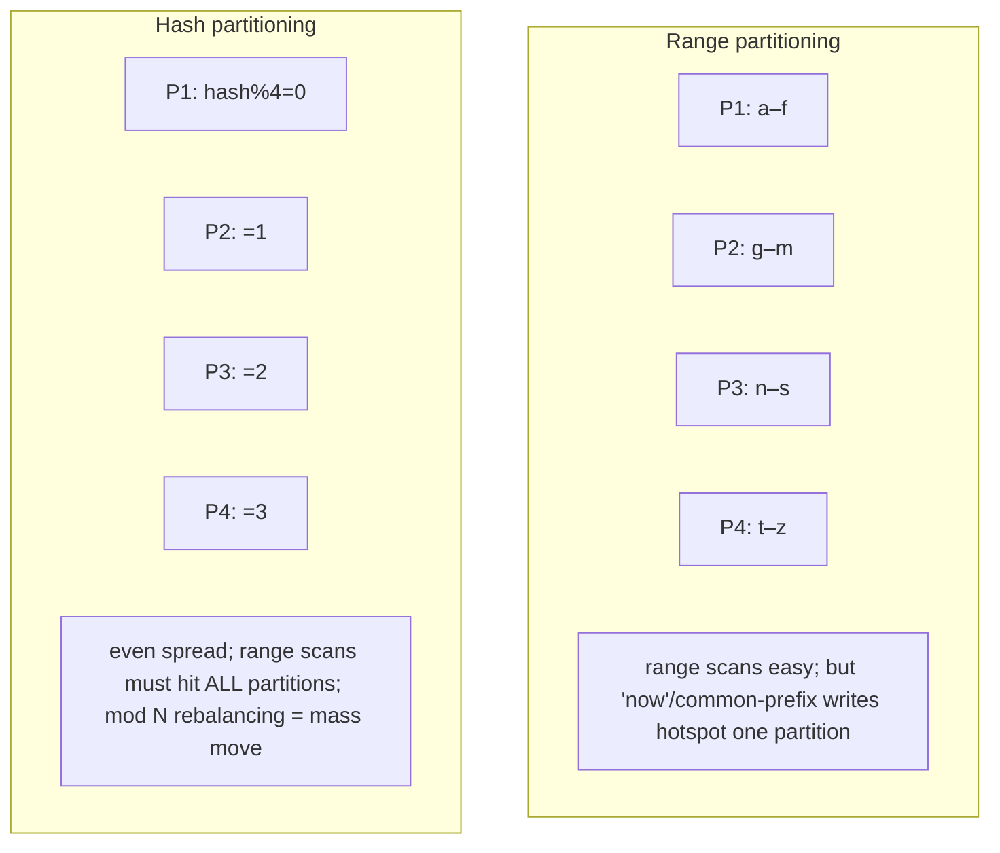
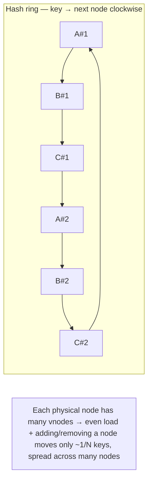

# Lesson 7.3 — Sharding/Partitioning Strategies: Range, Hash, Consistent Hashing, Directory

> Part 7: Scalability · Difficulty: 🔴
>
> **Prerequisites:** [7.1 Vertical vs Horizontal Scaling], [6.6 Consistent Hashing], [5.4.2 Replicas], [5.1.1 Data Models], [4.2.5 Indexing].
> **Unlocks:** [7.4 Hotspots & Rebalancing], [7.5 Read vs Write Scaling], [Part 8 Coordination], [Part 10 Replication].

---

## 1. Learning Objectives

After this lesson you will be able to:

- Explain **why partitioning (sharding) is the only way to scale writes and data volume** beyond one node, and distinguish **partitioning** (splitting data) from **replication** (copying data) — and how they combine.
- Compare the four partitioning strategies — **range**, **hash**, **consistent hashing**, and **directory/lookup** — with their tradeoffs for **range queries, even distribution, rebalancing, and routing**.
- Explain **consistent hashing with virtual nodes** in depth (building on 6.6) and why it minimizes data movement on topology changes.
- Reason about the **choice of partition key** as the single most consequential decision (it determines hotspots, query patterns, and rebalancing pain — 7.4), and handle **secondary indexes** (local vs global) and **cross-partition queries/transactions**.

---

## 2. Motivation — When one node can't hold the data or take the writes

Caching (Part 6) and read replicas (5.4.2) scale **reads** beautifully, and a stateless tier (7.2) scales **compute**. But three things they **cannot** scale: the **write throughput** of a single primary, the **data volume** that fits on one node, and the **working set** that fits in one node's memory. Every write still goes to one primary; all the data still lives on machines of finite size. When you outgrow the biggest machine (7.1) for *writes or storage*, there is only one answer: **partition the data across many nodes** so each node owns — and serves writes for — a **slice**. This is **sharding** (a.k.a. **partitioning**).

This is the genuinely hard step on the scaling ladder (7.1), and the place where most of distributed systems' difficulty originates. Splitting data raises immediate questions: **how do you decide which node owns which data** (the partitioning strategy)? **How does a request find the right node** (routing)? **What happens to even distribution when data or traffic is skewed** (hotspots — 7.4)? **What happens when you add/remove a node** (rebalancing — 7.4)? **How do queries that span partitions work** (scatter-gather, cross-shard joins)? And **how do transactions that touch multiple partitions stay correct** (distributed transactions — Part 11)? The **partition key** you choose determines the answers to almost all of these — choose well and the system scales smoothly; choose badly and you get hotspots, expensive cross-shard queries, and painful re-sharding. This lesson covers the strategies, their tradeoffs, and how to choose — building directly on the **consistent hashing** you met as a cache-scaling tool in 6.6, now generalized to data.

---

## 3. Theory — From first principles

### 3.1 Partitioning vs replication (and how they combine)

Two orthogonal techniques for distributing data `[CS]`:
- **Replication (5.4.2, Part 10):** keep **copies of the same data** on multiple nodes. Scales **reads** and provides **availability/durability**; does **not** scale writes or data volume (every node holds everything).
- **Partitioning / sharding:** **split the data** so each node holds a **different subset**. Scales **writes** and **data volume** (each node handles a fraction); a single node no longer holds everything.

Real systems use **both**: partition the data into shards, then **replicate each shard** (a primary + replicas per shard) for availability and read scaling. So a "shard" is usually a **replica set** (Part 10). This lesson is about the **partitioning** axis; replication is Part 10.

### 3.2 The goal and the routing problem

A partitioning scheme must answer two questions `[CS]`:
1. **Placement:** given a record (by its **partition key**), which partition (node) owns it?
2. **Routing:** given a request, how does the client/coordinator find the owning partition?

And it should achieve: **even data + load distribution** (no hotspots — 7.4), **efficient routing** (cheap to find the owner), **support for the needed query patterns** (point lookups, range scans), and **cheap rebalancing** (adding/removing nodes moves little data). The strategies differ in how well they hit these goals.

### 3.3 Strategy 1 — Range partitioning

Assign **contiguous ranges of the partition key** to partitions `[CS]` (like volumes of an encyclopedia: A–F, G–M, …).
- **Routing:** keep boundaries (e.g., partition 1 = keys `[a, f)`); a request binary-searches the boundaries. Simple, often a small routing table.
- **Strength — range queries:** keys near each other are in the same (or adjacent) partition, so **range scans and sorted access are efficient** (`WHERE date BETWEEN ...`, "next 50 by timestamp"). This is the big win and why time-series/ordered data often uses it.
- **Weakness — hotspots from skew:** if writes cluster in one range (e.g., partition by **timestamp** → *all* new writes hit the "now" partition — the classic **append hotspot**; or alphabetical names skew to common letters), one partition is overloaded while others idle (7.4). Range partitioning is **prone to hotspots** unless the key is chosen carefully.
- **Rebalancing:** you can **split** a hot/large range into two and move one half — flexible, dynamic (many systems auto-split ranges).
- **Used by:** Bigtable/HBase, range-sharded systems, ordered KV stores. *(Representative.)*

### 3.4 Strategy 2 — Hash partitioning

Apply a **hash function** to the partition key and assign by the hash (e.g., `partition = hash(key) mod N`) `[CS]`.
- **Strength — even distribution:** a good hash **scatters** keys uniformly, so data and load spread evenly regardless of key skew — it **destroys the clustering** that causes range hotspots. The default for even load.
- **Weakness — no range queries:** hashing **destroys key order**, so a range scan must hit **all** partitions (scatter-gather) — range queries become expensive. You trade ordered access for even distribution.
- **The `mod N` rebalancing disaster:** plain `hash(key) mod N` is **catastrophic to rebalance** — changing `N` (add/remove a node) **remaps almost every key** → massive data movement (and, for caches, a miss storm — 6.6). This is the exact problem **consistent hashing** solves (§3.5).
- **Hotspot caveat:** hashing fixes *key-range* skew but **not a single hot key** — if one key gets disproportionate traffic, hashing still maps it to one partition (7.4; mitigations there and in 6.7).
- **Used by:** Cassandra/DynamoDB (hash of partition key), many sharded SQL setups. *(Representative.)*

### 3.5 Strategy 3 — Consistent hashing (hash, done right for rebalancing)

Consistent hashing (introduced in 6.6 for caches) is **hash partitioning designed so topology changes move minimal data** `[CS]`:
- **The ring:** map both **partitions (nodes)** and **keys** onto a hash ring (a circular hash space). A key is owned by the **next node clockwise** on the ring.
- **Minimal movement:** adding a node inserts a point on the ring that takes over only the keys **between it and its predecessor** — roughly **1/N of keys move**, not nearly all (vs `mod N`). Removing a node hands its keys to the next node clockwise. This is the whole point: **elastic scaling without mass data movement** (or, for caches, without a miss storm — 6.6).
- **Virtual nodes (vnodes):** assign each physical node **many points** on the ring (e.g., 100–256 virtual positions). This (a) **smooths load imbalance** (with few points, ring segments are uneven → skew; many points average out), and (b) makes **rebalancing even** — a new node takes a little from *many* nodes rather than a lot from one, and a removed node's load spreads across many. Vnodes also let **heterogeneous nodes** carry proportional load (more vnodes = bigger share).
- **Tradeoffs:** still **no range queries** (it's hashing); more complex than range; the ring/topology must be known to routers (gossiped or held by a coordinator — Part 8).
- **Used by:** Dynamo-lineage systems (Cassandra, DynamoDB, Riak), Redis-cluster-style sharding, distributed caches. *(Representative.)*

### 3.6 Strategy 4 — Directory / lookup-based partitioning

Keep an **explicit lookup table** (a directory service) mapping **key (or key range) → partition** `[CS]`.
- **Strength — maximum flexibility:** placement is **arbitrary and dynamic** — you can move any key/range to any node, rebalance precisely, isolate a hot tenant, or place data by any policy. Decouples the mapping from any hash/range formula.
- **Weakness — the directory is a dependency:** it's an **extra lookup** on the routing path (latency) and a **potential SPOF/bottleneck** — it must be **highly available, fast, and consistent** (often itself replicated/cached, coordinated via ZooKeeper/etcd — Part 8). If the directory is wrong/stale, requests go to the wrong node.
- **Used by:** systems needing flexible placement / multi-tenant isolation; many large custom shardings use a directory (a "shard map") often cached aggressively. *(Representative.)*

### 3.7 The partition key — the most consequential choice

Across all strategies, the **partition key** (a.k.a. shard key / partition key) is the single most important decision `[BP]`, because it determines:
- **Distribution & hotspots (7.4):** a low-cardinality or skewed key (e.g., `country`, `status`, `timestamp`) concentrates data/traffic → hotspots. A **high-cardinality, evenly-accessed** key spreads load.
- **Query efficiency:** queries that include the partition key route to **one** partition (fast); queries that **don't** must **scatter-gather** across all partitions (slow, expensive). Choose a key aligned with your **dominant access pattern** (5.1.2 query-driven design).
- **Transaction/locality scope:** data you frequently access/transact **together** should share a partition (co-location) so operations stay single-partition (avoiding distributed transactions — Part 11). E.g., partition by `user_id` so all of a user's data is on one shard.
- **Rebalancing pain:** changing the partition key later usually means **re-sharding everything** — extremely costly. Choose carefully up front.

**Techniques:** use a **composite key** to balance locality and spread (e.g., `(user_id, timestamp)` — co-locate a user's data, ordered within it); **add a hash/random prefix** to a sequential key to break append hotspots (7.4); pick the key that makes the **most common queries single-partition**.

### 3.8 Secondary indexes across partitions

Partitioning is by the **partition key**, but you often query by **other** attributes. Two approaches `[CS]`:
- **Local (document-partitioned) index:** each partition indexes **its own** data. Writes are cheap (local). But a query on the secondary attribute must **scatter-gather across all partitions** (each might have matches) — read amplification. (Used by Cassandra secondary indexes, Mongo, Elasticsearch shards.)
- **Global (term-partitioned) index:** build a **separate index partitioned by the indexed term**, so a secondary-attribute query hits **one** index partition (fast reads). But writes must update a **possibly-remote** index partition → writes touch multiple nodes (write amplification, often async → eventual consistency of the index). (Used by DynamoDB Global Secondary Indexes.)
**Tradeoff:** local = cheap writes / expensive reads; global = expensive writes / cheap reads — the RUM-style tradeoff again (4.2.4). Choose by read/write ratio on that attribute.

### 3.9 Cross-partition queries and transactions

Partitioning makes **single-partition** operations fast and **multi-partition** operations costly `[CS]`:
- **Scatter-gather queries:** a query without the partition key fans out to all partitions and merges results — latency = the **slowest partition** (tail amplification, Part 17), and cost grows with partition count. Minimize via key choice (§3.7) and aggregation/secondary-index design.
- **Cross-partition transactions:** an operation that must atomically modify data on **multiple partitions** needs a **distributed transaction** (2PC/Saga — Part 11) — slow, complex, lower availability. The best fix is **design to avoid them**: co-locate transactionally-related data on the same partition via the key (§3.7). When unavoidable, Sagas/2PC (Part 11) handle them.
This is why partitioning pushes you toward **denormalization and aggregate-oriented models** (5.1.1/5.1.2): keep what you access together, together.

### 3.10 Choosing a strategy

| Need | Strategy |
|---|---|
| Efficient **range/sorted queries** (time-series, ordered scans) | **Range** (watch for append hotspots — 7.4) |
| **Even distribution**, point lookups, no range scans | **Hash** (use **consistent hashing** for elastic rebalancing) |
| **Elastic add/remove nodes** with minimal data movement | **Consistent hashing + vnodes** |
| **Flexible/arbitrary placement**, hot-tenant isolation, precise rebalancing | **Directory/lookup** (make it HA) |
| Both ordered access *and* spread | **Composite key** (e.g., hash prefix + range), or range with careful key |

Most large systems land on **consistent hashing (+ vnodes)** for general elastic scale, **range** when ordered queries dominate, and a **directory** when they need flexible placement — sometimes layered (directory of ranges, etc.).

---

## 4. Visual Intuition

### Range vs hash

### Consistent hashing ring with vnodes

---

## 5. Real-World Analogy

Imagine organizing a **massive library** that no longer fits in one building.

- **Range partitioning:** split books by **call-number ranges** across buildings (000–299 here, 300–599 there). Finding "all books 510–519" is easy — they're together (great range queries). But if everyone suddenly wants **new releases** (all filed at the "newest" end), **one building is mobbed** while others are empty (append hotspot).
- **Hash partitioning:** assign each book to a building by a **hash of its ISBN** — books scatter evenly, so no building is mobbed by topic. But "all books 510–519" now means **visiting every building** (no range queries). And if you used "ISBN mod (number of buildings)" and **open a new building**, you'd have to **re-file almost every book** (the `mod N` disaster).
- **Consistent hashing + vnodes:** place buildings and books on a big **ring**; each book goes to the next building clockwise, and each building has **many entrances around the ring**. Open a new building and it only takes over the **slices just before its entrances** — a little from many buildings, not a wholesale re-filing.
- **Directory:** keep a **master index** ("book X is in building 7") so you can **put any book anywhere** and move them around freely — but everyone must consult the index first (extra step), and if the index is lost or wrong, nobody finds anything.
- **The partition key = how you decide a book's home.** Choose it to match how people search (by author? subject? date?) and to keep related books together — get it wrong and you're either mobbed in one building or running between all of them for every query.

---

## 6. Industry Example

- **Cassandra / DynamoDB** `[CONV]`: **hash (consistent-hashing) partitioning** on the partition key for even spread + elastic scale; **vnodes** (Cassandra) for balance; range *within* a partition via clustering keys (combining spread + order). DynamoDB GSIs = **global secondary indexes** (§3.8). *(Representative.)*
- **Bigtable / HBase** `[CONV]`: **range partitioning** (sorted by row key) with automatic **region/tablet splitting** — great for ordered scans, prone to row-key append hotspots (mitigated by key salting/hashing prefixes, 7.4). *(Representative.)*
- **Consistent hashing origins** `[CS]`: introduced for distributed web caching (Karger et al.) and popularized by Amazon **Dynamo**; now standard for data + cache partitioning (6.6). *(Representative.)*
- **Directory-based shard maps** `[CONV]`: many large custom shardings (and Vitess-style middleware) keep a **shard map/lookup** for flexible placement and resharding. *(Representative.)*
- **Composite/salted keys** `[BP]`: prefixing a sequential key (timestamp/ID) with a hash bucket to break write hotspots while preserving some locality (§3.7, 7.4).

---

## 7. Implementation Details — partitioning in practice

- **Exhaust cheaper scaling first** (7.1): vertical + caching (Part 6) + read replicas (5.4.2) handle most growth; **shard only when write throughput or data volume truly exceeds one node** — sharding is hard to reverse `[BP]`.
- **Choose the partition key for your dominant access pattern** (§3.7): make the **most common queries single-partition**, co-locate transactionally-related data, pick **high-cardinality + evenly-accessed** to avoid hotspots (7.4). This is the decision; spend the most time here.
- **Use consistent hashing + vnodes** for general elastic scale (minimal movement on topology change, even load) (§3.5); **range** when ordered/range queries dominate (accepting hotspot risk + auto-split); **directory** when you need flexible placement (make it HA — Part 8).
- **Avoid `hash mod N`** for anything you'll rescale — use consistent hashing instead (§3.4/3.5, 6.6).
- **Plan secondary indexes** deliberately (§3.8): local (cheap writes/scatter reads) vs global (cheap reads/amplified writes) by the attribute's read/write ratio.
- **Design to avoid cross-partition transactions** (§3.9) by co-locating related data; use Sagas/2PC only when unavoidable (Part 11).
- **Replicate each shard** (primary + replicas) for availability/read scaling (5.4.2, Part 10) — a shard is a replica set.
- **Make routing efficient and resilient** — clients/coordinators cache the topology/shard map (refreshed on change), gossiped or from a coordination service (Part 8).
- **Plan rebalancing up front** (7.4) — fixed-many-partitions or dynamic split/merge; never `mod N`.

---

## 8. Advantages

- **Scales writes and data volume** — the only way past one node's write/storage limits (§3.1).
- **Scales the working set** — each node holds/serves a fraction → fits in memory, faster (4.1.1).
- **Combines with replication** for availability + read scaling (per-shard replicas) (5.4.2).
- **Shared-nothing** — partitions are independent → minimal coordination → stays off the USL wall (7.1).
- **Strategy flexibility** — range for ordered access, hash/consistent-hashing for spread + elasticity, directory for flexible placement.

---

## 9. Disadvantages

- **Operational & design complexity** — routing, rebalancing, topology management, monitoring per shard.
- **Cross-partition queries are expensive** — scatter-gather, tail-latency amplification (§3.9, Part 17).
- **Cross-partition transactions are hard** — need distributed transactions/Sagas (slow, complex — Part 11).
- **Hotspots/skew** if the key is poorly chosen — uneven load defeats the purpose (7.4).
- **Re-sharding is painful** — changing the partition key/scheme moves huge data; choose well up front (§3.7).
- **Secondary indexes get complicated** — local vs global tradeoffs (§3.8).
- **Loses simple SQL conveniences** — global joins/uniqueness/aggregations become hard (5.4.1).

---

## 10. When NOT to shard / limits

- **Before exhausting vertical + caching + replicas** — sharding is the expensive last resort for write/data scale; don't do it prematurely (7.1, 5.4.1) `[BP]`.
- **When your bottleneck is reads, not writes** — replicas + caching scale reads without sharding's complexity (7.5).
- **When data/queries are highly relational/cross-entity** — heavy cross-partition joins/transactions may make sharding more costly than a bigger machine or NewSQL (5.4.1).
- **`hash mod N`** at any scale you'll grow — use consistent hashing (§3.4).
- **A directory you can't make HA** — a single-point directory is a SPOF/bottleneck for the whole system (§3.6).

---

## 11. Common Mistakes

1. **Poor partition-key choice** — low-cardinality/skewed key → hotspots (e.g., partition by `status` or `country`) (§3.7, 7.4).
2. **Partitioning by timestamp/sequential ID** → append hotspot (all writes to one partition) without a hash/salt prefix (§3.3/3.7, 7.4).
3. **`hash mod N`** → mass data movement (and cache miss storms) on every topology change (§3.4, 6.6).
4. **Ignoring cross-partition queries** — most queries don't include the partition key → constant scatter-gather → slow (§3.9).
5. **Cross-partition transactions everywhere** — not co-locating related data → distributed-transaction pain (§3.9, Part 11).
6. **Sharding prematurely** — adding complexity when replicas/caching would do (5.4.1, §10).
7. **No vnodes** — few ring points → uneven load and lumpy rebalancing (§3.5).
8. **Forgetting the secondary-index tradeoff** — surprised that secondary queries scatter (local index) or that writes amplify (global index) (§3.8).

---

## 12. Interview Questions

**🟢 Easy**
- What's the difference between partitioning and replication? What does each scale?
- Compare range vs hash partitioning. What does each make easy and hard?

**🟡 Medium**
- Why is `hash(key) mod N` a bad partitioning scheme, and how does consistent hashing fix it? What do virtual nodes add?
- How would you choose a partition key? What makes a good vs bad one?

**🔴 Hard**
- Design partitioning for (a) a time-series metrics store and (b) a multi-tenant SaaS app. Pick strategy + key for each and justify (range vs hash, hotspots, query patterns, co-location).
- Explain local vs global secondary indexes in a partitioned store, with their read/write tradeoffs, and when you'd choose each.
- How do you handle queries and transactions that span partitions, and how does partition-key design minimize both?

**⚫ Staff+**
- A write-heavy system has outgrown a single primary. Walk from "should we even shard?" through strategy choice, partition-key design, secondary indexes, cross-shard query/transaction handling, replication of shards, routing, and a rebalancing plan — defending each decision (and tie hotspots to 7.4).
- You sharded by `customer_id` and now a few whale customers create massive hotspots, while analytics queries (no customer_id) scatter across all shards and are slow. Diagnose and redesign (composite/salted keys, secondary-index strategy, possibly a separate OLAP path) without a full re-shard if possible.

---

## 13. Production Pitfalls

- **Append hotspot:** partitioning by timestamp/auto-increment ID sends *all* new writes to one shard while others idle (§3.3, 7.4) — the most common sharding mistake.
- **Celebrity/whale hotspot:** one partition-key value (a viral user, a whale tenant) overwhelms its shard regardless of shard count (§3.7, 7.4, 6.7).
- **Scatter-gather slowness:** most queries omit the partition key, so every query fans out to all shards; p99 tracks the slowest shard (§3.9, Part 17).
- **Re-shard nightmare:** a bad partition-key choice forces moving the entire dataset later — weeks of risky migration (§3.7).
- **`mod N` rebalance outage:** adding a node remaps most keys, saturating the network and (for caches) stampeding the source (§3.4, 6.6/6.7).
- **Directory SPOF/bottleneck:** the shard-map service isn't HA/cached → every request stalls or misroutes when it's slow/down (§3.6).
- **Cross-shard transaction failure modes:** a 2PC coordinator stalls or a Saga's compensation is buggy → partial/inconsistent state across shards (§3.9, Part 11).
- **Uneven shards without vnodes:** a few ring segments hold far more data/load than others (§3.5).

---

## 14. Optimization Techniques

- **Pick the partition key for the dominant access pattern + even spread + co-location** — the highest-leverage decision (§3.7) `[BP]`.
- **Composite/salted keys** — hash prefix to break append/sequential hotspots while preserving intra-key order (§3.3/3.7, 7.4).
- **Consistent hashing + vnodes** — even load + minimal-movement elastic rebalancing (§3.5).
- **Co-locate transactionally-related data** on one partition to keep operations single-partition (avoid distributed transactions — §3.9, Part 11).
- **Choose secondary-index type by read/write ratio** (local vs global — §3.8).
- **Replicate shards** for read scaling + HA (5.4.2, Part 10).
- **Cache the shard map/topology** at clients with change-driven refresh (efficient routing — §3.6, Part 8).
- **Plan dynamic split/merge** (range) or fixed-many-partitions (hash) for smooth rebalancing (7.4).
- **Route a separate analytics path** (OLAP/columnar, 5.4.1) instead of scatter-gathering analytics over the OLTP shards.

---

## 15. Summary

**Partitioning (sharding)** splits data so each node owns a **slice** — the **only** way to scale **write throughput and data volume** beyond one node, distinct from **replication** (copies, which scales reads/availability). Real systems do both: shard the data, then replicate each shard. A scheme must answer **placement** (key → partition) and **routing** (find the owner) while achieving even distribution, efficient routing, the needed query patterns, and cheap rebalancing. The four strategies: **range** (contiguous key ranges — great for **range/sorted queries**, but **prone to hotspots** from skew/append patterns; supports dynamic splits); **hash** (hash of key — **even distribution**, destroys range queries, and plain **`mod N` is catastrophic to rebalance**); **consistent hashing** (the ring — keys to the next node clockwise, so **only ~1/N keys move** on a topology change; **virtual nodes** smooth load and make rebalancing even and heterogeneity-aware — building on 6.6); and **directory/lookup** (an explicit map → **maximum placement flexibility**, but the directory is an extra hop and must be **HA**). The **partition key** is the most consequential choice: it determines **hotspots** (need high cardinality + even access — 7.4), **query efficiency** (queries with the key hit one partition; without it, expensive **scatter-gather**), **transaction locality** (co-locate data accessed together to avoid **distributed transactions** — Part 11), and **rebalancing pain** (changing it later means re-sharding everything). **Secondary indexes** are either **local** (cheap writes, scatter reads) or **global** (cheap reads, amplified writes) — a RUM tradeoff (4.2.4). **Cross-partition queries/transactions** are costly (scatter-gather tail latency; 2PC/Saga) and best **designed away** via key choice and co-location, pushing toward denormalized, aggregate-oriented models (5.1). Choose by need: range for ordered access, **consistent hashing + vnodes** for general elastic scale, directory for flexible placement — and only shard after exhausting vertical scaling, caching, and replicas (7.1, 5.4.1).

---

## 16. Revision Notes (flashcard-ready)

- **Q:** Partitioning vs replication? **A:** Partitioning splits data (scales writes/volume); replication copies data (scales reads/availability). Use both: replicate each shard.
- **Q:** Range partitioning — pro/con? **A:** Efficient range/sorted queries; prone to hotspots (append/skew). Supports dynamic split.
- **Q:** Hash partitioning — pro/con? **A:** Even distribution; no range queries; `mod N` remaps almost everything on rescale.
- **Q:** Consistent hashing benefit? **A:** Keys → next node clockwise on a ring; adding/removing a node moves only ~1/N keys.
- **Q:** Virtual nodes? **A:** Many ring points per physical node → even load, even rebalancing, heterogeneous capacity.
- **Q:** Directory partitioning? **A:** Explicit key→partition map; flexible placement but an extra hop + must be HA (SPOF risk).
- **Q:** Most consequential decision? **A:** The partition key — determines hotspots, query efficiency, transaction locality, and re-shard pain.
- **Q:** What makes a good partition key? **A:** High cardinality, evenly accessed, aligns with dominant queries (single-partition), co-locates related data.
- **Q:** Local vs global secondary index? **A:** Local = cheap writes/scatter reads; global = cheap reads/amplified writes (choose by read:write ratio).
- **Q:** Cross-partition transactions — what to do? **A:** Avoid via co-location (key choice); else 2PC/Saga (Part 11) — slow/complex.
- **Q:** When to shard? **A:** Only after vertical + caching + replicas, when write throughput/data volume exceeds one node.

---

## 17. Further Reading + Knowledge-Graph Links

**Within this platform**
- **Previous:** [7.2 Stateless Services]. **Builds on:** [6.6 Consistent Hashing] (now generalized to data), [5.4.2 Replicas], [5.1.1 Data Models], [5.1.2 Query-Driven Design], [4.2.5 Indexing].
- **Next:** [7.4 Hotspots, Skew & Rebalancing] (what goes wrong + how to fix). **Related:** [7.5 Read vs Write Scaling].
- **Enables:** [Part 8 Coordination] (directory/topology via ZooKeeper/etcd), [Part 10 Replication/Consistency] (replicating shards), [Part 11 Distributed Transactions/Sagas] (cross-partition).

**Foundational texts (synthesized)**
- Kleppmann, *Designing Data-Intensive Applications* — partitioning strategies, secondary indexes, rebalancing (synthesized).
- Karger et al., consistent hashing; DeCandia et al., Dynamo (concepts, synthesized).
- Bigtable/Cassandra/DynamoDB documentation — range/hash partitioning, vnodes, GSIs — representative.

**Concept tags:** `[CS]` partition vs replicate, range/hash/consistent-hashing/directory, vnodes, local vs global indexes, scatter-gather · `[CONV]` Cassandra/DynamoDB hash, Bigtable/HBase range, directory shard maps · `[BP]` partition key for access pattern + spread + co-location, consistent hashing not mod N, composite/salted keys, shard after cheaper options.
