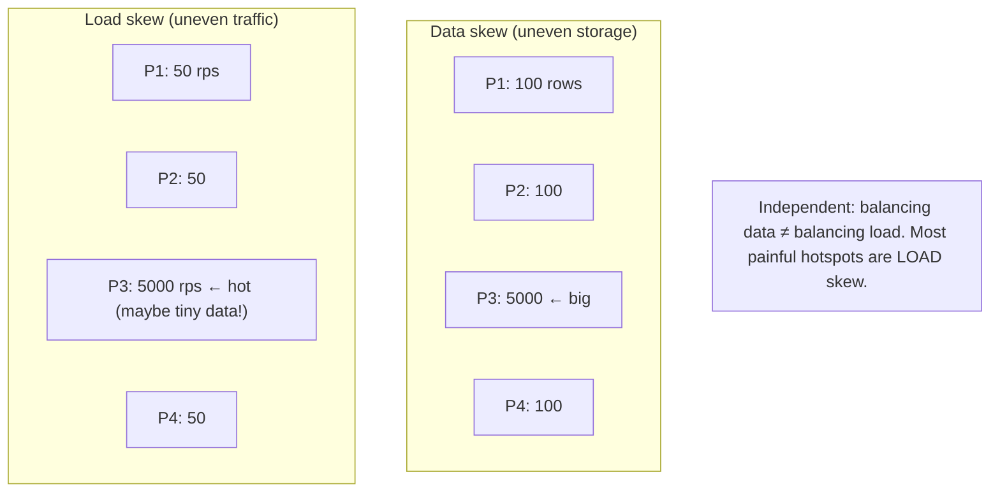
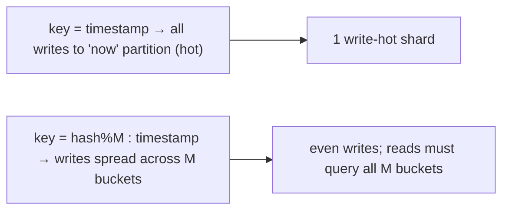

# Lesson 7.4 — Hotspots, Skew, and Rebalancing

> Part 7: Scalability · Difficulty: 🔴
>
> **Prerequisites:** [7.3 Sharding/Partitioning], [6.7 Hot Keys & Stampede], [6.6 Consistent Hashing], [1.1.3 Vocabulary of Scale].
> **Unlocks:** [7.5 Read vs Write Scaling], [7.6 DB Bottleneck], [Part 8 Membership], [Part 17 Tail Latency].

---

## 1. Learning Objectives

After this lesson you will be able to:

- Distinguish **data skew** (uneven data *distribution* across partitions) from **load/access skew** (uneven *traffic*), and explain why a perfectly balanced data layout can still have a brutal traffic hotspot.
- Identify the common **hotspot patterns** — append/sequential-key hotspots, celebrity/hot-key hotspots, low-cardinality keys, and temporal skew — and apply the standard **mitigations** (salting, compound keys, hashing, hot-key splitting, caching/replication, randomized writes).
- Explain **rebalancing** — moving partitions when nodes are added/removed or load shifts — and the strategies (**fixed partition count**, **dynamic split/merge**, consistent-hashing movement) and their tradeoffs, including why **`mod N` rebalancing is forbidden** (7.3/6.6).
- Reason about **rebalancing safely in production** (minimizing data movement, avoiding overload during moves, automatic vs manual, request routing during transitions).

---

## 2. Motivation — Sharding only helps if the load actually spreads

7.3 gave you the strategies to split data across nodes. But splitting data **evenly** is not the same as splitting **load** evenly — and the whole point of sharding (scaling writes/data — 7.3) collapses the moment one partition gets a disproportionate share of work. A system with 100 shards but one **hot shard** taking 50% of the traffic is, for practical purposes, a single-node system with 99 idle helpers: the hot shard saturates, its latency spikes, and because requests fan out or queue behind it, the **whole system's tail latency** degrades (Part 17). This is the **hotspot** problem, and it is the number-one way sharded systems fail to deliver the scalability they promised.

Hotspots come from **skew** — non-uniformity. Sometimes the *data* is skewed (one partition holds far more rows). More often and more dangerously, the *access* is skewed: a celebrity user, a viral product, a "now" timestamp partition, or a low-cardinality key concentrates traffic onto one node even when the data is evenly spread. And skew isn't static — popularity shifts, data grows unevenly, and you add/remove nodes — so you must also **rebalance**: move partitions between nodes to restore balance. Rebalancing is itself dangerous: move too much data and you saturate the network and overload nodes (the very thing you were avoiding), or — with the wrong scheme (`hash mod N`) — you remap everything and cause an outage (7.3/6.6). This lesson is the catalog of skew/hotspot patterns and their mitigations, and the discipline of rebalancing safely. It ties together the **hot-key** material from caching (6.7) and the **partition-key** decisions from 7.3 into one coherent treatment of *keeping load even over time*.

---

## 3. Theory — From first principles

### 3.1 Two kinds of skew

"Skew" means non-uniform distribution. Two distinct kinds, often confused `[CS]`:
- **Data skew (storage skew):** partitions hold **unequal amounts of data**. One shard has 10× the rows/bytes of others → it runs out of disk/memory, its queries are slower, and it's a capacity risk. Caused by low-cardinality keys or naturally lopsided key populations.
- **Load/access skew (traffic skew):** partitions receive **unequal amounts of traffic** (reads/writes per second), *regardless of how much data they hold*. One shard gets hammered while others idle. Caused by **popularity skew** (Zipf — 6.1): a few keys/values get most of the requests.

**The critical insight:** these are **independent**. A partition can hold a tiny amount of data but receive enormous traffic (a single celebrity user's row), or hold huge data but little traffic (cold archival keys). **Balancing data does not balance load.** Most painful production hotspots are **load skew**, and they're harder to fix because you can't always move a single hot key's traffic by moving data (the hot key still maps to one partition — 6.7).

### 3.2 The hotspot patterns

| Pattern | Cause | Symptom |
|---|---|---|
| **Append/sequential hotspot** | partition by timestamp / auto-increment ID → all *new* writes hit the "latest" partition | one write-hot shard, others idle (write skew) |
| **Celebrity / hot-key** | one partition-key value is wildly more popular (viral user/product, global config) | one read- (or write-) hot shard regardless of shard count |
| **Low-cardinality key** | partition key has few distinct values (`country`, `status`, `gender`) | data + load cram into few partitions |
| **Temporal skew** | traffic concentrates on recent data ("today's" partition) | the current-time partition is hot; old ones cold |
| **Whale tenant** (multi-tenant) | one tenant is far larger/busier than others | that tenant's shard is overloaded |

All share a root: **the partition key maps a disproportionate share of data or traffic onto one partition** (7.3 §3.7). Mitigation = change how keys map, or spread the hot key's load.

### 3.3 Mitigation 1 — Better partition-key design (prevent skew at the source)

The best fix is upstream: choose a key that **spreads** (7.3 §3.7) `[BP]`:
- **High-cardinality, evenly-accessed key** — avoid `status`/`country`; prefer `user_id`/`order_id` with many even values.
- **Hash the key** — destroys clustering, spreads evenly (but kills range queries — 7.3 §3.4). Good when range scans aren't needed.
- **Composite keys** — combine a spread dimension with an order dimension, e.g., `(hash_bucket, timestamp)` to break the append hotspot while keeping order *within* a bucket.

### 3.4 Mitigation 2 — Salting / hash-prefixing (break append & sequential hotspots)

For the **append hotspot** (sequential keys), prepend a **salt** — a small random or hashed prefix — to spread sequential writes across `M` partitions `[BP]`:
- Instead of key `2026-06-30T12:00:01`, write `bucket=hash(...)%M : 2026-06-30T12:00:01` → writes scatter across `M` buckets instead of piling on one.
- **Cost:** a **range/read query must now query all `M` buckets** and merge (read amplification) — you trade write-hotspot relief for read fan-out. Choose `M` to balance write spread vs read cost.
- This is the standard fix for time-series/sequential-ID write hotspots (and the same idea as splitting a hot counter — 6.7 §3.9).

### 3.5 Mitigation 3 — Hot-key handling (the celebrity problem)

A single hot **value** can't be fixed by adding shards (it still maps to one) — you must **spread that key's load** `[CS]` (this is exactly 6.7 §3.9, now at the data layer):
- **Caching / replication of the hot key** — front it with a cache (Part 6) or **replicate** it to multiple nodes and read from a random replica → spread reads. Most read hotspots are best absorbed by **caching** (Part 6) before they ever reach the partition.
- **Local L1 cache** on every app node for ultra-hot keys (6.2) — the vast majority of reads never hit the shard.
- **Key splitting** — split a hot **write** key into N sub-keys (`counter:{0..N}`) written at random and aggregated on read — spreads a write hotspot across partitions (6.7 §3.9).
- **Dedicated/isolated partition** — give a whale tenant or celebrity its **own** shard(s) so it doesn't starve others (often via a **directory** scheme — 7.3 §3.6).
- **Detection first** — you can't fix what you can't see: **sample/track per-key and per-partition metrics** to find hot keys/shards before they melt a node (6.7, Part 16).

### 3.6 Rebalancing — what it is and why it's needed

**Rebalancing** is moving partitions (or data) between nodes to restore even distribution `[CS]`. Triggers:
- **Adding nodes** (scale out) — new nodes should take a fair share.
- **Removing nodes** (scale in / failure) — their data/load must go somewhere.
- **Skew developing over time** — a partition grew too large or too hot and must be split/moved.

**Requirements for good rebalancing** `[BP]`:
1. **Move as little data as possible** — data movement consumes network/disk/CPU and competes with live traffic.
2. **Keep serving during the move** — reads/writes continue; routing must handle "this key is mid-move."
3. **End up balanced** — even data and (ideally) even load afterward.
4. **Don't cause a thundering herd** — moving a partition's data shouldn't overload the source/target or stampede a cold cache (6.7).

### 3.7 Rebalancing strategies

- **`hash mod N` — FORBIDDEN** `[CS]`: changing `N` remaps almost all keys → near-total data movement → outage. Never use modulo for anything you'll rescale (7.3 §3.4, 6.6). It violates requirement #1 maximally.
- **Fixed (large) number of partitions** `[CONV]`: create **many more partitions than nodes** up front (e.g., 1024 partitions across 10 nodes). To rebalance, **move whole partitions** between nodes — the *number* of partitions never changes, only their *assignment*. Adding a node = it takes some partitions from existing nodes (move ~`partitions/new_N`). Simple, predictable; the catch is choosing the partition count well (too few = coarse balance / can't grow; too many = overhead). Used by Elasticsearch, Kafka-style, Riak, Couchbase. *(Representative.)*
- **Dynamic partitioning (split/merge)** `[CONV]`: partitions **split** when they grow too big/hot and **merge** when too small — the count adapts to the data. Great for range partitioning (7.3) and unknown/variable data sizes; more complex (split/merge machinery, hysteresis to avoid thrashing). Used by HBase/Bigtable (region splits), range-sharded systems. *(Representative.)*
- **Consistent hashing movement** `[CS]`: with consistent hashing + vnodes (6.6/7.3), adding/removing a node moves only the ring segments adjacent to its vnodes — ~1/N of keys, spread across many nodes (requirement #1 satisfied by design). This is the elastic-scale workhorse.

### 3.8 Automatic vs manual rebalancing, and routing during moves

- **Automatic rebalancing** `[BP]`: the system detects imbalance and moves partitions itself — convenient and responsive, but **dangerous if too eager**: it can move data during a load spike (worsening it), or **misinterpret a slow/overloaded node as dead** and start moving its data — cascading the overload (a feedback loop, like 6.7's stampede). Many systems make rebalancing **automatic but rate-limited and human-gated** (a human approves/triggers, the system executes) for exactly this reason.
- **Routing during a move** `[CS]`: while a partition is migrating, requests for its keys must still be served. Approaches: route to the **old owner until handoff completes** (then cut over atomically), **double-read/forward** during transition, or a **directory/coordination service** (Part 8) that tracks current ownership and is updated atomically at handoff. Clients **cache the topology** and refresh on a routing miss/redirect (e.g., Redis Cluster `MOVED`/`ASK` — 6.6).
- **Throttle the move** — limit migration bandwidth/concurrency so rebalancing doesn't starve live traffic or saturate the network (requirement #2/#4); pre-warm caches at the target to avoid a cold-cache stampede (6.7).

### 3.9 The connection to tail latency and availability

Hotspots and rebalancing both hit **tail latency** (Part 17) and **availability** `[CS]`:
- A hot shard's queue grows → its p99/p999 spikes → and because requests often **fan out** (scatter-gather — 7.3 §3.9) or **depend on** the hot shard, the *whole request's* latency is gated by the slowest shard (**tail amplification**). One hotspot can wreck system-wide tail latency even if averages look fine.
- An overloaded hot shard can **fail** (OOM, timeout), and naive automatic rebalancing can turn one hot/slow node into a **cascading** rebalance storm. So hotspot mitigation is also **resilience** (Part 11): combine spreading (this lesson) with **backpressure/load shedding/circuit breakers** at the shard (6.7 §3.10, Part 11) so a hotspot degrades gracefully rather than collapsing.

---

## 4. Visual Intuition

### Data skew vs load skew

### Salting an append hotspot

---

## 5. Real-World Analogy

Picture a **bank with many teller windows** (partitions).

- **Data skew:** you assign customers to windows by **last-name range**, but half the town is named "Nguyen" or "Smith" — so two windows have enormous customer lists (uneven *data*) even if not everyone shows up today.
- **Load skew:** today a **celebrity** walks in, and everyone crowds *their* window to get an autograph — that one window is mobbed (uneven *traffic*) even though it serves just one "customer." Adding more windows doesn't help: the crowd still wants *that* person's window (the hot-key problem).
- **Salting:** if everyone arrives at opening time and rushes the "new customers" window (append hotspot), you instead hand out **random ticket prefixes** so arrivals spread across several windows — at the cost that finding "all of this morning's arrivals" now means checking several windows.
- **Hot-key handling:** for the celebrity, you **post their autograph on a board at every window** (cache/replicate the hot key) so the crowd disperses, or give them a **dedicated window** so they don't block normal customers.
- **Rebalancing:** when you **open a new window**, you don't reassign *every* customer (that would be chaos — the `mod N` mistake); you move **a manageable share** from the busiest windows to the new one. And you do it **gradually**, keeping all windows open and serving, so the move itself doesn't create a new traffic jam.
- **The trap:** if a window is just **slow** (overworked teller), don't mistake it for "closed" and start frantically moving its customers elsewhere — you'll overload the others and cause a cascade.

---

## 6. Industry Example

- **Time-series key salting** `[BP]`: HBase/Bigtable users prepend a hash/salt to row keys to avoid the "write to the newest region" hotspot (§3.4). *(Representative.)*
- **Fixed-partition rebalancing** `[CONV]`: Elasticsearch shards, Kafka partitions, Riak/Couchbase use a fixed (or capped) partition count and move whole partitions between nodes on scale events (§3.7). *(Representative.)*
- **Dynamic range splitting** `[CONV]`: Bigtable/HBase auto-split tablets/regions as they grow; CockroachDB/Spanner split ranges — dynamic partitioning (§3.7). *(Representative.)*
- **Hot-key mitigation via caching/replication** `[CONV]`: celebrity/viral keys fronted by caches and replicated across nodes (6.7 §3.9, §3.5). *(Representative.)*
- **Human-gated, throttled rebalancing** `[BP]`: production data stores rate-limit and often require operator approval for rebalances to avoid cascading overload (§3.8). *(Representative.)*
- **Consistent hashing + vnodes** `[CS]`: Cassandra/Dynamo move ~1/N keys on node changes (6.6/7.3) (§3.7).

---

## 7. Implementation Details — keeping load even over time

- **Choose a spreading partition key first** (7.3 §3.7) — high cardinality, even access; the cheapest hotspot prevention is not creating one `[BP]`.
- **Salt/compound sequential keys** to break append hotspots (§3.4), accepting read fan-out — tune the bucket count to your write:read mix.
- **Absorb read hotspots with caching** (Part 6) before they hit the partition; **replicate or split** write-hot keys (§3.5, 6.7).
- **Isolate whales/celebrities** onto dedicated partitions (directory scheme — 7.3 §3.6) when a single tenant/value dominates.
- **Detect skew continuously** — per-partition and (sampled) per-key metrics (rps, data size, latency); alert on imbalance *before* a node saturates (§3.5, Part 16).
- **Pick a rebalancing strategy that moves little data** — fixed-many-partitions or dynamic split/merge or consistent-hashing; **never `mod N`** (§3.7) `[BP]`.
- **Rebalance safely** — throttle migration bandwidth, keep serving (route to old owner until handoff, update directory atomically), pre-warm target caches, and make automation **rate-limited/human-gated** so it can't cascade (§3.8).
- **Don't auto-move data off a node that's merely slow** — distinguish "overloaded" from "dead" to avoid feedback-loop cascades (§3.8, Part 8 failure detection).
- **Pair with resilience** — backpressure/load shedding/circuit breakers at the shard so a hotspot degrades gracefully (§3.9, 6.7, Part 11).

---

## 8. Advantages (of handling skew/rebalancing well)

- **Realized scalability** — load actually spreads across nodes, so adding nodes adds capacity (the whole point of 7.3).
- **Tight tail latency** — no hot shard gating system-wide p99/p999 (Part 17).
- **Elasticity** — safe rebalancing lets you add/remove nodes smoothly with minimal data movement (consistent hashing / fixed partitions).
- **Resilience** — isolated whales + graceful degradation prevent one hotspot from collapsing the system (Part 11).
- **Capacity safety** — even data distribution avoids a single shard running out of disk/memory.

---

## 9. Disadvantages / costs

- **Mitigations add complexity** — salting forces read fan-out; hot-key splitting complicates reads/writes; dedicated partitions complicate routing.
- **Detection overhead** — tracking per-key/per-partition metrics costs effort and storage (Part 16).
- **Rebalancing is risky and resource-intensive** — data movement competes with live traffic; eager automation can cascade.
- **Some skew is intrinsic** — Zipf popularity means *some* keys will always be hotter; you manage, never eliminate it (6.1).
- **Read/write tradeoffs** — most fixes trade one amplification for another (RUM-style, 4.2.4).

---

## 10. When NOT to (over-)engineer / limits

- **Uniform workloads** — if data/access is already even (e.g., a good hash key with no hot values), don't add salting/splitting complexity.
- **Read hotspots that caching solves** — front with a cache (Part 6) rather than re-architecting partitioning (§3.5).
- **Premature dedicated-partition isolation** — don't carve out per-tenant shards before a whale actually exists.
- **Aggressive automatic rebalancing** in load-sensitive systems — prefer throttled/human-gated to avoid cascades (§3.8).
- **`mod N`** — never, at any scale you'll grow (§3.7).

---

## 11. Common Mistakes

1. **Partitioning by timestamp/sequential ID** without salting → append hotspot (one write-hot shard) (§3.4).
2. **Assuming even data = even load** → surprised when a tiny-data shard is the hottest (§3.1).
3. **Low-cardinality partition key** (`status`, `country`, boolean) → data/load cram into few shards (§3.2/3.3).
4. **Ignoring hot keys** → adding shards doesn't help the celebrity key; one node saturates (§3.5, 6.7).
5. **`hash mod N` rebalancing** → mass data movement / outage on scale events (§3.7, 6.6).
6. **Eager automatic rebalancing** → moving data during a spike or off a merely-slow node → cascading overload (§3.8).
7. **No skew detection** → finding the hotspot only after the node falls over (§3.5, Part 16).
8. **Unthrottled migration** → rebalancing saturates the network and starves live traffic (§3.8).

---

## 12. Interview Questions

**🟢 Easy**
- What's the difference between data skew and load skew? Give an example where they diverge.
- What is an append hotspot and how does salting fix it?

**🟡 Medium**
- How do you handle a single celebrity/hot key, given that adding shards doesn't move its traffic? (Caching, replication, splitting, isolation.)
- What does rebalancing do, and why is `hash mod N` a terrible rebalancing scheme?

**🔴 Hard**
- Compare fixed-partition-count vs dynamic split/merge rebalancing. When would you choose each, and what are the operational risks?
- Design hotspot mitigation for a time-series ingestion system (append hotspot) that *also* needs range queries by time. Reconcile salting with range reads.
- Why does one hot shard wreck system-wide tail latency even when averages look fine? (Fan-out / tail amplification, Part 17.)

**⚫ Staff+**
- A sharded multi-tenant system has a few whale tenants causing hot shards, an append hotspot on event ingestion, and analytics queries that scatter across all shards. Design a coherent fix: partition-key/salting redesign, whale isolation, caching, secondary-index/analytics path, and a safe rebalancing plan — minimizing data movement and avoiding cascades.
- Your automatic rebalancer triggered during a traffic spike: it flagged an overloaded (not dead) node, started moving its partitions, which overloaded neighbors, which got flagged too — a rebalance storm took down the cluster. Diagnose the feedback loop and redesign rebalancing (detection, rate-limiting, human-gating, distinguishing slow vs dead) (§3.8, Part 8/11).

---

## 13. Production Pitfalls

- **Append hotspot meltdown:** timestamp-keyed ingestion sends all writes to one shard; it saturates while the cluster is 90% idle (§3.4) — the canonical sharding failure.
- **Celebrity key saturates one shard:** a viral user/product overwhelms its partition's CPU/network regardless of cluster size; tail latency spikes system-wide (§3.5, 6.7, Part 17).
- **Tiny-but-hot shard:** the smallest-data shard is the hottest; capacity dashboards (by data size) hid the problem (§3.1).
- **Rebalance storm:** eager automation moves data off a merely-slow node, overloading neighbors, cascading (§3.8) — the Staff+ scenario.
- **Migration starves live traffic:** unthrottled rebalancing saturates the network; user-facing latency spikes during the move (§3.8).
- **Cold target after move:** a moved partition's cache is cold at the target → stampede onto the source (§3.8, 6.7).
- **`mod N` rescale outage:** adding a node remaps everything; mass movement + (for caches) miss storm (§3.7, 6.6).

---

## 14. Optimization Techniques

- **Prevent skew via key design** (high-cardinality, even-access, composite) — cheapest fix (§3.3, 7.3) `[BP]`.
- **Salt/hash-prefix sequential keys** to break append hotspots (tune bucket count) (§3.4).
- **Cache + replicate hot read keys; split hot write keys; isolate whales** (§3.5, 6.7).
- **Continuous skew detection** (per-partition + sampled per-key metrics) to act before saturation (§3.5, Part 16).
- **Minimal-movement rebalancing** — consistent hashing + vnodes, or fixed-many-partitions, or dynamic split/merge — **never `mod N`** (§3.7).
- **Throttle + human-gate rebalancing**, route to old owner until handoff, pre-warm target caches (§3.8, 6.7).
- **Distinguish overloaded vs dead** nodes before moving data (avoid cascades) (§3.8, Part 8).
- **Backpressure/shed/circuit-break at the shard** so a hotspot degrades gracefully (§3.9, 6.7, Part 11).

---

## 15. Summary

Sharding only delivers scale if **load actually spreads** — and the enemy is **skew**. There are two independent kinds: **data skew** (uneven *storage* across partitions) and **load/access skew** (uneven *traffic*) — and crucially **balancing data does not balance load**: the most painful hotspots are traffic hotspots, sometimes on tiny-data partitions (a celebrity key). Common patterns: the **append/sequential hotspot** (timestamp/auto-increment keys send all writes to the "now" partition), the **celebrity/hot-key** hotspot (one value dominates traffic — unfixable by adding shards), **low-cardinality keys**, **temporal skew**, and **whale tenants**. Mitigations: **prevent it via partition-key design** (high cardinality, even access, composite keys — 7.3); **salt/hash-prefix** sequential keys to break append hotspots (at the cost of read fan-out); and **handle hot keys** by **caching/replicating** read-hot keys (Part 6), **splitting** write-hot keys, and **isolating** whales onto dedicated partitions — all predicated on **detecting** skew via per-partition and sampled per-key metrics. Because skew shifts over time and nodes come and go, you must **rebalance** — move partitions to restore balance — under four rules: **move little data, keep serving, end balanced, don't stampede**. Strategies: **`mod N` is forbidden** (mass movement/outage — 6.6/7.3); **fixed (large) partition count** (move whole partitions, count fixed); **dynamic split/merge** (count adapts — good for ranges); and **consistent hashing + vnodes** (only ~1/N keys move). Rebalancing must be done **safely** — throttled, often **human-gated**, routing to the old owner until atomic handoff, pre-warming target caches, and **distinguishing overloaded from dead** nodes so eager automation can't cause a **rebalance storm** (a feedback cascade, kin to 6.7's stampede). Finally, hotspots are a **tail-latency and resilience** problem: one hot shard gates system-wide p99 via fan-out amplification (Part 17), so pair spreading with **backpressure/shedding/circuit breakers** (6.7/Part 11) for graceful degradation.

---

## 16. Revision Notes (flashcard-ready)

- **Q:** Data skew vs load skew? **A:** Data = uneven storage per partition; load = uneven traffic. Independent — balancing data ≠ balancing load.
- **Q:** Which is usually worse? **A:** Load skew — a tiny-data partition can be the hottest (celebrity key).
- **Q:** Append hotspot? **A:** Timestamp/sequential key → all new writes hit one partition; fix with salting/hash prefix.
- **Q:** Salting cost? **A:** Writes spread across M buckets, but range/reads must query all M buckets and merge.
- **Q:** Hot (celebrity) key — why can't more shards fix it? **A:** It still maps to one partition; spread its load via cache/replicate/split/isolate.
- **Q:** Rebalancing rules? **A:** Move little data, keep serving, end balanced, don't stampede.
- **Q:** Forbidden rebalance scheme? **A:** `hash mod N` — remaps almost everything → outage.
- **Q:** Fixed-partition rebalancing? **A:** Many more partitions than nodes; move whole partitions on scale events; count stays fixed.
- **Q:** Dynamic partitioning? **A:** Split/merge partitions as data grows/shrinks (good for ranges); more complex.
- **Q:** Rebalance storm cause? **A:** Eager automation moves data off a merely-slow node → overloads neighbors → cascade; fix with throttle/human-gate + slow-vs-dead distinction.
- **Q:** Why do hotspots wreck tail latency? **A:** Fan-out/scatter-gather is gated by the slowest (hot) shard → system-wide p99 amplification (Part 17).

---

## 17. Further Reading + Knowledge-Graph Links

**Within this platform**
- **Previous:** [7.3 Sharding/Partitioning] (strategies + partition key). **Builds on:** [6.7 Hot Keys & Stampede] (the same mitigations at the cache layer), [6.6 Consistent Hashing], [1.1.3 Vocabulary of Scale].
- **Next:** [7.5 Read vs Write Scaling]. **Related:** [7.6 DB Bottleneck].
- **Enables:** [Part 8 Membership/Failure Detection] (slow vs dead, rebalancing coordination), [Part 11 Resilience] (graceful degradation), [Part 17 Tail Latency] (fan-out amplification).

**Foundational texts (synthesized)**
- Kleppmann, *Designing Data-Intensive Applications* — skew, hot spots, rebalancing strategies, fixed vs dynamic partitions (synthesized).
- Dean & Barroso, "The Tail at Scale" — tail-latency amplification (concept, synthesized).
- Bigtable/HBase/Cassandra/Elasticsearch documentation — splitting, salting, vnodes — representative.

**Concept tags:** `[CS]` data vs load skew, hot-key on one partition, rebalancing requirements, tail amplification · `[CONV]` fixed-partition vs dynamic split/merge, salting, whale isolation, throttled/human-gated rebalance · `[BP]` spreading key design, cache/replicate/split hot keys, detect skew, never mod N, distinguish slow vs dead.
