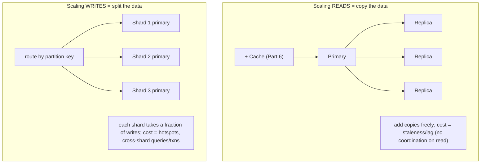
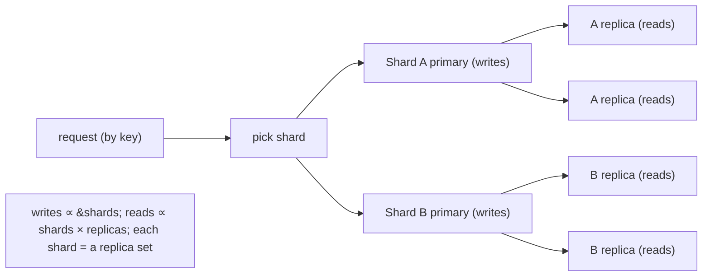

# Lesson 7.5 — Read Scaling (Replicas) vs Write Scaling (Sharding) vs Both

> Part 7: Scalability · Difficulty: 🟡🔴
>
> **Prerequisites:** [7.3 Sharding], [7.4 Hotspots], [5.4.2 Read Replicas/Failover], [6.1 Caching], [Part 6 Caching].
> **Unlocks:** [7.6 DB Bottleneck], [Part 10 Replication/Consistency], [Part 9 CQRS], [Part 12 Microservices Data].

---

## 1. Learning Objectives

After this lesson you will be able to:

- Explain the **fundamental asymmetry**: **reads scale easily** (caching + replication — copy the data), but **writes scale hard** (you must partition — split the data), and *why* this asymmetry exists.
- Build the **read-scaling stack** — caching (Part 6) → read replicas (5.4.2) → read/write splitting — and reason about its key cost: **replication lag** and the consistency anomalies it causes (read-your-writes, monotonic reads — Part 10).
- Build the **write-scaling stack** — sharding (7.3) → multi-leader/leaderless (Part 10 preview) — and explain why it's harder and what it costs (cross-shard queries/transactions, hotspots).
- Combine both (**sharded + replicated**), recognize patterns like **CQRS** (separate read/write models), and **diagnose whether a system is read-bound or write-bound** to apply the right tool.

---

## 2. Motivation — Reads and writes are not symmetric problems

A recurring beginner error is to treat "scale the database" as one problem. It is two very different problems, and conflating them leads to reaching for the wrong (usually too-expensive) tool. **Reads** and **writes** scale by **opposite mechanisms**, with opposite difficulty:

- **Reads scale by *copying* data** — put the same data in more places (caches, replicas) and spread read traffic across the copies. This is **easy and cheap**: copies don't have to coordinate with each other to serve a read, and you can make as many as you want. Most systems are **read-heavy** (often 10:1, 100:1, or more reads:writes — *illustrative*), so this single insight handles the majority of scaling needs.
- **Writes scale by *splitting* data** — partition it so each node handles a fraction of the writes (7.3). This is **hard**: a write must go to the **one authoritative place** for that data (or be coordinated across copies — multi-leader/leaderless, Part 10), and splitting brings hotspots (7.4), cross-shard queries/transactions, and operational pain.

The practical consequence is the **scaling ladder's ordering** (7.1): when the database is the bottleneck (7.6), you **almost always attack reads first** — caching and replicas buy enormous headroom cheaply — and you **shard only when writes (or data volume) genuinely exceed one node**, because write-scaling is the expensive, hard-to-reverse step. Getting this right means correctly **diagnosing** whether you're read-bound or write-bound and applying the matching tool, instead of sharding a read-bound system (pure pain for no benefit) or piling on replicas for a write bottleneck (which does nothing). This lesson makes the asymmetry precise, builds both stacks, and shows how to combine them.

---

## 3. Theory — From first principles

### 3.1 Why reads are easy and writes are hard (the core asymmetry)

The asymmetry comes from **consistency of copies** `[CS]`:
- A **read** just needs *a* copy of the data. Copies are **independent** for reading — adding a 10th replica doesn't make the other 9 coordinate. So reads scale **horizontally and cheaply** by adding copies (caches, replicas). The only cost is keeping copies *up to date* (replication), which introduces **staleness**, not coordination-on-read.
- A **write** must update the **authoritative** state. If there are N copies, a write must eventually reach all of them, and to keep them **consistent** you must either funnel writes through **one leader** (then the leader is the write bottleneck) or **coordinate** writes across copies (multi-leader/leaderless conflict resolution — Part 10, expensive). Either way, **writes can't be trivially parallelized across copies** the way reads can. The only way to truly scale write *throughput* is to **partition** — give different writes to different nodes (7.3) — which is hard for all the reasons in 7.3/7.4.

**One-line model:** *reads scale by replication (copy), writes scale by partitioning (split); copying is cheap, splitting is hard.*

### 3.2 The read-scaling stack

In increasing order of when you reach for them `[BP]`:
1. **Caching (Part 6) — first and highest-leverage.** A cache serves hot reads from memory, offloading the database entirely for those keys. A 95% hit ratio means the DB sees 5% of reads (6.1's offload math). Cheapest, biggest win; do this before replicas.
2. **Read replicas (5.4.2).** Replicate the database; route **reads to replicas**, **writes to the primary** (read/write splitting). Each replica adds read capacity. Scales reads linearly (add replicas) without touching the write path.
3. **Read/write splitting at the app/proxy.** The application or a proxy (e.g., a connection pooler / query router) sends `SELECT`s to replicas and writes to the primary — and must handle **read-your-writes** (route a user's reads to the primary briefly after their write, or to a replica known to be caught up).

**The cost of the read-scaling stack is staleness** (§3.3) — both caches (6.5) and replicas (5.4.2) serve **possibly-stale** data because keeping copies perfectly in sync would reintroduce coordination. This is the price of cheap read scaling.

### 3.3 Replication lag and its consistency anomalies

Replicas are updated **asynchronously** (5.4.2): the primary commits, then streams changes to replicas, which apply them with some **lag** (ms to seconds, sometimes more under load). During that window a replica is **stale**. This causes user-visible anomalies (formalized in Part 10) `[CS]`:
- **Read-your-writes violation:** a user writes (to primary), then immediately reads (from a lagging replica) and **doesn't see their own change** — "I just posted, where is it?" Fix: route their reads to the primary (or a caught-up replica) for a short window after a write.
- **Monotonic reads violation:** successive reads hit replicas at *different* lag, so the user sees data **go backwards in time** (a comment appears, then vanishes on refresh). Fix: pin a user to one replica (session stickiness *for reads*), or track a read position.
- **Consistent-prefix violation:** reads see writes out of causal order across replicas. Fix: causal consistency mechanisms (Part 10).

**The takeaway:** read scaling via replicas/caches trades **strong consistency for read throughput**, and you must **engineer around the lag** for the specific reads that can't tolerate staleness (money, a user's own data). This is the single biggest gotcha of read scaling and a core Part 10 topic.

### 3.4 Synchronous vs asynchronous replication (the lag knob)

You can tune the lag-vs-performance tradeoff (5.4.2, Part 10 preview) `[CS]`:
- **Asynchronous replication (default):** primary acks the write *before* replicas confirm → fast writes, but replicas lag and a failover can **lose the last unreplicated writes**. Maximizes read scaling and write speed; weakest freshness/durability.
- **Synchronous replication:** primary waits for (some) replicas to confirm before acking → no lag for those replicas, no data loss on failover, but **slower writes** and **reduced availability** (a slow/down replica blocks writes). 
- **Semi-synchronous (common compromise):** wait for **one** replica synchronously (durability + failover safety) and the rest async (read scaling) — a typical production setting.
This is a **PACELC** decision (Part 10): *else* (no partition), choose **latency** (async) or **consistency** (sync).

### 3.5 The write-scaling stack

Writes don't scale by copying, so `[CS]`:
1. **Reduce writes first** — batch/coalesce writes (6.3 write-back), write-behind counters (6.7), avoid unnecessary writes. The cheapest "write scaling" is fewer writes.
2. **Vertical scale the primary** (7.1) — a bigger box takes more writes; buys time.
3. **Shard/partition (7.3) — the real write-scaling tool.** Split data by partition key so each shard's primary handles a fraction of the writes. This is *the* way to scale write throughput past one node — with all of 7.3/7.4's costs (key choice, hotspots, cross-shard queries/transactions).
4. **Multi-leader / leaderless replication (Part 10)** — allow writes to multiple nodes (multiple regions, or any node in a leaderless quorum). Scales/distributes writes geographically and improves write availability, but introduces **write conflicts** that must be detected and resolved (LWW, CRDTs, version vectors — Part 10) — the hardest consistency territory.

Writes scaling is **fundamentally harder** because it fights the consistency-of-copies problem head-on (§3.1).

### 3.6 Combining both — sharded + replicated

Large systems do **both** `[CONV]`: **partition** the data into shards (write scaling — 7.3), and **replicate each shard** (read scaling + availability — 5.4.2). So each shard is a **replica set** (one primary + replicas), and the system is a grid of (shard × replica). This gives:
- **Write throughput** ∝ number of shards (each shard's primary takes a fraction of writes).
- **Read throughput** ∝ shards × replicas-per-shard (read from any replica of the right shard).
- **Availability** — a shard survives replica loss; failover within the shard (5.4.2, Part 11).
This is the standard architecture of scaled data systems (Cassandra, sharded SQL, etc. — 7.3). It inherits *both* sets of costs (replication lag *and* cross-shard complexity).

### 3.7 CQRS — separating the read and write models

A powerful pattern that **embraces the asymmetry** `[EMERGING]`/`[CONV]`: **Command Query Responsibility Segregation (CQRS)** uses **separate models (and often separate stores) for writes and reads** (Part 9/12):
- The **write side** (commands) optimizes for correctness/normalization on a write-optimized store.
- The **read side** (queries) maintains **denormalized, query-optimized read models / materialized views** (5.1.2), updated asynchronously from the write side (often via the event stream / CDC — Part 9).
- **Why it scales:** each side scales independently with its own tool — the read models can be replicated/cached freely (read scaling), and you can build *many* read models tailored to different queries. The cost is **eventual consistency** between write and read sides (the read model lags — same staleness theme) and added complexity.
CQRS is the architectural expression of "reads and writes are different problems, so give them different infrastructure" — heavily used in the capstone (Part 20) and event-driven systems (2.2.4, Part 9).

### 3.8 Diagnosing read-bound vs write-bound

Apply the right tool by **measuring** which way the system is bound `[BP]` (7.6, Part 17):
- **Read-bound** (most systems): read QPS dominates, the primary/DB CPU is busy serving `SELECT`s, cache hit ratio is low or replicas are saturated. → **Cache harder (Part 6), add replicas (5.4.2), CQRS read models.**
- **Write-bound:** write QPS/throughput is the limit, the primary's write path (WAL, locks, disk) is saturated, replicas are idle. → **Reduce writes, then shard (7.3); replicas won't help.**
- **Both / data-volume-bound:** the dataset doesn't fit, or both axes are maxed. → **Shard + replicate (§3.6).**
**The classic mistake** is misdiagnosis: adding replicas to a write-bound system (no effect — writes still funnel to the primary) or sharding a read-bound system (huge complexity for a problem caching would have solved). Measure first.

---

## 4. Visual Intuition

### The asymmetry

### Sharded + replicated (both)

---

## 5. Real-World Analogy

Think of a **popular cookbook author** answering questions.

- **Scaling reads = making copies.** Everyone wants to *read* the recipes, so you **print thousands of copies** (replicas) and put a few on every kitchen counter (caches). Readers never bother the author — they just grab a nearby copy. Making more copies is cheap and you can make as many as you like. The only catch: when the author **tweaks a recipe**, the printed copies are **out of date** until the next printing (replication lag) — so a reader might cook the old version for a while (stale read).
- **Scaling writes = dividing the work.** Only the **author** can actually *change* a recipe (the authoritative write). One author can only write so fast. To write faster you'd have to **split the cookbook into volumes and hire a different author per volume** (sharding) — now writes happen in parallel, but if a recipe spans two volumes (cross-shard), coordinating the two authors is a hassle, and if everyone wants edits to the *dessert* volume (hotspot), that author is swamped.
- **Doing both:** split into volumes (sharding for write speed) **and** print many copies of each volume (replicas for read speed).
- **CQRS:** keep the author's **messy working manuscript** (write model, optimized for editing) separate from the **beautiful printed editions** (read models, optimized for reading), and re-typeset the editions from the manuscript periodically (async update) — each optimized for its job.
- **Diagnose first:** if the problem is "too many *readers*," printing more copies fixes it; if the problem is "the author can't *write* fast enough," printing more copies does **nothing** — you need more authors (shards). Reaching for the wrong fix is the classic mistake.

---

## 6. Industry Example

- **Cache + read-replica read scaling** `[CONV]`: the standard relational scaling path — Redis/Memcached cache (Part 6) + read replicas with read/write splitting (5.4.2); handles read-heavy workloads for years before sharding. *(Representative.)*
- **Read-your-writes handling** `[BP]`: apps route a user's reads to the primary (or a caught-up replica) briefly after a write to avoid the "where's my post?" anomaly (§3.3, Part 10). *(Representative.)*
- **Sharded + replicated data stores** `[CONV]`: Cassandra/DynamoDB (partition + replication factor), Vitess/Citus (sharded MySQL/Postgres with replicas) — both axes (§3.6). *(Representative.)*
- **CQRS + materialized read models** `[CONV]`: event-driven systems maintain denormalized read views updated via CDC/event streams (Part 9), scaling reads independently of writes (§3.7, 5.1.2). *(Representative.)*
- **Semi-synchronous replication** `[CONV]`: MySQL/Postgres semi-sync (one sync replica for durability, rest async for read scaling) — the §3.4 compromise. *(Representative.)*

---

## 7. Implementation Details — applying the right tool

- **Diagnose read-bound vs write-bound first** (§3.8) — measure read/write QPS, primary CPU/IO, cache hit ratio, replica utilization; apply the matching tool. Don't guess `[BP]`.
- **Attack reads in order:** cache (Part 6) → read replicas + read/write splitting (5.4.2) → CQRS read models — cheapest and highest-leverage first (§3.2).
- **Engineer around replication lag** (§3.3) — identify reads that need freshness (a user's own data, money) and route them to the primary/caught-up replica; accept staleness elsewhere (Part 10).
- **Tune replication mode** (§3.4) — async for max read scaling/speed; semi-sync for durability + failover safety; sync only where required (PACELC choice, Part 10).
- **Scale writes only when truly write/data-bound** — first **reduce writes** (batch/coalesce/write-back — 6.3), vertical-scale the primary, *then* shard (7.3) `[BP]`.
- **Combine sharding + replication** for write scale *and* read scale *and* availability — each shard a replica set (§3.6).
- **Consider CQRS** when read and write workloads/shapes diverge sharply or you need many tailored read views — accepting eventual consistency between sides (§3.7, Part 9).
- **Don't shard a read-bound system or add replicas to a write-bound one** — the classic misdiagnosis (§3.8).

---

## 8. Advantages

- **Read scaling (cache + replicas):** cheap, linear, doesn't touch the write path; huge headroom for read-heavy systems; replicas also give availability/DR (5.4.2).
- **Write scaling (sharding):** the only way past one node's write/data limits; combines with replication (§3.6).
- **Combined (sharded + replicated):** scales both axes + availability — the architecture of large data systems.
- **CQRS:** independent scaling/optimization of reads and writes; many tailored read models; fits event-driven systems.
- **Right-tool diagnosis:** avoids wasted complexity/cost by matching mechanism to bottleneck.

---

## 9. Disadvantages / costs

- **Read scaling cost = staleness/lag** → read-your-writes, monotonic-read, consistent-prefix anomalies to engineer around (§3.3, Part 10).
- **Sync replication cost** = slower writes + reduced availability (§3.4).
- **Write scaling (sharding) cost** = hotspots (7.4), cross-shard queries/transactions (7.3 §3.9), re-shard pain, operational complexity.
- **Combined** inherits *both* cost sets (lag *and* cross-shard complexity).
- **CQRS cost** = eventual consistency between write/read sides + significant added complexity (two models, sync pipeline) (§3.7).
- **Misdiagnosis cost** = wrong tool → effort with no benefit (§3.8).

---

## 10. When NOT to use each

- **Don't add replicas for a write bottleneck** — writes still funnel to the primary; replicas don't help write throughput (§3.8).
- **Don't shard a read-bound system** — caching + replicas solve it far more cheaply; sharding adds huge complexity for nothing (§3.8, 7.3).
- **Don't use sync replication** where write latency/availability matters and some staleness is tolerable — async/semi-sync is usually right (§3.4).
- **Don't serve freshness-critical reads from lagging replicas/caches** — route those to the primary (§3.3).
- **Don't adopt CQRS** for simple CRUD with similar read/write shapes — the complexity isn't justified (§3.7).
- **Don't scale (either way) before measuring** — you may optimize the wrong axis (§3.8).

---

## 11. Common Mistakes

1. **Treating "scale the DB" as one problem** — not distinguishing read- vs write-bound (§3.8).
2. **Adding replicas to fix writes** — zero effect; the primary is still the write bottleneck (§3.8).
3. **Sharding a read-heavy system** — pain and cross-shard cost when caching/replicas would do (§3.8, 7.3).
4. **Ignoring replication lag** — read-your-writes / monotonic-read bugs in production (§3.3, Part 10).
5. **Reading freshness-critical data from a replica/cache** — stale money/balances/own-data (§3.3).
6. **Sync replication everywhere** — slow writes, writes blocked by a slow replica (§3.4).
7. **Not reducing writes before sharding** — sharding to handle writes that batching/coalescing would have removed (§3.5, 6.3).
8. **CQRS for everything** — over-engineering simple CRUD (§3.7).

---

## 12. Interview Questions

**🟢 Easy**
- Why do reads scale more easily than writes?
- What's the difference between using read replicas and sharding? What does each scale?

**🟡 Medium**
- Walk through the read-scaling stack (cache → replicas → splitting) and the main cost it introduces.
- What is replication lag and what user-visible anomalies does it cause? How do you handle read-your-writes?

**🔴 Hard**
- A system is slow under load. How do you determine whether it's read-bound or write-bound, and how does that change your approach?
- Explain async vs sync vs semi-synchronous replication and the PACELC tradeoff each represents. When would you choose each?
- What is CQRS, why does it scale reads and writes independently, and what consistency cost does it impose?

**⚫ Staff+**
- Design the data scaling strategy for a read-heavy social feed (100:1 reads:writes) that also has a few write-hot entities. Combine caching, replicas, sharding, and possibly CQRS — diagnosing each bottleneck and justifying the order and the consistency handling (read-your-writes, lag).
- Your write throughput has hit the primary's ceiling and replicas are idle, but the team's instinct is "add more replicas." Explain why that won't work, design the actual fix (reduce writes → shard → replicate shards), and lay out the migration and the new cross-shard query/transaction handling.

---

## 13. Production Pitfalls

- **"Add replicas" for a write wall:** replicas pile up idle while the primary's write path stays saturated — months of effort, no improvement (§3.8).
- **Read-your-writes failure:** a user posts/updates and immediately sees stale data from a lagging replica → "it didn't save" confusion and duplicate submits (§3.3, Part 10).
- **Monotonic-read flicker:** refreshing shows data appearing/disappearing as reads hit replicas at different lag (§3.3).
- **Stale money:** a balance/inventory read from a replica/cache shows an old value, leading to overdraft/oversell (§3.3) — freshness-critical reads must hit the primary.
- **Sync-replication write stall:** a slow/down sync replica blocks all writes; availability drops (§3.4).
- **Replication lag explosion under load:** a write spike makes replicas fall far behind → stale reads worsen exactly when traffic is highest (§3.3, 5.4.2).
- **Premature shard, read-bound reality:** a team sharded a read-heavy system; now they pay cross-shard query costs for a problem a cache would have solved (§3.8, 7.3).

---

## 14. Optimization Techniques

- **Diagnose the bottleneck axis** before acting (§3.8) — measure, don't guess `[BP]`.
- **Cache first, then replicas** for reads — the biggest, cheapest wins (Part 6, 5.4.2).
- **Read/write splitting + caught-up-replica routing** for read-your-writes (§3.3).
- **Reduce writes** (batch/coalesce/write-back/write-behind) before scaling writes (6.3/6.7).
- **Shard for writes + replicate shards** for the full picture (§3.6).
- **Semi-sync replication** — durability/failover safety + read scaling (§3.4).
- **CQRS read models** (denormalized, async-updated via CDC) for divergent read/write workloads (§3.7, Part 9, 5.1.2).
- **Tune/monitor replication lag** and alert when freshness budgets are at risk (5.4.2, Part 16).

---

## 15. Summary

Scaling a database is **two different problems** with **opposite mechanisms and difficulty**. **Reads scale by *copying* data** — caching (Part 6) and read replicas (5.4.2) put the data in more places and spread read traffic; this is **cheap and near-linear** because copies don't coordinate to serve a read. **Writes scale by *splitting* data** — sharding (7.3) gives each node a fraction of writes; this is **hard** because a write must reach the authoritative copy (or coordinate across copies — multi-leader/leaderless, Part 10) and splitting brings hotspots (7.4) and cross-shard query/transaction costs. The **read-scaling stack** is cache → replicas → read/write splitting, and its defining cost is **replication lag/staleness**, which causes **read-your-writes**, **monotonic-read**, and **consistent-prefix** anomalies you must engineer around (route freshness-critical reads to the primary/caught-up replica — Part 10); the **async/sync/semi-sync** choice tunes the lag-vs-speed/durability tradeoff (a PACELC decision). The **write-scaling stack** is reduce-writes → vertical → **shard** → multi-leader/leaderless, fundamentally harder because it fights consistency-of-copies head-on. Large systems do **both**: shard the data and replicate each shard (each shard = a replica set), getting write throughput ∝ shards and read throughput ∝ shards × replicas plus availability — at the cost of *both* lag and cross-shard complexity. **CQRS** embraces the asymmetry by using separate, independently-scaled write and read models (denormalized read views updated async — Part 9/5.1.2), trading eventual consistency for tailored, independent scaling. The master skill is **diagnosis**: determine whether you're **read-bound** (cache + replicas), **write-bound** (shard — replicas won't help), or **data-volume/both-bound** (shard + replicate) — because the classic, expensive mistakes are adding replicas to a write-bound system (no effect) or sharding a read-bound one (huge complexity for nothing). Measure first; copy for reads, split for writes.

---

## 16. Revision Notes (flashcard-ready)

- **Q:** Core asymmetry? **A:** Reads scale by copying (cache/replicas — cheap, no coordination on read); writes scale by splitting (sharding — hard).
- **Q:** Why are writes hard to scale? **A:** A write must reach the authoritative copy or coordinate across copies to stay consistent; only partitioning truly parallelizes write throughput.
- **Q:** Read-scaling stack? **A:** Cache (Part 6) → read replicas + read/write splitting → CQRS read models.
- **Q:** Defining cost of read scaling? **A:** Replication lag / staleness → read-your-writes, monotonic-read, consistent-prefix anomalies (Part 10).
- **Q:** Read-your-writes fix? **A:** Route a user's reads to the primary (or a caught-up replica) for a window after their write.
- **Q:** Async vs sync vs semi-sync replication? **A:** Async = fast/lag/possible loss; sync = no lag/no loss but slow + blocks on slow replica; semi-sync = one sync replica + rest async (common).
- **Q:** Write-scaling stack? **A:** Reduce writes → vertical → shard (7.3) → multi-leader/leaderless (Part 10).
- **Q:** Combine both? **A:** Shard the data + replicate each shard (each shard = replica set); writes ∝ shards, reads ∝ shards × replicas.
- **Q:** CQRS? **A:** Separate write and read models/stores; read models denormalized + async-updated → independent scaling; eventual consistency cost.
- **Q:** Classic misdiagnosis mistakes? **A:** Adding replicas for a write bottleneck (no effect); sharding a read-bound system (needless complexity).

---

## 17. Further Reading + Knowledge-Graph Links

**Within this platform**
- **Previous:** [7.4 Hotspots/Skew]. **Builds on:** [7.3 Sharding] (write scaling), [5.4.2 Read Replicas/Failover] (read scaling), [Part 6 Caching] (read offload), [6.5 Invalidation] (cache staleness).
- **Next:** [7.6 Multi-tier Scaling & the DB Bottleneck]. **Related:** [7.7 Capacity Planning].
- **Enables:** [Part 10 Replication & Consistency] (lag anomalies, sync/async, multi-leader/leaderless), [Part 9 CQRS/CDC] (read models), [Part 12 Microservices Data] (database-per-service, CQRS).

**Foundational texts (synthesized)**
- Kleppmann, *Designing Data-Intensive Applications* — replication, lag anomalies, partitioning, derived data/CQRS (synthesized).
- Database documentation (read replicas, semi-sync replication, read/write splitting) — representative.
- CQRS/event-sourcing literature (concept, synthesized).

**Concept tags:** `[CS]` read=copy vs write=split asymmetry, replication lag anomalies, consistency-of-copies · `[CONV]` cache+replica stack, sharded+replicated, semi-sync, CQRS read models · `[BP]` diagnose read- vs write-bound, cache→replicas→shard order, reduce writes before sharding, engineer around lag · `[EMERGING]` CQRS for divergent read/write scaling.
