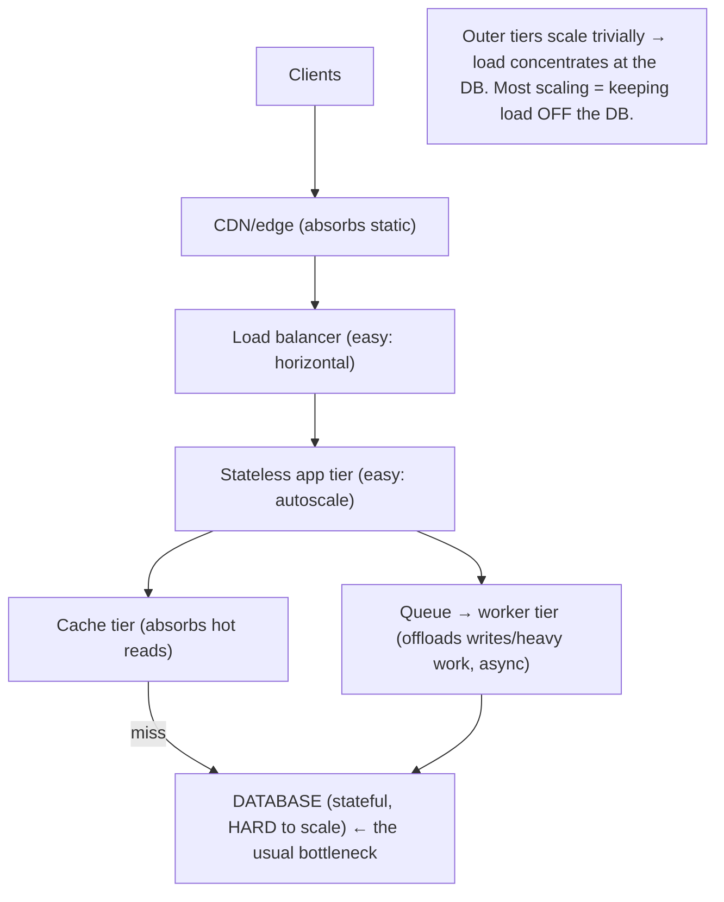
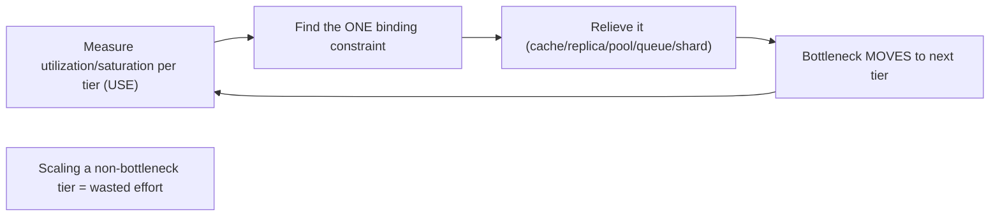

# Lesson 7.6 — Multi-Tier Scaling and the Database as the Usual Bottleneck

> Part 7: Scalability · Difficulty: 🟡🔴
>
> **Prerequisites:** [7.1 Vertical vs Horizontal], [7.2 Stateless Services], [7.5 Read vs Write Scaling], [3.3.1 Load Balancing], [Part 6 Caching].
> **Unlocks:** [7.7 Capacity Planning], [Part 9 Async/Queues], [Part 17 Performance], [Part 12 Microservices].

---

## 1. Learning Objectives

After this lesson you will be able to:

- Describe the **standard multi-tier web architecture** (client → CDN/edge → load balancer → stateless app tier → caching tier → database + async/worker tier) and how **each tier scales differently**.
- Explain **why the database is almost always the ultimate bottleneck**: the app/web tiers are stateless and scale out trivially, but the database is **stateful** and the **hardest** thing to scale (7.1/7.5) — so load flows down until it pools at the data layer.
- Apply the **bottleneck-chasing discipline**: a distributed system has a single binding constraint at a time; scaling a non-bottleneck tier is wasted effort, and relieving one bottleneck **moves** it to the next tier (Theory of Constraints / Amdahl — 7.1).
- Use the toolkit to **relieve the database bottleneck**: caching (Part 6), read replicas (7.5), connection pooling (5.4.2), **async processing / queues** to offload writes (Part 9), and finally sharding (7.3) — in cost order.

---

## 2. Motivation — You scaled everything, and it's still slow at the database

Teams celebrate when the app tier autoscales smoothly to hundreds of stateless instances (7.2) behind a load balancer — and then discover the system is **no faster**, because every one of those instances still talks to **one database**, which is now pegged. This is the single most common scaling story in the industry: **the stateless tiers scale out easily, so the bottleneck inevitably lands on the database** — the one tier that's stateful, hard to scale, and holds the source of truth (7.1, 7.5).

Understanding this requires thinking about the system as a **chain of tiers**, each with its own capacity and scaling mechanism, and load flowing through them. A system's throughput is set by its **narrowest tier** (its bottleneck) — like a chain's strength is its weakest link, or a highway's capacity its narrowest stretch. Scaling any *other* tier does nothing; you must find and widen the actual bottleneck. And because the **easy** tiers (CDN, LB, stateless app) widen so readily, the constraint **flows down to the data tier** and stays there. So most of scalability practice is, in effect, **keeping load off the database** — caching it away, offloading reads to replicas, deferring writes to async workers, and only as a last resort sharding the database itself. This lesson assembles the full multi-tier picture, explains *why* the DB is the perennial bottleneck, and gives the disciplined, cost-ordered toolkit for relieving it — tying together everything in Part 6 and Part 7 so far.

---

## 3. Theory — From first principles

### 3.1 The standard multi-tier architecture

A typical scaled web system, outermost to innermost `[CONV]`:

| Tier | Role | How it scales | Difficulty |
|---|---|---|---|
| **Client / browser** | runs UI, caches assets (6.2) | n/a (user devices) | — |
| **CDN / edge** | cache static/edge content (3.3.3) | provider-scaled, global | trivial |
| **Load balancer** | distribute requests (3.3.1) | horizontal (redundant LBs) + DNS | easy |
| **Stateless app/web tier** | business logic | **horizontal, trivially** (stateless — 7.2, autoscale — Part 13) | **easy** |
| **Caching tier** | offload reads (Part 6) | shard + replicate (6.6) | moderate |
| **Database (source of truth)** | persistent state | replicas (reads) + **sharding (writes)** — hard (7.5/7.3) | **hard** |
| **Async / worker tier + queue** | deferred/background work (Part 9) | horizontal (consumers) | easy–moderate |

The key structural fact: **the outer tiers are stateless or cache-y** (copy freely → scale out easily), while the **database is stateful** (the one place the authoritative data lives → scales only by replication + the hard work of partitioning — 7.5). So **scaling difficulty increases as you go inward**, and capacity is set by the innermost, hardest tier.

### 3.2 Why the database is the usual bottleneck

Three reinforcing reasons `[CS]`:
1. **It's stateful.** Statelessness is what makes the app tier scale trivially (7.2); the database *can't* be stateless (it *is* the state), so it scales the hard way (replicas for reads, sharding for writes — 7.5). Hard-to-scale = the tier that maxes out first.
2. **Everything funnels to it.** Every request that isn't absorbed by a cache eventually reads or writes the database. As you widen the easy tiers, *more* requests reach the DB — the load **concentrates** at the bottom.
3. **Writes don't scale by copying.** Read replicas help reads, but **all writes** still funnel to the primary (7.5 §3.1). A single primary has a hard write ceiling (WAL throughput, locks, disk — 5.3.1/5.2.5), and crossing it requires sharding — the expensive step most systems delay.

Hence the maxim: **in most systems, the database is the scalability bottleneck** — and most scaling work is really about *protecting the database* from load.

### 3.3 Bottleneck thinking — one binding constraint at a time

A system's **throughput is limited by its single narrowest tier** (Theory of Constraints; cf. Amdahl, 7.1) `[CS]`:
- At any moment there is **one binding constraint** (the bottleneck). The system can't go faster than it, no matter how much you scale everything else.
- **Scaling a non-bottleneck tier is wasted effort** — more app servers don't help if the DB is the limit (and may even *worsen* it by sending more concurrent load downstream).
- **Relieving the bottleneck moves it** — fix the DB and the next constraint surfaces (the cache tier, the network, the LB, a downstream service). Scaling is **iterative bottleneck-chasing**: find the constraint → relieve it → find the new one → repeat.
- **Find it by measuring** (Part 17) — saturation/utilization per tier (the **USE method**: Utilization, Saturation, Errors), latency breakdown across tiers, queue depths. Don't guess which tier is the limit; instrument and locate it.

This discipline is what separates effective scaling from flailing: you **measure to find the bottleneck**, scale *only* it, and expect the bottleneck to relocate.

### 3.4 The cost-ordered toolkit for relieving the database

When the DB is the bottleneck, attack it **cheapest-first** `[BP]` (this is the Part 6 + 7.5 ladder, assembled):
1. **Cache (Part 6)** — serve hot reads from memory; a high hit ratio offloads most reads (6.1). Cheapest, biggest win.
2. **Read replicas + read/write splitting (7.5/5.4.2)** — spread reads across copies; the primary handles only writes + uncached reads.
3. **Connection pooling (5.4.2)** — a pooler (PgBouncer-style) prevents **connection exhaustion**: thousands of stateless app instances each opening DB connections will overwhelm a database (each connection costs memory/process); a pooler multiplexes many app clients onto few DB connections. **Critical** when the app tier autoscales — without it, scaling the app tier *kills* the DB via connection count, not query load.
4. **Async processing / queues (Part 9)** — move non-urgent **writes** and heavy work **off the request path** onto a queue + worker tier. The request enqueues (fast) and returns; workers drain the queue at the DB's sustainable rate. This **smooths write spikes** (the queue absorbs bursts — backpressure, 3.3.4), **decouples** the user-facing latency from the DB, and lets you scale workers independently. The single most effective way to protect a write-bound DB short of sharding.
5. **Reduce/defer writes** — batch/coalesce (6.3 write-back), write-behind counters (6.7), eliminate unnecessary writes.
6. **Vertical-scale the primary** (7.1) — a bigger DB box; buys time.
7. **Shard (7.3)** — the last resort for true write/data scaling; expensive and hard to reverse.

The art (1.1.5) is climbing only as far as the requirement demands — most systems are relieved by steps 1–4 and never shard.

### 3.5 Async processing as a scalability tier (the queue)

Worth its own treatment because it's so effective `[CONV]` (full depth in Part 9):
- **Synchronous coupling** means the user's request waits for *every* downstream step, including slow DB writes and external calls — so the request tier's throughput is gated by the slowest synchronous dependency (often the DB).
- **Introducing a queue** between the app tier and the heavy work **decouples** them: the app **publishes** an event/job and returns immediately; a **worker tier consumes** at its own pace. Benefits: **spike absorption** (the queue buffers a burst the DB couldn't take synchronously — load leveling), **independent scaling** (add workers without touching the app tier), **resilience** (if the DB/worker is briefly down, the queue holds work — Part 11), and **better tail latency** (users don't wait on slow back-end work).
- **Cost:** **eventual consistency / async semantics** (the work happens *later* — the user sees "submitted," not "done"), plus the operational weight of a broker and delivery-guarantee handling (at-least-once, idempotency, dead-letter queues — Part 9/11). You trade synchronous simplicity for throughput, resilience, and DB protection.
This is why scaled architectures are heavily **asynchronous/event-driven** (2.2.4): pushing work off the synchronous request path is how you keep the request tier fast and the database protected.

### 3.6 The bottleneck relocates — examples of the next constraint

When you relieve the DB, the constraint moves; anticipate where `[BP]`:
- **The cache tier** becomes hot (a hot key/shard — 6.7/7.4) or its network saturates.
- **Connection limits / pooler** capacity caps concurrency.
- **The network / load balancer** throughput or connection table fills (3.3.1/3.3.4).
- **A downstream service or third-party API** (rate limits, latency) becomes the gate (Part 12).
- **The message broker / worker tier** can't drain the queue fast enough (queue grows unbounded — Part 9).
- **A shared serial resource** — a global lock, a single ID generator, a coordinator (Amdahl's serial fraction, 7.1; Part 8).
The point: scaling never "ends"; you relieve the current constraint and immediately look for the next, guided by measurement (§3.3, 7.7).

### 3.7 Tiers scale independently — match capacity to each tier's load

A multi-tier architecture's **virtue** is that each tier scales **independently** to *its* load `[BP]`:
- The app tier scales to **request volume** (autoscale on CPU/RPS — Part 13).
- The cache tier scales to **hot-set size + read volume** (6.6).
- The DB scales to **write throughput + data volume** (the hard one — 7.3/7.5).
- The worker tier scales to **queue depth / job rate** (Part 9).
You **right-size each tier separately** rather than scaling the whole stack uniformly — which is both cheaper and more effective. Capacity planning (7.7) is per-tier: find each tier's per-unit capacity and the load it receives, and provision to the bottleneck with headroom.

---

## 4. Visual Intuition

### Load flows down to the database

### Bottleneck-chasing

---

## 5. Real-World Analogy

Think of a **restaurant** at full capacity.

- The **front door / host** (load balancer) can seat people fast; the **dining room** (stateless app tier) can add tables and waiters easily (scale out). But there's **one kitchen** (the database) — and no matter how many waiters you hire, **orders pile up at the kitchen** because that's where the actual cooking (stateful work) happens. The kitchen is the **bottleneck**, and hiring more waiters just makes the ticket rail longer.
- **Relieving the kitchen:** put **popular dishes on a buffet** (cache) so most diners never order from the kitchen; **pre-make components** the night before (read replicas of prepared items); and for big catering orders, **take them as a ticket and deliver later** (async queue + workers) instead of making every diner wait at the pass. Only if all that fails do you **build a second kitchen** (shard) — expensive and disruptive.
- **Connection pooling:** if every waiter barges into the kitchen and grabs a personal cook, the kitchen is mobbed by *people*, not orders — so you have an **expediter** (pooler) who funnels all waiters' tickets through a manageable number of cook stations.
- **The bottleneck moves:** widen the kitchen and suddenly the **single dishwasher** (the next constraint) can't keep up, or the **one delivery driver** is the limit. You fix the narrowest point, and a new narrowest point appears — so you **keep measuring** where the line actually backs up rather than guessing.

---

## 6. Industry Example

- **Stateless app tier + cache + read replicas + queue** `[CONV]`: the canonical scaled web stack — autoscaling stateless services (7.2/Part 13), Redis/Memcached cache (Part 6), DB read replicas (5.4.2), and a message queue + workers (Part 9) offloading writes/heavy jobs. *(Representative.)*
- **Connection poolers** `[BP]`: PgBouncer/ProxySQL/RDS Proxy multiplex many app connections onto few DB connections — essential once the app tier autoscales (§3.4, 5.4.2). *(Representative.)*
- **Write offload via queues** `[CONV]`: ingestion/analytics/notification systems enqueue events and drain to the DB/warehouse at a sustainable rate, absorbing spikes (Part 9, §3.5). *(Representative.)*
- **"The database is the bottleneck"** `[OPINION]`/`[CONV]`: a near-universal engineering observation; scaling efforts overwhelmingly target keeping load off the primary (caching/replicas/async) before sharding (§3.2). *(Representative.)*
- **USE method for bottleneck finding** `[BP]`: Brendan Gregg's Utilization/Saturation/Errors methodology for locating the binding constraint per resource/tier (§3.3, Part 17). *(Representative.)*

---

## 7. Implementation Details — scaling a multi-tier system

- **Make every non-data tier stateless and horizontally scalable** (7.2) behind redundant load balancers (3.3.1) — so the *only* hard tier is the data tier `[BP]`.
- **Measure per-tier utilization/saturation (USE)** to find the actual bottleneck before scaling anything (§3.3, Part 17). Scale the bottleneck, not the easy tier.
- **Protect the database in cost order** (§3.4): cache (Part 6) → read replicas + splitting (7.5) → **connection pooler** (essential with autoscaling) → **async queue + workers** for writes/heavy work (Part 9) → reduce/batch writes → vertical → shard (7.3) — last.
- **Add a connection pooler early** if the app tier autoscales — uncontrolled connection growth kills the DB independent of query load (§3.4).
- **Push non-urgent work off the request path** onto a queue (§3.5) — improves tail latency, absorbs spikes, protects the DB, scales workers independently; accept async/eventual semantics (Part 9).
- **Right-size each tier to its own load** (§3.7) — app to RPS, cache to hot-set/reads, DB to writes/volume, workers to queue depth — rather than scaling uniformly.
- **Anticipate the next bottleneck** (§3.6) — after relieving the DB, watch the cache, pooler, network/LB, downstream services, broker/workers, and any serial resource.
- **Plan capacity with headroom** (7.7) for the bottleneck tier; load-test to find where it actually breaks.

---

## 8. Advantages (of multi-tier, bottleneck-driven scaling)

- **Independent, right-sized scaling** — each tier scales to its own load; cheaper and more effective than uniform scaling (§3.7).
- **The hard problem is isolated** — only the data tier is hard; everything else scales out trivially (§3.1).
- **DB protected cheaply** — caching/replicas/async relieve the bottleneck without the cost of sharding (§3.4).
- **Spike absorption + resilience** via queues — load leveling and decoupling (§3.5, Part 9/11).
- **Better tail latency** — heavy/slow work off the synchronous path (§3.5, Part 17).
- **Disciplined effort** — measure → fix the real constraint → repeat; no wasted scaling (§3.3).

---

## 9. Disadvantages / costs

- **The DB remains the hard ceiling** — eventually you must shard (7.3) with all its cost, if writes/data truly exceed one node.
- **Async/eventual consistency** from queues — work happens later; delivery guarantees, idempotency, DLQs to handle (§3.5, Part 9/11).
- **More moving parts** — cache, pooler, broker, worker tiers — each its own ops/failure mode (Part 11/14).
- **Bottleneck relocation** — relieving one tier surfaces the next; scaling is never "done" (§3.6).
- **Misdiagnosis risk** — scaling the wrong (non-bottleneck) tier wastes effort and money (§3.3).
- **Connection exhaustion** is an easy-to-miss DB killer when autoscaling without a pooler (§3.4).

---

## 10. When NOT to / limits

- **Don't scale a non-bottleneck tier** — adding app servers when the DB is the limit is wasted (or harmful) effort (§3.3).
- **Don't shard before exhausting cache/replicas/pooling/async** — the cheap tools relieve most DB bottlenecks (§3.4, 7.3).
- **Don't make everything async** — synchronous is simpler; only offload work that's non-urgent or spiky enough to justify the async complexity (§3.5).
- **Don't autoscale the app tier without a connection pooler** — you'll exhaust DB connections (§3.4).
- **Don't uniformly scale all tiers** — right-size each to its own load (§3.7).
- **Don't skip measurement** — guessing the bottleneck is the root of wasted scaling (§3.3).

---

## 11. Common Mistakes

1. **Scaling the app tier and expecting DB relief** — the classic "we scaled the easy part" (§3.2/3.3).
2. **No connection pooler with autoscaling** — thousands of connections exhaust the DB regardless of query load (§3.4).
3. **Everything synchronous** — request latency gated by the slowest DB write/external call; no spike absorption (§3.5).
4. **Sharding prematurely** — before caching/replicas/async (7.3, §3.4).
5. **Guessing the bottleneck** — scaling by intuition instead of USE/measurement (§3.3).
6. **Forgetting the bottleneck moves** — relieving the DB then being blindsided by a saturated cache/broker/network (§3.6).
7. **Uniform scaling** — over-provisioning easy tiers, under-provisioning the bottleneck (§3.7).
8. **Unbounded queues** — async work piling up faster than workers drain, with no backpressure/DLQ (§3.5, Part 9/11).

---

## 12. Interview Questions

**🟢 Easy**
- Sketch the standard multi-tier web architecture. Which tiers scale easily and which is hard?
- Why is the database usually the bottleneck in a scaled system?

**🟡 Medium**
- Your app tier autoscaled but the system isn't faster. How do you find the real bottleneck, and what's the likely culprit?
- Why is a connection pooler essential when the app tier autoscales? What fails without one?

**🔴 Hard**
- List the cost-ordered toolkit for relieving a database bottleneck and explain what each step does and when you'd reach for it.
- How does introducing an async queue + worker tier relieve the database, and what does it cost? Where does the bottleneck go next?

**⚫ Staff+**
- A read-and-write-heavy system is DB-bound. Walk through a full scaling plan (caching, replicas, pooling, async write offload, then sharding), justifying the order, measuring at each step, and predicting where the bottleneck relocates and how you'll handle the new constraint.
- Explain bottleneck theory (one binding constraint; relieving it moves it) and tie it to Amdahl/USL (7.1). How does this shape *where* you invest scaling effort, and how do you avoid scaling non-bottleneck tiers?

---

## 13. Production Pitfalls

- **"We scaled and nothing changed":** added app instances while the DB was the bottleneck; throughput flat, money wasted (§3.2/3.3).
- **Connection-exhaustion outage:** an app-tier scale-up (or a traffic spike) opens thousands of DB connections; the DB runs out of connection slots/memory and falls over — *not* from query load (§3.4).
- **Synchronous DB write stall:** a slow DB write on the request path makes user-facing latency spike and threads pile up (no async offload) (§3.5, Part 17).
- **Unbounded queue backlog:** workers can't keep up; the queue grows for hours, work is delayed, memory/disk fills (no backpressure) (§3.5, Part 9).
- **Relocated bottleneck surprise:** caching relieved the DB, but now a hot cache shard (6.7/7.4) or the broker is the new limit, and nobody was watching it (§3.6).
- **Premature shard pain:** sharded before trying async/caching; now paying cross-shard costs for a write load that batching + a queue would have handled (§3.4, 7.3).

---

## 14. Optimization Techniques

- **Stateless tiers + redundant LBs** so only the data tier is hard (§3.1, 7.2).
- **Measure per-tier (USE) → scale the bottleneck only** (§3.3, Part 17) `[BP]`.
- **DB-relief ladder (cost order):** cache → replicas+splitting → pooler → async queue/workers → reduce/batch writes → vertical → shard (§3.4).
- **Connection pooling** to decouple app-instance count from DB connections (§3.4).
- **Async write/heavy-work offload via queues** — load leveling, decoupling, independent worker scaling (§3.5, Part 9).
- **Right-size each tier to its load** + headroom for the bottleneck (§3.7, 7.7).
- **Backpressure + DLQs** on queues so async work degrades gracefully (3.3.4, Part 9/11).
- **Continuously re-find the bottleneck** as it relocates (§3.6).

---

## 15. Summary

A scaled system is a **chain of tiers** — client → CDN/edge → load balancer → **stateless app tier** → **caching tier** → **database** → **async/worker tier** — and **scaling difficulty increases inward**: the outer tiers are stateless or cache-y and scale out **trivially** (copy freely — 7.2), while the **database is stateful** and scales only the **hard** way (replicas for reads, sharding for writes — 7.5/7.3). Because of this, and because all uncached requests funnel to it and **writes don't scale by copying**, **the database is almost always the ultimate bottleneck** — so most scaling work is really about **keeping load off the database**. The discipline is **bottleneck thinking**: a system's throughput is set by its **single narrowest tier**, so you **measure per-tier utilization/saturation (USE)** to find the **one binding constraint**, scale **only** it (scaling a non-bottleneck tier is wasted effort), and expect the bottleneck to **relocate** to the next tier when relieved. The cost-ordered toolkit to relieve the DB: **cache (Part 6)** → **read replicas + read/write splitting (7.5)** → **connection pooling** (essential once the app tier autoscales — uncontrolled connections exhaust the DB independent of query load) → **async queues + worker tier (Part 9)** to push non-urgent writes/heavy work off the request path (spike absorption, decoupling, independent scaling, better tail latency — at the cost of eventual/async semantics) → **reduce/batch writes** → **vertical scale** → **shard (7.3) — last resort.** Each tier scales **independently** to its own load, so you right-size per tier rather than uniformly, and capacity-plan (7.7) for the bottleneck with headroom. The relieved bottleneck always moves — to the cache, the pooler, the network/LB, a downstream service, the broker/workers, or a serial resource — so scaling is iterative bottleneck-chasing, guided by measurement, with the database as the gravitational center most of that effort orbits.

---

## 16. Revision Notes (flashcard-ready)

- **Q:** Why is the DB the usual bottleneck? **A:** It's stateful (hard to scale), everything funnels to it, and writes don't scale by copying — load concentrates there.
- **Q:** Which tiers scale easily vs hard? **A:** Easy: CDN, LB, stateless app, workers. Hard: the database (stateful).
- **Q:** Bottleneck thinking? **A:** Throughput = the narrowest tier; scale only the binding constraint; relieving it moves the bottleneck to the next tier.
- **Q:** How to find the bottleneck? **A:** Measure per-tier utilization/saturation/errors (USE method); don't guess.
- **Q:** DB-relief ladder (cost order)? **A:** Cache → read replicas+splitting → connection pooler → async queue/workers → reduce/batch writes → vertical → shard.
- **Q:** Why a connection pooler with autoscaling? **A:** Thousands of app connections exhaust DB connection slots/memory — kills the DB independent of query load.
- **Q:** How does a queue relieve the DB? **A:** Offloads writes/heavy work off the request path → spike absorption, decoupling, independent worker scaling, better tail latency.
- **Q:** Cost of async queues? **A:** Eventual/async semantics + delivery guarantees/idempotency/DLQs (Part 9/11).
- **Q:** What happens after you relieve the DB? **A:** The bottleneck relocates (cache/pooler/network/LB/downstream/broker/serial resource) — keep measuring.
- **Q:** Right-sizing principle? **A:** Scale each tier independently to its own load (app→RPS, cache→hot-set/reads, DB→writes/volume, workers→queue depth).

---

## 17. Further Reading + Knowledge-Graph Links

**Within this platform**
- **Previous:** [7.5 Read vs Write Scaling]. **Builds on:** [7.1 Vertical/Horizontal], [7.2 Stateless], [3.3.1 Load Balancing], [Part 6 Caching], [5.4.2 Replicas/Pooling].
- **Next:** [7.7 Capacity Planning & Load Testing] (provisioning the tiers). **Related:** [7.3 Sharding] (last resort).
- **Enables:** [Part 9 Messaging & Streaming] (the async/queue tier in depth), [Part 17 Performance] (USE/RED, bottleneck analysis), [Part 12 Microservices] (multi-service bottlenecks).

**Foundational texts (synthesized)**
- Kleppmann, *Designing Data-Intensive Applications* — derived data, async processing, the data tier (synthesized).
- Goldratt, *The Goal* — Theory of Constraints / bottlenecks (concept, synthesized).
- Gregg, *Systems Performance* — the USE method (concept, synthesized).

**Concept tags:** `[CS]` multi-tier scaling difficulty inward, DB as bottleneck, one binding constraint, bottleneck relocation · `[CONV]` stateless tier + cache + replicas + queue stack, connection poolers, async write offload · `[BP]` measure (USE) then scale the bottleneck, cost-ordered DB relief, pooler with autoscaling, right-size per tier · `[OPINION]` "the database is the bottleneck."
