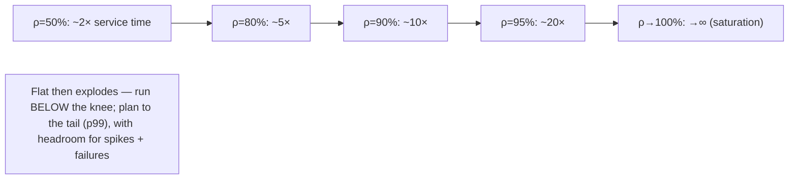
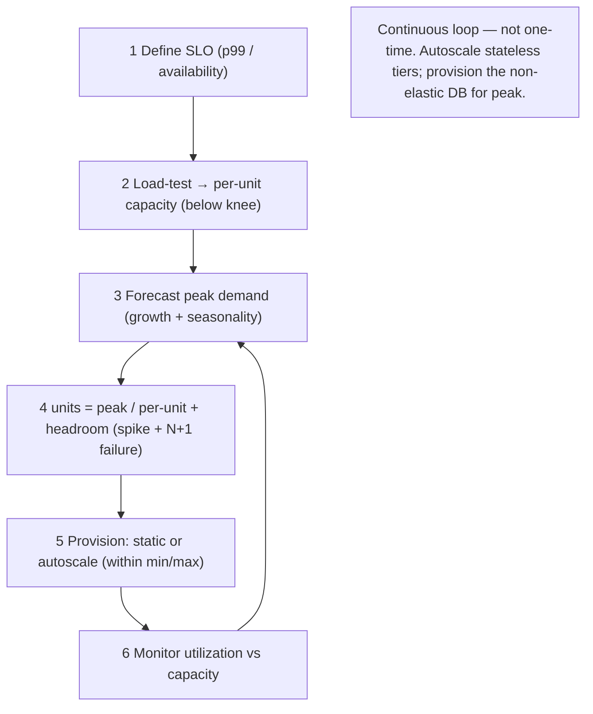

# Lesson 7.7 — Capacity Planning and Load Testing

> Part 7: Scalability · Difficulty: 🟡🔴
>
> **Prerequisites:** [1.1.4 Capacity Estimation], [1.1.3 Vocabulary of Scale], [7.6 DB Bottleneck], [7.1 Scaling], [Part 6 Caching].
> **Unlocks:** [Part 13 Autoscaling], [Part 14 SRE/Capacity], [Part 17 Performance], [Part 11 Load Shedding].

---

## 1. Learning Objectives

After this lesson you will be able to:

- Define **capacity planning** (provisioning enough resources to meet demand at a target SLO with headroom) and distinguish it from back-of-envelope **estimation** (1.1.4) — planning is **measured and ongoing**, estimation is the starting guess.
- Apply **Little's Law** (`L = λ · W`) and **utilization theory** to reason about how concurrency, throughput, and latency relate — and **why latency explodes as utilization approaches 100%** (the knee), so you must run tiers **below saturation**.
- Design and run **load tests** — **load, stress, soak, spike, and breakpoint** tests — to find a system's real capacity, its bottleneck (7.6), and its failure mode, rather than guessing.
- Build a **capacity plan**: measure per-unit capacity, forecast demand (with growth + peaks), provision to the bottleneck with **headroom**, and decide **static vs autoscaling** provisioning — feeding into SRE practice (Part 14) and autoscaling (Part 13).

---

## 2. Motivation — Hope is not a capacity plan

You can design a perfectly scalable architecture (7.1–7.6) and still fall over on launch day, because **scalability is the *ability* to scale; capacity planning is *actually having enough* right now and next quarter**. Two failure modes bracket the problem: **under-provisioning** (the system saturates under real load → latency spikes, timeouts, cascading failure, outage at the worst possible moment — a launch, a sale, a viral spike), and **over-provisioning** (paying for idle capacity — wasted money, the cost characteristic from 1.2.3). Capacity planning is the discipline of landing between them: **enough resources to meet forecast demand at your latency/availability SLO, with headroom for spikes and failures, without gross waste.**

And it can't be done by intuition or back-of-envelope alone. Estimation (1.1.4) gives you a *starting* number, but the only way to know a system's *real* capacity — how many requests per second a node actually handles before latency degrades, where the bottleneck is (7.6), and how it behaves at the edge — is to **measure it under load**. That's **load testing**: deliberately driving synthetic traffic to find the breaking point and the failure mode *before* real users do. Crucially, systems don't degrade gracefully as they fill: latency stays flat, then **explodes near saturation** (a non-linear knee governed by queueing theory) — so you must run tiers comfortably below 100% utilization, and you only know "comfortably below" by measuring. This lesson gives you the math (Little's Law, utilization/queueing), the load-testing toolkit, and the planning process that turns a scalable design into a system that actually stays up under load — the practical capstone of Part 7 and the bridge to SRE (Part 14) and autoscaling (Part 13).

---

## 3. Theory — From first principles

### 3.1 Capacity planning vs estimation

- **Capacity estimation (1.1.4):** back-of-envelope math at design time — "≈X QPS, ≈Y GB/day" — to size the *initial* design and sanity-check feasibility. A **starting guess**.
- **Capacity planning:** the **ongoing, measured** discipline of ensuring the running system has enough resources for current and forecast demand at the SLO, with headroom — and adjusting as demand grows. It uses **real measurements** (per-unit capacity from load tests + observed demand) and **forecasts** (growth, seasonality, peaks).

Estimation starts you off; planning keeps you up. Both rest on the **vocabulary of scale** (1.1.3): throughput (λ), latency (W), concurrency (L), utilization (ρ).

### 3.2 Little's Law — the fundamental relationship

**Little's Law** `[CS]`: in any stable system, the average number of requests **in the system** equals the **arrival rate** times the **average time each spends** in it:

```
L = λ · W
   L = concurrency (requests in flight)
   λ = throughput (arrival/completion rate, e.g., req/s)
   W = latency (time in system, e.g., seconds)
```

It's astonishingly general (no assumptions about distributions) and immediately useful:
- **Sizing concurrency:** to handle `λ = 10,000 req/s` with `W = 50 ms` latency, you need `L = 10,000 · 0.05 = 500` requests in flight → ~500 concurrent workers/threads/connections (sets thread-pool/connection-pool sizes — 3.3.4/5.4.2).
- **Predicting the effect of latency:** if `W` doubles (a slow dependency), `L` doubles for the same `λ` → you need 2× the concurrency, or throughput collapses. This is why **latency and capacity are linked**: slow dependencies eat concurrency.
- **Reading a bottleneck:** if `L` is capped (fixed pool size) and `W` rises, `λ` must fall — the system can't accept more (it's saturated).

Little's Law is the single most useful capacity equation; internalize it.

### 3.3 Utilization and the latency knee (why you can't run at 100%)

Systems do **not** degrade linearly as they fill. Queueing theory (e.g., the M/M/1 model) shows **latency rises non-linearly with utilization** `ρ` (the fraction of capacity in use) `[CS]`:

```
response time ∝ 1 / (1 − ρ)     (approx., single-server queue)
```

- At `ρ = 50%`, wait ≈ 2× service time. At `ρ = 80%`, ≈ 5×. At `ρ = 90%`, ≈ 10×. At `ρ = 95%`, ≈ 20×. At `ρ → 100%`, latency **→ ∞**.
- This is the **knee**: latency stays low and flat, then **explodes** as utilization approaches saturation. A system at 70% looks fine; pushed to 95% it becomes unusable — a small load increase past the knee causes a huge latency jump.
- **Implications** `[BP]`: (1) **never plan to run a tier at ~100%** — target a utilization with latency headroom (commonly ~50–70% for latency-sensitive tiers; *illustrative* — depends on variance); (2) **variance makes it worse** — bursty/variable traffic hits the knee at lower average utilization, so leave more headroom for spiky workloads; (3) **the tail goes first** — p99/p999 blow up well before the average, so plan to the **tail**, not the mean (Part 17).

This is *why* headroom isn't waste — it's the buffer that keeps you on the flat part of the curve when load spikes or a node fails.

### 3.4 Load testing — types and what each finds

You cannot know real capacity without driving load. The test types `[CONV]`:

| Test | Method | Finds |
|---|---|---|
| **Load test** | drive **expected peak** traffic | Does it meet SLO at expected load? Per-unit capacity, latency at target |
| **Stress test** | push **beyond** capacity until it breaks | The **breaking point** and the **failure mode** (graceful? cascade?) |
| **Breakpoint / capacity test** | ramp load gradually | The exact **knee** and max sustainable throughput; where the bottleneck is (7.6) |
| **Soak / endurance test** | sustained load for **hours/days** | Slow leaks (memory, connections, disk), degradation over time, GC issues |
| **Spike test** | sudden **sharp** load jump | Behavior under flash traffic; autoscaling reaction time; stampede/cold-start (6.7) |

**Goals of load testing** `[BP]`: (1) find **real per-unit capacity** (req/s per node before the knee); (2) locate the **bottleneck** (which tier saturates first — 7.6, via USE); (3) characterize the **failure mode** (does it shed load gracefully or cascade? — Part 11); (4) **validate headroom and autoscaling**; (5) catch **leaks** (soak). The point isn't a vanity "it handled X req/s" — it's to **find the limit and the failure behavior before production does**.

### 3.5 Doing load tests right

Common requirements for *valid* results `[BP]`:
- **Realistic workload mix** — replay production traffic patterns (read/write ratio, key distribution incl. **hot keys/skew** — 7.4, payload sizes, think-time). Uniform synthetic traffic hides hotspots and over-states capacity.
- **Realistic environment** — test against production-like infra (same instance types, data volume, cache state). Testing on a tiny dataset or a warm cache gives meaningless numbers.
- **Warm vs cold** — test **cold-cache** scenarios too (6.7) — capacity with a cold cache (post-deploy) is very different from steady state.
- **Measure the right things** — **percentiles (p50/p95/p99/p999), not just averages** (Part 17), plus per-tier utilization/saturation/errors (USE — 7.6) and throughput. Latency *distribution* + error rate at each load level.
- **Ramp and observe the knee** — increase load stepwise and watch where latency/errors inflect; that inflection is your sustainable capacity.
- **Isolate the test** — don't load-test production carelessly (or use careful, rate-limited production testing / a staging mirror); coordinate to avoid real-user impact.

### 3.6 The capacity-planning process

A repeatable loop `[BP]`:
1. **Define the SLO** (Part 14) — the target (e.g., p99 < 200 ms, 99.9% availability) you're planning *to*. Capacity is meaningless without the latency/availability target it must meet.
2. **Measure per-unit capacity** — load-test to find how much one node/shard handles **before the knee** at the SLO (§3.4/3.5).
3. **Forecast demand** — current load + **growth** (trend) + **seasonality/peaks** (Black Friday, daily peaks, launches) + **safety margin**. Plan to the **peak**, not the average.
4. **Compute required capacity** — `units = peak_demand / per_unit_capacity`, then **add headroom** (for spikes, the knee, and **N+1/N+2 redundancy** so you survive node/AZ failures without saturating — Part 11).
5. **Provision** — static (fixed fleet sized to peak + headroom) or **autoscaling** (§3.7).
6. **Monitor and re-plan** — track utilization vs capacity continuously; re-forecast as demand changes; capacity planning is a **continuous loop**, not a one-time event (Part 14).

### 3.7 Static provisioning vs autoscaling

Two ways to provision the planned capacity `[CONV]`:
- **Static (fixed fleet):** provision enough for **peak + headroom** at all times. Simple, predictable, no scaling lag — but **wasteful** (you pay for peak capacity during troughs) and **caps** at the provisioned size (a bigger-than-expected spike still saturates).
- **Autoscaling (elastic — Part 13):** add/remove capacity to **track demand** (scale on CPU, RPS, queue depth, or custom metrics). **Cost-efficient** (pay for what you use) and handles growth/peaks — but has **caveats**: **scaling lag** (it takes time to boot/warm new instances — a sharp **spike** can saturate before scaling catches up → keep warm headroom or pre-scale for known events); **cold-start stampedes** (new instances start with cold caches/connections — 6.7); **requires statelessness** (7.2); and the **bottleneck tier may not autoscale** (you can autoscale the app tier, but the **database** usually can't elastically — 7.6 — so autoscaling the app tier can just drive *more* load onto a fixed DB → make the DB the wall faster). Autoscaling is powerful but is **not** a substitute for capacity planning — you still plan the limits, the headroom, the bottleneck-tier capacity, and the spike strategy.

**Common practice** `[BP]`: autoscale the stateless tiers (7.2) within planned **min/max** bounds, keep **warm headroom** for spike lag, **pre-scale** for known events (sales/launches), and ensure the **non-elastic bottleneck (DB)** is provisioned for the peak the autoscaled tier will generate — plus **load shedding** (Part 11) as the backstop when even autoscaling can't keep up.

### 3.8 Headroom, redundancy, and the failure case

Headroom is not waste; it's **insurance** `[BP]`:
- **Spike headroom** — keeps you on the flat part of the latency curve (below the knee) when traffic jumps (§3.3).
- **Failure headroom (N+1 / N+2)** — you must handle **peak load with one (or more) nodes/AZs/regions down**. If 10 nodes run at 90% and one dies, the other 9 must absorb its load → instantly over 100% → cascade. Provision so that **after losing capacity, the survivors are still below the knee** — that's the real meaning of "highly available capacity" (Part 11).
- **The cascade risk** — an under-provisioned system that loses a node overloads the rest, which fail, which overload the remainder: a **capacity-driven cascade** (kin to 6.7's stampede). Headroom + load shedding (Part 11) break it.
This is why availability targets *drive* capacity: meeting 99.9% means provisioning for peak-load-during-failure, not just peak load.

---

## 4. Visual Intuition

### The latency knee (latency vs utilization)



### The capacity-planning loop



---

## 5. Real-World Analogy

Planning capacity is like planning a **highway**.

- **Estimation** is sketching "about how many cars per hour?" on a napkin before building. **Capacity planning** is the ongoing job of making sure the road actually carries rush-hour traffic next year without gridlock.
- **The latency knee:** a highway at 50% of capacity flows freely; at 95% it's not "95% as fast" — it's a **stop-and-go jam** (latency explodes). A *small* increase past the knee causes a *huge* slowdown. So you build lanes for *more* than average traffic — that spare capacity (headroom) isn't waste, it's what keeps traffic flowing on a busy day.
- **Load testing** is running a **rush-hour simulation** before opening: a normal-peak run (load test), pushing past capacity to see where it jams and whether it jams *gracefully* or *gridlocks* (stress test), and leaving it running for days to catch potholes forming (soak test).
- **Little's Law:** cars-on-the-road = arrival-rate × travel-time. If travel time doubles (an accident), twice as many cars are on the road at once for the same arrival rate — and the road clogs.
- **Static vs autoscaling:** a fixed number of lanes (static — simple but you pay for rush-hour lanes at 3am) vs **reversible/express lanes that open with demand** (autoscaling — efficient, but they take time to open, so a *sudden* surge still jams before they're ready — hence keep some open and pre-open them for the big game).
- **Failure headroom:** if one lane closes for an accident (a node dies), the others must absorb its cars without gridlock — so you don't run all lanes at 90% full, or one closure cascades into total gridlock.

---

## 6. Industry Example

- **Load-testing tools** `[CONV]`: k6, Gatling, JMeter, Locust, wrk drive synthetic load and report latency percentiles + throughput (§3.4/3.5). *(Representative.)*
- **Production/scale event readiness** `[BP]`: large sites run capacity exercises and **pre-scale** for known peaks (sales, launches, sporting events) rather than relying on reactive autoscaling alone (§3.7). *(Representative.)*
- **Little's Law for pool sizing** `[BP]`: thread-pool, connection-pool, and concurrency-limit sizing derived from `L = λ·W` (§3.2, 3.3.4/5.4.2). *(Representative.)*
- **The utilization knee** `[CS]`: queueing-theory results (M/M/1, Kingman's formula for variance) underpin the "run below ~70%" guidance; widely applied in SRE capacity work (§3.3, Part 14). *(Representative.)*
- **Autoscaling with min/max + warm pools** `[CONV]`: cloud autoscalers/K8s HPA scale stateless tiers within bounds; warm pools / pre-scaling address spike lag (§3.7, Part 13). *(Representative.)*
- **Soak tests catching leaks** `[BP]`: long-running tests routinely surface memory/connection leaks and slow degradation invisible in short runs (§3.4). *(Representative.)*

---

## 7. Implementation Details — planning and testing in practice

- **Anchor to an SLO** (Part 14) — define the p99/availability target you're planning *to*; capacity without a target is meaningless (§3.6) `[BP]`.
- **Load-test to find real per-unit capacity below the knee** — ramp load, watch percentiles + USE per tier, identify the inflection and the **bottleneck tier** (7.6) (§3.4/3.5).
- **Use realistic workloads** — production-like traffic mix, **skew/hot keys** (7.4), data volume, payloads, and **cold-cache** scenarios (6.7); uniform/warm tests lie (§3.5).
- **Apply Little's Law** to size pools/concurrency (`L = λ·W`) and to reason about the impact of latency changes on required concurrency (§3.2, 3.3.4).
- **Forecast to the peak** — growth + seasonality + launches + safety margin; plan for peak-during-failure (N+1/N+2), not average (§3.6/3.8).
- **Provision with headroom** — keep tiers below the knee (~50–70% target, more for bursty workloads) and survive node/AZ loss without saturating (§3.3/3.8).
- **Autoscale stateless tiers within min/max** + **warm headroom / pre-scaling** for spike lag; **provision the non-elastic DB for the peak** the autoscaled tier generates; add **load shedding** as the backstop (§3.7, Part 11/13).
- **Make it continuous** — monitor utilization vs capacity, re-forecast, and re-test after major changes; capacity planning is a loop, not a launch task (§3.6, Part 14).
- **Stress + soak + spike test**, not just load — know the failure mode, catch leaks, and validate spike/autoscaling behavior (§3.4).

---

## 8. Advantages (of disciplined capacity planning + load testing)

- **Stays up under real load** — meets the SLO at peak with headroom; no launch-day saturation.
- **Known limits & failure mode** — you know where it breaks and *how* (graceful vs cascade) before users find out (§3.4, Part 11).
- **Right-sized cost** — between under- and over-provisioning; pays for needed capacity, not idle peak (1.2.3).
- **Bottleneck clarity** — load tests reveal the binding tier (7.6) so effort goes to the right place.
- **Failure resilience** — N+1/N+2 headroom survives node/AZ loss without cascade (§3.8, Part 11).
- **Foundation for autoscaling & SRE** — measured capacity feeds autoscaling bounds (Part 13) and error-budget/capacity practice (Part 14).

---

## 9. Disadvantages / costs

- **Effort & realism are hard** — valid load tests (realistic workload, environment, skew, cold cache) take significant work; bad tests give false confidence (§3.5).
- **Forecasting is uncertain** — demand surprises (virality, events) can exceed plans; hence headroom + shedding (§3.8).
- **Headroom costs money** — running below the knee and N+1 redundancy means paying for unused capacity (the insurance premium) (§3.3/3.8).
- **Autoscaling caveats** — scaling lag, cold starts, statelessness requirement, and the non-elastic bottleneck (DB) (§3.7).
- **Ongoing burden** — it's continuous (monitor, re-forecast, re-test), not one-and-done (§3.6).
- **Test-induced risk** — careless production load tests can cause real outages (§3.5).

---

## 10. When NOT to / limits

- **Don't run latency-sensitive tiers near 100% utilization** — the knee makes that an outage waiting for a spike (§3.3).
- **Don't trust unrealistic load tests** — uniform traffic / tiny data / warm-only caches over-state capacity dangerously (§3.5).
- **Don't plan to the average** — plan to the **peak** and to **peak-during-failure** (§3.6/3.8).
- **Don't treat autoscaling as a plan** — it's a mechanism; you still plan limits, headroom, the bottleneck tier, and spikes (§3.7).
- **Don't autoscale the app tier into a fixed DB** without provisioning the DB for the resulting peak — you just hit the DB wall faster (§3.7, 7.6).
- **Don't skip stress/soak/spike** — load-only testing misses failure mode, leaks, and spike behavior (§3.4).

---

## 11. Common Mistakes

1. **Planning to the average, not the peak (or peak-during-failure)** — saturates on the busy day or when a node dies (§3.6/3.8).
2. **Running at high utilization** ("90% is efficient!") — the knee turns a small spike into an outage (§3.3).
3. **Unrealistic load tests** — uniform traffic hides hotspots (7.4); warm cache hides cold-start capacity (6.7); tiny dataset inflates numbers (§3.5).
4. **Averages instead of percentiles** — looks fine while p99 is already failing (§3.5, Part 17).
5. **No failure headroom** — losing one node overloads the rest → cascade (§3.8, Part 11).
6. **Autoscaling as a substitute for planning** — ignoring scaling lag, cold starts, and the non-elastic DB (§3.7).
7. **One-time planning** — never re-forecasting as demand grows; capacity silently erodes (§3.6).
8. **No load shedding backstop** — when demand exceeds even autoscaled capacity, nothing protects the system (§3.7, Part 11).

---

## 12. Interview Questions

**🟢 Easy**
- What's the difference between capacity estimation and capacity planning?
- State Little's Law and give one use (e.g., sizing a thread/connection pool).

**🟡 Medium**
- Why can't you run a latency-sensitive service at 95% utilization? Explain the latency knee.
- Name the load-test types (load/stress/soak/spike/breakpoint) and what each one finds.

**🔴 Hard**
- How do you find a system's real capacity and bottleneck with load testing, and what makes a load test *valid* vs misleading?
- Why is headroom (and N+1 redundancy) not waste? Show how under-provisioning causes a cascade when a node fails.
- Compare static provisioning vs autoscaling. What are autoscaling's caveats, and why isn't it a substitute for capacity planning?

**⚫ Staff+**
- Build an end-to-end capacity plan for a service with a daily peak, seasonal spikes, and a p99 SLO: define the SLO, load-test for per-unit capacity, forecast, compute units with spike + failure headroom, choose provisioning (autoscale bounds + warm pool + pre-scaling), provision the non-elastic DB, and add shedding — justifying each number.
- A launch caused an outage despite autoscaling. Diagnose the likely causes (scaling lag vs spike, cold-cache stampede, the DB as the non-elastic bottleneck, no failure headroom, ran past the knee) and design the fixes and the load-test plan that would have caught it.

---

## 13. Production Pitfalls

- **Launch/sale saturation:** planned to average, real peak (or virality) blew past capacity; latency exploded past the knee → outage at the worst moment (§3.3/3.6).
- **Node-loss cascade:** all nodes at ~90%; one fails, survivors instantly exceed 100% and fail in turn → full outage (no failure headroom) (§3.8, Part 11).
- **Autoscaling too slow for a spike:** a sharp surge saturated the system before new instances booted/warmed; no warm headroom or pre-scaling (§3.7).
- **Cold-start stampede under spike:** autoscaled instances came up with cold caches and stampeded the DB (6.7) — capacity looked fine in warm steady-state tests (§3.5).
- **App autoscaled into a fixed DB:** the stateless tier scaled, drove more load onto the un-scaled DB, and the DB became the wall faster (§3.7, 7.6).
- **Misleading load test:** uniform synthetic traffic showed huge capacity; production hot keys (7.4) and cold caches made real capacity a fraction of the test number (§3.5).
- **Soak-test miss:** a memory/connection leak invisible in short tests took the fleet down after hours in production (§3.4).

---

## 14. Optimization Techniques

- **Plan to SLO + peak + failure** — define the target, plan to peak-during-failure, not the average (§3.6/3.8) `[BP]`.
- **Run below the knee** — target ~50–70% utilization (more headroom for bursty workloads); plan to the tail (p99/p999), not the mean (§3.3, Part 17).
- **Little's Law for sizing** — derive concurrency/pool sizes from `L = λ·W`; reason about latency's effect on required concurrency (§3.2).
- **Realistic, multi-type load tests** — production-like workload + skew + cold cache; load + stress + soak + spike + breakpoint (§3.4/3.5).
- **N+1/N+2 failure headroom** — survivors stay below the knee after losing a node/AZ (§3.8, Part 11).
- **Autoscale stateless tiers + warm pools + pre-scale known events**, and **provision the non-elastic DB for peak**; add **load shedding** as the backstop (§3.7, Part 13/11).
- **Continuous monitoring + re-forecasting** — track utilization vs capacity, re-test after changes (§3.6, Part 14).

---

## 15. Summary

Scalability is the *ability* to scale; **capacity planning** is *having enough now and next quarter* — provisioning resources to meet **forecast peak demand at the SLO with headroom**, avoiding both **under-provisioning** (saturation → cascade → outage) and **over-provisioning** (wasted cost). It builds on but goes beyond back-of-envelope **estimation** (1.1.4): planning is **measured and continuous**. The core math is **Little's Law** (`L = λ·W` — concurrency = throughput × latency), which sizes pools/concurrency and shows that **rising latency consumes concurrency**; and **utilization theory**, which shows latency rises **non-linearly** with utilization (`∝ 1/(1−ρ)`) — flat, then a **knee** where it explodes near saturation — so you must run tiers **below the knee** (commonly ~50–70%, more for bursty traffic) and plan to the **tail (p99)**, not the average. You discover **real** capacity, the **bottleneck** (7.6), and the **failure mode** only by **load testing**: **load** (meets SLO at peak?), **stress** (breaking point + graceful vs cascade), **breakpoint** (the knee / max throughput), **soak** (leaks over time), and **spike** (flash traffic + autoscaling reaction) — and tests are only valid with **realistic workload (incl. skew/hot keys — 7.4), realistic environment/data, cold-cache scenarios (6.7), and percentile metrics**. The planning loop: **define SLO → load-test per-unit capacity below the knee → forecast peak (growth + seasonality) → compute units + headroom (spike + N+1/N+2 failure) → provision (static or autoscale) → monitor and re-plan.** **Headroom is insurance, not waste** — it keeps you below the knee during spikes and lets survivors absorb a failed node without a **capacity cascade** (Part 11). Provisioning is **static** (simple, wasteful, capped) or **autoscaling** (elastic, cost-efficient — but with scaling lag, cold starts, a statelessness requirement, and the crucial caveat that the **non-elastic database** (7.6) can't autoscale, so you must provision it for the peak the autoscaled tier generates, with **load shedding** as the backstop). Autoscaling is a mechanism, **not** a substitute for planning. Done right, capacity planning turns the scalable design of Part 7 into a system that actually stays up under load — and hands off directly to autoscaling (Part 13) and SRE error-budget/capacity practice (Part 14).

---

## 16. Revision Notes (flashcard-ready)

- **Q:** Capacity planning vs estimation? **A:** Estimation = back-of-envelope starting guess (1.1.4); planning = ongoing, measured provisioning to meet forecast peak at SLO with headroom.
- **Q:** Little's Law? **A:** `L = λ·W` (concurrency = throughput × latency); sizes pools and shows latency eats concurrency.
- **Q:** Why not run at ~100% utilization? **A:** Latency ∝ 1/(1−ρ) — flat then explodes at the knee; small load increase past it → huge latency jump.
- **Q:** Target utilization? **A:** Below the knee (~50–70%, more for bursty); plan to the tail (p99), not the average.
- **Q:** Load-test types? **A:** Load (SLO at peak), stress (breaking point/failure mode), breakpoint (knee/max), soak (leaks), spike (flash + autoscale reaction).
- **Q:** What makes a load test valid? **A:** Realistic workload (incl. skew/hot keys), realistic env/data, cold-cache scenarios, percentile metrics — not uniform/warm/averages.
- **Q:** Planning loop? **A:** SLO → per-unit capacity (load test) → forecast peak → units + headroom (spike + N+1) → provision → monitor/re-plan.
- **Q:** Why is headroom not waste? **A:** Keeps you below the knee on spikes and lets survivors absorb a failed node without cascade (insurance).
- **Q:** Static vs autoscaling? **A:** Static = simple/wasteful/capped; autoscaling = elastic/cost-efficient but scaling lag, cold starts, needs statelessness, and DB doesn't autoscale.
- **Q:** Biggest autoscaling caveat? **A:** The non-elastic DB (7.6) — autoscaling the app tier drives more load onto a fixed DB; provision DB for peak + load-shed backstop.

---

## 17. Further Reading + Knowledge-Graph Links

**Within this platform**
- **Previous:** [7.6 DB Bottleneck] (find the bottleneck to plan around). **Builds on:** [1.1.4 Capacity Estimation], [1.1.3 Vocabulary of Scale], [3.3.4 Concurrency/Pools], [Part 6 Caching] (cold-cache capacity).
- **Closes:** Part 7 (then the Part 7 README). **Next:** [Part 8 Distributed Systems Core].
- **Enables:** [Part 13 Autoscaling] (provisioning mechanism), [Part 14 SRE] (SLOs, error budgets, continuous capacity), [Part 17 Performance] (USE/RED, percentiles, the knee), [Part 11 Load Shedding] (the backstop).

**Foundational texts (synthesized)**
- Gunther, *Guerrilla Capacity Planning* — capacity modeling, USL (concept, synthesized).
- Gregg, *Systems Performance* — USE method, utilization/saturation (concept, synthesized).
- Beyer et al., *Site Reliability Engineering* — capacity planning, demand forecasting (concept, synthesized).
- Little's Law and queueing theory (M/M/1, Kingman) — concepts, synthesized.

**Concept tags:** `[CS]` Little's Law, utilization knee (1/(1−ρ)), queueing-theory latency-vs-utilization · `[CONV]` load/stress/soak/spike tests, static vs autoscaling, warm pools/pre-scaling · `[BP]` plan to SLO+peak+failure, run below the knee, realistic tests + percentiles, N+1 headroom, provision the non-elastic DB, load-shedding backstop · `[OPINION]` headroom-as-insurance.
