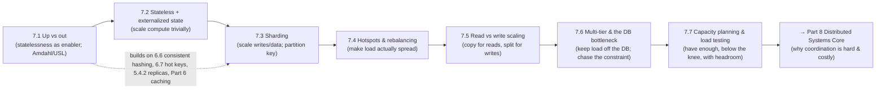

# Part 7 — Scalability ✅ COMPLETE

Growing throughput and data without falling over — unified by one idea: **scale by removing coordination and concentrating it where it's unavoidable; statelessness lets compute scale trivially, replication scales reads cheaply, and partitioning scales writes at a cost — and the database is where the load (and the difficulty) always pools.**

---

## Lessons

| # | Lesson | Core idea |
|---|--------|-----------|
| 7.1 | [Vertical vs Horizontal Scaling](7.1-vertical-vs-horizontal-scaling.md) | Up = simple/ceiling/SPOF; out = no ceiling/HA/elastic but needs LB + statelessness + a data story; **statelessness is the enabler**; Amdahl/USL → minimize serial + coordination |
| 7.2 | [Stateless Services + Externalized State](7.2-stateless-services-externalized-state.md) | No client state in-process → interchangeable/disposable nodes; sessions via sticky (anti-pattern) / JWT / shared store; **relocate** state (don't remove it); legitimately-stateful systems partition by key |
| 7.3 | [Sharding/Partitioning Strategies](7.3-sharding-partitioning-strategies.md) | Partition (split) ≠ replicate (copy); range / hash / **consistent-hashing+vnodes** / directory; the **partition key** is the decision (hotspots, query locality, txn co-location, re-shard pain) |
| 7.4 | [Hotspots, Skew & Rebalancing](7.4-hotspots-skew-rebalancing.md) | Data skew ≠ load skew; append/celebrity/low-cardinality hotspots; salt / cache / replicate / split / isolate; rebalance moving little data (**never `mod N`**); avoid rebalance-storm cascades |
| 7.5 | [Read vs Write Scaling](7.5-read-scaling-write-scaling.md) | Reads scale by copying (cache+replicas — cheap, lag/staleness); writes scale by splitting (sharding — hard); combine (shard+replicate); CQRS; **diagnose read- vs write-bound** |
| 7.6 | [Multi-Tier Scaling & the DB Bottleneck](7.6-multitier-scaling-database-bottleneck.md) | Difficulty increases inward; the **stateful DB is the perennial bottleneck**; one binding constraint at a time; cost-ordered relief: cache→replicas→**pooler**→async **queue**→batch→vertical→shard |
| 7.7 | [Capacity Planning & Load Testing](7.7-capacity-planning-load-testing.md) | Little's Law (`L=λ·W`); latency **knee** (`1/(1−ρ)`) → run below saturation; load/stress/soak/spike tests; plan to peak + **N+1 failure headroom**; static vs autoscaling (and the non-elastic DB) |

---

## The through-line of Part 7

**One sentence:** Scale out (not just up) by making the compute tier **stateless** so nodes are interchangeable (7.1/7.2); scale **writes/data** by **partitioning** with a well-chosen key (7.3) and keep the load actually **even** by handling **skew/hotspots** and **rebalancing** safely (7.4); scale **reads** cheaply by **copying** (cache + replicas) while reserving **splitting** for writes (7.5); recognize that load and difficulty pool at the **stateful database**, so chase the one binding constraint and relieve the DB **cheapest-first** (cache → replicas → pooler → async queue → shard) (7.6); and **plan capacity** from measured per-unit limits, running **below the latency knee** with **failure headroom** (7.7).

---

## The key decisions Part 7 equips you to make

- **Scale up or out?** Up to a price/performance sweet spot, then out — but out requires statelessness + LB + a data story. (7.1)
- **How to make the tier stateless?** Externalize sessions (JWT + shared store), blobs to object storage, treat local caches as losable. (7.2)
- **How to partition?** Range (ordered queries) / hash / consistent-hashing+vnodes (elastic) / directory (flexible); choose the partition key for access pattern + spread + co-location. (7.3)
- **How to keep load even?** Salt append keys, cache/replicate/split/isolate hot keys, rebalance moving little data — never `mod N`, never cascade. (7.4)
- **Reads or writes?** Diagnose the bound: cache+replicas for reads, shard for writes, both (+CQRS) at scale. (7.5)
- **Where's the bottleneck?** Measure per-tier (USE); it's usually the DB — relieve it cost-first; expect it to relocate. (7.6)
- **Do we have enough?** Load-test per-unit capacity below the knee; plan to peak + N+1 headroom; autoscale stateless tiers but provision the non-elastic DB. (7.7)

---

## Self-check before Part 8

Without notes, can you:
1. Contrast vertical and horizontal scaling and explain why statelessness is the enabler (and what Amdahl/USL say about limits)?
2. Define a stateless service, list what to externalize and where, and compare sticky/JWT/shared-store sessions?
3. Compare range/hash/consistent-hashing/directory partitioning and explain why the partition key is the most consequential choice?
4. Distinguish data skew from load skew, mitigate each hotspot pattern, and rebalance safely (and say why `mod N` is forbidden)?
5. Explain why reads scale by copying and writes by splitting, handle replication-lag anomalies, and diagnose read- vs write-bound?
6. Sketch the multi-tier architecture, explain why the DB is the perennial bottleneck, and give the cost-ordered relief ladder?
7. Use Little's Law and the utilization knee, run the right load tests, and build a capacity plan with peak + failure headroom (static vs autoscaling)?

If any are shaky, revisit that lesson's Revision Notes. Part 8 (Distributed Systems Core) explains the *theory* beneath everything here — why coordination is expensive (the USL's coherency term made rigorous), why "is it dead?" is undecidable, and how consensus, clocks, and quorums make distributed systems correct.

---

*Reference asset for this part: `../../reference/scalability-and-partitioning-cheatsheet.md`.*
