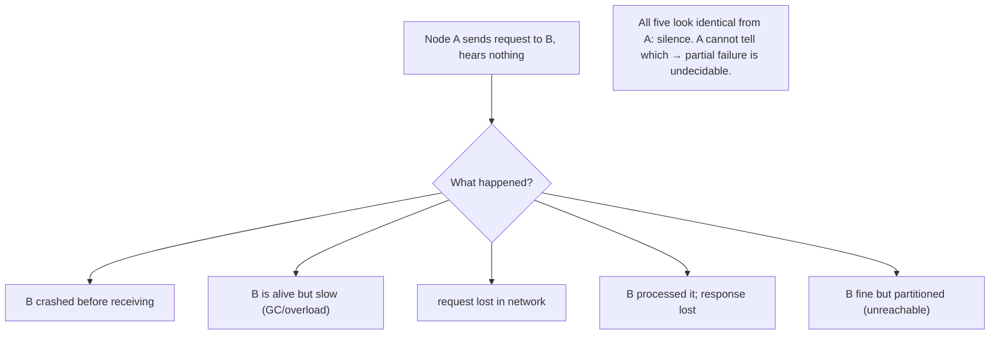
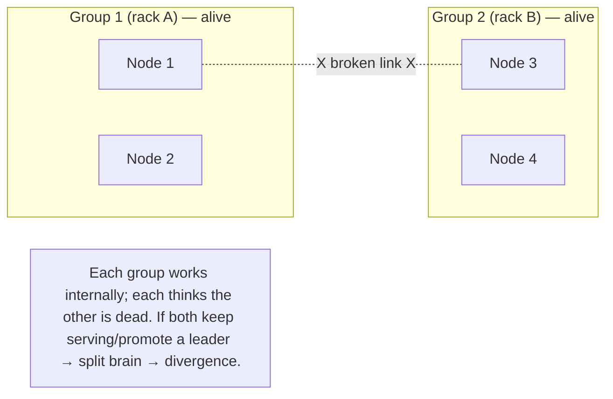

# Lesson 8.1.1 — Unreliable Networks, Partitions, and Partial Failure

> Part 8: Distributed Systems Core · Module 8.1: Fundamental Difficulties · Difficulty: 🔴
>
> **Prerequisites:** [3.1.3 TCP], [7.1 Scaling/USL], [1.2.1 Availability/Reliability], [5.4.2 Failover].
> **Unlocks:** [8.1.2 Unreliable Clocks], [8.1.3 Timeouts & Failure Detection], [8.3 Consensus], [Part 10 CAP], [Part 11 Resilience].

---

## 1. Learning Objectives

After this lesson you will be able to:

- Explain why a **distributed system** differs *in kind*, not just degree, from a single machine — and state the defining new problem: **partial failure** (some parts fail while others keep running, and you can't tell which).
- Enumerate the ways an **asynchronous packet network is unreliable** (loss, delay, reorder, duplicate, partition) and why **you cannot distinguish a crashed node from a slow node or a broken network** from the outside.
- Define a **network partition (split brain)** and reason about its consequences for correctness and availability (the seed of CAP — Part 10).
- Recite and apply the **Fallacies of Distributed Computing** as a checklist against the assumptions that make distributed systems fail.

---

## 2. Motivation — The moment you add a second machine, everything changes

Up to now, much of this platform could assume a forgiving substrate: within one machine, a function call either returns or the whole process crashes; memory reads succeed; components share a clock and fail together. **Distributed systems break all of that.** The instant your system spans **more than one machine connected by a network** — which is *every* scaled system (Part 7), every microservice deployment (Part 12), every replicated database (Part 10) — you inherit a set of difficulties that have **no analog on a single machine**, and that are the root cause of nearly every hard problem in the rest of this platform.

The deepest of these is **partial failure**: in a distributed system, *some* components can fail while others keep running, and — crucially — **a healthy component cannot reliably tell whether another component has failed, is merely slow, or is perfectly fine but unreachable due to a network problem.** On one machine, failure is total and observable (the process is up or down). Across a network, failure is *partial* and *ambiguous*: you send a request and hear nothing back, and that silence is indistinguishable between "the node crashed," "the node is processing slowly," "your request was lost," "the response was lost," and "the network between you is cut." This ambiguity — you genuinely **cannot know** — is what makes distributed systems hard, and it propagates into timeouts (8.1.3), clocks (8.1.2), consensus (8.3), consistency (Part 10), and resilience (Part 11). This lesson establishes the unreliable-network foundation and the partial-failure problem that the entire rest of Part 8 (and much of the platform) exists to manage.

---

## 3. Theory — From first principles

### 3.1 What makes a system "distributed" — and why it's different in kind

A **distributed system** is a collection of independent computers (nodes) that communicate **only by passing messages over a network**, with **no shared memory and no shared clock**, that appears to its users as a single coherent system `[CS]`. The defining constraints:
- **No shared memory** — nodes can't read each other's state directly; they exchange messages, which take time and can be lost.
- **No shared clock** — each node has its own clock, and they disagree (8.1.2).
- **Independent failure** — any node (or network link) can fail **independently** of the others — the source of **partial failure**.

This is **different in kind** from a single multi-core machine (which has shared memory, a shared clock, and fails as a unit): the new difficulties — message loss/delay, clock disagreement, and especially partial failure — are *intrinsic* to message-passing over an unreliable network and cannot be engineered away, only managed.

### 3.2 Partial failure — the central difficulty

On one machine, failure is **total and known**: the program runs correctly, or the process crashes and stops. In a distributed system, failure is **partial and ambiguous** `[CS]`:
- **Partial:** node A is fine, node B has crashed, the link to C is congested, D is fine but isolated — all at once. The system is in a *mixture* of working and failed states.
- **Ambiguous (the killer):** when A sends B a request and gets no reply, A **cannot determine** which of these happened:
  1. B crashed before receiving the request.
  2. B is alive but **slow** (GC pause, overload, long computation).
  3. The **request was lost** in the network.
  4. B processed it fine but the **response was lost**.
  5. B is fine but **unreachable** (a partition between A and B).
  From A's vantage point, **all five look identical: silence.** There is no message "B has crashed" — crashes are silent. This **undecidability of failure** (formalized in 8.1.3) is the root of why distributed systems are hard: you must act despite genuinely not knowing the state of the rest of the system.

### 3.3 The asynchronous packet network is unreliable

Distributed systems run mostly over **asynchronous packet-switched networks** (IP — 3.1.x), which provide **no delivery or timing guarantees** `[CS]`. A sent message may be:
- **Lost** (dropped by a congested router, a flaky link, a full buffer).
- **Delayed** arbitrarily (queued behind other traffic, slow path) — and there's **no upper bound** on delay in an asynchronous network.
- **Reordered** (packets take different paths; later-sent arrives first).
- **Duplicated** (retransmissions, retries → the same message delivered twice).
- **Corrupted** (bit errors — usually caught by checksums and dropped → looks like loss).

TCP (3.1.3) masks *some* of this within a connection (retransmits lost segments, reorders, dedups) — but TCP **cannot** fix a partition, an arbitrary delay, or a crashed peer; it just turns some failures into *delays* and eventually a *connection error* (which is itself ambiguous — §3.2). At the **application/distributed-systems level**, you must assume the network can do all of the above. The reliable single-machine function call is an illusion the network does not provide.

### 3.4 Network partitions (split brain)

A **network partition** is when the network fails such that nodes are split into **groups that can't communicate with each other**, though nodes *within* each group still can `[CS]`. (E.g., a switch fails and data-center rack A can't reach rack B, but each rack works internally.) Partitions are the most consequential network failure because:
- **Both sides are alive and think the other is dead.** Each group sees the other as "not responding" (§3.2) and may conclude the other has failed.
- **Split brain:** if both sides keep operating independently — e.g., both promote a leader, both accept writes — they **diverge**, producing conflicting state that's hard or impossible to reconcile (5.4.2 failover split-brain; Part 10). Two "primary" databases both accepting writes is the classic disaster.
- **You must choose** (CAP — Part 10): during a partition, a system can stay **available** (each side keeps serving, risking divergence/inconsistency) or stay **consistent** (one or both sides stop serving to avoid divergence) — but **not both**. This forced choice is the heart of the CAP theorem, and partitions are *why* it exists. (Detailed in Part 10.)

Partitions aren't exotic: they happen from switch/router failures, misconfigurations, congestion so severe it looks like disconnection, and slow links that effectively partition under timeout. **You must design for them**, not hope they don't occur.

### 3.5 Why "just retry / just use TCP / just add redundancy" isn't enough

Naive fixes each fall short `[BP]`:
- **Retries** help with *loss* but create **duplicates** (the response may have been lost *after* B processed the request → retry double-executes) → you need **idempotency** (8.4.1, Part 11). And retries during overload cause **retry storms** (a thundering herd — 6.7, Part 11).
- **TCP** masks loss/reorder within a connection but turns partitions/crashes into ambiguous delays/errors (§3.3); it doesn't solve partial failure.
- **Redundancy/failover** improves availability but introduces the **split-brain** risk (§3.4) and the **"is the primary actually dead?"** question (8.1.3) — failover triggered by a *slow* (not dead) primary can create two primaries.
The real tools — timeouts + failure detectors (8.1.3), consensus (8.3), quorums (8.3.4), fencing tokens (8.3.6), idempotency (8.4.1), and consistency models (Part 10) — all exist precisely because these naive fixes are insufficient against partial failure and partitions.

### 3.6 The Fallacies of Distributed Computing

A famous checklist (Deutsch/Gosling, Sun) of **false assumptions** engineers carry from single-machine thinking `[CS]`:
1. **The network is reliable.** (It loses/delays/reorders/partitions — §3.3/3.4.)
2. **Latency is zero.** (Remote calls cost ms–seconds; far more than local — 1.1.3, 4.1.1.)
3. **Bandwidth is infinite.** (It's finite and shared; large payloads/chatty calls saturate it.)
4. **The network is secure.** (It's hostile; assume eavesdropping/tampering — Part 15.)
5. **Topology doesn't change.** (Nodes/links come and go; addresses change — 7.4 rebalancing.)
6. **There is one administrator.** (Many parties, configs, versions — coordination problem.)
7. **Transport cost is zero.** (Serialization, marshalling, and bandwidth cost real time/money — 3.2.6.)
8. **The network is homogeneous.** (Mixed hardware, protocols, speeds, MTUs.)

Each fallacy is a place real systems break when single-machine intuition leaks in. **Treat them as a design review checklist**: every remote interaction should be examined against all eight. The rest of Part 8 is, in a sense, the toolkit for living correctly in a world where all eight fallacies are *false*.

---

## 4. Visual Intuition

### The ambiguity of silence

### A network partition / split brain

---

## 5. Real-World Analogy

Imagine coordinating with a colleague **only by sending letters through an unreliable postal service** — no phone, no email, no way to see them.

- You mail a request: "Please ship the order." Days pass with **no reply**. What happened? Your colleague might be **out sick** (crashed), **swamped and slow** to reply, your **letter got lost**, their **reply got lost**, or the **postal route between you is cut** (partition). From your desk, **all of these look exactly the same: silence.** You cannot tell — and you must still decide whether to ship the order yourself (risking a duplicate) or wait (risking it never ships). That is **partial failure**.
- If you **resend** the letter to be safe (retry), your colleague might receive *both* and ship the order **twice** (duplicate) — so you'd need an order number they can check ("did I already ship #1234?" — idempotency).
- A **partition** is like a flood washing out the road between your two offices: your team keeps working, their team keeps working, and **each assumes the other has shut down**. If you *both* decide "they're gone, I'll take over and ship everything," customers get **double shipments** (split brain). The only safe options are for one side to **stop** (stay consistent) or to accept that you might **conflict** and reconcile later (stay available) — you can't have both during the flood.
- The **fallacies** are the rookie assumptions: "the mail always arrives" (it doesn't), "replies come instantly" (they don't), "we both follow the same procedures" (you may not).

---

## 6. Industry Example

- **Partition / split-brain incidents** `[CONV]`: numerous documented outages trace to network partitions causing dual-primary databases, divergent state, or failover storms — the reason mature systems use quorums/fencing (8.3) and explicit partition handling (Part 10). *(Representative.)*
- **TCP can't save you** `[CS]`: systems relying on "the connection will tell us" discover that a partition or a peer crash surfaces only as a long timeout then an ambiguous reset (3.1.3, §3.3).
- **Gray failures / slow nodes** `[EMERGING]`: a node that's *slow* (not dead) — degraded disk, GC pauses, partial overload — is often *worse* than a crashed one, because health checks pass intermittently while it poisons latency; failure detectors must handle "slow vs dead" (8.1.3, 7.4). *(Representative.)*
- **The Fallacies in practice** `[CONV]`: chatty microservice calls (latency/bandwidth fallacies), hardcoded IPs (topology fallacy), and unencrypted internal traffic (security fallacy) are recurring real-world failures (Part 12/15). *(Representative.)*
- **Chaos engineering** `[BP]`: deliberately injecting network partitions, latency, and node loss (Netflix Chaos Monkey lineage) to verify systems survive partial failure (Part 14). *(Representative.)*

---

## 7. Implementation Details — designing for an unreliable network

- **Assume every remote call can fail, be slow, be lost, or be duplicated** — never treat a network call like a local function (the fallacies, §3.6) `[BP]`.
- **Make operations idempotent** (8.4.1, Part 11) so retries (which you *will* need for loss) don't double-execute — the essential companion to retries (§3.5).
- **Set explicit timeouts + bounded, jittered retries** (8.1.3, Part 11) — never wait forever on silence; never retry in lockstep (retry storms — 6.7).
- **Plan for partitions explicitly** (§3.4, Part 10): decide your **CAP stance per operation** (stay available and reconcile, or stay consistent and refuse), and prevent split brain with **quorums/fencing** (8.3.4/8.3.6).
- **Avoid dual-active without coordination** — failover must be **fenced** (a deposed primary can't keep writing) and ideally **quorum-gated** so a slow (not dead) primary doesn't create two primaries (5.4.2, 8.3.6).
- **Design failure detection for "slow vs dead"** (8.1.3, 7.4) — don't let a slow node be treated as dead (cascading rebalance) or a dead node as alive (lost work).
- **Minimize chatty/large remote calls** (latency/bandwidth fallacies) — batch, coalesce, and keep payloads lean (3.2.6, 6.3).
- **Test with fault injection** — partitions, latency, loss, node kills (chaos engineering, Part 14) — partial failure must be *exercised*, not assumed handled.

---

## 8. Advantages

> *Distributed systems aren't an "advantage" to be chosen lightly — they're a necessity for scale (7.1) and availability (1.2.1). But facing their realities head-on yields:*

- **Scalability beyond one machine** — the whole point (7.1); requires accepting network unreliability.
- **Fault tolerance / availability** — redundancy across independent failure domains *can* survive partial failure (Part 11) — *if* you handle the ambiguity correctly.
- **Geographic distribution** — serve users globally, survive regional outages (Part 13) — at the cost of partitions and latency.
- **Correct-by-design resilience** — systems that explicitly model partial failure (timeouts, idempotency, quorums) are robust; the difficulty, faced squarely, produces better systems.

---

## 9. Disadvantages / hard realities

- **Partial failure is undecidable** — you can't reliably know another node's state; every interaction must tolerate ambiguity (§3.2).
- **The network is unreliable** — loss, unbounded delay, reorder, duplication, partition (§3.3/3.4).
- **Partitions force a CAP choice** — availability vs consistency during a split; no free lunch (Part 10).
- **Split-brain risk** — naive redundancy/failover can diverge (§3.4).
- **Everything is harder** — debugging, testing, reasoning; emergent behavior; the fallacies trap single-machine intuition (§3.6).
- **Coordination is costly** — the USL's coherency term (7.1) is exactly the price of fighting these realities (8.3).

---

## 10. When NOT to go distributed / limits

- **When a single machine suffices** — if vertical scaling + replicas meet the requirement (7.1), a single-node (or single-primary) system avoids *all* of this complexity; don't distribute for fashion (1.1.5).
- **When you can't tolerate the consistency cost** — some problems are far simpler with one authoritative node (a single-writer DB) than with distributed consensus; centralize the hard part if you can.
- **Don't fake "exactly-once" over an unreliable network** — it's impossible in general (8.4.1); design for at-least-once + idempotency instead (§3.5, Part 11).
- **Don't ignore partitions** ("they won't happen to us") — they will; an unhandled partition is a future split-brain outage (§3.4).

---

## 11. Common Mistakes

1. **Treating remote calls like local calls** — assuming success, ignoring latency/loss/duplication (the fallacies, §3.6).
2. **Interpreting silence as "crashed"** — acting on a timeout as if the node is dead when it may be slow/partitioned → e.g., promoting a second primary (§3.2/3.4).
3. **Retries without idempotency** — double-executing on a lost *response* (§3.5, 8.4.1).
4. **Retry storms** — synchronized, unbounded retries amplifying an outage (§3.5, 6.7).
5. **Dual-active failover without fencing/quorum** — split brain, divergent writes (§3.4, 8.3.6).
6. **Ignoring partitions** — no CAP stance; undefined behavior during a split (§3.4, Part 10).
7. **Trusting TCP to handle distributed failure** — it masks some loss but not partitions/crashes (§3.3).
8. **Chatty/oversized remote calls** — latency/bandwidth fallacies tanking performance (§3.6, 3.2.6).

---

## 12. Interview Questions

**🟢 Easy**
- What is partial failure, and why doesn't it exist on a single machine?
- Name three ways a packet network is unreliable.

**🟡 Medium**
- Why can't node A tell whether node B has crashed, is slow, or is partitioned? List the indistinguishable cases.
- What is a network partition / split brain, and why is it dangerous?

**🔴 Hard**
- A primary database stops responding. You promote a replica to primary — then the old primary comes back. What can go wrong, and how do you prevent it? (Fencing/quorum, §3.4, 8.3.6.)
- Walk through the Fallacies of Distributed Computing and give a concrete failure each one causes.
- Why isn't "just retry" a complete solution to network loss? What does it require and what new problem does it create?

**⚫ Staff+**
- Design the failure-handling strategy for a service that makes critical cross-service calls over an unreliable network: timeouts, retries, idempotency, partition behavior, and how you avoid both lost work and double execution. Justify each against partial-failure ambiguity.
- Explain why partitions force the CAP choice (Part 10) from first principles (partial-failure ambiguity + split-brain). For a payments system vs a social feed, which side of CAP would you choose during a partition and why?

---

## 13. Production Pitfalls

- **Dual-primary split brain:** a partition (or a slow primary mistaken for dead) leads to two primaries accepting writes; on heal, conflicting/lost data — a severe, sometimes unrecoverable incident (§3.4, 5.4.2).
- **Slow node poisons the system:** a degraded (not dead) node passes health checks intermittently while adding huge latency; requests routed to it spike p99 fleet-wide (gray failure, §3.2, 8.1.3, 7.4).
- **Double execution from retried writes:** a lost *response* triggers a retry that re-charges a card / re-ships an order (no idempotency) (§3.5, 8.4.1).
- **Retry storm:** a brief blip triggers synchronized retries that overwhelm the recovering service, turning a blip into an outage (§3.5, 6.7).
- **Unhandled partition:** the system has no defined behavior during a split; some writes vanish, some conflict, monitoring lies (§3.4, Part 10).
- **"It worked in test":** tests ran on one machine / one network with no faults; partial failure only appears in production (§7, chaos testing).

---

## 14. Optimization Techniques

> *Here "optimization" = making the system *correct and robust* under partial failure, not faster.*

- **Idempotency + bounded jittered retries** — safe handling of loss/duplication (§3.5, 8.4.1, Part 11).
- **Timeouts + good failure detection (slow vs dead)** — act on silence without mistaking slow for dead (8.1.3, 7.4).
- **Quorums + fencing tokens** — prevent split brain; ensure a deposed leader can't keep acting (8.3.4/8.3.6).
- **Explicit CAP/PACELC stance per operation** — decide availability vs consistency during partitions deliberately (Part 10).
- **Circuit breakers + load shedding + backpressure** — stop hammering failing/slow peers; degrade gracefully (Part 11, 3.3.4, 6.7).
- **Minimize/co-locate coordination** — fewer, leaner remote interactions (latency/bandwidth fallacies; USL — 7.1).
- **Chaos/fault-injection testing** — partitions, latency, loss, kills — verify resilience before production (Part 14).

---

## 15. Summary

A **distributed system** — independent nodes communicating only by messages over a network, with **no shared memory or clock** and **independent failures** — is **different in kind** from a single machine. Its defining new difficulty is **partial failure**: some components fail while others run, and a healthy node **cannot reliably tell** whether another has **crashed**, is merely **slow**, had its **request or response lost**, or is **partitioned** (unreachable) — because all of these present identically as **silence**. This **undecidability of failure** (formalized in 8.1.3) is the root of distributed-systems difficulty. It arises because the underlying **asynchronous packet network is unreliable**: messages can be **lost, arbitrarily delayed (no upper bound), reordered, duplicated, or corrupted**, and TCP (3.1.3) masks only some of this within a connection — it cannot fix partitions, unbounded delay, or crashed peers. The most consequential network failure is a **partition (split brain)**: nodes split into groups that can't communicate but are each still alive, so each group may think the other dead; if both keep operating (e.g., both promote a leader, both accept writes) they **diverge** — which is exactly why partitions **force the CAP choice** (stay available and risk inconsistency, or stay consistent and refuse service — Part 10). Naive fixes are insufficient: **retries** create duplicates (needing **idempotency**) and can cause **retry storms**; **TCP** only turns failures into ambiguous delays; **failover** without **fencing/quorums** risks split brain. The **Fallacies of Distributed Computing** (the network is reliable / latency is zero / bandwidth is infinite / the network is secure / topology is static / one admin / zero transport cost / homogeneous) are the false single-machine assumptions to check every remote interaction against. The correct posture: assume the network does its worst, make operations **idempotent**, use **timeouts + good failure detection (slow vs dead)**, prevent split brain with **quorums + fencing**, take an explicit **CAP stance**, and **test with fault injection** — because partial failure must be managed, never wished away. Everything else in Part 8 (clocks, ordering, consensus) and much of Parts 10–11 is the toolkit for being correct in this hostile world.

---

## 16. Revision Notes (flashcard-ready)

- **Q:** What makes a system distributed? **A:** Independent nodes, message-passing only, no shared memory/clock, independent failures.
- **Q:** The central new difficulty? **A:** Partial failure — some parts fail while others run, and you can't reliably tell which.
- **Q:** Why is failure "undecidable"? **A:** A timeout (silence) is indistinguishable between crashed, slow, lost-request, lost-response, and partitioned.
- **Q:** Ways a packet network is unreliable? **A:** Loss, unbounded delay, reorder, duplication, corruption, partition.
- **Q:** Does TCP solve it? **A:** No — it masks loss/reorder within a connection but turns partitions/crashes into ambiguous delays/errors.
- **Q:** Network partition / split brain? **A:** Network splits nodes into groups that can't talk but are each alive; if both keep operating they diverge.
- **Q:** Why do partitions force the CAP choice? **A:** During a split you can stay available (risk divergence) or consistent (refuse service) — not both.
- **Q:** Why isn't "just retry" enough? **A:** Lost responses make retries double-execute → need idempotency; synchronized retries → retry storms.
- **Q:** Fallacies of distributed computing (a few)? **A:** Network reliable, latency zero, bandwidth infinite, network secure, topology static, one admin, zero transport cost, homogeneous — all false.
- **Q:** Correct posture? **A:** Assume the worst network; idempotency + timeouts + slow-vs-dead detection + quorums/fencing + explicit CAP stance + chaos testing.

---

## 17. Further Reading + Knowledge-Graph Links

**Within this platform**
- **Builds on:** [3.1.3 TCP] (what the connection does/doesn't guarantee), [7.1 USL/coordination cost], [5.4.2 Failover/split-brain], [1.2.1 Availability/Reliability].
- **Next:** [8.1.2 Unreliable Clocks] (the other thing you can't trust), [8.1.3 Timeouts & Failure Detection] (acting on ambiguous silence). **Then:** [8.3 Consensus] (agreeing despite partial failure).
- **Enables:** [Part 10 CAP/PACELC] (the partition choice), [Part 11 Resilience] (timeouts/retries/circuit breakers/idempotency), [8.4.1 RPC semantics].

**Foundational texts (synthesized)**
- Kleppmann, *Designing Data-Intensive Applications* — unreliable networks, partial failure, partitions (synthesized).
- Tanenbaum & van Steen, *Distributed Systems* — system models, failure (synthesized).
- Deutsch & Gosling, *The Fallacies of Distributed Computing* (concept, synthesized).

**Concept tags:** `[CS]` partial failure, undecidable failure, asynchronous-network unreliability, partition/split-brain · `[CONV]` split-brain incidents, gray/slow-node failures, fallacies in practice · `[BP]` idempotency+retries, timeouts+slow-vs-dead detection, quorums/fencing, explicit CAP stance, chaos testing · `[EMERGING]` gray failure.
