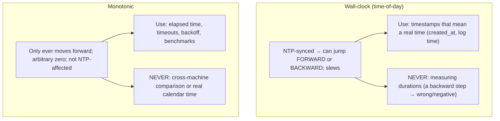
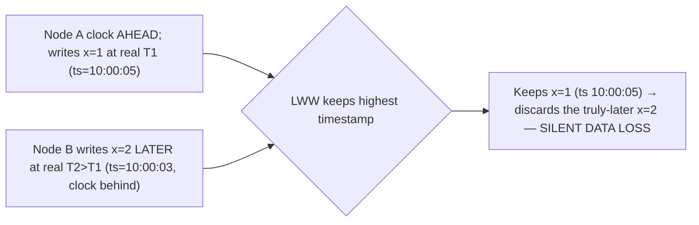

# Lesson 8.1.2 — Unreliable Clocks: NTP, Clock Skew, Monotonic vs Wall-Clock

> Part 8: Distributed Systems Core · Module 8.1: Fundamental Difficulties · Difficulty: 🔴
>
> **Prerequisites:** [8.1.1 Unreliable Networks], [3.2.4 NTP/time sync context], [5.2.4 Concurrency Control], [6.5 LWW concepts].
> **Unlocks:** [8.1.3 Timeouts], [8.2 Logical Clocks], [8.2.4 Hybrid/TrueTime], [Part 10 LWW/Consistency].

---

## 1. Learning Objectives

After this lesson you will be able to:

- Explain why **clocks in a distributed system disagree** (each node has its own quartz oscillator that **drifts**) and what **NTP** does (and its limits) to keep them roughly in sync.
- Distinguish **wall-clock (time-of-day) time** from **monotonic time**, and know **which to use for what** — and why using wall-clock time to measure durations is a classic bug.
- Define **clock skew** and reason about its consequences: why you **cannot use timestamps to order events** across nodes reliably, and why **last-write-wins (LWW)** based on wall clocks can **silently lose data**.
- Understand the motivation for **logical clocks** (8.2) and **bounded-uncertainty / TrueTime-style** approaches (8.2.4) as the principled answers to untrustworthy physical clocks.

---

## 2. Motivation — Time is not what it seems across machines

The second pillar of distributed-systems difficulty (after the unreliable network, 8.1.1) is the **unreliable clock**. On a single machine there is effectively one clock; "what time is it?" and "which event happened first?" have clean answers. Across machines, **there is no single clock** — each node reads its own hardware clock, those clocks **drift apart**, and even with synchronization they are only *approximately* aligned. The consequence is profound and counterintuitive: **you cannot trust a timestamp from another machine, and you cannot reliably decide which of two events on different machines happened first by comparing their timestamps.**

This breaks things engineers do reflexively. Order events by timestamp? Two events microseconds (or seconds) apart on different nodes may be timestamped in the *wrong* order because the clocks disagree. Resolve conflicting writes with "last write wins" by comparing wall-clock times? The "earlier" write may have a *later* timestamp and **silently overwrite** the truly-later one — **data loss that no error reports**. Measure how long an operation took by subtracting two wall-clock readings? If NTP steps the clock backward mid-measurement, you get a *negative* duration. These aren't rare edge cases; they're the default behavior of physical clocks, and they cause real, hard-to-debug corruption. This lesson explains *why* clocks are untrustworthy (drift, skew, NTP's limits), the critical **wall-clock vs monotonic** distinction (use the right clock for the right job), the danger of timestamp-based ordering and LWW, and why the field invented **logical clocks** (8.2) and **bounded-uncertainty clocks** (8.2.4) to reason about ordering *without* trusting physical time.

---

## 3. Theory — From first principles

### 3.1 Why clocks disagree — drift

Each computer keeps time with a **quartz crystal oscillator** that ticks at a nominal frequency, plus a counter `[CS]`. But crystals are imperfect and temperature-sensitive, so each one runs slightly **fast or slow** — it **drifts**. Typical drift is on the order of **tens of ppm** (parts per million) — e.g., ~30 ppm ≈ ~2.5 seconds/day (*illustrative*); cheap or hot hardware drifts more. So:
- Two nodes started in perfect sync will be **seconds apart within a day** if left alone.
- Drift is **continuous and unpredictable** in direction/magnitude per machine.
This is why distributed systems **continuously re-synchronize** clocks — but synchronization itself is imperfect (§3.2).

### 3.2 NTP — what it does and its limits

**NTP (Network Time Protocol)** keeps a machine's clock close to a reference time (ultimately atomic clocks / GPS) by periodically querying time servers and adjusting `[CS]`:
- A node asks an NTP server for the time, estimates the **network round-trip delay**, and adjusts its clock — but the accuracy is **limited by the variability of that network delay** (8.1.1: the network is unreliable, so the delay estimate is uncertain).
- **Accuracy** is typically **single-digit to tens of milliseconds** over the internet (better — sub-ms — on a tuned LAN with good servers; worse under congestion or with bad config) (*illustrative ranges*).
- **NTP can step the clock** (jump it forward *or backward*) to correct large errors, or **slew** it (speed up/slow down gently). A **backward step** is the source of the "negative duration" bug (§3.3).
- **NTP can be wrong/misconfigured** — a bad server, asymmetric routes, a leap second, or a node that lost sync can have a clock off by **seconds or more**, and **nothing alerts the application**.
**The takeaway:** NTP makes clocks *approximately* agree (within some **uncertainty bound**), but it provides **no guarantee** of exact agreement and can move the clock non-monotonically. You cannot assume two nodes' wall clocks agree to better than NTP's (uncertain) error.

### 3.3 Wall-clock time vs monotonic time — the critical distinction

Operating systems expose **two different kinds of clock**, and confusing them is a classic bug `[CS]`:

**Wall-clock (time-of-day) time** — "what time is it?" (e.g., `System.currentTimeMillis()`, `clock_gettime(CLOCK_REALTIME)`): seconds since an epoch, meant to match real-world calendar time.
- **Synced by NTP**, so it can **jump forward or backward** (steps) and **speed up/slow down** (slews).
- **Use for:** timestamps that must mean a real point in time (log entries, "created_at", expiry deadlines you compare to real time).
- **Never use for:** measuring **durations/elapsed time** — because an NTP step mid-measurement makes the result wrong (even negative).

**Monotonic time** — "how much time has elapsed?" (e.g., `System.nanoTime()`, `clock_gettime(CLOCK_MONOTONIC)`): a counter that **only ever moves forward** at a steady rate, with **no absolute meaning** (the zero point is arbitrary — often boot time).
- **Not affected by NTP** steps; **guaranteed non-decreasing**.
- **Use for:** measuring **elapsed time** — request latency, timeouts (8.1.3), retry backoff, rate-limiter windows, benchmarks.
- **Never use for:** anything that needs to mean a real calendar time, or to be compared **across machines** (its zero is per-machine/arbitrary).

**Rule** `[BP]`: **monotonic for durations, wall-clock for timestamps.** Measuring "how long did this take?" with wall-clock time is a bug waiting for the next NTP adjustment.

### 3.4 Clock skew and why timestamps can't order events across nodes

**Clock skew** is the **difference between two nodes' clocks at a given instant** `[CS]`. Because of drift + imperfect NTP (§3.1/3.2), skew is **nonzero and unknown** (bounded only by NTP's uncertain accuracy). The devastating consequence:
- **You cannot reliably order events on different nodes by comparing their wall-clock timestamps.** If event X happens on node A at A's "10:00:00.000" and event Y happens on node B *later* at B's "10:00:00.000", but B's clock is skewed 5 ms behind, X's timestamp might be **larger** than Y's even though X happened first — or vice versa. For events close in time (smaller than the skew), **timestamp order can be the reverse of real order**.
- This means timestamps give you **no trustworthy "happened-before" relation** across nodes — which is exactly the problem **logical clocks** (Lamport/vector — 8.2) solve by capturing causality *without* physical time.

### 3.5 The Last-Write-Wins (LWW) data-loss trap

A common conflict-resolution strategy for concurrent writes (multi-leader/leaderless replication — Part 10; cache writes — 6.5) is **last-write-wins**: attach a **timestamp** to each write and keep the one with the **highest timestamp**. With **wall-clock** timestamps and clock skew, this **silently loses data** `[CS]`:
- Node A writes `x = 1` at real time T1; node B writes `x = 2` at real time T2 > T1 (so `x = 2` *should* win — it's truly later). But if A's clock is **ahead** of B's, A's write carries a **larger timestamp** than B's → LWW keeps `x = 1` and **discards the truly-later `x = 2`**.
- **No error is raised.** The write that "lost" is simply gone. This is **silent data loss** caused entirely by clock skew — one of the most insidious distributed bugs.
- **Mitigations:** don't use wall-clock LWW for data you can't afford to lose; use **logical/version-based** conflict resolution (vector clocks, version vectors — 8.2/Part 10), **CRDTs** (Part 10), or **bounded-uncertainty clocks** (8.2.4). LWW is acceptable only when **losing a concurrent write is genuinely OK** (e.g., a cache entry, an idempotent last-state-wins setting).

### 3.6 Timestamps as a correctness mechanism are dangerous

More generally, using physical timestamps for **correctness** (ordering, leases, fencing, "is this newer?") is hazardous `[BP]`:
- **Lease/lock expiry by wall clock:** if a lock holder believes its lease is valid until time T (its clock), but the lock server's clock is skewed, the holder may keep acting **after** the lease truly expired — two holders → split-brain-style corruption. (Why **fencing tokens** — monotonic counters, not timestamps — are used instead — 8.3.6.)
- **"Newest wins" caches/configs:** same LWW trap as §3.5.
- **Ordering across services:** unreliable (§3.4).
**Principle:** treat physical time as **approximate and untrustworthy for ordering/correctness**; use it for *human-facing* timestamps and *coarse* deadlines, and use **logical clocks / monotonic counters / consensus** for anything where correctness depends on order or exclusivity.

### 3.7 The principled answers — logical and bounded-uncertainty clocks

The field's responses to untrustworthy physical clocks (detailed later) `[CS]`/`[EMERGING]`:
- **Logical clocks (8.2):** capture **causal ordering** (happens-before) using **counters incremented on events/messages**, *not* physical time — **Lamport timestamps** (a total order consistent with causality) and **vector clocks** (detect concurrency precisely). They sidestep clock skew entirely by not depending on physical time.
- **Hybrid Logical Clocks (HLC) (8.2.4):** combine a physical-time component (for human-meaningful, roughly-real timestamps) with a logical counter (for correctness/causality) — best of both.
- **Bounded-uncertainty clocks (TrueTime — 8.2.4):** instead of pretending the clock is exact, **expose the uncertainty** as an interval `[earliest, latest]` and **wait out the uncertainty** when needed (Google Spanner's "commit wait") to provide externally-consistent ordering using *tightly-bounded* physical clocks (GPS/atomic). This *embraces* skew by measuring and waiting it out, rather than ignoring it.
These exist precisely because §3.1–3.6 make naive physical-clock ordering unsafe.

---

## 4. Visual Intuition

### Wall-clock vs monotonic

### LWW data loss from skew

---

## 5. Real-World Analogy

Imagine a team spread across offices, each relying on **its own cheap wall clock** — and those clocks slowly drift, so one office is a few minutes ahead, another behind.

- **Drift & skew:** nobody's clock is exactly right, and they disagree by an unknown amount. **NTP** is like everyone occasionally calling a radio time-check to reset — it gets them *roughly* aligned, but the call has delay, and sometimes the reset **jumps the clock backward** to correct.
- **Ordering by timestamp fails:** two memos are stamped "10:00" in two offices. Which was *really* written first? You **can't tell** — the offices' clocks differ by more than the gap between the memos. Sorting the memos by their stamps can put them in the **wrong order**.
- **The LWW data-loss trap:** the rule is "keep the memo with the later timestamp." Office A (clock running fast) writes "cancel the order" at *real* 10:00, stamped 10:05. Office B writes the *later*, correct "ship the order" at *real* 10:02, stamped 10:02. The rule keeps the **fast-clock memo** (10:05) and **throws away the genuinely-later one** — and **nobody notices** the right instruction was silently discarded.
- **Wall vs monotonic:** to ask "what time is it?" you read the wall clock (which can be reset/jump). To time **how long a meeting lasted**, you use a **stopwatch** (monotonic) — it only counts up and never gets reset by the radio time-check. Timing a meeting by subtracting two wall-clock readings breaks the moment someone resets the clock mid-meeting.
- **The fix:** stop trusting the clocks for *order*. Instead, **number the memos** (logical clocks) or **note "this replies to memo #7"** (causality) — order by the numbering, not the unreliable stamps.

---

## 6. Industry Example

- **Wall-clock-for-duration bugs** `[CONV]`: code measuring latency/timeouts with `currentTimeMillis()`/`Date.now()` instead of a monotonic clock produces wrong or negative durations when NTP steps the clock — a recurring real-world bug class (§3.3). *(Representative.)*
- **LWW silent data loss** `[CS]`: documented in Dynamo-style/last-write-wins systems and Cassandra — concurrent writes resolved by wall-clock timestamp can drop the truly-later write under skew (§3.5, Part 10). *(Representative.)*
- **Leap-second incidents** `[CONV]`: leap seconds (and their handling — step vs "smear") have caused outages when systems assumed monotonic, exact wall-clock time (§3.2). *(Representative.)*
- **Google Spanner / TrueTime** `[EMERGING]`: uses **GPS + atomic clocks** to bound clock uncertainty tightly and **waits out the uncertainty interval** ("commit wait") to give externally-consistent ordering — the canonical "embrace and bound the skew" approach (8.2.4). *(Representative.)*
- **Hybrid Logical Clocks (HLC)** `[EMERGING]`: used by CockroachDB/YugabyteDB to get causal ordering with near-physical timestamps without TrueTime hardware (8.2.4). *(Representative.)*
- **Fencing tokens over timestamps** `[BP]`: lock services issue monotonic **fencing tokens** rather than time-based leases for correctness, precisely because clocks are untrustworthy (8.3.6). *(Representative.)*

---

## 7. Implementation Details — using time safely

- **Use monotonic clocks for all durations/timeouts/backoff/rate-limit windows** (`nanoTime`/`CLOCK_MONOTONIC`); use wall-clock only for human-meaningful timestamps and coarse real-time deadlines (§3.3) `[BP]`.
- **Never order events across nodes by wall-clock timestamps** for correctness — use **logical clocks** (Lamport/vector — 8.2) or consensus-assigned order (8.3) (§3.4).
- **Avoid wall-clock LWW for data you can't lose** — use version vectors / CRDTs / consensus; reserve LWW for genuinely loss-tolerant data (caches, last-state-wins settings) (§3.5).
- **Don't use wall-clock leases for exclusivity** — use **fencing tokens** (monotonic counters) so a skewed/slow holder can't act past expiry (§3.6, 8.3.6).
- **Run NTP (or better, a tightly-managed time service)** on every node and **monitor clock offset/skew** — alert when a node drifts beyond a threshold (a skewed node causes silent corruption) (§3.2).
- **Account for NTP steps** — code must tolerate the wall clock jumping forward/backward; never assume it's monotonic (§3.2/3.3).
- **If you need ordered-by-time correctness, adopt HLC or a bounded-uncertainty approach** (8.2.4) rather than trusting raw NTP (§3.7).
- **Treat any single timestamp as approximate** — for "newer?" decisions prefer versions/sequence numbers over physical time (§3.6).

---

## 8. Advantages / when physical clocks are fine

- **Human-facing timestamps** — "created 10:42:03" for logs/UI is exactly what wall-clock time is for (§3.3).
- **Coarse deadlines/TTLs** — cache/session expiry tolerant to seconds of skew is fine with wall-clock time (6.4/6.5).
- **Durations via monotonic clocks** — accurate, skew-immune latency/timeout measurement (§3.3).
- **Bounded-uncertainty clocks (TrueTime)** — when you invest in the hardware/infra, you *can* get externally-consistent ordering from physical time (8.2.4).
- **Simplicity** — where approximate time suffices, physical clocks are simple and cheap; you only need the heavier machinery (logical clocks/consensus) where **order is correctness**.

---

## 9. Disadvantages / hard realities

- **Clocks drift and disagree** — skew is nonzero and unknown; NTP only approximates agreement (§3.1/3.2).
- **NTP can step backward** — breaking any code that assumes wall-clock monotonicity (§3.2/3.3).
- **Timestamps can't order cross-node events** for correctness (§3.4).
- **Wall-clock LWW silently loses data** under skew (§3.5).
- **Time-based leases are unsafe** for exclusivity (§3.6).
- **Errors are silent** — a skewed clock corrupts data/ordering with no alarm unless you monitor offset.

---

## 10. When NOT to rely on physical time / limits

- **Don't order events for correctness by physical timestamps** — use logical clocks/consensus (§3.4, 8.2/8.3).
- **Don't use wall-clock LWW for non-loss-tolerant data** — use versions/CRDTs (§3.5, Part 10).
- **Don't use wall-clock time to measure durations** — monotonic only (§3.3).
- **Don't gate exclusivity (locks/leases) on wall-clock expiry** — fencing tokens (§3.6, 8.3.6).
- **Don't assume NTP makes clocks exact** — it bounds error loosely and can step; design for the uncertainty (§3.2).

---

## 11. Common Mistakes

1. **Measuring elapsed time with wall-clock time** → wrong/negative durations on NTP steps (§3.3).
2. **Ordering events / "is this newer?" by wall-clock timestamps** across nodes → wrong order under skew (§3.4).
3. **Wall-clock last-write-wins** → silent data loss when clocks are skewed (§3.5).
4. **Time-based locks/leases** → two holders when a clock is slow/skewed (§3.6, 8.3.6).
5. **Assuming NTP keeps clocks exact/monotonic** → surprised by skew, steps, leap seconds (§3.2).
6. **Not monitoring clock offset** → a silently-skewed node corrupts ordering/data with no alert (§3.2).
7. **Using monotonic time across machines** (its zero is arbitrary/per-machine) → meaningless comparisons (§3.3).
8. **Trusting a single timestamp as ground truth** for correctness decisions (§3.6).

---

## 12. Interview Questions

**🟢 Easy**
- Why do clocks on different machines disagree? What does NTP do about it?
- What's the difference between wall-clock and monotonic time, and which do you use to measure how long an operation took?

**🟡 Medium**
- What is clock skew, and why does it mean you can't order cross-node events by timestamp?
- Explain how wall-clock last-write-wins can silently lose data. When is LWW acceptable anyway?

**🔴 Hard**
- A distributed lock uses a wall-clock lease ("you hold it until 10:00:05"). Show how clock skew can produce two simultaneous holders, and explain the fencing-token fix (8.3.6).
- Why are logical clocks (8.2) needed if we have NTP? What can they do that physical timestamps cannot?

**⚫ Staff+**
- Design conflict resolution for a multi-leader replicated store where two regions may write the same key concurrently. Why is wall-clock LWW dangerous, and what would you use instead (version vectors / CRDTs / HLC / consensus)? Justify against clock skew.
- Explain Google Spanner's TrueTime "commit wait" (8.2.4): how does exposing and waiting out clock *uncertainty* yield externally-consistent ordering, and what does it cost? Contrast with HLC's approach without special hardware.

---

## 13. Production Pitfalls

- **Negative/garbage durations:** latency or timeout logic using wall-clock time produces nonsense (or fires timeouts early/late) after an NTP step or leap-second (§3.3).
- **Silent LWW data loss:** a skewed node's writes win by timestamp, discarding truly-later writes; discovered only as mysterious "lost updates" much later (§3.5).
- **Two lock holders:** a slow/skewed clock lets a lease appear valid past its real expiry; two writers corrupt shared state (no fencing) (§3.6, 8.3.6).
- **Skewed node corrupts ordering:** one node's clock drifts seconds off (bad NTP); its timestamped events sort wrongly across the system, with no alert (§3.2/3.4).
- **Leap-second outage:** assuming smooth, monotonic wall-clock time breaks at a leap second (§3.2).
- **Cross-machine monotonic comparison:** comparing `nanoTime()` values from two hosts (arbitrary zeros) yields meaningless results (§3.3).

---

## 14. Optimization Techniques

> *Here "optimization" = correctness/safety with time.*

- **Monotonic for durations, wall-clock for timestamps** — the foundational rule (§3.3) `[BP]`.
- **Logical clocks (Lamport/vector)** for causal ordering without trusting physical time (8.2).
- **HLC** for near-real timestamps *plus* causal correctness without special hardware (8.2.4).
- **TrueTime-style bounded uncertainty + commit-wait** when you need externally-consistent ordering and can invest in the infra (8.2.4).
- **Version vectors / CRDTs** for conflict resolution instead of wall-clock LWW (Part 10).
- **Fencing tokens** (monotonic counters) for exclusivity instead of time-based leases (8.3.6).
- **Run + monitor a good time service** (NTP/PTP) and **alert on clock offset** to catch skewed nodes (§3.2, Part 16).

---

## 15. Summary

The second pillar of distributed-systems difficulty is the **unreliable clock**. Each node times itself with a **quartz oscillator that drifts** (tens of ppm → seconds/day), so clocks **disagree**; **NTP** re-synchronizes them to a reference but only **approximately** (millisecond-to-worse accuracy, limited by unreliable network delay) and can **step the clock forward or backward** — so wall-clock time is *not* monotonic and *not* exact. The critical distinction: **wall-clock (time-of-day) time** is NTP-synced (can jump), meant for **real-time timestamps** (logs, `created_at`, coarse deadlines), while **monotonic time** only moves forward at a steady rate with an arbitrary zero, meant for **durations** (latency, timeouts, backoff) — and **measuring elapsed time with wall-clock time is a classic bug** (a backward NTP step gives a wrong/negative duration). **Clock skew** (the unknown, nonzero difference between two nodes' clocks) means you **cannot reliably order cross-node events by timestamp** — for events closer in time than the skew, timestamp order can be *reversed* from real order. This makes **wall-clock last-write-wins silently lose data**: a node with a fast clock can give an *earlier* write a *larger* timestamp, causing LWW to discard the truly-later write with **no error**. More broadly, using physical time for **correctness** (ordering, "is this newer?", time-based locks/leases) is dangerous — e.g., a skewed lease can yield two lock holders, which is why **fencing tokens** (monotonic counters) are used instead (8.3.6). The principled answers are **logical clocks** (Lamport/vector — capture causality via counters, not physical time — 8.2), **Hybrid Logical Clocks** (near-real timestamps + causal correctness — 8.2.4), and **bounded-uncertainty clocks** like **TrueTime** (expose the uncertainty interval and *wait it out* for externally-consistent ordering — 8.2.4). Practical posture: **monotonic for durations, wall-clock for timestamps; never order/LWW/lease by physical time for correctness; monitor clock offset; and use logical/consensus mechanisms wherever order is correctness.**

---

## 16. Revision Notes (flashcard-ready)

- **Q:** Why do clocks disagree? **A:** Each node's quartz oscillator drifts (fast/slow) — seconds/day apart without sync.
- **Q:** What does NTP do / its limits? **A:** Re-syncs to a reference, but only approximately (ms-to-worse, limited by network delay) and can step the clock forward/backward.
- **Q:** Wall-clock vs monotonic? **A:** Wall-clock = real time-of-day, NTP-synced, can jump (use for timestamps). Monotonic = only-forward, arbitrary zero (use for durations/timeouts).
- **Q:** Classic clock bug? **A:** Measuring elapsed time with wall-clock time → wrong/negative on NTP step.
- **Q:** Clock skew? **A:** Unknown nonzero difference between nodes' clocks → can't order cross-node events by timestamp.
- **Q:** Why is wall-clock LWW dangerous? **A:** A fast-clock node's earlier write gets a larger timestamp → LWW discards the truly-later write → silent data loss.
- **Q:** When is LWW OK? **A:** Only when losing a concurrent write is acceptable (caches, last-state-wins settings).
- **Q:** Why not time-based locks? **A:** Skew can make a lease look valid past real expiry → two holders; use fencing tokens (monotonic) instead.
- **Q:** Principled answers to bad clocks? **A:** Logical clocks (Lamport/vector), Hybrid Logical Clocks, bounded-uncertainty (TrueTime + commit-wait).
- **Q:** The rule? **A:** Monotonic for durations, wall-clock for timestamps; never use physical time for cross-node ordering/exclusivity correctness.

---

## 17. Further Reading + Knowledge-Graph Links

**Within this platform**
- **Previous:** [8.1.1 Unreliable Networks] (the other pillar). **Builds on:** [3.2.4 DNS/time context], [5.2.4 Concurrency Control], [6.5 LWW in caches].
- **Next:** [8.1.3 Timeouts & Failure Detection] (which must use monotonic time). **Then:** [8.2 Logical Clocks] (ordering without physical time), [8.2.4 HLC/TrueTime].
- **Enables:** [Part 10 LWW/conflict resolution/consistency], [8.3.6 Fencing Tokens], [Part 11 Idempotency/retries].

**Foundational texts (synthesized)**
- Kleppmann, *Designing Data-Intensive Applications* — unreliable clocks, monotonic vs time-of-day, LWW dangers, TrueTime (synthesized).
- Corbett et al., *Spanner / TrueTime* (concept, synthesized).
- Lamport, "Time, Clocks, and the Ordering of Events" (concept, synthesized — detailed in 8.2).

**Concept tags:** `[CS]` clock drift, clock skew, wall-clock vs monotonic, LWW data loss, timestamps can't order cross-node events · `[CONV]` NTP accuracy/limits, leap seconds, duration-bug class · `[BP]` monotonic for durations, no wall-clock LWW for critical data, fencing not time-leases, monitor offset · `[EMERGING]` HLC, TrueTime/commit-wait.
