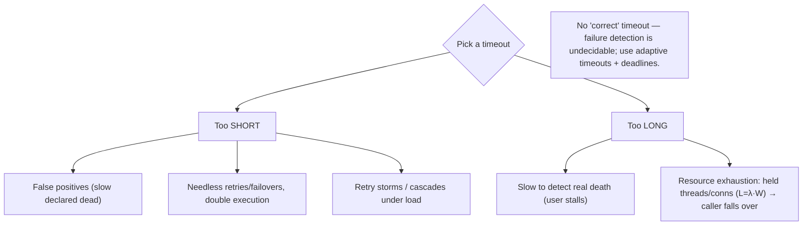
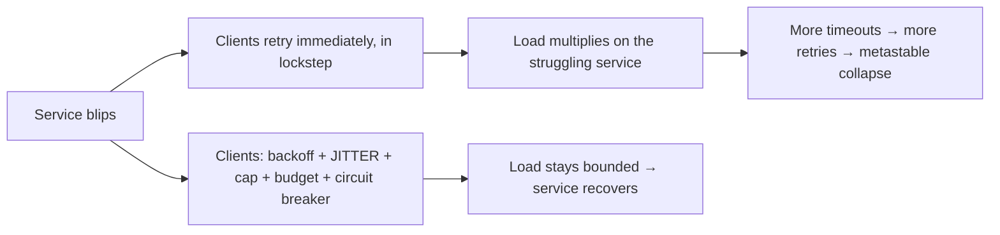

# Lesson 8.1.3 — Timeouts, Retries, and Why "Is It Dead?" Is Undecidable

> Part 8: Distributed Systems Core · Module 8.1: Fundamental Difficulties · Difficulty: 🔴
>
> **Prerequisites:** [8.1.1 Unreliable Networks], [8.1.2 Unreliable Clocks], [6.7 Stampede/Backoff], [3.3.4 Backpressure].
> **Unlocks:** [8.3.5 Failure Detectors], [8.4.1 RPC Semantics], [Part 11 Resilience], [Part 10 CAP].

---

## 1. Learning Objectives

After this lesson you will be able to:

- Explain why, in an asynchronous system, **detecting failure is fundamentally undecidable** — you cannot distinguish "dead" from "slow" — and why **timeouts are therefore a *guess*, not a fact**.
- Reason about the **timeout-length tradeoff** (too short → false positives/wasted work/cascades; too long → slow failure detection/resource exhaustion) and apply **adaptive timeouts**.
- Design **safe retries**: idempotency, **exponential backoff with jitter**, retry budgets/caps, and why naive retries cause **retry storms** (6.7) and **metastable failures** (Part 11).
- Describe **failure detectors** (heartbeats, phi-accrual) and the **completeness vs accuracy** tradeoff, connecting to leader election/membership (8.3.5) and "slow vs dead" (7.4).

---

## 2. Motivation — You must act on information you cannot have

8.1.1 established that a non-response is **ambiguous** (crashed? slow? lost? partitioned?) and 8.1.2 that you can't trust clocks. This lesson confronts the practical consequence: **you still have to decide.** A request is outstanding and no reply has come — do you wait longer, give up, retry, fail over to a replica, declare the node dead? Every distributed system makes these decisions constantly, and it makes them on the basis of a **timeout** — a deadline after which you *assume* something went wrong. But here is the uncomfortable truth this lesson drives home: **in an asynchronous network there is no timeout that is "correct," because failure detection is genuinely undecidable.** A node that hasn't responded in 5 seconds might be dead — or might respond at 5.1 seconds because it was doing a long GC pause or stuck behind a queue. **No finite timeout can tell the difference.**

This isn't academic hand-wringing; it's the source of two of the worst production failure modes. Set timeouts **too long** and a dead/slow dependency ties up your resources (threads, connections, memory) until you exhaust them and fall over — one slow backend takes down everything calling it. Set them **too short** and you declare healthy-but-slow nodes dead, retry work that actually succeeded (double execution — 8.4.1), trigger needless failovers (split brain — 8.1.1), and — worst — unleash **retry storms** that turn a transient blip into a self-sustaining **metastable** outage (Part 11). Getting timeouts, retries, and failure detection right is therefore one of the highest-leverage reliability skills, and it rests on accepting that "is it dead?" can only ever be **guessed**, never **known** — so the engineering is about making good guesses and making the consequences of wrong guesses **safe**.

---

## 3. Theory — From first principles

### 3.1 The undecidability of failure (the core truth)

In an **asynchronous** system (no bound on message delay or processing time — 8.1.1), **it is impossible to reliably distinguish a crashed node from a slow one** `[CS]`:
- A crashed node sends nothing. A slow node *also* sends nothing *yet* — but will send something *later*. From the outside, at any moment **t**, "nothing received by t" is consistent with **both** "dead" and "will reply at t+ε."
- Since the network imposes **no upper bound** on delay (8.1.1) and the node imposes none on processing, **no finite waiting time** can guarantee a correct "dead/alive" verdict. Wait forever and you'd know — but you can't wait forever.
- This is deeply tied to the **FLP impossibility** result (8.3.1): in a fully asynchronous system, you can't even guarantee consensus with one faulty process, *because* you can't tell crashed from slow. (FLP detailed in 8.3.1.)

**Therefore: a timeout is a *heuristic guess*, not ground truth.** Declaring a node dead after a timeout is **always potentially wrong** — it might be a **false positive** (the node was just slow). Distributed systems are designed to **tolerate this inevitable wrongness**, not to eliminate it.

### 3.2 Timeouts — the necessary, imperfect tool

Since you can't wait forever, you must pick a **timeout**: a deadline after which you stop waiting and **act** (fail the request, retry, fail over, mark the node suspect). The choice is a **tradeoff with no perfect answer** `[CS]`:

**Too short:**
- **False positives** — healthy-but-slow nodes declared dead → unnecessary retries/failovers, double execution (8.4.1), wasted work.
- **Cascades** — under load (when everything is a bit slower), aggressive timeouts fire en masse → retry storms (§3.4) → the system declares itself dead and collapses.
- **Reduced availability** — you give up on requests that would have succeeded.

**Too long:**
- **Slow failure detection** — you take a long time to notice a genuinely dead node → long user-facing stalls.
- **Resource exhaustion** — outstanding requests hold **threads, connections, memory, sockets** for the whole timeout; a dead/slow dependency can **tie up the entire pool** (Little's Law — 7.7: held requests `L = λ·W`, and a huge `W` blows up `L`) → your service runs out of capacity and falls over even though *it* is healthy. **One slow dependency takes down its callers.**

**Use monotonic time for timeouts** (8.1.2) — never wall-clock (an NTP step would fire timeouts wrongly).

### 3.3 Adaptive timeouts and deadlines

Rather than a fixed guess `[BP]`:
- **Adaptive timeouts:** set the timeout based on **observed latency distribution** — e.g., a multiple of recent p99 (Part 17), adjusting as conditions change. Catches real slowness without being fooled by normal variation.
- **Deadline propagation (deadlines, not timeouts):** pass a **deadline** ("respond by absolute time T / within budget B") **down the call chain**, so each hop knows the *remaining* budget and doesn't do work whose result will already be discarded upstream. Prevents wasted work and cascading timeouts in deep call graphs (microservices — Part 12; gRPC deadlines are the canonical example). The **total budget** is split across hops.
- **Fail fast** when the budget is already exhausted — don't start work you can't finish in time.

### 3.4 Retries — necessary, dangerous, must be safe

Because messages get lost (8.1.1), you **retry**. But retries are hazardous and must be engineered `[BP]`:

**Hazard 1 — duplicate execution.** A timeout fires, you retry — but the original request may have **succeeded** (only the *response* was lost — 8.1.1). The retry **re-executes** → double charge, double order. **Fix: idempotency** (8.4.1, Part 11) — make the operation safe to apply more than once (idempotency keys, dedup). **Never retry a non-idempotent operation without making it idempotent.**

**Hazard 2 — retry storms (thundering herd).** If many clients retry a struggling service **immediately and in lockstep**, the retries **multiply the load** on exactly the service that's already overloaded → it gets *more* overloaded → more timeouts → more retries → **self-sustaining collapse** (a **metastable failure** — Part 11; kin to the cache stampede — 6.7). Retries can turn a 1-second blip into an hour-long outage.

**Safe-retry toolkit:**
- **Exponential backoff** — wait increasingly longer between retries (e.g., 100ms, 200ms, 400ms…) so you don't hammer a struggling service.
- **Jitter** — randomize the backoff so clients **don't synchronize** their retries (the key to breaking the herd — 6.7). "Full jitter" (random between 0 and the backoff) is widely recommended.
- **Retry caps / budgets** — limit total retries (e.g., max 3 attempts) and **cap the fraction of traffic that is retries** (a "retry budget", e.g., ≤10%) so retries can't dominate load.
- **Only retry retriable errors** — retry timeouts/503s/connection failures; **don't** retry 400s/validation errors (they'll just fail again) or non-idempotent ops without idempotency.
- **Circuit breaker** (Part 11) — after repeated failures, **stop retrying** for a while (fail fast / serve fallback), giving the dependency time to recover — the ultimate retry-storm defense.

### 3.5 Failure detectors — heartbeats and the completeness/accuracy tradeoff

To decide a node is dead (for failover, membership, leader election — 8.3.5), systems use a **failure detector**, usually **heartbeats** `[CS]`:
- Nodes periodically send "I'm alive" messages; if none arrives within a timeout, the peer is **suspected** dead.
- A failure detector has two properties in tension (Chandra–Toueg) `[CS]`:
  - **Completeness:** every truly-dead node is *eventually* suspected (don't miss real failures).
  - **Accuracy:** a live node is *not* wrongly suspected (no false positives).
- **You can't have both perfectly** in an asynchronous system (it follows from §3.1). Aggressive detection (short timeouts) maximizes completeness but hurts accuracy (false positives); conservative detection (long timeouts) maximizes accuracy but is slow (poor completeness). Practical detectors are **eventually accurate** — they may wrongly suspect a slow node temporarily but correct themselves.

**Phi-accrual failure detector** `[EMERGING]`: instead of a binary alive/dead, output a **suspicion level (φ)** — a continuous value reflecting *how likely* the node is dead based on the **history of heartbeat arrival times** — and let the application choose a threshold per action (e.g., a higher bar before failing over a primary than before rerouting a read). **Adaptive** (learns the normal heartbeat interval/variance), so it handles changing network conditions far better than a fixed timeout. Used by Cassandra, Akka, etc.

### 3.6 "Slow vs dead" and why it matters (the gray-failure problem)

The undecidability (§3.1) has a nasty real-world face: **a slow node is often worse than a dead one** `[CS]` (8.1.1 gray failure; 7.4):
- A **dead** node is cleanly removed (it fails health checks, traffic reroutes).
- A **slow** node (degraded disk, GC, partial overload) **passes health checks intermittently** while adding huge latency — so it keeps receiving traffic and **poisons p99 fleet-wide**, and may flap in/out of "suspected" (false positives), causing **routing churn** and even **rebalance storms** (7.4).
- **Treating slow as dead** → unnecessary failover/rebalance cascades (7.4 §3.8). **Treating dead as alive** → lost work, stalls. Good systems **measure latency, not just up/down**, shed/deprioritize slow nodes, and require **strong evidence (quorum/phi threshold) before drastic action** like failover (8.3.5).

### 3.7 Putting it together — the resilient client

A correct remote call combines all of the above `[BP]`:
1. **Monotonic-time timeout** (8.1.2), ideally **adaptive** (§3.3), with a **propagated deadline** in deep call graphs (§3.3).
2. **Retry only retriable errors**, with **exponential backoff + jitter**, a **retry cap and budget** (§3.4).
3. **Idempotency** so retries are safe (§3.4, 8.4.1).
4. **Circuit breaker** to stop retrying a failing dependency and fail fast (§3.4, Part 11).
5. **Failure detection (heartbeat/phi)** for membership/failover decisions, requiring strong evidence before drastic action, distinguishing **slow vs dead** (§3.5/3.6).
6. **Bulkheads / concurrency limits** (Part 11, 3.3.4) so a slow dependency can't exhaust the whole thread/connection pool (§3.2).
This is the practical embodiment of "you cannot know, so guess well and make wrong guesses safe."

---

## 4. Visual Intuition

### The timeout tradeoff

### Retry storm vs safe retries

---

## 5. Real-World Analogy

You phone a colleague and they don't pick up. **Are they unavailable, or just away from their desk for a minute?** You can't know. You set a rule — "if no callback in 10 minutes, assume they're out and ask someone else" — but that rule is a **guess**: they might call back at minute 11 because they were in a long meeting (slow, not gone). **No waiting time makes the guess certain.**

- **Too short a rule** (1 minute): you constantly conclude people are "out" when they were just briefly away, re-ask others, and create chaos — and if you re-send your request to the backup, the original person might *also* do it → the task gets done **twice** (no idempotency).
- **Too long a rule** (2 hours): if someone really is gone, you wait two hours before getting help — and meanwhile you've **tied up your own afternoon** waiting (resource exhaustion).
- **Retry storm:** imagine the whole office can't reach the IT desk, so *everyone* redials **at the same instant, over and over** — the IT phone line, already swamped, now never gets a free moment to actually help (the redials cause the very overload). The fix: **wait a random, increasing amount before redialing** (backoff + jitter), **cap your redials**, and after enough failures **stop redialing and put up an "IT is down" sign** (circuit breaker).
- **Heartbeats:** instead of waiting for a problem, your colleague pings "still here" every minute; if pings stop, you grow **suspicious** — and rather than a hard yes/no, you track *how overdue* the ping is (phi) and only take the drastic step (reassign their critical work) when you're *quite* sure.
- **Slow is worse than gone:** a colleague who answers but takes 20 minutes per reply is more disruptive than one who's clearly out — because you keep routing work to them and everything backs up behind them.

---

## 6. Industry Example

- **Exponential backoff + jitter** `[BP]`: AWS's well-known guidance ("full jitter") and standard SDK retry policies — the canonical retry-storm defense (§3.4, 6.7). *(Representative.)*
- **gRPC deadlines / deadline propagation** `[CONV]`: gRPC propagates a deadline through the call chain so downstream hops don't do work that's already too late (§3.3). *(Representative.)*
- **Phi-accrual failure detector** `[EMERGING]`: used by Cassandra and Akka for adaptive, suspicion-level failure detection rather than fixed timeouts (§3.5). *(Representative.)*
- **Circuit breakers** `[BP]`: Hystrix-lineage / resilience libraries stop calling a failing dependency to prevent retry storms and resource exhaustion (§3.4, Part 11). *(Representative.)*
- **Bulkheads / concurrency limits** `[BP]`: bounding concurrent calls to each dependency so one slow backend can't exhaust the whole thread/connection pool (§3.2, 3.3.4, Part 11). *(Representative.)*
- **Metastable failures** `[EMERGING]`: documented cases where retries/timeouts created self-sustaining overload that persisted after the trigger cleared (§3.4, Part 11). *(Representative.)*

---

## 7. Implementation Details — timeouts, retries, detection in practice

- **Always set explicit timeouts** on every remote call (never unbounded waits) using **monotonic time** (8.1.2); prefer **adaptive timeouts** (e.g., multiple of recent p99) and **propagate deadlines** through call chains (§3.2/3.3) `[BP]`.
- **Bound resource usage** with bulkheads/concurrency limits + connection-pool caps so a slow dependency can't exhaust your pool (Little's Law: cap `L`) (§3.2, 3.3.4).
- **Make retried operations idempotent** (idempotency keys/dedup) — never retry a non-idempotent write otherwise (§3.4, 8.4.1).
- **Retry only retriable errors**, with **exponential backoff + full jitter**, a **max-attempts cap**, and a **retry budget** (cap retries as a % of traffic) (§3.4).
- **Add circuit breakers** — open after sustained failures to stop retrying and fail fast / serve fallback; half-open to probe recovery (§3.4, Part 11).
- **Use a good failure detector** (heartbeats, ideally **phi-accrual**) for membership/failover; require **strong evidence (quorum / high suspicion)** before drastic actions like primary failover (§3.5, 8.3.5).
- **Distinguish slow vs dead** — measure latency (not just up/down), deprioritize/shed slow nodes, avoid auto-failover/rebalance on mere slowness (§3.6, 7.4).
- **Test under load and fault injection** — verify timeouts/retries don't cascade; chaos-test latency and node loss (Part 14).

---

## 8. Advantages (of getting this right)

- **Bounded blast radius** — timeouts + bulkheads stop a slow dependency from taking down its callers (§3.2).
- **Resilience to transient faults** — safe retries recover from loss/blips without human intervention (§3.4).
- **No retry-storm collapse** — backoff + jitter + budgets + breakers keep load bounded during trouble (§3.4).
- **Fast, accurate-enough failure detection** — adaptive/phi detectors react quickly without over-failing (§3.5).
- **Graceful degradation** — fail fast + fallbacks beat hanging forever (Part 11).
- **Correctness under retries** — idempotency prevents double execution (8.4.1).

---

## 9. Disadvantages / hard realities

- **No correct timeout exists** — every value is a tradeoff with false positives or slow detection (§3.1/3.2).
- **Retries are dangerous** — duplicates without idempotency; storms without backoff/jitter/budgets (§3.4).
- **Failure detection can't be both complete and accurate** in async systems (§3.5).
- **Slow nodes evade detection** — gray failures poison the system while passing health checks (§3.6).
- **Tuning burden** — timeouts, backoff, budgets, breaker thresholds, heartbeat intervals all need tuning per dependency/workload.
- **Complexity** — correct remote calls are far more involved than a function call (the price of the network — 8.1.1).

---

## 10. When NOT to / limits

- **Don't use unbounded waits / no timeout** — a guaranteed resource-exhaustion outage when a dependency hangs (§3.2).
- **Don't retry non-idempotent operations** without idempotency — double execution (§3.4, 8.4.1).
- **Don't retry without backoff + jitter + caps** — retry storms (§3.4, 6.7).
- **Don't retry non-retriable errors** (4xx/validation) — wasted work, same failure (§3.4).
- **Don't auto-failover/rebalance on a single missed heartbeat or mere slowness** — require strong evidence; distinguish slow vs dead (§3.5/3.6, 7.4).
- **Don't use wall-clock time for timeouts** — NTP steps misfire them (§3.2, 8.1.2).

---

## 11. Common Mistakes

1. **No timeout / unbounded wait** → a hung dependency exhausts threads/connections and takes down the caller (§3.2).
2. **Retry without idempotency** → double charges/orders from lost-response retries (§3.4, 8.4.1).
3. **Immediate, uniform retries** → retry storm → metastable collapse (§3.4, 6.7).
4. **Timeout too short under load** → mass false positives, needless failovers, cascades (§3.2).
5. **Timeout too long** → slow detection + resource exhaustion (§3.2).
6. **Wall-clock timeouts** → misfire on NTP step (§3.2, 8.1.2).
7. **Treating slow as dead** → failover/rebalance storms (§3.6, 7.4).
8. **No circuit breaker** → endless retries against a down dependency, preventing its recovery (§3.4, Part 11).
9. **Retrying 4xx/validation errors** → wasted load, same failure (§3.4).

---

## 12. Interview Questions

**🟢 Easy**
- Why can't you reliably tell whether a node is dead or just slow? What does that make a timeout?
- Why must retried operations be idempotent?

**🟡 Medium**
- Explain the timeout-length tradeoff: what goes wrong if it's too short vs too long?
- What is a retry storm, and how do exponential backoff, jitter, and retry budgets prevent it?

**🔴 Hard**
- Design a resilient remote-call wrapper: timeouts (adaptive? deadline propagation?), retries (backoff/jitter/caps/budget), idempotency, circuit breaker, and bulkheads. Justify each.
- Explain the completeness vs accuracy tradeoff for failure detectors, and how phi-accrual improves on fixed-timeout heartbeats.
- Why is a slow node often worse than a dead one, and how should failure detection and routing handle it? (Gray failure, 7.4.)

**⚫ Staff+**
- A transient 2-second database blip caused a 45-minute full outage. Diagnose how timeouts + retries likely created a metastable failure, and design the fixes (backoff/jitter, retry budgets, circuit breakers, bulkheads, load shedding) so a blip stays a blip (§3.4, Part 11).
- Design failover for a replicated primary so that a *slow* (not dead) primary doesn't trigger a false failover and split brain (8.1.1), while a truly dead primary is detected quickly. Combine phi-accrual detection, quorum/strong-evidence gating, and fencing tokens (8.3.5/8.3.6).

---

## 13. Production Pitfalls

- **Resource-exhaustion outage:** a downstream dependency hangs; with long/no timeouts, callers' thread/connection pools fill with stuck requests and the *callers* fall over despite being healthy (§3.2).
- **Metastable retry-storm outage:** a brief blip triggers synchronized retries that overload the recovering service, sustaining the outage long after the trigger cleared (§3.4, Part 11).
- **Double execution:** a lost response triggers a retry that re-charges/re-ships because the op wasn't idempotent (§3.4, 8.4.1).
- **False failover / split brain:** an aggressive timeout declares a slow primary dead; a replica is promoted; the old primary returns → two primaries (§3.6, 8.1.1).
- **Gray-failure poisoning:** a degraded node passes health checks but adds huge latency; it keeps getting traffic and wrecks p99 fleet-wide; detection flaps (§3.6, 7.4).
- **NTP-step timeout misfire:** wall-clock-based timeouts fire wrongly when the clock jumps (§3.2, 8.1.2).
- **Cascading timeouts in deep call graphs:** no deadline propagation, so each layer waits its full timeout and work continues past the point the top-level caller already gave up (§3.3).

---

## 14. Optimization Techniques

- **Adaptive timeouts (multiple of p99) + deadline propagation** — fast, context-aware, no wasted downstream work (§3.3) `[BP]`.
- **Exponential backoff + full jitter + retry caps + retry budgets** — bounded, de-synchronized retries (§3.4, 6.7).
- **Idempotency keys** — safe retries (§3.4, 8.4.1).
- **Circuit breakers + fallbacks** — stop hammering failing deps; fail fast (§3.4, Part 11).
- **Bulkheads / concurrency limits / pool caps** — bound `L` so one slow dep can't exhaust capacity (§3.2, 3.3.4, Little's Law 7.7).
- **Phi-accrual failure detection + quorum-gated drastic actions** — accurate-enough detection; strong evidence before failover (§3.5, 8.3.5).
- **Latency-aware routing / slow-node shedding** — handle gray failure, not just up/down (§3.6, 7.4).
- **Monotonic clocks for all timing** (8.1.2); **load/chaos testing** to prove no cascades (Part 14).

---

## 15. Summary

Because non-response is ambiguous (8.1.1) and clocks are untrustworthy (8.1.2), distributed systems must **act on information they cannot have** — and the deepest truth here is that **failure detection is undecidable**: in an asynchronous network with no bound on delay, **you cannot distinguish a dead node from a slow one**, so **a timeout is a heuristic guess, never ground truth** (and is intimately related to FLP impossibility — 8.3.1). The timeout length is a tradeoff with **no correct answer**: **too short** → false positives, needless retries/failovers, double execution, and **cascades** under load; **too long** → slow detection and **resource exhaustion** (held threads/connections — by Little's Law a large `W` blows up in-flight `L` — so one slow dependency takes down its callers). Better than a fixed guess: **adaptive timeouts** (a multiple of observed p99) and **deadline propagation** through call chains (do no work that's already too late). **Retries** are necessary (the network loses messages) but dangerous: a lost *response* makes a retry **double-execute** (→ require **idempotency**, 8.4.1), and **immediate, synchronized retries** cause **retry storms** that turn a blip into a **metastable** outage (Part 11, kin to 6.7) — so retries need **exponential backoff + jitter**, **caps and budgets**, **retry-only-retriable-errors**, and a **circuit breaker** to stop hammering a failing dependency. For membership/failover decisions, **failure detectors** (heartbeats) face an inherent **completeness vs accuracy** tradeoff (you can't reliably have both in async systems); **phi-accrual** detectors output an adaptive **suspicion level** instead of a binary verdict, handling changing conditions far better. The nastiest real-world face is **slow vs dead** (gray failure): a slow node passes health checks while poisoning latency, so systems must **measure latency (not just up/down)**, shed/deprioritize slow nodes, and require **strong evidence (quorum/high suspicion) before drastic action** like failover (to avoid split brain — 8.1.1 — and rebalance storms — 7.4). The resilient client combines all of it: **monotonic adaptive timeouts + deadlines, idempotent + backoff/jitter/capped/budgeted retries, circuit breakers, bulkheads, and quorum-gated phi-accrual failure detection** — the practical embodiment of *you cannot know, so guess well and make wrong guesses safe.*

---

## 16. Revision Notes (flashcard-ready)

- **Q:** Why is "is it dead?" undecidable? **A:** Async network has no delay bound → "no reply yet" is consistent with both dead and slow; no finite timeout decides it.
- **Q:** What is a timeout, really? **A:** A heuristic guess, not a fact — always possibly a false positive (slow mistaken for dead).
- **Q:** Timeout too short? **A:** False positives, needless retries/failovers, double execution, cascades under load.
- **Q:** Timeout too long? **A:** Slow failure detection + resource exhaustion (held threads/conns; Little's Law) → caller falls over.
- **Q:** Better than fixed timeouts? **A:** Adaptive (multiple of p99) + deadline propagation through the call chain.
- **Q:** Why are retries dangerous? **A:** Lost responses → double execution (need idempotency); synchronized retries → retry storms / metastable collapse.
- **Q:** Safe-retry toolkit? **A:** Retry only retriable errors + exponential backoff + jitter + max attempts + retry budget + circuit breaker + idempotency.
- **Q:** Failure-detector tradeoff? **A:** Completeness (catch all real deaths) vs accuracy (no false positives) — can't have both perfectly in async.
- **Q:** Phi-accrual detector? **A:** Outputs an adaptive suspicion level (φ) from heartbeat history; pick a threshold per action; handles changing conditions.
- **Q:** Why is slow worse than dead? **A:** A slow node passes health checks but poisons p99 and flaps; treating slow as dead → failover/rebalance storms.
- **Q:** Use which clock for timeouts? **A:** Monotonic (wall-clock would misfire on NTP steps).

---

## 17. Further Reading + Knowledge-Graph Links

**Within this platform**
- **Previous:** [8.1.2 Unreliable Clocks] (use monotonic time for timeouts). **Builds on:** [8.1.1 Unreliable Networks] (ambiguous silence), [6.7 Stampede/backoff/jitter], [3.3.4 Backpressure], [7.7 Little's Law].
- **Closes:** Module 8.1. **Next:** [8.2 Logical Clocks] (ordering without physical time). **Then:** [8.3.1 FLP] (why this is theoretically impossible), [8.3.5 Failure Detectors/Membership].
- **Enables:** [Part 11 Resilience] (timeout/retry/circuit breaker/bulkhead/metastable failures), [8.4.1 RPC semantics & idempotency], [8.3.6 Fencing].

**Foundational texts (synthesized)**
- Kleppmann, *Designing Data-Intensive Applications* — timeouts, unbounded delays, failure detection (synthesized).
- Chandra & Toueg — failure detectors, completeness/accuracy (concept, synthesized).
- Hayashibara et al. — phi-accrual failure detector (concept, synthesized).
- Nygard, *Release It!* — timeouts, circuit breaker, bulkhead (synthesized, Part 11).

**Concept tags:** `[CS]` undecidable failure, timeout-as-guess, completeness vs accuracy, slow-vs-dead · `[CONV]` gRPC deadlines, heartbeats, phi-accrual usage · `[BP]` adaptive timeouts + deadline propagation, backoff+jitter+caps+budgets, idempotency, circuit breaker, bulkheads, quorum-gated failover · `[EMERGING]` phi-accrual, metastable failures.
