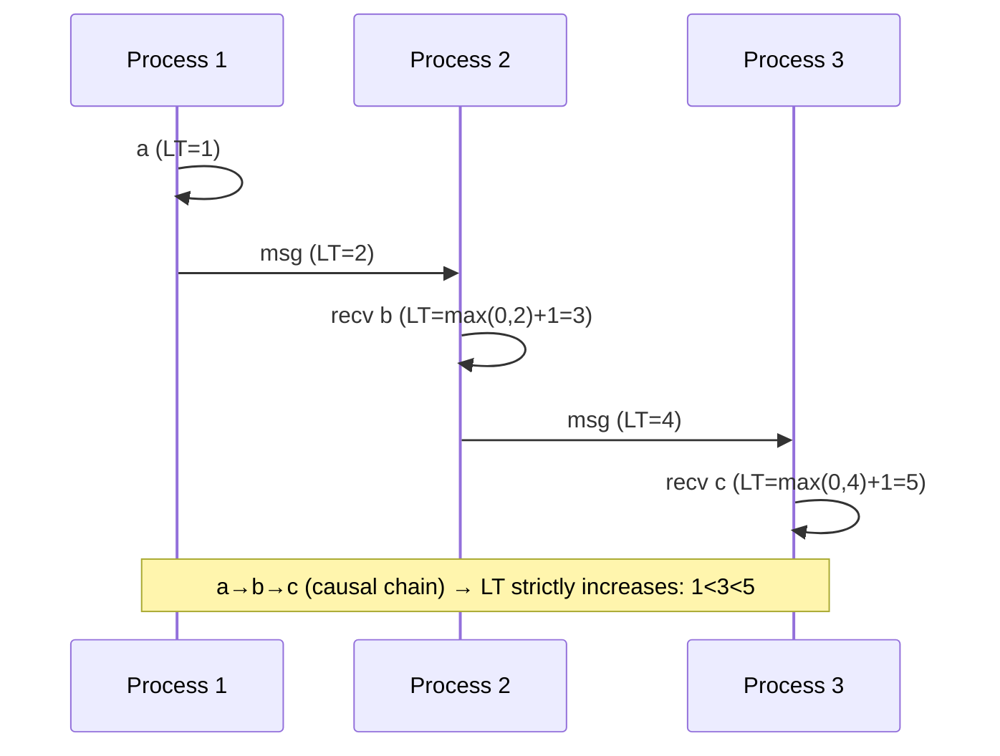
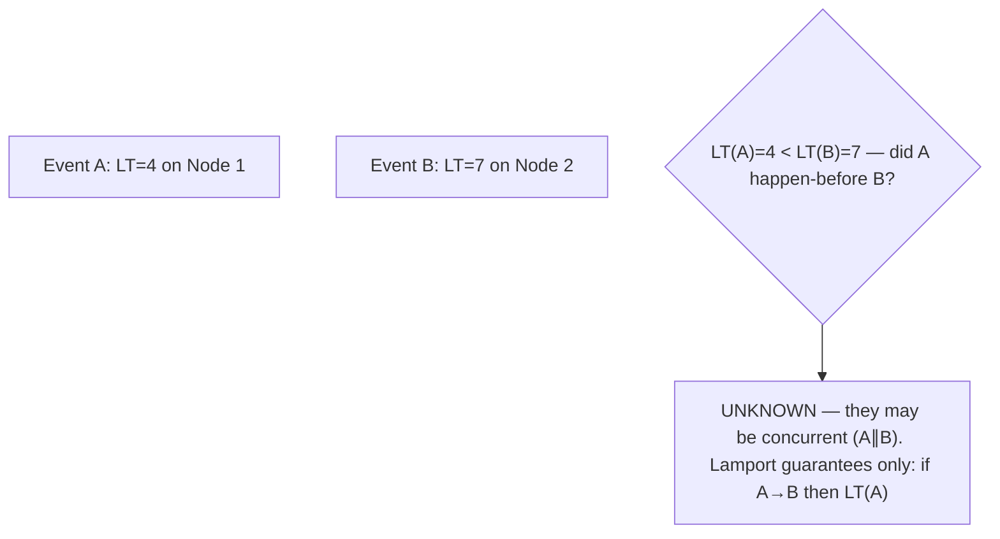

# Lesson 8.2.1 — Logical Clocks: Lamport Timestamps

> Part 8: Distributed Systems Core · Module 8.2: Time & Ordering · Difficulty: 🔴
>
> **Prerequisites:** [8.1.2 Unreliable Clocks], [8.1.1 Unreliable Networks].
> **Unlocks:** [8.2.2 Vector Clocks], [8.2.3 Happens-Before], [8.3 Consensus], [Part 10 Causal Consistency].

---

## 1. Learning Objectives

After this lesson you will be able to:

- Explain why we need **logical clocks** — to capture **ordering without trusting physical time** (8.1.2) — and define the **happens-before relation** that they track.
- State and apply the **Lamport timestamp algorithm** (the three rules) and prove its key property: **if A happens-before B, then LT(A) < LT(B)** (the **clock condition**).
- Understand the algorithm's **limitation**: the converse is false — `LT(A) < LT(B)` does **not** imply A happened-before B (it can't distinguish causality from concurrency), which motivates **vector clocks** (8.2.2).
- Use Lamport timestamps to build a **total order** of events (with tie-breaking) and explain where that's useful (e.g., total-order multicast, tie-breaking) and where it isn't.

---

## 2. Motivation — Ordering events when you can't trust the clock

8.1.2 delivered bad news: physical timestamps **can't reliably order events across machines** (clock skew), and using them for ordering causes silent data loss (LWW). But ordering is fundamental — to apply operations consistently across replicas (Part 10), to resolve conflicts, to build a consistent log, to reason about cause and effect, you must be able to say **"this happened before that."** If you can't trust wall clocks, how do you order events?

Leslie Lamport's 1978 insight — one of the foundational results of distributed computing — is that **you don't need physical time to capture the ordering that actually matters.** What matters for correctness is **causality**: did event A *potentially cause* event B? If A is "user creates account" and B is "user posts," then A causally precedes B and any consistent view must order A before B. Lamport defined this **happens-before** relation precisely and gave a stunningly simple algorithm — **logical clocks** that are just **counters incremented on events and piggybacked on messages** — that guarantees: **if A could have caused B, A's timestamp is smaller than B's.** No physical clock, no synchronization, no skew problem. This is the bedrock that vector clocks (8.2.2), causal consistency (Part 10), and much of distributed ordering build on. This lesson develops happens-before, the Lamport algorithm and its guarantee, its crucial limitation (it can't *detect* concurrency), and how it yields a usable total order.

---

## 3. Theory — From first principles

### 3.1 The happens-before relation (→)

Lamport defined a **partial order** on events called **happens-before** (written `→`), capturing *potential causality* using only what each process can observe locally `[CS]`. `A → B` ("A happens-before B") if any of:
1. **Same process, A before B:** A and B occur in the same process and A comes first in that process's local sequence.
2. **Message:** A is the **sending** of a message and B is the **receipt** of that same message (a cause must precede its effect — the message can't be received before it's sent).
3. **Transitivity:** if `A → B` and `B → C`, then `A → C`.

If neither `A → B` nor `B → A`, the events are **concurrent** (written `A ∥ B`) — they have **no causal relationship**; neither could have influenced the other (they happened on different processes with no message connecting them). 

**Key points:**
- Happens-before is a **partial order** — many pairs of events are *concurrent* (unordered). This is correct: in a distributed system, lots of things genuinely happen *independently*.
- `A → B` means A **could have causally affected** B (information could have flowed A→B). It does **not** mean A *did* cause B — only that it's *possible*. Concurrency (`A ∥ B`) means causal influence was **impossible**.
- This relation uses **no physical time** — only local order and message send/receive — so it's immune to clock skew (8.1.2).

### 3.2 The Lamport clock algorithm (three rules)

A **Lamport logical clock** assigns each event an integer timestamp `LT(e)` using a per-process counter `C` `[CS]`. The rules:
1. **Local event / before sending:** before each event (including a send), a process **increments** its counter: `C := C + 1`; the event's timestamp is the new `C`.
2. **Send:** when a process sends a message, it **attaches its current counter** `C` to the message (after incrementing per rule 1).
3. **Receive:** when a process receives a message carrying timestamp `t`, it sets `C := max(C, t) + 1` before timestamping the receive event. (Take the max of its own clock and the message's, then increment — so the receive is "later" than both the local history and the send.)

That's the whole algorithm: **a counter per process, bumped on every event, and synchronized to the max on message receipt.** Tiny state, no physical time, no coordination.

### 3.3 The clock condition (what Lamport timestamps guarantee)

The central property `[CS]`:

> **If `A → B`, then `LT(A) < LT(B)`.** (The "clock condition.")

In words: **a cause always has a smaller timestamp than its effect.** This follows directly from the rules: along a single process the counter strictly increases (rule 1); across a message, the receive takes `max(...) + 1 > t = LT(send)` (rule 3); transitivity chains these. So Lamport timestamps **respect causality**: they never put an effect before its cause.

This is exactly what physical timestamps *fail* to guarantee under skew (8.1.2). Lamport clocks buy back a reliable, skew-proof statement about ordering — *as far as causality goes*.

### 3.4 The crucial limitation — the converse is false

Here is what Lamport timestamps **cannot** do `[CS]`:

> **`LT(A) < LT(B)` does NOT imply `A → B`.**

A smaller timestamp does **not** mean A caused (or even preceded) B — A and B might be **concurrent** (`A ∥ B`) and just happen to have been assigned different counter values. Lamport timestamps **compress a partial order into a total order**, and in doing so they **lose the information about which events were concurrent**. From two Lamport timestamps alone you **cannot tell** whether the events were causally related or independent.

- **Why it matters:** for **conflict detection** (Part 10) you need to know if two writes were **concurrent** (a real conflict to resolve) or **causally ordered** (one simply superseded the other). Lamport timestamps **can't distinguish** these → they're insufficient for detecting concurrency. **Vector clocks (8.2.2)** fix exactly this: with vector clocks, you *can* tell causality from concurrency.
- **The honest summary:** Lamport gives you a **one-directional** guarantee (cause < effect) — great for *imposing* an order consistent with causality, useless for *detecting* concurrency.

### 3.5 Building a total order (with tie-breaking)

Lamport timestamps give a partial order via causality, but timestamps can **tie** (two concurrent events on different processes can get the same `C`). To get a **total order** (every pair ordered — useful for, e.g., total-order multicast or a deterministic tie-break), **break ties by a unique, consistent secondary key** — typically the **process/node ID** `[CS]`:

> Order events by `(Lট, node_id)` lexicographically: A before B iff `LT(A) < LT(B)`, or `LT(A) = LT(B)` and `node_id(A) < node_id(B)`.

This yields a **total order that is consistent with happens-before** (if `A → B`, A still comes first, because `LT(A) < LT(B)`). The tie-break is **arbitrary but consistent** — concurrent events get *some* order, the same one at every node. This total order is the basis of techniques like **total-order (atomic) broadcast** and deterministic conflict tie-breaking. Note: the total order is *one valid linearization* of the partial order — it's consistent with causality but **invents** an order among truly-concurrent events (which is fine when you just need *a* consistent global order).

### 3.6 What Lamport timestamps are (and aren't) good for

`[BP]`
- **Good for:** imposing a **causally-consistent total order** (with tie-break) — total-order multicast, deterministic tie-breaking of concurrent ops, sequencing where you need *an* agreed order respecting causality; very cheap (one integer per process).
- **Not good for:** **detecting concurrency / conflicts** (use vector clocks — 8.2.2); they also don't relate to **real (wall-clock) time** at all (a Lamport timestamp of 50 says nothing about *when* in real time). For human-meaningful time *plus* causality, use **Hybrid Logical Clocks** (8.2.4).
- **Relationship to consensus:** logical clocks order events but **don't, by themselves, achieve agreement** under failures — that's consensus (8.3). They're a building block, not a replacement.

---

## 4. Visual Intuition

### Happens-before via messages

### Lamport can't detect concurrency

---

## 5. Real-World Analogy

Think of a **chain of letters** in an ongoing correspondence, where everyone numbers their letters.

- **Happens-before:** if Alice's letter #5 *replies to* Bob's letter, then Bob's letter **happened before** Alice's reply — a cause precedes its effect (you can't reply to a letter you haven't received). If Alice and Bob each write a letter the same week without seeing each other's, those letters are **concurrent** — neither influenced the other.
- **Lamport's rule:** everyone keeps a running counter. Each time you write *anything*, bump your counter. When you **receive** a letter numbered, say, 8, and your counter was only at 3, you jump your counter to **9** (max(3,8)+1) before writing your reply — so your reply is numbered *higher* than the letter it answers. This guarantees **a reply always has a bigger number than the letter it responds to** (cause < effect) — even though Alice and Bob never shared a clock.
- **The limitation:** if you find two letters numbered 4 and 7 from different people, you **cannot conclude** the #4 letter came "before" the #7 in any causal sense — they might be totally unrelated letters written independently that just landed on those numbers. The numbering tells you "if one replied to the other, the reply is bigger," but it **can't tell you whether they were actually related or just concurrent.**
- **Total order with tie-break:** to file *all* letters in one consistent binder order, sort by number, and for two letters with the **same** number, break the tie by the **author's name** (a fixed rule everyone agrees on) — so everyone's binder ends up in the identical order, and it never puts a reply before the letter it answered.

---

## 6. Industry Example

- **Lamport timestamps as a foundational primitive** `[CS]`: Lamport's 1978 paper ("Time, Clocks, and the Ordering of Events in a Distributed System") is among the most-cited in CS and underpins logical-ordering throughout distributed systems. *(Representative.)*
- **Total-order broadcast / tie-breaking** `[CONV]`: Lamport-timestamp-with-node-id total ordering is used to give replicas a consistent order of operations and to deterministically tie-break (Part 10). *(Representative.)*
- **Last-write-wins with Lamport clocks** `[CONV]`: some systems use Lamport (or Lamport-like) timestamps instead of wall clocks for LWW to avoid clock-skew data loss (8.1.2) — better than wall-clock LWW, though still can't detect concurrency (use vector clocks/CRDTs for that — 8.2.2, Part 10). *(Representative.)*
- **Building block for consensus & MVCC** `[CS]`: logical ordering ideas feed into consensus logs (8.3), MVCC version ordering (5.2.4), and the design of Hybrid Logical Clocks (8.2.4). *(Representative.)*

---

## 7. Implementation Details — using Lamport clocks

- **Keep one integer counter per process/node**; **bump on every event** (rule 1), **attach on send** (rule 2), **`max+1` on receive** (rule 3) (§3.2) `[BP]`.
- **Use for causally-consistent ordering** where you need *an* agreed order respecting causality (total-order multicast, deterministic sequencing) — with **node-id tie-breaking** for a total order (§3.5).
- **Do not use Lamport timestamps to detect conflicts/concurrency** — they can't; use **vector clocks** (8.2.2) when you must know "concurrent or causal?" (§3.4).
- **Don't interpret Lamport values as real time** — they're causal counters, not wall-clock time; if you need both, use **HLC** (8.2.4) (§3.6).
- **Persist/transmit the counter reliably** — it must survive on the messages it's attached to; ensure it's included in your message/replication format (3.2.6, Part 9).
- **Prefer Lamport-LWW over wall-clock-LWW** if you must do LWW — it respects causality and avoids clock-skew data loss (though still can't detect concurrency) (§3.6, 8.1.2).

---

## 8. Advantages

- **Skew-proof ordering** — captures causality with **no physical clock**, immune to drift/skew (8.1.2).
- **Tiny and cheap** — one integer per process, piggybacked on messages; trivial to implement (§3.2).
- **Guarantees cause < effect** — the clock condition: never orders an effect before its cause (§3.3).
- **Yields a consistent total order** — with node-id tie-break, every node agrees on the same order, consistent with causality (§3.5).
- **Foundational** — building block for total-order broadcast, MVCC ordering, HLC, and causal reasoning (§3.6).

---

## 9. Disadvantages / limitations

- **Can't detect concurrency** — `LT(A) < LT(B)` doesn't imply `A → B`; loses the partial-order/concurrency information (the big one — §3.4).
- **Insufficient for conflict detection** — can't tell concurrent (conflicting) writes from causally-ordered ones (use vector clocks — 8.2.2).
- **No relation to real time** — a Lamport value says nothing about *when* in wall-clock terms (use HLC if needed — 8.2.4).
- **Not consensus** — orders events but doesn't achieve agreement under failures (that's 8.3).
- **Counters grow unbounded** (monotonically) — usually fine (64-bit), but unbounded in principle.

---

## 10. When NOT to use Lamport clocks / limits

- **When you need to detect concurrency/conflicts** — use **vector clocks** (8.2.2) or version vectors / CRDTs (Part 10), not Lamport.
- **When you need real-time-meaningful timestamps** — use wall-clock (for human display) or **HLC** (for both) (8.2.4).
- **When you need agreement under failures** — that's **consensus** (8.3), not logical clocks.
- **When physical-time ordering with bounds is required** (externally-consistent transactions) — TrueTime-style (8.2.4) / Spanner.
- **Don't over-engineer** — if you only need per-process ordering, you may not need cross-process logical clocks at all.

---

## 11. Common Mistakes

1. **Assuming `LT(A) < LT(B)` means A caused/preceded B** — the converse fallacy; they may be concurrent (§3.4).
2. **Using Lamport timestamps to detect conflicts** — they can't distinguish concurrent from causal writes (use vector clocks — §3.4, 8.2.2).
3. **Forgetting the `max` on receive** — just incrementing locally breaks the clock condition across messages (§3.2).
4. **No tie-break for total order** — concurrent events with equal `LT` get inconsistent orders at different nodes (§3.5).
5. **Interpreting Lamport values as wall-clock time** — they're causal counters, not time (§3.6).
6. **Thinking logical clocks give consensus** — ordering ≠ agreement under failures (§3.6, 8.3).
7. **Sticking with wall-clock LWW** when Lamport-LWW would avoid skew data loss (§3.6, 8.1.2).

---

## 12. Interview Questions

**🟢 Easy**
- What is the happens-before relation, and what does it mean for two events to be concurrent?
- State the three rules of the Lamport clock algorithm.

**🟡 Medium**
- What does a Lamport timestamp guarantee (the clock condition), and what does it *not* guarantee?
- How do you turn Lamport timestamps into a total order, and why is the tie-break needed?

**🔴 Hard**
- Prove that if `A → B` then `LT(A) < LT(B)`, and give a concrete example where `LT(A) < LT(B)` but A and B are concurrent.
- Why are Lamport timestamps insufficient for conflict detection in a multi-leader store, and what do vector clocks add? (8.2.2)

**⚫ Staff+**
- You're designing replication for a system that must order operations consistently across replicas and resolve conflicts. Where do Lamport timestamps help, where do they fall short, and how would you combine them (or replace them) with vector clocks / version vectors / consensus / HLC to get both ordering and conflict detection (and, if needed, real-time meaning)?
- Compare Lamport-timestamp LWW vs wall-clock LWW vs vector-clock conflict resolution for a leaderless replicated store. Analyze data-loss and correctness implications of each (8.1.2, 8.2.2, Part 10).

---

## 13. Production Pitfalls

- **Converse-fallacy conflict bug:** a system resolves "conflicts" by Lamport order, silently picking a winner between **concurrent** writes that should have been merged/flagged — because Lamport can't detect concurrency (§3.4) → lost updates (use vector clocks/CRDTs).
- **Missing `max` on receive:** an implementation that only increments locally produces timestamps that violate the clock condition across messages → effects ordered before causes (§3.2).
- **Inconsistent total order:** no node-id tie-break, so different nodes order equal-timestamp concurrent events differently → replicas diverge in operation order (§3.5).
- **Treating Lamport as time:** code assumes a Lamport value approximates wall-clock time (for expiry/age) → nonsense (§3.6).
- **Expecting agreement:** relying on logical clocks alone to coordinate a leader/commit under failures → no agreement guarantee (needs consensus — 8.3).

---

## 14. Optimization Techniques

> *Here "optimization" = correct, cheap ordering.*

- **One-integer Lamport counter** piggybacked on existing messages — near-zero overhead causal ordering (§3.2) `[BP]`.
- **Node-id tie-break** for a deterministic, causally-consistent total order (§3.5).
- **Lamport-LWW over wall-clock-LWW** to avoid clock-skew data loss when LWW is acceptable (§3.6, 8.1.2).
- **Upgrade to vector clocks** only where concurrency *detection* is needed (they cost O(N) — 8.2.2) — use the cheaper Lamport clock elsewhere.
- **HLC** when you need causal correctness *and* near-real timestamps without paying for vector clocks everywhere (8.2.4).

---

## 15. Summary

Since physical clocks can't reliably order cross-node events (8.1.2), **logical clocks** capture the ordering that actually matters — **causality** — without any physical time. Lamport defined the **happens-before relation `→`**: `A → B` if they're on the same process with A first, or A is a message send and B its receipt, or by transitivity; events with neither `A→B` nor `B→A` are **concurrent (`A∥B`)** — causally independent. Happens-before is a **partial order** (lots of events are genuinely concurrent), and `A→B` means A **could have caused** B (information could flow A→B). The **Lamport clock algorithm** tracks this with one integer counter per process and three rules: **increment on every event**, **attach the counter on send**, and **set `C := max(C, received) + 1` on receive**. Its guarantee is the **clock condition**: **if `A → B` then `LT(A) < LT(B)`** — a cause always has a smaller timestamp than its effect, skew-proof. The **crucial limitation** is that the **converse is false**: `LT(A) < LT(B)` does **not** imply `A → B` — the events may be **concurrent**, and Lamport timestamps **cannot distinguish causal from concurrent** (they compress the partial order into a total order, losing concurrency information). This makes them **insufficient for conflict detection** — the gap that **vector clocks (8.2.2)** fill. With a **node-id tie-break**, Lamport timestamps yield a **total order consistent with causality** (every node agrees, effects never precede causes), useful for total-order multicast and deterministic tie-breaking — though it *invents* an order among truly-concurrent events. Lamport clocks are tiny, cheap, and foundational, but they **don't relate to real time** (use **HLC** — 8.2.4 — for that) and **don't provide agreement under failures** (that's **consensus** — 8.3). Use them to *impose* a causally-consistent order; use vector clocks to *detect* concurrency.

---

## 16. Revision Notes (flashcard-ready)

- **Q:** Happens-before (`→`)? **A:** Same-process order, or send→receive of a message, or transitive closure; captures potential causality.
- **Q:** Concurrent events? **A:** Neither `A→B` nor `B→A` — causally independent (`A∥B`).
- **Q:** Lamport's 3 rules? **A:** Increment on each event; attach counter on send; on receive set `C = max(C, t) + 1`.
- **Q:** Clock condition (the guarantee)? **A:** If `A → B` then `LT(A) < LT(B)` — cause always has a smaller timestamp than effect.
- **Q:** The crucial limitation? **A:** Converse is false — `LT(A) < LT(B)` does NOT imply `A→B`; can't distinguish causal from concurrent.
- **Q:** What can't Lamport clocks do? **A:** Detect concurrency / conflicts (use vector clocks — 8.2.2).
- **Q:** Total order from Lamport? **A:** Sort by `(LT, node_id)` — consistent with causality; tie-break makes it total and node-agreed.
- **Q:** Relation to real time? **A:** None — Lamport values are causal counters, not wall-clock time (use HLC for both).
- **Q:** Logical clocks vs consensus? **A:** Order events ≠ achieve agreement under failures (consensus is 8.3).
- **Q:** Lamport-LWW vs wall-clock-LWW? **A:** Lamport respects causality and avoids clock-skew loss, but still can't detect concurrency.

---

## 17. Further Reading + Knowledge-Graph Links

**Within this platform**
- **Previous:** [8.1.2 Unreliable Clocks] (why we need logical clocks). **Builds on:** [8.1.1 Unreliable Networks].
- **Next:** [8.2.2 Vector Clocks] (detect concurrency — fixes Lamport's limitation). **Then:** [8.2.3 Happens-Before; Total vs Partial Order], [8.2.4 HLC/TrueTime].
- **Enables:** [Part 10 Causal Consistency / conflict resolution], [8.3 Consensus] (ordering as a building block), [5.2.4 MVCC version ordering].

**Foundational texts (synthesized)**
- Lamport, "Time, Clocks, and the Ordering of Events in a Distributed System" (1978) (concept, synthesized).
- Kleppmann, *Designing Data-Intensive Applications* — happens-before, logical clocks (synthesized).
- Tanenbaum & van Steen, *Distributed Systems* — logical clocks (synthesized).

**Concept tags:** `[CS]` happens-before, Lamport algorithm, clock condition (cause<effect), converse-is-false limitation, total order via tie-break · `[CONV]` total-order broadcast, Lamport-LWW · `[BP]` use for ordering not concurrency detection, node-id tie-break, prefer over wall-clock LWW.
