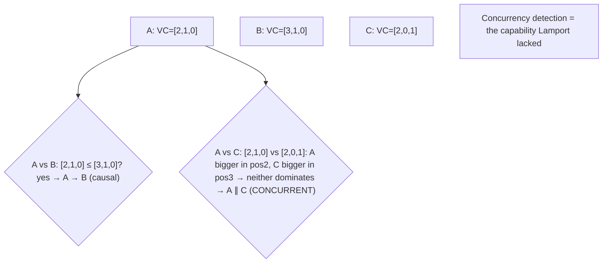
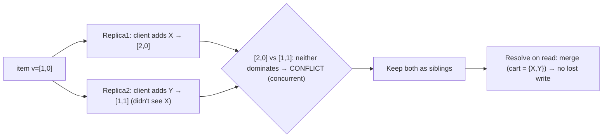

# Lesson 8.2.2 — Vector Clocks and Causal Ordering

> Part 8: Distributed Systems Core · Module 8.2: Time & Ordering · Difficulty: 🔴
>
> **Prerequisites:** [8.2.1 Lamport Timestamps], [8.1.2 Unreliable Clocks], [6.5 Conflict Resolution].
> **Unlocks:** [8.2.3 Happens-Before], [Part 10 Causal Consistency / Conflict Resolution / CRDTs], [9.x Causal messaging].

---

## 1. Learning Objectives

After this lesson you will be able to:

- Explain why **vector clocks** were invented: to fix Lamport's limitation (8.2.1) — they can **detect concurrency**, telling whether two events are **causally ordered** or **concurrent**.
- State and apply the **vector-clock algorithm** (a vector of counters, one per node) and the **comparison rules** that yield `→`, `←`, `=`, or `∥` (concurrent).
- Define **version vectors** (the closely-related mechanism for detecting **conflicting replica writes**) and explain how they enable **conflict detection** in leaderless/multi-leader replication (Part 10) — including **sibling** creation and resolution.
- Reason about the **cost** (O(N) size, growth with cluster membership) and the practical mitigations (dotted version vectors, pruning), and when to choose Lamport vs vector clocks vs CRDTs.

---

## 2. Motivation — Telling "caused by" apart from "happened independently"

Lamport timestamps (8.2.1) give a one-way guarantee (cause < effect) but **cannot tell causality from concurrency** — given two timestamps, you can't know whether one event caused the other or whether they happened independently. For *imposing* an order that's good enough. But for a whole class of critical problems, you must **detect concurrency**: did these two writes to the same key happen **concurrently** (a genuine **conflict** that needs resolving/merging) or did one **causally follow** the other (so the later simply supersedes the earlier)? Getting this wrong is the silent-data-loss trap again (8.1.2, 6.5): if you treat two concurrent writes as ordered and just keep the "bigger timestamp" one, you **lose** the other write.

**Vector clocks** (Fidge/Mattern, 1988) solve exactly this. By having each node track **a counter for every node** (a *vector* instead of a single integer), the resulting timestamps capture the **full happens-before partial order** — and crucially, by comparing two vectors you can determine **precisely** whether `A → B`, `B → A`, `A = B`, or `A ∥ B` (concurrent). This is the missing capability: **concurrency detection**. It's the foundation of **causal consistency** (Part 10), conflict detection in **Dynamo-style leaderless stores** (version vectors → siblings), causal message ordering, and CRDTs (Part 10). The cost is that the timestamp is now O(N) in the number of nodes and grows with membership — a real tradeoff this lesson examines. We develop the algorithm, the comparison that detects concurrency, version vectors and sibling handling, and when each ordering mechanism is the right tool.

---

## 3. Theory — From first principles

### 3.1 The idea: track everyone's progress, not just your own

A Lamport clock is **one integer** — it summarizes "how far along am I" but throws away *who* contributed. A **vector clock** is **a vector of integers, one entry per node** `[CS]`: `VC = [c₁, c₂, …, cₙ]`, where `VC[i]` is "how many events node *i* has done **that this node knows about**." Instead of a single summary, each node carries a **snapshot of its knowledge of every node's progress**. That extra information is exactly what's needed to recover the full causal (partial) order and detect concurrency.

### 3.2 The vector-clock algorithm

Each node `i` keeps a vector `VC` initialized to all zeros `[CS]`:
1. **Local event (incl. send):** node `i` increments **its own** entry: `VC[i] := VC[i] + 1`.
2. **Send:** node `i` attaches its **entire vector** `VC` to the message.
3. **Receive:** when node `i` receives a message with vector `VC_msg`, it takes the **element-wise max** and then increments its own entry:
   `VC[k] := max(VC[k], VC_msg[k])` for all `k`; then `VC[i] := VC[i] + 1`.

So a node's vector accumulates, for each other node, the **highest count it has heard of** from that node (directly or transitively via messages) — its complete causal knowledge.

### 3.3 Comparing vector clocks — detecting causality vs concurrency

Given two vector timestamps `VC(A)` and `VC(B)`, compare **element-wise** `[CS]`:
- **`VC(A) ≤ VC(B)`** (every entry of A ≤ the corresponding entry of B) **and** `A ≠ B` → **`A → B`** (A happens-before B). A's knowledge is a subset of B's; A is in B's causal past.
- **`VC(B) ≤ VC(A)`** and `A ≠ B` → **`B → A`**.
- **`VC(A) = VC(B)`** → the **same event** (or identical knowledge).
- **Neither `≤` holds in either direction** (A has some entry larger, B has some other entry larger) → **`A ∥ B`** — **concurrent**. Each "knows something the other doesn't," so neither could have caused the other.

**This is the payoff:** unlike Lamport, vector clocks let you **definitively classify** any pair of events as ordered (and which way) **or concurrent**. The "neither dominates" case is the **concurrency detection** Lamport couldn't do (8.2.1 §3.4). Vector clocks capture the happens-before partial order **exactly** (Fidge–Mattern): `A → B` **iff** `VC(A) < VC(B)`.

### 3.4 Version vectors — conflict detection for replicated data

A **version vector** is the same mechanism applied to **replica state** to detect **conflicting writes** `[CS]` (the form used in databases — Dynamo, Riak, Voldemort; Part 10):
- Each replica tags a data item's version with a vector tracking **how many updates each replica has applied** that contributed to it.
- When a client reads then writes back, it carries the version vector it saw; the replica compares:
  - **New write's vector dominates the stored one** → it's a **causally newer** update → **overwrite** (no conflict — the writer saw the current state).
  - **Neither dominates** → the two writes are **concurrent** → a **conflict**: they were made without seeing each other.
- **Concurrent writes are not silently discarded.** Instead the system either keeps both as **siblings** (conflicting versions returned together on the next read for the application/client to **resolve/merge**) or applies an automatic resolution (LWW — lossy; or a **CRDT** merge — Part 10). This is how leaderless stores avoid the silent data loss of wall-clock LWW (8.1.2): they **detect** the conflict rather than guessing a winner.

**Example (the shopping-cart classic):** two replicas concurrently add different items to a cart; their version vectors don't dominate → conflict → keep both versions → **merge** (union the carts) on read → no lost item. (Dynamo's canonical example.)

### 3.5 The cost — O(N) size and membership growth

Vector clocks aren't free `[CS]`:
- **Size O(N)** — one entry per node, attached to every message/version. With many nodes this is significant overhead vs Lamport's single integer.
- **Membership growth** — entries accumulate as nodes join; without pruning, vectors grow unbounded over a cluster's lifetime (old, departed nodes' entries linger).
- **Client-driven systems** make it worse — if *clients* (huge in number) are tracked, vectors explode.

**Mitigations** `[BP]`:
- **Track servers/replicas, not clients** — keep N = the (smaller, stable) replica set, not the client population.
- **Dotted version vectors (DVV)** `[EMERGING]` — a refinement (used by Riak) that avoids sibling explosion and represents concurrent client writes compactly.
- **Pruning / coordinated GC** — drop entries for long-departed nodes (carefully, to not lose causality).
- **Use Lamport** where you only need ordering (cheaper), reserving vector/version vectors for where concurrency detection is required (§3.6).

### 3.6 Choosing: Lamport vs vector clocks vs CRDTs vs consensus

`[BP]`
| Need | Mechanism |
|---|---|
| Impose *an* order respecting causality (cheap) | **Lamport** (8.2.1) — one integer |
| **Detect** causality vs concurrency / conflicts | **Vector / version vectors** — O(N) |
| **Automatically merge** concurrent updates (no manual resolution) | **CRDTs** (Part 10) — often *use* version vectors internally |
| Real-time-meaningful timestamps + causality | **HLC** (8.2.4) |
| **Agreement** under failures (one winner, total order, durable) | **Consensus** (8.3) — strongest, costliest |

Vector clocks **detect** conflicts; they don't **resolve** them — resolution is the application's job (siblings) or a CRDT's (automatic merge). And detecting/ordering ≠ **agreement** under failure (consensus, 8.3).

### 3.7 Causal ordering of messages (broader use)

Beyond data conflicts, vector clocks enable **causal ordering of messages/events** `[CS]`: deliver messages in an order consistent with happens-before, so an effect is never delivered before its cause (e.g., don't show a reply before the original comment it answers — a real bug in naive chat/feed systems). A receiver **buffers** a message until all causally-preceding messages (per the vector) have been delivered. This **causal broadcast/delivery** underlies **causal consistency** (Part 10) and correct event ordering in messaging/streaming (Part 9). It's weaker (and cheaper/more-available) than total-order broadcast (consensus) but strong enough to prevent causality-violating anomalies.

---

## 4. Visual Intuition

### Vector clock comparison

### Version-vector conflict → siblings → merge

---

## 5. Real-World Analogy

Recall the numbered-letters analogy from 8.2.1 — but now **each person keeps a little table tracking the highest letter number they've seen *from every correspondent*,** not just their own count.

- So Alice's table might read **"Alice:5, Bob:3, Carol:2"** — meaning "I've written 5 letters, and I've seen up to Bob's #3 and Carol's #2." When she receives Bob's letter showing **"Bob:4, Carol:2"**, she updates her table to the **higher** of each (**Bob:4**) before writing her reply.
- **Detecting causality vs concurrency:** compare two letters' tables. If letter A's table is **entirely ≤** letter B's table, then A is in B's "past" — B was written knowing everything A knew, so **A → B**. But if A's table has a higher Bob-count while B's has a higher Carol-count, then **each was written knowing something the other didn't** — they were written **concurrently**, in ignorance of each other. The single-number scheme (Lamport) could never tell you this; the per-person tables can.
- **Version vectors / the shopping cart:** two store clerks, out of contact, each add an item to a customer's order based on the same starting order. Their tables don't dominate each other → the system sees **"these two updates were made independently"** → instead of throwing one away, it **keeps both and merges them** (the customer gets *both* items) rather than silently losing one.
- **The cost:** the table has a **row per correspondent**, so as the group grows, every letter must carry a bigger and bigger table — which is why you track only the **core correspondents** (servers), not every casual acquaintance (client).

---

## 6. Industry Example

- **Dynamo / Riak / Voldemort version vectors** `[CONV]`: leaderless stores attach version vectors to detect concurrent writes, return **siblings**, and let the application (or a CRDT) merge — the canonical conflict-detection mechanism (§3.4, Part 10). *(Representative.)*
- **The shopping-cart example** `[CS]`: Dynamo's documented case of merging concurrent cart updates to avoid lost items (§3.4). *(Representative.)*
- **Dotted Version Vectors (DVV)** `[EMERGING]`: Riak adopted DVVs to avoid sibling explosion from concurrent client writes (§3.5). *(Representative.)*
- **CRDTs** `[EMERGING]`: conflict-free replicated data types use version-vector-like causal metadata to merge concurrent updates automatically (no manual sibling resolution) — Redis CRDTs, Riak, collaborative editors (Part 10). *(Representative.)*
- **Causal consistency systems** `[EMERGING]`: research/production systems (e.g., COPS-lineage) use causal metadata to enforce causal ordering of operations (§3.7, Part 10). *(Representative.)*

---

## 7. Implementation Details — using vector/version vectors

- **Use a vector with one entry per replica/node** (not per client) to bound size (§3.5) `[BP]`; increment own entry on events, attach the vector on send/write, element-wise-max-then-increment on receive.
- **Compare element-wise** to classify ordered vs **concurrent**, and **never silently discard concurrent writes** — keep **siblings** for resolution or use a **CRDT** to merge automatically (§3.3/3.4).
- **Provide a resolution strategy** for siblings — app-level merge (e.g., union a cart), domain-specific rules, or CRDTs; LWW only if loss is acceptable (§3.4, 8.1.2, 6.5).
- **Bound growth** — track stable replica IDs, prune departed-node entries carefully, consider **DVV** to avoid sibling blowup (§3.5).
- **Use vector clocks for conflict detection / causal ordering; use Lamport where you only need *an* order** (vector clocks cost O(N)) (§3.6).
- **For causal message delivery**, buffer a message until its causal predecessors (per the vector) are delivered — prevents effect-before-cause anomalies (§3.7, Part 9).
- **Don't expect agreement** from vector clocks — for one-winner/total-order/durable decisions use **consensus** (8.3).

---

## 8. Advantages

- **Detects concurrency precisely** — the capability Lamport lacks; classify any pair as ordered or concurrent (§3.3).
- **Captures the full happens-before partial order** (Fidge–Mattern): `A→B` iff `VC(A) < VC(B)` (§3.3).
- **Conflict detection without silent loss** — version vectors surface concurrent writes as siblings to merge, avoiding wall-clock-LWW data loss (§3.4, 8.1.2).
- **Foundation for causal consistency, CRDTs, causal messaging** (§3.7, Part 10/9).
- **No physical clock needed** — skew-proof, like Lamport (8.1.2).

---

## 9. Disadvantages / limitations

- **O(N) size** — one entry per node on every message/version; heavy with many nodes (§3.5).
- **Membership growth** — vectors accumulate entries over cluster lifetime without pruning (§3.5).
- **Detects but doesn't resolve** conflicts — resolution is the app's job (siblings) or a CRDT's (§3.4/3.6).
- **Sibling explosion** — many concurrent (esp. client) writes can produce many siblings (mitigated by DVV) (§3.5).
- **Not consensus** — no agreement/one-winner/durability guarantee under failures (§3.6, 8.3).
- **No real-time meaning** — like Lamport, says nothing about wall-clock time (use HLC — 8.2.4).

---

## 10. When NOT to use vector clocks / limits

- **When you only need *an* order** (not concurrency detection) — use cheaper **Lamport** clocks (§3.6).
- **When you can merge automatically** — **CRDTs** (Part 10) may be simpler than manual sibling resolution.
- **When you need agreement/one-winner** — use **consensus** (8.3), not vector clocks.
- **When N is huge / clients are tracked** — vectors explode; restructure to track replicas only, use DVV, or pick another approach (§3.5).
- **When you need real-time ordering** — use HLC/TrueTime (8.2.4).

---

## 11. Common Mistakes

1. **Using Lamport (or wall-clock) where concurrency detection is required** → silently picking a winner among concurrent writes → lost updates (§3.3/3.4, 8.2.1).
2. **Silently resolving concurrent writes with LWW** instead of keeping siblings/merging → data loss (§3.4, 8.1.2).
3. **Tracking clients in the vector** → unbounded/exploding vector size (§3.5).
4. **No sibling-resolution strategy** → siblings accumulate and the app can't read cleanly (§3.4).
5. **Never pruning** → vectors grow with every node that ever joined (§3.5).
6. **Forgetting element-wise-max on receive** → broken causal tracking (§3.2).
7. **Expecting vector clocks to give agreement** → they detect/order, not agree under failure (§3.6, 8.3).

---

## 12. Interview Questions

**🟢 Easy**
- What problem do vector clocks solve that Lamport timestamps can't?
- How do you tell from two vector clocks whether the events are concurrent?

**🟡 Medium**
- Walk through the vector-clock algorithm (increment/send/receive). Compare `[2,1,0]` and `[1,2,0]` — ordered or concurrent?
- What is a version vector, and how does it prevent the silent data loss of wall-clock LWW?

**🔴 Hard**
- Explain how a leaderless store uses version vectors to create and resolve **siblings** (use the shopping-cart example). When does it overwrite vs conflict?
- What are the costs of vector clocks, and how do dotted version vectors / tracking replicas-not-clients / pruning address them?

**⚫ Staff+**
- Design conflict handling for a multi-region, multi-leader key-value store. Choose among Lamport-LWW, version vectors + siblings, and CRDTs — justify by data type, conflict frequency, and whether automatic merge is possible. Address vector growth and real-time-meaning needs (8.2.4).
- Compare vector clocks (causal *detection*) with consensus (8.3) (total-order *agreement*) for ordering replicated operations. When is causal ordering sufficient (cheaper, more available) and when do you need consensus?

---

## 13. Production Pitfalls

- **Lost updates from LWW where conflicts existed:** concurrent writes resolved by timestamp instead of detected as conflicts → silent data loss (§3.4, 8.1.2) — the exact failure version vectors prevent.
- **Sibling explosion:** high concurrent write volume (especially many clients) produces an explosion of siblings, bloating storage and read complexity (§3.5) — mitigated by DVV.
- **Vector bloat over time:** entries for long-departed nodes never pruned → ever-growing metadata on every value/message (§3.5).
- **Unresolved siblings pile up:** no merge strategy, so reads return growing conflict sets the app can't handle (§3.4).
- **Causal-delivery bug avoided:** without causal ordering, a reply/derived event is delivered before its cause (effect-before-cause) → confusing UX/inconsistency (§3.7) — vector-clock buffering prevents it.
- **Mistaking detection for agreement:** relying on vector clocks to pick a single durable winner under failure → no such guarantee (needs consensus, 8.3).

---

## 14. Optimization Techniques

- **Track replicas, not clients**, to bound N; **prune** departed entries; use **dotted version vectors** to avoid sibling explosion (§3.5) `[BP]`.
- **Use the cheapest sufficient mechanism** — Lamport for ordering, vector/version vectors for conflict detection, CRDTs for auto-merge, consensus for agreement (§3.6).
- **CRDTs** to make concurrent updates **merge automatically** (no manual sibling resolution) where the data type allows (Part 10).
- **Causal delivery via vector buffering** to prevent effect-before-cause anomalies cheaply (vs full consensus ordering) (§3.7).
- **Domain-specific sibling merge** (union sets, max counters, etc.) for correct, automatic resolution (§3.4).

---

## 15. Summary

**Vector clocks** (Fidge/Mattern) fix Lamport's fatal limitation (8.2.1): they can **detect concurrency**. Where a Lamport clock is one integer (summarizing only "how far am I"), a vector clock is **a vector with one counter per node** (`VC[i]` = how many of node *i*'s events this node knows about) — carrying each node's **knowledge of everyone's progress**. The algorithm: **increment your own entry on each event**, **attach the whole vector on send**, and on receive **take the element-wise max then increment your own entry**. Comparing two vectors element-wise classifies any pair **precisely**: if one is `≤` the other (and not equal) it **happens-before** it; if **neither dominates** (each has an entry larger), they are **concurrent (`A∥B`)** — the concurrency detection Lamport couldn't do (formally, `A→B` iff `VC(A) < VC(B)`, capturing the full happens-before partial order). Applied to replicated data, **version vectors** detect **conflicting writes**: a new write whose vector **dominates** the stored one is causally newer (safe overwrite), while writes where **neither dominates** are **concurrent conflicts** — kept as **siblings** for the application (or a **CRDT**) to **merge**, rather than silently discarding one (the wall-clock-LWW data-loss trap — 8.1.2; the Dynamo shopping-cart example unions concurrent cart adds so no item is lost). Vector clocks also enable **causal message delivery** (buffer until causal predecessors arrive → no effect-before-cause), the basis of **causal consistency** (Part 10). The cost is **O(N) size** and **growth with membership**, mitigated by **tracking replicas not clients**, **pruning**, and **dotted version vectors**. Choose by need: **Lamport** for cheap ordering, **vector/version vectors** for conflict *detection*, **CRDTs** for automatic *merge*, **HLC** for real-time + causality (8.2.4), and **consensus** (8.3) for *agreement* under failure — remembering vector clocks **detect and order but do not resolve conflicts or provide agreement**.

---

## 16. Revision Notes (flashcard-ready)

- **Q:** What do vector clocks add over Lamport? **A:** Concurrency detection — distinguish causal (`A→B`) from concurrent (`A∥B`).
- **Q:** What is a vector clock? **A:** A vector of counters, one per node; `VC[i]` = events of node i this node knows about.
- **Q:** The algorithm? **A:** Increment own entry on events; attach full vector on send; on receive element-wise-max then increment own entry.
- **Q:** Comparison rules? **A:** `VC(A) ≤ VC(B)` (≠) → A→B; reverse → B→A; equal → same; neither dominates → concurrent.
- **Q:** Exact property? **A:** `A → B` iff `VC(A) < VC(B)` — captures the full happens-before partial order.
- **Q:** Version vector? **A:** Vector clock applied to replica data versions to detect concurrent (conflicting) writes.
- **Q:** What happens on a detected conflict? **A:** Keep both as siblings to merge (or CRDT auto-merge) — don't silently discard (avoids LWW loss).
- **Q:** Cost? **A:** O(N) per message/version; grows with membership.
- **Q:** Mitigations? **A:** Track replicas not clients, prune departed entries, dotted version vectors (DVV).
- **Q:** Detect vs resolve vs agree? **A:** Vector clocks detect/order; apps/CRDTs resolve; consensus (8.3) agrees under failure.

---

## 17. Further Reading + Knowledge-Graph Links

**Within this platform**
- **Previous:** [8.2.1 Lamport Timestamps] (the limitation this fixes). **Builds on:** [8.1.2 Unreliable Clocks], [6.5 Conflict Resolution / LWW].
- **Next:** [8.2.3 Happens-Before; Total vs Partial Order] (the formal framing). **Then:** [8.2.4 HLC/TrueTime].
- **Enables:** [Part 10 Causal Consistency / Conflict Resolution / CRDTs / version vectors], [Part 9 Causal message ordering], [8.3 Consensus] (when detection isn't enough).

**Foundational texts (synthesized)**
- Fidge (1988) & Mattern (1989) — vector clocks (concept, synthesized).
- DeCandia et al., *Dynamo* — version vectors, siblings, shopping cart (concept, synthesized).
- Kleppmann, *Designing Data-Intensive Applications* — version vectors, concurrent writes, CRDTs (synthesized).
- Shapiro et al., CRDTs (concept, synthesized).

**Concept tags:** `[CS]` vector clock algorithm, element-wise comparison, concurrency detection, version vectors, siblings · `[CONV]` Dynamo/Riak version vectors, shopping-cart merge · `[BP]` track replicas not clients, keep+merge siblings (no silent LWW), prune, choose cheapest sufficient mechanism · `[EMERGING]` dotted version vectors, CRDTs, causal consistency.
