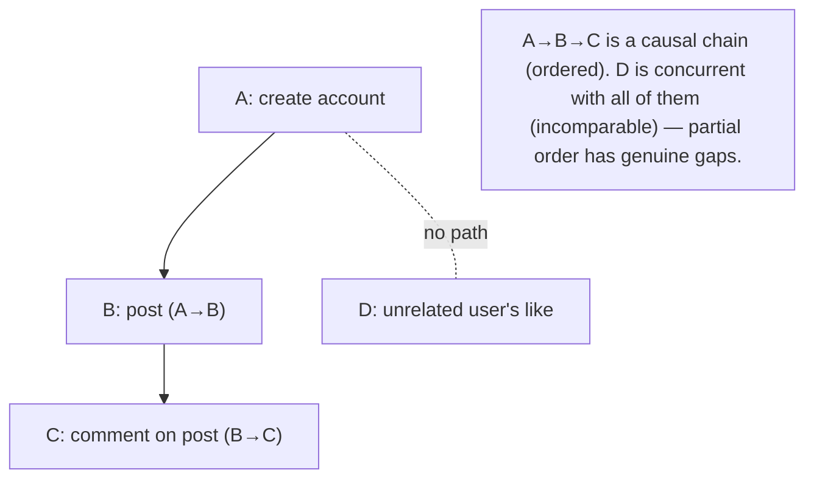
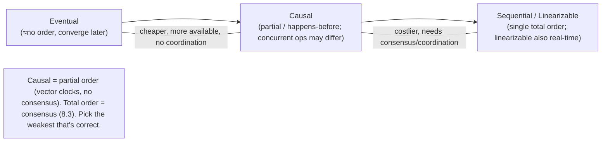

# Lesson 8.2.3 — Happens-Before; Total vs Partial Order

> Part 8: Distributed Systems Core · Module 8.2: Time & Ordering · Difficulty: 🔴
>
> **Prerequisites:** [8.2.1 Lamport], [8.2.2 Vector Clocks], [8.1.2 Unreliable Clocks].
> **Unlocks:** [8.2.4 HLC/TrueTime], [8.3 Consensus / Total-Order Broadcast], [Part 10 Consistency Spectrum].

---

## 1. Learning Objectives

After this lesson you will be able to:

- Define **partial order** vs **total order** precisely, and place **happens-before** (causality) as a **partial** order in which many events are **concurrent**.
- Explain why **causality is naturally partial** (concurrent events are genuinely unordered) and why **imposing a total order requires extra cost** (a tie-break, a sequencer, or consensus).
- Connect ordering strength to **consistency models** (Part 10): **causal consistency** = preserve the partial (happens-before) order; **linearizability/total-order** = a single agreed total order — and why total order is strictly more expensive.
- Map the ordering mechanisms (Lamport, vector clocks, sequencer, consensus/total-order broadcast) to the order they provide, and choose the **weakest order that's correct** for a problem.

---

## 2. Motivation — How much ordering do you actually need?

Lamport (8.2.1) and vector clocks (8.2.2) gave us tools to reason about event order without trusting clocks. This lesson steps back to the **conceptual frame** that makes those tools make sense and that drives a central design decision: **how much ordering does your problem actually require?** Ordering is not one thing — it's a spectrum, and **the strength of ordering you demand directly determines cost and availability.**

The key realization is that **causality is a *partial* order**: in a distributed system, many events genuinely have **no order between them** — they happened independently, neither causing the other (8.2.1's concurrency). Trying to force *every* pair of events into a single line (a **total order**) is **adding information that causality doesn't provide** — and that extra agreement is **expensive**: it needs a tie-break (cheap, arbitrary), a single sequencer (a bottleneck/SPOF), or full **consensus** (8.3 — costly, lower availability). So the design question becomes: do you need to preserve only **cause-before-effect** (the partial, causal order — cheap, highly available, the realm of **causal consistency**), or do you need **everyone to agree on one global sequence** (a total order — expensive, the realm of **linearizability** and **consensus**)? Choosing the **weakest ordering that's still correct** is one of the highest-leverage decisions in distributed design, because it sets your place on the consistency/availability/performance tradeoff (Part 10). This lesson makes partial vs total order rigorous and ties it to the mechanisms and consistency models that the rest of Part 8 and Part 10 develop.

---

## 3. Theory — From first principles

### 3.1 Partial vs total order (the math, briefly)

An **order** is a relation telling you which elements come "before" which `[CS]`:
- **Total order:** **every** pair of elements is comparable — for any A, B (A≠B), either A < B or B < A. There's a single line; nothing is "tied/unordered." (Like the integers: any two differ in order.)
- **Partial order:** **some** pairs are comparable and some are **not** (incomparable). For incomparable A, B, *neither* A < B nor B < A holds. (Like "ancestor of" in a family tree: you're an ancestor of your descendants, but two cousins are incomparable — neither is the other's ancestor.)

Formally both are *reflexive, antisymmetric, transitive*; a total order adds **totality** (every pair comparable). The crucial distinction for us: **a partial order permits incomparable (unordered) elements; a total order does not.**

### 3.2 Happens-before is a partial order

The **happens-before** relation `→` (8.2.1) is a **partial order** on events `[CS]`:
- It's transitive (`A→B`, `B→C` ⇒ `A→C`) and irreflexive/antisymmetric (no cycles — a cause can't follow its effect).
- But it is **not total**: **concurrent** events (`A ∥ B` — neither `A→B` nor `B→A`) are **incomparable**. And concurrency is *common* — independent work on different nodes with no message between them is unordered, and *correctly so*: there is no fact of the matter about which "really" came first when they couldn't have influenced each other (and clocks can't tell us — 8.1.2).

So **causality gives you a partial order, with genuine gaps (concurrency).** Vector clocks (8.2.2) represent this partial order *exactly*; Lamport timestamps **flatten** it into a total order (losing the concurrency info — 8.2.1 §3.4).

### 3.3 Why a total order costs more than a partial order

Causality (the partial order) is **free-ish** — each node can compute it from local events + messages (logical clocks, no coordination). A **total order** — everyone agreeing on one global sequence of *all* events, including concurrent ones — requires **inventing and agreeing** an order for events that causality leaves unordered `[CS]`. That agreement costs:
- **Tie-break (cheapest):** Lamport + node-id (8.2.1 §3.5) gives *a* total order consistent with causality, with **no coordination** — but it's **arbitrary** for concurrent events and only works when *any* consistent order is acceptable (not when you need *the agreed real-world* order).
- **Single sequencer:** route all events through one node that stamps a sequence number → a true total order, but that node is a **bottleneck and SPOF** (and ordering is only as available as it is).
- **Consensus / total-order (atomic) broadcast (8.3):** the nodes *agree* on the order despite failures → robust total order, but **expensive** (multiple round-trips, quorums) and **less available** (can't make progress without a quorum — Part 10/CAP).

**The principle:** **total order requires coordination; partial (causal) order does not.** This is the same coordination cost that bends the USL (7.1) and forces the CAP choice (Part 10). Demanding total order where causal would do **buys correctness you don't need at a steep availability/latency price.**

### 3.4 Ordering strength ↔ consistency models (the bridge to Part 10)

The order you enforce **is** the consistency model `[CS]` (developed fully in Part 10):
- **Eventual consistency:** essentially no ordering guarantee on concurrent ops — replicas converge *eventually*, but readers may see writes in different/odd orders meanwhile. Cheapest, most available.
- **Causal consistency:** preserve the **happens-before partial order** — everyone sees causally-related operations in causal order, but **concurrent operations may be seen in different orders** by different nodes. Achievable **without consensus** (via vector clocks / causal broadcast — 8.2.2 §3.7) → highly available, no coordination on concurrent ops. The "sweet spot" for many systems (prevents the weird anomalies — reply-before-comment — without total-order cost).
- **Sequential consistency / linearizability:** a **single total order** all nodes agree on (linearizability also respects real-time order). Requires **consensus/coordination** (8.3) → strongest, most expensive, least available under partition.

So **"how much order?" = "which consistency model?"**, and the partial-vs-total distinction is the hinge: **causal = partial order (cheap, available); linearizable = total order (expensive, coordination).**

### 3.5 Total-order (atomic) broadcast — the canonical total-order primitive

The standard way to *deliver* a total order across nodes is **total-order broadcast (atomic broadcast)** `[CS]`: all nodes deliver the **same set of messages in the same order**. It's equivalent in power to **consensus** (8.3) — you can build each from the other — which is precisely *why* total order is expensive (it needs consensus). It underpins **state-machine replication** (all replicas apply the same operations in the same order → identical state — Part 10) and ordered logs (Kafka-style partitions give total order *within a partition* — Part 9). The takeaway: **whenever you need a single agreed total order of operations, you're implicitly invoking consensus** (8.3).

### 3.6 Choosing the weakest correct order

The design discipline `[BP]`:
1. **Identify the real constraints.** Which operations *must* be ordered relative to which? Often the answer is "only causally-related ones" (a post must precede its comments; unrelated users' posts need no mutual order).
2. **Use the weakest order that preserves correctness** — partial/causal if concurrent operations can be safely unordered (or merged — CRDTs, Part 10); total order **only** where you truly need a single agreed sequence (e.g., a ledger's transaction order, leader election, a uniqueness constraint).
3. **Pay for total order surgically** — confine consensus/total-order to the small core that needs it (e.g., a single sharded log, a metadata service) rather than globally; let the rest run causally/eventually (the architecture of most scalable systems).

This mirrors 1.1.5 (tradeoffs) and 7.1 (minimize coordination): **don't buy total order globally when causal order locally suffices.**

---

## 4. Visual Intuition

### Partial order (causality) with concurrency

### The order/cost/consistency spectrum

---

## 5. Real-World Analogy

Think of compiling **the official history of a big organization** from everyone's diaries.

- **Partial order (causality):** you can confidently say "the merger proposal (event A) came before the board's approval of it (event B)" because B *references* A — a cause before its effect. But "the Tokyo office's hire (event X) vs the London office's product launch (event Y), same week, unrelated" — there's **no meaningful 'which came first.'** They're **concurrent**; the history honestly leaves them unordered. That's a **partial order**, and it's the *truthful* one.
- **Total order:** if a publisher insists the history be **one single numbered timeline** with *every* event in a strict sequence, you now must **decide** an order for X and Y even though nothing connects them. To do that you either: flip a coin with a fixed rule (tie-break — arbitrary but consistent), appoint **one archivist** to number everything as it arrives (a bottleneck — and if they're out sick, no numbering happens), or get **all the offices to vote and agree** on the sequence (consensus — slow, and stalls if offices can't reach each other).
- **The lesson:** forcing a single timeline (total order) where the truth is "these were independent" (partial order) **costs real coordination** and buys precision you may not need. For most purposes, "causally-related events are in the right order, independent ones in any consistent order" (causal consistency) is plenty — and far cheaper. You only pay for the single authoritative timeline where it genuinely matters, like the **official ledger of financial transactions**, where one agreed order is non-negotiable.

---

## 6. Industry Example

- **Causal consistency in datastores** `[EMERGING]`: systems offering causal consistency (COPS-lineage; some modes of MongoDB/Cosmos DB) preserve happens-before without paying full consensus cost — the partial-order sweet spot (§3.4, Part 10). *(Representative.)*
- **Total-order broadcast = consensus** `[CS]`: state-machine replication (Raft/Paxos logs — 8.3) delivers a total order of operations so replicas stay identical; Kafka gives total order **within a partition** (Part 9). *(Representative.)*
- **Lamport tie-break total order** `[CONV]`: total-order multicast via Lamport+node-id where *any* consistent order suffices (8.2.1 §3.5). *(Representative.)*
- **CRDTs avoid ordering concurrent ops** `[EMERGING]`: by making concurrent updates **commutative/mergeable**, CRDTs sidestep the need to *order* them at all — embracing the partial order (Part 10). *(Representative.)*
- **Confining total order** `[BP]`: scalable systems run most operations causally/eventually and reserve consensus/total-order for a small core (leader election, metadata, a single ledger/log) (§3.6, 8.3.8). *(Representative.)*

---

## 7. Implementation Details — applying ordering choices

- **Map each ordering need to a mechanism** (§3.4): no-order → eventual; **partial/causal** → vector clocks / causal broadcast (8.2.2); **total** → Lamport+tie-break (if any consistent order is OK) / single sequencer / **consensus** (8.3) `[BP]`.
- **Default to the weakest order that's correct** — usually causal; reserve total order for the operations that truly need a single agreed sequence (§3.6).
- **Confine total order / consensus to a small core** (leader election, metadata, a single ledger/log) and let the bulk run causally/eventually for availability and scale (§3.6, 8.3.8).
- **Use CRDTs** where concurrent operations can be made commutative/mergeable — then you don't need to order them at all (Part 10).
- **Recognize "I need a single agreed order" = "I need consensus"** (8.3/§3.5) and budget its cost (latency, quorum availability) accordingly.
- **Don't fake total order with timestamps** — wall-clock can't (8.1.2); Lamport gives *a* consistent order but not *the agreed real-world* one and can't detect concurrency.

---

## 8. Advantages

- **Right-sized coordination** — choosing partial vs total order tunes the cost/availability tradeoff to the actual requirement (§3.3/3.6).
- **Causal (partial) order is cheap & available** — no consensus, no coordination on concurrent ops; prevents key anomalies (reply-before-comment) (§3.4).
- **Total order is robust where needed** — a single agreed sequence enables state-machine replication, ledgers, uniqueness (§3.5).
- **Clear consistency mapping** — the order you pick *is* the consistency model, making the tradeoff explicit (§3.4, Part 10).
- **Scalability** — confining total order to a small core lets the rest scale (§3.6, 7.1).

---

## 9. Disadvantages / hard realities

- **Total order requires coordination** — tie-break (arbitrary), sequencer (bottleneck/SPOF), or consensus (expensive, lower availability) (§3.3).
- **Causal order has limits** — it doesn't give a single agreed sequence; insufficient where one is required (ledgers, uniqueness) (§3.4).
- **Concurrency is unavoidable** — many events are genuinely unordered; you must *handle* concurrency (merge/siblings/CRDT), not wish it away (§3.2, 8.2.2).
- **Mismatched choice is costly** — total order where causal suffices wastes availability/latency; causal where total is needed risks incorrectness (§3.6).
- **Conceptual difficulty** — partial orders and "no single now" are unintuitive coming from single-machine thinking.

---

## 10. When NOT to / limits

- **Don't impose total order globally** when only causal (or no) order is required — you pay consensus cost for nothing (§3.6).
- **Don't rely on causal/partial order** where a single agreed sequence is mandatory (financial ledger order, leader uniqueness) — use consensus (§3.4/3.5).
- **Don't use a single sequencer** if it becomes a scale bottleneck/SPOF you can't tolerate — shard or use distributed consensus (§3.3).
- **Don't use wall-clock timestamps** to fake a total order — skew makes it wrong (8.1.2).
- **Don't force-order concurrent ops** when they can be made commutative (CRDTs) — embrace the partial order (Part 10).

---

## 11. Common Mistakes

1. **Assuming a global "now"/single order exists** — single-machine intuition; concurrency means many events are unordered (§3.2).
2. **Demanding total order (consensus) where causal suffices** — needless coordination cost and reduced availability (§3.6).
3. **Using causal/eventual order where a total order is required** — e.g., ledger entries or uniqueness without consensus → incorrectness (§3.4).
4. **Faking total order with timestamps** — wall-clock skew (8.1.2) or Lamport-can't-detect-concurrency (8.2.1) (§3.6).
5. **Single sequencer as an unexamined bottleneck/SPOF** (§3.3).
6. **Not recognizing "agreed single order" ⇒ consensus** and under-budgeting its cost (§3.5, 8.3).
7. **Trying to eliminate concurrency** instead of handling it (merge/CRDT/siblings) (§3.2, 8.2.2).

---

## 12. Interview Questions

**🟢 Easy**
- What's the difference between a total order and a partial order? Give an example of each.
- Why is happens-before a partial, not total, order?

**🟡 Medium**
- Why does imposing a total order cost more than preserving causal (partial) order? What are the three ways to get a total order?
- How does ordering strength map to consistency models (eventual / causal / linearizable)?

**🔴 Hard**
- Why is total-order broadcast equivalent to consensus, and what does that imply about the cost of a single agreed order?
- Design ordering for a social app (posts, comments, likes across users). Where is causal order sufficient and where (if anywhere) do you need total order? Justify.

**⚫ Staff+**
- For a system with a financial ledger, user activity feeds, and collaborative documents, assign each subsystem an ordering/consistency level (eventual/causal/total), justify by correctness needs, and explain how confining total order to the ledger keeps the rest scalable and available (§3.6, Part 10).
- Explain how state-machine replication uses total-order broadcast, why that needs consensus, and how a system might offer causal consistency for most operations while using consensus only for a small linearizable core (e.g., a metadata/leader service).

---

## 13. Production Pitfalls

- **Over-coordination:** a system used consensus/total order for *all* operations, crippling availability and latency, when most operations only needed causal order (§3.6) — a common over-engineering failure.
- **Under-ordering a ledger:** financial/uniqueness operations relied on eventual/causal order without a single agreed sequence → conflicting/duplicated entries (§3.4) — required consensus.
- **Timestamp total-order bug:** built a "global order" from wall-clock timestamps; skew produced a wrong/inconsistent sequence across nodes (8.1.2, §3.6).
- **Sequencer bottleneck/SPOF:** routed everything through one sequencer for total order; it capped throughput and took the system down when it failed (§3.3).
- **Causality-violating UX:** no causal ordering → a reply/derived event shown before its cause; users see effects before causes (§3.4, 8.2.2).
- **Concurrency denial:** designed assuming events have a single true order; real concurrent updates produced lost data because they weren't merged (§3.2, 8.2.2).

---

## 14. Optimization Techniques

- **Choose the weakest correct order** — eventual/causal where possible; total order only where required (§3.6) `[BP]`.
- **Causal consistency via vector clocks/causal broadcast** — strong-enough ordering without consensus cost (§3.4, 8.2.2).
- **Confine total order/consensus to a small core** (ledger/metadata/leader) so the rest scales (§3.6, 8.3.8).
- **CRDTs for commutative concurrent ops** — avoid ordering them entirely (Part 10).
- **Lamport+tie-break** for a cheap total order when *any* consistent order is acceptable (8.2.1).
- **Partition for local total order** — Kafka-style per-partition total order avoids global consensus (Part 9).

---

## 15. Summary

Ordering is a **spectrum**, and the strength you demand sets your cost and availability. A **total order** makes **every** pair of events comparable (a single line); a **partial order** allows **incomparable (unordered)** pairs. **Happens-before (causality)** is a **partial order**: it orders causally-related events (`A→B`) but leaves **concurrent** events (`A∥B`) genuinely **unordered** — and concurrency is common and *correct* (independent events on different nodes have no fact-of-the-matter order, and clocks can't supply one — 8.1.2). **Vector clocks** represent this partial order exactly; **Lamport** flattens it into a total order (losing concurrency info). The pivotal fact: **causality (the partial order) is cheap and coordination-free**, but a **total order** — agreeing a single global sequence including the concurrent events causality leaves unordered — **requires coordination**: a **tie-break** (cheap but arbitrary, only when any consistent order is OK), a **single sequencer** (a bottleneck/SPOF), or **consensus** (8.3 — robust but expensive and less available). Indeed **total-order (atomic) broadcast is equivalent to consensus**, which is *why* a single agreed order is costly and underpins state-machine replication. This maps directly onto **consistency models** (Part 10): **eventual** (≈no order, cheapest/most available), **causal** (preserve the happens-before **partial** order — achievable **without consensus**, the sweet spot that prevents anomalies like reply-before-comment while staying highly available), and **sequential/linearizable** (a single **total** order — requires **consensus/coordination**, strongest and most expensive). The design discipline is to **choose the weakest order that's still correct**: use causal where concurrent operations can be safely unordered (or merged via CRDTs), and **confine total order/consensus to the small core that truly needs one agreed sequence** (a ledger, leader election, uniqueness) so the rest of the system scales and stays available. Recognizing that **"I need one agreed order" means "I need consensus"** — and not paying for it where causal suffices — is one of the highest-leverage decisions in distributed design.

---

## 16. Revision Notes (flashcard-ready)

- **Q:** Total vs partial order? **A:** Total = every pair comparable (one line); partial = some pairs incomparable (unordered).
- **Q:** Is happens-before total or partial? **A:** Partial — concurrent events are incomparable (genuinely unordered).
- **Q:** Why is causality "free" but total order costly? **A:** Causality is computed locally (logical clocks, no coordination); total order needs agreement on the order of concurrent events.
- **Q:** Three ways to get a total order? **A:** Tie-break (arbitrary, cheap), single sequencer (bottleneck/SPOF), consensus (robust, expensive).
- **Q:** Ordering ↔ consistency? **A:** Eventual (≈none) → Causal (partial/happens-before, no consensus) → Sequential/Linearizable (total order, needs consensus).
- **Q:** What's the causal-consistency sweet spot? **A:** Preserve happens-before without consensus → highly available, prevents reply-before-comment anomalies; concurrent ops may differ across nodes.
- **Q:** Total-order broadcast relates to? **A:** Equivalent to consensus — hence expensive; basis of state-machine replication.
- **Q:** Design rule? **A:** Use the weakest order that's correct; confine total order/consensus to a small core (ledger/leader/metadata).
- **Q:** "I need one agreed order" means? **A:** I need consensus (8.3) — budget its latency/availability cost.
- **Q:** How to avoid ordering concurrent ops? **A:** Make them commutative/mergeable (CRDTs) — embrace the partial order.

---

## 17. Further Reading + Knowledge-Graph Links

**Within this platform**
- **Previous:** [8.2.2 Vector Clocks] (represent the partial order exactly). **Builds on:** [8.2.1 Lamport] (flattens to total order), [8.1.2 Clocks].
- **Next:** [8.2.4 HLC/TrueTime]. **Then:** [8.3 Consensus / Total-Order Broadcast] (how total order is actually achieved).
- **Enables:** [Part 10 Consistency Spectrum] (causal vs linearizable), [9.x ordered logs/partitions], [7.1 minimize coordination].

**Foundational texts (synthesized)**
- Lamport (1978) — happens-before, partial order (concept, synthesized).
- Kleppmann, *Designing Data-Intensive Applications* — ordering, total-order broadcast, consistency models (synthesized).
- Birman et al. — causal/atomic broadcast (concept, synthesized).

**Concept tags:** `[CS]` partial vs total order, happens-before as partial order, total-order-broadcast = consensus, ordering↔consistency · `[CONV]` Lamport tie-break total order, per-partition total order · `[BP]` weakest correct order, confine total order to a small core, CRDTs for concurrent ops · `[EMERGING]` causal consistency.
