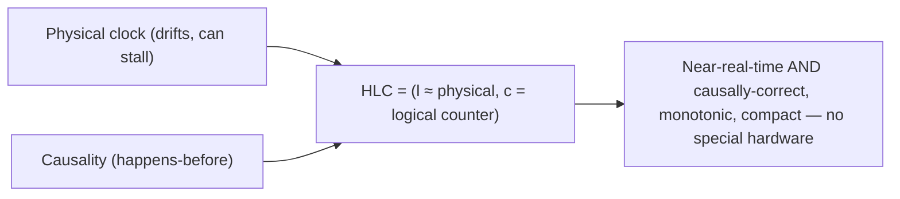
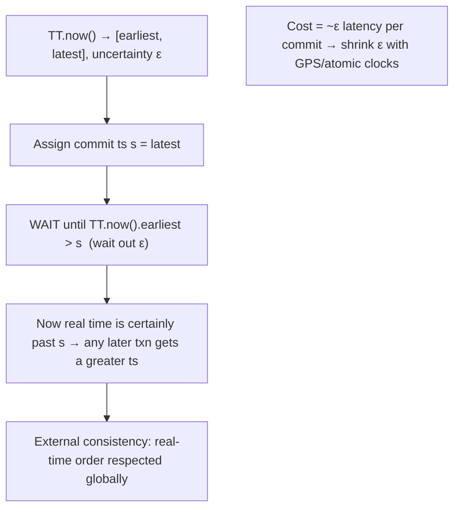

# Lesson 8.2.4 — Hybrid Logical Clocks and TrueTime-Style Approaches

> Part 8: Distributed Systems Core · Module 8.2: Time & Ordering · Difficulty: 🔴⚫
>
> **Prerequisites:** [8.1.2 Unreliable Clocks], [8.2.1 Lamport], [8.2.2 Vector Clocks], [8.2.3 Total vs Partial Order].
> **Unlocks:** [8.3 Consensus], [Part 10 Linearizability/External Consistency], [Part 18 Spanner/Cockroach case studies].

---

## 1. Learning Objectives

After this lesson you will be able to:

- Explain the gap each approach fills: **logical clocks** capture causality but have **no real-time meaning**; **physical clocks** have real-time meaning but are **untrustworthy** (8.1.2). **Hybrid Logical Clocks (HLC)** and **TrueTime** bridge the two.
- Describe **HLC**: combine a physical-time component with a logical counter so timestamps are **close to real time *and* respect causality**, with bounded divergence from physical time.
- Describe **TrueTime** (Google Spanner): instead of pretending the clock is exact, **expose clock uncertainty as an interval `[earliest, latest]`** and **"commit-wait"** out the uncertainty to achieve **external consistency** (linearizability w.r.t. real time) for globally-distributed transactions.
- Reason about the **cost/benefit and applicability** of each (HLC needs no special hardware; TrueTime needs tight clock sync — GPS/atomic) and where each fits (CockroachDB/Yugabyte/Mongo vs Spanner).

---

## 2. Motivation — Getting both real-time meaning AND correct ordering

We've now seen the two poles. **Logical clocks** (Lamport 8.2.1, vector 8.2.2) order events by **causality** and are **immune to clock skew** — but a logical timestamp like "47" has **no relation to wall-clock time**: you can't ask "did this happen around 3pm?" or "is this version older than 5 minutes?" **Physical clocks** (8.1.2) *do* mean real time — but they **drift, skew, and can step**, so you can't trust them to order events or guarantee correctness. Real systems frequently need **both**: a globally-distributed database wants timestamps that (a) are **meaningful as real time** (for TTLs, debugging, "as-of" queries, MVCC snapshots — 5.2.4) *and* (b) **respect causality / give a correct order** (so transactions and reads are consistent). Neither pure logical nor pure physical clocks deliver both.

Two influential designs close this gap, and they represent two philosophies. **Hybrid Logical Clocks (HLC)** *combine* a physical-time component with a small logical counter, yielding timestamps that **track real time closely** yet **never violate causality** — all in software, **no special hardware**, which is why CockroachDB, YugabyteDB, and MongoDB use HLC. **TrueTime** (Google Spanner) takes the opposite tack: instead of hiding clock error, it **measures and exposes the uncertainty** as a bounded interval, then **waits out that uncertainty** ("commit-wait") to deliver **external consistency** (a real-time-respecting total order) for global transactions — but it requires **tightly-synchronized clocks** (GPS + atomic clocks in every datacenter). This lesson explains both, their guarantees, costs, and when each is the right tool — the capstone of the time-and-ordering module and a direct bridge to Spanner/Cockroach in the case studies (Part 18) and to linearizability (Part 10).

---

## 3. Theory — From first principles

### 3.1 The gap: logical vs physical, restated

`[CS]`
- **Logical clocks** (8.2.1/8.2.2): track **causality** (happens-before), **skew-immune**, but **no real-time meaning** — can't be compared to wall-clock time, can't answer "how old?" or "around when?".
- **Physical clocks** (8.1.2): mean **real time**, but **drift/skew/step** → can't be trusted to **order** events or enforce **correctness**.
- **The want:** timestamps that are **both** near-real-time **and** causally correct. HLC and TrueTime are the two answers.

### 3.2 Hybrid Logical Clocks (HLC)

**HLC** (Kulkarni et al.) produces a timestamp with **two parts**: a **physical component `l`** (close to the node's physical clock) and a **logical counter `c`** (a small integer to break ties / preserve causality when physical time doesn't advance) `[CS]`/`[EMERGING]`. The algorithm keeps `l` close to the wall clock while ensuring HLC timestamps **respect happens-before** (like a Lamport clock) — essentially "a Lamport clock that stays anchored to physical time."

Sketch of the update rules (per node, on each event/message — conceptually):
- **Local/send event:** set `l' = max(l, physical_now)`. If `l'` advanced past the old `l` (physical time moved forward), reset `c = 0`; else (physical clock didn't advance) increment `c` to keep timestamps strictly increasing. The timestamp is `(l', c)`.
- **Receive (message has `(l_m, c_m)`):** set `l' = max(l, l_m, physical_now)`, and set `c` appropriately (max of the relevant counters + 1 when needed) so the receive is causally after both the local history and the message — exactly the Lamport `max`-style rule, but anchored to physical time.

**Guarantees** `[CS]`:
- **Respects causality:** if `A → B` then `HLC(A) < HLC(B)` (the Lamport clock condition — 8.2.1).
- **Close to physical time:** the physical component `l` stays within a **bounded offset** of true physical time (bounded by clock skew), so HLC timestamps are **meaningful as approximate wall-clock time** and **monotonic per node**.
- **Compact:** ~one 64-bit value (physical bits + a small logical counter) — far cheaper than vector clocks (8.2.2), though, like Lamport, it gives an *order*, not concurrency *detection*.

**Why it's great in practice** `[BP]`: you get **causally-correct, near-real-time, monotonic** timestamps **without any special hardware** — usable for MVCC versions (5.2.4), "as-of"/snapshot reads, TTLs, debugging, and ordering — which is why **CockroachDB, YugabyteDB, and MongoDB** adopted HLC.

### 3.3 TrueTime — embrace and bound the uncertainty

Google **Spanner's TrueTime** takes the opposite philosophy: **don't pretend the clock is a point; admit it's uncertain, and bound that uncertainty tightly** `[CS]`/`[EMERGING]`:
- TrueTime's API returns not a single time but an **interval**: `TT.now() → [earliest, latest]`, **guaranteeing the true time is somewhere in that interval**. The interval width is the **uncertainty** `ε` (epsilon).
- This requires **tightly-synchronized clocks** — Spanner deploys **GPS receivers and atomic clocks** in every datacenter so `ε` is **small and bounded** (typically a few milliseconds, often <10ms — *illustrative*), and crucially **known** (the system *knows* its uncertainty rather than guessing).

### 3.4 Commit-wait — turning bounded uncertainty into external consistency

The payoff of knowing `ε` is **external consistency** (a.k.a. **linearizability w.r.t. real time** — Part 10): if transaction T1 commits before T2 *starts* in real time, then T1's timestamp < T2's timestamp — a **globally consistent, real-time-respecting total order** `[CS]`. Spanner achieves it with **commit-wait**:
- To commit a transaction, Spanner assigns it a timestamp `s = TT.now().latest` and then **waits until `TT.now().earliest > s`** — i.e., it **waits out the uncertainty interval `ε`** before releasing the commit.
- After this wait, **every node is certain that real time has passed `s`** — so any later transaction (anywhere) will get a strictly greater timestamp. This guarantees the timestamps **order transactions consistently with real time across the globe**, with **no coordination between the transactions** beyond the wait.
- **Cost:** every commit pays a **latency penalty of ~`ε`** (the commit-wait). So **smaller `ε` = faster commits** — which is *why* Spanner invests in GPS/atomic clocks to shrink `ε`. The whole design **converts clock uncertainty into commit latency**, then minimizes that uncertainty with hardware.

**The elegance:** instead of logical clocks (no real time) or naive physical clocks (unsafe), TrueTime makes **physical time safe for ordering** by *measuring its error and waiting it out* — buying **external consistency** for global transactions at the price of a small, bounded latency and special hardware.

### 3.5 HLC vs TrueTime — the tradeoff

`[BP]`
| | HLC | TrueTime |
|---|---|---|
| Approach | combine physical + logical counter | expose + bound clock uncertainty, wait it out |
| Hardware | none (software, any NTP) | GPS + atomic clocks (tight sync) |
| Guarantee | causal order + near-real-time timestamps | **external consistency** (real-time-respecting total order) |
| Cost | negligible (compact timestamp) | commit-wait latency ≈ `ε` per transaction |
| Concurrency detection | no (gives order, like Lamport) | n/a (provides a total order via consensus + time) |
| Used by | CockroachDB, YugabyteDB, MongoDB | Google Spanner |

- **HLC** gives you **causally-correct, near-real-time timestamps cheaply and anywhere** — but **not** by itself the strong **external-consistency** guarantee TrueTime provides (systems like CockroachDB combine HLC with consensus and bounded-clock-uncertainty waits/retries to approximate strong guarantees without GPS hardware).
- **TrueTime** gives the **strongest real-time ordering guarantee** but **requires the hardware investment** and pays **commit-wait latency**. It still uses **consensus (Paxos)** for replication (8.3) — TrueTime handles *ordering/timestamps*, not agreement.

### 3.6 Where these fit in the bigger picture

`[CS]`
- Both are about **timestamping/ordering**, **not consensus** (8.3) — Spanner still runs Paxos for replication; CockroachDB still runs Raft. Time helps *order*; consensus provides *agreement/durability*. They're complementary.
- They enable **strongly-consistent, globally-distributed databases** (NewSQL — 5.4.1) — the previously "impossible" combination of ACID + horizontal scale + global distribution — by making timestamps trustworthy enough to order transactions across the world.
- They sit at the **top of the time/ordering stack**: Lamport (order, no concurrency detection, no real time) → vector clocks (concurrency detection, no real time) → **HLC** (order + near-real-time) → **TrueTime** (external consistency via bounded uncertainty). Choose by what you need: causality only (logical), conflict detection (vector), real-time-meaningful order (HLC), or external consistency for global transactions (TrueTime).

---

## 4. Visual Intuition

### HLC = physical anchor + logical tiebreaker

### TrueTime commit-wait

---

## 5. Real-World Analogy

Recall the offices with drifting wall clocks (8.1.2) and the numbered-letters scheme (8.2.1).

- **HLC** is like stamping each memo with **both the wall-clock time *and* a small sequence letter** — "10:03a, 10:03b, 10:03c" — where the clock part keeps memos **roughly tied to real time** (so "around 10am" is meaningful) and the little letter **breaks ties and preserves order** when two memos share the same minute or when the clock briefly stalls. You get memos that read like real times **and** never put a reply before the memo it answers — using only ordinary office clocks (no atomic-clock budget).
- **TrueTime** is like every office admitting "**our clock could be off by up to 5 minutes**" and saying so explicitly — and then, before **finalizing** any official decision, **waiting 5 minutes** so they're **certain** real time has moved past the stamped moment. Now if Tokyo finalizes a deal before London even *starts* theirs, Tokyo's stamp is **guaranteed** earlier — a globally trustworthy order. The price: every decision is delayed by the **uncertainty window**, so the offices spend heavily on **super-accurate clocks (GPS/atomic)** to shrink that window from 5 minutes to a few *milliseconds* — making the wait negligible.
- **The contrast:** HLC says "stamp with approximate-time-plus-a-counter, cheap and good enough for order." TrueTime says "know exactly how wrong your clock might be, and wait it out for an *ironclad* real-time order — and pay to make the wait tiny."

---

## 6. Industry Example

- **Google Spanner / TrueTime** `[EMERGING]`: GPS + atomic clocks bound uncertainty; commit-wait delivers **external consistency** for globally-distributed ACID transactions — the canonical "embrace bounded uncertainty" system (§3.3/3.4, Part 18). *(Representative.)*
- **CockroachDB / YugabyteDB** `[EMERGING]`: use **HLC** + Raft consensus + bounded-clock-offset handling to provide strong consistency **without** GPS hardware (commodity clouds) — accepting occasional restarts/uncertainty waits instead (§3.2/3.5, Part 18). *(Representative.)*
- **MongoDB** `[CONV]`: uses HLC-style cluster time for causally-consistent sessions and ordering (§3.2). *(Representative.)*
- **Time helps order, consensus provides agreement** `[CS]`: Spanner still runs **Paxos**, Cockroach runs **Raft** (8.3) — the clock work is complementary to consensus (§3.6). *(Representative.)*
- **NewSQL feasibility** `[CS]`: HLC/TrueTime are a key reason ACID + horizontal scale + global distribution became practical (5.4.1, §3.6). *(Representative.)*

---

## 7. Implementation Details — choosing and using

- **Use HLC** when you need **causally-correct, near-real-time, monotonic** timestamps on **commodity infrastructure** — MVCC versions, snapshot/"as-of" reads, ordering, debugging — with no special hardware (§3.2) `[BP]`.
- **Use TrueTime-style (bounded uncertainty + commit-wait)** when you need **external consistency** for **globally-distributed transactions** and can invest in **tight clock sync** (GPS/atomic, or a managed offering) — accepting **commit-wait latency ≈ ε** (§3.3/3.4).
- **Shrink `ε`** (better clock sync) to reduce commit-wait latency — the central TrueTime performance lever (§3.4).
- **Remember these order, they don't agree** — pair with **consensus** (Paxos/Raft — 8.3) for replication/agreement; HLC/TrueTime handle timestamps, not durability/agreement (§3.6).
- **On commodity clouds without TrueTime**, expect **uncertainty-wait or transaction-restart** mechanisms (CockroachDB-style) to bound clock offset; **monitor clock offset** and fence out badly-skewed nodes (8.1.2).
- **Don't use raw NTP timestamps** for transaction ordering thinking they're "good enough" — without bounding/handling uncertainty you reintroduce the skew bugs (8.1.2); HLC or bounded-uncertainty is the safe path.

---

## 8. Advantages

**HLC:** causal correctness + near-real-time meaning + monotonic + compact; **no special hardware**; cheap; usable for MVCC/snapshots/TTLs/ordering; works on any cloud.

**TrueTime:** **external consistency** (the strongest real-time ordering) for global transactions; enables globally-distributed ACID at scale; uncertainty is **known and bounded**, not guessed.

**Both:** make physical-ish timestamps **trustworthy enough to order**, bridging the logical/physical gap; complementary to consensus; foundational to NewSQL global databases.

---

## 9. Disadvantages / limitations

- **HLC:** gives *order*, not **concurrency detection** (like Lamport — use vector clocks for that); not by itself the ironclad external-consistency guarantee of TrueTime; bounded only as well as clock skew is bounded.
- **TrueTime:** requires **special hardware** (GPS/atomic) or a managed equivalent; **commit-wait latency** on every transaction (≈ε); operationally heavy; if `ε` grows (clock sync degrades), latency grows or correctness mechanisms kick in.
- **Both:** **not consensus** — still need Paxos/Raft for agreement/durability (§3.6); add conceptual/operational complexity; depend on **clock-offset monitoring** to stay safe.

---

## 10. When NOT to use / limits

- **Don't need real-time meaning?** Plain **logical clocks** (Lamport/vector) suffice and are simpler (§3.1, 8.2.1/8.2.2).
- **Need concurrency *detection*?** Use **vector/version vectors** — HLC/TrueTime give order, not concurrency detection (8.2.2).
- **No global/strong-consistency requirement?** Don't pay TrueTime's hardware + commit-wait cost; HLC or even eventual/causal may be enough (8.2.3, Part 10).
- **Can't sync clocks tightly?** TrueTime isn't available; use HLC + consensus + uncertainty handling (CockroachDB model) (§3.5).
- **Don't substitute for consensus** — timestamps order, consensus agrees; you need both for a strongly-consistent replicated DB (§3.6, 8.3).

---

## 11. Common Mistakes

1. **Using raw NTP timestamps to order transactions** thinking they're accurate enough → skew bugs (8.1.2); use HLC or bounded uncertainty (§3.7).
2. **Expecting HLC to detect concurrency** — it gives order, not concurrency detection (use vector clocks) (§3.2).
3. **Thinking TrueTime/HLC replaces consensus** — they order; consensus agrees (still need Paxos/Raft) (§3.6).
4. **Ignoring commit-wait cost** — under-budgeting the ≈ε latency per transaction in a TrueTime system (§3.4).
5. **Letting `ε` grow unmonitored** — degraded clock sync silently raises latency or triggers restarts (§3.4/3.5).
6. **Assuming you need TrueTime** when causal/HLC consistency suffices — over-engineering with hardware cost (§3.5, 8.2.3).
7. **Not monitoring clock offset** on commodity-cloud HLC systems → unsafe skew goes undetected (8.1.2).

---

## 12. Interview Questions

**🟢 Easy**
- What does a Hybrid Logical Clock combine, and what does it give you that a pure logical clock doesn't?
- What does TrueTime return instead of a single timestamp, and why?

**🟡 Medium**
- How does HLC stay close to real time while still respecting causality? Why no special hardware?
- Explain commit-wait: how does waiting out clock uncertainty give external consistency, and what's the cost?

**🔴 Hard**
- Compare HLC and TrueTime: hardware, guarantee, cost, and which systems use each. When would you choose one over the other?
- Why do Spanner (TrueTime) and CockroachDB (HLC) *still* need Paxos/Raft? What does time do vs what does consensus do?

**⚫ Staff+**
- Design the timestamping/ordering layer for a new globally-distributed SQL database targeting commodity clouds (no GPS clocks). How would you use HLC + consensus + bounded clock offset to provide strong consistency, what guarantee can you offer vs Spanner's external consistency, and how do you handle clock skew safely?
- Explain how TrueTime converts clock *uncertainty* into commit *latency*, why minimizing `ε` is the key performance lever, and the failure/latency implications if clock synchronization degrades. Contrast the operational tradeoffs with an HLC-based system.

---

## 13. Production Pitfalls

- **NTP-timestamp ordering bug:** ordering transactions/versions by raw wall-clock timestamps → skew produces wrong order / anomalies (8.1.2) — the bug HLC/TrueTime exist to prevent.
- **Commit-wait latency surprise:** a TrueTime-style system's per-commit latency rises when clock sync degrades (`ε` grows) — a subtle, infrastructure-driven slowdown (§3.4).
- **Clock-offset breach on commodity HLC:** a node's clock drifts beyond the assumed bound; the system must restart/abort transactions (CockroachDB-style) or risk consistency violations — surfaces as latency/abort spikes (§3.5, 8.1.2).
- **Mistaking time for agreement:** relying on HLC/TrueTime alone for replication correctness without consensus → no durability/agreement guarantee (§3.6, 8.3).
- **Over-provisioned for external consistency:** paying TrueTime hardware + commit-wait when the workload only needed causal consistency (8.2.3) — wasted cost/latency (§3.5).
- **Unmonitored skew:** no clock-offset alerting → silent unsafe operation on a skewed node (8.1.2).

---

## 14. Optimization Techniques

- **HLC for cheap causally-correct near-real-time timestamps** — MVCC, snapshots, ordering, on any infra (§3.2) `[BP]`.
- **Minimize `ε`** (tighter clock sync) to shrink commit-wait in TrueTime systems — the key latency lever (§3.4).
- **Pair time with consensus** (Paxos/Raft) — order via clocks, agree via consensus (§3.6, 8.3).
- **Choose the weakest sufficient guarantee** — causal/HLC where external consistency isn't required (avoid TrueTime cost) (§3.5, 8.2.3).
- **Monitor clock offset / `ε`** and fence skewed nodes — keep the time layer safe (8.1.2, Part 16).
- **Bounded-uncertainty waits/restarts** (Cockroach-style) to get strong-ish consistency without GPS hardware (§3.5).

---

## 15. Summary

Logical clocks (8.2.1/8.2.2) give **causal order but no real-time meaning**; physical clocks (8.1.2) give **real time but are untrustworthy**. **Hybrid Logical Clocks (HLC)** and **TrueTime** bridge this gap with opposite philosophies. **HLC** combines a **physical-time component** (kept close to the wall clock) with a small **logical counter** (Lamport-style tie-breaker), producing timestamps that are **near-real-time, monotonic, compact, and causally correct** (`A→B ⇒ HLC(A) < HLC(B)`) — **without any special hardware**, which is why **CockroachDB, YugabyteDB, and MongoDB** use it for MVCC versions, snapshot/"as-of" reads, ordering, and debugging. Like Lamport, HLC gives an *order*, not concurrency *detection*. **TrueTime** (Google Spanner) instead **embraces clock uncertainty**: `TT.now()` returns an **interval `[earliest, latest]`** guaranteed to contain the true time, with width `ε` made **small and known** via **GPS + atomic clocks**. Using **commit-wait** — assign a commit timestamp `s = latest` and **wait until `earliest > s`** (waiting out `ε`) — Spanner guarantees **external consistency** (a globally-consistent, **real-time-respecting total order**: if T1 commits before T2 starts, T1's timestamp is smaller), at the **cost of ≈ε commit latency** — so investing in tight clock sync to **shrink `ε`** is the key performance lever. The tradeoff: **HLC** is cheap, hardware-free, and gives causal + near-real-time order; **TrueTime** gives the strongest real-time guarantee but needs special hardware and pays commit-wait. Both are about **timestamping/ordering, not agreement** — Spanner still runs **Paxos**, Cockroach **Raft** (8.3) — and both are what made **strongly-consistent, globally-distributed databases (NewSQL — 5.4.1)** practical. Choose by need: **logical** (causality only), **vector** (concurrency detection), **HLC** (causal + near-real-time on commodity infra), or **TrueTime** (external consistency for global transactions, with the hardware/latency cost).

---

## 16. Revision Notes (flashcard-ready)

- **Q:** Gap HLC/TrueTime fill? **A:** Logical clocks have no real-time meaning; physical clocks are untrustworthy — these give near-real-time *and* correct order.
- **Q:** What is HLC? **A:** Timestamp = physical component (≈ wall clock) + logical counter; causally correct, near-real-time, monotonic, compact, no special hardware.
- **Q:** HLC guarantee? **A:** `A→B ⇒ HLC(A) < HLC(B)`, with the physical part bounded-close to real time. (Order, not concurrency detection.)
- **Q:** Who uses HLC? **A:** CockroachDB, YugabyteDB, MongoDB.
- **Q:** What does TrueTime return? **A:** An interval `[earliest, latest]` guaranteed to contain true time; width `ε` = uncertainty.
- **Q:** How does TrueTime bound `ε`? **A:** GPS + atomic clocks in every datacenter → small, known uncertainty.
- **Q:** Commit-wait? **A:** Assign ts = latest, wait until earliest > ts (wait out ε) → later txns get greater ts → external consistency.
- **Q:** External consistency? **A:** Linearizability w.r.t. real time — if T1 commits before T2 starts, T1's timestamp < T2's, globally.
- **Q:** Cost of TrueTime? **A:** ≈ε commit latency per transaction + GPS/atomic hardware → shrink ε to reduce latency.
- **Q:** Do these replace consensus? **A:** No — they order/timestamp; Paxos/Raft still provide agreement/durability (8.3).
- **Q:** HLC vs TrueTime choice? **A:** HLC = cheap, hardware-free, causal+near-real-time; TrueTime = strongest (external consistency) but needs hardware + commit-wait.

---

## 17. Further Reading + Knowledge-Graph Links

**Within this platform**
- **Previous:** [8.2.3 Total vs Partial Order]. **Builds on:** [8.1.2 Unreliable Clocks] (the problem), [8.2.1 Lamport] (HLC = Lamport + physical anchor), [8.2.2 Vector Clocks].
- **Closes:** Module 8.2. **Next:** [8.3.1 Consensus/FLP] (agreement, which these complement). 
- **Enables:** [Part 10 Linearizability/External Consistency], [5.4.1 NewSQL], [Part 18 Spanner/CockroachDB case studies], [5.2.4 MVCC versions].

**Foundational texts (synthesized)**
- Corbett et al., *Spanner: Google's Globally-Distributed Database* / TrueTime (concept, synthesized).
- Kulkarni et al., *Logical Physical Clocks (HLC)* (concept, synthesized).
- Kleppmann, *Designing Data-Intensive Applications* — clocks, snapshot isolation, TrueTime (synthesized).
- CockroachDB/YugabyteDB documentation — HLC usage (representative).

**Concept tags:** `[CS]` logical-vs-physical gap, HLC (physical+logical), TrueTime interval + commit-wait, external consistency, time orders / consensus agrees · `[CONV]` HLC in Cockroach/Yugabyte/Mongo, GPS/atomic clocks in Spanner · `[BP]` HLC on commodity infra, shrink ε, pair with consensus, monitor clock offset · `[EMERGING]` HLC, TrueTime, bounded-uncertainty consistency.
