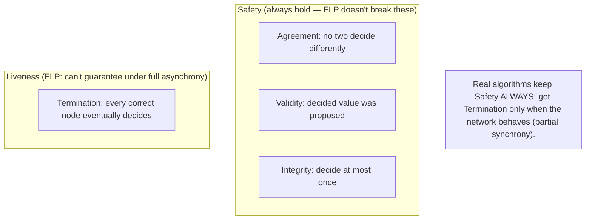
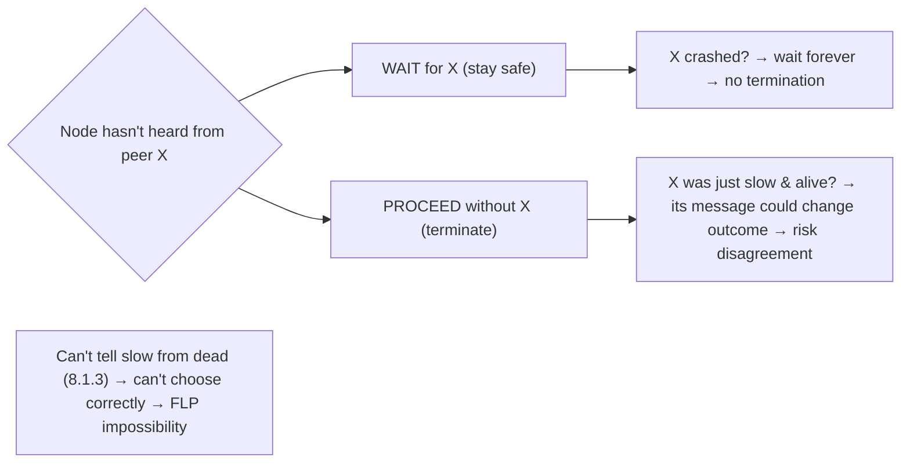

# Lesson 8.3.1 — The Consensus Problem and FLP Impossibility

> Part 8: Distributed Systems Core · Module 8.3: Coordination & Consensus · Difficulty: 🔴⚫
>
> **Prerequisites:** [8.1.1 Unreliable Networks], [8.1.3 Failure Detection], [8.2.3 Total vs Partial Order].
> **Unlocks:** [8.3.2 Paxos], [8.3.3 Raft], [8.3.4 Quorums], [Part 10 Linearizability], [Part 11 Distributed Transactions].

---

## 1. Learning Objectives

After this lesson you will be able to:

- Define the **consensus problem** precisely (agreement, validity, integrity, **termination**) and explain why it is **the** central problem of distributed systems — many problems reduce to it.
- State the **FLP impossibility** result (no deterministic consensus algorithm can guarantee termination in a fully asynchronous system with even one crash failure) and explain *why* (the inability to distinguish slow from dead — 8.1.3).
- Explain how real systems **circumvent FLP** in practice — by relaxing assumptions (partial synchrony / timeouts, randomization) and settling for "**safe always, live when the network behaves**."
- Identify what consensus enables (leader election, atomic/total-order broadcast, replicated state machines, distributed locks, atomic commit) and why **total-order broadcast is equivalent to consensus** (8.2.3).

---

## 2. Motivation — Getting nodes to agree, despite everything

Parts 8.1–8.2 established the brutal realities: the network loses/delays/partitions messages (8.1.1), you can't trust clocks (8.1.2), and you can't tell a dead node from a slow one (8.1.3). Against that backdrop, distributed systems constantly need the nodes to **agree on something**: *who is the leader?* *what is the next entry in the replicated log?* *did the transaction commit or abort?* *which value does this register hold?* This is the **consensus problem** — getting a set of nodes to **agree on a single value** (and agree that they've agreed), even though some may crash and messages may be lost or delayed. It is the **single most important problem** in distributed systems, because an astonishing range of practical problems **reduce to it**: leader election, total-order broadcast, replicated state machines, distributed locks, atomic commit, membership. Solve consensus and you can build all of them; without it, you cannot keep replicas consistent or coordinate safely.

And here is the humbling result that frames everything that follows: the **FLP impossibility theorem** (Fischer, Lynch, Paterson, 1985) proves that in a **fully asynchronous** system, **no deterministic algorithm can guarantee it will *always* reach consensus if even a single node may crash.** Not "it's hard" — *impossible* to guarantee termination. The reason is exactly the difficulty from 8.1.3: you can't distinguish a crashed node from a slow one, so an algorithm can always be forced to wait indefinitely. This is not a counsel of despair — real systems (Paxos 8.3.2, Raft 8.3.3) achieve consensus reliably in practice — but it tells you **precisely what you must give up**: you cannot have **safety, fault-tolerance, and guaranteed termination all at once under full asynchrony.** Real algorithms keep **safety always** and get **termination whenever the network behaves** (partial synchrony) — they trade guaranteed liveness for safety. Understanding consensus and FLP is the conceptual key that makes Paxos, Raft, quorums, and the CAP theorem (Part 10) make sense.

---

## 3. Theory — From first principles

### 3.1 The consensus problem, precisely

**Consensus:** a set of nodes, each **proposing** a value, must all **decide** on a **single** value, satisfying `[CS]`:
- **Agreement:** no two correct nodes decide **different** values. (The core safety property — everyone agrees.)
- **Validity (non-triviality):** the decided value must be one that was **actually proposed** by some node (not a made-up default). 
- **Integrity:** each node decides **at most once** (no taking it back).
- **Termination (liveness):** every **correct** (non-crashed) node **eventually decides**. (The progress property.)

The first three are **safety** properties ("nothing bad happens" — never disagree, never invent values). **Termination** is a **liveness** property ("something good eventually happens" — they actually decide). FLP is about **termination**: you can keep the safety properties always, but you **cannot guarantee** termination under full asynchrony (§3.3).

### 3.2 Why consensus is *the* problem — what reduces to it

Consensus is foundational because so many coordination problems are **equivalent to or built on it** `[CS]`:
- **Total-order (atomic) broadcast** — delivering the same messages in the same order to all nodes — is **equivalent to consensus** (8.2.3): each agreed message is one consensus decision. This is the basis of **replicated state machines** (all replicas apply the same ops in the same order → identical state — Part 10).
- **Leader election** (8.3.5) — agreeing *who* is leader — is a consensus instance.
- **Atomic commit** (distributed transactions — Part 11) — all participants agree to commit or abort.
- **Distributed locks / leases** (8.3.6) — agreeing who holds the lock.
- **Membership / configuration** — agreeing on the current set of nodes (8.3.5/8.3.8).
Because all of these reduce to consensus, **a correct consensus algorithm is the Swiss-army knife of coordination** — which is why ZooKeeper/etcd (8.3.8) package it as a service everything else uses.

### 3.3 FLP impossibility — the statement

**FLP (Fischer–Lynch–Paterson, 1985)** `[CS]`:

> In an **asynchronous** system (no bound on message delay or processing time), **no deterministic** consensus algorithm can **guarantee termination** if even **one** process may **crash** (fail by stopping).

In words: you **cannot** have a deterministic algorithm that is **always safe** (agreement/validity) **and** **always terminates** in a fully asynchronous model with even a single possible crash failure. There is always some execution (some unlucky interleaving of delays) in which the algorithm runs **forever without deciding**.

Important nuances:
- It's about **guaranteed** termination, not "usually." Algorithms can (and do) terminate in practice almost always — FLP just says you can't *guarantee* it under these assumptions.
- It assumes only **crash** failures (the easiest kind), and only **one** — so it's not about adversaries or many failures; even the mildest setting is impossible to guarantee.
- **Safety is never sacrificed** — FLP doesn't say you'll decide *wrongly*; it says you might **never decide**. (This is the crucial framing for §3.5.)

### 3.4 Why FLP is true (the intuition)

The deep reason is **exactly 8.1.3's undecidability** `[CS]`: in an asynchronous system you **cannot distinguish a crashed process from a slow one**. So an algorithm faces an impossible dilemma at the moment of decision:
- If it **waits** for a possibly-crashed node's message (to be safe), it might wait **forever** (the node really crashed) → no termination.
- If it **proceeds without waiting** (to terminate), the "slow" node might actually be alive and about to send a message that would change the outcome → risk violating **agreement** (safety).

The FLP proof formalizes this: it shows there's always a "**bivalent**" configuration (one where the outcome isn't yet determined) from which an adversarial scheduler can **keep delaying the one critical message** that would resolve the decision, forever postponing it — without ever crashing anything. Since the algorithm can't tell "the message is just slow" from "the node crashed," it can't safely stop waiting. **The inability to time out correctly is the heart of both 8.1.3 and FLP.**

### 3.5 How real systems circumvent FLP

FLP says *guaranteed* consensus is impossible under **full asynchrony + determinism**. Real systems **relax exactly those assumptions** to get consensus that's **safe always and live in practice** `[CS]`:

- **Partial synchrony (the main one):** assume the network is **eventually well-behaved** — it may be arbitrarily bad for a while, but **eventually** message delays are bounded (or there are periods of synchrony). Real algorithms (Paxos, Raft) use **timeouts** (8.1.3) as a **failure detector**: they keep **safety always** (never disagree — even during chaos), and **guarantee termination only during "good periods"** when the network behaves and a stable leader can emerge. During bad periods they may **stall** (not decide) — which is **allowed** (you sacrificed liveness, not safety). This is the standard production answer.
- **Randomization:** randomized algorithms (Ben-Or; some BFT protocols — 8.3.7) circumvent FLP by deciding with **probability 1** (terminate eventually *almost surely*), using coin-flips to escape the adversarial schedule. Less common in mainstream systems but theoretically important.
- **Failure detectors:** Chandra–Toueg showed consensus is solvable with a sufficiently strong (eventually-accurate) failure detector — equivalent to assuming partial synchrony.

**The unifying takeaway** `[BP]`: practical consensus is **"safety always, liveness when the network cooperates."** Algorithms like Raft (8.3.3) will **never** produce two conflicting decisions, but **may fail to make progress** (e.g., repeated election timeouts) if the network is partitioned or pathological — and that's the *correct* behavior, the deliberate FLP-respecting tradeoff. (This is also why CAP — Part 10 — forces choosing availability vs consistency during partitions: a consistent system *stops* rather than risk disagreement.)

### 3.6 Failure models matter (crash vs Byzantine)

FLP assumes the gentlest failures (**crash-stop**: a node just halts) `[CS]`. Real systems may also face:
- **Crash-recovery:** nodes crash and **restart** (losing volatile state) — handled by writing state durably (WAL — 5.3.1) so a recovered node rejoins correctly.
- **Omission:** messages dropped (the network — 8.1.1).
- **Byzantine (arbitrary/malicious):** nodes lie, send conflicting messages, or are compromised — the hardest model, requiring **BFT** consensus (8.3.7) with more replicas (≥ 3f+1 to tolerate f Byzantine faults). Most internal systems assume **non-Byzantine** (crash) faults; BFT is for adversarial settings (blockchains, untrusted participants).
Mainstream consensus (Paxos/Raft) targets **crash/crash-recovery + omission**, not Byzantine. Knowing your failure model determines which algorithm and how many replicas you need (8.3.4/8.3.7).

---

## 4. Visual Intuition

### Consensus properties (safety vs liveness)

### The FLP dilemma

---

## 5. Real-World Analogy

A **jury that must reach a unanimous verdict**, but jurors can only pass **notes** (no talking, no clock), and any juror might **fall asleep** at any time — and you **can't tell a sleeping juror from one who's just thinking slowly**.

- **The consensus properties:** they must all agree on **one** verdict (**agreement**); the verdict must be one actually proposed (**validity**); once decided it stands (**integrity**); and ideally they all eventually decide (**termination**).
- **The FLP dilemma:** the foreman is waiting on Juror #7's note to finalize. #7 is silent. Is #7 **asleep** (crashed) or **still writing** (slow)? If the foreman **waits** for #7 to be safe, and #7 is actually asleep, they wait **forever** (no verdict). If the foreman **declares the verdict without #7** to make progress, but #7 was just slow and about to submit a note that would change everything, the jury risks **disagreeing** (some counted #7, some didn't). With no way to tell sleeping from slow, **there's no rule that always works** — that's FLP.
- **How real juries cope (partial synchrony):** they adopt a **timeout** — "if we don't hear from a juror in 10 minutes, we assume they're out and proceed." This **isn't guaranteed correct** (a juror might wake at minute 11), but it lets them **make progress when things are normal**, while a good process ensures they **never announce two different verdicts** (safety). If the room descends into chaos (everyone passing notes that get lost — a partition), they simply **don't announce a verdict** until order returns — they'd rather **stall than be wrong.**
- **Byzantine version:** now imagine a **dishonest juror** who tells half the room "guilty" and the other half "not guilty" — agreement is far harder and needs extra honest jurors to outvote the liar (BFT, 8.3.7).

---

## 6. Industry Example

- **Consensus as a service** `[CONV]`: ZooKeeper (ZAB) and etcd (Raft) package consensus so applications get leader election, locks, config, and membership without implementing it themselves (8.3.8) — the practical embodiment of "everything reduces to consensus" (§3.2). *(Representative.)*
- **FLP respected in Raft/Paxos** `[CS]`: Raft (8.3.3) **never** allows two conflicting committed entries (safety) but **can fail to elect a leader** (no progress) under repeated split votes / partitions — exactly FLP's "safe always, live only when the network behaves" (§3.5). *(Representative.)*
- **Partial synchrony + timeouts** `[CS]`: production consensus uses **randomized election timeouts** (Raft) to break symmetry and make progress likely during good periods — circumventing FLP pragmatically (§3.5, 8.3.3). *(Representative.)*
- **Total-order broadcast = consensus** `[CS]`: replicated logs (Kafka's controller, databases' replication logs) rely on consensus for a single agreed order (§3.2, 8.2.3, Part 9/10). *(Representative.)*
- **BFT for adversarial settings** `[EMERGING]`: blockchains and untrusted-participant systems use Byzantine consensus (PBFT-lineage) requiring ≥3f+1 nodes (8.3.7, §3.6). *(Representative.)*

---

## 7. Implementation Details — living with consensus and FLP

- **Don't implement consensus yourself** — use a proven library/service (etcd/ZooKeeper/Consul, or Raft/Paxos libraries) (8.3.8); consensus is **notoriously easy to get subtly wrong** `[BP]`.
- **Expect "safe but possibly stalled"** — design for the case where the consensus layer **can't make progress** (partition, no quorum): the system should **block/refuse** the affected operation rather than proceed unsafely (the deliberate FLP/CAP tradeoff — §3.5, Part 10).
- **Use timeouts as failure detectors** (8.1.3) with **randomization/jitter** to avoid livelock (e.g., repeated split votes) — partial-synchrony in practice (§3.5).
- **Confine consensus to the small core that needs it** (8.2.3 §3.6) — leader election, metadata, a single ordered log — and run the bulk causally/eventually for availability/scale; consensus is expensive (quorum round-trips).
- **Know your failure model** (§3.6) — crash/crash-recovery (Paxos/Raft, majority quorum) vs Byzantine (BFT, ≥3f+1) — it determines the algorithm and replica count (8.3.4/8.3.7).
- **Persist consensus state durably** (WAL — 5.3.1) so a crashed-and-recovered node rejoins correctly (crash-recovery model, §3.6).
- **Reduce coordination problems to consensus deliberately** — leader election, locks, atomic commit can all use the same consensus core (§3.2).

---

## 8. Advantages (what consensus buys you)

- **Correct agreement despite failures** — a single agreed value/order even as nodes crash and messages drop (within the fault model) (§3.1).
- **The foundation for everything coordinated** — leader election, total-order broadcast, replicated state machines, locks, atomic commit (§3.2).
- **Strong consistency** — replicated state machines built on consensus give linearizable state (Part 10).
- **Safety guaranteed** — agreement/validity hold **always**, even when the network misbehaves (§3.5) — you never get divergence/split-brain from the consensus core.

---

## 9. Disadvantages / hard realities

- **FLP: no guaranteed termination** under full asynchrony — real systems can **stall** (no progress) during partitions/pathology (§3.3/3.5).
- **Liveness sacrificed for safety** — a consistent consensus system **stops serving** rather than risk disagreement (the CAP-consistent choice — Part 10).
- **Expensive** — multiple round-trips, quorum coordination → latency and reduced availability (the cost behind 7.1's USL and 8.2.3's total-order cost).
- **Subtle and error-prone** — consensus algorithms are famously hard to implement correctly (hence use libraries — §7).
- **Fault-model limits** — majority-quorum consensus tolerates crashes, **not Byzantine** faults without BFT (more replicas, more cost — 8.3.7).

---

## 10. When NOT to use consensus / limits

- **When causal/eventual consistency suffices** — don't pay consensus cost where you don't need a single agreed order (8.2.3, Part 10); use CRDTs/causal mechanisms.
- **High-throughput, low-coordination paths** — keep consensus off the hot path; confine it to a small core (§7, 8.2.3).
- **When availability during partitions is paramount and staleness is acceptable** — an AP system (Part 10) avoids consensus-induced stalls (accepting weaker consistency).
- **Don't roll your own** — use proven implementations (§7).
- **Byzantine settings without BFT** — majority consensus is unsafe against malicious nodes; you need BFT (more replicas/cost — 8.3.7).

---

## 11. Common Mistakes

1. **Implementing consensus from scratch** — subtle bugs, split-brain; use etcd/ZooKeeper/Raft libraries (§7, 8.3.8).
2. **Expecting guaranteed progress** — designing as if consensus always terminates; not handling the "no quorum → stalled" case (§3.3/3.5).
3. **Sacrificing safety for liveness** — "just proceed if we can't agree" → split brain/divergence (the opposite of what FLP-respecting systems do) (§3.5).
4. **Using consensus everywhere** — global total order where causal/eventual would do → needless latency/availability loss (§3.2, 8.2.3).
5. **Ignoring the failure model** — assuming crash faults in a Byzantine setting (or paying for BFT where crash-only suffices) (§3.6, 8.3.7).
6. **Not persisting consensus state** — a recovered node violates safety because it forgot its votes/log (§3.6, 5.3.1).
7. **No randomized timeouts** — deterministic timeouts cause repeated split votes / livelock (§3.5, 8.3.3).

---

## 12. Interview Questions

**🟢 Easy**
- What is the consensus problem? Name its four properties.
- Which property does FLP say you can't guarantee, and which ones are always preserved?

**🟡 Medium**
- State FLP impossibility in your own words. Why is it true (tie it to "slow vs dead")?
- How do real systems get consensus despite FLP? (Partial synchrony, timeouts, randomization.)

**🔴 Hard**
- Why is total-order broadcast equivalent to consensus, and what does that imply for building replicated state machines? (8.2.3)
- Explain "safe always, live when the network behaves." What does a Raft cluster do during a partition with no majority, and why is that correct?

**⚫ Staff+**
- A team wants a custom leader-election + replicated log. Walk them through why this is consensus, why they shouldn't build it themselves, what guarantees they can/can't have (FLP), and how to scope consensus to a small core while keeping the system available and scalable (§3.2/3.5/§7, 8.2.3).
- Compare the failure models (crash, crash-recovery, omission, Byzantine) and how each changes the consensus requirements (quorum size, durability, BFT). When is BFT justified despite its cost? (§3.6, 8.3.7)

---

## 13. Production Pitfalls

- **Home-grown consensus split-brain:** a hand-rolled leader election lacks proper quorum/fencing; a partition yields two leaders → divergence/data loss (§7, 8.1.1).
- **Consensus stall = outage (by design):** during a partition with no quorum, the consensus-backed service correctly **refuses writes** — surprising teams who expected availability (it chose consistency — §3.5, Part 10).
- **Livelock from synchronized timeouts:** deterministic election timeouts cause repeated split votes; no leader is elected; the cluster makes no progress (§3.5, 8.3.3) — fixed by randomized timeouts.
- **Over-use of consensus:** routing all operations through the consensus core caps throughput and tanks availability when it's needed for everything (§3.2, 8.2.3).
- **Recovered node violates safety:** a node that crashed forgot its durable consensus state (no WAL) and rejoins with stale votes → safety breach (§3.6, 5.3.1).
- **Byzantine assumption mismatch:** using crash-tolerant consensus among mutually-distrusting/compromisable parties → a malicious node breaks agreement (needs BFT — §3.6, 8.3.7).

---

## 14. Optimization Techniques

> *Mostly about *correctly* and *efficiently* using consensus.*

- **Use proven consensus services/libraries** (etcd/ZooKeeper/Consul/Raft libs) — don't reinvent (§7, 8.3.8) `[BP]`.
- **Confine consensus to a small core** (leader/metadata/single log); run the rest causally/eventually (§3.2, 8.2.3).
- **Randomized timeouts** to avoid split-vote livelock (§3.5, 8.3.3).
- **Batch/pipeline consensus** (multi-Paxos/Raft batch many entries per round) to amortize round-trip cost (8.3.2/8.3.3).
- **Right quorum/fault model** — majority for crash faults; BFT only where adversarial (§3.6, 8.3.4/8.3.7).
- **Durable state (WAL)** for safe crash-recovery (§3.6, 5.3.1).
- **Design for stall** — graceful "read-only/degraded" behavior when the consensus core can't make progress (§3.5, Part 11).

---

## 15. Summary

**Consensus** — getting a set of nodes to **agree on a single value** (and agree that they agree) despite crashes and an unreliable network — is **the** central problem of distributed systems, because **leader election, total-order broadcast, replicated state machines, distributed locks, atomic commit, and membership all reduce to it** (notably, **total-order broadcast is equivalent to consensus** — 8.2.3). Its properties are **agreement** (no two correct nodes decide differently), **validity** (the decision was actually proposed), **integrity** (decide at most once) — the **safety** trio — and **termination** (every correct node eventually decides) — the **liveness** property. The **FLP impossibility theorem** proves that in a **fully asynchronous** system, **no deterministic algorithm can guarantee termination** if even **one** node may crash — because (exactly as in 8.1.3) you **cannot distinguish a slow node from a dead one**, so at the decision point an algorithm must either **wait** (and risk waiting forever for a crashed node — no termination) or **proceed** (and risk a slow-but-alive node's message violating agreement — unsafe). Crucially, FLP threatens **termination, not safety** — you might never decide, but you'll never decide *wrongly*. Real systems **circumvent** FLP by relaxing its assumptions: **partial synchrony** (assume the network is *eventually* well-behaved and use **timeouts** as failure detectors) and/or **randomization** — yielding the production reality **"safety always, liveness when the network behaves."** Algorithms like Paxos (8.3.2) and Raft (8.3.3) **never** produce conflicting decisions but **may stall** (no progress) during partitions or pathology — and that stall is the *correct*, deliberate tradeoff (and the root of CAP's consistency-vs-availability choice — Part 10). The **failure model** matters: mainstream consensus tolerates **crash/crash-recovery + omission** with **majority quorums**, while **Byzantine** (malicious) faults require **BFT** (≥3f+1 nodes — 8.3.7). Practical guidance: **don't roll your own** (use etcd/ZooKeeper/Raft libraries — 8.3.8), **confine consensus to a small core** (it's expensive — multiple round-trips), **design for stalls**, use **randomized timeouts**, and **persist consensus state durably**. Consensus is the Swiss-army knife of coordination — and FLP tells you exactly what it can and cannot promise.

---

## 16. Revision Notes (flashcard-ready)

- **Q:** Consensus problem? **A:** Get nodes to agree on a single value despite crashes/unreliable network.
- **Q:** Four properties? **A:** Agreement, validity, integrity (safety) + termination (liveness).
- **Q:** Why is consensus central? **A:** Leader election, total-order broadcast, replicated state machines, locks, atomic commit, membership all reduce to it.
- **Q:** FLP impossibility? **A:** In a fully async system, no deterministic algorithm can *guarantee* termination with even one possible crash.
- **Q:** Why is FLP true? **A:** Can't distinguish slow from dead → must either wait forever (no termination) or proceed unsafely (risk disagreement).
- **Q:** Does FLP threaten safety? **A:** No — only termination; you might never decide, but never decide wrongly.
- **Q:** How do real systems circumvent FLP? **A:** Partial synchrony (timeouts as failure detectors) and/or randomization → safe always, live when the network behaves.
- **Q:** What does a Raft cluster do with no quorum (partition)? **A:** Stall (refuse progress) to preserve safety — correct behavior (CAP-consistent).
- **Q:** Total-order broadcast vs consensus? **A:** Equivalent — basis of replicated state machines.
- **Q:** Crash vs Byzantine fault model? **A:** Crash/recovery → majority quorum (Paxos/Raft); Byzantine (malicious) → BFT, ≥3f+1 (8.3.7).
- **Q:** Practical rule? **A:** Don't roll your own consensus; confine it to a small core; design for stalls.

---

## 17. Further Reading + Knowledge-Graph Links

**Within this platform**
- **Builds on:** [8.1.3 Failure Detection] (slow vs dead = the root of FLP), [8.1.1 Unreliable Networks], [8.2.3 Total vs Partial Order] (total-order broadcast = consensus).
- **Next:** [8.3.2 Paxos], [8.3.3 Raft] (algorithms that circumvent FLP). **Then:** [8.3.4 Quorums], [8.3.5 Leader Election/Membership], [8.3.7 Byzantine/BFT], [8.3.8 ZooKeeper/etcd].
- **Enables:** [Part 10 Linearizability/CAP] (consistency requires consensus; the stall = the C in CAP), [Part 11 Atomic Commit/2PC], [8.3.6 Distributed Locks].

**Foundational texts (synthesized)**
- Fischer, Lynch & Paterson (1985), "Impossibility of Distributed Consensus with One Faulty Process" (concept, synthesized).
- Dwork, Lynch & Stockmeyer — partial synchrony (concept, synthesized).
- Chandra & Toueg — failure detectors and consensus (concept, synthesized).
- Kleppmann, *Designing Data-Intensive Applications* — consensus, FLP, total-order broadcast (synthesized).

**Concept tags:** `[CS]` consensus (agreement/validity/integrity/termination), FLP impossibility, safety vs liveness, total-order-broadcast=consensus, failure models · `[CONV]` consensus-as-a-service (etcd/ZK), safe-always-live-when-network-behaves · `[BP]` don't roll your own, confine to a small core, randomized timeouts, design for stalls, durable state · `[EMERGING]` randomized consensus, BFT.
