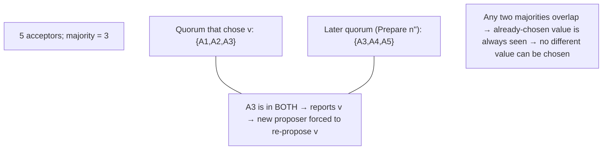

# Lesson 8.3.2 — Paxos (Single-Decree and Multi-Paxos)

> Part 8: Distributed Systems Core · Module 8.3: Coordination & Consensus · Difficulty: ⚫
>
> **Prerequisites:** [8.3.1 Consensus & FLP], [8.3.4 Quorums (preview)], [8.1.3 Failure Detection].
> **Unlocks:** [8.3.3 Raft], [8.3.8 ZooKeeper/etcd], [Part 10 Replicated State Machines].

---

## 1. Learning Objectives

After this lesson you will be able to:

- Explain what **Paxos** solves (consensus on a single value among crash-prone nodes with majority quorums) and the **roles** (proposer, acceptor, learner).
- Walk through the **two-phase single-decree Paxos** protocol (Prepare/Promise, Accept/Accepted) and explain **why each rule guarantees safety** (agreement) even with competing proposers, lost messages, and crashes.
- Explain how **proposal numbers + majority quorums** ensure that **once a value is chosen, no different value can ever be chosen** — and how Paxos respects **FLP** (safe always; can livelock, not guaranteed to terminate).
- Describe **Multi-Paxos** (a stable leader to decide a *sequence* of values efficiently → a replicated log) and why Paxos is reputed "hard" (motivating Raft — 8.3.3).

---

## 2. Motivation — The first practical (and infamous) consensus algorithm

8.3.1 told us consensus is *the* problem and that FLP makes guaranteed termination impossible under full asynchrony — yet real systems achieve consensus reliably. **Paxos** (Leslie Lamport, 1989/1998) is the algorithm that showed *how*: a protocol that is **always safe** (never lets two nodes decide different values) and **terminates whenever the network is well-behaved enough** (partial synchrony — 8.3.1 §3.5). For two decades it was *the* consensus algorithm underlying real coordination systems, and understanding it teaches the core ideas every consensus protocol (including Raft — 8.3.3) reuses: **proposal numbers** to order competing attempts, **majority quorums** so any two quorums overlap, and a **two-phase "ask permission, then commit"** structure.

Paxos is also famous for being **hard to understand** — Lamport's original paper ("The Part-Time Parliament") was so obscure it spawned a cottage industry of "Paxos made simple/practical/moderately-complex" follow-ups, and the difficulty of implementing it correctly directly motivated **Raft** (8.3.3), designed expressly for understandability. So why learn Paxos? Because its **safety argument is the cleanest illustration of *why* consensus works**: once you see how proposal numbers + quorum intersection make it *impossible* for two different values to be chosen, you understand the bedrock that Raft, ZAB, and others stand on. This lesson develops single-decree Paxos (agree on one value), proves its safety intuition, then extends to **Multi-Paxos** (agree on a *log* of values — the practical form used for replicated state machines).

---

## 3. Theory — From first principles

### 3.1 Roles and setup

Paxos defines three **roles** (a node often plays several) `[CS]`:
- **Proposer:** proposes a value (e.g., "the next log entry is X"), driving the protocol.
- **Acceptor:** votes on proposals; the **memory** of the system — a **majority of acceptors** must agree for a value to be chosen. Acceptors persist their state (durably — 5.3.1) so crash-recovery is safe.
- **Learner:** learns the chosen value (e.g., applies it to a replicated state machine).

**Key parameter:** with `2f+1` acceptors, Paxos tolerates `f` crash failures, because decisions need a **majority (quorum) of `f+1`**, and **any two majorities overlap in at least one acceptor** (8.3.4) — the linchpin of safety.

### 3.2 The goal and the central difficulty

**Goal:** all learners learn the **same single chosen value**, which was proposed by some proposer (agreement + validity — 8.3.1), even with **multiple competing proposers**, **lost/delayed messages**, and **crashes**. The difficulty: multiple proposers may propose **different** values concurrently; the protocol must ensure that **at most one value is ever chosen**, and once chosen, **every later proposal converges to that same value** (never a different one). Paxos achieves this with **monotonic proposal numbers** and **majority quorums**.

### 3.3 Proposal numbers

Every proposal carries a **unique, monotonically increasing proposal number `n`** (globally orderable — e.g., `(counter, proposer_id)` so they're unique and comparable, like Lamport tie-breaking — 8.2.1) `[CS]`. Higher `n` = "newer attempt." Acceptors use `n` to **reject stale proposals** and to track the **highest-numbered proposal they've engaged with**. Proposal numbers impose an order on competing attempts so the protocol can always favor the newest and discard the obsolete.

### 3.4 Single-decree Paxos: the two phases

To get one value chosen `[CS]`:

**Phase 1 — Prepare / Promise (gain permission + discover prior values):**
1. A proposer picks a proposal number `n` (higher than any it's used) and sends **`Prepare(n)`** to a majority of acceptors.
2. An acceptor receiving `Prepare(n)`:
   - If `n` is **greater** than any proposal it has already promised to, it **promises** not to accept any proposal numbered **< n** in future, and **replies with the highest-numbered proposal `(n', v')` it has already accepted** (if any).
   - Else (it already promised a higher `n`), it **rejects** (ignores) — this stale proposer must retry with a higher number.

**Phase 2 — Accept / Accepted (commit a value):**
3. If the proposer gets **promises from a majority**, it picks the value to propose:
   - If **any** acceptor reported an already-accepted `(n', v')`, the proposer **MUST use the value `v'` from the highest `n'`** reported (it cannot pick its own value — this is the crucial safety rule). 
   - If **no** acceptor reported a prior value, the proposer is **free to use its own** value.
   It sends **`Accept(n, v)`** to a majority.
4. An acceptor receiving `Accept(n, v)`: if it **hasn't promised** a proposal number **> n**, it **accepts** `(n, v)` (and persists it); else it rejects.
5. When a **majority accept** `(n, v)`, the value `v` is **chosen**. Learners learn it (acceptors notify learners / a distinguished learner).

### 3.5 Why this is safe (the agreement argument)

The genius is the interaction of **quorum overlap** and the **"adopt the highest prior value" rule** `[CS]`:
- A value is **chosen** only when a **majority** accept it. **Any two majorities share at least one acceptor** (8.3.4). So if value `v` was chosen at proposal `n`, **any later Phase-1 `Prepare(n'')` with `n'' > n` will reach at least one acceptor that accepted `v`** — and that acceptor will **report `v`** in its promise.
- By rule 3, the new proposer is then **forced to re-propose `v`** (the highest prior value), not its own. So **every proposal numbered higher than `n` will also carry `v`** → no different value can ever be chosen. **Once chosen, always that value.** That's **agreement**, guaranteed despite competing proposers, lost messages, and crashes.
- Acceptors' **promises** (Phase 1) prevent older proposals from "sneaking in" a different value after a newer one has started. Persisting accepted proposals makes crash-recovery safe.

This is the cleanest demonstration of *why* consensus works: **quorum intersection guarantees the new proposer always *sees* any already-chosen value, and the protocol forces it to honor that value.**

### 3.6 Paxos and FLP — livelock, not unsafety

Paxos is **always safe** but, per FLP (8.3.1), **not guaranteed to terminate** `[CS]`. The classic non-termination is **dueling proposers / livelock**:
- Proposer A runs `Prepare(1)`; before A finishes Phase 2, proposer B runs `Prepare(2)` (higher) → acceptors promise B, so A's `Accept(1)` is rejected; A retries with `Prepare(3)` → B's `Accept(2)` rejected; B retries with `Prepare(4)`… **forever**, with neither ever completing both phases.
- **Mitigation:** elect a **single distinguished proposer (leader)** so only one proposer is active at a time → no dueling → progress (when the leader is stable). This is exactly the **partial-synchrony + leader** circumvention of FLP (8.3.1 §3.5), and it's the basis of **Multi-Paxos** (§3.7) and Raft (8.3.3). Randomized backoff between competing proposers also helps (like 8.1.3's jitter).

### 3.7 Multi-Paxos — agreeing on a *sequence* (the practical form)

Single-decree Paxos agrees on **one** value. Real systems need to agree on a **sequence** of values — a **replicated log** of operations (for a replicated state machine — Part 10). Running full two-phase Paxos for *every* log entry is expensive (2 round-trips each). **Multi-Paxos** optimizes `[CS]`:
- **Elect a stable leader** (a distinguished proposer). Once elected, the leader runs **Phase 1 only once** (for a range of future log slots), then for each new command runs **only Phase 2** (`Accept`) — **one round-trip per entry** instead of two. Phase 1 is amortized away while the leader is stable.
- This yields an efficient **replicated log**: the leader assigns each command a log index and gets a majority to accept it; learners apply committed entries in order → all replicas execute the same operations in the same order → **identical state** (state-machine replication, the basis of consistent replicated databases/coordination — Part 10).
- If the leader fails, a new one is elected (a new Phase 1 with a higher proposal number), and Paxos's safety ensures the new leader **recovers any partially-chosen entries** correctly (it'll see them via quorum overlap, §3.5) — **no committed entry is ever lost or changed.**
Multi-Paxos *is* essentially what Raft (8.3.3) reorganizes into a more understandable form; they solve the same problem with the same core ideas (leader + log + majority + recovery).

### 3.8 Why Paxos is "hard" (and why Raft exists)

Paxos's reputation `[OPINION]`/`[CONV]`: the **single-decree safety argument is elegant**, but turning it into a **complete, efficient, correct Multi-Paxos implementation** (leader election, log management, membership changes, recovery of partial entries, optimizations) involves many under-specified details that the original papers left as exercises — making correct implementations genuinely hard and varied. This **understandability gap** is exactly why **Raft** (8.3.3) was designed: same guarantees, deliberately structured (strong leader, explicit log, clear election) to be *teachable and implementable*. So: learn Paxos for the **why** (the safety bedrock), and Raft for the **how** (the practical, understandable blueprint most modern systems use).

---

## 4. Visual Intuition

### Single-decree Paxos — two phases

```mermaid
sequenceDiagram
    participant P as Proposer
    participant A as Acceptors (majority)
    participant L as Learners
    P->>A: Phase 1: Prepare(n)
    A-->>P: Promise(n) + any already-accepted (n', v')
    Note over P: If any (n',v') reported → must use highest v'; else free to pick own v
    P->>A: Phase 2: Accept(n, v)
    A-->>P: Accepted(n, v)  (if no higher promise)
    Note over A: Majority accepted → v is CHOSEN
    A->>L: value v learned
```

### Quorum overlap guarantees safety



---

## 5. Real-World Analogy

Imagine a committee deciding on **one** policy, communicating only by unreliable memos, where a **majority of members** must endorse a policy for it to count.

- **Proposal numbers** are like **dated, numbered drafts** — "Draft #7." Newer drafts have higher numbers.
- **Phase 1 (Prepare/Promise):** before pushing Draft #7, you poll a **majority** of members: "Will you promise to ignore any draft older than #7? And by the way, **have you already endorsed any policy?**" Each member who agrees **promises** to ignore older drafts and **tells you the latest policy they've already endorsed**, if any.
- **The crucial rule:** if **any** member tells you "I already endorsed Policy X (on draft #5)," you are **not allowed to push your own pet policy** — you **must** push **Policy X** (the one from the highest prior draft). You can only champion your own idea if **nobody** had endorsed anything yet. This is what makes the committee **converge**: once a policy has majority backing, every future round is forced to carry that same policy forward.
- **Phase 2 (Accept):** you send Draft #7 (carrying the mandated policy) to a majority; if they haven't promised to a newer draft, they **endorse** it. A **majority endorsement = the policy is chosen**, permanently.
- **Why it's safe:** because **any two majorities share at least one member**, whoever runs the next round is *guaranteed* to poll someone who knows the chosen policy — and is forced to carry it forward. **The committee can never end up endorsing two different policies.**
- **Livelock (FLP):** if two pushy members keep one-upping each other's draft numbers ("#7!" "#8!" "#9!"), neither ever finishes — so the committee appoints **one chair** to push drafts, and progress resumes (Multi-Paxos's leader).

---

## 6. Industry Example

- **Chubby (Google)** `[CONV]`: Google's lock service is built on (Multi-)Paxos — the canonical production Paxos system, underpinning locking, leader election, and metadata for many Google systems (8.3.6/8.3.8). *(Representative.)*
- **Spanner replication** `[CONV]`: Spanner uses Paxos to replicate each shard's log across replicas (combined with TrueTime for ordering — 8.2.4), giving consistent globally-distributed data (Part 18). *(Representative.)*
- **Multi-Paxos replicated logs** `[CS]`: state-machine replication via a Paxos log is the standard way to build a consistent replicated store/coordination service (Part 10). *(Representative.)*
- **ZooKeeper's ZAB** `[CONV]`: a Paxos-like atomic broadcast protocol (not Paxos exactly, but the same family) for ZooKeeper's replicated log (8.3.8). *(Representative.)*
- **"Paxos made live"** `[OPINION]`: Google's engineers documented the substantial gap between the algorithm and a correct, performant implementation — the practical difficulty that motivated Raft (§3.8, 8.3.3). *(Representative.)*

---

## 7. Implementation Details — Paxos in practice

- **Use Multi-Paxos with a stable leader** (not repeated single-decree) for a replicated log — one round-trip per entry after a one-time Phase 1; elect a single distinguished proposer to avoid dueling/livelock (§3.6/3.7) `[BP]`.
- **Persist acceptor state durably** (highest promised `n`, accepted `(n,v)`) via a WAL (5.3.1) so crash-recovery preserves safety (§3.1).
- **Use unique, monotonic proposal numbers** (e.g., `(round, node_id)`) so they're globally orderable and never collide (§3.3, 8.2.1 tie-break).
- **Size the cluster `2f+1`** for `f` crash failures; decisions need a **majority** (§3.1, 8.3.4) — typically 3 or 5 nodes (odd numbers maximize fault tolerance per node).
- **Add randomized backoff** between competing proposers to reduce livelock during leader changes (§3.6, 8.1.3 jitter).
- **Strongly prefer a proven implementation/Raft** over hand-rolling Paxos — the implementation gap is large and error-prone (§3.8, 8.3.1 §7); most teams should use etcd/ZooKeeper/Raft libraries (8.3.8).
- **Handle membership changes carefully** (adding/removing acceptors) — a notoriously subtle part of Paxos; use the well-specified mechanisms (Raft's joint consensus is clearer — 8.3.3).

---

## 8. Advantages

- **Provably safe consensus** under crash faults — never decides two different values, despite competing proposers/lost messages/crashes (§3.5).
- **Tolerates `f` crashes with `2f+1` nodes** via majority quorums (§3.1, 8.3.4).
- **Foundational & battle-tested** — decades of production use (Chubby, Spanner) (§6).
- **Multi-Paxos is efficient** — one round-trip per log entry with a stable leader → practical replicated state machines (§3.7).
- **The core ideas generalize** — proposal numbers + quorum overlap + leader underpin all modern consensus (Raft, ZAB).

---

## 9. Disadvantages / limitations

- **Not guaranteed to terminate** (FLP) — dueling proposers can livelock without a leader (§3.6).
- **Famously hard to understand and implement correctly** — large gap between paper and production (§3.8) → bugs if hand-rolled.
- **Latency cost** — quorum round-trips per decision; coordination overhead (the price of strong consistency — 7.1/8.2.3).
- **Crash faults only** — not Byzantine-tolerant without a different protocol (BFT — 8.3.7).
- **Membership changes are subtle** — reconfiguration is error-prone (§7).
- **Availability tradeoff** — needs a majority; loses progress without one (FLP/CAP — 8.3.1, Part 10).

---

## 10. When NOT to use Paxos / limits

- **Hand-rolling it** — almost never; use Raft (8.3.3) or a proven library/service (etcd/ZooKeeper) — the implementation risk is too high (§3.8, 8.3.1 §7).
- **When causal/eventual consistency suffices** — don't pay consensus cost where a single agreed order isn't needed (8.2.3, Part 10).
- **Byzantine settings** — Paxos assumes crash faults; use BFT (8.3.7).
- **Latency-critical hot paths** — keep consensus off the hot path; confine to a small core (8.2.3 §3.6).
- **If you want understandability** — prefer **Raft** (same guarantees, designed to be teachable — 8.3.3).

---

## 11. Common Mistakes

1. **Hand-rolling Paxos** and getting recovery/membership/optimizations subtly wrong → safety bugs (§3.8).
2. **Letting the proposer pick its own value when an acceptor reported a prior value** — violates the key safety rule → two different values chosen (§3.4/3.5).
3. **Not persisting acceptor state** → a recovered acceptor forgets promises/accepts → safety breach (§3.1, 5.3.1).
4. **Running single-decree Paxos per log entry** (two round-trips each) instead of Multi-Paxos with a stable leader → poor performance (§3.7).
5. **Multiple active proposers** with no leader → dueling/livelock (no progress) (§3.6).
6. **Even-sized clusters** (e.g., 4 nodes) → no better fault tolerance than 3 and risk of no majority on a 2-2 split (§3.1, 8.3.4).
7. **Non-unique/non-monotonic proposal numbers** → ordering breaks, safety at risk (§3.3).

---

## 12. Interview Questions

**🟢 Easy**
- What problem does Paxos solve, and what are the three roles?
- How many failures does Paxos tolerate with `2f+1` acceptors, and why does it need a majority?

**🟡 Medium**
- Walk through the two phases of single-decree Paxos. What's the rule about which value a proposer may use in Phase 2, and why does it matter?
- Why is Paxos always safe but not guaranteed to terminate? What is livelock and how is it mitigated?

**🔴 Hard**
- Prove (intuitively) why once a value is chosen, no different value can ever be chosen. (Quorum overlap + adopt-highest-prior-value.)
- Explain Multi-Paxos: how does a stable leader reduce two phases to one round-trip per entry, and how is safety preserved across leader changes?

**⚫ Staff+**
- You must build a replicated, strongly-consistent log/store. Compare implementing Multi-Paxos vs adopting Raft vs using etcd/ZooKeeper. Discuss safety, the implementation gap, membership changes, performance, and operational risk — and make a recommendation.
- Walk through how a new Paxos leader, after the previous leader crashed mid-decision, correctly recovers a possibly-partially-chosen log entry without ever losing or changing a committed value (quorum overlap + Phase 1 discovery).

---

## 13. Production Pitfalls

- **Home-grown-Paxos safety bug:** a subtle error in recovery or the value-selection rule lets two different values be chosen under a specific crash/partition interleaving → divergence (§3.4/3.5/3.8) — the reason to use proven implementations.
- **Livelock under leader churn:** during unstable leadership, dueling proposers prevent any progress; the cluster makes no decisions until a stable leader emerges (§3.6).
- **Lost durability on recovery:** an acceptor that didn't fsync its accepted value forgets it after a crash → a committed value appears un-chosen (§3.1, 5.3.1).
- **Performance collapse from single-decree per entry:** two round-trips per log entry under load → high latency; Multi-Paxos's leader optimization is essential (§3.7).
- **Reconfiguration mistake:** an incorrect membership change creates two disjoint quorums (old vs new config) → split-brain (§7) — why reconfiguration must be done via the protocol.
- **No-majority stall:** a partition leaves no side with a majority → no progress (correct per FLP/CAP, but a surprise if unexpected) (§3.6, 8.3.1).

---

## 14. Optimization Techniques

- **Multi-Paxos stable leader** — amortize Phase 1; one round-trip per entry (§3.7) `[BP]`.
- **Batching & pipelining** — propose many log entries per round / pipeline Accepts to amortize round-trip cost (8.3.1).
- **Single distinguished proposer + randomized backoff** — eliminate dueling/livelock (§3.6).
- **Odd-sized clusters (`2f+1`, typically 3/5)** — best fault tolerance per node; clear majorities (§3.1, 8.3.4).
- **Durable, fast WAL for acceptor state** — safe, quick recovery (§3.1, 5.3.1).
- **Read leases / read-only optimizations** — serve reads from a leader lease to avoid a full consensus round per read (also in Raft — 8.3.3).
- **Prefer Raft** when understandability/maintainability matters — same guarantees, fewer foot-guns (§3.8, 8.3.3).

---

## 15. Summary

**Paxos** (Lamport) is the foundational consensus algorithm: it lets a set of crash-prone nodes **agree on a single value** using **proposal numbers** and **majority quorums**, and it is **always safe** while (per FLP — 8.3.1) **not guaranteed to terminate**. Roles: **proposers** drive proposals, **acceptors** vote and form the system's durable memory (a value is **chosen** when a **majority** accept it; `2f+1` acceptors tolerate `f` crashes), and **learners** learn the result. **Single-decree Paxos** runs two phases: **Phase 1 Prepare/Promise** (a proposer with number `n` asks a majority to promise to ignore lower-numbered proposals and to **report any value they've already accepted**), and **Phase 2 Accept/Accepted** (the proposer sends `Accept(n, v)` to a majority — but **if any acceptor reported a prior accepted value, it MUST propose that highest-prior value, not its own**; only if none did is it free to choose). A value is **chosen** on majority Accept. **Safety** follows from **quorum overlap** (any two majorities share an acceptor) plus the **adopt-highest-prior-value rule**: once `v` is chosen, every later round will *see* `v` (via the shared acceptor) and be **forced to re-propose `v`** — so **no different value can ever be chosen**. Per FLP, competing proposers can **livelock** ("dueling proposers"), mitigated by electing a **single leader** (and randomized backoff) — the partial-synchrony circumvention. **Multi-Paxos** makes this practical: a **stable leader** runs Phase 1 once, then just Phase 2 per command (**one round-trip per entry**), building a **replicated log** for state-machine replication (identical replicas — Part 10), with safety preserved across leader changes via quorum-overlap recovery. Paxos is **notoriously hard to implement correctly** (the algorithm-to-production gap), which directly motivated **Raft** (8.3.3) — same guarantees, designed for understandability. Learn Paxos for the **why** (the clearest proof that quorum intersection makes consensus safe); use Raft or proven services (etcd/ZooKeeper — 8.3.8) for the **how**.

---

## 16. Revision Notes (flashcard-ready)

- **Q:** Paxos roles? **A:** Proposer (proposes), acceptor (votes; durable memory; majority chooses), learner (learns the value).
- **Q:** Fault tolerance? **A:** `2f+1` acceptors tolerate `f` crashes; a value is chosen on majority (`f+1`) accept.
- **Q:** Phase 1? **A:** Prepare(n) → acceptors promise to ignore < n and report any already-accepted (n', v').
- **Q:** Phase 2? **A:** Accept(n, v) → accepted if no higher promise; majority accept = chosen.
- **Q:** The key safety rule? **A:** If any acceptor reported a prior value, the proposer MUST use the highest-numbered prior value (not its own).
- **Q:** Why is it safe? **A:** Any two majorities overlap → a later round always sees an already-chosen value and is forced to re-propose it → no different value can be chosen.
- **Q:** FLP in Paxos? **A:** Always safe; can livelock (dueling proposers) → fix with a single leader + randomized backoff.
- **Q:** Multi-Paxos? **A:** Stable leader runs Phase 1 once, then Phase 2 per entry (1 round-trip) → replicated log for state-machine replication.
- **Q:** Why is Paxos "hard"? **A:** Big gap between the elegant algorithm and a correct, complete implementation → motivated Raft.
- **Q:** Use Paxos or Raft? **A:** Learn Paxos for the why; use Raft/proven services for the how (same guarantees, understandable).

---

## 17. Further Reading + Knowledge-Graph Links

**Within this platform**
- **Previous:** [8.3.1 Consensus & FLP] (the problem Paxos solves; why it can't always terminate). **Builds on:** [8.3.4 Quorums] (majority overlap — the safety linchpin), [8.1.3 Failure Detection] (leader/timeouts).
- **Next:** [8.3.3 Raft] (the understandable reformulation). **Then:** [8.3.5 Leader Election], [8.3.8 ZooKeeper/etcd].
- **Enables:** [Part 10 Replicated State Machines / Linearizability], [8.2.4 Spanner (Paxos + TrueTime)], [8.3.6 Locks (Chubby)].

**Foundational texts (synthesized)**
- Lamport, "The Part-Time Parliament" (1998) & "Paxos Made Simple" (2001) (concept, synthesized).
- Chandra, Griesemer & Redstone, "Paxos Made Live" (concept, synthesized).
- Kleppmann, *Designing Data-Intensive Applications* — consensus, Paxos/Raft, replicated logs (synthesized).

**Concept tags:** `[CS]` proposer/acceptor/learner, two-phase Prepare/Accept, proposal numbers, adopt-highest-prior-value, quorum-overlap safety, Multi-Paxos leader · `[CONV]` Chubby/Spanner/ZAB, Paxos-made-live gap · `[BP]` Multi-Paxos stable leader, durable acceptor state, 2f+1 odd clusters, prefer Raft/proven libs · `[OPINION]` Paxos is hard → Raft.
