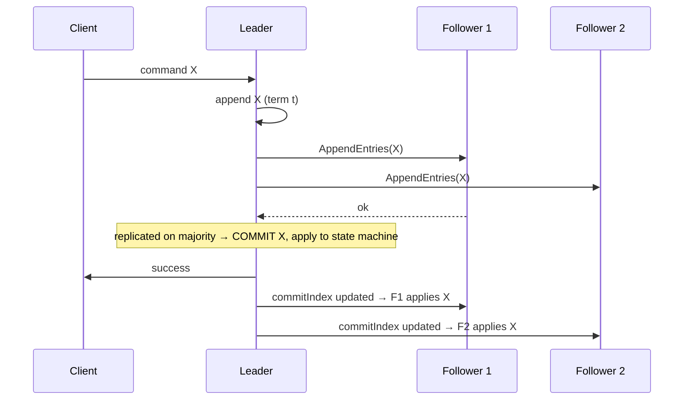

# Lesson 8.3.3 — Raft: Leader Election, Log Replication, Safety

> Part 8: Distributed Systems Core · Module 8.3: Coordination & Consensus · Difficulty: ⚫
>
> **Prerequisites:** [8.3.1 Consensus & FLP], [8.3.2 Paxos], [8.3.4 Quorums], [8.1.3 Failure Detection], [5.3.1 WAL].
> **Unlocks:** [8.3.5 Leader Election], [8.3.8 etcd/ZooKeeper], [Part 10 Replicated State Machines].

---

## 1. Learning Objectives

After this lesson you will be able to:

- Explain why **Raft** exists (consensus designed for **understandability**) and its core decomposition: **leader election**, **log replication**, and **safety** — plus membership changes.
- Describe **leader election** with **terms** and **randomized election timeouts**, and why randomization avoids split-vote livelock (8.3.1/8.3.2).
- Describe **log replication** (the leader appends, replicates via `AppendEntries`, commits on majority) and the **commitment rule** that makes Raft a **replicated state machine** (Part 10).
- State Raft's **safety properties** (Election Safety, Leader Append-Only, Log Matching, Leader Completeness, State Machine Safety) and how the **"only-up-to-date candidates can win" voting restriction** guarantees committed entries are never lost.

---

## 2. Motivation — Consensus you can actually understand and implement

Paxos (8.3.2) is correct and foundational, but its difficulty made it a poor teaching and engineering tool — production Multi-Paxos implementations were scarce, varied, and bug-prone (8.3.2 §3.8). In 2014 Ongaro and Ousterhout introduced **Raft** with an explicit, unusual design goal: **understandability**. Same guarantees as Multi-Paxos (safe consensus on a replicated log, tolerating `f` crashes with `2f+1` nodes), but structured so that engineers can **actually understand, implement, and reason about it**. The result is that Raft has become the **de facto consensus algorithm of modern infrastructure** — **etcd** (the brain of Kubernetes), **Consul**, **TiKV/TiDB**, **CockroachDB**, **MongoDB** (its replication protocol is Raft-like), and countless others use Raft or close variants.

Raft achieves understandability by **decomposing** consensus into three relatively independent pieces — **leader election**, **log replication**, and **safety** — and by making one strong design choice: a **single strong leader** that is the *sole* source of log entries (clients talk to the leader; the leader pushes entries to followers). This **"strong leader" simplification** removes the symmetric, dueling-proposer complexity of basic Paxos. Combined with **terms** (a logical clock for leadership — 8.2.1 flavored) and **randomized election timeouts** (to break symmetry — 8.1.3 jitter), Raft is both correct (always safe, FLP-respecting) and teachable. This lesson walks through the three pieces, the crucial safety property that committed entries survive leader changes, and why Raft is what you'll most likely use (via etcd/Consul) when you need consensus.

---

## 3. Theory — From first principles

### 3.1 Model: roles, terms, and the replicated log

Raft runs on `2f+1` servers, each in one of three **states** `[CS]`:
- **Leader:** handles all client requests, appends to its log, replicates to followers, decides commitment. **Exactly one** leader per term (when one exists).
- **Follower:** passive; responds to leader/candidate RPCs; redirects clients to the leader.
- **Candidate:** a follower that timed out and is trying to become leader (election).

**Terms:** time is divided into **terms** — consecutive, numbered periods, each beginning with an election. A term has **at most one leader** (or none, if an election fails). Terms act as a **logical clock** (8.2.1): every RPC carries a term; a server seeing a **higher** term immediately updates and **reverts to follower** (a stale leader steps down). Terms let Raft detect and discard obsolete leaders/messages.

Each server keeps a **log**: a sequence of **entries**, each holding a **command** (for the state machine) and the **term** in which it was created. Committed entries are applied **in order** to the **state machine** → all servers' state machines stay identical (state-machine replication — Part 10).

### 3.2 Leader election (with terms + randomized timeouts)

`[CS]`
- Followers expect periodic **heartbeats** (empty `AppendEntries`) from the leader. If a follower hears nothing within its **election timeout**, it assumes no leader exists, **increments the term**, becomes a **candidate**, votes for itself, and sends **`RequestVote`** RPCs to all servers.
- A server **grants its vote** if: the candidate's term is ≥ its own, it hasn't already voted this term, and **the candidate's log is at least as up-to-date as its own** (the crucial restriction — §3.4).
- A candidate that receives votes from a **majority** becomes **leader** and starts sending heartbeats (asserting authority, preventing new elections).
- **Split votes:** if multiple followers time out at once and split the vote, **no one gets a majority** → the term ends with no leader → new elections. To avoid *repeated* split votes (a livelock — 8.3.1), Raft uses **randomized election timeouts** (e.g., each server picks a random value in [150ms, 300ms] — *illustrative*) so that, usually, **one** server times out first, becomes candidate, and wins before others start — breaking symmetry. This is the FLP circumvention (partial synchrony + randomization — 8.3.1 §3.5) made concrete.

### 3.3 Log replication

`[CS]`
- Clients send commands to the **leader**. The leader **appends** the command to its log (with the current term), then sends **`AppendEntries`** RPCs to followers to replicate it.
- A follower appends the entry **if** its log matches the leader's up to that point (the **Log Matching** consistency check — §3.5); otherwise it rejects, and the leader **backs up** and resends earlier entries until the logs reconcile (the leader **forces followers' logs to match its own** — followers never overrule the leader; this is the strong-leader simplification).
- Once an entry is **replicated on a majority**, the leader marks it **committed**, **applies it to its state machine**, and tells followers the new **commit index** (in subsequent `AppendEntries`); followers then apply committed entries to their state machines **in log order**.
- **Result:** all servers apply the **same commands in the same order** → **identical state machines** (the definition of state-machine replication — Part 10). Clients get linearizable semantics (with proper read handling — §3.6).

### 3.4 The voting restriction — why committed entries are never lost

The single most important safety mechanism `[CS]`: **a candidate can only win if its log is at least as up-to-date as a majority of the cluster.** "Up-to-date" is defined by **(last log term, last log index)**: a log with a higher last term is more up-to-date; if terms tie, the longer log wins. A voter **refuses** to vote for a candidate whose log is **behind** its own.

**Why this guarantees Leader Completeness:** a committed entry is, by definition, on a **majority** of servers. Any new leader must win a **majority** of votes. **The two majorities overlap** (8.3.4) → the new leader's vote-granters include at least one server that has the committed entry → and since voters only support candidates **at least as up-to-date** as themselves, the **winning candidate must already have that committed entry**. Therefore **every committed entry is present in every future leader's log** — committed entries are **never lost or overwritten**, even across leader crashes. (This is Raft's version of Paxos's quorum-overlap recovery — 8.3.2 §3.5, repackaged into the election rule.)

### 3.5 Raft's safety properties

Raft guarantees five properties `[CS]`:
1. **Election Safety:** at most **one leader per term** (a candidate needs a majority; two leaders would need two overlapping majorities — impossible).
2. **Leader Append-Only:** a leader **never overwrites or deletes** its own log entries — only appends.
3. **Log Matching:** if two logs contain an entry with the **same index and term**, then the logs are **identical in all preceding entries** (enforced by the `AppendEntries` consistency check — §3.3).
4. **Leader Completeness:** if an entry is **committed** in a term, it is present in the logs of **all future leaders** (the voting restriction — §3.4).
5. **State Machine Safety:** if any server has applied an entry at a given index, **no other server applies a different entry** at that index → all state machines are identical.

Together these make Raft a **correct consensus / replicated-state-machine** protocol: **safe always** (no divergence), **live when a stable leader exists** (FLP-respecting — it can fail to elect a leader during partitions, but never produces conflicting committed entries).

### 3.6 Reads, commitment subtleties, and membership changes

`[CS]`
- **Linearizable reads:** a leader can't just answer reads from local state (it might be a deposed leader that doesn't know it). Options: route reads through the log (a no-op entry committed via majority — safe but slow), or use a **leader lease / heartbeat confirmation** (confirm leadership with a majority before serving) — common optimization.
- **Commitment subtlety:** Raft only directly commits entries **from the current term** on a majority; entries from *previous* terms are committed **indirectly** (once a current-term entry above them commits) — a subtle rule preventing a corner-case safety violation (the "Figure 8" scenario in the paper).
- **Membership changes (reconfiguration):** changing the server set risks **two disjoint majorities** (old vs new config) → split brain. Raft handles this safely via **joint consensus** (a transitional config requiring majorities of **both** old and new) or **single-server changes** (add/remove one at a time so majorities always overlap). This is **clearer than Paxos reconfiguration** (8.3.2 §7) — a key understandability win.

### 3.7 Raft vs Paxos — same guarantees, different ergonomics

`[OPINION]`/`[CS]`
- **Same core:** leader + replicated log + majority quorums + quorum-overlap recovery. Raft is essentially a **well-specified Multi-Paxos** with opinionated choices.
- **Differences for understandability:** a **strong leader** (entries flow leader→followers only; followers never have conflicting authority), **terms** as an explicit leadership clock, **randomized timeouts** for elections, an **explicit, complete spec** (election, log reconciliation, membership, snapshots), and the **up-to-date voting restriction** packaging Paxos's recovery into the election.
- **Result:** Raft is the **default modern choice** because it's implementable and verifiable; Paxos remains foundational and is used where it's already entrenched (Chubby/Spanner). For new systems needing consensus, you'll almost always **use Raft (via etcd/Consul) or a Raft library** rather than implement Paxos (8.3.1 §7, 8.3.8).

---

## 4. Visual Intuition

### Raft states and transitions

```mermaid
stateDiagram-v2
    [*] --> Follower
    Follower --> Candidate: election timeout (no heartbeat)
    Candidate --> Leader: wins majority vote
    Candidate --> Follower: discovers leader / higher term
    Candidate --> Candidate: split vote → new term, retry (randomized timeout)
    Leader --> Follower: discovers higher term (steps down)
    note right of Leader: sends heartbeats; replicates log; commits on majority
```

### Log replication & commitment

---

## 5. Real-World Analogy

Think of a **team that keeps one shared, append-only logbook**, with a single **scribe (leader)** at a time.

- **Leader election with randomized timeouts:** if the scribe stops calling out updates (heartbeats), a teammate waits a **random** short while, then stands up and says "I'll be scribe — vote for me?" The randomness means **usually one** person stands first and wins, instead of everyone jumping up at once and splitting the vote (and if they *do* split, they just retry with new random waits).
- **The "up-to-date" voting rule:** before voting for a would-be scribe, you check **"is your copy of the logbook at least as current as mine?"** You **refuse** to back someone whose logbook is behind yours. This guarantees the new scribe **already has every entry the team had agreed on** — so switching scribes **never loses agreed entries.**
- **Log replication:** the scribe writes each new line, then reads it to a **majority** of the team to copy down. Once a **majority** have it, the scribe declares it **official (committed)** and everyone acts on official lines **in order** — so every teammate's notebook ends up **identical**.
- **Terms:** each scribe's tenure is a numbered "term." If someone shows up claiming to be scribe with an **older** term number than you've seen, you ignore them; if a **newer** term appears, the current scribe **steps down**. This cleanly handles a returning old scribe who didn't realize they'd been replaced (no two scribes at once).
- **Why Raft over Paxos:** it's the *same* idea as the committee in 8.3.2, but organized so a newcomer can learn the rules in an afternoon — one scribe, numbered tenures, "only back someone as current as you," append-only book.

---

## 6. Industry Example

- **etcd (Kubernetes)** `[CONV]`: etcd uses Raft to replicate the cluster's source-of-truth key-value store — Raft is literally the brain of Kubernetes' control plane (8.3.8, Part 13). *(Representative.)*
- **Consul, TiKV/TiDB, CockroachDB, YugabyteDB** `[CONV]`: all use Raft (CockroachDB/Yugabyte run **many** Raft groups, one per data range/shard — 7.3) for replicated, strongly-consistent data (Part 18). *(Representative.)*
- **MongoDB replication** `[CONV]`: MongoDB's replica-set election/replication protocol is Raft-like (terms, elections, oplog) (5.4.2). *(Representative.)*
- **Randomized election timeouts** `[CS]`: the standard, widely-copied technique to avoid split-vote livelock (§3.2) — appears in essentially every Raft implementation. *(Representative.)*
- **Raft's understandability impact** `[OPINION]`: the proliferation of correct, open-source Raft libraries (vs the scarcity of correct Paxos) is the practical proof of its design goal (§3.7). *(Representative.)*

---

## 7. Implementation Details — Raft in practice

- **Use a proven Raft library/service** (etcd, Consul, hashicorp/raft, etcd-raft, dragonboat, …) rather than implementing from scratch — Raft is *understandable* but still subtle (commitment rule, membership, snapshots) (§3.6, 8.3.1 §7) `[BP]`.
- **Persist state durably before responding** (currentTerm, votedFor, log) via fsync/WAL (5.3.1) so a crashed-and-recovered server preserves safety (§3.1).
- **Use randomized election timeouts** well above the heartbeat interval (e.g., timeout ≫ broadcast time) to avoid split votes and spurious elections (§3.2).
- **Size `2f+1`, odd (3 or 5)** for `f` failures with clean majorities (8.3.4); 5 tolerates 2 failures (more availability) at higher latency.
- **Optimize reads** with leader leases / read-index (confirm leadership via heartbeat majority) rather than always going through the log (§3.6).
- **Snapshot the log** periodically (compact committed prefix into a state snapshot) so logs don't grow unbounded; ship snapshots to lagging/new followers (operational necessity).
- **Change membership safely** via joint consensus or single-server changes — never swap configs in a way that creates disjoint majorities (§3.6).
- **Confine Raft to a small core** (metadata/coordination) or shard into many Raft groups (one per range) for scale (CockroachDB-style) — consensus is expensive on the hot path (8.2.3, 7.3).

---

## 8. Advantages

- **Understandable & implementable** — the design goal; abundant correct implementations (§3.7).
- **Same guarantees as Multi-Paxos** — safe consensus, `f` crash tolerance with `2f+1`, replicated state machine (§3.5).
- **Strong leader simplifies reasoning** — entries flow one way; no dueling proposers (§3.7).
- **Committed entries never lost** — the up-to-date voting restriction guarantees Leader Completeness (§3.4).
- **Clear membership changes** — joint consensus / single-server changes (clearer than Paxos) (§3.6).
- **Ubiquitous** — etcd/Consul/CockroachDB/TiKV; you can adopt it via mature infrastructure (§6).

---

## 9. Disadvantages / limitations

- **FLP-bound** — can fail to elect a leader / make progress during partitions or pathological networks (safe, but may stall) (§3.2, 8.3.1).
- **Leader bottleneck** — all writes funnel through one leader → write throughput capped per Raft group (mitigate by sharding into many groups — §7, 7.3).
- **Latency cost** — majority round-trip per committed entry; cross-region Raft is slow (8.2.3).
- **Crash faults only** — not Byzantine-tolerant (need BFT — 8.3.7).
- **Subtleties remain** — commitment rule (prev-term entries), membership, snapshots, read linearizability are still easy to get wrong (use libraries) (§3.6).
- **Availability needs a majority** — loses progress without quorum (FLP/CAP — Part 10).

---

## 10. When NOT to use Raft / limits

- **Hand-rolling it** for production without deep expertise — use etcd/Consul/a library (§7).
- **When causal/eventual consistency suffices** — don't pay consensus latency where a single agreed order isn't required (8.2.3, Part 10).
- **Extreme write throughput in one group** — a single Raft group's leader is a bottleneck; shard into many groups or reconsider (§7, 7.3).
- **Byzantine settings** — use BFT (8.3.7).
- **Cross-region low-latency writes** — Raft's majority round-trip across regions is slow; consider the topology carefully (Part 10/13).

---

## 11. Common Mistakes

1. **Implementing Raft from scratch** and botching the commitment rule / membership / snapshots → safety or liveness bugs (§3.6, §7).
2. **Non-randomized (fixed) election timeouts** → repeated split votes / livelock (§3.2).
3. **Not persisting term/vote/log before replying** → a recovered server double-votes or loses entries → safety breach (§3.1, 5.3.1).
4. **Serving stale reads from a deposed leader** without lease/read-index → linearizability violation (§3.6).
5. **Unsafe membership change** (swapping configs) → two disjoint majorities → split brain (§3.6).
6. **Letting the log grow unbounded** (no snapshots) → memory/disk blowup, slow recovery (§7).
7. **Single Raft group for huge write load** → leader bottleneck (shard into groups) (§7, 7.3).
8. **Even-sized clusters** → no extra fault tolerance, 2-2 split risk (8.3.4).

---

## 12. Interview Questions

**🟢 Easy**
- What are the three server states in Raft, and what is a "term"?
- How does Raft elect a leader, and why are election timeouts randomized?

**🟡 Medium**
- Walk through log replication: how does an entry get committed, and how do followers' logs get reconciled with the leader's?
- What is the "up-to-date" voting restriction, and what safety property does it guarantee?

**🔴 Hard**
- Explain why a committed entry is never lost across leader changes (quorum overlap + voting restriction → Leader Completeness).
- How does Raft handle linearizable reads and membership changes safely? Why are these subtle?

**⚫ Staff+**
- Compare Raft and Multi-Paxos: same guarantees, what does Raft do differently for understandability, and when would you still choose Paxos? Recommend an approach for a new strongly-consistent replicated store.
- A Raft-backed system needs far more write throughput than one leader can handle. Design a sharded multi-Raft-group architecture (one group per data range), and discuss cross-group transactions (Part 11), rebalancing (7.4), and the per-group leader-bottleneck tradeoffs.

---

## 13. Production Pitfalls

- **Split-vote livelock:** fixed/too-short election timeouts cause repeated simultaneous candidacies; no leader elected; cluster stalls (§3.2).
- **Lost-commit on recovery:** a server that didn't fsync term/vote/log before responding violates safety after a crash (double vote / forgotten entry) (§3.1).
- **Stale read from old leader:** a partitioned former leader serves reads it shouldn't (doesn't know it was deposed) → linearizability violation (§3.6) — fixed by lease/read-index.
- **Membership-change split brain:** an unsafe config change creates old-vs-new disjoint majorities, electing two leaders (§3.6).
- **Log/disk blowup:** no snapshotting → unbounded log growth and very slow follower catch-up/restart (§7).
- **Leader bottleneck / hotspot:** all writes through one group's leader caps throughput; a hot Raft group saturates (shard into groups — §7, 7.3/7.4).
- **No-quorum stall:** a partition without a majority halts progress (correct per FLP/CAP, but a surprise) (§3.2, 8.3.1).

---

## 14. Optimization Techniques

- **Use mature Raft infrastructure** (etcd/Consul/libraries) — correctness + operational tooling for free (§7) `[BP]`.
- **Randomized election timeouts ≫ heartbeat interval** — avoid split votes (§3.2).
- **Leader lease / read-index reads** — linearizable reads without a full log round-trip (§3.6).
- **Batching & pipelining `AppendEntries`** — amortize round-trip cost per entry (8.3.2).
- **Log snapshotting + compaction** — bound log size, fast recovery/catch-up (§7).
- **Shard into many Raft groups** (one per range/partition) — scale writes past one leader (§7, 7.3, CockroachDB-style).
- **5-node clusters** where higher availability is worth the extra latency (tolerate 2 failures) (8.3.4).
- **Durable, fast WAL** for Raft state (§3.1, 5.3.1).

---

## 15. Summary

**Raft** is consensus **designed for understandability** — same guarantees as Multi-Paxos (safe replicated log, `f` crash tolerance with `2f+1` nodes) but decomposed into **leader election**, **log replication**, and **safety**, with a **single strong leader** simplification (entries flow leader→followers; followers never have conflicting authority). Time is divided into **terms** (a leadership logical clock; ≤1 leader per term; a higher term makes a stale leader step down). **Leader election**: followers that miss heartbeats become **candidates**, increment the term, and request votes; a **majority** wins; **randomized election timeouts** break symmetry to avoid split-vote **livelock** (the FLP circumvention — 8.3.1). **Log replication**: the leader appends a command, replicates via **`AppendEntries`**, and **commits** an entry once it's on a **majority**, then applies it to its state machine and propagates the commit index; followers reconcile their logs to the leader's and apply committed entries **in order** → **identical state machines** (state-machine replication — Part 10). The keystone is the **voting restriction**: a candidate wins only if its log is **at least as up-to-date** as the voter's — so by **quorum overlap**, any new leader **already contains every committed entry** (**Leader Completeness**), meaning committed entries are **never lost or overwritten** across leader changes (Raft's repackaging of Paxos's quorum-overlap recovery). Raft's five safety properties (Election Safety, Leader Append-Only, Log Matching, Leader Completeness, State Machine Safety) make it **safe always** and **live when a stable leader exists** (FLP-respecting — it can stall without a majority but never diverges). Subtleties remain — **linearizable reads** (leader lease/read-index), the **prev-term commitment rule**, and **safe membership changes** (joint consensus / single-server) — so **use a proven implementation** (etcd, Consul, CockroachDB/TiKV all run Raft; MongoDB is Raft-like). Raft is the **de facto modern consensus algorithm**: learn Paxos for the *why*, but you'll **build on Raft** (usually via etcd/Consul — 8.3.8) for the *how*, sharding into many Raft groups (7.3) when one leader's throughput isn't enough.

---

## 16. Revision Notes (flashcard-ready)

- **Q:** Raft's three sub-problems? **A:** Leader election, log replication, safety (+ membership changes).
- **Q:** Three states? **A:** Leader, follower, candidate.
- **Q:** What is a term? **A:** A numbered period with ≤1 leader; a leadership logical clock; higher term makes stale leaders step down.
- **Q:** How is a leader elected? **A:** Candidate increments term, requests votes; majority wins; randomized timeouts avoid split votes.
- **Q:** How does an entry commit? **A:** Leader replicates via AppendEntries; committed once on a majority; then applied to the state machine in order.
- **Q:** The voting restriction? **A:** Vote only for a candidate whose log is at least as up-to-date as yours.
- **Q:** What does it guarantee? **A:** Leader Completeness — every committed entry is in all future leaders' logs (never lost) via quorum overlap.
- **Q:** Raft's safety properties? **A:** Election Safety, Leader Append-Only, Log Matching, Leader Completeness, State Machine Safety.
- **Q:** Raft vs Paxos? **A:** Same guarantees; Raft adds strong leader, terms, randomized timeouts, explicit spec → understandable/implementable.
- **Q:** Who uses Raft? **A:** etcd (Kubernetes), Consul, CockroachDB, TiKV/TiDB, YugabyteDB; MongoDB is Raft-like.
- **Q:** How to scale writes past one leader? **A:** Shard into many Raft groups (one per range).

---

## 17. Further Reading + Knowledge-Graph Links

**Within this platform**
- **Previous:** [8.3.2 Paxos] (same guarantees, harder). **Builds on:** [8.3.1 Consensus & FLP], [8.3.4 Quorums] (majority overlap), [8.1.3 Failure Detection] (timeouts), [5.3.1 WAL] (durable state).
- **Next:** [8.3.4 Quorums], [8.3.5 Leader Election/Membership]. **Then:** [8.3.8 etcd/ZooKeeper] (Raft as a service).
- **Enables:** [Part 10 Replicated State Machines / Linearizability], [Part 13 Kubernetes/etcd], [7.3 sharded multi-Raft groups].

**Foundational texts (synthesized)**
- Ongaro & Ousterhout, "In Search of an Understandable Consensus Algorithm (Raft)" (2014) (concept, synthesized).
- Kleppmann, *Designing Data-Intensive Applications* — consensus, Raft, replicated logs (synthesized).
- etcd/Consul documentation — Raft in practice (representative).

**Concept tags:** `[CS]` leader/follower/candidate, terms, randomized election timeouts, AppendEntries, majority commit, up-to-date voting restriction, Leader Completeness, 5 safety properties · `[CONV]` etcd/Consul/CockroachDB/TiKV, Raft-like MongoDB · `[BP]` use proven libraries, durable state, randomized timeouts, snapshots, shard into many groups · `[OPINION]` Raft = understandable Paxos.
