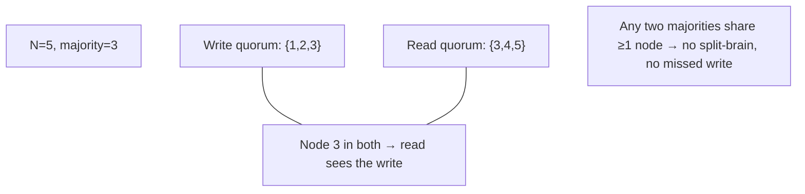
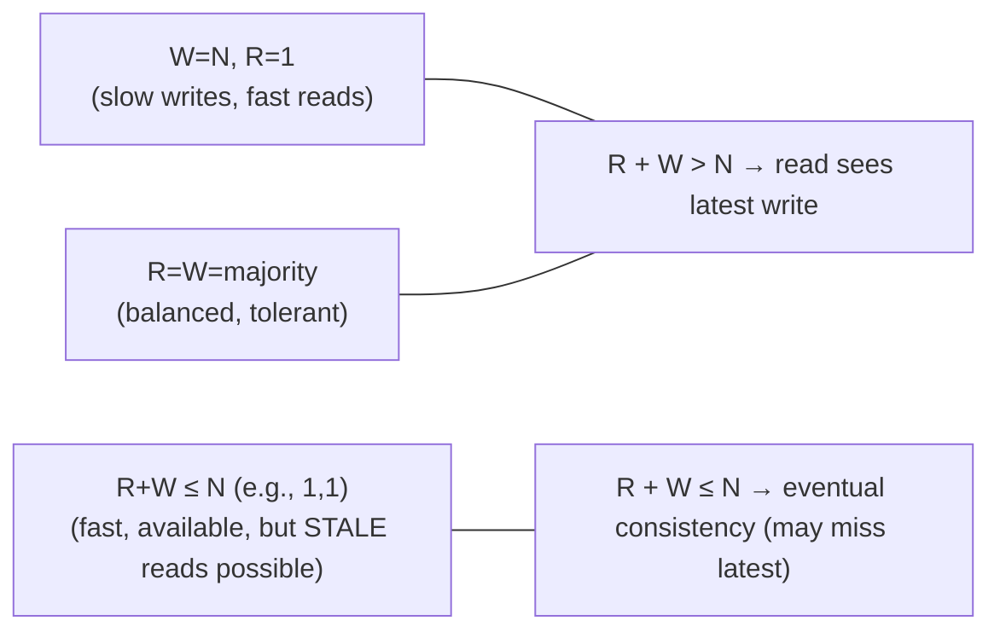

# Lesson 8.3.4 — Quorums and Read/Write Intersection (R + W > N)

> Part 8: Distributed Systems Core · Module 8.3: Coordination & Consensus · Difficulty: 🔴
>
> **Prerequisites:** [8.3.1 Consensus], [8.3.2 Paxos], [5.4.2 Replication], [8.1.1 Partitions].
> **Unlocks:** [8.3.5 Leader Election], [Part 10 Leaderless Replication / Quorum Consistency], [8.3.7 BFT quorums].

---

## 1. Learning Objectives

After this lesson you will be able to:

- Define a **quorum** (a minimum number of nodes that must participate) and explain the **intersection property** — any two quorums share at least one node — that makes quorums the workhorse of distributed agreement.
- Explain **majority quorums** (`> N/2`) and why they guarantee that any two quorums overlap, preventing split-brain (the basis of Paxos/Raft safety — 8.3.2/8.3.3).
- Apply the **Dynamo-style `R + W > N`** rule for leaderless replication (Part 10): how read and write quorums intersect to guarantee a read sees the latest write, and how tuning `R`/`W` trades consistency, availability, and latency.
- Reason about quorum **availability/fault tolerance** (why odd sizes, why `2f+1` for `f` failures), and limits (sloppy quorums, why quorums alone don't give full consistency).

---

## 2. Motivation — The one idea behind almost all distributed agreement

Quorums are the quiet workhorse beneath Paxos (8.3.2), Raft (8.3.3), leaderless replication (Dynamo/Cassandra — Part 10), and distributed locks (8.3.6). The core idea is almost embarrassingly simple, yet it's the linchpin of correctness across the field: **require a "majority-ish" subset of nodes to agree on every operation, chosen so that any two such subsets must overlap in at least one node.** That **intersection** is everything. If every write goes to a quorum and every read consults a quorum, and any write-quorum and read-quorum **share a node**, then a read **cannot miss** the latest write — the shared node has it. If leadership requires a majority vote, two would-be leaders **cannot both win** — their majorities would have to overlap, and a node won't vote twice. **Overlap turns "some nodes agree" into "the system as a whole is consistent."**

This lesson isolates and generalizes the quorum idea that earlier consensus lessons used implicitly. We'll see **majority quorums** (the `> N/2` rule behind Paxos/Raft, preventing split-brain), the **Dynamo `R + W > N`** formulation (the tunable read/write quorum that powers leaderless stores — Part 10), and the **availability math** (`2f+1` nodes to survive `f` failures, why odd cluster sizes). We'll also be honest about quorums' **limits**: a quorum guarantees *intersection*, not *full linearizable consistency* by itself (concurrent writes, sloppy quorums, and read-repair subtleties — Part 10). Understanding quorums deeply is what lets you reason about *why* consensus and replication protocols are safe, and how to tune the consistency/availability dials in real systems.

---

## 3. Theory — From first principles

### 3.1 What a quorum is

A **quorum** is the **minimum number of nodes that must participate** in an operation for it to be considered successful/valid `[CS]`. Instead of requiring **all** `N` nodes (which fails if even one is down — terrible availability) or **just one** (no agreement/consistency), a quorum is a **middle ground**: enough nodes to guarantee a needed property, but not all — so the system tolerates some failures.

The defining design goal is the **intersection property**: choose the quorum size so that **any two quorums overlap in at least one node**. That single overlapping node is what carries information/agreement between operations and prevents divergence.

### 3.2 Majority quorums and the overlap guarantee

The classic quorum is a **strict majority**: more than half the nodes, `⌊N/2⌋ + 1` `[CS]`. Why a majority guarantees intersection:
- Two majorities each have `> N/2` nodes. If they were **disjoint**, together they'd have `> N` nodes — impossible (there are only `N`). Therefore **any two majorities must share at least one node.**
- **Consequence — no split brain:** you can't have **two** disjoint majorities, so you can't have **two** leaders elected (each needs a majority), **two** different values chosen (each needs a majority — Paxos 8.3.2), or a partition where **both** sides have a majority (at most one side can — 8.1.1). The majority side can make progress; the minority side **cannot** (and correctly refuses — preserving safety, sacrificing availability on the minority side per FLP/CAP — 8.3.1, Part 10).
This is exactly the safety mechanism behind Paxos's "once chosen, always chosen" (8.3.2 §3.5) and Raft's Leader Completeness (8.3.3 §3.4).

### 3.3 Fault tolerance: `2f + 1` for `f` failures, and why odd

To tolerate `f` node failures and still have a majority available `[CS]`:
- You need `N = 2f + 1` nodes. A majority is `f + 1`. With `f` failed, `f + 1` remain → still a majority → can make progress.
- **Examples:** `N=3` tolerates `1` failure (majority 2); `N=5` tolerates `2` (majority 3); `N=7` tolerates `3`.
- **Why odd sizes** `[BP]`: going from `N=3` to `N=4` does **not** increase fault tolerance (4 still tolerates only 1 failure — majority is 3, so 2 failures = no majority) but **does** increase the quorum size (more nodes to coordinate = more latency) and adds a **2-2 split** risk (a partition with no majority on either side). So **odd `N` (3, 5, 7)** maximizes fault tolerance per node and avoids tie-splits. (5 is common when you want to tolerate 2 failures / rolling maintenance without losing quorum.)

### 3.4 Dynamo-style quorums: `R + W > N`

Leaderless replication (Dynamo/Cassandra/Riak — Part 10) generalizes quorums with **tunable read and write quorums** `[CS]`. With `N` replicas of each item:
- **`W`** = number of replicas that must **acknowledge a write** for it to succeed.
- **`R`** = number of replicas that must **respond to a read**.
- **The rule: `R + W > N`** guarantees that the **read quorum and write quorum overlap** in at least one node → that node has the latest write → **a read sees the most recent successful write** (a strong-consistency-*ish* guarantee, with caveats — §3.6).

**Why it works:** if `W` nodes have the latest write and a read consults `R` nodes, and `R + W > N`, then by the same disjointness argument the read set must include **at least one** node from the write set → the read sees the new value (and uses **versioning** — vector clocks/version vectors 8.2.2, or timestamps — to pick the latest among responses).

### 3.5 Tuning R and W (the consistency/availability/latency dials)

`R + W > N` is a **family** of configurations; you tune `R` and `W` to trade properties `[BP]`:
- **`W = N, R = 1`:** writes must hit **all** replicas (slow writes, low write availability — any replica down blocks writes), reads hit **one** (fast reads). Great for read-heavy, write-rare data.
- **`R = N, W = 1`:** fast writes (one replica), reads consult **all** (slow reads). 
- **`W = R = ⌊N/2⌋+1` (majority quorums):** balanced — both reads and writes use a majority; `R + W = N+1 > N` ✓. The common default; tolerates `f` failures with `N=2f+1`.
- **`R + W ≤ N` (e.g., `R=W=1`):** **no overlap guaranteed** → reads may **miss** the latest write → **eventual consistency** (fast, highly available, but stale reads possible — Part 10). Sometimes chosen deliberately for maximum availability/latency when staleness is acceptable.

**The dials:** larger `W` = stronger write durability/consistency but slower/less-available writes; larger `R` = fresher reads but slower/less-available reads. `R + W > N` is the threshold between "read-sees-latest-write" and "possibly stale." This is the **PACELC** tradeoff (Part 10) made tunable per operation.

### 3.6 Quorums alone ≠ full consistency (the honest caveats)

A quorum guarantees **intersection**, but **intersection alone does not give linearizability** `[CS]`. Real subtleties (developed in Part 10):
- **Concurrent writes:** two writes to overlapping quorums can be **concurrent** (8.2.2) — the overlap node sees both, but which is "latest"? Needs conflict resolution (version vectors/LWW/CRDTs — 8.2.2, 8.1.2). Quorums detect/order *sequential* writes well, not concurrent ones.
- **Partial writes:** a write that reaches some but not a full `W` (then the client crashes) leaves replicas in mixed states; later quorum reads may or may not see it (a non-atomic in-between).
- **Read repair / anti-entropy:** quorum reads typically **repair** stale replicas they encounter (write back the latest), and background anti-entropy syncs replicas — needed because quorums don't *push* writes to all replicas synchronously.
- **Sloppy quorums + hinted handoff** (§3.7) **break the intersection guarantee** for availability.
- **Leaderless quorums give "strong-ish" but not linearizable** consistency by default — you need additional mechanisms (consensus/leader) for true linearizability (Part 10). So: **majority quorums under a leader (Paxos/Raft) give linearizability; bare `R+W>N` leaderless quorums give a weaker (often "read-your-writes-ish") guarantee.**

### 3.7 Sloppy quorums and hinted handoff (availability over strictness)

To stay **available during partitions/failures**, Dynamo-style systems offer **sloppy quorums** `[CONV]` (Part 10): if the "home" replicas for a key are unreachable, the write goes to `W` **other reachable** nodes (not the usual home set), which hold the data temporarily and **hand it off** (hinted handoff) to the home replicas when they recover.
- **Benefit:** writes succeed even when many home replicas are down → higher availability.
- **Cost:** the **intersection guarantee is weakened** — a read quorum of home nodes might **not** include the temporary holders → a read can **miss** a recently "sloppily" written value until handoff completes → **stale reads** even with `R + W > N`. Sloppy quorums trade the consistency guarantee for availability — a deliberate AP choice (CAP — Part 10).

### 3.8 Where quorums show up (unifying view)

`[CS]`
- **Consensus (Paxos/Raft):** majority quorums for leader election and commit → safety via overlap (8.3.2/8.3.3).
- **Leaderless replication (Dynamo/Cassandra):** tunable `R`/`W` quorums (§3.4, Part 10).
- **Distributed locks/leases (8.3.6):** majority to grant a lock → no two holders.
- **Membership/config (8.3.5/8.3.8):** majority to agree on the node set.
- **BFT (8.3.7):** *larger* quorums (≥ `2f+1` of `3f+1`) because some nodes may lie → need overlap of **honest** nodes.
The unifying principle: **require overlapping subsets so information/agreement always propagates across operations.** Master quorums and you understand the skeleton of distributed agreement.

---

## 4. Visual Intuition

### Majority overlap (no two disjoint majorities)

### R + W > N tuning

---

## 5. Real-World Analogy

Think of a **club bylaw**: to pass any motion, you need **more than half** the members to vote yes.

- **The overlap magic:** suppose a motion passes with members {A,B,C} (a majority of 5). Later, a *contradictory* motion is proposed and needs its own majority — say {C,D,E}. **Member C is in both groups** and will say "wait, we already passed the opposite motion." Because **any two majorities must share at least one member**, the club can **never** pass two contradictory motions — there's always someone in both who remembers (this is exactly why you can't elect two presidents or choose two different values).
- **Fault tolerance / odd sizes:** with 5 members you can still hold a valid vote if **2 are absent** (3 remain = majority). With 6 members you *still* only tolerate 2 absences (you'd need 4 for a majority), and you risk a **3-3 deadlock** — so clubs prefer **odd-sized** quorums.
- **R + W > N (the records analogy):** imagine the club keeps `N` copies of its minutes. To **record** a decision you must update `W` copies; to **look up** a decision you must check `R` copies. If `R + W > N`, then **whatever copies you check must include at least one freshly-updated copy** — so you always see the latest decision. If you cut corners (`R + W ≤ N`), you might check only **stale** copies and miss a recent decision (eventual consistency).
- **Sloppy quorum:** if the usual record-keepers are unreachable (snowed in), you let **any** reachable members hold the new minutes temporarily and pass them to the official keepers later — the meeting isn't blocked (available), but someone checking only the official keepers might **not see** the new decision yet (weakened guarantee).

---

## 6. Industry Example

- **Paxos/Raft majority quorums** `[CS]`: leader election and commit require a majority → split-brain-proof (8.3.2/8.3.3); etcd/Consul/ZooKeeper run 3- or 5-node quorums (8.3.8). *(Representative.)*
- **Dynamo/Cassandra/Riak `R+W>N`** `[CONV]`: tunable consistency levels (Cassandra's `ONE`/`QUORUM`/`ALL`) implement exactly this; `QUORUM` reads+writes give `R+W>N` (Part 10). *(Representative.)*
- **Sloppy quorums + hinted handoff** `[CONV]`: Dynamo-lineage systems use them to stay available during failures, accepting weakened consistency (§3.7, Part 10). *(Representative.)*
- **Odd-sized clusters (3/5)** `[BP]`: the universal recommendation for quorum systems to maximize fault tolerance and avoid split ties (§3.3). *(Representative.)*
- **BFT quorums** `[EMERGING]`: PBFT-style protocols use larger quorums (over `3f+1` nodes) so overlap includes enough **honest** nodes despite liars (8.3.7). *(Representative.)*

---

## 7. Implementation Details — using quorums

- **Use majority quorums (`⌊N/2⌋+1`) with odd `N` (3 or 5)** for consensus/leader/lock systems — split-brain-proof, best fault tolerance per node (§3.2/3.3) `[BP]`.
- **Choose `N=5`** when you need to tolerate 2 failures (e.g., survive a node failure *during* maintenance) at the cost of higher commit latency; `N=3` for the common case (§3.3).
- **Tune `R`/`W` to the workload** in leaderless stores (§3.5): `R+W>N` (often `R=W=QUORUM`) for read-sees-latest; lower for availability/latency when staleness is acceptable; `W=N,R=1` for read-heavy immutable-ish data.
- **Don't assume `R+W>N` gives linearizability** — add versioning/conflict resolution (vector clocks — 8.2.2), read-repair, and anti-entropy; use a leader/consensus for true linearizability (§3.6, Part 10).
- **Decide on sloppy quorums explicitly** — accept weakened consistency for availability, or disable them when you need the strict intersection guarantee (§3.7).
- **Keep quorum members in independent failure domains** (racks/AZs) so a single failure can't take out a majority (Part 11/13).
- **Mind cross-region latency** — a majority round-trip spans the quorum; geo-distributed quorums are slow (place members thoughtfully — Part 10/13).

---

## 8. Advantages

- **Intersection = no split-brain / no missed write** — any two quorums overlap → safety (§3.2/3.4).
- **Fault tolerance with availability** — survive `f` failures (`N=2f+1`) while still operating (§3.3) — better than all-nodes (fragile) or one-node (no agreement).
- **Tunable (Dynamo)** — `R`/`W` dials trade consistency/availability/latency per operation (§3.5).
- **Foundational & universal** — the mechanism behind consensus, replication, locks, membership, BFT (§3.8).
- **Conceptually simple** — one counting argument explains a huge amount of distributed correctness.

---

## 9. Disadvantages / limitations

- **Quorum ≠ full consistency** — intersection alone isn't linearizability; concurrent writes, partial writes need extra mechanisms (§3.6).
- **Minority loses availability** — the side without a majority can't make progress (correct, but unavailable — FLP/CAP — §3.2, Part 10).
- **Latency cost** — every operation waits for a quorum (majority round-trip), worse across regions (§7).
- **Sloppy quorums weaken guarantees** — availability bought with possible stale reads (§3.7).
- **Even sizes waste/risk** — no extra tolerance + split-tie risk (§3.3).
- **Doesn't handle Byzantine faults** with simple majority — needs larger BFT quorums (§3.8, 8.3.7).

---

## 10. When NOT to use (strict) quorums / limits

- **When maximum availability + staleness-tolerance is the goal** — `R+W≤N` / sloppy quorums (eventual consistency) may be the right deliberate choice (§3.5/3.7, Part 10).
- **When you need true linearizability** — bare leaderless quorums aren't enough; use leader-based consensus (Paxos/Raft) (§3.6).
- **Even-sized clusters** — avoid; use odd `N` (§3.3).
- **Geo-distributed strict majorities for low-latency writes** — the round-trip may be too slow; reconsider topology/consistency (Part 10/13).
- **Byzantine settings** — simple majority is unsafe; need BFT quorums (§3.8, 8.3.7).

---

## 11. Common Mistakes

1. **Even-sized clusters** (e.g., 4, 6) → no extra fault tolerance + split-tie risk (§3.3).
2. **Assuming `R+W>N` = linearizable** → surprised by concurrent-write conflicts / partial writes / stale reads (§3.6).
3. **Forgetting conflict resolution** for concurrent quorum writes → silent data loss (use vector clocks/CRDTs — §3.6, 8.2.2).
4. **Sloppy quorum without realizing the weakened guarantee** → unexpected stale reads after failures (§3.7).
5. **Quorum members in the same failure domain** → one rack/AZ failure kills the majority (§7).
6. **Setting `R=W=1` while expecting consistency** → `R+W≤N`, eventual consistency, stale reads (§3.5).
7. **Ignoring cross-region quorum latency** → slow writes from geo-spread majorities (§7).

---

## 12. Interview Questions

**🟢 Easy**
- What is a quorum, and what is the intersection property?
- Why does a majority quorum prevent two leaders / two chosen values?

**🟡 Medium**
- Explain `R + W > N`. Why does it guarantee a read sees the latest write?
- Why are odd-sized clusters preferred, and how many failures does `N=5` tolerate?

**🔴 Hard**
- Show how to tune `R` and `W` for (a) read-heavy with strong reads, (b) write-heavy, (c) max availability with tolerable staleness. What does each cost?
- Why doesn't `R + W > N` give full linearizability? What additional mechanisms are needed (versioning, read-repair, consensus)?

**⚫ Staff+**
- Design the quorum/consistency configuration for a multi-region key-value store with mixed workloads: which operations use strict majority quorums, which use tunable `R/W`, when (if ever) sloppy quorums, and how you resolve concurrent writes and achieve read-your-writes where needed. Tie to CAP/PACELC (Part 10).
- Explain how majority quorums underpin both Paxos/Raft safety (8.3.2/8.3.3) and leaderless `R+W>N` consistency, and how BFT changes the quorum math (8.3.7). What's the single unifying principle and where does it break down?

---

## 13. Production Pitfalls

- **Even-cluster split deadlock:** a 4-node cluster partitions 2-2 → neither side has a majority → total unavailability (and a 6-node 3-3 split) (§3.3).
- **Stale reads under "quorum" config:** `R=W=1` (or sloppy quorum) deployed believing it's consistent → users see old data (§3.5/3.7).
- **Lost concurrent writes:** two quorum writes were concurrent; LWW/timestamps discarded one (no version vectors) → silent data loss (§3.6, 8.2.2, 8.1.2).
- **Majority in one AZ:** all quorum members co-located; an AZ outage removes the majority → unavailable (§7, Part 13).
- **Geo-quorum latency:** a strict majority spanning continents makes every write a cross-ocean round-trip → poor write latency (§7).
- **Minority-side surprise:** during a partition, the minority side (no majority) correctly refuses writes — operators expecting availability are surprised (it chose consistency — §3.2, Part 10).

---

## 14. Optimization Techniques

- **Odd `N` (3/5), majority quorums** — best tolerance per node, split-brain-proof (§3.2/3.3) `[BP]`.
- **Tune `R`/`W` per workload/operation** — strong where needed, available/fast where staleness is fine (§3.5).
- **Spread quorum members across failure domains** (AZs/racks) for real fault tolerance (§7, Part 13).
- **Read-repair + anti-entropy** to converge replicas and bound staleness in leaderless quorums (§3.6, Part 10).
- **Version vectors/CRDTs** for concurrent-write conflict resolution (§3.6, 8.2.2).
- **Leader leases / read-index** for cheap consistent reads in leader-based quorum systems (8.3.3).
- **Locality-aware placement** to minimize quorum round-trip latency (Part 10/13).

---

## 15. Summary

A **quorum** is the minimum number of nodes that must participate in an operation, chosen so that **any two quorums overlap in at least one node** — and that **intersection property** is the linchpin of distributed agreement. A **majority quorum** (`⌊N/2⌋+1`) guarantees overlap because two sets each `> N/2` can't be disjoint within `N` nodes — so you can never have **two disjoint majorities**, hence **no two leaders, no two chosen values, no split brain** (the safety behind Paxos 8.3.2 and Raft 8.3.3), with the minority side correctly **unable to make progress** (sacrificing availability for safety per FLP/CAP). To tolerate `f` failures you need `N = 2f+1` (majority `f+1` survives), and **odd `N` (3, 5, 7)** is preferred because even sizes add no extra tolerance while increasing quorum latency and risking split ties. Leaderless replication (Dynamo/Cassandra — Part 10) generalizes this with tunable **read (`R`) and write (`W`) quorums** over `N` replicas: the rule **`R + W > N`** forces read and write quorums to overlap → a read **sees the latest write**. Tuning the dials trades properties — `W=N,R=1` (slow consistent writes, fast reads), balanced **majority `R=W`** (the common default), or `R+W≤N` (fast, available, but **eventual consistency / stale reads possible**) — the **PACELC** tradeoff made tunable. Crucially, **quorums guarantee intersection, not full linearizability**: **concurrent writes** need conflict resolution (version vectors/CRDTs — 8.2.2), partial writes leave in-between states, and **read-repair/anti-entropy** are needed to converge replicas — and **sloppy quorums + hinted handoff** deliberately **weaken** the intersection guarantee (writes go to *any* reachable nodes) to stay available during failures, at the cost of possible stale reads. Quorums appear everywhere — consensus, leaderless replication, locks, membership, and (with larger sizes) BFT (8.3.7) — unified by one principle: **require overlapping subsets so agreement always propagates.** Master the counting argument and you understand the skeleton of distributed correctness.

---

## 16. Revision Notes (flashcard-ready)

- **Q:** What is a quorum + its key property? **A:** Minimum participating nodes, sized so any two quorums overlap in ≥1 node (intersection).
- **Q:** Majority quorum size? **A:** `⌊N/2⌋+1`; two majorities can't be disjoint → no split-brain.
- **Q:** Failures tolerated by `N`? **A:** `N = 2f+1` tolerates `f` (majority `f+1` survives); 3→1, 5→2, 7→3.
- **Q:** Why odd N? **A:** Even adds no extra tolerance, raises latency, risks split ties.
- **Q:** Dynamo rule? **A:** `R + W > N` → read & write quorums overlap → read sees the latest write.
- **Q:** `R=W=1`? **A:** `R+W≤N` → no guaranteed overlap → eventual consistency (stale reads possible).
- **Q:** Does `R+W>N` give linearizability? **A:** No — need versioning/conflict resolution, read-repair; concurrent/partial writes are caveats.
- **Q:** Sloppy quorum + hinted handoff? **A:** Write to any reachable nodes during failure (available), hand off later; weakens the intersection guarantee → possible stale reads.
- **Q:** Where do quorums appear? **A:** Consensus (Paxos/Raft), leaderless replication, locks, membership, BFT (larger quorums).
- **Q:** Unifying principle? **A:** Require overlapping subsets so agreement/info always propagates across operations.

---

## 17. Further Reading + Knowledge-Graph Links

**Within this platform**
- **Builds on:** [8.3.2 Paxos] / [8.3.3 Raft] (majority quorums = their safety), [8.1.1 Partitions] (why minority can't proceed), [5.4.2 Replication], [8.2.2 Vector Clocks] (concurrent-write resolution).
- **Next:** [8.3.5 Leader Election] (majority to elect). **Then:** [8.3.6 Locks] (majority to grant), [8.3.7 BFT] (larger quorums).
- **Enables:** [Part 10 Leaderless Replication / Quorum Consistency / Sloppy Quorums / CAP-PACELC].

**Foundational texts (synthesized)**
- DeCandia et al., *Dynamo* — R/W quorums, sloppy quorums, hinted handoff (concept, synthesized).
- Kleppmann, *Designing Data-Intensive Applications* — quorums, R+W>N, read-repair, anti-entropy (synthesized).
- Lamport, Paxos — majority quorums (concept, synthesized).

**Concept tags:** `[CS]` quorum, intersection property, majority overlap, `2f+1`, `R+W>N`, quorum≠linearizability · `[CONV]` Cassandra consistency levels, sloppy quorums/hinted handoff · `[BP]` odd N (3/5), tune R/W, spread across failure domains, add versioning/read-repair · `[EMERGING]` BFT quorums.
